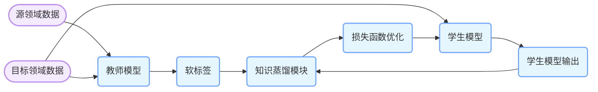

# 基于知识蒸馏的跨领域推理能力迁移技术

> 关键词：知识蒸馏、跨领域推理、能力迁移、模型压缩、深度学习

> 摘要：本文围绕基于知识蒸馏的跨领域推理能力迁移技术展开深入探讨。首先介绍了该技术的背景，包括其目的、预期读者和文档结构等内容。接着详细阐述了核心概念，通过文本示意图和 Mermaid 流程图展示其原理和架构。对核心算法原理进行了讲解，并使用 Python 源代码详细阐述具体操作步骤。同时给出了相关数学模型和公式，并举例说明。通过项目实战，从开发环境搭建到源代码实现与解读，深入分析该技术的实际应用。探讨了该技术的实际应用场景，推荐了学习、开发相关的工具和资源，包括书籍、在线课程、开发工具框架以及相关论文著作等。最后总结了该技术的未来发展趋势与挑战，并给出常见问题解答和扩展阅读参考资料，旨在为读者全面呈现基于知识蒸馏的跨领域推理能力迁移技术的全貌。

## 1. 背景介绍 
### 1.1 目的和范围
在当今的人工智能和机器学习领域，模型的性能不断提升，但同时也面临着诸多挑战。一方面，大型深度学习模型在特定领域表现出色，但计算资源消耗巨大，部署成本高昂；另一方面，不同领域的数据和任务存在差异，如何将一个领域的知识和推理能力迁移到另一个领域成为了研究的热点。基于知识蒸馏的跨领域推理能力迁移技术应运而生，其目的在于通过知识蒸馏的方法，将源领域中模型的推理能力迁移到目标领域的模型中，从而在目标领域获得更好的性能，同时降低模型的复杂度和计算成本。

本文的范围涵盖了该技术的核心概念、算法原理、数学模型、实际应用案例以及相关的工具和资源推荐等方面，旨在为读者提供一个全面深入的了解。

### 1.2 预期读者
本文的预期读者包括人工智能、机器学习领域的研究人员、工程师和开发者，以及对跨领域知识迁移和知识蒸馏技术感兴趣的学生和爱好者。对于那些希望在不同领域应用深度学习模型，提高模型性能和效率的专业人士，本文将提供有价值的参考和指导。

### 1.3 文档结构概述
本文将按照以下结构进行组织：首先介绍背景知识，让读者了解该技术的产生背景和应用场景；接着详细阐述核心概念和联系，通过示意图和流程图直观展示技术原理；然后讲解核心算法原理和具体操作步骤，结合 Python 代码进行说明；随后给出数学模型和公式，并举例说明；通过项目实战部分，展示该技术在实际中的应用和实现细节；探讨实际应用场景，让读者了解该技术的潜在价值；推荐相关的学习、开发工具和资源；最后总结未来发展趋势与挑战，给出常见问题解答和扩展阅读参考资料。

### 1.4 术语表
#### 1.4.1 核心术语定义
- **知识蒸馏（Knowledge Distillation）**：是一种模型压缩和知识迁移的技术，通过将一个大的、复杂的教师模型（Teacher Model）的知识传递给一个小的、简单的学生模型（Student Model），使得学生模型能够在保持一定性能的同时，降低计算资源的消耗。
- **跨领域推理（Cross - Domain Reasoning）**：指的是将在一个领域中学习到的推理能力应用到另一个不同领域的任务中，以提高目标领域模型的性能。
- **推理能力迁移（Reasoning Ability Transfer）**：将源领域模型所具备的推理能力通过特定的方法传递给目标领域模型，使目标领域模型能够更好地完成任务。

#### 1.4.2 相关概念解释
- **教师模型（Teacher Model）**：通常是一个在源领域中经过大量数据训练得到的大型、复杂且性能优异的模型，它包含了丰富的知识和推理能力。
- **学生模型（Student Model）**：是一个相对较小、简单的模型，通过知识蒸馏的方法从教师模型中学习知识，以在目标领域中达到较好的性能。
- **源领域（Source Domain）**：指的是教师模型进行训练的领域，该领域的数据和任务具有一定的特征和规律。
- **目标领域（Target Domain）**：是我们希望学生模型能够应用并取得良好效果的领域，与源领域可能存在数据分布、任务类型等方面的差异。

#### 1.4.3 缩略词列表
- **KD**：Knowledge Distillation（知识蒸馏）
- **MLP**：Multi - Layer Perceptron（多层感知机）
- **CNN**：Convolutional Neural Network（卷积神经网络）

## 2. 核心概念与联系 
### 核心概念原理
基于知识蒸馏的跨领域推理能力迁移技术的核心思想是利用知识蒸馏将源领域中教师模型的推理能力迁移到目标领域的学生模型中。教师模型在源领域经过大量数据的训练，已经学习到了该领域的复杂模式和推理能力。通过知识蒸馏，将教师模型的输出（如概率分布）作为软标签，引导学生模型的学习。

在跨领域的情况下，虽然源领域和目标领域存在差异，但它们之间可能存在一些潜在的关联和共性。知识蒸馏可以帮助学生模型捕捉这些共性，从而将源领域的推理能力部分地迁移到目标领域。例如，在图像分类任务中，源领域可能是自然图像分类，目标领域是医学图像分类。尽管两种图像的内容和特征有很大不同，但在图像的纹理、形状等方面可能存在一些共性，知识蒸馏可以帮助学生模型利用这些共性来提高在医学图像分类上的性能。

### 架构的文本示意图
以下是基于知识蒸馏的跨领域推理能力迁移技术的架构文本描述：

源领域中，有一个经过充分训练的教师模型。该教师模型接收源领域的数据输入，经过一系列的计算和处理，输出源领域的预测结果（概率分布）。在目标领域，有一个学生模型。目标领域的数据输入到学生模型中，同时教师模型对目标领域的数据也进行预测，得到软标签。知识蒸馏模块会计算学生模型的输出和教师模型提供的软标签之间的损失，通过优化这个损失函数，使得学生模型逐渐学习到教师模型的知识，从而实现推理能力的迁移。

### Mermaid 流程图


该流程图展示了整个基于知识蒸馏的跨领域推理能力迁移的过程。源领域数据用于训练教师模型，目标领域数据同时输入到教师模型和学生模型中。教师模型生成软标签，学生模型产生输出，知识蒸馏模块计算两者之间的损失，通过损失函数优化来更新学生模型的参数。

## 3. 核心算法原理 & 具体操作步骤 
### 核心算法原理
知识蒸馏的核心算法基于损失函数的设计，主要由两部分组成：蒸馏损失和任务损失。

蒸馏损失用于衡量学生模型的输出和教师模型的软标签之间的差异，通常使用 KL 散度（Kullback - Leibler Divergence）来计算。KL 散度可以衡量两个概率分布之间的差异，其公式为：

$$D_{KL}(P||Q)=\sum_{i}P(i)\log\frac{P(i)}{Q(i)}$$

其中 $P$ 是教师模型的软标签概率分布，$Q$ 是学生模型的输出概率分布。

任务损失是目标领域任务的原始损失函数，例如在分类任务中通常使用交叉熵损失：

$$L_{CE}=-\sum_{i}y_{i}\log(p_{i})$$

其中 $y_{i}$ 是真实标签，$p_{i}$ 是学生模型的预测概率。

最终的损失函数是蒸馏损失和任务损失的加权和：

$$L = \alpha D_{KL}(P||Q)+(1 - \alpha)L_{CE}$$

其中 $\alpha$ 是一个超参数，用于控制蒸馏损失和任务损失的相对重要性。

### 具体操作步骤（Python 代码实现）
以下是一个简单的基于知识蒸馏的跨领域推理能力迁移的 Python 代码示例，假设我们使用 PyTorch 框架，并且源领域和目标领域都是图像分类任务。

```python
import torch
import torch.nn as nn
import torch.optim as optim
from torchvision import datasets, transforms

# 定义教师模型和学生模型
class TeacherModel(nn.Module):
    def __init__(self):
        super(TeacherModel, self).__init__()
        self.fc1 = nn.Linear(784, 128)
        self.fc2 = nn.Linear(128, 10)

    def forward(self, x):
        x = x.view(-1, 784)
        x = torch.relu(self.fc1(x))
        x = self.fc2(x)
        return x

class StudentModel(nn.Module):
    def __init__(self):
        super(StudentModel, self).__init__()
        self.fc1 = nn.Linear(784, 64)
        self.fc2 = nn.Linear(64, 10)

    def forward(self, x):
        x = x.view(-1, 784)
        x = torch.relu(self.fc1(x))
        x = self.fc2(x)
        return x

# 数据加载
transform = transforms.Compose([
    transforms.ToTensor(),
    transforms.Normalize((0.1307,), (0.3081,))
])

train_dataset = datasets.MNIST('data', train=True, download=True, transform=transform)
train_loader = torch.utils.data.DataLoader(train_dataset, batch_size=64, shuffle=True)

# 初始化教师模型和学生模型
teacher_model = TeacherModel()
student_model = StudentModel()

# 定义优化器和损失函数
optimizer = optim.Adam(student_model.parameters(), lr=0.001)
criterion_ce = nn.CrossEntropyLoss()
criterion_kd = nn.KLDivLoss(reduction='batchmean')

# 知识蒸馏训练
alpha = 0.5
T = 2  # 温度参数
epochs = 10

for epoch in range(epochs):
    for data, target in train_loader:
        optimizer.zero_grad()

        # 教师模型输出
        teacher_output = teacher_model(data)
        teacher_logits = teacher_output / T
        teacher_probs = torch.softmax(teacher_logits, dim=1)

        # 学生模型输出
        student_output = student_model(data)
        student_logits = student_output / T
        student_probs = torch.softmax(student_logits, dim=1)

        # 计算蒸馏损失
        distillation_loss = criterion_kd(torch.log(student_probs), teacher_probs)

        # 计算任务损失
        task_loss = criterion_ce(student_output, target)

        # 计算总损失
        total_loss = alpha * distillation_loss + (1 - alpha) * task_loss

        # 反向传播和参数更新
        total_loss.backward()
        optimizer.step()

    print(f'Epoch {epoch + 1}/{epochs}, Loss: {total_loss.item()}')
```

### 代码解释
1. **模型定义**：定义了教师模型 `TeacherModel` 和学生模型 `StudentModel`，都是简单的全连接神经网络。
2. **数据加载**：使用 PyTorch 的 `torchvision` 库加载 MNIST 数据集作为示例数据。
3. **优化器和损失函数**：使用 Adam 优化器，交叉熵损失函数 `criterion_ce` 用于计算任务损失，KL 散度损失函数 `criterion_kd` 用于计算蒸馏损失。
4. **知识蒸馏训练**：在每个训练批次中，首先计算教师模型的输出并转换为概率分布，然后计算学生模型的输出和概率分布。接着计算蒸馏损失和任务损失，将它们加权求和得到总损失。最后通过反向传播更新学生模型的参数。

## 4. 数学模型和公式 & 详细讲解 & 举例说明 
### 数学模型和公式
#### KL 散度（Kullback - Leibler Divergence）
KL 散度是知识蒸馏中常用的度量两个概率分布差异的指标，其公式为：

$$D_{KL}(P||Q)=\sum_{i}P(i)\log\frac{P(i)}{Q(i)}$$

其中 $P$ 和 $Q$ 是两个概率分布，$P(i)$ 和 $Q(i)$ 分别是它们在第 $i$ 个类别上的概率值。KL 散度的值越大，表示两个概率分布的差异越大。

#### 交叉熵损失（Cross - Entropy Loss）
在分类任务中，交叉熵损失是常用的损失函数，其公式为：

$$L_{CE}=-\sum_{i}y_{i}\log(p_{i})$$

其中 $y_{i}$ 是真实标签的 one - hot 编码向量的第 $i$ 个元素，$p_{i}$ 是模型预测的第 $i$ 个类别的概率。

#### 最终损失函数
最终的损失函数是蒸馏损失和任务损失的加权和：

$$L = \alpha D_{KL}(P||Q)+(1 - \alpha)L_{CE}$$

其中 $\alpha$ 是一个超参数，用于控制蒸馏损失和任务损失的相对重要性，$0\leq\alpha\leq1$。

### 详细讲解
#### KL 散度
KL 散度的作用是衡量教师模型的软标签概率分布和学生模型的输出概率分布之间的差异。在知识蒸馏中，教师模型的软标签包含了更多的信息，例如类别之间的相对置信度。通过最小化 KL 散度，学生模型可以学习到教师模型的这种相对置信度信息，从而更好地拟合教师模型的知识。

#### 交叉熵损失
交叉熵损失用于衡量学生模型的输出和真实标签之间的差异，确保学生模型在目标领域的任务上能够正确分类。

#### 最终损失函数
最终损失函数将蒸馏损失和任务损失结合起来，通过调整超参数 $\alpha$，可以平衡学生模型从教师模型学习知识和在目标领域任务上的性能。当 $\alpha$ 较大时，学生模型更注重学习教师模型的知识；当 $\alpha$ 较小时，学生模型更注重在目标领域任务上的表现。

### 举例说明
假设我们有一个三分类任务，教师模型的软标签概率分布 $P=[0.1, 0.3, 0.6]$，学生模型的输出概率分布 $Q=[0.2, 0.2, 0.6]$。

首先计算 KL 散度：

$$D_{KL}(P||Q)=0.1\log\frac{0.1}{0.2}+0.3\log\frac{0.3}{0.2}+0.6\log\frac{0.6}{0.6}\approx0.057$$

假设真实标签是 $y = [0, 0, 1]$，学生模型的预测概率 $p = [0.2, 0.2, 0.6]$，则交叉熵损失为：

$$L_{CE}=-(0\times\log(0.2)+0\times\log(0.2)+1\times\log(0.6))\approx0.511$$

假设 $\alpha = 0.5$，则最终损失为：

$$L = 0.5\times0.057+(1 - 0.5)\times0.511 = 0.284$$

## 5. 项目实战：代码实际案例和详细解释说明 
### 5.1  开发环境搭建
#### 操作系统
可以选择 Linux（如 Ubuntu）、Windows 或 macOS 作为开发操作系统。不同的操作系统在安装和配置开发环境时可能会有一些细微的差别，但基本原理是相同的。

#### Python 环境
建议使用 Python 3.6 及以上版本。可以通过 Anaconda 或 Miniconda 来管理 Python 环境，这样可以方便地创建和切换不同的虚拟环境。以下是使用 Anaconda 创建虚拟环境的示例命令：

```bash
conda create -n kd_env python=3.8
conda activate kd_env
```

#### 深度学习框架
本文使用 PyTorch 作为深度学习框架，因为它具有简洁的 API 和强大的计算能力。可以根据自己的 CUDA 版本安装相应的 PyTorch 版本，例如：

```bash
pip install torch torchvision torchaudio
```

### 5.2  源代码详细实现和代码解读
以下是一个更完整的基于知识蒸馏的跨领域推理能力迁移的项目代码示例，假设源领域是 CIFAR - 10 图像分类任务，目标领域是 SVHN 图像分类任务。

```python
import torch
import torch.nn as nn
import torch.optim as optim
import torchvision
import torchvision.transforms as transforms
from torch.utils.data import DataLoader

# 定义教师模型（使用预训练的 ResNet18）
import torchvision.models as models
teacher_model = models.resnet18(pretrained=True)
num_ftrs = teacher_model.fc.in_features
teacher_model.fc = nn.Linear(num_ftrs, 10)

# 定义学生模型
class StudentModel(nn.Module):
    def __init__(self):
        super(StudentModel, self).__init__()
        self.conv1 = nn.Conv2d(3, 16, kernel_size=3, padding=1)
        self.pool = nn.MaxPool2d(2, 2)
        self.conv2 = nn.Conv2d(16, 32, kernel_size=3, padding=1)
        self.fc1 = nn.Linear(32 * 8 * 8, 128)
        self.fc2 = nn.Linear(128, 10)

    def forward(self, x):
        x = self.pool(torch.relu(self.conv1(x)))
        x = self.pool(torch.relu(self.conv2(x)))
        x = x.view(-1, 32 * 8 * 8)
        x = torch.relu(self.fc1(x))
        x = self.fc2(x)
        return x

student_model = StudentModel()

# 数据加载
transform = transforms.Compose([
    transforms.ToTensor(),
    transforms.Normalize((0.5, 0.5, 0.5), (0.5, 0.5, 0.5))
])

# 源领域数据（CIFAR - 10）
cifar10_train = torchvision.datasets.CIFAR10(root='./data', train=True,
                                             download=True, transform=transform)
cifar10_train_loader = DataLoader(cifar10_train, batch_size=64, shuffle=True)

# 目标领域数据（SVHN）
svhn_train = torchvision.datasets.SVHN(root='./data', split='train',
                                       download=True, transform=transform)
svhn_train_loader = DataLoader(svhn_train, batch_size=64, shuffle=True)

# 定义优化器和损失函数
optimizer = optim.Adam(student_model.parameters(), lr=0.001)
criterion_ce = nn.CrossEntropyLoss()
criterion_kd = nn.KLDivLoss(reduction='batchmean')

# 知识蒸馏训练
alpha = 0.5
T = 2  # 温度参数
epochs = 10

for epoch in range(epochs):
    running_loss = 0.0
    for i, (cifar10_data, svhn_data) in enumerate(zip(cifar10_train_loader, svhn_train_loader)):
        cifar10_inputs, _ = cifar10_data
        svhn_inputs, svhn_labels = svhn_data

        optimizer.zero_grad()

        # 教师模型输出（使用 CIFAR - 10 数据）
        teacher_output = teacher_model(cifar10_inputs)
        teacher_logits = teacher_output / T
        teacher_probs = torch.softmax(teacher_logits, dim=1)

        # 学生模型输出（使用 SVHN 数据）
        student_output = student_model(svhn_inputs)
        student_logits = student_output / T
        student_probs = torch.softmax(student_logits, dim=1)

        # 计算蒸馏损失
        distillation_loss = criterion_kd(torch.log(student_probs), teacher_probs)

        # 计算任务损失
        task_loss = criterion_ce(student_output, svhn_labels)

        # 计算总损失
        total_loss = alpha * distillation_loss + (1 - alpha) * task_loss

        # 反向传播和参数更新
        total_loss.backward()
        optimizer.step()

        running_loss += total_loss.item()

    print(f'Epoch {epoch + 1}/{epochs}, Loss: {running_loss / len(svhn_train_loader)}')
```

### 代码解读
1. **模型定义**：
    - 教师模型使用预训练的 ResNet18 并修改最后一层全连接层以适应 10 分类任务。
    - 学生模型是一个简单的卷积神经网络，包含两个卷积层和两个全连接层。
2. **数据加载**：
    - 加载 CIFAR - 10 数据集作为源领域数据，SVHN 数据集作为目标领域数据。
    - 使用 `DataLoader` 进行数据的批量加载。
3. **优化器和损失函数**：
    - 使用 Adam 优化器更新学生模型的参数。
    - 交叉熵损失函数 `criterion_ce` 用于计算任务损失，KL 散度损失函数 `criterion_kd` 用于计算蒸馏损失。
4. **知识蒸馏训练**：
    - 在每个训练批次中，教师模型处理 CIFAR - 10 数据，学生模型处理 SVHN 数据。
    - 计算教师模型的软标签概率分布和学生模型的输出概率分布，进而计算蒸馏损失。
    - 计算学生模型在 SVHN 数据上的任务损失。
    - 将蒸馏损失和任务损失加权求和得到总损失，通过反向传播更新学生模型的参数。

### 5.3  代码解读与分析
#### 模型复杂度
教师模型使用了预训练的 ResNet18，这是一个相对复杂的模型，具有较多的参数和较高的计算复杂度。而学生模型是一个简单的卷积神经网络，参数较少，计算复杂度较低。通过知识蒸馏，我们希望学生模型能够在保持较低复杂度的同时，学习到教师模型的推理能力。

#### 数据差异
源领域数据（CIFAR - 10）和目标领域数据（SVHN）具有不同的图像特征和分布。CIFAR - 10 包含 10 类自然图像，而 SVHN 是街景房屋号码图像。知识蒸馏的目的是帮助学生模型从教师模型中学习到一些通用的特征和推理能力，以适应目标领域数据的差异。

#### 超参数调整
超参数 $\alpha$ 和 $T$ 对知识蒸馏的效果有重要影响。$\alpha$ 控制蒸馏损失和任务损失的相对重要性，需要根据具体的任务和数据进行调整。$T$ 是温度参数，它可以平滑教师模型的软标签概率分布，使得学生模型能够学习到更多的类别之间的相对置信度信息。

## 6. 实际应用场景 
### 医疗图像分析
在医疗图像分析领域，不同类型的医疗图像（如 X 光、CT、MRI 等）具有不同的特征和诊断任务。由于标注医疗图像数据成本高且困难，我们可以在一个相对数据丰富的医疗图像领域（如 X 光图像分类）训练一个教师模型，然后通过知识蒸馏将其推理能力迁移到其他数据较少的领域（如 MRI 图像分割）的学生模型中，提高学生模型的性能。

### 自动驾驶
自动驾驶系统需要处理多种不同类型的传感器数据，如摄像头图像、激光雷达点云等。不同传感器数据的特征和处理方法存在差异。可以在摄像头图像识别任务上训练一个教师模型，然后将其知识迁移到处理激光雷达数据的学生模型中，使学生模型能够更好地融合不同传感器的数据，提高自动驾驶系统的安全性和可靠性。

### 自然语言处理
在自然语言处理中，不同的任务（如文本分类、情感分析、机器翻译等）和不同的领域（如新闻、社交媒体、医学文献等）之间存在差异。可以在一个大规模的通用语料库上训练一个教师模型，然后将其知识迁移到特定领域和任务的学生模型中，提高学生模型在特定场景下的性能。

### 工业质量检测
在工业生产中，不同产品的质量检测任务和数据特点不同。可以在一种产品的质量检测任务上训练一个教师模型，然后将其推理能力迁移到其他产品的质量检测学生模型中，减少新模型的训练时间和成本，提高检测效率和准确性。

## 7. 工具和资源推荐
### 7.1 学习资源推荐
#### 7.1.1 书籍推荐
- 《深度学习》（Deep Learning）：由 Ian Goodfellow、Yoshua Bengio 和 Aaron Courville 所著，是深度学习领域的经典教材，涵盖了深度学习的基本概念、算法和应用。
- 《动手学深度学习》（Dive into Deep Learning）：由 Aston Zhang、Zachary C. Lipton、Mu Li 和 Alexander J. Smola 所著，提供了丰富的代码示例和实践项目，适合初学者快速上手深度学习。
- 《知识蒸馏：原理与实践》（Knowledge Distillation: Principles and Practices）：专门介绍知识蒸馏技术的书籍，详细讲解了知识蒸馏的原理、算法和应用场景。

#### 7.1.2 在线课程
- Coursera 上的 “深度学习专项课程”（Deep Learning Specialization）：由 Andrew Ng 教授授课，包括深度学习的基础知识、卷积神经网络、循环神经网络等内容。
- edX 上的 “麻省理工学院：深度学习基础”（MITx: 6.S191x Introduction to Deep Learning）：由麻省理工学院的教师授课，提供了深度学习的理论和实践指导。
- 哔哩哔哩上的 “李沐的深度学习课程”：李沐老师以生动易懂的方式讲解深度学习的知识，同时提供了大量的代码演示。

#### 7.1.3 技术博客和网站
- arXiv：是一个预印本平台，包含了大量的最新学术论文，涵盖了人工智能、机器学习等领域的研究成果。
- Medium：有许多技术博客作者分享深度学习和知识蒸馏的最新技术和实践经验。
- 机器之心：提供了人工智能领域的最新资讯、技术解读和研究成果介绍。

### 7.2 开发工具框架推荐
#### 7.2.1 IDE和编辑器
- PyCharm：是一款专门为 Python 开发设计的集成开发环境，具有强大的代码编辑、调试和项目管理功能。
- Jupyter Notebook：是一个交互式的开发环境，适合进行数据分析、模型训练和实验验证，支持代码、文本、图表等多种形式的展示。
- Visual Studio Code：是一款轻量级的代码编辑器，支持多种编程语言和插件扩展，可用于深度学习项目的开发。

#### 7.2.2 调试和性能分析工具
- PyTorch Profiler：是 PyTorch 自带的性能分析工具，可以帮助开发者分析模型的计算时间、内存使用等情况，找出性能瓶颈。
- TensorBoard：是 TensorFlow 提供的可视化工具，也可以与 PyTorch 结合使用，用于可视化模型的训练过程、损失曲线、准确率等指标。
- NVIDIA Nsight Systems：是 NVIDIA 提供的性能分析工具，可用于分析 GPU 加速的深度学习模型的性能。

#### 7.2.3 相关框架和库
- PyTorch：是一个开源的深度学习框架，具有动态图、易于使用等特点，广泛应用于学术界和工业界。
- TensorFlow：是另一个流行的深度学习框架，提供了丰富的工具和库，支持分布式训练和模型部署。
- Scikit - learn：是一个用于机器学习的 Python 库，提供了各种机器学习算法和工具，可用于数据预处理、模型选择和评估等任务。

### 7.3 相关论文著作推荐
#### 7.3.1 经典论文
- “Distilling the Knowledge in a Neural Network”：由 Geoffrey Hinton 等人发表的论文，首次提出了知识蒸馏的概念，为后续的研究奠定了基础。
- “FitNets: Hints for Thin Deep Nets”：提出了 FitNets 方法，通过中间层的特征匹配来进行知识蒸馏，提高了学生模型的性能。
- “Paying More Attention to Attention: Improving the Performance of Convolutional Neural Networks via Attention Transfer”：介绍了注意力转移的方法，将教师模型的注意力信息传递给学生模型，增强了学生模型的特征表示能力。

#### 7.3.2 最新研究成果
- 关注 arXiv 上的最新论文，特别是关于跨领域知识迁移、知识蒸馏的改进算法等方面的研究。
- 阅读顶级学术会议（如 NeurIPS、ICML、CVPR 等）上的相关论文，了解该领域的最新研究动态。

#### 7.3.3 应用案例分析
- 一些工业界的技术博客和研究报告中会分享基于知识蒸馏的跨领域推理能力迁移技术的实际应用案例，例如谷歌、微软等公司的技术博客。
- 一些开源项目的文档和代码注释中也会包含相关的应用案例和分析，可在 GitHub 等代码托管平台上搜索。

## 8. 总结：未来发展趋势与挑战
### 未来发展趋势
#### 更复杂的知识迁移
未来的研究可能会探索更复杂的知识迁移方式，不仅局限于模型的输出概率分布，还会考虑模型的中间层特征、注意力机制等信息的迁移，以实现更高效的跨领域推理能力迁移。

#### 与其他技术的融合
知识蒸馏技术可能会与其他机器学习技术（如强化学习、生成对抗网络等）相结合，产生新的方法和应用。例如，将知识蒸馏应用于强化学习中，加速智能体的学习过程。

#### 跨模态知识迁移
随着多模态数据（如图像、文本、音频等）的广泛应用，跨模态知识迁移将成为一个重要的研究方向。通过知识蒸馏，可以将一种模态的知识迁移到另一种模态的模型中，提高模型在多模态任务中的性能。

#### 自动化知识蒸馏
研究人员可能会开发自动化的知识蒸馏方法，自动调整超参数、选择合适的教师模型和学生模型结构，降低知识蒸馏的使用门槛，提高其在实际应用中的效率。

### 挑战
#### 领域差异处理
如何更好地处理源领域和目标领域之间的巨大差异是一个挑战。不同领域的数据分布、任务类型等可能存在很大的不同，需要开发更有效的方法来捕捉领域之间的共性，同时适应目标领域的特点。

#### 教师模型选择
选择合适的教师模型对于知识蒸馏的效果至关重要。但在实际应用中，可能存在多个候选教师模型，如何选择最优的教师模型是一个需要解决的问题。

#### 可解释性
知识蒸馏技术的可解释性相对较差，难以理解学生模型是如何从教师模型中学习到知识的。提高知识蒸馏的可解释性，有助于更好地应用该技术，并保证模型的可靠性和安全性。

#### 计算资源需求
虽然知识蒸馏的目的之一是降低模型的计算复杂度，但在某些情况下，知识蒸馏过程本身可能需要大量的计算资源，特别是当教师模型和学生模型都比较复杂时。如何在保证知识蒸馏效果的同时，减少计算资源的需求是一个挑战。

## 9. 附录：常见问题与解答
### 问题 1：知识蒸馏中的温度参数 $T$ 有什么作用？
答：温度参数 $T$ 用于平滑教师模型的软标签概率分布。在计算蒸馏损失时，将教师模型和学生模型的输出除以温度参数 $T$，然后再进行 softmax 操作。当 $T$ 较大时，概率分布会更加平滑，类别之间的差异会减小，学生模型可以学习到更多的类别之间的相对置信度信息；当 $T$ 较小时，概率分布会更加尖锐，学生模型更注重教师模型预测的最高概率类别。

### 问题 2：如何选择超参数 $\alpha$？
答：超参数 $\alpha$ 控制蒸馏损失和任务损失的相对重要性。选择 $\alpha$ 需要根据具体的任务和数据进行实验和调整。一般来说，如果目标领域的数据较少，希望学生模型更多地学习教师模型的知识，可以将 $\alpha$ 设置得较大；如果目标领域的数据较多，学生模型可以通过自身的学习较好地完成任务，可以将 $\alpha$ 设置得较小。

### 问题 3：知识蒸馏是否适用于所有类型的模型？
答：知识蒸馏适用于大多数类型的深度学习模型，包括全连接神经网络、卷积神经网络、循环神经网络等。但不同类型的模型在知识蒸馏过程中可能需要进行一些调整和优化。例如，对于卷积神经网络，可以考虑中间层的特征匹配；对于循环神经网络，可以考虑序列信息的传递。

### 问题 4：如何评估知识蒸馏的效果？
答：可以使用目标领域的测试数据集来评估知识蒸馏的效果。常用的评估指标包括准确率、召回率、F1 值等。同时，可以比较学生模型在使用知识蒸馏前后的性能，以及与其他方法的性能对比，来综合评估知识蒸馏的效果。

## 10. 扩展阅读 & 参考资料
### 扩展阅读
- 《人工智能：一种现代的方法》（Artificial Intelligence: A Modern Approach）：全面介绍了人工智能的各个领域，包括机器学习、知识表示、推理等内容，有助于读者建立更全面的人工智能知识体系。
- 《深度学习实战》（Deep Learning in Practice）：提供了大量的深度学习实践案例，包括图像识别、自然语言处理等领域，适合读者进一步深入学习和实践。

### 参考资料
- Hinton, G., Vinyals, O., & Dean, J. (2015). Distilling the Knowledge in a Neural Network. arXiv preprint arXiv:1503.02531.
- Romero, A., Ballas, N., Kahou, S. E., Chassang, A., Gatta, C., & Bengio, Y. (2014). FitNets: Hints for Thin Deep Nets. arXiv preprint arXiv:1412.6550.
- Zagoruyko, S., & Komodakis, N. (2016). Paying More Attention to Attention: Improving the Performance of Convolutional Neural Networks via Attention Transfer. arXiv preprint arXiv:1612.03928.

作者：AI天才研究院/AI Genius Institute & 禅与计算机程序设计艺术 /Zen And The Art of Computer Programming