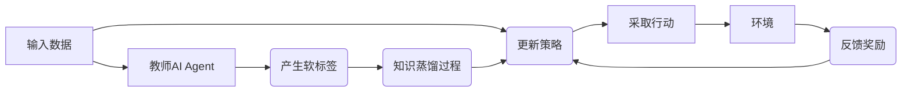

# 基于知识蒸馏的轻量级AI Agent

> 关键词：知识蒸馏、轻量级AI Agent、模型压缩、人工智能、强化学习

> 摘要：本文聚焦于基于知识蒸馏的轻量级AI Agent这一前沿主题。首先介绍了研究背景，包括目的、预期读者、文档结构和相关术语。接着阐述了核心概念，如知识蒸馏和AI Agent的原理及联系，并给出了对应的示意图和流程图。详细讲解了核心算法原理，通过Python代码展示具体操作步骤。引入数学模型和公式来深入剖析知识蒸馏过程，并举例说明。在项目实战部分，给出开发环境搭建步骤、源代码实现与解读。探讨了实际应用场景，推荐了学习资源、开发工具框架和相关论文著作。最后总结未来发展趋势与挑战，还提供了常见问题解答和扩展阅读参考资料，旨在为读者全面呈现基于知识蒸馏构建轻量级AI Agent的技术体系。

## 1. 背景介绍 
### 1.1 目的和范围
随着人工智能技术的飞速发展，AI Agent在各个领域得到了广泛应用。然而，许多复杂的AI Agent模型存在计算资源消耗大、部署成本高的问题，限制了其在资源受限环境中的应用。本文的目的是探讨如何利用知识蒸馏技术构建轻量级AI Agent，以降低模型的复杂度和资源需求，同时保持较好的性能。范围涵盖知识蒸馏的原理、轻量级AI Agent的构建方法、实际应用场景以及相关的工具和资源。

### 1.2 预期读者
本文预期读者包括人工智能领域的研究人员、开发者、对AI Agent技术感兴趣的学生以及从事相关行业的专业人士。希望通过本文的阐述，能帮助读者了解基于知识蒸馏的轻量级AI Agent的技术原理和实现方法，为其在实际项目中的应用提供参考。

### 1.3 文档结构概述
本文将按照以下结构进行阐述：首先介绍核心概念与联系，包括知识蒸馏和AI Agent的原理及它们之间的关系；接着详细讲解核心算法原理和具体操作步骤，通过Python代码进行说明；引入数学模型和公式来深入理解知识蒸馏过程；进行项目实战，展示开发环境搭建、源代码实现和代码解读；探讨实际应用场景；推荐相关的工具和资源；最后总结未来发展趋势与挑战，提供常见问题解答和扩展阅读参考资料。

### 1.4 术语表
#### 1.4.1 核心术语定义
- **知识蒸馏（Knowledge Distillation）**：是一种模型压缩技术，通过将一个大型、复杂的教师模型（Teacher Model）的知识转移到一个小型、简单的学生模型（Student Model）中，使学生模型能够在保持较好性能的同时，降低计算资源消耗和模型复杂度。
- **AI Agent（人工智能代理）**：是一种能够感知环境、进行决策并采取行动以实现特定目标的智能实体。它可以是软件程序、机器人等，在不同领域有着广泛的应用。
- **教师模型（Teacher Model）**：在知识蒸馏中，是一个相对复杂、性能较好的模型，用于向学生模型传递知识。
- **学生模型（Student Model）**：是一个相对简单、轻量级的模型，通过学习教师模型的知识来提高自身性能。

#### 1.4.2 相关概念解释
- **模型压缩**：是指通过各种技术手段，如知识蒸馏、剪枝、量化等，减小模型的规模和计算量，同时保持模型的性能。
- **强化学习**：是一种机器学习方法，智能体通过与环境进行交互，根据环境反馈的奖励信号来学习最优的行为策略。在AI Agent的设计中，强化学习经常被用于训练Agent的决策能力。

#### 1.4.3 缩略词列表
- **KD**：Knowledge Distillation（知识蒸馏）
- **RL**：Reinforcement Learning（强化学习）

## 2. 核心概念与联系 
### 知识蒸馏原理
知识蒸馏的核心思想是将教师模型的知识传递给学生模型。教师模型通常是一个经过大量数据训练的复杂模型，具有较高的性能。学生模型则是一个相对简单的模型，其目标是通过学习教师模型的输出，来逼近教师模型的性能。

在知识蒸馏过程中，教师模型和学生模型同时接收输入数据。教师模型产生的输出被称为软标签（Soft Labels），它包含了比硬标签（Hard Labels）更多的信息。硬标签通常是一个类别标签，而软标签则是每个类别的概率分布。学生模型的训练目标是最小化其输出与教师模型软标签之间的差异。

### AI Agent原理
AI Agent是一个能够感知环境、进行决策并采取行动的智能实体。它通常由三个主要部分组成：感知模块、决策模块和行动模块。感知模块负责收集环境信息，决策模块根据感知到的信息进行决策，行动模块则根据决策结果采取相应的行动。

在强化学习中，AI Agent通过与环境进行交互，根据环境反馈的奖励信号来学习最优的行为策略。Agent的目标是最大化长期累积奖励。

### 知识蒸馏与AI Agent的联系
将知识蒸馏应用于AI Agent的构建中，可以有效地降低AI Agent模型的复杂度和资源需求。通过将一个复杂的教师AI Agent的知识蒸馏到一个轻量级的学生AI Agent中，学生AI Agent可以在保持较好性能的同时，减少计算资源的消耗。这样，轻量级AI Agent可以更方便地部署在资源受限的环境中，如移动设备、嵌入式系统等。

### 文本示意图
```plaintext
教师AI Agent（复杂模型）
|
| 产生软标签
|
v
知识蒸馏过程
|
| 传递知识
|
v
学生AI Agent（轻量级模型）
```

### Mermaid流程图


## 3. 核心算法原理 & 具体操作步骤 
### 知识蒸馏算法原理
知识蒸馏的核心是最小化学生模型输出与教师模型软标签之间的差异。通常使用的损失函数是交叉熵损失函数。设教师模型的输出为 $T$，学生模型的输出为 $S$，则知识蒸馏的损失函数可以表示为：

$$L_{KD} = \text{CrossEntropy}(S, T)$$

其中，$\text{CrossEntropy}$ 是交叉熵损失函数。

### 具体操作步骤
以下是基于知识蒸馏构建轻量级AI Agent的具体操作步骤：

1. **训练教师AI Agent**：使用大量数据和强化学习算法训练一个复杂的教师AI Agent，使其具有较好的性能。

2. **构建学生AI Agent**：设计一个轻量级的学生AI Agent模型，其结构相对简单，计算资源消耗较低。

3. **知识蒸馏过程**：
    - 同时将输入数据输入到教师AI Agent和学生AI Agent中。
    - 教师AI Agent产生软标签。
    - 计算学生AI Agent输出与教师模型软标签之间的知识蒸馏损失 $L_{KD}$。
    - 使用优化算法（如随机梯度下降）更新学生AI Agent的参数，以最小化 $L_{KD}$。

### Python代码实现
```python
import torch
import torch.nn as nn
import torch.optim as optim

# 定义教师模型
class TeacherAgent(nn.Module):
    def __init__(self, input_size, output_size):
        super(TeacherAgent, self).__init__()
        self.fc1 = nn.Linear(input_size, 128)
        self.fc2 = nn.Linear(128, output_size)

    def forward(self, x):
        x = torch.relu(self.fc1(x))
        x = self.fc2(x)
        return x

# 定义学生模型
class StudentAgent(nn.Module):
    def __init__(self, input_size, output_size):
        super(StudentAgent, self).__init__()
        self.fc1 = nn.Linear(input_size, 64)
        self.fc2 = nn.Linear(64, output_size)

    def forward(self, x):
        x = torch.relu(self.fc1(x))
        x = self.fc2(x)
        return x

# 训练教师模型
def train_teacher_agent(teacher, optimizer, criterion, data_loader, epochs):
    teacher.train()
    for epoch in range(epochs):
        for inputs, labels in data_loader:
            optimizer.zero_grad()
            outputs = teacher(inputs)
            loss = criterion(outputs, labels)
            loss.backward()
            optimizer.step()

# 知识蒸馏过程
def knowledge_distillation(teacher, student, optimizer, criterion, data_loader, epochs):
    student.train()
    for epoch in range(epochs):
        for inputs, _ in data_loader:
            optimizer.zero_grad()
            teacher_outputs = teacher(inputs)
            student_outputs = student(inputs)
            loss = criterion(student_outputs, teacher_outputs)
            loss.backward()
            optimizer.step()

# 示例代码
input_size = 10
output_size = 5
teacher = TeacherAgent(input_size, output_size)
student = StudentAgent(input_size, output_size)

# 定义优化器和损失函数
teacher_optimizer = optim.Adam(teacher.parameters(), lr=0.001)
student_optimizer = optim.Adam(student.parameters(), lr=0.001)
criterion = nn.CrossEntropyLoss()

# 模拟数据加载器
data_loader = [(torch.randn(32, input_size), torch.randint(0, output_size, (32,))) for _ in range(10)]

# 训练教师模型
train_teacher_agent(teacher, teacher_optimizer, criterion, data_loader, epochs=10)

# 进行知识蒸馏
knowledge_distillation(teacher, student, student_optimizer, criterion, data_loader, epochs=10)
```

## 4. 数学模型和公式 & 详细讲解 & 举例说明 
### 交叉熵损失函数
交叉熵损失函数是知识蒸馏中常用的损失函数，用于衡量两个概率分布之间的差异。设 $p$ 是真实概率分布，$q$ 是预测概率分布，则交叉熵损失函数定义为：

$$H(p, q) = -\sum_{i} p_i \log(q_i)$$

在知识蒸馏中，$p$ 是教师模型的软标签，$q$ 是学生模型的输出。

### 详细讲解
交叉熵损失函数的直观理解是，它衡量了使用预测分布 $q$ 来编码真实分布 $p$ 所需的平均比特数。当 $q$ 与 $p$ 完全相同时，交叉熵损失最小，为 0。

在知识蒸馏过程中，通过最小化交叉熵损失，学生模型可以学习到教师模型的软标签信息，从而逼近教师模型的性能。

### 举例说明
假设我们有一个三分类问题，教师模型的软标签为 $p = [0.1, 0.3, 0.6]$，学生模型的输出为 $q = [0.2, 0.2, 0.6]$。则交叉熵损失为：

$$H(p, q) = -(0.1 \log(0.2) + 0.3 \log(0.2) + 0.6 \log(0.6)) \approx 0.916$$

通过不断调整学生模型的参数，使得交叉熵损失逐渐减小，学生模型的输出会越来越接近教师模型的软标签。

## 5. 项目实战：代码实际案例和详细解释说明 
### 5.1  开发环境搭建
为了实现基于知识蒸馏的轻量级AI Agent，我们需要搭建相应的开发环境。以下是具体步骤：

1. **安装Python**：推荐使用Python 3.7及以上版本。可以从Python官方网站（https://www.python.org/downloads/）下载并安装。

2. **安装深度学习框架**：我们使用PyTorch作为深度学习框架。可以通过以下命令安装：
```bash
pip install torch torchvision
```

3. **安装其他依赖库**：根据具体需求，可能还需要安装其他依赖库，如NumPy、Matplotlib等。可以使用以下命令安装：
```bash
pip install numpy matplotlib
```

### 5.2  源代码详细实现和代码解读
以下是一个完整的基于知识蒸馏的轻量级AI Agent的源代码示例：

```python
import torch
import torch.nn as nn
import torch.optim as optim
import numpy as np

# 定义教师模型
class TeacherAgent(nn.Module):
    def __init__(self, input_size, output_size):
        super(TeacherAgent, self).__init__()
        self.fc1 = nn.Linear(input_size, 128)
        self.fc2 = nn.Linear(128, output_size)

    def forward(self, x):
        x = torch.relu(self.fc1(x))
        x = self.fc2(x)
        return x

# 定义学生模型
class StudentAgent(nn.Module):
    def __init__(self, input_size, output_size):
        super(StudentAgent, self).__init__()
        self.fc1 = nn.Linear(input_size, 64)
        self.fc2 = nn.Linear(64, output_size)

    def forward(self, x):
        x = torch.relu(self.fc1(x))
        x = self.fc2(x)
        return x

# 训练教师模型
def train_teacher_agent(teacher, optimizer, criterion, data_loader, epochs):
    teacher.train()
    for epoch in range(epochs):
        running_loss = 0.0
        for inputs, labels in data_loader:
            optimizer.zero_grad()
            outputs = teacher(inputs)
            loss = criterion(outputs, labels)
            loss.backward()
            optimizer.step()
            running_loss += loss.item()
        print(f'Epoch {epoch + 1}, Loss: {running_loss / len(data_loader)}')

# 知识蒸馏过程
def knowledge_distillation(teacher, student, optimizer, criterion, data_loader, epochs):
    student.train()
    for epoch in range(epochs):
        running_loss = 0.0
        for inputs, _ in data_loader:
            optimizer.zero_grad()
            teacher_outputs = teacher(inputs)
            student_outputs = student(inputs)
            loss = criterion(student_outputs, teacher_outputs)
            loss.backward()
            optimizer.step()
            running_loss += loss.item()
        print(f'Epoch {epoch + 1}, Knowledge Distillation Loss: {running_loss / len(data_loader)}')

# 生成模拟数据
def generate_data(num_samples, input_size, output_size):
    inputs = torch.randn(num_samples, input_size)
    labels = torch.randint(0, output_size, (num_samples,))
    return inputs, labels

# 主函数
def main():
    input_size = 10
    output_size = 5
    num_samples = 1000
    batch_size = 32
    epochs = 10

    # 生成数据
    inputs, labels = generate_data(num_samples, input_size, output_size)
    data_loader = [(inputs[i:i+batch_size], labels[i:i+batch_size]) for i in range(0, num_samples, batch_size)]

    # 初始化教师模型和学生模型
    teacher = TeacherAgent(input_size, output_size)
    student = StudentAgent(input_size, output_size)

    # 定义优化器和损失函数
    teacher_optimizer = optim.Adam(teacher.parameters(), lr=0.001)
    student_optimizer = optim.Adam(student.parameters(), lr=0.001)
    criterion = nn.CrossEntropyLoss()

    # 训练教师模型
    print('Training Teacher Agent...')
    train_teacher_agent(teacher, teacher_optimizer, criterion, data_loader, epochs)

    # 进行知识蒸馏
    print('Performing Knowledge Distillation...')
    knowledge_distillation(teacher, student, student_optimizer, criterion, data_loader, epochs)

if __name__ == '__main__':
    main()
```

### 代码解读与分析
1. **模型定义**：
    - `TeacherAgent` 是一个相对复杂的教师模型，包含两个全连接层，中间使用ReLU激活函数。
    - `StudentAgent` 是一个轻量级的学生模型，同样包含两个全连接层，但隐藏层的神经元数量较少。

2. **训练教师模型**：
    - `train_teacher_agent` 函数用于训练教师模型。在每个epoch中，遍历数据加载器，计算损失并更新模型参数。

3. **知识蒸馏过程**：
    - `knowledge_distillation` 函数实现了知识蒸馏过程。在每个epoch中，将输入数据同时输入到教师模型和学生模型中，计算学生模型输出与教师模型软标签之间的损失，并更新学生模型的参数。

4. **数据生成**：
    - `generate_data` 函数用于生成模拟数据，包括输入数据和标签。

5. **主函数**：
    - `main` 函数是程序的入口，负责初始化模型、定义优化器和损失函数、生成数据、训练教师模型和进行知识蒸馏。

通过上述代码，我们可以看到如何使用知识蒸馏技术将教师模型的知识传递给学生模型，从而构建轻量级AI Agent。

## 6. 实际应用场景 
### 移动设备应用
在移动设备上，由于计算资源和电池续航的限制，需要使用轻量级的AI Agent。通过知识蒸馏，可以将复杂的AI Agent模型压缩成轻量级的学生模型，部署在移动设备上，实现智能语音助手、图像识别、智能推荐等功能。

### 嵌入式系统应用
嵌入式系统通常具有有限的计算资源和存储容量。基于知识蒸馏的轻量级AI Agent可以在嵌入式系统中运行，如智能家居设备、智能摄像头、工业控制设备等，实现智能感知、决策和控制功能。

### 实时决策系统
在实时决策系统中，如自动驾驶、金融交易等，需要快速做出决策。轻量级AI Agent可以在保证决策准确性的同时，提高决策速度，满足实时性要求。

### 边缘计算
边缘计算强调在数据源附近进行数据处理和分析，以减少数据传输延迟。轻量级AI Agent可以部署在边缘设备上，实现本地的智能决策和数据处理，提高系统的效率和可靠性。

## 7. 工具和资源推荐
### 7.1 学习资源推荐
#### 7.1.1 书籍推荐
- 《深度学习》（Deep Learning）：由Ian Goodfellow、Yoshua Bengio和Aaron Courville撰写，是深度学习领域的经典教材，涵盖了深度学习的基本原理、算法和应用。
- 《强化学习：原理与Python实现》：详细介绍了强化学习的基本概念、算法和应用，通过Python代码进行实现和讲解。

#### 7.1.2 在线课程
- Coursera上的“深度学习专项课程”（Deep Learning Specialization）：由Andrew Ng教授授课，包括神经网络和深度学习、改善深层神经网络、结构化机器学习项目、卷积神经网络、序列模型等课程。
- edX上的“强化学习基础”（Fundamentals of Reinforcement Learning）：介绍了强化学习的基本概念、算法和应用。

#### 7.1.3 技术博客和网站
- Medium上的Towards Data Science：发布了许多关于人工智能、机器学习和深度学习的技术文章和教程。
- 机器之心：提供了人工智能领域的最新技术动态、研究成果和应用案例。

### 7.2 开发工具框架推荐
#### 7.2.1 IDE和编辑器
- PyCharm：是一款专门为Python开发设计的集成开发环境，具有代码编辑、调试、代码分析等功能。
- Jupyter Notebook：是一个交互式的开发环境，适合进行数据探索、模型训练和可视化。

#### 7.2.2 调试和性能分析工具
- TensorBoard：是TensorFlow的可视化工具，可以用于监控模型训练过程、可视化模型结构和分析性能指标。
- PyTorch Profiler：可以帮助开发者分析PyTorch模型的性能瓶颈，优化代码。

#### 7.2.3 相关框架和库
- PyTorch：是一个开源的深度学习框架，具有动态图机制，易于使用和调试。
- OpenAI Gym：是一个用于开发和比较强化学习算法的工具包，提供了许多经典的强化学习环境。

### 7.3 相关论文著作推荐
#### 7.3.1 经典论文
- “Distilling the Knowledge in a Neural Network”：由Geoffrey Hinton等人发表，首次提出了知识蒸馏的概念。
- “Human-level control through deep reinforcement learning”：由DeepMind团队发表，介绍了使用深度强化学习实现Atari游戏的人类水平控制。

#### 7.3.2 最新研究成果
- 可以关注顶级学术会议如NeurIPS、ICML、CVPR等的最新研究成果，了解基于知识蒸馏的轻量级AI Agent的最新进展。

#### 7.3.3 应用案例分析
- 可以参考相关的工业界应用案例，了解基于知识蒸馏的轻量级AI Agent在实际项目中的应用和效果。

## 8. 总结：未来发展趋势与挑战
### 未来发展趋势
- **多模态知识蒸馏**：未来的研究可能会将知识蒸馏扩展到多模态数据，如图像、文本、音频等，以构建更加智能和通用的轻量级AI Agent。
- **自适应知识蒸馏**：开发自适应的知识蒸馏方法，根据不同的任务和环境，自动调整知识蒸馏的参数和策略，提高轻量级AI Agent的性能和灵活性。
- **与其他技术的融合**：将知识蒸馏与其他模型压缩技术（如剪枝、量化）、强化学习算法（如策略梯度算法、值函数算法）等相结合，进一步提高轻量级AI Agent的性能和效率。

### 挑战
- **知识迁移的有效性**：如何确保教师模型的知识能够有效地迁移到学生模型中，是知识蒸馏面临的一个重要挑战。需要研究更加有效的知识表示和迁移方法。
- **模型性能的平衡**：在降低模型复杂度和资源需求的同时，如何保持轻量级AI Agent的性能，是一个需要权衡的问题。需要开发更加精细的模型设计和训练方法。
- **数据隐私和安全**：在知识蒸馏过程中，可能会涉及到敏感数据的使用和传输，需要解决数据隐私和安全问题，确保用户数据的安全和隐私。

## 9. 附录：常见问题与解答
### 问题1：知识蒸馏一定会提高学生模型的性能吗？
不一定。知识蒸馏的效果取决于多个因素，如教师模型的性能、学生模型的结构、知识蒸馏的方法和参数等。在某些情况下，知识蒸馏可能无法提高学生模型的性能，甚至可能导致性能下降。因此，需要根据具体情况选择合适的知识蒸馏方法和参数。

### 问题2：如何选择合适的教师模型和学生模型？
选择教师模型时，应选择性能较好、复杂度较高的模型。教师模型可以是经过大量数据训练的预训练模型，也可以是在特定任务上训练的复杂模型。选择学生模型时，应根据实际需求和资源限制，选择结构相对简单、计算资源消耗较低的模型。

### 问题3：知识蒸馏和模型剪枝、量化有什么区别？
知识蒸馏是通过将教师模型的知识传递给学生模型来降低模型复杂度和资源需求；模型剪枝是通过删除模型中不重要的连接或神经元来减小模型规模；量化是通过降低模型参数的精度来减少模型的存储和计算需求。这三种技术可以相互结合使用，以进一步提高模型的压缩效果。

## 10. 扩展阅读 & 参考资料
- Hinton, G., Vinyals, O., & Dean, J. (2015). Distilling the Knowledge in a Neural Network. arXiv preprint arXiv:1503.02531.
- Mnih, V., Kavukcuoglu, K., Silver, D., Rusu, A. A., Veness, J., Bellemare, M. G.,... & Hassabis, D. (2015). Human-level control through deep reinforcement learning. Nature, 518(7540), 529-533.
- Goodfellow, I. J., Bengio, Y., & Courville, A. (2016). Deep Learning. MIT press.

作者：AI天才研究院/AI Genius Institute & 禅与计算机程序设计艺术 /Zen And The Art of Computer Programming