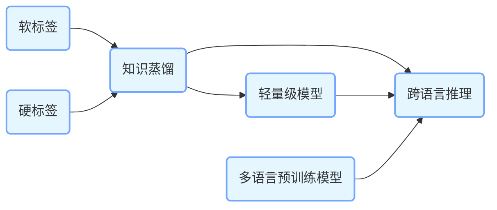

# 基于知识蒸馏的轻量级跨语言推理模型

> 关键词：知识蒸馏、轻量级模型、跨语言推理、自然语言处理、深度学习

> 摘要：本文聚焦于基于知识蒸馏的轻量级跨语言推理模型。首先介绍了相关背景，包括研究目的、适用读者群体、文档结构和术语定义。接着阐述了核心概念及它们之间的联系，给出了原理和架构的文本示意图与 Mermaid 流程图。详细讲解了核心算法原理，并通过 Python 代码进行说明。探讨了相关的数学模型和公式，辅以具体例子。通过项目实战展示了代码的实际应用，包括开发环境搭建、源代码实现和解读。分析了该模型的实际应用场景，推荐了学习资源、开发工具框架以及相关论文著作。最后总结了未来发展趋势与挑战，还提供了常见问题解答和扩展阅读参考资料，旨在为该领域的研究和实践提供全面的指导。

## 1. 背景介绍 
### 1.1 目的和范围
在当今全球化的时代，跨语言交流和信息处理变得至关重要。自然语言推理（Natural Language Inference, NLI）是自然语言处理中的一个核心任务，旨在判断两个句子之间的逻辑关系，如蕴含、矛盾或中立。然而，现有的跨语言推理模型通常较为庞大，需要大量的计算资源和存储空间，这限制了它们在资源受限环境下的应用，如移动设备和边缘计算设备。

本研究的目的是开发一种基于知识蒸馏的轻量级跨语言推理模型，以在保证一定推理性能的前提下，显著减少模型的大小和计算复杂度。研究范围涵盖了知识蒸馏技术的应用、轻量级模型架构的设计、跨语言数据的处理以及模型性能的评估。

### 1.2 预期读者
本文主要面向自然语言处理领域的研究人员、开发者和学生。对于希望了解跨语言推理技术、知识蒸馏方法以及轻量级模型设计的读者，本文将提供有价值的参考。同时，对于在资源受限环境下开展自然语言处理应用开发的工程师，也能从本文中获取实用的技术和方法。

### 1.3 文档结构概述
本文将按照以下结构进行组织：
- 核心概念与联系：介绍知识蒸馏、轻量级模型和跨语言推理的核心概念，并阐述它们之间的联系。
- 核心算法原理 & 具体操作步骤：详细讲解基于知识蒸馏的轻量级跨语言推理模型的算法原理，并给出具体的操作步骤，同时使用 Python 代码进行说明。
- 数学模型和公式 & 详细讲解 & 举例说明：给出模型的数学模型和相关公式，并进行详细讲解，辅以具体的例子。
- 项目实战：代码实际案例和详细解释说明：通过一个实际的项目案例，展示如何实现基于知识蒸馏的轻量级跨语言推理模型，包括开发环境搭建、源代码实现和代码解读。
- 实际应用场景：分析该模型在实际中的应用场景。
- 工具和资源推荐：推荐学习资源、开发工具框架和相关论文著作。
- 总结：未来发展趋势与挑战：总结基于知识蒸馏的轻量级跨语言推理模型的未来发展趋势和面临的挑战。
- 附录：常见问题与解答：提供常见问题的解答。
- 扩展阅读 & 参考资料：提供扩展阅读的建议和相关参考资料。

### 1.4 术语表
#### 1.4.1 核心术语定义
- **知识蒸馏（Knowledge Distillation）**：一种模型压缩技术，通过将一个大型的教师模型（Teacher Model）的知识转移到一个小型的学生模型（Student Model）中，使得学生模型能够在保持一定性能的前提下，减少模型的大小和计算复杂度。
- **轻量级模型（Lightweight Model）**：指模型的参数数量较少、计算复杂度较低的模型，通常适用于资源受限的环境。
- **跨语言推理（Cross-lingual Inference）**：在不同语言之间进行自然语言推理的任务，即判断不同语言的句子之间的逻辑关系。
- **自然语言推理（Natural Language Inference, NLI）**：判断两个句子之间的逻辑关系，如蕴含、矛盾或中立。
- **教师模型（Teacher Model）**：在知识蒸馏中，通常是一个大型的、性能较好的模型，用于提供知识给学生模型。
- **学生模型（Student Model）**：在知识蒸馏中，是一个小型的、需要学习教师模型知识的模型。

#### 1.4.2 相关概念解释
- **软标签（Soft Labels）**：教师模型输出的概率分布，包含了更多的信息，用于指导学生模型的学习。
- **硬标签（Hard Labels）**：真实的类别标签，通常用于监督学习。
- **注意力机制（Attention Mechanism）**：一种在深度学习中广泛应用的技术，用于自动地关注输入序列中的重要部分。

#### 1.4.3 缩略词列表
- **NLI**：Natural Language Inference，自然语言推理
- **KL**：Kullback-Leibler，用于衡量两个概率分布之间的差异。

## 2. 核心概念与联系 

### 知识蒸馏原理
知识蒸馏的核心思想是将教师模型的知识转移到学生模型中。教师模型通常是一个大型的、经过充分训练的模型，具有较高的性能。学生模型则是一个小型的、需要学习教师模型知识的模型。

在知识蒸馏过程中，教师模型和学生模型同时对输入数据进行处理。教师模型输出一个概率分布，称为软标签，这个概率分布包含了更多的信息，不仅指出了最可能的类别，还给出了其他类别的可能性。学生模型的目标是学习教师模型的软标签，而不是仅仅学习真实的硬标签。

### 轻量级模型架构
轻量级模型通常采用一些技术来减少模型的参数数量和计算复杂度，如剪枝、量化和使用轻量级的神经网络架构。常见的轻量级神经网络架构包括 MobileNet、ShuffleNet 等，这些架构在计算机视觉领域取得了很好的效果。在自然语言处理领域，也有一些轻量级的模型架构被提出，如 ALBERT、DistilBERT 等。

### 跨语言推理机制
跨语言推理需要解决不同语言之间的语义鸿沟问题。一种常见的方法是使用多语言预训练模型，如 mBERT、XLM-R 等，这些模型在多种语言的大规模语料上进行了预训练，能够学习到不同语言之间的共享语义表示。在进行跨语言推理时，可以将不同语言的输入句子通过多语言预训练模型进行编码，然后在编码后的表示上进行推理。

### 核心概念联系示意图


### 文本示意图解释
知识蒸馏是将教师模型的知识转移到学生模型的关键技术，它对轻量级模型的训练起到了重要作用，帮助轻量级模型在减少参数和计算复杂度的同时，保持较好的性能。轻量级模型则是跨语言推理在资源受限环境下应用的基础。跨语言推理需要利用多语言预训练模型来解决不同语言之间的语义鸿沟问题。软标签和硬标签在知识蒸馏过程中都起到了指导学生模型学习的作用。

## 3. 核心算法原理 & 具体操作步骤 

### 核心算法原理
基于知识蒸馏的轻量级跨语言推理模型的核心算法主要包括以下几个步骤：

1. **教师模型训练**：首先，使用大规模的跨语言推理数据集对一个大型的多语言预训练模型进行微调，得到教师模型。教师模型能够在跨语言推理任务上取得较好的性能。
2. **学生模型设计**：设计一个轻量级的模型架构，如基于 Transformer 的小型模型。学生模型的参数数量和计算复杂度要远小于教师模型。
3. **知识蒸馏过程**：在知识蒸馏过程中，同时将输入数据输入到教师模型和学生模型中。教师模型输出软标签，即每个类别的概率分布。学生模型的损失函数由两部分组成：
    - **蒸馏损失**：衡量学生模型输出的概率分布与教师模型输出的软标签之间的差异，通常使用 KL 散度（Kullback-Leibler Divergence）来计算。
    - **交叉熵损失**：衡量学生模型输出的概率分布与真实硬标签之间的差异。

最终的损失函数是蒸馏损失和交叉熵损失的加权和：

$$L = \alpha \cdot KL(p_t, p_s) + (1 - \alpha) \cdot CE(p_s, y)$$

其中，$L$ 是最终的损失函数，$\alpha$ 是蒸馏损失的权重，$KL(p_t, p_s)$ 是教师模型输出的软标签 $p_t$ 与学生模型输出的概率分布 $p_s$ 之间的 KL 散度，$CE(p_s, y)$ 是学生模型输出的概率分布 $p_s$ 与真实硬标签 $y$ 之间的交叉熵损失。

### 具体操作步骤及 Python 代码实现

```python
import torch
import torch.nn as nn
import torch.optim as optim
from transformers import AutoTokenizer, AutoModelForSequenceClassification

# 步骤 1: 加载教师模型和学生模型
teacher_model_name = "xlm-roberta-large"
student_model_name = "distilbert-base-multilingual-cased"

tokenizer_teacher = AutoTokenizer.from_pretrained(teacher_model_name)
teacher_model = AutoModelForSequenceClassification.from_pretrained(teacher_model_name, num_labels=3)

tokenizer_student = AutoTokenizer.from_pretrained(student_model_name)
student_model = AutoModelForSequenceClassification.from_pretrained(student_model_name, num_labels=3)

# 步骤 2: 定义损失函数和优化器
alpha = 0.5
kl_loss = nn.KLDivLoss(reduction="batchmean")
ce_loss = nn.CrossEntropyLoss()
optimizer = optim.Adam(student_model.parameters(), lr=1e-5)

# 步骤 3: 知识蒸馏训练循环
num_epochs = 10
for epoch in range(num_epochs):
    # 假设我们有一个跨语言推理数据集 train_dataloader
    for batch in train_dataloader:
        input_ids = batch["input_ids"]
        attention_mask = batch["attention_mask"]
        labels = batch["labels"]

        # 教师模型前向传播
        teacher_outputs = teacher_model(input_ids=input_ids, attention_mask=attention_mask)
        teacher_logits = teacher_outputs.logits
        teacher_probs = torch.softmax(teacher_logits, dim=1)

        # 学生模型前向传播
        student_outputs = student_model(input_ids=input_ids, attention_mask=attention_mask)
        student_logits = student_outputs.logits
        student_probs = torch.softmax(student_logits, dim=1)

        # 计算蒸馏损失和交叉熵损失
        distillation_loss = kl_loss(torch.log(student_probs), teacher_probs)
        cross_entropy_loss = ce_loss(student_logits, labels)

        # 计算最终损失
        loss = alpha * distillation_loss + (1 - alpha) * cross_entropy_loss

        # 反向传播和参数更新
        optimizer.zero_grad()
        loss.backward()
        optimizer.step()

    print(f"Epoch {epoch+1}/{num_epochs}, Loss: {loss.item()}")
```

### 代码解释
1. **模型加载**：使用 `transformers` 库加载教师模型和学生模型，以及对应的分词器。
2. **损失函数和优化器定义**：定义蒸馏损失（KL 散度）、交叉熵损失和 Adam 优化器。
3. **训练循环**：在每个 epoch 中，对训练数据集中的每个批次进行处理。教师模型和学生模型分别进行前向传播，计算蒸馏损失和交叉熵损失，然后将它们加权求和得到最终损失。最后进行反向传播和参数更新。

## 4. 数学模型和公式 & 详细讲解 & 举例说明 

### 数学模型和公式

#### KL 散度（Kullback-Leibler Divergence）
KL 散度用于衡量两个概率分布之间的差异。设 $p$ 和 $q$ 是两个离散概率分布，它们的 KL 散度定义为：

$$KL(p || q) = \sum_{i} p(i) \log \frac{p(i)}{q(i)}$$

在知识蒸馏中，$p$ 是教师模型输出的软标签，$q$ 是学生模型输出的概率分布。KL 散度的值越小，说明两个概率分布越接近。

#### 交叉熵损失（Cross Entropy Loss）
交叉熵损失用于衡量模型输出的概率分布与真实标签之间的差异。设 $p$ 是模型输出的概率分布，$y$ 是真实标签的 one-hot 编码，交叉熵损失定义为：

$$CE(p, y) = - \sum_{i} y(i) \log p(i)$$

#### 最终损失函数
最终的损失函数是蒸馏损失和交叉熵损失的加权和：

$$L = \alpha \cdot KL(p_t, p_s) + (1 - \alpha) \cdot CE(p_s, y)$$

其中，$\alpha$ 是蒸馏损失的权重，$0 \leq \alpha \leq 1$。

### 详细讲解
- **KL 散度**：KL 散度是一种非对称的度量，它衡量了使用分布 $q$ 来近似分布 $p$ 时所损失的信息。在知识蒸馏中，我们希望学生模型的输出概率分布尽可能接近教师模型的输出概率分布，因此使用 KL 散度来衡量它们之间的差异。
- **交叉熵损失**：交叉熵损失是监督学习中常用的损失函数，它衡量了模型输出的概率分布与真实标签之间的差异。在知识蒸馏中，交叉熵损失确保学生模型能够学习到真实的类别标签。
- **最终损失函数**：通过加权求和的方式将蒸馏损失和交叉熵损失结合起来，使得学生模型既能够学习到教师模型的知识，又能够学习到真实的类别标签。

### 举例说明
假设我们有一个三分类的跨语言推理任务，教师模型对一个输入样本的输出概率分布为 $p_t = [0.1, 0.8, 0.1]$，学生模型的输出概率分布为 $p_s = [0.2, 0.7, 0.1]$，真实标签为 $y = [0, 1, 0]$。

#### 计算 KL 散度
$$KL(p_t || p_s) = 0.1 \log \frac{0.1}{0.2} + 0.8 \log \frac{0.8}{0.7} + 0.1 \log \frac{0.1}{0.1} \approx 0.035$$

#### 计算交叉熵损失
$$CE(p_s, y) = - (0 \log 0.2 + 1 \log 0.7 + 0 \log 0.1) \approx 0.357$$

#### 计算最终损失
假设 $\alpha = 0.5$，则最终损失为：

$$L = 0.5 \times 0.035 + (1 - 0.5) \times 0.357 = 0.196$$

## 5. 项目实战：代码实际案例和详细解释说明 

### 5.1  开发环境搭建
#### 安装必要的库
我们需要安装 `transformers`、`torch` 等库来实现基于知识蒸馏的轻量级跨语言推理模型。可以使用以下命令进行安装：

```bash
pip install transformers torch datasets
```

#### 准备数据集
我们可以使用 `datasets` 库来加载跨语言推理数据集，如 XNLI 数据集。以下是加载 XNLI 数据集的代码：

```python
from datasets import load_dataset

dataset = load_dataset("xnli", "all_languages")
train_dataset = dataset["train"]
validation_dataset = dataset["validation"]
test_dataset = dataset["test"]
```

### 5.2  源代码详细实现和代码解读
```python
import torch
import torch.nn as nn
import torch.optim as optim
from transformers import AutoTokenizer, AutoModelForSequenceClassification
from datasets import load_dataset
from torch.utils.data import DataLoader
from tqdm.auto import tqdm

# 加载数据集
dataset = load_dataset("xnli", "all_languages")
train_dataset = dataset["train"]
validation_dataset = dataset["validation"]
test_dataset = dataset["test"]

# 加载教师模型和学生模型
teacher_model_name = "xlm-roberta-large"
student_model_name = "distilbert-base-multilingual-cased"

tokenizer_teacher = AutoTokenizer.from_pretrained(teacher_model_name)
teacher_model = AutoModelForSequenceClassification.from_pretrained(teacher_model_name, num_labels=3)

tokenizer_student = AutoTokenizer.from_pretrained(student_model_name)
student_model = AutoModelForSequenceClassification.from_pretrained(student_model_name, num_labels=3)

# 定义数据处理函数
def preprocess_function(examples):
    inputs = tokenizer_student(
        examples["premise"],
        examples["hypothesis"],
        truncation=True,
        padding="max_length",
        max_length=128
    )
    inputs["labels"] = examples["label"]
    return inputs

# 处理数据集
train_dataset = train_dataset.map(preprocess_function, batched=True)
validation_dataset = validation_dataset.map(preprocess_function, batched=True)
test_dataset = test_dataset.map(preprocess_function, batched=True)

# 设置数据集格式
train_dataset.set_format(type="torch", columns=["input_ids", "attention_mask", "labels"])
validation_dataset.set_format(type="torch", columns=["input_ids", "attention_mask", "labels"])
test_dataset.set_format(type="torch", columns=["input_ids", "attention_mask", "labels"])

# 创建数据加载器
train_dataloader = DataLoader(train_dataset, batch_size=16, shuffle=True)
validation_dataloader = DataLoader(validation_dataset, batch_size=16, shuffle=False)
test_dataloader = DataLoader(test_dataset, batch_size=16, shuffle=False)

# 定义损失函数和优化器
alpha = 0.5
kl_loss = nn.KLDivLoss(reduction="batchmean")
ce_loss = nn.CrossEntropyLoss()
optimizer = optim.Adam(student_model.parameters(), lr=1e-5)

# 知识蒸馏训练循环
num_epochs = 10
device = torch.device("cuda" if torch.cuda.is_available() else "cpu")
teacher_model.to(device)
student_model.to(device)

for epoch in range(num_epochs):
    student_model.train()
    total_loss = 0
    for batch in tqdm(train_dataloader, desc=f"Epoch {epoch+1}/{num_epochs}"):
        input_ids = batch["input_ids"].to(device)
        attention_mask = batch["attention_mask"].to(device)
        labels = batch["labels"].to(device)

        # 教师模型前向传播
        teacher_model.eval()
        with torch.no_grad():
            teacher_outputs = teacher_model(input_ids=input_ids, attention_mask=attention_mask)
            teacher_logits = teacher_outputs.logits
            teacher_probs = torch.softmax(teacher_logits, dim=1)

        # 学生模型前向传播
        student_outputs = student_model(input_ids=input_ids, attention_mask=attention_mask)
        student_logits = student_outputs.logits
        student_probs = torch.softmax(student_logits, dim=1)

        # 计算蒸馏损失和交叉熵损失
        distillation_loss = kl_loss(torch.log(student_probs), teacher_probs)
        cross_entropy_loss = ce_loss(student_logits, labels)

        # 计算最终损失
        loss = alpha * distillation_loss + (1 - alpha) * cross_entropy_loss

        # 反向传播和参数更新
        optimizer.zero_grad()
        loss.backward()
        optimizer.step()

        total_loss += loss.item()

    print(f"Epoch {epoch+1}/{num_epochs}, Loss: {total_loss / len(train_dataloader)}")

    # 验证模型
    student_model.eval()
    correct_predictions = 0
    total_predictions = 0
    with torch.no_grad():
        for batch in validation_dataloader:
            input_ids = batch["input_ids"].to(device)
            attention_mask = batch["attention_mask"].to(device)
            labels = batch["labels"].to(device)

            student_outputs = student_model(input_ids=input_ids, attention_mask=attention_mask)
            student_logits = student_outputs.logits
            predictions = torch.argmax(student_logits, dim=1)

            correct_predictions += (predictions == labels).sum().item()
            total_predictions += labels.size(0)

    accuracy = correct_predictions / total_predictions
    print(f"Validation Accuracy: {accuracy}")

# 测试模型
student_model.eval()
correct_predictions = 0
total_predictions = 0
with torch.no_grad():
    for batch in test_dataloader:
        input_ids = batch["input_ids"].to(device)
        attention_mask = batch["attention_mask"].to(device)
        labels = batch["labels"].to(device)

        student_outputs = student_model(input_ids=input_ids, attention_mask=attention_mask)
        student_logits = student_outputs.logits
        predictions = torch.argmax(student_logits, dim=1)

        correct_predictions += (predictions == labels).sum().item()
        total_predictions += labels.size(0)

accuracy = correct_predictions / total_predictions
print(f"Test Accuracy: {accuracy}")
```

### 5.3  代码解读与分析
1. **数据集加载和处理**：使用 `datasets` 库加载 XNLI 数据集，并使用 `tokenizer_student` 对数据集进行预处理，将输入文本转换为模型可以接受的输入格式。
2. **模型加载**：加载教师模型和学生模型，并将它们移动到 GPU 上（如果可用）。
3. **数据加载器创建**：使用 `DataLoader` 创建训练、验证和测试数据加载器，方便批量处理数据。
4. **损失函数和优化器定义**：定义蒸馏损失（KL 散度）、交叉熵损失和 Adam 优化器。
5. **训练循环**：在每个 epoch 中，对训练数据进行遍历，教师模型和学生模型分别进行前向传播，计算蒸馏损失和交叉熵损失，然后将它们加权求和得到最终损失。最后进行反向传播和参数更新。
6. **验证和测试**：在每个 epoch 结束后，对验证集进行评估，计算验证集的准确率。训练完成后，对测试集进行评估，计算测试集的准确率。

## 6. 实际应用场景 
### 跨语言信息检索
在跨语言信息检索系统中，用户可能使用不同的语言进行查询。基于知识蒸馏的轻量级跨语言推理模型可以帮助系统判断查询语句与文档之间的逻辑关系，从而提高检索的准确性。例如，当用户使用中文查询“苹果公司的新产品有哪些”时，系统可以使用该模型判断英文文档中是否包含相关的信息。

### 国际商务谈判辅助
在国际商务谈判中，各方使用不同的语言进行交流。该模型可以实时分析不同语言的谈判文本之间的逻辑关系，帮助谈判人员理解对方的意图，发现潜在的矛盾或蕴含关系，从而更好地制定谈判策略。

### 跨语言社交媒体分析
社交媒体上的内容涉及多种语言。通过使用该模型，可以对不同语言的社交媒体文本进行推理分析，例如判断用户的观点是支持还是反对某个话题，从而帮助企业了解全球市场的舆论动态。

### 智能翻译辅助
在智能翻译系统中，该模型可以用于判断翻译后的句子与原文之间的逻辑一致性。如果翻译后的句子与原文在逻辑上存在矛盾，系统可以及时提醒用户进行调整，提高翻译的质量。

## 7. 工具和资源推荐
### 7.1 学习资源推荐
#### 7.1.1 书籍推荐
- 《自然语言处理入门》：介绍了自然语言处理的基本概念、方法和技术，适合初学者入门。
- 《深度学习》：深度学习领域的经典教材，涵盖了神经网络、优化算法等方面的内容。
- 《Transformer 神经网络：从理论到实战》：深入讲解了 Transformer 架构的原理和应用，对于理解基于 Transformer 的跨语言推理模型很有帮助。

#### 7.1.2 在线课程
- Coursera 上的“Natural Language Processing Specialization”：由斯坦福大学的教授授课，全面介绍了自然语言处理的各个方面。
- edX 上的“Deep Learning for Natural Language Processing”：重点讲解了深度学习在自然语言处理中的应用。
- B 站的“自然语言处理入门课程”：适合初学者，讲解通俗易懂。

#### 7.1.3 技术博客和网站
- Hugging Face Blog：提供了关于自然语言处理、深度学习等领域的最新技术和研究成果。
- Medium 上的 Towards Data Science：有很多关于自然语言处理的优质文章。
- arXiv.org：可以查找最新的学术论文。

### 7.2 开发工具框架推荐
#### 7.2.1 IDE和编辑器
- PyCharm：功能强大的 Python 集成开发环境，支持代码调试、自动补全、版本控制等功能。
- Visual Studio Code：轻量级的代码编辑器，支持多种编程语言，有丰富的插件扩展。

#### 7.2.2 调试和性能分析工具
- PyTorch Profiler：用于分析 PyTorch 模型的性能，找出性能瓶颈。
- TensorBoard：可以可视化模型的训练过程和性能指标。

#### 7.2.3 相关框架和库
- Transformers：由 Hugging Face 开发的自然语言处理库，提供了丰富的预训练模型和工具。
- TorchText：PyTorch 官方的自然语言处理库，方便进行数据处理和模型训练。
- AllenNLP：一个用于自然语言处理的深度学习框架，提供了很多实用的工具和模型。

### 7.3 相关论文著作推荐
#### 7.3.1 经典论文
- “Distilling the Knowledge in a Neural Network”：知识蒸馏领域的经典论文，首次提出了知识蒸馏的概念。
- “BERT: Pre-training of Deep Bidirectional Transformers for Language Understanding”：介绍了 BERT 模型的预训练方法，对自然语言处理领域产生了深远的影响。
- “Unsupervised Cross-lingual Representation Learning at Scale”：提出了 XLM-R 模型，是跨语言预训练模型的重要成果。

#### 7.3.2 最新研究成果
- 关注 ACL、EMNLP 等自然语言处理领域的顶级会议，这些会议上会发表很多关于跨语言推理和知识蒸馏的最新研究成果。
- 关注 arXiv 上的最新论文，及时了解该领域的研究动态。

#### 7.3.3 应用案例分析
- 可以在各大科技公司的技术博客上查找基于知识蒸馏的轻量级跨语言推理模型的应用案例，了解这些模型在实际场景中的应用效果和挑战。

## 8. 总结：未来发展趋势与挑战
### 未来发展趋势
- **模型性能提升**：随着研究的不断深入，基于知识蒸馏的轻量级跨语言推理模型的性能将不断提升，能够在更多的语言和更复杂的任务上取得更好的效果。
- **多模态融合**：未来的模型可能会融合文本、图像、语音等多种模态的信息，实现更全面的跨语言推理。
- **自适应知识蒸馏**：研究自适应的知识蒸馏方法，根据不同的任务和数据动态调整蒸馏策略，提高模型的泛化能力。
- **边缘计算应用**：随着边缘计算技术的发展，轻量级跨语言推理模型将在边缘设备上得到更广泛的应用，实现实时的跨语言处理。

### 挑战
- **语义鸿沟问题**：不同语言之间的语义鸿沟仍然是跨语言推理的一个挑战，需要进一步研究如何更好地解决这个问题。
- **知识蒸馏效率**：提高知识蒸馏的效率，减少训练时间和计算资源的消耗，是一个需要解决的问题。
- **数据稀缺问题**：在一些低资源语言上，缺乏足够的标注数据，这会影响模型的性能。需要研究如何利用少量数据进行有效的跨语言推理。
- **模型可解释性**：提高模型的可解释性，让用户能够理解模型的推理过程和决策依据，是一个重要的挑战。

## 9. 附录：常见问题与解答
### 问题 1：知识蒸馏中的软标签有什么作用？
软标签包含了教师模型对各个类别的概率分布信息，不仅指出了最可能的类别，还给出了其他类别的可能性。通过学习软标签，学生模型可以学习到更多的知识，提高模型的泛化能力。

### 问题 2：如何选择知识蒸馏中的权重 $\alpha$？
权重 $\alpha$ 的选择需要根据具体的任务和数据集进行调整。一般来说，可以通过实验的方法，尝试不同的 $\alpha$ 值，选择在验证集上性能最好的 $\alpha$。

### 问题 3：轻量级模型的性能会比大型模型差很多吗？
在采用知识蒸馏等技术后，轻量级模型可以在一定程度上接近大型模型的性能。虽然轻量级模型的参数数量和计算复杂度较低，但通过学习教师模型的知识，能够在保证一定性能的前提下，实现模型的压缩。

### 问题 4：跨语言推理模型在处理低资源语言时效果如何？
跨语言推理模型在处理低资源语言时可能会面临一些挑战，因为缺乏足够的标注数据。可以采用一些方法来缓解这个问题，如使用多语言预训练模型、数据增强等。

## 10. 扩展阅读 & 参考资料
### 扩展阅读
- 阅读更多关于知识蒸馏、轻量级模型和跨语言推理的研究论文，深入了解相关技术的原理和应用。
- 学习其他自然语言处理任务，如文本分类、命名实体识别等，拓宽知识面。
- 关注自然语言处理领域的最新技术动态，如强化学习在自然语言处理中的应用。

### 参考资料
- [Hugging Face Documentation](https://huggingface.co/docs)
- [PyTorch Documentation](https://pytorch.org/docs/stable/index.html)
- [Datasets Documentation](https://huggingface.co/docs/datasets/index)

作者：AI天才研究院/AI Genius Institute & 禅与计算机程序设计艺术 /Zen And The Art of Computer Programming