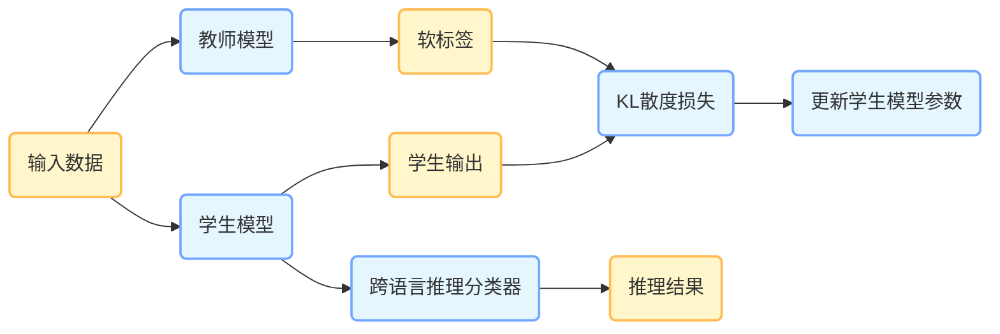

# 基于知识蒸馏的轻量级跨语言推理模型设计

> 关键词：知识蒸馏、轻量级模型、跨语言推理、自然语言处理、模型设计

> 摘要：本文聚焦于基于知识蒸馏的轻量级跨语言推理模型设计。首先介绍了研究的背景、目的、预期读者等内容，随后阐述了核心概念及联系，包括知识蒸馏和跨语言推理的原理与架构。详细讲解了核心算法原理，用Python代码进行了示例。深入探讨了相关数学模型和公式，并举例说明。通过项目实战，给出了开发环境搭建、源代码实现及解读。分析了该模型的实际应用场景，推荐了学习资源、开发工具框架和相关论文著作。最后总结了未来发展趋势与挑战，解答了常见问题并提供了扩展阅读和参考资料，旨在为相关领域的研究者和开发者提供全面且深入的技术指导。

## 1. 背景介绍 
### 1.1 目的和范围
随着全球化的发展，跨语言交流和信息处理变得越来越重要。自然语言推理（NLI）作为自然语言处理中的核心任务之一，旨在判断两个句子之间的逻辑关系（如蕴含、矛盾、中性）。然而，现有的跨语言推理模型往往存在模型参数多、计算资源消耗大等问题，不利于在资源受限的设备上部署。

本研究的目的是设计一种基于知识蒸馏的轻量级跨语言推理模型，在保证一定推理性能的前提下，减少模型的参数数量和计算复杂度，提高模型的效率和可移植性。研究范围涵盖了知识蒸馏技术的应用、轻量级模型架构的设计、跨语言推理任务的实现以及模型的评估和优化。

### 1.2 预期读者
本文的预期读者包括自然语言处理领域的研究者、人工智能工程师、对跨语言技术感兴趣的开发者以及相关专业的学生。对于希望了解知识蒸馏技术、轻量级模型设计和跨语言推理的读者来说，本文将提供有价值的技术信息和实践指导。

### 1.3 文档结构概述
本文将按照以下结构进行组织：
1. **背景介绍**：阐述研究的目的、预期读者和文档结构，以及相关术语的定义。
2. **核心概念与联系**：介绍知识蒸馏和跨语言推理的核心概念，给出原理和架构的文本示意图和Mermaid流程图。
3. **核心算法原理 & 具体操作步骤**：详细讲解基于知识蒸馏的轻量级跨语言推理模型的核心算法原理，并用Python代码进行具体实现。
4. **数学模型和公式 & 详细讲解 & 举例说明**：介绍相关的数学模型和公式，并通过具体例子进行说明。
5. **项目实战：代码实际案例和详细解释说明**：提供项目实战的开发环境搭建、源代码实现和代码解读。
6. **实际应用场景**：分析基于知识蒸馏的轻量级跨语言推理模型的实际应用场景。
7. **工具和资源推荐**：推荐学习资源、开发工具框架和相关论文著作。
8. **总结：未来发展趋势与挑战**：总结研究成果，分析未来发展趋势和面临的挑战。
9. **附录：常见问题与解答**：解答常见问题。
10. **扩展阅读 & 参考资料**：提供扩展阅读的建议和参考资料。

### 1.4 术语表
#### 1.4.1 核心术语定义
- **知识蒸馏（Knowledge Distillation）**：一种模型压缩技术，通过将一个大的、复杂的教师模型的知识转移到一个小的、简单的学生模型中，使学生模型能够学习到教师模型的泛化能力。
- **轻量级模型（Lightweight Model）**：指模型参数较少、计算复杂度较低的模型，通常适用于资源受限的设备。
- **跨语言推理（Cross - Lingual Inference）**：在不同语言之间进行自然语言推理的任务，需要模型能够理解和处理多种语言的语义信息。
- **自然语言推理（Natural Language Inference, NLI）**：判断两个句子之间逻辑关系的任务，常见的逻辑关系包括蕴含、矛盾和中性。

#### 1.4.2 相关概念解释
- **教师模型（Teacher Model）**：在知识蒸馏中，通常是一个大的、性能较好的模型，用于为学生模型提供知识。
- **学生模型（Student Model）**：在知识蒸馏中，是一个小的、需要学习教师模型知识的模型。
- **软标签（Soft Labels）**：教师模型输出的概率分布，包含了比硬标签（如类别标签）更多的信息。

#### 1.4.3 缩略词列表
- **NLI**：Natural Language Inference（自然语言推理）
- **BERT**：Bidirectional Encoder Representations from Transformers（双向编码器表示来自变换器）
- **RoBERTa**：Robustly Optimized BERT Pretraining Approach（鲁棒优化的BERT预训练方法）
- **XNLI**：Cross - Lingual Natural Language Inference（跨语言自然语言推理）

## 2. 核心概念与联系 

### 知识蒸馏原理
知识蒸馏的核心思想是让学生模型学习教师模型的输出分布，而不仅仅是学习训练数据的标签。教师模型通常是一个在大规模数据上预训练的复杂模型，具有较好的泛化能力。学生模型则是一个相对简单的模型，通过最小化与教师模型输出分布的差异来学习知识。

具体来说，知识蒸馏的过程可以分为以下几个步骤：
1. **教师模型预测**：使用教师模型对输入数据进行预测，得到软标签（概率分布）。
2. **学生模型预测**：使用学生模型对相同的输入数据进行预测，得到学生模型的输出。
3. **损失计算**：计算学生模型输出与教师模型软标签之间的损失，通常使用KL散度（Kullback - Leibler Divergence）作为损失函数。
4. **模型更新**：根据损失函数的梯度更新学生模型的参数。

### 跨语言推理原理
跨语言推理需要模型能够理解不同语言之间的语义关系。通常的做法是使用多语言预训练模型，如mBERT（Multilingual BERT）或XLM - RoBERTa（Cross - Lingual Language Model - RoBERTa），这些模型在大规模的多语言数据上进行预训练，学习到了不同语言之间的共同语义表示。

在跨语言推理任务中，输入是不同语言的前提句和假设句，模型需要判断它们之间的逻辑关系。模型首先将输入的句子进行编码，得到语义表示，然后通过分类器对逻辑关系进行分类。

### 核心概念架构示意图


该流程图展示了基于知识蒸馏的轻量级跨语言推理模型的核心流程。输入数据同时输入到教师模型和学生模型中，教师模型输出软标签，学生模型输出预测结果。通过计算KL散度损失来更新学生模型的参数。最后，学生模型的输出经过跨语言推理分类器得到最终的推理结果。

## 3. 核心算法原理 & 具体操作步骤 

### 核心算法原理
基于知识蒸馏的轻量级跨语言推理模型的核心算法主要包括两个部分：知识蒸馏和跨语言推理分类。

#### 知识蒸馏
知识蒸馏的目标是让学生模型学习教师模型的输出分布。假设教师模型的输出为 $T$，学生模型的输出为 $S$，则知识蒸馏的损失函数通常使用KL散度：

$$
L_{KD} = \text{KL}(T || S) = \sum_{i} T_i \log \frac{T_i}{S_i}
$$

其中，$T_i$ 和 $S_i$ 分别是教师模型和学生模型输出的第 $i$ 个类别概率。

#### 跨语言推理分类
跨语言推理分类的目标是判断输入的前提句和假设句之间的逻辑关系。通常使用一个分类器，将输入句子的编码表示作为输入，输出逻辑关系的类别概率。假设输入句子的编码表示为 $x$，分类器的参数为 $W$ 和 $b$，则分类器的输出为：

$$
\hat{y} = \text{softmax}(Wx + b)
$$

其中，$\hat{y}$ 是预测的类别概率分布。

总的损失函数为知识蒸馏损失和分类损失的加权和：

$$
L = \alpha L_{KD} + (1 - \alpha) L_{CE}
$$

其中，$L_{CE}$ 是交叉熵损失，用于衡量学生模型的预测结果与真实标签之间的差异，$\alpha$ 是知识蒸馏损失的权重。

### 具体操作步骤
以下是基于知识蒸馏的轻量级跨语言推理模型的具体操作步骤：

#### 步骤1：数据准备
收集跨语言推理数据集，如XNLI数据集，将数据分为训练集、验证集和测试集。对数据进行预处理，包括分词、编码等操作。

#### 步骤2：教师模型训练
选择一个性能较好的多语言预训练模型作为教师模型，如XLM - RoBERTa。在跨语言推理数据集上对教师模型进行微调，得到教师模型的最终参数。

#### 步骤3：学生模型设计
设计一个轻量级的跨语言推理模型作为学生模型，如使用较小的Transformer架构。

#### 步骤4：知识蒸馏训练
在训练过程中，同时使用教师模型和学生模型。教师模型对输入数据进行预测，得到软标签。学生模型对相同的输入数据进行预测，计算知识蒸馏损失和分类损失。根据总的损失函数更新学生模型的参数。

#### 步骤5：模型评估
使用验证集和测试集对训练好的学生模型进行评估，计算准确率、F1值等指标。

### Python代码实现
```python
import torch
import torch.nn as nn
import torch.optim as optim
from transformers import AutoTokenizer, AutoModelForSequenceClassification

# 定义超参数
alpha = 0.5
learning_rate = 1e-4
num_epochs = 10

# 加载教师模型和学生模型
teacher_model_name = 'xlm-roberta-large'
student_model_name = 'xlm-roberta-base'

teacher_tokenizer = AutoTokenizer.from_pretrained(teacher_model_name)
teacher_model = AutoModelForSequenceClassification.from_pretrained(teacher_model_name, num_labels=3)

student_tokenizer = AutoTokenizer.from_pretrained(student_model_name)
student_model = AutoModelForSequenceClassification.from_pretrained(student_model_name, num_labels=3)

# 定义损失函数和优化器
kl_loss = nn.KLDivLoss(reduction='batchmean')
ce_loss = nn.CrossEntropyLoss()
optimizer = optim.Adam(student_model.parameters(), lr=learning_rate)

# 模拟训练数据
premise = ["This is a premise sentence.", "Another premise sentence."]
hypothesis = ["This is a hypothesis sentence.", "Another hypothesis sentence."]
labels = [0, 1]

# 训练循环
for epoch in range(num_epochs):
    total_loss = 0
    # 对输入数据进行编码
    teacher_inputs = teacher_tokenizer(premise, hypothesis, return_tensors='pt', padding=True, truncation=True)
    student_inputs = student_tokenizer(premise, hypothesis, return_tensors='pt', padding=True, truncation=True)
    labels = torch.tensor(labels)

    # 教师模型预测
    teacher_outputs = teacher_model(**teacher_inputs)
    teacher_logits = teacher_outputs.logits
    teacher_probs = torch.softmax(teacher_logits, dim=1)

    # 学生模型预测
    student_outputs = student_model(**student_inputs)
    student_logits = student_outputs.logits
    student_probs = torch.softmax(student_logits, dim=1)

    # 计算损失
    kd_loss = kl_loss(torch.log(student_probs), teacher_probs)
    ce = ce_loss(student_logits, labels)
    loss = alpha * kd_loss + (1 - alpha) * ce

    # 反向传播和参数更新
    optimizer.zero_grad()
    loss.backward()
    optimizer.step()

    total_loss += loss.item()

    print(f'Epoch {epoch + 1}/{num_epochs}, Loss: {total_loss}')
```

## 4. 数学模型和公式 & 详细讲解 & 举例说明 

### 知识蒸馏损失（KL散度）
如前所述，知识蒸馏损失使用KL散度来衡量教师模型输出分布和学生模型输出分布之间的差异。KL散度的公式为：

$$
L_{KD} = \text{KL}(T || S) = \sum_{i} T_i \log \frac{T_i}{S_i}
$$

其中，$T$ 是教师模型的输出概率分布，$S$ 是学生模型的输出概率分布，$T_i$ 和 $S_i$ 分别是第 $i$ 个类别的概率。

#### 详细讲解
KL散度是一种非对称的度量，用于衡量两个概率分布之间的差异。它表示从分布 $T$ 到分布 $S$ 的信息损失。当 $T$ 和 $S$ 完全相同时，KL散度为0；差异越大，KL散度的值越大。

在知识蒸馏中，使用KL散度作为损失函数的目的是让学生模型的输出分布尽可能接近教师模型的输出分布，从而学习到教师模型的知识。

#### 举例说明
假设教师模型的输出概率分布为 $T = [0.1, 0.7, 0.2]$，学生模型的输出概率分布为 $S = [0.2, 0.6, 0.2]$。则KL散度的计算如下：

$$
\begin{align*}
L_{KD} &= 0.1 \log \frac{0.1}{0.2} + 0.7 \log \frac{0.7}{0.6} + 0.2 \log \frac{0.2}{0.2}\\
&= 0.1 \log 0.5 + 0.7 \log \frac{7}{6} + 0.2 \log 1\\
&\approx 0.1\times(-0.693) + 0.7\times0.155 + 0.2\times0\\
&\approx -0.0693 + 0.1085 + 0\\
&\approx 0.0392
\end{align*}
$$

### 交叉熵损失
交叉熵损失用于衡量学生模型的预测结果与真实标签之间的差异。假设真实标签为 $y$，学生模型的预测概率分布为 $\hat{y}$，则交叉熵损失的公式为：

$$
L_{CE} = -\sum_{i} y_i \log \hat{y}_i
$$

#### 详细讲解
交叉熵损失是分类问题中常用的损失函数，它表示预测结果与真实标签之间的不确定性。当预测结果与真实标签完全一致时，交叉熵损失为0；差异越大，交叉熵损失的值越大。

#### 举例说明
假设真实标签为 $y = [0, 1, 0]$，学生模型的预测概率分布为 $\hat{y} = [0.2, 0.6, 0.2]$。则交叉熵损失的计算如下：

$$
\begin{align*}
L_{CE} &= -(0 \log 0.2 + 1 \log 0.6 + 0 \log 0.2)\\
&= -\log 0.6\\
&\approx -(-0.511)\\
&\approx 0.511
\end{align*}
$$

### 总损失函数
总损失函数是知识蒸馏损失和交叉熵损失的加权和：

$$
L = \alpha L_{KD} + (1 - \alpha) L_{CE}
$$

其中，$\alpha$ 是知识蒸馏损失的权重，取值范围为 $[0, 1]$。当 $\alpha = 1$ 时，只考虑知识蒸馏损失；当 $\alpha = 0$ 时，只考虑交叉熵损失。

#### 举例说明
假设 $\alpha = 0.5$，$L_{KD} = 0.0392$，$L_{CE} = 0.511$，则总损失为：

$$
\begin{align*}
L &= 0.5\times0.0392 + (1 - 0.5)\times0.511\\
&= 0.0196 + 0.2555\\
&= 0.2751
\end{align*}
$$

## 5. 项目实战：代码实际案例和详细解释说明 

### 5.1  开发环境搭建
#### 安装Python
首先，确保你已经安装了Python 3.6或更高版本。你可以从Python官方网站（https://www.python.org/downloads/）下载并安装Python。

#### 创建虚拟环境
为了避免不同项目之间的依赖冲突，建议使用虚拟环境。可以使用`venv`或`conda`来创建虚拟环境。

使用`venv`创建虚拟环境的命令如下：

```sh
python -m venv myenv
source myenv/bin/activate  # 对于Linux/Mac
myenv\Scripts\activate  # 对于Windows
```

#### 安装依赖库
在虚拟环境中，安装项目所需的依赖库，包括`torch`、`transformers`等。

```sh
pip install torch transformers
```

### 5.2  源代码详细实现和代码解读
以下是一个完整的基于知识蒸馏的轻量级跨语言推理模型的源代码示例：

```python
import torch
import torch.nn as nn
import torch.optim as optim
from transformers import AutoTokenizer, AutoModelForSequenceClassification
from torch.utils.data import Dataset, DataLoader

# 定义数据集类
class XNLIDataset(Dataset):
    def __init__(self, premise, hypothesis, labels, tokenizer, max_length):
        self.premise = premise
        self.hypothesis = hypothesis
        self.labels = labels
        self.tokenizer = tokenizer
        self.max_length = max_length

    def __len__(self):
        return len(self.premise)

    def __getitem__(self, idx):
        premise = self.premise[idx]
        hypothesis = self.hypothesis[idx]
        label = self.labels[idx]

        inputs = self.tokenizer(premise, hypothesis, return_tensors='pt', padding='max_length', truncation=True, max_length=self.max_length)
        input_ids = inputs['input_ids'].squeeze()
        attention_mask = inputs['attention_mask'].squeeze()

        return {
            'input_ids': input_ids,
            'attention_mask': attention_mask,
            'labels': torch.tensor(label, dtype=torch.long)
        }

# 定义超参数
alpha = 0.5
learning_rate = 1e-4
num_epochs = 10
batch_size = 16
max_length = 128

# 加载教师模型和学生模型
teacher_model_name = 'xlm-roberta-large'
student_model_name = 'xlm-roberta-base'

teacher_tokenizer = AutoTokenizer.from_pretrained(teacher_model_name)
teacher_model = AutoModelForSequenceClassification.from_pretrained(teacher_model_name, num_labels=3)

student_tokenizer = AutoTokenizer.from_pretrained(student_model_name)
student_model = AutoModelForSequenceClassification.from_pretrained(student_model_name, num_labels=3)

# 模拟训练数据
premise = ["This is a premise sentence.", "Another premise sentence."] * 100
hypothesis = ["This is a hypothesis sentence.", "Another hypothesis sentence."] * 100
labels = [0, 1] * 100

# 创建数据集和数据加载器
train_dataset = XNLIDataset(premise, hypothesis, labels, student_tokenizer, max_length)
train_dataloader = DataLoader(train_dataset, batch_size=batch_size, shuffle=True)

# 定义损失函数和优化器
kl_loss = nn.KLDivLoss(reduction='batchmean')
ce_loss = nn.CrossEntropyLoss()
optimizer = optim.Adam(student_model.parameters(), lr=learning_rate)

# 训练循环
for epoch in range(num_epochs):
    total_loss = 0
    for batch in train_dataloader:
        input_ids = batch['input_ids']
        attention_mask = batch['attention_mask']
        labels = batch['labels']

        # 教师模型预测
        with torch.no_grad():
            teacher_outputs = teacher_model(input_ids=input_ids, attention_mask=attention_mask)
            teacher_logits = teacher_outputs.logits
            teacher_probs = torch.softmax(teacher_logits, dim=1)

        # 学生模型预测
        student_outputs = student_model(input_ids=input_ids, attention_mask=attention_mask)
        student_logits = student_outputs.logits
        student_probs = torch.softmax(student_logits, dim=1)

        # 计算损失
        kd_loss = kl_loss(torch.log(student_probs), teacher_probs)
        ce = ce_loss(student_logits, labels)
        loss = alpha * kd_loss + (1 - alpha) * ce

        # 反向传播和参数更新
        optimizer.zero_grad()
        loss.backward()
        optimizer.step()

        total_loss += loss.item()

    print(f'Epoch {epoch + 1}/{num_epochs}, Loss: {total_loss / len(train_dataloader)}')
```

### 5.3  代码解读与分析
#### 数据集类`XNLIDataset`
`XNLIDataset`类继承自`torch.utils.data.Dataset`，用于封装训练数据。在`__init__`方法中，接收前提句、假设句、标签、分词器和最大长度作为参数。`__len__`方法返回数据集的长度，`__getitem__`方法根据索引返回一个样本，包括输入ID、注意力掩码和标签。

#### 模型加载
使用`transformers`库的`AutoTokenizer`和`AutoModelForSequenceClassification`加载教师模型和学生模型。教师模型使用`xlm - roberta - large`，学生模型使用`xlm - roberta - base`。

#### 数据加载器
使用`torch.utils.data.DataLoader`创建数据加载器，将数据集封装成可迭代的对象，方便批量训练。

#### 训练循环
在训练循环中，每个批次的数据首先输入到教师模型中，得到软标签。然后将相同的数据输入到学生模型中，得到学生模型的输出。计算知识蒸馏损失和交叉熵损失的加权和作为总损失，使用反向传播算法更新学生模型的参数。

## 6. 实际应用场景 
### 跨语言问答系统
在跨语言问答系统中，用户可能使用不同的语言提出问题，系统需要理解问题的语义并给出准确的答案。基于知识蒸馏的轻量级跨语言推理模型可以用于判断问题和候选答案之间的逻辑关系，筛选出最符合问题的答案。由于模型轻量级的特点，可以在资源受限的设备上快速运行，提高问答系统的响应速度。

### 多语言信息检索
在多语言信息检索中，用户可能使用不同的语言进行查询，系统需要从多语言的文档中检索出相关的信息。跨语言推理模型可以用于判断查询语句和文档内容之间的逻辑关系，提高检索的准确性。轻量级模型可以减少计算资源的消耗，使信息检索系统能够处理大规模的多语言数据。

### 国际社交媒体分析
在国际社交媒体平台上，用户发布的内容使用多种语言。基于知识蒸馏的轻量级跨语言推理模型可以用于分析不同语言的社交媒体文本之间的逻辑关系，例如判断用户的评论是否支持或反对某个观点。这有助于社交媒体平台进行内容审核、舆情分析等工作。

### 跨境电商客服
在跨境电商领域，客服人员需要处理来自不同国家和地区的客户咨询。跨语言推理模型可以帮助客服人员理解客户的问题，并提供准确的回复。轻量级模型可以在客服系统中快速部署，提高客服效率。

## 7. 工具和资源推荐
### 7.1 学习资源推荐
#### 7.1.1 书籍推荐
- 《自然语言处理入门》：介绍了自然语言处理的基本概念、算法和应用，适合初学者入门。
- 《深度学习》：由Ian Goodfellow、Yoshua Bengio和Aaron Courville所著，是深度学习领域的经典教材，涵盖了神经网络、优化算法等方面的内容。
- 《Python自然语言处理》：详细介绍了使用Python进行自然语言处理的方法和技术，包括分词、词性标注、命名实体识别等。

#### 7.1.2 在线课程
- Coursera上的“Natural Language Processing Specialization”：由斯坦福大学的教授授课，系统地介绍了自然语言处理的各个方面，包括词嵌入、循环神经网络、注意力机制等。
- edX上的“Deep Learning for Natural Language Processing”：讲解了深度学习在自然语言处理中的应用，包括文本分类、机器翻译、问答系统等。
- 哔哩哔哩（B站）上有许多关于自然语言处理和深度学习的教程，例如“李沐深度学习”系列课程，讲解深入浅出，适合初学者学习。

#### 7.1.3 技术博客和网站
- Hugging Face博客（https://huggingface.co/blog）：提供了关于自然语言处理模型、工具和应用的最新资讯和技术文章。
- Medium上的Towards Data Science：有很多关于自然语言处理、机器学习和深度学习的高质量文章，涵盖了理论、实践和应用等方面。
- arXiv（https://arxiv.org/）：是一个预印本平台，提供了大量的学术论文，包括自然语言处理领域的最新研究成果。

### 7.2 开发工具框架推荐
#### 7.2.1 IDE和编辑器
- PyCharm：是一款功能强大的Python集成开发环境（IDE），提供了代码编辑、调试、版本控制等功能，适合开发Python项目。
- Visual Studio Code（VS Code）：是一个轻量级的代码编辑器，支持多种编程语言，通过安装插件可以实现Python开发的各种功能，如代码自动补全、调试等。
- Jupyter Notebook：是一个交互式的开发环境，适合进行数据分析、模型实验和代码演示。可以在浏览器中运行代码，并实时查看结果。

#### 7.2.2 调试和性能分析工具
- PyTorch Profiler：是PyTorch自带的性能分析工具，可以帮助开发者分析模型的性能瓶颈，如计算时间、内存使用等。
- TensorBoard：是TensorFlow的可视化工具，也可以与PyTorch结合使用。可以用于可视化模型的训练过程、损失曲线、准确率等指标。
- cProfile：是Python标准库中的性能分析工具，可以分析Python代码的执行时间和函数调用次数。

#### 7.2.3 相关框架和库
- PyTorch：是一个开源的深度学习框架，提供了丰富的神经网络层和优化算法，支持GPU加速。许多自然语言处理模型都是基于PyTorch实现的。
- Transformers：是Hugging Face开发的一个开源库，提供了各种预训练的自然语言处理模型，如BERT、RoBERTa、XLM - RoBERTa等，方便开发者快速搭建和训练模型。
- NLTK（Natural Language Toolkit）：是一个Python库，提供了丰富的自然语言处理工具和数据集，如分词器、词性标注器、词干提取器等。

### 7.3 相关论文著作推荐
#### 7.3.1 经典论文
- “BERT: Pre-training of Deep Bidirectional Transformers for Language Understanding”：介绍了BERT模型的预训练方法和在自然语言处理任务中的应用，开创了基于预训练模型的自然语言处理研究的先河。
- “Distilling the Knowledge in a Neural Network”：提出了知识蒸馏的概念，为模型压缩和迁移学习提供了一种有效的方法。
- “XNLI: Evaluating Cross-lingual Sentence Representations”：介绍了XNLI数据集和跨语言自然语言推理的评估方法。

#### 7.3.2 最新研究成果
- 关注arXiv上关于自然语言处理、知识蒸馏和跨语言推理的最新论文，了解该领域的前沿研究动态。
- 参加自然语言处理领域的国际会议，如ACL（Annual Meeting of the Association for Computational Linguistics）、EMNLP（Conference on Empirical Methods in Natural Language Processing）等，获取最新的研究成果和技术报告。

#### 7.3.3 应用案例分析
- 许多科技公司和研究机构会在其官方博客或学术论文中分享基于知识蒸馏的轻量级跨语言推理模型的应用案例。例如，谷歌、微软等公司的研究团队会发布相关的技术报告和应用案例，可供参考和学习。

## 8. 总结：未来发展趋势与挑战
### 未来发展趋势
#### 模型性能提升
随着研究的不断深入，基于知识蒸馏的轻量级跨语言推理模型的性能将不断提升。通过改进知识蒸馏算法、优化模型架构和使用更大规模的训练数据，模型在跨语言推理任务上的准确率和泛化能力将进一步提高。

#### 多模态融合
未来的跨语言推理模型可能会融合多种模态的信息，如图像、音频等。例如，在处理包含图像和文本的跨语言信息时，模型可以同时理解图像和文本的语义，进行更准确的推理。

#### 个性化和自适应
模型将更加注重个性化和自适应。根据用户的语言习惯、兴趣爱好等因素，为用户提供个性化的跨语言推理服务。同时，模型能够自适应不同的应用场景和数据分布，提高模型的灵活性和实用性。

#### 与其他技术的结合
跨语言推理模型将与其他技术，如区块链、物联网等结合，创造出更多的应用场景。例如，在物联网环境中，跨语言推理模型可以帮助不同语言的设备之间进行信息交互和协同工作。

### 面临的挑战
#### 语言差异处理
不同语言之间存在着巨大的差异，包括语法结构、词汇语义、文化背景等。如何有效地处理这些语言差异，使模型能够在不同语言之间进行准确的推理，是一个亟待解决的问题。

#### 数据稀缺问题
在某些语言中，可用的跨语言推理数据非常稀缺。缺乏足够的训练数据会影响模型的性能和泛化能力。如何利用有限的数据进行有效的模型训练，是一个挑战。

#### 模型可解释性
深度学习模型通常是黑盒模型，难以解释其决策过程。在跨语言推理任务中，模型的可解释性尤为重要，特别是在一些对决策过程有严格要求的应用场景中。如何提高模型的可解释性，是未来研究的一个方向。

#### 计算资源和能耗
尽管轻量级模型已经在一定程度上减少了计算资源的消耗，但在处理大规模的跨语言数据时，仍然需要大量的计算资源和能耗。如何进一步优化模型，降低计算资源和能耗，是一个长期的挑战。

## 9. 附录：常见问题与解答
### 问题1：知识蒸馏中如何选择教师模型和学生模型？
解答：教师模型通常选择性能较好的大型预训练模型，如BERT - large、XLM - RoBERTa - large等。这些模型在大规模数据上进行了预训练，具有较强的泛化能力。学生模型则选择相对较小的模型，如BERT - base、XLM - RoBERTa - base等，以实现模型的轻量化。在选择时，需要考虑模型的性能、参数数量和计算复杂度等因素。

### 问题2：知识蒸馏损失的权重 $\alpha$ 如何确定？
解答：$\alpha$ 的取值需要根据具体的任务和数据集进行调整。一般来说，可以通过实验来确定最佳的 $\alpha$ 值。可以尝试不同的 $\alpha$ 值，如0.2、0.5、0.8等，在验证集上评估模型的性能，选择性能最好的 $\alpha$ 值。

### 问题3：跨语言推理模型如何处理不同语言的编码问题？
解答：通常使用多语言预训练模型，如mBERT、XLM - RoBERTa等，这些模型在大规模的多语言数据上进行预训练，学习到了不同语言之间的共同语义表示。在输入数据时，使用相应的多语言分词器对不同语言的文本进行分词和编码，将其转换为模型可以处理的输入格式。

### 问题4：如何评估基于知识蒸馏的轻量级跨语言推理模型的性能？
解答：可以使用常见的评估指标，如准确率、F1值、召回率等。在评估时，使用独立的测试集进行评估，确保评估结果的客观性和可靠性。同时，可以与其他跨语言推理模型进行对比，分析模型的优势和不足。

## 10. 扩展阅读 & 参考资料
### 扩展阅读
- 《Attention Is All You Need》：介绍了Transformer架构，是自然语言处理领域的重要论文，为后续的预训练模型奠定了基础。
- 《Adversarial Training Methods for Semi-Supervised Text Classification》：提出了对抗训练的方法，可用于提高模型的性能和鲁棒性。
- 《A Survey on Knowledge Distillation》：对知识蒸馏技术进行了全面的综述，介绍了知识蒸馏的原理、方法和应用。

### 参考资料
- Hugging Face官方文档（https://huggingface.co/docs）：提供了关于Transformers库的详细文档和使用示例。
- PyTorch官方文档（https://pytorch.org/docs/stable/index.html）：是PyTorch框架的官方文档，包含了各种API的详细介绍和使用方法。
- arXiv（https://arxiv.org/）：提供了大量的学术论文，可用于查找自然语言处理、知识蒸馏和跨语言推理领域的最新研究成果。

作者：AI天才研究院/AI Genius Institute & 禅与计算机程序设计艺术 /Zen And The Art of Computer Programming