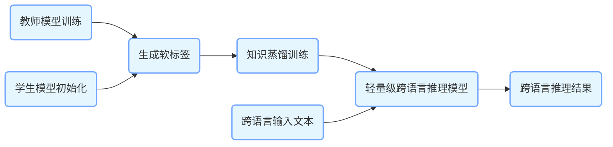

# 基于知识蒸馏的轻量级跨语言推理模型设计方法研究

> 关键词：知识蒸馏、轻量级模型、跨语言推理、模型设计、自然语言处理

> 摘要：本文聚焦于基于知识蒸馏的轻量级跨语言推理模型设计方法。随着自然语言处理在多语言场景下的应用需求不断增长，跨语言推理模型的重要性日益凸显。然而，传统的跨语言推理模型往往规模庞大、计算资源消耗高，限制了其在资源受限环境中的应用。知识蒸馏技术为解决这一问题提供了有效途径，通过将大型教师模型的知识转移到小型学生模型中，能够在保持一定性能的前提下显著降低模型的复杂度。本文将深入探讨知识蒸馏的原理、轻量级跨语言推理模型的设计架构，详细分析核心算法原理及具体操作步骤，通过数学模型和公式进行理论支撑，并结合实际项目案例进行代码实现与解读，最后探讨该领域的实际应用场景、推荐相关工具和资源，总结未来发展趋势与挑战。

## 1. 背景介绍 
### 1.1 目的和范围
在当今全球化的时代，自然语言处理技术在多语言信息处理方面的需求愈发迫切。跨语言推理模型能够在不同语言之间进行逻辑推理和语义理解，为跨语言的文本分析、问答系统、机器翻译等应用提供了强大的支持。然而，现有的跨语言推理模型通常基于大规模的预训练语言模型，这些模型参数众多、计算复杂度高，对硬件资源要求苛刻，难以在移动设备、嵌入式系统等资源受限的环境中部署。

本文的目的是研究基于知识蒸馏的轻量级跨语言推理模型设计方法，旨在通过知识蒸馏技术将大型跨语言推理模型的知识迁移到小型模型中，从而在保证模型推理性能的同时，显著降低模型的计算成本和存储需求，使得跨语言推理模型能够更加广泛地应用于各种实际场景。

本文的研究范围主要包括知识蒸馏技术的原理和应用、轻量级跨语言推理模型的架构设计、核心算法的实现、数学模型的建立以及实际项目中的应用案例分析。

### 1.2 预期读者
本文预期读者包括自然语言处理领域的研究人员、工程师和开发者，以及对跨语言推理和知识蒸馏技术感兴趣的相关专业学生。对于希望了解如何在资源受限环境中实现高效跨语言推理的技术人员，本文提供了详细的技术原理和实践指导；对于研究人员，本文的理论分析和实验结果可以为进一步的研究提供参考和启发。

### 1.3 文档结构概述
本文将按照以下结构进行组织：
1. **背景介绍**：阐述研究的目的和范围、预期读者以及文档的整体结构，并对相关术语进行定义和解释。
2. **核心概念与联系**：介绍知识蒸馏、轻量级模型和跨语言推理的核心概念，分析它们之间的联系，并通过文本示意图和 Mermaid 流程图展示模型的架构和工作流程。
3. **核心算法原理 & 具体操作步骤**：详细讲解知识蒸馏的核心算法原理，通过 Python 源代码展示具体的实现步骤。
4. **数学模型和公式 & 详细讲解 & 举例说明**：建立知识蒸馏和跨语言推理的数学模型，给出相关公式，并通过具体例子进行详细说明。
5. **项目实战：代码实际案例和详细解释说明**：介绍开发环境的搭建，给出源代码的详细实现和解读，对代码进行分析和讨论。
6. **实际应用场景**：探讨基于知识蒸馏的轻量级跨语言推理模型在实际中的应用场景，如跨语言问答系统、跨语言文本分类等。
7. **工具和资源推荐**：推荐学习相关技术的书籍、在线课程、技术博客和网站，介绍开发工具、调试和性能分析工具以及相关的框架和库，推荐相关的论文著作。
8. **总结：未来发展趋势与挑战**：总结本文的研究成果，分析未来该领域的发展趋势和面临的挑战。
9. **附录：常见问题与解答**：对常见问题进行解答，为读者提供进一步的帮助。
10. **扩展阅读 & 参考资料**：提供相关的扩展阅读材料和参考资料，方便读者深入研究。

### 1.4 术语表
#### 1.4.1 核心术语定义
- **知识蒸馏（Knowledge Distillation）**：一种模型压缩技术，通过将大型教师模型的知识转移到小型学生模型中，使学生模型能够在保持一定性能的前提下，降低模型的复杂度和计算成本。
- **轻量级模型（Lightweight Model）**：指参数数量少、计算复杂度低的模型，通常具有较小的存储需求和较快的推理速度，适合在资源受限的环境中部署。
- **跨语言推理（Cross-lingual Reasoning）**：在不同语言之间进行逻辑推理和语义理解的能力，能够处理多种语言的文本输入，并输出正确的推理结果。
- **教师模型（Teacher Model）**：在知识蒸馏中，通常是一个大型的、性能较好的模型，用于提供知识给学生模型。
- **学生模型（Student Model）**：在知识蒸馏中，是一个小型的、待训练的模型，通过学习教师模型的知识来提高自身的性能。

#### 1.4.2 相关概念解释
- **预训练语言模型（Pretrained Language Model）**：在大规模文本数据上进行无监督学习得到的语言模型，如 BERT、GPT 等。预训练语言模型可以学习到丰富的语言知识，为后续的任务提供强大的特征表示。
- **注意力机制（Attention Mechanism）**：一种在神经网络中广泛应用的技术，能够自动地关注输入序列中的重要部分，从而提高模型的性能。在跨语言推理模型中，注意力机制可以帮助模型更好地捕捉不同语言之间的语义关系。
- **损失函数（Loss Function）**：用于衡量模型预测结果与真实标签之间的差异，是模型训练过程中的优化目标。在知识蒸馏中，通常使用多个损失函数来综合考虑学生模型的预测损失和与教师模型输出的一致性损失。

#### 1.4.3 缩略词列表
- **BERT**：Bidirectional Encoder Representations from Transformers，一种基于 Transformer 架构的预训练语言模型。
- **GPT**：Generative Pretrained Transformer，一种基于 Transformer 架构的生成式预训练语言模型。
- **KL 散度**：Kullback-Leibler Divergence，用于衡量两个概率分布之间的差异。
- **NLP**：Natural Language Processing，自然语言处理。

## 2. 核心概念与联系 
### 核心概念原理
#### 知识蒸馏
知识蒸馏的核心思想是将大型教师模型的知识转移到小型学生模型中。教师模型通常在大规模数据上进行训练，具有较高的性能，但模型复杂度较高。学生模型则是一个相对较小的模型，通过学习教师模型的输出，如软标签（soft labels），来提高自身的性能。

具体来说，知识蒸馏的过程可以分为以下几个步骤：
1. **教师模型训练**：使用大规模的训练数据对教师模型进行训练，使其能够学习到丰富的语言知识和推理能力。
2. **生成软标签**：在训练学生模型时，将输入数据同时输入到教师模型和学生模型中。教师模型输出的概率分布作为软标签，用于指导学生模型的训练。
3. **学生模型训练**：使用软标签和真实标签（hard labels）共同构建损失函数，对学生模型进行训练。通过优化损失函数，使学生模型的输出尽可能接近教师模型的输出。

#### 轻量级模型
轻量级模型的设计目标是在保证一定性能的前提下，降低模型的复杂度和计算成本。常见的轻量级模型设计方法包括：
1. **模型架构优化**：采用更简单的网络架构，减少模型的层数和参数数量。例如，使用 MobileNet、ShuffleNet 等轻量级卷积神经网络架构。
2. **参数量化**：将模型的参数从浮点数表示转换为低精度的整数表示，如 8 位或 4 位整数，从而减少模型的存储需求和计算量。
3. **剪枝**：去除模型中对性能影响较小的参数，从而降低模型的复杂度。

#### 跨语言推理
跨语言推理模型旨在处理不同语言的文本输入，并进行逻辑推理和语义理解。为了实现跨语言推理，通常需要解决以下几个关键问题：
1. **跨语言表示学习**：学习不同语言之间的共同表示，使得模型能够在不同语言之间进行有效的特征共享。常见的方法包括使用多语言预训练语言模型、跨语言嵌入等。
2. **语义对齐**：解决不同语言之间的语义差异，使得模型能够准确地理解不同语言表达的相同语义。可以通过引入对齐损失函数、使用双语语料库等方法来实现。
3. **推理机制设计**：设计合适的推理机制，使得模型能够根据输入的文本进行逻辑推理和得出正确的结论。

### 架构的文本示意图
```plaintext
+-------------------+
|  教师模型 (大型)   |
+-------------------+
         |
         | 软标签
         v
+-------------------+
|  知识蒸馏模块     |
+-------------------+
         |
         | 损失函数
         v
+-------------------+
|  学生模型 (轻量级) |
+-------------------+
         |
         | 跨语言输入
         v
+-------------------+
|  跨语言推理结果   |
+-------------------+
```

### Mermaid 流程图


## 3. 核心算法原理 & 具体操作步骤 
### 核心算法原理
知识蒸馏的核心算法基于损失函数的设计，通常使用两个损失函数来训练学生模型：
1. **预测损失（Prediction Loss）**：衡量学生模型的预测结果与真实标签之间的差异，通常使用交叉熵损失函数。
2. **蒸馏损失（Distillation Loss）**：衡量学生模型的输出与教师模型的输出之间的差异，通常使用 KL 散度。

假设输入数据为 $x$，真实标签为 $y$，教师模型的输出概率分布为 $p_t(x)$，学生模型的输出概率分布为 $p_s(x)$。则总的损失函数可以表示为：

$$L = \alpha \cdot L_{pred}(p_s(x), y) + (1 - \alpha) \cdot L_{dist}(p_s(x), p_t(x))$$

其中，$L_{pred}$ 是预测损失函数，$L_{dist}$ 是蒸馏损失函数，$\alpha$ 是一个超参数，用于平衡预测损失和蒸馏损失的权重。

### 具体操作步骤
以下是使用 Python 和 PyTorch 实现知识蒸馏的具体步骤：

```python
import torch
import torch.nn as nn
import torch.optim as optim

# 定义教师模型
class TeacherModel(nn.Module):
    def __init__(self, input_size, hidden_size, output_size):
        super(TeacherModel, self).__init__()
        self.fc1 = nn.Linear(input_size, hidden_size)
        self.relu = nn.ReLU()
        self.fc2 = nn.Linear(hidden_size, output_size)

    def forward(self, x):
        out = self.fc1(x)
        out = self.relu(out)
        out = self.fc2(out)
        return out

# 定义学生模型
class StudentModel(nn.Module):
    def __init__(self, input_size, hidden_size, output_size):
        super(StudentModel, self).__init__()
        self.fc1 = nn.Linear(input_size, hidden_size)
        self.relu = nn.ReLU()
        self.fc2 = nn.Linear(hidden_size, output_size)

    def forward(self, x):
        out = self.fc1(x)
        out = self.relu(out)
        out = self.fc2(out)
        return out

# 初始化模型
input_size = 10
hidden_size = 20
output_size = 5
teacher_model = TeacherModel(input_size, hidden_size, output_size)
student_model = StudentModel(input_size, hidden_size // 2, output_size)

# 定义损失函数和优化器
criterion_pred = nn.CrossEntropyLoss()
criterion_dist = nn.KLDivLoss(reduction='batchmean')
optimizer = optim.Adam(student_model.parameters(), lr=0.001)

# 超参数
alpha = 0.3
temperature = 2.0

# 模拟训练数据
num_samples = 100
x = torch.randn(num_samples, input_size)
y = torch.randint(0, output_size, (num_samples,))

# 训练学生模型
num_epochs = 10
for epoch in range(num_epochs):
    # 前向传播
    teacher_output = teacher_model(x)
    student_output = student_model(x)

    # 计算预测损失
    pred_loss = criterion_pred(student_output, y)

    # 计算蒸馏损失
    teacher_probs = nn.functional.softmax(teacher_output / temperature, dim=1)
    student_log_probs = nn.functional.log_softmax(student_output / temperature, dim=1)
    dist_loss = criterion_dist(student_log_probs, teacher_probs) * (temperature ** 2)

    # 计算总损失
    total_loss = alpha * pred_loss + (1 - alpha) * dist_loss

    # 反向传播和优化
    optimizer.zero_grad()
    total_loss.backward()
    optimizer.step()

    print(f'Epoch [{epoch+1}/{num_epochs}], Loss: {total_loss.item():.4f}')
```

### 代码解释
1. **模型定义**：定义了教师模型和学生模型，它们都是简单的全连接神经网络。
2. **损失函数和优化器**：使用交叉熵损失函数作为预测损失，KL 散度损失函数作为蒸馏损失，Adam 优化器用于更新学生模型的参数。
3. **超参数设置**：设置了 $\alpha$ 和 $temperature$ 两个超参数，分别用于平衡预测损失和蒸馏损失的权重，以及控制软标签的平滑程度。
4. **训练过程**：在每个 epoch 中，计算教师模型和学生模型的输出，分别计算预测损失和蒸馏损失，然后将它们加权求和得到总损失。最后进行反向传播和参数更新。

## 4. 数学模型和公式 & 详细讲解 & 举例说明 
### 数学模型和公式
#### 预测损失
预测损失通常使用交叉熵损失函数，用于衡量学生模型的预测结果与真实标签之间的差异。对于一个样本 $(x, y)$，其中 $x$ 是输入数据，$y$ 是真实标签，学生模型的输出概率分布为 $p_s(x)$，则交叉熵损失函数可以表示为：

$$L_{pred}(p_s(x), y) = - \sum_{i=1}^{C} y_i \log(p_{s,i}(x))$$

其中，$C$ 是类别数，$y_i$ 是真实标签的第 $i$ 个分量，$p_{s,i}(x)$ 是学生模型输出概率分布的第 $i$ 个分量。

#### 蒸馏损失
蒸馏损失使用 KL 散度来衡量学生模型的输出与教师模型的输出之间的差异。KL 散度的定义如下：

$$D_{KL}(p || q) = \sum_{i=1}^{C} p_i \log\left(\frac{p_i}{q_i}\right)$$

其中，$p$ 和 $q$ 是两个概率分布。在知识蒸馏中，教师模型的输出概率分布为 $p_t(x)$，学生模型的输出概率分布为 $p_s(x)$，则蒸馏损失可以表示为：

$$L_{dist}(p_s(x), p_t(x)) = D_{KL}(p_t(x) || p_s(x))$$

为了控制软标签的平滑程度，通常在计算概率分布时引入温度参数 $T$：

$$p_{t,i}(x) = \frac{\exp\left(\frac{z_{t,i}(x)}{T}\right)}{\sum_{j=1}^{C} \exp\left(\frac{z_{t,j}(x)}{T}\right)}$$

$$p_{s,i}(x) = \frac{\exp\left(\frac{z_{s,i}(x)}{T}\right)}{\sum_{j=1}^{C} \exp\left(\frac{z_{s,j}(x)}{T}\right)}$$

其中，$z_t(x)$ 和 $z_s(x)$ 分别是教师模型和学生模型的未归一化输出。

#### 总损失
总的损失函数是预测损失和蒸馏损失的加权和：

$$L = \alpha \cdot L_{pred}(p_s(x), y) + (1 - \alpha) \cdot L_{dist}(p_s(x), p_t(x))$$

### 详细讲解
- **预测损失**：交叉熵损失函数是一种常用的分类损失函数，它鼓励模型的预测结果尽可能接近真实标签。在知识蒸馏中，预测损失确保学生模型能够学习到正确的分类信息。
- **蒸馏损失**：KL 散度用于衡量两个概率分布之间的差异。通过最小化蒸馏损失，学生模型的输出概率分布会尽可能接近教师模型的输出概率分布，从而学习到教师模型的知识。
- **温度参数**：温度参数 $T$ 控制了软标签的平滑程度。当 $T$ 较大时，软标签更加平滑，模型能够学习到更多的类间信息；当 $T$ 较小时，软标签更加接近硬标签，模型更加关注正确的分类。
- **权重参数**：权重参数 $\alpha$ 用于平衡预测损失和蒸馏损失的重要性。当 $\alpha$ 较大时，模型更加关注预测损失；当 $\alpha$ 较小时，模型更加关注蒸馏损失。

### 举例说明
假设我们有一个二分类问题，输入数据 $x$，真实标签 $y = [1, 0]$，教师模型的输出 $z_t(x) = [2, -1]$，学生模型的输出 $z_s(x) = [1, -2]$，温度参数 $T = 2$，权重参数 $\alpha = 0.3$。

1. **计算预测损失**：
    - 学生模型的输出概率分布 $p_s(x)$：
      - $p_{s,1}(x) = \frac{\exp(1)}{\exp(1) + \exp(-2)} \approx 0.95$
      - $p_{s,2}(x) = \frac{\exp(-2)}{\exp(1) + \exp(-2)} \approx 0.05$
    - 预测损失 $L_{pred}(p_s(x), y)$：
      - $L_{pred}(p_s(x), y) = - (1 \cdot \log(0.95) + 0 \cdot \log(0.05)) \approx 0.051$

2. **计算蒸馏损失**：
    - 教师模型的输出概率分布 $p_t(x)$：
      - $p_{t,1}(x) = \frac{\exp(2/2)}{\exp(2/2) + \exp(-1/2)} \approx 0.88$
      - $p_{t,2}(x) = \frac{\exp(-1/2)}{\exp(2/2) + \exp(-1/2)} \approx 0.12$
    - 学生模型的输出概率分布 $p_s(x)$（使用温度参数）：
      - $p_{s,1}(x) = \frac{\exp(1/2)}{\exp(1/2) + \exp(-2/2)} \approx 0.82$
      - $p_{s,2}(x) = \frac{\exp(-2/2)}{\exp(1/2) + \exp(-2/2)} \approx 0.18$
    - 蒸馏损失 $L_{dist}(p_s(x), p_t(x))$：
      - $L_{dist}(p_s(x), p_t(x)) = 0.88 \cdot \log\left(\frac{0.88}{0.82}\right) + 0.12 \cdot \log\left(\frac{0.12}{0.18}\right) \approx 0.034$

3. **计算总损失**：
    - $L = 0.3 \cdot 0.051 + (1 - 0.3) \cdot 0.034 \approx 0.039$

通过不断迭代优化总损失，学生模型可以逐渐学习到教师模型的知识，提高自身的性能。

## 5. 项目实战：代码实际案例和详细解释说明 
### 5.1  开发环境搭建
#### 操作系统
推荐使用 Linux 系统，如 Ubuntu 18.04 或更高版本。也可以使用 Windows 或 macOS 系统，但在某些依赖库的安装上可能会有一些差异。

#### Python 环境
建议使用 Python 3.7 或更高版本。可以使用 Anaconda 或 Miniconda 来管理 Python 环境，以下是创建和激活虚拟环境的命令：

```bash
conda create -n knowledge_distillation python=3.8
conda activate knowledge_distillation
```

#### 依赖库安装
在激活的虚拟环境中，安装所需的依赖库：

```bash
pip install torch torchvision  # PyTorch 深度学习框架
pip install transformers       # Hugging Face Transformers 库
pip install numpy pandas       # 数据处理库
pip install scikit-learn       # 机器学习工具库
```

### 5.2  源代码详细实现和代码解读
以下是一个基于 Hugging Face Transformers 库的知识蒸馏跨语言推理模型的实现示例：

```python
import torch
import torch.nn as nn
import torch.optim as optim
from transformers import AutoTokenizer, AutoModelForSequenceClassification
from datasets import load_dataset

# 加载数据集
dataset = load_dataset("xnli", "all_languages")

# 加载教师模型和学生模型
teacher_model_name = "bert-base-multilingual-cased"
student_model_name = "distilbert-base-multilingual-cased"
tokenizer = AutoTokenizer.from_pretrained(teacher_model_name)
teacher_model = AutoModelForSequenceClassification.from_pretrained(teacher_model_name, num_labels=3)
student_model = AutoModelForSequenceClassification.from_pretrained(student_model_name, num_labels=3)

# 定义损失函数和优化器
criterion_pred = nn.CrossEntropyLoss()
criterion_dist = nn.KLDivLoss(reduction='batchmean')
optimizer = optim.Adam(student_model.parameters(), lr=2e-5)

# 超参数
alpha = 0.3
temperature = 2.0
num_epochs = 3
batch_size = 16

# 数据预处理
def preprocess_function(examples):
    inputs = tokenizer(
        examples["premise"],
        examples["hypothesis"],
        truncation=True,
        padding="max_length",
        max_length=128
    )
    inputs["labels"] = examples["label"]
    return inputs

tokenized_dataset = dataset.map(preprocess_function, batched=True)
train_dataset = tokenized_dataset["train"]
train_dataloader = torch.utils.data.DataLoader(train_dataset, batch_size=batch_size, shuffle=True)

# 训练学生模型
device = torch.device("cuda" if torch.cuda.is_available() else "cpu")
teacher_model.to(device)
student_model.to(device)

for epoch in range(num_epochs):
    running_loss = 0.0
    for batch in train_dataloader:
        # 数据加载
        input_ids = batch["input_ids"].to(device)
        attention_mask = batch["attention_mask"].to(device)
        labels = batch["labels"].to(device)

        # 前向传播
        teacher_outputs = teacher_model(input_ids=input_ids, attention_mask=attention_mask)
        student_outputs = student_model(input_ids=input_ids, attention_mask=attention_mask)

        # 计算预测损失
        pred_loss = criterion_pred(student_outputs.logits, labels)

        # 计算蒸馏损失
        teacher_probs = nn.functional.softmax(teacher_outputs.logits / temperature, dim=1)
        student_log_probs = nn.functional.log_softmax(student_outputs.logits / temperature, dim=1)
        dist_loss = criterion_dist(student_log_probs, teacher_probs) * (temperature ** 2)

        # 计算总损失
        total_loss = alpha * pred_loss + (1 - alpha) * dist_loss

        # 反向传播和优化
        optimizer.zero_grad()
        total_loss.backward()
        optimizer.step()

        running_loss += total_loss.item()

    print(f'Epoch [{epoch+1}/{num_epochs}], Loss: {running_loss / len(train_dataloader):.4f}')
```

### 代码解读
1. **数据集加载**：使用 `datasets` 库加载 XNLI 跨语言自然语言推理数据集，该数据集包含多种语言的前提和假设文本对，以及对应的标签。
2. **模型加载**：使用 `transformers` 库加载预训练的教师模型（BERT-base-multilingual-cased）和学生模型（DistilBERT-base-multilingual-cased）。
3. **损失函数和优化器**：使用交叉熵损失函数作为预测损失，KL 散度损失函数作为蒸馏损失，Adam 优化器用于更新学生模型的参数。
4. **数据预处理**：定义 `preprocess_function` 函数对数据集进行预处理，将文本转换为模型可以接受的输入格式。
5. **训练过程**：在每个 epoch 中，遍历训练数据集的每个批次，计算教师模型和学生模型的输出，分别计算预测损失和蒸馏损失，然后将它们加权求和得到总损失。最后进行反向传播和参数更新。

### 5.3  代码解读与分析
- **模型选择**：选择 BERT-base-multilingual-cased 作为教师模型，它是一个大型的多语言预训练语言模型，具有较高的性能。选择 DistilBERT-base-multilingual-cased 作为学生模型，它是 BERT 的轻量级版本，参数数量较少，计算速度较快。
- **损失函数**：通过结合预测损失和蒸馏损失，学生模型不仅能够学习到正确的分类信息，还能够学习到教师模型的知识。
- **超参数调整**：$\alpha$ 和 $temperature$ 是两个重要的超参数，需要根据具体任务进行调整。$\alpha$ 控制预测损失和蒸馏损失的权重，$temperature$ 控制软标签的平滑程度。
- **性能评估**：在训练过程中，可以使用验证集对模型的性能进行评估，选择最佳的模型参数。

## 6. 实际应用场景 
### 跨语言问答系统
在跨语言问答系统中，用户可以使用不同语言提出问题，系统需要能够理解问题的语义，并给出正确的答案。基于知识蒸馏的轻量级跨语言推理模型可以在资源受限的设备上运行，快速处理多语言问题，提高问答系统的响应速度和可用性。

### 跨语言文本分类
跨语言文本分类任务需要将不同语言的文本分类到不同的类别中。轻量级跨语言推理模型可以在保证分类准确率的前提下，减少模型的计算成本和存储需求，适用于大规模文本分类的场景，如新闻分类、情感分析等。

### 跨语言机器翻译辅助
在机器翻译过程中，有时需要进行一些逻辑推理和语义理解，以提高翻译的质量。轻量级跨语言推理模型可以作为机器翻译系统的辅助模块，对输入的源语言文本进行推理和分析，为翻译过程提供更多的信息和指导。

### 跨语言信息检索
在跨语言信息检索中，用户可以使用一种语言输入查询词，系统需要在多种语言的文档中检索相关的信息。轻量级跨语言推理模型可以帮助系统更好地理解查询词和文档的语义，提高信息检索的准确性和效率。

## 7. 工具和资源推荐
### 7.1 学习资源推荐
#### 7.1.1 书籍推荐
- 《深度学习》（Deep Learning）：由 Ian Goodfellow、Yoshua Bengio 和 Aaron Courville 编写，是深度学习领域的经典教材，涵盖了深度学习的基本概念、算法和应用。
- 《自然语言处理入门》（Natural Language Processing with Python）：由 Steven Bird、Ewan Klein 和 Edward Loper 编写，介绍了使用 Python 进行自然语言处理的基本方法和技术。
- 《Transformer 自然语言处理》（Transformers for Natural Language Processing）：由 Denis Rothman 编写，详细介绍了 Transformer 架构及其在自然语言处理中的应用。

#### 7.1.2 在线课程
- Coursera 上的 “Deep Learning Specialization”：由 Andrew Ng 教授授课，涵盖了深度学习的各个方面，包括神经网络、卷积神经网络、循环神经网络等。
- edX 上的 “Natural Language Processing with Deep Learning”：由 Dan Jurafsky 和 Christopher Manning 教授授课，介绍了使用深度学习技术进行自然语言处理的方法和应用。
- Hugging Face 官方的 “Transformers Course”：提供了关于 Transformers 库的详细教程和实践案例，帮助学习者快速上手使用 Transformer 模型。

#### 7.1.3 技术博客和网站
- Hugging Face Blog：提供了关于自然语言处理、Transformer 模型等方面的最新研究成果和技术文章。
- Towards Data Science：一个数据科学和机器学习领域的博客平台，有许多关于自然语言处理和知识蒸馏的优秀文章。
- arXiv：一个预印本论文平台，提供了大量的学术论文，包括自然语言处理和知识蒸馏领域的最新研究成果。

### 7.2 开发工具框架推荐
#### 7.2.1 IDE和编辑器
- PyCharm：一款功能强大的 Python 集成开发环境，提供了代码编辑、调试、版本控制等功能，适合开发 Python 项目。
- Jupyter Notebook：一个交互式的开发环境，支持 Python、R 等多种编程语言，适合进行数据探索和模型实验。
- Visual Studio Code：一款轻量级的代码编辑器，支持多种编程语言和插件扩展，适合快速开发和调试代码。

#### 7.2.2 调试和性能分析工具
- PyTorch Profiler：PyTorch 提供的性能分析工具，可以帮助开发者分析模型的计算性能和内存使用情况。
- TensorBoard：一个可视化工具，用于监控模型的训练过程和性能指标，如损失函数、准确率等。
- cProfile：Python 内置的性能分析工具，可以帮助开发者找出代码中的性能瓶颈。

#### 7.2.3 相关框架和库
- PyTorch：一个开源的深度学习框架，提供了丰富的神经网络模块和优化算法，支持 GPU 加速。
- Hugging Face Transformers：一个用于自然语言处理的开源库，提供了大量的预训练语言模型和工具，方便开发者进行模型训练和推理。
- Datasets：Hugging Face 提供的数据集加载和处理库，支持多种常见的自然语言处理数据集。

### 7.3 相关论文著作推荐
#### 7.3.1 经典论文
- “Distilling the Knowledge in a Neural Network”：由 Geoffrey Hinton、Oriol Vinyals 和 Jeff Dean 发表，首次提出了知识蒸馏的概念。
- “BERT: Pre-training of Deep Bidirectional Transformers for Language Understanding”：由 Jacob Devlin 等人发表，介绍了 BERT 预训练语言模型的架构和训练方法。
- “XNLI: Evaluating Cross-lingual Sentence Representations”：由 Alexis Conneau 等人发表，介绍了 XNLI 跨语言自然语言推理数据集。

#### 7.3.2 最新研究成果
- 关注 arXiv 上关于知识蒸馏、轻量级模型和跨语言推理的最新论文，了解该领域的最新研究动态。
- 参加自然语言处理领域的学术会议，如 ACL、EMNLP、NAACL 等，听取最新的研究报告和成果分享。

#### 7.3.3 应用案例分析
- 可以在各大科技公司的技术博客上查找关于知识蒸馏和跨语言推理模型的应用案例，了解它们在实际业务中的应用效果和经验教训。

## 8. 总结：未来发展趋势与挑战
### 发展趋势
- **模型轻量化技术的不断创新**：未来，轻量级模型的设计方法将不断创新，如更高效的模型架构、更先进的参数量化和剪枝技术等，以进一步降低模型的复杂度和计算成本。
- **跨语言表示学习的深入研究**：跨语言表示学习是跨语言推理的关键，未来将有更多的研究致力于提高跨语言表示的质量和通用性，使得模型能够更好地处理不同语言之间的语义差异。
- **知识蒸馏技术的拓展应用**：知识蒸馏技术将不仅仅应用于模型压缩，还将拓展到其他领域，如模型融合、多模态学习等，为人工智能的发展提供更多的可能性。
- **与其他技术的融合发展**：基于知识蒸馏的轻量级跨语言推理模型将与其他技术，如强化学习、迁移学习等相结合，进一步提高模型的性能和适应性。

### 挑战
- **知识蒸馏的理论基础研究**：目前，知识蒸馏的理论基础还不够完善，对于知识蒸馏的原理和机制还需要进一步深入研究，以更好地指导模型的设计和训练。
- **跨语言数据的获取和标注**：跨语言推理需要大量的跨语言数据，然而跨语言数据的获取和标注成本较高，如何有效地获取和利用跨语言数据是一个亟待解决的问题。
- **模型性能和资源消耗的平衡**：在追求模型轻量化的同时，如何保证模型的性能不受到太大的影响，是一个需要权衡的问题。需要找到一种合适的方法来平衡模型的性能和资源消耗。
- **跨语言推理的可解释性**：跨语言推理模型的可解释性是一个重要的问题，特别是在一些对解释性要求较高的应用场景中，如法律、医疗等领域。如何提高跨语言推理模型的可解释性是未来研究的一个方向。

## 9. 附录：常见问题与解答
### 知识蒸馏中温度参数的作用是什么？
温度参数 $T$ 用于控制软标签的平滑程度。当 $T$ 较大时，软标签更加平滑，模型能够学习到更多的类间信息；当 $T$ 较小时，软标签更加接近硬标签，模型更加关注正确的分类。在知识蒸馏中，适当调整温度参数可以帮助学生模型更好地学习教师模型的知识。

### 如何选择合适的教师模型和学生模型？
选择教师模型时，应考虑模型的性能和通用性。通常选择在大规模数据上预训练的大型模型，如 BERT、GPT 等。选择学生模型时，应考虑模型的复杂度和计算成本，通常选择轻量级的模型，如 DistilBERT、MobileBERT 等。同时，学生模型的架构应与教师模型有一定的相似性，以便更好地学习教师模型的知识。

### 知识蒸馏的训练时间会比传统训练方法长吗？
知识蒸馏的训练时间通常会比传统训练方法略长，因为在训练过程中需要同时计算教师模型和学生模型的输出，并计算蒸馏损失。然而，由于学生模型的复杂度较低，在推理阶段的速度会比教师模型快很多，因此在实际应用中，知识蒸馏可以在保证一定性能的前提下，提高模型的推理效率。

### 跨语言推理模型在不同语言上的性能是否一致？
跨语言推理模型在不同语言上的性能可能会有所差异，这主要取决于语言的特点、数据的质量和数量等因素。一些语言可能由于数据较少或语言结构复杂，模型在这些语言上的性能会相对较低。为了提高模型在不同语言上的性能，可以采用多语言预训练、数据增强等方法。

## 10. 扩展阅读 & 参考资料
### 扩展阅读
- “MobileBERT: a Compact Task-Agnostic BERT for Resource-Limited Devices”：介绍了 MobileBERT 轻量级预训练语言模型的设计和实现。
- “Multilingual BERT: A Deep Dive into Cross-lingual Language Representations”：深入探讨了多语言 BERT 模型的跨语言表示能力。
- “Knowledge Distillation for Neural Networks: A Survey”：对知识蒸馏技术进行了全面的综述和总结。

### 参考资料
- Hugging Face Transformers 官方文档：https://huggingface.co/docs/transformers/index
- PyTorch 官方文档：https://pytorch.org/docs/stable/index.html
- Datasets 官方文档：https://huggingface.co/docs/datasets/index

作者：AI天才研究院/AI Genius Institute & 禅与计算机程序设计艺术 /Zen And The Art of Computer Programming