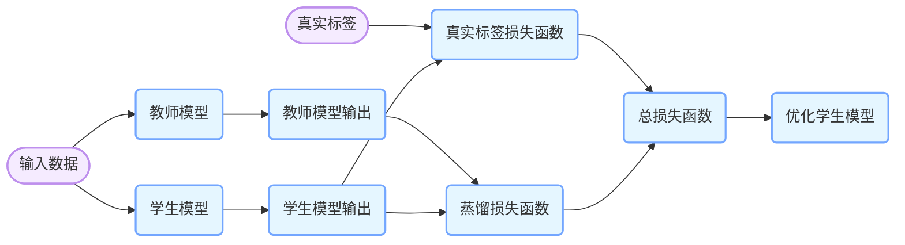

# 基于知识蒸馏的轻量级通用推理模型设计

> 关键词：知识蒸馏、轻量级模型、通用推理模型、模型压缩、深度学习

> 摘要：本文聚焦于基于知识蒸馏的轻量级通用推理模型设计。首先介绍了知识蒸馏和轻量级模型的相关背景知识，阐述了设计此类模型的目的和意义。接着详细讲解了核心概念，包括知识蒸馏的原理、轻量级模型的架构特点等，并给出了相应的文本示意图和 Mermaid 流程图。然后深入探讨了核心算法原理，通过 Python 源代码进行详细阐述，同时给出了相关的数学模型和公式，并举例说明。在项目实战部分，给出了开发环境搭建的步骤、源代码的详细实现和代码解读。之后分析了实际应用场景，推荐了相关的学习资源、开发工具框架以及论文著作。最后总结了未来发展趋势与挑战，并提供了常见问题与解答和扩展阅读及参考资料，旨在为相关领域的研究者和开发者提供全面而深入的技术指导。

## 1. 背景介绍 
### 1.1 目的和范围
在深度学习领域，大型模型往往具有卓越的性能，但它们通常需要大量的计算资源和存储空间，这使得在资源受限的设备（如移动设备、嵌入式系统等）上部署变得困难。知识蒸馏作为一种有效的模型压缩技术，能够将大型教师模型的知识迁移到小型学生模型中，从而在保证一定性能的前提下，显著减少模型的大小和计算量。

本文的目的是设计一种基于知识蒸馏的轻量级通用推理模型。其范围涵盖了知识蒸馏的基本原理、轻量级模型的架构设计、核心算法的实现、数学模型的构建、项目实战案例以及实际应用场景等方面，旨在为读者提供一个全面且深入的技术指导。

### 1.2 预期读者
本文预期读者包括深度学习领域的研究者、人工智能工程师、计算机科学专业的学生以及对模型压缩和轻量级模型设计感兴趣的技术爱好者。读者需要具备一定的深度学习基础知识，如神经网络的基本概念、常见的优化算法等。

### 1.3 文档结构概述
本文将按照以下结构进行组织：
- 核心概念与联系：介绍知识蒸馏和轻量级通用推理模型的核心概念，包括原理和架构，并给出相应的示意图和流程图。
- 核心算法原理 & 具体操作步骤：详细讲解知识蒸馏的核心算法原理，并通过 Python 源代码进行具体实现。
- 数学模型和公式 & 详细讲解 & 举例说明：给出知识蒸馏相关的数学模型和公式，并通过具体例子进行说明。
- 项目实战：代码实际案例和详细解释说明：通过一个实际项目案例，展示如何使用知识蒸馏设计轻量级通用推理模型，包括开发环境搭建、源代码实现和代码解读。
- 实际应用场景：分析基于知识蒸馏的轻量级通用推理模型的实际应用场景。
- 工具和资源推荐：推荐相关的学习资源、开发工具框架和论文著作。
- 总结：未来发展趋势与挑战：总结知识蒸馏在轻量级通用推理模型设计中的发展趋势和面临的挑战。
- 附录：常见问题与解答：解答读者在学习和实践过程中可能遇到的常见问题。
- 扩展阅读 & 参考资料：提供相关的扩展阅读材料和参考资料。

### 1.4 术语表
#### 1.4.1 核心术语定义
- **知识蒸馏（Knowledge Distillation）**：一种模型压缩技术，通过让小型学生模型学习大型教师模型的输出分布，将教师模型的知识迁移到学生模型中。
- **轻量级模型（Lightweight Model）**：指具有较小的模型参数数量和计算量的模型，通常适用于资源受限的设备。
- **通用推理模型（General Inference Model）**：能够处理多种类型任务的推理模型，具有较好的泛化能力。
- **教师模型（Teacher Model）**：在知识蒸馏中，通常是一个大型的、性能较好的模型，用于向学生模型传递知识。
- **学生模型（Student Model）**：在知识蒸馏中，是一个小型的模型，通过学习教师模型的知识来提高自身性能。

#### 1.4.2 相关概念解释
- **软标签（Soft Labels）**：教师模型输出的概率分布，包含了更多的类别之间的关系信息，相比于硬标签（只有一个类别为 1，其余为 0），软标签能够为学生模型提供更多的学习信号。
- **温度参数（Temperature Parameter）**：在知识蒸馏中，用于调整软标签的平滑程度，温度越高，软标签越平滑。

#### 1.4.3 缩略词列表
- **CNN（Convolutional Neural Network）**：卷积神经网络
- **MLP（Multilayer Perceptron）**：多层感知机
- **GPU（Graphics Processing Unit）**：图形处理单元
- **CPU（Central Processing Unit）**：中央处理单元

## 2. 核心概念与联系 
### 知识蒸馏原理
知识蒸馏的核心思想是让学生模型学习教师模型的输出分布，从而将教师模型的知识迁移到学生模型中。具体来说，在训练学生模型时，除了使用真实标签的损失函数（如交叉熵损失）外，还引入了一个蒸馏损失函数，用于衡量学生模型的输出和教师模型的输出之间的差异。

下面是知识蒸馏的文本示意图：

教师模型接收输入数据，经过一系列的神经网络层处理后，输出一个概率分布（软标签）。同时，输入数据也被输入到学生模型中，学生模型同样输出一个概率分布。蒸馏损失函数计算学生模型输出和教师模型输出之间的差异，真实标签损失函数计算学生模型输出和真实标签之间的差异。最终的损失函数是这两个损失函数的加权和，通过优化这个总损失函数来训练学生模型。

### Mermaid 流程图


### 轻量级通用推理模型架构
轻量级通用推理模型通常采用一些轻量化的神经网络架构，如 MobileNet、ShuffleNet 等。这些架构通过使用深度可分离卷积、通道洗牌等技术，在减少模型参数数量和计算量的同时，保持了较好的性能。

轻量级通用推理模型的架构设计通常遵循以下原则：
- **减少参数数量**：通过使用轻量化的卷积核和网络结构，减少模型的参数数量。
- **降低计算复杂度**：采用高效的计算方法，如深度可分离卷积，降低模型的计算复杂度。
- **提高泛化能力**：通过合理的网络设计和正则化方法，提高模型的泛化能力，使其能够处理多种类型的任务。

### 知识蒸馏与轻量级通用推理模型的联系
知识蒸馏为轻量级通用推理模型的设计提供了一种有效的方法。通过知识蒸馏，轻量级的学生模型可以学习到大型教师模型的知识，从而在保证一定性能的前提下，显著减少模型的大小和计算量。同时，轻量级通用推理模型的架构设计也为知识蒸馏提供了更好的基础，使得学生模型能够更高效地学习教师模型的知识。

## 3. 核心算法原理 & 具体操作步骤 
### 核心算法原理
知识蒸馏的核心算法主要包括两个部分：计算蒸馏损失和优化学生模型。

#### 蒸馏损失函数
蒸馏损失函数用于衡量学生模型的输出和教师模型的输出之间的差异。常用的蒸馏损失函数是 KL 散度（Kullback-Leibler Divergence），其定义如下：

$$
D_{KL}(p||q) = \sum_{i} p_i \log \frac{p_i}{q_i}
$$

其中，$p$ 是教师模型的输出概率分布，$q$ 是学生模型的输出概率分布。

为了调整软标签的平滑程度，通常会引入一个温度参数 $T$。具体来说，在计算概率分布时，会使用以下公式：

$$
p_i^T = \frac{\exp(z_i / T)}{\sum_{j} \exp(z_j / T)}
$$

其中，$z_i$ 是模型的原始输出，$p_i^T$ 是经过温度调整后的概率分布。

#### 总损失函数
总损失函数是真实标签损失函数和蒸馏损失函数的加权和，其定义如下：

$$
L = \alpha \cdot L_{CE}(y, q) + (1 - \alpha) \cdot T^2 \cdot D_{KL}(p^T || q^T)
$$

其中，$L_{CE}(y, q)$ 是真实标签的交叉熵损失，$y$ 是真实标签，$q$ 是学生模型的输出概率分布，$\alpha$ 是加权系数，$T$ 是温度参数。

### 具体操作步骤
#### 步骤 1：训练教师模型
首先，需要训练一个大型的教师模型。教师模型可以是一个已经在大规模数据集上预训练好的模型，也可以根据具体任务进行训练。

#### 步骤 2：初始化学生模型
选择一个轻量级的神经网络架构作为学生模型，并初始化其参数。

#### 步骤 3：训练学生模型
在训练学生模型时，同时计算真实标签损失和蒸馏损失，并根据总损失函数更新学生模型的参数。具体的 Python 代码实现如下：

```python
import torch
import torch.nn as nn
import torch.optim as optim

# 定义教师模型
class TeacherModel(nn.Module):
    def __init__(self):
        super(TeacherModel, self).__init__()
        self.fc1 = nn.Linear(10, 20)
        self.fc2 = nn.Linear(20, 5)

    def forward(self, x):
        x = torch.relu(self.fc1(x))
        x = self.fc2(x)
        return x

# 定义学生模型
class StudentModel(nn.Module):
    def __init__(self):
        super(StudentModel, self).__init__()
        self.fc1 = nn.Linear(10, 10)
        self.fc2 = nn.Linear(10, 5)

    def forward(self, x):
        x = torch.relu(self.fc1(x))
        x = self.fc2(x)
        return x

# 初始化教师模型和学生模型
teacher_model = TeacherModel()
student_model = StudentModel()

# 定义损失函数和优化器
criterion_ce = nn.CrossEntropyLoss()
criterion_kl = nn.KLDivLoss(reduction='batchmean')
optimizer = optim.Adam(student_model.parameters(), lr=0.001)

# 超参数设置
alpha = 0.2
T = 2.0

# 模拟训练数据
inputs = torch.randn(32, 10)
labels = torch.randint(0, 5, (32,))

# 训练学生模型
for epoch in range(100):
    # 教师模型输出
    teacher_outputs = teacher_model(inputs)
    teacher_probs = torch.softmax(teacher_outputs / T, dim=1)

    # 学生模型输出
    student_outputs = student_model(inputs)
    student_probs = torch.softmax(student_outputs / T, dim=1)

    # 计算真实标签损失
    loss_ce = criterion_ce(student_outputs, labels)

    # 计算蒸馏损失
    loss_kl = criterion_kl(torch.log(student_probs), teacher_probs)

    # 计算总损失
    loss = alpha * loss_ce + (1 - alpha) * T**2 * loss_kl

    # 反向传播和参数更新
    optimizer.zero_grad()
    loss.backward()
    optimizer.step()

    if (epoch + 1) % 10 == 0:
        print(f'Epoch {epoch + 1}, Loss: {loss.item()}')
```

### 代码解释
1. **定义教师模型和学生模型**：分别定义了一个简单的全连接神经网络作为教师模型和学生模型。
2. **定义损失函数和优化器**：使用交叉熵损失函数计算真实标签损失，使用 KL 散度损失函数计算蒸馏损失，使用 Adam 优化器更新学生模型的参数。
3. **超参数设置**：设置了加权系数 $\alpha$ 和温度参数 $T$。
4. **模拟训练数据**：生成了一批随机的输入数据和标签。
5. **训练学生模型**：在每个训练周期中，计算教师模型和学生模型的输出，然后计算真实标签损失和蒸馏损失，最后根据总损失函数更新学生模型的参数。

## 4. 数学模型和公式 & 详细讲解 & 举例说明 
### 数学模型和公式
#### 真实标签损失函数
真实标签损失函数通常使用交叉熵损失函数，其定义如下：

$$
L_{CE}(y, q) = -\sum_{i} y_i \log q_i
$$

其中，$y$ 是真实标签的 one-hot 编码，$q$ 是学生模型的输出概率分布。

#### 蒸馏损失函数
蒸馏损失函数使用 KL 散度，其定义如下：

$$
D_{KL}(p^T || q^T) = \sum_{i} p_i^T \log \frac{p_i^T}{q_i^T}
$$

其中，$p^T$ 和 $q^T$ 分别是教师模型和学生模型经过温度调整后的输出概率分布。

#### 总损失函数
总损失函数是真实标签损失函数和蒸馏损失函数的加权和，其定义如下：

$$
L = \alpha \cdot L_{CE}(y, q) + (1 - \alpha) \cdot T^2 \cdot D_{KL}(p^T || q^T)
$$

### 详细讲解
#### 交叉熵损失函数
交叉熵损失函数用于衡量学生模型的输出和真实标签之间的差异。当学生模型的输出概率分布与真实标签的 one-hot 编码越接近时，交叉熵损失越小。

#### KL 散度
KL 散度用于衡量两个概率分布之间的差异。在知识蒸馏中，通过最小化 KL 散度，使得学生模型的输出概率分布尽可能接近教师模型的输出概率分布。

#### 温度参数
温度参数 $T$ 用于调整软标签的平滑程度。当 $T$ 较大时，软标签更加平滑，类别之间的差异更小；当 $T$ 较小时，软标签更加尖锐，类别之间的差异更大。

#### 加权系数
加权系数 $\alpha$ 用于控制真实标签损失和蒸馏损失在总损失函数中的比重。当 $\alpha$ 较大时，更注重真实标签损失；当 $\alpha$ 较小时，更注重蒸馏损失。

### 举例说明
假设我们有一个三分类问题，真实标签为 $y = [1, 0, 0]$，教师模型的输出为 $z_t = [3, 1, 0]$，学生模型的输出为 $z_s = [2, 1, 0]$。

#### 计算真实标签损失
首先，计算学生模型的输出概率分布：

$$
q = \text{softmax}(z_s) = \left[\frac{\exp(2)}{\exp(2) + \exp(1) + \exp(0)}, \frac{\exp(1)}{\exp(2) + \exp(1) + \exp(0)}, \frac{\exp(0)}{\exp(2) + \exp(1) + \exp(0)}\right] \approx [0.7, 0.2, 0.1]
$$

然后，计算真实标签损失：

$$
L_{CE}(y, q) = - (1 \cdot \log 0.7 + 0 \cdot \log 0.2 + 0 \cdot \log 0.1) \approx 0.357
$$

#### 计算蒸馏损失
假设温度参数 $T = 2$，首先计算教师模型和学生模型经过温度调整后的输出概率分布：

$$
p^T = \text{softmax}(z_t / T) = \left[\frac{\exp(3/2)}{\exp(3/2) + \exp(1/2) + \exp(0)}, \frac{\exp(1/2)}{\exp(3/2) + \exp(1/2) + \exp(0)}, \frac{\exp(0)}{\exp(3/2) + \exp(1/2) + \exp(0)}\right] \approx [0.75, 0.18, 0.07]
$$

$$
q^T = \text{softmax}(z_s / T) = \left[\frac{\exp(2/2)}{\exp(2/2) + \exp(1/2) + \exp(0)}, \frac{\exp(1/2)}{\exp(2/2) + \exp(1/2) + \exp(0)}, \frac{\exp(0)}{\exp(2/2) + \exp(1/2) + \exp(0)}\right] \approx [0.65, 0.24, 0.11]
$$

然后，计算蒸馏损失：

$$
D_{KL}(p^T || q^T) = \sum_{i} p_i^T \log \frac{p_i^T}{q_i^T} \approx 0.04
$$

#### 计算总损失
假设加权系数 $\alpha = 0.2$，则总损失为：

$$
L = \alpha \cdot L_{CE}(y, q) + (1 - \alpha) \cdot T^2 \cdot D_{KL}(p^T || q^T) = 0.2 \cdot 0.357 + 0.8 \cdot 2^2 \cdot 0.04 \approx 0.16
$$

## 5. 项目实战：代码实际案例和详细解释说明 
### 5.1  开发环境搭建
#### 安装 Python
首先，需要安装 Python 环境。建议使用 Python 3.7 及以上版本。可以从 Python 官方网站（https://www.python.org/downloads/）下载并安装。

#### 安装 PyTorch
PyTorch 是一个常用的深度学习框架，用于实现知识蒸馏和模型训练。可以根据自己的需求选择合适的 PyTorch 版本进行安装。具体安装方法可以参考 PyTorch 官方网站（https://pytorch.org/get-started/locally/）。

#### 安装其他依赖库
除了 PyTorch 外，还需要安装一些其他的依赖库，如 NumPy、Matplotlib 等。可以使用以下命令进行安装：

```sh
pip install numpy matplotlib
```

### 5.2  源代码详细实现和代码解读
#### 数据集准备
本项目使用 CIFAR-10 数据集作为示例。CIFAR-10 是一个包含 10 个类别的图像数据集，每个类别有 6000 张 32x32 彩色图像。

```python
import torch
import torchvision
import torchvision.transforms as transforms

# 数据预处理
transform = transforms.Compose(
    [transforms.ToTensor(),
     transforms.Normalize((0.5, 0.5, 0.5), (0.5, 0.5, 0.5))])

# 加载训练集
trainset = torchvision.datasets.CIFAR10(root='./data', train=True,
                                        download=True, transform=transform)
trainloader = torch.utils.data.DataLoader(trainset, batch_size=32,
                                          shuffle=True, num_workers=2)

# 加载测试集
testset = torchvision.datasets.CIFAR10(root='./data', train=False,
                                       download=True, transform=transform)
testloader = torch.utils.data.DataLoader(testset, batch_size=32,
                                         shuffle=False, num_workers=2)

classes = ('plane', 'car', 'bird', 'cat',
           'deer', 'dog', 'frog', 'horse', 'ship', 'truck')
```

#### 定义教师模型和学生模型
教师模型使用 ResNet-34，学生模型使用 MobileNetV2。

```python
import torch.nn as nn
import torchvision.models as models

# 定义教师模型
teacher_model = models.resnet34(pretrained=False)
num_ftrs = teacher_model.fc.in_features
teacher_model.fc = nn.Linear(num_ftrs, 10)

# 定义学生模型
student_model = models.mobilenet_v2(pretrained=False)
student_model.classifier[1] = nn.Linear(1280, 10)
```

#### 定义损失函数和优化器
使用交叉熵损失函数计算真实标签损失，使用 KL 散度损失函数计算蒸馏损失，使用 Adam 优化器更新学生模型的参数。

```python
import torch.optim as optim

# 定义损失函数
criterion_ce = nn.CrossEntropyLoss()
criterion_kl = nn.KLDivLoss(reduction='batchmean')

# 定义优化器
optimizer = optim.Adam(student_model.parameters(), lr=0.001)
```

#### 知识蒸馏训练
```python
# 超参数设置
alpha = 0.2
T = 2.0
num_epochs = 10

# 训练学生模型
for epoch in range(num_epochs):
    running_loss = 0.0
    for i, data in enumerate(trainloader, 0):
        inputs, labels = data

        # 教师模型输出
        teacher_outputs = teacher_model(inputs)
        teacher_probs = torch.softmax(teacher_outputs / T, dim=1)

        # 学生模型输出
        student_outputs = student_model(inputs)
        student_probs = torch.softmax(student_outputs / T, dim=1)

        # 计算真实标签损失
        loss_ce = criterion_ce(student_outputs, labels)

        # 计算蒸馏损失
        loss_kl = criterion_kl(torch.log(student_probs), teacher_probs)

        # 计算总损失
        loss = alpha * loss_ce + (1 - alpha) * T**2 * loss_kl

        # 反向传播和参数更新
        optimizer.zero_grad()
        loss.backward()
        optimizer.step()

        running_loss += loss.item()
        if i % 200 == 199:
            print(f'[{epoch + 1}, {i + 1:5d}] loss: {running_loss / 200:.3f}')
            running_loss = 0.0

print('Finished Training')
```

### 5.3  代码解读与分析
#### 数据集准备
使用 `torchvision` 库加载 CIFAR-10 数据集，并进行数据预处理，包括将图像转换为张量和归一化处理。

#### 定义教师模型和学生模型
教师模型使用 ResNet-34，学生模型使用 MobileNetV2。对模型的最后一层进行修改，使其输出维度与 CIFAR-10 数据集的类别数相同。

#### 定义损失函数和优化器
使用交叉熵损失函数计算真实标签损失，使用 KL 散度损失函数计算蒸馏损失，使用 Adam 优化器更新学生模型的参数。

#### 知识蒸馏训练
在每个训练周期中，遍历训练数据集，计算教师模型和学生模型的输出，然后计算真实标签损失和蒸馏损失，最后根据总损失函数更新学生模型的参数。

通过知识蒸馏训练，学生模型可以学习到教师模型的知识，从而在保证一定性能的前提下，显著减少模型的大小和计算量。

## 6. 实际应用场景 
### 移动设备上的图像识别
在移动设备（如手机、平板电脑等）上，由于计算资源和存储空间有限，大型的深度学习模型往往无法直接部署。基于知识蒸馏的轻量级通用推理模型可以在保证一定图像识别准确率的前提下，显著减少模型的大小和计算量，从而实现高效的图像识别应用。例如，在移动相册中进行图像分类、目标检测等任务。

### 嵌入式系统中的智能监控
嵌入式系统（如智能摄像头、工业监控设备等）通常具有较低的计算能力和存储容量。轻量级通用推理模型可以在这些设备上实时运行，实现智能监控功能，如人脸识别、行为分析等。通过知识蒸馏，模型可以学习到大型教师模型的知识，提高监控的准确性和效率。

### 物联网设备中的传感器数据处理
物联网设备（如智能家居设备、智能穿戴设备等）通常需要对传感器数据进行实时处理和分析。基于知识蒸馏的轻量级通用推理模型可以在这些设备上运行，对传感器数据进行分类、预测等任务。例如，在智能家居设备中，根据传感器数据判断用户的行为模式，实现智能控制。

### 自动驾驶中的实时决策
在自动驾驶领域，需要对大量的传感器数据进行实时处理和决策。轻量级通用推理模型可以在自动驾驶车辆的计算平台上快速运行，对图像、雷达等传感器数据进行分析，实现目标检测、路径规划等任务。通过知识蒸馏，模型可以在保证性能的前提下，减少计算资源的消耗，提高决策的实时性。

## 7. 工具和资源推荐
### 7.1 学习资源推荐
#### 7.1.1 书籍推荐
- 《深度学习》（Deep Learning）：由 Ian Goodfellow、Yoshua Bengio 和 Aaron Courville 所著，是深度学习领域的经典教材，涵盖了深度学习的基本原理、算法和应用。
- 《动手学深度学习》（Dive into Deep Learning）：由 Aston Zhang、Zachary C. Lipton、Mu Li 和 Alexander J. Smola 所著，提供了丰富的代码示例和实践案例，适合初学者学习深度学习。
- 《Python 深度学习》（Deep Learning with Python）：由 Francois Chollet 所著，介绍了如何使用 Python 和 Keras 框架进行深度学习开发，适合对深度学习实践感兴趣的读者。

#### 7.1.2 在线课程
- Coursera 上的《深度学习专项课程》（Deep Learning Specialization）：由 Andrew Ng 教授授课，涵盖了深度学习的各个方面，包括神经网络基础、卷积神经网络、循环神经网络等。
- edX 上的《人工智能导论》（Introduction to Artificial Intelligence）：由 MIT 教授授课，介绍了人工智能的基本概念、算法和应用，包括深度学习的相关内容。
- 哔哩哔哩上的《李宏毅机器学习》：由台湾大学李宏毅教授授课，课程内容生动有趣，适合初学者学习机器学习和深度学习。

#### 7.1.3 技术博客和网站
- Medium 上的 Towards Data Science：是一个专注于数据科学和机器学习的技术博客平台，提供了大量的优质文章和教程。
- arXiv：是一个预印本服务器，提供了最新的学术研究论文，包括深度学习领域的最新研究成果。
- GitHub：是一个代码托管平台，上面有很多开源的深度学习项目和代码库，可以供学习者参考和学习。

### 7.2 开发工具框架推荐
#### 7.2.1 IDE和编辑器
- PyCharm：是一个专门为 Python 开发设计的集成开发环境（IDE），提供了丰富的代码编辑、调试和分析功能。
- Jupyter Notebook：是一个交互式的开发环境，适合进行数据分析、模型训练和可视化等工作。
- Visual Studio Code：是一个轻量级的代码编辑器，支持多种编程语言和插件扩展，也可以用于深度学习开发。

#### 7.2.2 调试和性能分析工具
- PyTorch Profiler：是 PyTorch 框架提供的性能分析工具，可以帮助开发者分析模型的计算性能和内存使用情况。
- TensorBoard：是 TensorFlow 框架提供的可视化工具，也可以与 PyTorch 结合使用，用于可视化模型的训练过程和性能指标。
- NVIDIA Nsight Systems：是 NVIDIA 提供的性能分析工具，适合对 GPU 加速的深度学习模型进行性能分析。

#### 7.2.3 相关框架和库
- PyTorch：是一个开源的深度学习框架，具有动态图计算和易于使用的特点，广泛应用于学术界和工业界。
- TensorFlow：是另一个流行的深度学习框架，提供了丰富的工具和库，支持分布式训练和模型部署。
- Scikit-learn：是一个用于机器学习的 Python 库，提供了各种机器学习算法和工具，适合进行数据预处理、模型选择和评估等工作。

### 7.3 相关论文著作推荐
#### 7.3.1 经典论文
- 《Distilling the Knowledge in a Neural Network》：由 Geoffrey Hinton、Oriol Vinyals 和 Jeff Dean 所著，是知识蒸馏领域的开创性论文，介绍了知识蒸馏的基本原理和方法。
- 《MobileNets: Efficient Convolutional Neural Networks for Mobile Vision Applications》：提出了 MobileNet 架构，是轻量级卷积神经网络的经典之作。
- 《ShuffleNet: An Extremely Efficient Convolutional Neural Network for Mobile Devices》：提出了 ShuffleNet 架构，通过通道洗牌技术进一步减少了模型的计算量。

#### 7.3.2 最新研究成果
- 可以关注 arXiv 上的最新论文，了解知识蒸馏和轻量级模型设计领域的最新研究进展。
- 参加相关的学术会议，如 NeurIPS、ICML、CVPR 等，获取最新的研究成果和学术动态。

#### 7.3.3 应用案例分析
- 可以参考一些工业界的应用案例，了解基于知识蒸馏的轻量级通用推理模型在实际项目中的应用和优化方法。
- 关注一些知名科技公司的技术博客，如 Google AI Blog、Facebook AI Research Blog 等，获取他们在深度学习领域的最新应用案例和技术分享。

## 8. 总结：未来发展趋势与挑战
### 未来发展趋势
#### 更高效的知识蒸馏方法
随着深度学习技术的不断发展，未来可能会出现更高效的知识蒸馏方法，能够更有效地将教师模型的知识迁移到学生模型中，进一步提高学生模型的性能。

#### 轻量级模型架构的创新
研究人员将继续探索新的轻量级模型架构，结合知识蒸馏技术，设计出更加高效、准确的轻量级通用推理模型，以满足不同应用场景的需求。

#### 多模态知识蒸馏
未来的知识蒸馏技术可能会扩展到多模态数据，如图像、文本、音频等，实现多模态知识的迁移和融合，提高模型的泛化能力和应用范围。

#### 与其他技术的融合
知识蒸馏技术可能会与其他技术（如强化学习、元学习等）相结合，进一步提升模型的性能和智能水平。

### 挑战
#### 知识迁移的有效性
如何更有效地将教师模型的知识迁移到学生模型中，仍然是一个挑战。特别是在处理复杂任务和大规模数据集时，需要进一步优化知识蒸馏的方法和策略。

#### 模型性能与计算资源的平衡
在设计轻量级通用推理模型时，需要在保证模型性能的前提下，尽可能减少计算资源的消耗。如何找到一个合适的平衡点，是一个需要解决的问题。

#### 数据隐私和安全
在知识蒸馏过程中，教师模型的知识可能包含敏感信息。如何保护数据隐私和安全，避免信息泄露，是一个重要的挑战。

#### 模型的可解释性
随着深度学习模型的复杂度不断增加，模型的可解释性变得越来越重要。如何提高基于知识蒸馏的轻量级通用推理模型的可解释性，是未来需要研究的方向之一。

## 9. 附录：常见问题与解答
### 问题 1：知识蒸馏中的温度参数有什么作用？
温度参数用于调整软标签的平滑程度。当温度较高时，软标签更加平滑，类别之间的差异更小；当温度较低时，软标签更加尖锐，类别之间的差异更大。通过调整温度参数，可以控制学生模型学习到的知识的粒度。

### 问题 2：如何选择合适的加权系数 $\alpha$？
加权系数 $\alpha$ 用于控制真实标签损失和蒸馏损失在总损失函数中的比重。一般来说，可以通过实验来选择合适的 $\alpha$ 值。如果希望学生模型更注重真实标签的学习，可以将 $\alpha$ 设置得较大；如果希望学生模型更注重教师模型的知识迁移，可以将 $\alpha$ 设置得较小。

### 问题 3：知识蒸馏可以应用于哪些类型的神经网络？
知识蒸馏可以应用于各种类型的神经网络，包括卷积神经网络（CNN）、循环神经网络（RNN）、多层感知机（MLP）等。只要有一个教师模型和一个学生模型，就可以使用知识蒸馏技术进行模型压缩和性能提升。

### 问题 4：轻量级模型的性能是否一定不如大型模型？
不一定。虽然轻量级模型的参数数量和计算量通常比大型模型小，但通过知识蒸馏等技术，轻量级模型可以学习到大型模型的知识，从而在保证一定性能的前提下，显著减少模型的大小和计算量。在一些应用场景中，轻量级模型的性能可以接近甚至超过大型模型。

### 问题 5：如何评估基于知识蒸馏的轻量级通用推理模型的性能？
可以使用多种指标来评估模型的性能，如准确率、召回率、F1 值、损失函数值等。同时，还可以考虑模型的计算复杂度、内存占用等指标，综合评估模型的性能和效率。

## 10. 扩展阅读 & 参考资料
### 扩展阅读
- 《Model Compression and Acceleration for Deep Neural Networks: The Principles, Progress, and Challenges》：介绍了深度学习模型压缩和加速的相关技术和方法。
- 《Deep Learning for Computer Vision: Algorithms and Applications》：涵盖了深度学习在计算机视觉领域的应用和算法。
- 《Artificial Intelligence: A Modern Approach》：是人工智能领域的经典教材，介绍了人工智能的基本概念、算法和应用。

### 参考资料
- Hinton, G., Vinyals, O., & Dean, J. (2015). Distilling the Knowledge in a Neural Network. arXiv preprint arXiv:1503.02531.
- Howard, A. G., Zhu, M., Chen, B., Kalenichenko, D., Wang, W., Weyand, T.,... & Adam, H. (2017). MobileNets: Efficient Convolutional Neural Networks for Mobile Vision Applications. arXiv preprint arXiv:1704.04861.
- Zhang, X., Zhou, X., Lin, M., & Sun, J. (2017). ShuffleNet: An Extremely Efficient Convolutional Neural Network for Mobile Devices. In Proceedings of the IEEE conference on computer vision and pattern recognition (pp. 6848-6856).

作者：AI天才研究院/AI Genius Institute & 禅与计算机程序设计艺术 /Zen And The Art of Computer Programming