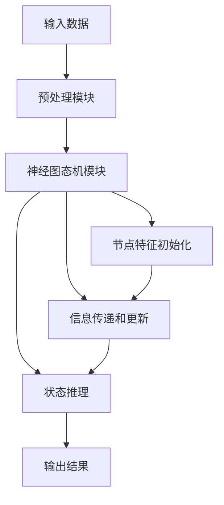

# 基于神经图态机的复杂状态推理系统

> 关键词：神经图态机、复杂状态推理、图神经网络、深度学习、状态表示、推理算法

> 摘要：本文围绕基于神经图态机的复杂状态推理系统展开深入研究。首先介绍了该系统的背景，包括目的、预期读者、文档结构和相关术语。接着阐述了神经图态机及复杂状态推理的核心概念与联系，给出了原理和架构的文本示意图与 Mermaid 流程图。详细讲解了核心算法原理，并使用 Python 代码进行了具体操作步骤的阐述。同时，介绍了相关的数学模型和公式，并举例说明。通过项目实战，展示了代码实际案例及详细解释。探讨了该系统的实际应用场景，推荐了学习、开发工具和相关论文著作。最后总结了未来发展趋势与挑战，并提供了常见问题解答和扩展阅读参考资料。

## 1. 背景介绍 
### 1.1 目的和范围
在当今复杂的现实世界中，许多系统的状态具有高度的复杂性和不确定性，例如社交网络、生物系统、交通网络等。准确地对这些复杂状态进行推理是解决众多实际问题的关键。基于神经图态机的复杂状态推理系统旨在利用神经图态机的强大表达能力和学习能力，对复杂系统的状态进行有效的表示和推理。

本系统的范围涵盖了从复杂系统数据的收集和预处理，到神经图态机模型的构建、训练和优化，再到最终的状态推理和结果分析。通过该系统，我们可以处理各种类型的图数据，包括有向图、无向图、加权图等，并在不同的应用场景中实现准确的状态推理。

### 1.2 预期读者
本文的预期读者包括计算机科学、人工智能、机器学习等领域的研究人员和开发者，以及对复杂系统建模和推理感兴趣的专业人士。对于初学者，本文可以作为了解神经图态机和复杂状态推理的入门资料；对于有一定经验的研究人员和开发者，本文可以提供深入的技术原理和实践案例，为他们的研究和开发工作提供参考。

### 1.3 文档结构概述
本文的结构如下：
- 核心概念与联系：介绍神经图态机和复杂状态推理的核心概念，以及它们之间的联系，并给出相应的原理和架构示意图。
- 核心算法原理 & 具体操作步骤：详细讲解神经图态机的核心算法原理，并使用 Python 代码实现具体的操作步骤。
- 数学模型和公式 & 详细讲解 & 举例说明：介绍神经图态机的数学模型和相关公式，并通过具体的例子进行详细说明。
- 项目实战：代码实际案例和详细解释说明：通过一个实际的项目案例，展示如何使用神经图态机进行复杂状态推理，并对代码进行详细的解释和分析。
- 实际应用场景：探讨基于神经图态机的复杂状态推理系统在不同领域的实际应用场景。
- 工具和资源推荐：推荐一些学习神经图态机和复杂状态推理的相关资源，包括书籍、在线课程、技术博客、开发工具和相关论文著作。
- 总结：未来发展趋势与挑战：总结基于神经图态机的复杂状态推理系统的发展趋势和面临的挑战。
- 附录：常见问题与解答：提供一些常见问题的解答，帮助读者更好地理解和应用本文介绍的技术。
- 扩展阅读 & 参考资料：提供一些扩展阅读的资料和相关的参考文献，方便读者进一步深入研究。

### 1.4 术语表
#### 1.4.1 核心术语定义
- **神经图态机（Neural Graph State Machine）**：一种结合了图神经网络和状态机思想的深度学习模型，用于对图结构数据进行处理和推理。
- **复杂状态推理**：在具有高度复杂性和不确定性的系统中，根据已知的信息和数据，推断系统的当前状态或未来状态的过程。
- **图神经网络（Graph Neural Network）**：一类专门用于处理图结构数据的神经网络，能够自动学习图中节点和边的特征表示。
- **状态表示**：将系统的状态用某种数学形式进行表示，以便于计算机进行处理和分析。

#### 1.4.2 相关概念解释
- **图结构数据**：由节点和边组成的数据结构，节点表示实体，边表示实体之间的关系。例如，社交网络中的用户可以看作节点，用户之间的好友关系可以看作边。
- **深度学习**：一种基于神经网络的机器学习方法，通过构建多层神经网络模型，自动学习数据的特征表示和模式。
- **状态机**：一种抽象的数学模型，用于描述系统的状态转换过程。状态机由一组状态、一组输入事件和一组状态转换规则组成。

#### 1.4.3 缩略词列表
- **GNN**：Graph Neural Network（图神经网络）
- **NGSM**：Neural Graph State Machine（神经图态机）

## 2. 核心概念与联系 

### 2.1 神经图态机原理
神经图态机（NGSM）是一种融合了图神经网络和状态机特性的模型。其核心思想是将图结构数据中的节点看作状态机的状态，边看作状态之间的转换关系。通过图神经网络对节点和边的特征进行学习和更新，从而实现对图结构数据的动态处理和推理。

图神经网络的基本操作包括节点特征聚合和更新。在 NGSM 中，每个节点的特征表示了该节点所代表的状态的信息。通过聚合邻居节点的特征，节点可以获取周围环境的信息，并更新自身的状态。这种信息传递和更新的过程可以迭代进行，使得节点的特征能够不断地反映图的全局信息。

### 2.2 复杂状态推理的概念
复杂状态推理是指在具有高度复杂性和不确定性的系统中，根据已知的信息和数据，推断系统的当前状态或未来状态的过程。复杂系统的状态通常受到多种因素的影响，这些因素之间可能存在复杂的相互作用关系。因此，复杂状态推理需要考虑系统的结构和动态特性，以及数据的不确定性。

### 2.3 核心概念的联系
神经图态机为复杂状态推理提供了一种有效的解决方案。通过将复杂系统的状态表示为图结构数据，NGSM 可以利用图神经网络的强大表达能力和学习能力，对系统的状态进行建模和推理。具体来说，NGSM 可以学习图中节点和边的特征表示，从而捕捉系统的结构和动态信息。同时，通过状态机的思想，NGSM 可以对系统的状态转换进行建模，实现对系统状态的动态推理。

### 2.4 原理和架构的文本示意图
以下是基于神经图态机的复杂状态推理系统的原理和架构的文本示意图：

输入数据：图结构数据，包括节点特征和边信息。
预处理模块：对输入数据进行清洗、归一化等预处理操作。
神经图态机模块：
- 节点特征初始化：为每个节点分配初始特征。
- 信息传递和更新：通过图神经网络进行节点特征的聚合和更新。
- 状态推理：根据更新后的节点特征，推断系统的状态。
输出结果：系统的状态推理结果。

### 2.5 Mermaid 流程图


## 3. 核心算法原理 & 具体操作步骤 

### 3.1 核心算法原理
神经图态机的核心算法基于图神经网络的消息传递机制。消息传递机制的基本思想是通过节点之间的信息传递和聚合，更新节点的特征表示。具体来说，每个节点会向其邻居节点发送消息，邻居节点接收到消息后，会将这些消息进行聚合，并更新自身的特征。

在神经图态机中，消息传递过程可以分为以下几个步骤：
1. **消息生成**：每个节点根据自身的特征和邻居节点的特征，生成要发送给邻居节点的消息。
2. **消息传递**：节点将生成的消息发送给其邻居节点。
3. **消息聚合**：每个节点将接收到的邻居节点的消息进行聚合。
4. **特征更新**：节点根据聚合后的消息，更新自身的特征。

### 3.2 具体操作步骤的 Python 实现
以下是一个简单的 Python 代码示例，展示了如何使用 PyTorch Geometric 库实现神经图态机的消息传递过程：

```python
import torch
import torch.nn.functional as F
from torch_geometric.nn import MessagePassing
from torch_geometric.utils import add_self_loops, degree

class NeuralGraphStateMachine(MessagePassing):
    def __init__(self, in_channels, out_channels):
        super(NeuralGraphStateMachine, self).__init__(aggr='add')  # 使用求和聚合方式
        self.lin = torch.nn.Linear(in_channels, out_channels)

    def forward(self, x, edge_index):
        # 添加自环
        edge_index, _ = add_self_loops(edge_index, num_nodes=x.size(0))

        # 线性变换
        x = self.lin(x)

        # 开始消息传递
        return self.propagate(edge_index, size=(x.size(0), x.size(0)), x=x)

    def message(self, x_j):
        # 消息生成
        return x_j

    def update(self, aggr_out):
        # 特征更新
        return F.relu(aggr_out)

# 示例数据
num_nodes = 4
in_channels = 16
out_channels = 32

x = torch.randn(num_nodes, in_channels)  # 节点特征
edge_index = torch.tensor([[0, 1, 1, 2, 2, 3], [1, 0, 2, 1, 3, 2]], dtype=torch.long)  # 边信息

# 创建神经图态机模型
model = NeuralGraphStateMachine(in_channels, out_channels)

# 进行消息传递和特征更新
output = model(x, edge_index)

print("Output shape:", output.shape)
```

### 3.3 代码解释
1. **NeuralGraphStateMachine 类**：继承自 `MessagePassing` 类，实现了消息传递机制。
2. **`__init__` 方法**：初始化线性变换层，用于对节点特征进行线性变换。
3. **`forward` 方法**：添加自环，对节点特征进行线性变换，并调用 `propagate` 方法开始消息传递。
4. **`message` 方法**：生成要发送给邻居节点的消息。
5. **`update` 方法**：根据聚合后的消息，更新节点的特征。
6. **示例数据**：创建了一个包含 4 个节点的图，每个节点的特征维度为 16。
7. **模型创建和推理**：创建神经图态机模型，并对示例数据进行消息传递和特征更新，最后输出更新后的节点特征。

## 4. 数学模型和公式 & 详细讲解 & 举例说明 

### 4.1 数学模型和公式
#### 4.1.1 节点特征初始化
假设图 $G=(V, E)$ 包含 $N$ 个节点，每个节点的特征向量为 $\mathbf{x}_i \in \mathbb{R}^{d_{in}}$，其中 $d_{in}$ 是输入特征的维度。节点特征初始化可以表示为：
$$
\mathbf{h}_i^{(0)} = \mathbf{x}_i
$$
其中 $\mathbf{h}_i^{(0)}$ 是节点 $i$ 在第 0 层的隐藏状态。

#### 4.1.2 消息传递和特征更新
在第 $l$ 层，节点 $i$ 向其邻居节点 $j$ 发送的消息可以表示为：
$$
\mathbf{m}_{i \to j}^{(l)} = \phi^{(l)}(\mathbf{h}_i^{(l)}, \mathbf{h}_j^{(l)}, \mathbf{e}_{ij})
$$
其中 $\phi^{(l)}$ 是消息生成函数，$\mathbf{e}_{ij}$ 是边 $(i, j)$ 的特征向量。

节点 $i$ 接收到的邻居节点的消息聚合可以表示为：
$$
\mathbf{m}_i^{(l)} = \sum_{j \in \mathcal{N}(i)} \mathbf{m}_{j \to i}^{(l)}
$$
其中 $\mathcal{N}(i)$ 是节点 $i$ 的邻居节点集合。

节点 $i$ 的特征更新可以表示为：
$$
\mathbf{h}_i^{(l+1)} = \psi^{(l)}(\mathbf{h}_i^{(l)}, \mathbf{m}_i^{(l)})
$$
其中 $\psi^{(l)}$ 是特征更新函数。

#### 4.1.3 状态推理
经过 $L$ 层的消息传递和特征更新后，节点 $i$ 的最终隐藏状态为 $\mathbf{h}_i^{(L)}$。状态推理可以通过一个全连接层将节点的最终隐藏状态映射到状态空间：
$$
\mathbf{s}_i = \sigma(\mathbf{W} \mathbf{h}_i^{(L)} + \mathbf{b})
$$
其中 $\mathbf{W}$ 是权重矩阵，$\mathbf{b}$ 是偏置向量，$\sigma$ 是激活函数。

### 4.2 详细讲解
- **节点特征初始化**：将输入的节点特征作为初始的隐藏状态，为后续的消息传递和特征更新提供基础。
- **消息传递和特征更新**：通过消息生成、消息传递和消息聚合，节点可以获取邻居节点的信息，并更新自身的特征。消息生成函数和特征更新函数通常使用神经网络实现，以学习节点和边的特征表示。
- **状态推理**：将节点的最终隐藏状态通过全连接层映射到状态空间，得到节点的状态表示。激活函数可以根据具体的应用场景选择，例如 sigmoid 函数用于二分类问题，softmax 函数用于多分类问题。

### 4.3 举例说明
假设我们有一个包含 3 个节点的图，节点特征维度为 2，边的特征维度为 1。初始节点特征为：
$$
\mathbf{x}_1 = \begin{bmatrix} 0.1 \\ 0.2 \end{bmatrix}, \quad \mathbf{x}_2 = \begin{bmatrix} 0.3 \\ 0.4 \end{bmatrix}, \quad \mathbf{x}_3 = \begin{bmatrix} 0.5 \\ 0.6 \end{bmatrix}
$$
边的特征为：
$$
\mathbf{e}_{12} = 0.1, \quad \mathbf{e}_{23} = 0.2, \quad \mathbf{e}_{13} = 0.3
$$
我们使用一个简单的消息生成函数 $\phi(\mathbf{h}_i, \mathbf{h}_j, \mathbf{e}_{ij}) = \mathbf{h}_i + \mathbf{e}_{ij} \cdot \mathbf{h}_j$ 和特征更新函数 $\psi(\mathbf{h}_i, \mathbf{m}_i) = \tanh(\mathbf{h}_i + \mathbf{m}_i)$。

在第 0 层，节点的隐藏状态等于初始节点特征：
$$
\mathbf{h}_1^{(0)} = \mathbf{x}_1, \quad \mathbf{h}_2^{(0)} = \mathbf{x}_2, \quad \mathbf{h}_3^{(0)} = \mathbf{x}_3
$$
在第 1 层，节点 1 向节点 2 发送的消息为：
$$
\mathbf{m}_{1 \to 2}^{(1)} = \phi(\mathbf{h}_1^{(0)}, \mathbf{h}_2^{(0)}, \mathbf{e}_{12}) = \begin{bmatrix} 0.1 \\ 0.2 \end{bmatrix} + 0.1 \cdot \begin{bmatrix} 0.3 \\ 0.4 \end{bmatrix} = \begin{bmatrix} 0.13 \\ 0.24 \end{bmatrix}
$$
节点 2 接收到的邻居节点的消息聚合为：
$$
\mathbf{m}_2^{(1)} = \mathbf{m}_{1 \to 2}^{(1)} + \mathbf{m}_{3 \to 2}^{(1)}
$$
节点 2 的特征更新为：
$$
\mathbf{h}_2^{(1)} = \psi(\mathbf{h}_2^{(0)}, \mathbf{m}_2^{(1)}) = \tanh(\mathbf{h}_2^{(0)} + \mathbf{m}_2^{(1)})
$$
经过多次迭代的消息传递和特征更新后，我们可以得到节点的最终隐藏状态。假设最终隐藏状态为：
$$
\mathbf{h}_1^{(L)} = \begin{bmatrix} 0.7 \\ 0.8 \end{bmatrix}, \quad \mathbf{h}_2^{(L)} = \begin{bmatrix} 0.9 \\ 1.0 \end{bmatrix}, \quad \mathbf{h}_3^{(L)} = \begin{bmatrix} 1.1 \\ 1.2 \end{bmatrix}
$$
我们使用一个全连接层进行状态推理，假设权重矩阵 $\mathbf{W} = \begin{bmatrix} 1 & 0 \\ 0 & 1 \end{bmatrix}$，偏置向量 $\mathbf{b} = \begin{bmatrix} 0 \\ 0 \end{bmatrix}$，激活函数为 sigmoid 函数。则节点 1 的状态为：
$$
\mathbf{s}_1 = \sigma(\mathbf{W} \mathbf{h}_1^{(L)} + \mathbf{b}) = \sigma(\begin{bmatrix} 1 & 0 \\ 0 & 1 \end{bmatrix} \begin{bmatrix} 0.7 \\ 0.8 \end{bmatrix} + \begin{bmatrix} 0 \\ 0 \end{bmatrix}) = \begin{bmatrix} \sigma(0.7) \\ \sigma(0.8) \end{bmatrix}
$$

## 5. 项目实战：代码实际案例和详细解释说明 

### 5.1  开发环境搭建
#### 5.1.1 安装 Python
首先，确保你已经安装了 Python 3.6 或更高版本。你可以从 Python 官方网站（https://www.python.org/downloads/）下载并安装 Python。

#### 5.1.2 安装 PyTorch 和 PyTorch Geometric
使用以下命令安装 PyTorch 和 PyTorch Geometric：
```sh
pip install torch torchvision torchaudio
pip install torch-geometric
```
#### 5.1.3 安装其他依赖库
安装其他必要的依赖库，如 `numpy`、`matplotlib` 等：
```sh
pip install numpy matplotlib
```

### 5.2  源代码详细实现和代码解读
以下是一个使用神经图态机进行节点分类的项目实战代码示例：

```python
import torch
import torch.nn.functional as F
from torch_geometric.data import Data
from torch_geometric.nn import MessagePassing
from torch_geometric.utils import add_self_loops, degree

# 定义神经图态机模型
class NeuralGraphStateMachine(MessagePassing):
    def __init__(self, in_channels, out_channels):
        super(NeuralGraphStateMachine, self).__init__(aggr='add')  # 使用求和聚合方式
        self.lin = torch.nn.Linear(in_channels, out_channels)

    def forward(self, x, edge_index):
        # 添加自环
        edge_index, _ = add_self_loops(edge_index, num_nodes=x.size(0))

        # 线性变换
        x = self.lin(x)

        # 开始消息传递
        return self.propagate(edge_index, size=(x.size(0), x.size(0)), x=x)

    def message(self, x_j):
        # 消息生成
        return x_j

    def update(self, aggr_out):
        # 特征更新
        return F.relu(aggr_out)

# 定义节点分类模型
class NodeClassifier(torch.nn.Module):
    def __init__(self, in_channels, hidden_channels, out_channels):
        super(NodeClassifier, self).__init__()
        self.ngsm = NeuralGraphStateMachine(in_channels, hidden_channels)
        self.lin = torch.nn.Linear(hidden_channels, out_channels)

    def forward(self, x, edge_index):
        x = self.ngsm(x, edge_index)
        x = F.relu(x)
        x = self.lin(x)
        return F.log_softmax(x, dim=1)

# 示例数据
num_nodes = 4
in_channels = 16
hidden_channels = 32
out_channels = 2

x = torch.randn(num_nodes, in_channels)  # 节点特征
edge_index = torch.tensor([[0, 1, 1, 2, 2, 3], [1, 0, 2, 1, 3, 2]], dtype=torch.long)  # 边信息
y = torch.tensor([0, 1, 0, 1], dtype=torch.long)  # 节点标签

data = Data(x=x, edge_index=edge_index, y=y)

# 创建模型、优化器和损失函数
model = NodeClassifier(in_channels, hidden_channels, out_channels)
optimizer = torch.optim.Adam(model.parameters(), lr=0.01)
criterion = torch.nn.NLLLoss()

# 训练模型
def train():
    model.train()
    optimizer.zero_grad()
    out = model(data.x, data.edge_index)
    loss = criterion(out, data.y)
    loss.backward()
    optimizer.step()
    return loss.item()

# 训练模型
for epoch in range(200):
    loss = train()
    if (epoch + 1) % 10 == 0:
        print(f'Epoch: {epoch + 1}, Loss: {loss:.4f}')

# 评估模型
model.eval()
pred = model(data.x, data.edge_index).argmax(dim=1)
correct = (pred == data.y).sum().item()
acc = correct / data.num_nodes
print(f'Accuracy: {acc:.4f}')
```

### 5.3  代码解读与分析
#### 5.3.1 神经图态机模型
`NeuralGraphStateMachine` 类继承自 `MessagePassing` 类，实现了消息传递机制。在 `forward` 方法中，首先添加自环，然后对节点特征进行线性变换，最后调用 `propagate` 方法开始消息传递。`message` 方法生成要发送给邻居节点的消息，`update` 方法根据聚合后的消息更新节点的特征。

#### 5.3.2 节点分类模型
`NodeClassifier` 类包含一个神经图态机模型和一个全连接层。在 `forward` 方法中，首先通过神经图态机模型对节点特征进行更新，然后使用 ReLU 激活函数进行非线性变换，最后通过全连接层将节点特征映射到分类空间，并使用 `log_softmax` 函数输出概率分布。

#### 5.3.3 训练和评估
在训练过程中，使用 Adam 优化器和负对数似然损失函数进行模型训练。在每个 epoch 中，首先将模型设置为训练模式，然后计算损失并进行反向传播和参数更新。在评估过程中，将模型设置为评估模式，计算预测结果并计算准确率。

## 6. 实际应用场景 
### 6.1 社交网络分析
在社交网络中，用户可以看作节点，用户之间的关系可以看作边。基于神经图态机的复杂状态推理系统可以用于分析社交网络中的用户行为和关系。例如，可以预测用户的兴趣爱好、社交影响力、是否会发生社交互动等。通过对社交网络的状态进行推理，可以为社交平台提供个性化推荐、精准营销等服务。

### 6.2 生物系统建模
生物系统具有高度的复杂性和不确定性，例如蛋白质相互作用网络、基因调控网络等。神经图态机可以用于对生物系统的状态进行建模和推理。例如，可以预测蛋白质的功能、基因的表达水平、生物系统的疾病状态等。通过对生物系统的状态进行推理，可以为生物医学研究提供重要的支持。

### 6.3 交通网络优化
交通网络中的道路、路口和车辆可以看作节点和边。基于神经图态机的复杂状态推理系统可以用于分析交通网络的状态，例如交通流量、拥堵情况等。通过对交通网络的状态进行推理，可以为交通管理部门提供实时的交通信息和决策支持，实现交通网络的优化和智能调度。

### 6.4 金融风险评估
在金融领域，不同的金融资产和投资者之间存在复杂的关系。神经图态机可以用于对金融市场的状态进行建模和推理，例如预测金融资产的价格走势、评估金融风险等。通过对金融市场的状态进行推理，可以为投资者提供决策支持，降低金融风险。

## 7. 工具和资源推荐
### 7.1 学习资源推荐
#### 7.1.1 书籍推荐
- 《图神经网络：基础、前沿与应用》：全面介绍了图神经网络的基本原理、算法和应用，是学习图神经网络的经典书籍。
- 《深度学习》：由深度学习领域的三位顶尖专家撰写，系统地介绍了深度学习的基本概念、算法和应用，是深度学习领域的权威教材。
- 《Python 机器学习》：介绍了使用 Python 进行机器学习的基本方法和技术，包括数据预处理、模型选择、评估和优化等内容。

#### 7.1.2 在线课程
- Coursera 上的“图神经网络”课程：由斯坦福大学的教授授课，详细介绍了图神经网络的基本原理、算法和应用。
- edX 上的“深度学习基础”课程：由微软的专家授课，系统地介绍了深度学习的基本概念、算法和应用。
- 哔哩哔哩上的“图神经网络入门教程”：由国内的专家制作，适合初学者快速入门图神经网络。

#### 7.1.3 技术博客和网站
- Medium 上的“Graph Neural Networks”专栏：汇集了图神经网络领域的最新研究成果和技术文章。
- 机器之心：提供了人工智能领域的最新技术动态和研究成果，包括图神经网络的相关内容。
- 智源社区：国内人工智能领域的专业社区，提供了丰富的技术文章和研究成果。

### 7.2 开发工具框架推荐
#### 7.2.1 IDE和编辑器
- PyCharm：一款功能强大的 Python 集成开发环境，提供了代码编辑、调试、版本控制等功能。
- Jupyter Notebook：一种交互式的编程环境，适合进行数据分析和模型开发。
- Visual Studio Code：一款轻量级的代码编辑器，支持多种编程语言和插件扩展。

#### 7.2.2 调试和性能分析工具
- PyTorch Profiler：PyTorch 提供的性能分析工具，可以帮助开发者分析模型的性能瓶颈。
- TensorBoard：TensorFlow 提供的可视化工具，也可以用于 PyTorch 模型的可视化和调试。
- cProfile：Python 内置的性能分析工具，可以帮助开发者分析代码的性能瓶颈。

#### 7.2.3 相关框架和库
- PyTorch Geometric：一个基于 PyTorch 的图神经网络库，提供了丰富的图神经网络模型和工具。
- DGL（Deep Graph Library）：一个用于图神经网络的深度学习框架，支持多种深度学习框架和硬件平台。
- NetworkX：一个用于图论和网络分析的 Python 库，提供了丰富的图数据结构和算法。

### 7.3 相关论文著作推荐
#### 7.3.1 经典论文
- “Graph Convolutional Networks for Semi-Supervised Classification”：提出了图卷积网络（GCN）的概念，是图神经网络领域的经典论文。
- “Neural Message Passing for Quantum Chemistry”：提出了神经消息传递机制，为图神经网络的发展奠定了基础。
- “Inductive Representation Learning on Large Graphs”：提出了图萨奇（GraphSAGE）模型，解决了图神经网络在大规模图数据上的可扩展性问题。

#### 7.3.2 最新研究成果
- “Graph Transformer Networks”：将Transformer 架构引入图神经网络，提出了图Transformer 网络，取得了很好的效果。
- “Self-Supervised Learning on Graphs: A Survey”：对图神经网络的自监督学习方法进行了全面的综述。
- “Deep Graph Infomax”：提出了一种基于互信息最大化的图神经网络自监督学习方法。

#### 7.3.3 应用案例分析
- “Predicting Drug-Target Interactions with Graph Neural Networks”：介绍了如何使用图神经网络预测药物-靶点相互作用。
- “Graph Neural Networks for Traffic Forecasting: A Survey”：对图神经网络在交通预测中的应用进行了全面的综述。
- “Graph Neural Networks for Social Network Analysis: A Survey”：对图神经网络在社交网络分析中的应用进行了全面的综述。

## 8. 总结：未来发展趋势与挑战
### 8.1 未来发展趋势
#### 8.1.1 模型的可扩展性和效率提升
随着图数据的规模不断增大，如何提高神经图态机模型的可扩展性和效率是未来的一个重要发展方向。研究人员可以探索更高效的消息传递算法、并行计算技术和模型压缩方法，以提高模型的训练和推理速度。

#### 8.1.2 自监督学习和无监督学习
自监督学习和无监督学习可以在没有大量标注数据的情况下进行模型训练，是解决数据标注难题的有效方法。未来的研究可以探索如何将自监督学习和无监督学习方法应用到神经图态机中，提高模型的泛化能力和适应性。

#### 8.1.3 跨领域应用
神经图态机在社交网络、生物系统、交通网络、金融等领域已经取得了很好的应用效果。未来的研究可以进一步探索神经图态机在其他领域的应用，如工业制造、能源管理、环境监测等，为解决实际问题提供更有效的方法和技术。

### 8.2 挑战
#### 8.2.1 数据质量和标注问题
图数据的质量和标注是影响神经图态机模型性能的重要因素。在实际应用中，图数据往往存在噪声、缺失值和不一致性等问题，同时标注数据的成本也很高。如何提高图数据的质量和标注效率是未来需要解决的一个重要问题。

#### 8.2.2 模型解释性和可解释性
神经图态机模型通常是黑盒模型，难以解释模型的决策过程和结果。在一些对模型解释性要求较高的应用场景中，如医疗诊断、金融风险评估等，模型的解释性和可解释性是一个重要的挑战。未来的研究可以探索如何提高神经图态机模型的解释性和可解释性，为模型的应用提供更可靠的支持。

#### 8.2.3 对抗攻击和鲁棒性
在实际应用中，神经图态机模型可能会受到对抗攻击的影响，导致模型的性能下降甚至失效。如何提高神经图态机模型的鲁棒性和抗攻击能力是未来需要解决的一个重要问题。研究人员可以探索对抗训练、防御机制和模型加固等方法，提高模型的鲁棒性和安全性。

## 9. 附录：常见问题与解答
### 9.1 如何选择合适的消息聚合方式？
常见的消息聚合方式包括求和（sum）、均值（mean）、最大值（max）等。选择合适的消息聚合方式需要根据具体的应用场景和数据特点来决定。例如，如果图中的节点具有不同的重要性，可以使用加权求和的方式进行消息聚合；如果图中的节点特征具有相似性，可以使用均值聚合的方式。

### 9.2 如何处理大规模图数据？
处理大规模图数据可以采用以下几种方法：
- 采样方法：如邻居采样、节点采样等，减少图的规模。
- 分块处理：将大图分成多个小图进行处理，然后合并结果。
- 分布式计算：使用分布式计算框架，如 PyTorch DDP、TensorFlow Distributed 等，并行处理大图数据。

### 9.3 如何评估神经图态机模型的性能？
评估神经图态机模型的性能可以使用以下指标：
- 准确率（Accuracy）：分类问题中预测正确的样本数占总样本数的比例。
- 召回率（Recall）：分类问题中预测为正类的样本数占实际正类样本数的比例。
- F1 值（F1-score）：准确率和召回率的调和平均数。
- 均方误差（MSE）：回归问题中预测值与真实值之间的平均平方误差。

### 9.4 如何提高神经图态机模型的泛化能力？
提高神经图态机模型的泛化能力可以采用以下方法：
- 数据增强：对训练数据进行变换和扩充，增加数据的多样性。
- 正则化：如 L1 正则化、L2 正则化、Dropout 等，防止模型过拟合。
- 模型融合：将多个不同的模型进行融合，提高模型的稳定性和泛化能力。

## 10. 扩展阅读 & 参考资料
### 10.1 扩展阅读
- 《人工智能：现代方法》：全面介绍了人工智能的基本概念、算法和应用，是人工智能领域的经典教材。
- 《强化学习：原理与Python实现》：介绍了强化学习的基本原理、算法和应用，适合对强化学习感兴趣的读者。
- 《数据挖掘：概念与技术》：介绍了数据挖掘的基本概念、算法和应用，适合对数据挖掘感兴趣的读者。

### 10.2 参考资料
- [PyTorch Geometric 官方文档](https://pytorch-geometric.readthedocs.io/en/latest/)
- [DGL 官方文档](https://docs.dgl.ai/)
- [NetworkX 官方文档](https://networkx.org/documentation/stable/)

作者：AI天才研究院/AI Genius Institute & 禅与计算机程序设计艺术 /Zen And The Art of Computer Programming