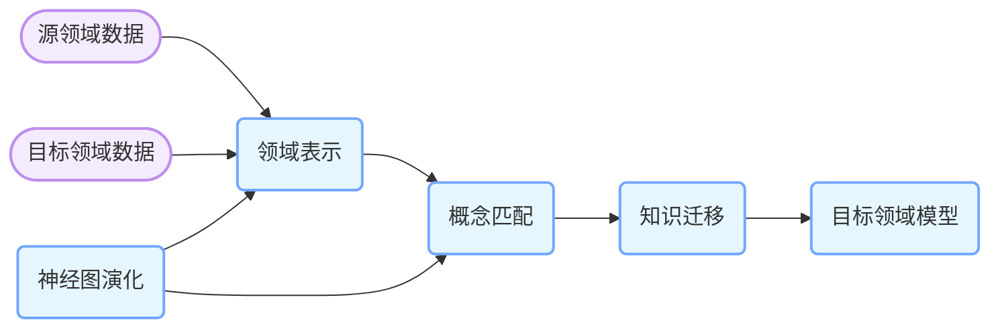

# 基于神经图演化的概念迁移学习模型

> 关键词：神经图演化、概念迁移学习、深度学习、图神经网络、模型架构

> 摘要：本文聚焦于基于神经图演化的概念迁移学习模型，旨在深入探讨该模型的核心原理、算法实现以及实际应用。首先介绍了研究背景和相关概念，详细阐述了神经图演化与概念迁移学习的核心思想及联系。通过Python代码给出了核心算法的具体实现步骤，并结合数学模型和公式进行理论分析。接着通过项目实战展示了模型在实际场景中的应用，包括开发环境搭建、源代码实现和解读。分析了该模型的实际应用场景，推荐了相关的学习资源、开发工具和论文著作。最后对模型的未来发展趋势与挑战进行了总结，并给出常见问题解答和扩展阅读参考资料，为相关领域的研究者和开发者提供全面而深入的技术指导。

## 1. 背景介绍 

### 1.1 目的和范围
随着人工智能技术的不断发展，迁移学习成为解决数据稀缺和模型泛化问题的重要手段。概念迁移学习旨在将一个领域的知识和概念迁移到另一个领域，以提高目标领域的学习效率和性能。然而，传统的迁移学习方法往往难以处理复杂的概念结构和领域之间的语义差异。神经图演化作为一种新兴的技术，能够有效地捕捉数据中的图结构信息，并通过演化过程不断优化图的表示。本研究的目的是构建基于神经图演化的概念迁移学习模型，以解决传统迁移学习方法的局限性，提高概念迁移的效果和效率。

本研究的范围主要包括神经图演化和概念迁移学习的理论基础、核心算法的设计与实现、模型的数学分析、项目实战以及实际应用场景的探讨。

### 1.2 预期读者
本文预期读者包括人工智能、机器学习、数据挖掘等领域的研究者、开发者和学生。对于希望深入了解迁移学习和图神经网络技术的专业人士，以及对新兴技术有探索兴趣的初学者，本文都具有一定的参考价值。

### 1.3 文档结构概述
本文将按照以下结构进行组织：
- 核心概念与联系：介绍神经图演化和概念迁移学习的核心概念，以及它们之间的联系，并给出相应的文本示意图和Mermaid流程图。
- 核心算法原理 & 具体操作步骤：详细阐述基于神经图演化的概念迁移学习模型的核心算法原理，并通过Python代码给出具体的操作步骤。
- 数学模型和公式 & 详细讲解 & 举例说明：使用数学模型和公式对模型进行理论分析，并通过具体例子进行说明。
- 项目实战：代码实际案例和详细解释说明：通过一个实际项目展示模型的应用，包括开发环境搭建、源代码实现和解读。
- 实际应用场景：分析模型在不同领域的实际应用场景。
- 工具和资源推荐：推荐相关的学习资源、开发工具和论文著作。
- 总结：未来发展趋势与挑战：对模型的未来发展趋势和面临的挑战进行总结。
- 附录：常见问题与解答：解答读者在学习和使用模型过程中可能遇到的常见问题。
- 扩展阅读 & 参考资料：提供相关的扩展阅读材料和参考资料。

### 1.4 术语表
#### 1.4.1 核心术语定义
- **神经图演化**：一种基于图神经网络的技术，通过对图结构和节点特征进行演化，不断优化图的表示。
- **概念迁移学习**：将一个领域的知识和概念迁移到另一个领域，以提高目标领域的学习效率和性能。
- **图神经网络（GNN）**：一种专门用于处理图结构数据的神经网络，能够捕捉图中节点和边的信息。
- **源领域**：知识和概念的来源领域。
- **目标领域**：需要应用迁移知识的领域。

#### 1.4.2 相关概念解释
- **图结构**：由节点和边组成的一种数据结构，用于表示对象之间的关系。
- **节点特征**：图中每个节点的属性信息。
- **边特征**：图中每条边的属性信息。
- **嵌入表示**：将节点或图映射到低维向量空间的表示方法。

#### 1.4.3 缩略词列表
- **GNN**：Graph Neural Network（图神经网络）
- **TL**：Transfer Learning（迁移学习）
- **NGE**：Neural Graph Evolution（神经图演化）
- **CTL**：Concept Transfer Learning（概念迁移学习）

## 2. 核心概念与联系 

### 核心概念原理
#### 神经图演化
神经图演化是一种基于图神经网络的技术，其核心思想是通过对图的结构和节点特征进行演化，不断优化图的表示。在神经图演化过程中，图的结构和节点特征会根据一定的规则进行更新，以适应不同的任务和数据。具体来说，神经图演化可以通过以下步骤实现：
1. **初始化图**：给定一个初始的图结构和节点特征。
2. **定义演化规则**：根据任务和数据的特点，定义图结构和节点特征的演化规则。
3. **进行演化**：按照演化规则对图的结构和节点特征进行更新，直到达到收敛条件。

#### 概念迁移学习
概念迁移学习是迁移学习的一种特殊形式，其目标是将源领域的知识和概念迁移到目标领域，以提高目标领域的学习效率和性能。在概念迁移学习中，关键是要找到源领域和目标领域之间的概念对应关系，并将源领域的知识和概念映射到目标领域。具体来说，概念迁移学习可以通过以下步骤实现：
1. **领域表示**：将源领域和目标领域的数据表示为合适的特征向量。
2. **概念匹配**：找到源领域和目标领域之间的概念对应关系。
3. **知识迁移**：将源领域的知识和概念迁移到目标领域。

### 架构的文本示意图
```plaintext
源领域数据 --> 领域表示 --> 概念匹配 --> 知识迁移 --> 目标领域模型
|                                       |
|                                       |
神经图演化 <------------------------------
```

### Mermaid 流程图


## 3. 核心算法原理 & 具体操作步骤 

### 核心算法原理
基于神经图演化的概念迁移学习模型的核心思想是通过神经图演化来优化源领域和目标领域的图表示，从而更好地进行概念匹配和知识迁移。具体来说，该模型的主要步骤包括：
1. **图构建**：将源领域和目标领域的数据构建成图结构，每个节点表示一个数据样本，边表示样本之间的关系。
2. **神经图演化**：使用图神经网络对图的结构和节点特征进行演化，以优化图的表示。
3. **概念匹配**：在演化后的图上进行概念匹配，找到源领域和目标领域之间的概念对应关系。
4. **知识迁移**：根据概念对应关系，将源领域的知识和概念迁移到目标领域。

### 具体操作步骤
以下是使用Python和PyTorch实现基于神经图演化的概念迁移学习模型的具体代码：

```python
import torch
import torch.nn as nn
import torch.nn.functional as F
from torch_geometric.nn import GCNConv

# 定义图神经网络模型
class GNN(nn.Module):
    def __init__(self, in_channels, hidden_channels, out_channels):
        super(GNN, self).__init__()
        self.conv1 = GCNConv(in_channels, hidden_channels)
        self.conv2 = GCNConv(hidden_channels, out_channels)

    def forward(self, x, edge_index):
        x = self.conv1(x, edge_index)
        x = F.relu(x)
        x = self.conv2(x, edge_index)
        return x

# 定义神经图演化过程
def neural_graph_evolution(x, edge_index, num_epochs=100, lr=0.01):
    model = GNN(x.shape[1], 64, x.shape[1])
    optimizer = torch.optim.Adam(model.parameters(), lr=lr)

    for epoch in range(num_epochs):
        optimizer.zero_grad()
        output = model(x, edge_index)
        loss = F.mse_loss(output, x)
        loss.backward()
        optimizer.step()

    return output

# 定义概念匹配函数
def concept_matching(source_x, target_x):
    # 简单的概念匹配方法，这里可以根据具体需求进行修改
    similarity_matrix = torch.mm(source_x, target_x.t())
    _, indices = torch.max(similarity_matrix, dim=1)
    return indices

# 定义知识迁移函数
def knowledge_transfer(source_x, target_x, indices):
    for i in range(len(indices)):
        target_x[i] = source_x[indices[i]]
    return target_x

# 示例数据
source_x = torch.randn(100, 10)
source_edge_index = torch.tensor([[i, j] for i in range(100) for j in range(100) if i!= j], dtype=torch.long).t().contiguous()
target_x = torch.randn(50, 10)
target_edge_index = torch.tensor([[i, j] for i in range(50) for j in range(50) if i!= j], dtype=torch.long).t().contiguous()

# 神经图演化
source_x_evolved = neural_graph_evolution(source_x, source_edge_index)
target_x_evolved = neural_graph_evolution(target_x, target_edge_index)

# 概念匹配
indices = concept_matching(source_x_evolved, target_x_evolved)

# 知识迁移
target_x_transferred = knowledge_transfer(source_x_evolved, target_x_evolved, indices)

print("知识迁移后的目标领域数据:", target_x_transferred)
```

### 代码解释
1. **GNN类**：定义了一个简单的图神经网络模型，包含两个GCN层。
2. **neural_graph_evolution函数**：实现了神经图演化过程，通过多次迭代优化图的表示。
3. **concept_matching函数**：实现了概念匹配，这里使用简单的相似度矩阵来找到源领域和目标领域之间的概念对应关系。
4. **knowledge_transfer函数**：实现了知识迁移，根据概念对应关系将源领域的知识和概念迁移到目标领域。

## 4. 数学模型和公式 & 详细讲解 & 举例说明 

### 数学模型和公式
#### 图神经网络
图神经网络（GNN）通过消息传递机制来更新节点的特征。对于一个图 $G=(V, E)$，其中 $V$ 是节点集合，$E$ 是边集合，节点 $i$ 的特征更新公式可以表示为：

$$
h_i^{(l+1)} = \sigma\left(\sum_{j\in\mathcal{N}(i)}\frac{1}{\sqrt{d_id_j}}W^{(l)}h_j^{(l)} + b^{(l)}\right)
$$

其中，$h_i^{(l)}$ 是节点 $i$ 在第 $l$ 层的特征向量，$\mathcal{N}(i)$ 是节点 $i$ 的邻居节点集合，$d_i$ 是节点 $i$ 的度，$W^{(l)}$ 和 $b^{(l)}$ 是第 $l$ 层的可学习参数，$\sigma$ 是激活函数。

#### 神经图演化
神经图演化的目标是最小化演化后的图表示与原始图表示之间的差异。假设原始图的节点特征为 $X$，演化后的节点特征为 $\hat{X}$，则损失函数可以表示为：

$$
L = \frac{1}{|V|}\sum_{i\in V}\|x_i - \hat{x}_i\|_2^2
$$

其中，$|V|$ 是节点的数量，$x_i$ 和 $\hat{x}_i$ 分别是节点 $i$ 的原始特征和演化后的特征。

#### 概念匹配
概念匹配的目标是找到源领域和目标领域之间的概念对应关系。假设源领域的节点特征为 $X_s$，目标领域的节点特征为 $X_t$，则相似度矩阵可以表示为：

$$
S = X_sX_t^T
$$

然后，对于源领域的每个节点 $i$，找到目标领域中与之最相似的节点 $j$，即：

$$
j = \arg\max_{k}S_{ik}
$$

#### 知识迁移
知识迁移的过程是将源领域的知识和概念迁移到目标领域。假设源领域的节点特征为 $X_s$，目标领域的节点特征为 $X_t$，概念对应关系为 $\pi$，则迁移后的目标领域节点特征可以表示为：

$$
\tilde{X}_t[i] = X_s[\pi(i)]
$$

### 详细讲解
- **图神经网络**：图神经网络通过消息传递机制，将节点的邻居信息聚合到节点自身，从而更新节点的特征。这种机制可以有效地捕捉图中节点之间的关系。
- **神经图演化**：神经图演化通过最小化演化后的图表示与原始图表示之间的差异，不断优化图的表示。这样可以使图的表示更加适合后续的概念匹配和知识迁移任务。
- **概念匹配**：概念匹配通过计算源领域和目标领域节点特征之间的相似度，找到它们之间的概念对应关系。这种对应关系可以帮助我们将源领域的知识和概念迁移到目标领域。
- **知识迁移**：知识迁移根据概念对应关系，将源领域的节点特征直接复制到目标领域的对应节点上，从而实现知识的迁移。

### 举例说明
假设我们有一个源领域的图 $G_s$ 和一个目标领域的图 $G_t$。源领域的图有 3 个节点，节点特征分别为 $x_{s1}=[1, 0]$，$x_{s2}=[0, 1]$，$x_{s3}=[1, 1]$；目标领域的图有 2 个节点，节点特征分别为 $x_{t1}=[0.9, 0.1]$，$x_{t2}=[0.1, 0.9]$。

1. **图神经网络**：使用图神经网络对源领域和目标领域的图进行特征更新，得到新的节点特征。
2. **神经图演化**：对更新后的节点特征进行神经图演化，使图的表示更加优化。
3. **概念匹配**：计算源领域和目标领域节点特征之间的相似度矩阵：

$$
S = \begin{bmatrix}
x_{s1}x_{t1}^T & x_{s1}x_{t2}^T \\
x_{s2}x_{t1}^T & x_{s2}x_{t2}^T \\
x_{s3}x_{t1}^T & x_{s3}x_{t2}^T
\end{bmatrix} = \begin{bmatrix}
0.9 & 0.1 \\
0.1 & 0.9 \\
1 & 1
\end{bmatrix}
$$

然后，找到源领域每个节点对应的目标领域节点：

$$
\pi(1) = 1, \pi(2) = 2, \pi(3) = 1
$$

4. **知识迁移**：根据概念对应关系，将源领域的节点特征迁移到目标领域：

$$
\tilde{x}_{t1} = x_{s1} = [1, 0], \tilde{x}_{t2} = x_{s2} = [0, 1]
$$

这样，我们就完成了从源领域到目标领域的知识迁移。

## 5. 项目实战：代码实际案例和详细解释说明 

### 5.1  开发环境搭建
#### 安装Python和PyTorch
首先，确保你已经安装了Python 3.6或更高版本。可以从Python官方网站（https://www.python.org/downloads/）下载并安装Python。

然后，安装PyTorch。根据你的CUDA版本和操作系统，选择合适的安装命令。例如，如果你使用的是CPU版本的PyTorch，可以使用以下命令：

```bash
pip install torch torchvision
```

#### 安装PyTorch Geometric
PyTorch Geometric是一个用于处理图结构数据的库，我们需要安装它来实现图神经网络。可以使用以下命令安装：

```bash
pip install torch-geometric
```

### 5.2  源代码详细实现和代码解读
以下是一个完整的项目实战代码，用于实现基于神经图演化的概念迁移学习模型：

```python
import torch
import torch.nn as nn
import torch.nn.functional as F
from torch_geometric.nn import GCNConv
from torch_geometric.data import Data

# 定义图神经网络模型
class GNN(nn.Module):
    def __init__(self, in_channels, hidden_channels, out_channels):
        super(GNN, self).__init__()
        self.conv1 = GCNConv(in_channels, hidden_channels)
        self.conv2 = GCNConv(hidden_channels, out_channels)

    def forward(self, x, edge_index):
        x = self.conv1(x, edge_index)
        x = F.relu(x)
        x = self.conv2(x, edge_index)
        return x

# 定义神经图演化过程
def neural_graph_evolution(data, num_epochs=100, lr=0.01):
    model = GNN(data.x.shape[1], 64, data.x.shape[1])
    optimizer = torch.optim.Adam(model.parameters(), lr=lr)

    for epoch in range(num_epochs):
        optimizer.zero_grad()
        output = model(data.x, data.edge_index)
        loss = F.mse_loss(output, data.x)
        loss.backward()
        optimizer.step()

    return output

# 定义概念匹配函数
def concept_matching(source_x, target_x):
    similarity_matrix = torch.mm(source_x, target_x.t())
    _, indices = torch.max(similarity_matrix, dim=1)
    return indices

# 定义知识迁移函数
def knowledge_transfer(source_x, target_x, indices):
    for i in range(len(indices)):
        target_x[i] = source_x[indices[i]]
    return target_x

# 示例数据
source_x = torch.randn(100, 10)
source_edge_index = torch.tensor([[i, j] for i in range(100) for j in range(100) if i!= j], dtype=torch.long).t().contiguous()
source_data = Data(x=source_x, edge_index=source_edge_index)

target_x = torch.randn(50, 10)
target_edge_index = torch.tensor([[i, j] for i in range(50) for j in range(50) if i!= j], dtype=torch.long).t().contiguous()
target_data = Data(x=target_x, edge_index=target_edge_index)

# 神经图演化
source_x_evolved = neural_graph_evolution(source_data)
target_x_evolved = neural_graph_evolution(target_data)

# 概念匹配
indices = concept_matching(source_x_evolved, target_x_evolved)

# 知识迁移
target_x_transferred = knowledge_transfer(source_x_evolved, target_x_evolved, indices)

print("知识迁移后的目标领域数据:", target_x_transferred)
```

### 代码解读与分析
1. **GNN类**：定义了一个简单的图神经网络模型，包含两个GCN层。在`__init__`方法中，初始化了两个GCN层；在`forward`方法中，定义了模型的前向传播过程。
2. **neural_graph_evolution函数**：实现了神经图演化过程。首先初始化一个GNN模型和一个Adam优化器，然后在每个epoch中，计算模型的输出和损失，并进行反向传播和参数更新。
3. **concept_matching函数**：实现了概念匹配。通过计算源领域和目标领域节点特征之间的相似度矩阵，找到每个源领域节点对应的目标领域节点。
4. **knowledge_transfer函数**：实现了知识迁移。根据概念对应关系，将源领域的节点特征复制到目标领域的对应节点上。
5. **示例数据**：生成了源领域和目标领域的示例数据，并将其封装成`Data`对象。
6. **神经图演化、概念匹配和知识迁移**：依次调用`neural_graph_evolution`、`concept_matching`和`knowledge_transfer`函数，完成基于神经图演化的概念迁移学习过程。

## 6. 实际应用场景 
### 计算机视觉
在计算机视觉领域，基于神经图演化的概念迁移学习模型可以用于图像分类、目标检测和图像分割等任务。例如，在图像分类任务中，源领域可以是一个大规模的图像数据集，目标领域可以是一个小规模的特定领域图像数据集。通过神经图演化和概念迁移学习，可以将源领域的知识和概念迁移到目标领域，提高目标领域的分类准确率。

### 自然语言处理
在自然语言处理领域，该模型可以用于文本分类、情感分析和机器翻译等任务。例如，在文本分类任务中，源领域可以是一个通用的文本数据集，目标领域可以是一个特定领域的文本数据集。通过神经图演化和概念迁移学习，可以将源领域的知识和概念迁移到目标领域，提高目标领域的分类性能。

### 生物信息学
在生物信息学领域，该模型可以用于基因表达分析、蛋白质结构预测和药物发现等任务。例如，在基因表达分析任务中，源领域可以是一个大规模的基因表达数据集，目标领域可以是一个特定疾病的基因表达数据集。通过神经图演化和概念迁移学习，可以将源领域的知识和概念迁移到目标领域，帮助发现与疾病相关的基因。

### 社交网络分析
在社交网络分析领域，该模型可以用于节点分类、链接预测和社区发现等任务。例如，在节点分类任务中，源领域可以是一个大规模的社交网络数据集，目标领域可以是一个特定社交网络的数据集。通过神经图演化和概念迁移学习，可以将源领域的知识和概念迁移到目标领域，提高目标领域的分类准确率。

## 7. 工具和资源推荐
### 7.1 学习资源推荐
#### 7.1.1 书籍推荐
- 《深度学习》（Deep Learning）：由Ian Goodfellow、Yoshua Bengio和Aaron Courville所著，是深度学习领域的经典教材，涵盖了深度学习的基本概念、算法和应用。
- 《图神经网络：基础、前沿与应用》：介绍了图神经网络的基本原理、算法和应用，对理解神经图演化和概念迁移学习有很大帮助。
- 《迁移学习》（Transfer Learning）：由Qiang Yang和Yang Liu所著，系统地介绍了迁移学习的理论和方法，包括概念迁移学习的相关内容。

#### 7.1.2 在线课程
- Coursera上的“深度学习专项课程”（Deep Learning Specialization）：由Andrew Ng教授授课，包括深度学习的基础、卷积神经网络、循环神经网络等内容，是学习深度学习的优质课程。
- edX上的“图神经网络：基础与应用”（Graph Neural Networks: Foundations and Applications）：介绍了图神经网络的基本原理和应用，对理解神经图演化有很大帮助。
- Udemy上的“迁移学习实战”（Transfer Learning in Practice）：通过实际案例介绍了迁移学习的应用，对掌握概念迁移学习有一定的参考价值。

#### 7.1.3 技术博客和网站
- Medium上的“Towards Data Science”：是一个专注于数据科学和机器学习的博客平台，有很多关于深度学习、迁移学习和图神经网络的优质文章。
- arXiv：是一个预印本数据库，包含了很多最新的学术研究成果，你可以在上面找到关于神经图演化和概念迁移学习的最新论文。
- GitHub：是一个代码托管平台，你可以在上面找到很多开源的深度学习和图神经网络项目，学习他人的代码实现。

### 7.2 开发工具框架推荐
#### 7.2.1 IDE和编辑器
- PyCharm：是一款专门为Python开发设计的集成开发环境（IDE），具有强大的代码编辑、调试和项目管理功能。
- Jupyter Notebook：是一个交互式的开发环境，适合进行数据探索、模型训练和结果可视化。
- Visual Studio Code：是一个轻量级的代码编辑器，支持多种编程语言和插件扩展，也可以用于Python开发。

#### 7.2.2 调试和性能分析工具
- PyTorch Profiler：是PyTorch提供的一个性能分析工具，可以帮助你分析模型的运行时间、内存使用等情况。
- TensorBoard：是TensorFlow提供的一个可视化工具，也可以与PyTorch结合使用，用于可视化模型的训练过程和结果。
- cProfile：是Python标准库中的一个性能分析工具，可以帮助你分析Python代码的运行时间和函数调用情况。

#### 7.2.3 相关框架和库
- PyTorch：是一个开源的深度学习框架，提供了丰富的神经网络层和优化算法，对图神经网络的支持也很好。
- PyTorch Geometric：是一个基于PyTorch的图神经网络库，提供了多种图神经网络模型和工具，方便进行图结构数据的处理和分析。
- scikit-learn：是一个开源的机器学习库，提供了多种机器学习算法和工具，可用于数据预处理、模型评估等任务。

### 7.3 相关论文著作推荐
#### 7.3.1 经典论文
- “Graph Convolutional Networks for Semi-Supervised Classification”：介绍了图卷积网络（GCN）的基本原理和应用，是图神经网络领域的经典论文。
- “Transfer Learning for Cross-Domain Sentiment Classification”：探讨了跨领域情感分类中的迁移学习方法，对理解概念迁移学习有一定的启发。
- “Neural Graph Evolution for Graph Representation Learning”：提出了神经图演化的方法，用于图表示学习。

#### 7.3.2 最新研究成果
- 可以关注arXiv上关于神经图演化和概念迁移学习的最新论文，了解该领域的最新研究动态。
- 参加相关的学术会议，如NeurIPS、ICML、CVPR等，获取最新的研究成果和技术趋势。

#### 7.3.3 应用案例分析
- 可以在学术数据库（如IEEE Xplore、ACM Digital Library等）中搜索基于神经图演化和概念迁移学习的应用案例，学习他人的实践经验。
- 关注一些开源项目和技术博客，了解实际应用中的问题和解决方案。

## 8. 总结：未来发展趋势与挑战
### 未来发展趋势
- **模型的融合与创新**：未来，基于神经图演化的概念迁移学习模型可能会与其他深度学习模型（如卷积神经网络、循环神经网络等）进行融合，以提高模型的性能和泛化能力。同时，也会不断涌现出创新的模型架构和算法，以更好地解决复杂的迁移学习问题。
- **跨领域应用的拓展**：随着技术的不断发展，该模型将在更多的领域得到应用，如医疗保健、金融、交通等。通过将不同领域的知识和概念进行迁移，可以为这些领域带来新的发展机遇。
- **与强化学习的结合**：将神经图演化的概念迁移学习模型与强化学习相结合，可以实现更加智能的决策和行为。例如，在机器人控制、自动驾驶等领域，通过迁移学习可以快速适应不同的环境和任务。

### 挑战
- **领域差异的处理**：不同领域之间的差异可能会导致概念匹配和知识迁移的困难。如何有效地处理领域差异，找到更加准确的概念对应关系，是未来需要解决的一个重要问题。
- **模型的可解释性**：深度学习模型往往缺乏可解释性，基于神经图演化的概念迁移学习模型也不例外。如何提高模型的可解释性，让人们更好地理解模型的决策过程，是当前研究的热点之一。
- **数据隐私和安全**：在迁移学习过程中，需要使用源领域和目标领域的数据。如何保护数据的隐私和安全，避免数据泄露和滥用，是一个需要关注的问题。

## 9. 附录：常见问题与解答
### 1. 神经图演化和传统图神经网络有什么区别？
神经图演化是在传统图神经网络的基础上，通过对图的结构和节点特征进行演化，不断优化图的表示。与传统图神经网络相比，神经图演化更加注重图的动态变化和优化过程，可以更好地适应不同的任务和数据。

### 2. 概念迁移学习和传统迁移学习有什么区别？
概念迁移学习是传统迁移学习的一种特殊形式，它更加注重源领域和目标领域之间的概念对应关系。传统迁移学习通常是将源领域的模型参数或特征表示迁移到目标领域，而概念迁移学习则是将源领域的知识和概念迁移到目标领域，以提高目标领域的学习效率和性能。

### 3. 如何选择合适的图神经网络模型进行神经图演化？
选择合适的图神经网络模型需要考虑以下因素：
- 数据的特点：不同的图神经网络模型适用于不同类型的图数据，如节点分类、链接预测等。
- 任务的需求：根据具体的任务需求，选择合适的模型架构和损失函数。
- 计算资源：不同的图神经网络模型的计算复杂度不同，需要根据计算资源的情况进行选择。

### 4. 如何评估基于神经图演化的概念迁移学习模型的性能？
可以使用以下指标来评估模型的性能：
- 准确率：在目标领域的分类或预测任务中，模型预测正确的样本数占总样本数的比例。
- 召回率：在目标领域的分类或预测任务中，模型正确预测的正样本数占实际正样本数的比例。
- F1值：综合考虑准确率和召回率的指标，计算公式为 $F1 = 2\times\frac{准确率\times召回率}{准确率 + 召回率}$。
- 均方误差（MSE）：在回归任务中，模型预测值与真实值之间的均方误差。

## 10. 扩展阅读 & 参考资料
### 扩展阅读
- 《深度学习实战》：通过实际案例介绍了深度学习的应用，对理解基于神经图演化的概念迁移学习模型的实际应用有很大帮助。
- 《图机器学习》：系统地介绍了图机器学习的理论和方法，包括图神经网络、图嵌入等内容。
- 《迁移学习实战：Python实现》：通过Python代码实现了多种迁移学习算法，对掌握概念迁移学习的代码实现有一定的参考价值。

### 参考资料
- Goodfellow, I., Bengio, Y., & Courville, A. (2016). Deep Learning. MIT Press.
- Zhou, J., Cui, G., Zhang, Z., Yang, C., Liu, Z., Wang, L.,... & Li, M. (2020). Graph neural networks: A review of methods and applications. AI Open, 1, 57-81.
- Yang, Q., & Liu, Y. (2010). Transfer Learning. Morgan & Claypool Publishers.

作者：AI天才研究院/AI Genius Institute & 禅与计算机程序设计艺术 /Zen And The Art of Computer Programming