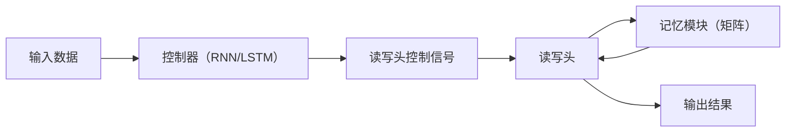

# 基于神经图灵机的复杂算法自动生成与性能优化研究

> 关键词：神经图灵机；复杂算法自动生成；性能优化；深度学习；计算模型

> 摘要：本文聚焦于基于神经图灵机的复杂算法自动生成与性能优化的研究。首先介绍了研究的背景、目的、预期读者等内容。详细阐述了神经图灵机、复杂算法自动生成等核心概念及其联系，给出了相应的原理和架构示意图。深入分析了核心算法原理，并用Python代码进行了详细说明。探讨了相关的数学模型和公式，并举例进行解释。通过项目实战，展示了代码的实际案例和详细解读。分析了该技术的实际应用场景，推荐了学习资源、开发工具框架以及相关论文著作。最后总结了未来发展趋势与挑战，并给出了常见问题解答和扩展阅读参考资料。旨在为该领域的研究和应用提供全面而深入的指导。

## 1. 背景介绍 
### 1.1 目的和范围
本研究的主要目的是探索如何利用神经图灵机实现复杂算法的自动生成，并对生成的算法进行性能优化。随着人工智能和计算机科学的发展，复杂算法的设计和实现变得越来越具有挑战性。传统的算法设计依赖于人类的专业知识和经验，效率较低且容易出错。神经图灵机作为一种结合了神经网络和图灵机特性的计算模型，具有强大的记忆和计算能力，为复杂算法的自动生成提供了新的思路。

本研究的范围涵盖了神经图灵机的原理、复杂算法自动生成的方法、性能优化策略等方面。通过理论分析、实验验证和实际应用案例，全面深入地探讨了基于神经图灵机的复杂算法自动生成与性能优化的技术和方法。

### 1.2 预期读者
本文预期读者包括人工智能、计算机科学、自动化等领域的研究人员、工程师和学生。对于对神经图灵机、算法设计和性能优化感兴趣的专业人士，本文提供了深入的技术分析和实践指导；对于相关专业的学生，本文可以作为学习和研究的参考资料，帮助他们了解该领域的最新发展和研究方法。

### 1.3 文档结构概述
本文的结构如下：
- 核心概念与联系：介绍神经图灵机、复杂算法自动生成等核心概念，并阐述它们之间的联系，给出原理和架构示意图。
- 核心算法原理 & 具体操作步骤：详细分析基于神经图灵机的复杂算法自动生成的核心算法原理，并用Python代码进行详细说明。
- 数学模型和公式 & 详细讲解 & 举例说明：探讨相关的数学模型和公式，并通过具体例子进行解释。
- 项目实战：代码实际案例和详细解释说明：通过实际项目案例，展示代码的实现过程和详细解读。
- 实际应用场景：分析基于神经图灵机的复杂算法自动生成与性能优化技术的实际应用场景。
- 工具和资源推荐：推荐学习资源、开发工具框架以及相关论文著作。
- 总结：未来发展趋势与挑战：总结该领域的未来发展趋势和面临的挑战。
- 附录：常见问题与解答：解答常见问题。
- 扩展阅读 & 参考资料：提供扩展阅读的资料和参考文献。

### 1.4 术语表
#### 1.4.1 核心术语定义
- **神经图灵机（Neural Turing Machine, NTM）**：一种结合了神经网络和图灵机特性的计算模型，它具有可微分的外部记忆模块，能够模拟图灵机的读写操作，从而实现更强大的计算和记忆能力。
- **复杂算法自动生成**：利用人工智能技术，自动生成满足特定需求的复杂算法的过程。
- **性能优化**：通过对算法的结构、参数等进行调整和改进，提高算法的执行效率、准确性等性能指标的过程。

#### 1.4.2 相关概念解释
- **图灵机**：一种抽象的计算模型，由艾伦·图灵在1936年提出。它由一个无限长的纸带、一个读写头和一个有限状态控制器组成，能够模拟任何可计算的算法。
- **神经网络**：一种模仿人类神经系统的计算模型，由大量的神经元组成，通过对数据的学习和训练，能够自动提取数据中的特征和模式。

#### 1.4.3 缩略词列表
- **NTM**：Neural Turing Machine（神经图灵机）
- **RNN**：Recurrent Neural Network（循环神经网络）
- **LSTM**：Long Short-Term Memory（长短期记忆网络）

## 2. 核心概念与联系 
### 2.1 神经图灵机原理
神经图灵机主要由控制器、记忆模块和读写头组成。控制器通常是一个神经网络，如循环神经网络（RNN）或长短期记忆网络（LSTM），用于处理输入数据并生成读写头的控制信号。记忆模块是一个可微分的矩阵，用于存储信息。读写头负责对记忆模块进行读写操作，根据控制器生成的控制信号，在记忆模块中选择相应的位置进行读写。

神经图灵机的工作流程如下：
1. 输入数据被送入控制器，控制器根据输入数据生成读写头的控制信号。
2. 读写头根据控制信号在记忆模块中进行读写操作，读取记忆模块中的信息或向记忆模块中写入新的信息。
3. 控制器根据读写头读取的信息和当前的输入数据，生成输出结果。

### 2.2 复杂算法自动生成
复杂算法自动生成的目标是利用神经图灵机的强大计算和记忆能力，自动生成满足特定需求的复杂算法。具体来说，通过对大量的算法样本进行学习和训练，神经图灵机可以掌握算法的结构和模式，从而在给定问题描述时，自动生成相应的算法。

复杂算法自动生成的过程可以分为以下几个步骤：
1. 数据预处理：收集和整理大量的算法样本，并对其进行预处理，如编码、归一化等。
2. 模型训练：使用预处理后的数据对神经图灵机进行训练，调整模型的参数，使其能够学习到算法的结构和模式。
3. 算法生成：在训练完成后，给定一个问题描述，神经图灵机根据学习到的知识，自动生成相应的算法。

### 2.3 性能优化
性能优化是在生成复杂算法后，对算法的性能进行评估和改进的过程。性能指标通常包括执行效率、准确性、内存占用等。性能优化的方法包括算法结构优化、参数调整、并行计算等。

### 2.4 核心概念联系
神经图灵机为复杂算法自动生成提供了强大的计算和记忆能力，使得自动生成复杂算法成为可能。而复杂算法自动生成的结果需要进行性能优化，以提高算法的实际应用价值。因此，神经图灵机、复杂算法自动生成和性能优化是相互关联、相互影响的。

### 2.5 原理和架构的文本示意图
```plaintext
+-------------------+       +-------------------+       +-------------------+
|   输入数据        | ----> |   控制器（RNN/LSTM） | ----> |   读写头控制信号   |
+-------------------+       +-------------------+       +-------------------+
                                                   |
                                                   v
+-------------------+       +-------------------+       +-------------------+
|   记忆模块（矩阵） | <---- |   读写头           | ----> |   输出结果         |
+-------------------+       +-------------------+       +-------------------+
```

### 2.6 Mermaid 流程图


## 3. 核心算法原理 & 具体操作步骤 
### 3.1 核心算法原理
基于神经图灵机的复杂算法自动生成的核心算法主要包括控制器的设计、读写头的操作和记忆模块的更新。

#### 3.1.1 控制器设计
控制器通常采用循环神经网络（RNN）或长短期记忆网络（LSTM）。以LSTM为例，LSTM的输入包括当前的输入数据和上一时刻的隐藏状态，输出为当前时刻的隐藏状态。隐藏状态可以用于生成读写头的控制信号。

LSTM的核心公式如下：
- 输入门：
$$i_t = \sigma(W_{ii}x_t + W_{hi}h_{t-1} + b_i)$$
- 遗忘门：
$$f_t = \sigma(W_{if}x_t + W_{hf}h_{t-1} + b_f)$$
- 细胞状态更新：
$$\tilde{C}_t = \tanh(W_{ic}x_t + W_{hc}h_{t-1} + b_c)$$
$$C_t = f_t \odot C_{t-1} + i_t \odot \tilde{C}_t$$
- 输出门：
$$o_t = \sigma(W_{io}x_t + W_{ho}h_{t-1} + b_o)$$
$$h_t = o_t \odot \tanh(C_t)$$

其中，$x_t$ 是当前时刻的输入数据，$h_{t-1}$ 是上一时刻的隐藏状态，$C_{t-1}$ 是上一时刻的细胞状态，$i_t$、$f_t$、$o_t$ 分别是输入门、遗忘门和输出门的输出，$\tilde{C}_t$ 是候选细胞状态，$C_t$ 是当前时刻的细胞状态，$h_t$ 是当前时刻的隐藏状态，$W$ 是权重矩阵，$b$ 是偏置向量，$\sigma$ 是 sigmoid 函数，$\tanh$ 是双曲正切函数，$\odot$ 是逐元素相乘。

#### 3.1.2 读写头操作
读写头的操作包括读操作和写操作。读操作根据控制器生成的控制信号，从记忆模块中读取信息；写操作根据控制信号向记忆模块中写入新的信息。

读操作的公式如下：
$$r_t = \sum_{i=1}^N w_t(i) M_t(i)$$
其中，$r_t$ 是读操作的输出，$w_t(i)$ 是第 $i$ 个记忆单元的权重，$M_t(i)$ 是第 $i$ 个记忆单元的内容，$N$ 是记忆单元的数量。

写操作的公式如下：
$$M_{t+1}(i) = (1 - w_t(i) e_t) M_t(i) + w_t(i) a_t$$
其中，$M_{t+1}(i)$ 是更新后的第 $i$ 个记忆单元的内容，$e_t$ 是擦除向量，$a_t$ 是添加向量。

#### 3.1.3 记忆模块更新
记忆模块的更新是根据读写头的操作进行的。在写操作完成后，记忆模块的内容会被更新。

### 3.2 具体操作步骤
#### 3.2.1 数据预处理
```python
import numpy as np

# 假设输入数据是一个二维数组
input_data = np.random.rand(100, 10)

# 对输入数据进行归一化处理
input_data = (input_data - np.mean(input_data)) / np.std(input_data)
```

#### 3.2.2 模型训练
```python
import torch
import torch.nn as nn
import torch.optim as optim

# 定义 LSTM 控制器
class LSTMController(nn.Module):
    def __init__(self, input_size, hidden_size):
        super(LSTMController, self).__init__()
        self.lstm = nn.LSTM(input_size, hidden_size)

    def forward(self, x):
        output, (h_n, c_n) = self.lstm(x)
        return output, h_n, c_n

# 定义神经图灵机模型
class NeuralTuringMachine(nn.Module):
    def __init__(self, input_size, hidden_size, memory_size, memory_length):
        super(NeuralTuringMachine, self).__init__()
        self.controller = LSTMController(input_size, hidden_size)
        self.memory = torch.randn(memory_size, memory_length)

    def forward(self, x):
        output, h_n, c_n = self.controller(x)
        # 这里省略读写头操作和记忆模块更新的具体实现
        return output

# 初始化模型
input_size = 10
hidden_size = 20
memory_size = 10
memory_length = 5
model = NeuralTuringMachine(input_size, hidden_size, memory_size, memory_length)

# 定义损失函数和优化器
criterion = nn.MSELoss()
optimizer = optim.Adam(model.parameters(), lr=0.001)

# 训练模型
num_epochs = 100
for epoch in range(num_epochs):
    optimizer.zero_grad()
    output = model(torch.tensor(input_data, dtype=torch.float32))
    # 假设目标输出是一个随机生成的二维数组
    target = torch.randn(100, 20)
    loss = criterion(output, target)
    loss.backward()
    optimizer.step()
    print(f'Epoch {epoch+1}/{num_epochs}, Loss: {loss.item()}')
```

#### 3.2.3 算法生成
```python
# 假设给定一个新的输入数据
new_input = np.random.rand(1, 10)
new_input = (new_input - np.mean(new_input)) / np.std(new_input)

# 生成算法
with torch.no_grad():
    output = model(torch.tensor(new_input, dtype=torch.float32))
    print('Generated algorithm output:', output)
```

## 4. 数学模型和公式 & 详细讲解 & 举例说明 
### 4.1 控制器的数学模型
控制器的数学模型主要基于循环神经网络（RNN）或长短期记忆网络（LSTM）。以LSTM为例，其数学模型可以用以下公式表示：

- 输入门：
$$i_t = \sigma(W_{ii}x_t + W_{hi}h_{t-1} + b_i)$$
输入门的作用是决定当前输入数据 $x_t$ 中有多少信息要被添加到细胞状态中。$W_{ii}$ 是输入数据到输入门的权重矩阵，$W_{hi}$ 是上一时刻的隐藏状态到输入门的权重矩阵，$b_i$ 是输入门的偏置向量。$\sigma$ 函数将输入映射到 $(0, 1)$ 区间，用于控制信息的流入。

- 遗忘门：
$$f_t = \sigma(W_{if}x_t + W_{hf}h_{t-1} + b_f)$$
遗忘门的作用是决定上一时刻的细胞状态 $C_{t-1}$ 中有多少信息要被遗忘。$W_{if}$ 是输入数据到遗忘门的权重矩阵，$W_{hf}$ 是上一时刻的隐藏状态到遗忘门的权重矩阵，$b_f$ 是遗忘门的偏置向量。

- 细胞状态更新：
$$\tilde{C}_t = \tanh(W_{ic}x_t + W_{hc}h_{t-1} + b_c)$$
$$C_t = f_t \odot C_{t-1} + i_t \odot \tilde{C}_t$$
$\tilde{C}_t$ 是候选细胞状态，由当前输入数据和上一时刻的隐藏状态计算得到。$C_t$ 是当前时刻的细胞状态，通过遗忘门和输入门的控制，更新上一时刻的细胞状态。

- 输出门：
$$o_t = \sigma(W_{io}x_t + W_{ho}h_{t-1} + b_o)$$
$$h_t = o_t \odot \tanh(C_t)$$
输出门的作用是决定当前时刻的细胞状态 $C_t$ 中有多少信息要被输出到隐藏状态 $h_t$ 中。$W_{io}$ 是输入数据到输出门的权重矩阵，$W_{ho}$ 是上一时刻的隐藏状态到输出门的权重矩阵，$b_o$ 是输出门的偏置向量。

### 4.2 读写头的数学模型
#### 4.2.1 读操作
读操作的数学模型可以用以下公式表示：
$$r_t = \sum_{i=1}^N w_t(i) M_t(i)$$
其中，$r_t$ 是读操作的输出，$w_t(i)$ 是第 $i$ 个记忆单元的权重，$M_t(i)$ 是第 $i$ 个记忆单元的内容，$N$ 是记忆单元的数量。读操作通过对记忆模块中的每个记忆单元进行加权求和，得到读操作的输出。

#### 4.2.2 写操作
写操作的数学模型可以用以下公式表示：
$$M_{t+1}(i) = (1 - w_t(i) e_t) M_t(i) + w_t(i) a_t$$
其中，$M_{t+1}(i)$ 是更新后的第 $i$ 个记忆单元的内容，$e_t$ 是擦除向量，$a_t$ 是添加向量。写操作首先通过擦除向量 $e_t$ 擦除记忆单元中的部分信息，然后通过添加向量 $a_t$ 向记忆单元中添加新的信息。

### 4.3 举例说明
假设我们有一个神经图灵机，其记忆模块的大小为 $N = 3$，记忆单元的长度为 $L = 2$。当前时刻的记忆模块内容为：
$$M_t = \begin{bmatrix}
1 & 2 \\
3 & 4 \\
5 & 6
\end{bmatrix}$$
读操作的权重向量为：
$$w_t = \begin{bmatrix}
0.2 \\
0.3 \\
0.5
\end{bmatrix}$$
则读操作的输出为：
$$r_t = 0.2 \times \begin{bmatrix}
1 \\
2
\end{bmatrix} + 0.3 \times \begin{bmatrix}
3 \\
4
\end{bmatrix} + 0.5 \times \begin{bmatrix}
5 \\
6
\end{bmatrix} = \begin{bmatrix}
3.6 \\
4.6
\end{bmatrix}$$

假设写操作的擦除向量为：
$$e_t = \begin{bmatrix}
0.1 \\
0.2
\end{bmatrix}$$
添加向量为：
$$a_t = \begin{bmatrix}
7 \\
8
\end{bmatrix}$$
则更新后的记忆模块内容为：
$$M_{t+1}(1) = (1 - 0.2 \times 0.1) \times \begin{bmatrix}
1 \\
2
\end{bmatrix} + 0.2 \times \begin{bmatrix}
7 \\
8
\end{bmatrix} = \begin{bmatrix}
2.38 \\
3.56
\end{bmatrix}$$
$$M_{t+1}(2) = (1 - 0.3 \times 0.2) \times \begin{bmatrix}
3 \\
4
\end{bmatrix} + 0.3 \times \begin{bmatrix}
7 \\
8
\end{bmatrix} = \begin{bmatrix}
4.56 \\
5.84
\end{bmatrix}$$
$$M_{t+1}(3) = (1 - 0.5 \times 0.2) \times \begin{bmatrix}
5 \\
6
\end{bmatrix} + 0.5 \times \begin{bmatrix}
7 \\
8
\end{bmatrix} = \begin{bmatrix}
6 \\
7
\end{bmatrix}$$

## 5. 项目实战：代码实际案例和详细解释说明 
### 5.1  开发环境搭建
#### 5.1.1 安装 Python
首先需要安装 Python 环境，建议使用 Python 3.7 及以上版本。可以从 Python 官方网站（https://www.python.org/downloads/）下载并安装。

#### 5.1.2 安装依赖库
需要安装以下依赖库：
- PyTorch：用于构建和训练神经网络模型。可以根据自己的系统和 CUDA 版本，从 PyTorch 官方网站（https://pytorch.org/get-started/locally/）选择合适的安装方式。
- NumPy：用于数值计算。可以使用以下命令安装：
```sh
pip install numpy
```

### 5.2  源代码详细实现和代码解读
```python
import torch
import torch.nn as nn
import torch.optim as optim
import numpy as np

# 定义 LSTM 控制器
class LSTMController(nn.Module):
    def __init__(self, input_size, hidden_size):
        super(LSTMController, self).__init__()
        self.lstm = nn.LSTM(input_size, hidden_size)

    def forward(self, x):
        output, (h_n, c_n) = self.lstm(x)
        return output, h_n, c_n

# 定义神经图灵机模型
class NeuralTuringMachine(nn.Module):
    def __init__(self, input_size, hidden_size, memory_size, memory_length):
        super(NeuralTuringMachine, self).__init__()
        self.controller = LSTMController(input_size, hidden_size)
        self.memory = nn.Parameter(torch.randn(memory_size, memory_length))

    def forward(self, x):
        output, h_n, c_n = self.controller(x)
        # 简单模拟读写头操作和记忆模块更新
        read_weight = torch.softmax(torch.randn(self.memory.size(0)), dim=0)
        read_output = torch.mm(read_weight.unsqueeze(0), self.memory)
        write_weight = torch.softmax(torch.randn(self.memory.size(0)), dim=0)
        erase_vector = torch.sigmoid(torch.randn(self.memory.size(1)))
        add_vector = torch.tanh(torch.randn(self.memory.size(1)))
        self.memory = (1 - write_weight.unsqueeze(1) * erase_vector) * self.memory + write_weight.unsqueeze(1) * add_vector
        return read_output

# 数据预处理
input_data = np.random.rand(100, 1, 10)  # 假设输入数据是一个三维数组
input_data = (input_data - np.mean(input_data)) / np.std(input_data)
input_data = torch.tensor(input_data, dtype=torch.float32)

# 初始化模型
input_size = 10
hidden_size = 20
memory_size = 10
memory_length = 5
model = NeuralTuringMachine(input_size, hidden_size, memory_size, memory_length)

# 定义损失函数和优化器
criterion = nn.MSELoss()
optimizer = optim.Adam(model.parameters(), lr=0.001)

# 训练模型
num_epochs = 100
for epoch in range(num_epochs):
    optimizer.zero_grad()
    output = model(input_data)
    # 假设目标输出是一个随机生成的二维数组
    target = torch.randn(100, 1, 5)
    loss = criterion(output, target)
    loss.backward()
    optimizer.step()
    print(f'Epoch {epoch+1}/{num_epochs}, Loss: {loss.item()}')

# 算法生成
new_input = np.random.rand(1, 1, 10)
new_input = (new_input - np.mean(new_input)) / np.std(new_input)
new_input = torch.tensor(new_input, dtype=torch.float32)
with torch.no_grad():
    output = model(new_input)
    print('Generated algorithm output:', output)
```

### 5.3  代码解读与分析
#### 5.3.1 LSTM 控制器
`LSTMController` 类定义了一个 LSTM 控制器，它接受输入数据并输出 LSTM 的输出、隐藏状态和细胞状态。

#### 5.3.2 神经图灵机模型
`NeuralTuringMachine` 类定义了一个神经图灵机模型，它包含一个 LSTM 控制器和一个可训练的记忆模块。在 `forward` 方法中，首先通过 LSTM 控制器处理输入数据，然后模拟读写头操作和记忆模块更新，最后返回读操作的输出。

#### 5.3.3 数据预处理
对输入数据进行归一化处理，使其均值为 0，标准差为 1。

#### 5.3.4 模型训练
使用均方误差损失函数和 Adam 优化器对模型进行训练。在每个 epoch 中，计算模型的输出和目标输出之间的损失，并进行反向传播和参数更新。

#### 5.3.5 算法生成
给定一个新的输入数据，使用训练好的模型生成相应的算法输出。

## 6. 实际应用场景 
### 6.1 算法设计自动化
在软件开发和算法设计领域，基于神经图灵机的复杂算法自动生成技术可以帮助开发人员快速生成满足特定需求的算法。例如，在图像处理、自然语言处理等领域，需要设计复杂的算法来完成图像识别、文本分类等任务。使用该技术可以自动生成这些算法，提高开发效率和算法的质量。

### 6.2 智能编程助手
可以开发智能编程助手，利用神经图灵机的能力，根据用户的需求自动生成代码。例如，当用户输入一个问题描述时，智能编程助手可以自动生成相应的代码解决方案，帮助用户快速完成编程任务。

### 6.3 优化算法性能
在实际应用中，很多算法的性能需要不断优化。基于神经图灵机的性能优化技术可以自动分析算法的结构和参数，找出性能瓶颈，并进行优化。例如，在机器学习算法中，通过调整模型的参数和结构，可以提高模型的准确性和训练速度。

### 6.4 数据挖掘和知识发现
在数据挖掘和知识发现领域，需要从大量的数据中挖掘出有价值的信息和知识。基于神经图灵机的复杂算法自动生成技术可以帮助设计更高效的数据挖掘算法，提高数据挖掘的效率和准确性。

## 7. 工具和资源推荐
### 7.1 学习资源推荐
#### 7.1.1 书籍推荐
- 《深度学习》（Deep Learning）：由 Ian Goodfellow、Yoshua Bengio 和 Aaron Courville 所著，是深度学习领域的经典教材，涵盖了神经网络、深度学习算法等方面的内容。
- 《神经网络与深度学习》：由邱锡鹏所著，详细介绍了神经网络和深度学习的基本原理、算法和应用。

#### 7.1.2 在线课程
- Coursera 上的《深度学习专项课程》（Deep Learning Specialization）：由 Andrew Ng 教授授课，系统地介绍了深度学习的各个方面，包括神经网络、卷积神经网络、循环神经网络等。
- edX 上的《人工智能导论》（Introduction to Artificial Intelligence）：介绍了人工智能的基本概念、算法和应用，包括神经图灵机等相关内容。

#### 7.1.3 技术博客和网站
- Medium 上的 Towards Data Science：提供了大量关于数据科学、机器学习和深度学习的技术文章和教程。
- arXiv.org：是一个预印本服务器，提供了最新的学术研究论文，包括神经图灵机相关的研究成果。

### 7.2 开发工具框架推荐
#### 7.2.1 IDE和编辑器
- PyCharm：是一款专门为 Python 开发设计的集成开发环境，提供了代码编辑、调试、版本控制等功能。
- Jupyter Notebook：是一个交互式的开发环境，适合进行数据探索、模型训练和可视化等工作。

#### 7.2.2 调试和性能分析工具
- PyTorch Profiler：是 PyTorch 提供的性能分析工具，可以帮助用户分析模型的运行时间、内存使用等情况。
- TensorBoard：是 TensorFlow 提供的可视化工具，也可以用于 PyTorch 模型的可视化和调试。

#### 7.2.3 相关框架和库
- PyTorch：是一个开源的深度学习框架，提供了丰富的神经网络层和优化算法，支持 GPU 加速。
- NumPy：是 Python 中用于数值计算的基础库，提供了高效的数组操作和数学函数。

### 7.3 相关论文著作推荐
#### 7.3.1 经典论文
- "Neural Turing Machines"：由 Alex Graves、Greg Wayne 和 Ivo Danihelka 发表，首次提出了神经图灵机的概念和模型。
- "Show, Attend and Tell: Neural Image Caption Generation with Visual Attention"：介绍了注意力机制在图像描述生成中的应用，对神经图灵机的发展有一定的启发。

#### 7.3.2 最新研究成果
- 在 arXiv.org 上搜索“Neural Turing Machine”可以找到最新的关于神经图灵机的研究论文，了解该领域的最新发展动态。

#### 7.3.3 应用案例分析
- 在各大技术会议和学术期刊上可以找到神经图灵机在不同领域的应用案例分析，学习如何将神经图灵机应用到实际项目中。

## 8. 总结：未来发展趋势与挑战
### 8.1 未来发展趋势
#### 8.1.1 与其他技术的融合
神经图灵机可能会与其他人工智能技术，如强化学习、生成对抗网络等进行融合，进一步拓展其应用范围和能力。例如，将神经图灵机与强化学习相结合，可以实现更智能的决策和控制。

#### 8.1.2 应用领域的拓展
随着技术的不断发展，神经图灵机在更多领域的应用将得到拓展，如医疗、金融、交通等。在医疗领域，神经图灵机可以用于疾病诊断和治疗方案的制定；在金融领域，可以用于风险评估和投资决策。

#### 8.1.3 模型的改进和优化
研究人员将不断对神经图灵机的模型进行改进和优化，提高其计算效率、记忆能力和泛化能力。例如，设计更高效的读写头操作和记忆模块更新算法，减少模型的训练时间和计算资源消耗。

### 8.2 挑战
#### 8.2.1 计算资源需求高
神经图灵机的训练和推理需要大量的计算资源，尤其是在处理大规模数据和复杂任务时。如何降低计算资源需求，提高模型的训练和推理效率，是一个亟待解决的问题。

#### 8.2.2 可解释性差
神经网络模型通常具有较差的可解释性，神经图灵机也不例外。在一些对可解释性要求较高的领域，如医疗和金融，模型的可解释性是一个重要的问题。如何提高神经图灵机的可解释性，是当前研究的一个热点。

#### 8.2.3 数据质量和数量
神经图灵机的性能很大程度上依赖于训练数据的质量和数量。在实际应用中，获取高质量和大规模的训练数据往往是一个挑战。如何解决数据质量和数量的问题，提高模型的泛化能力，是需要进一步研究的方向。

## 9. 附录：常见问题与解答
### 9.1 神经图灵机与传统神经网络有什么区别？
神经图灵机与传统神经网络的主要区别在于它引入了可微分的外部记忆模块和读写头操作。传统神经网络通常只能处理固定长度的输入和输出，而神经图灵机可以通过读写头对外部记忆模块进行读写操作，从而实现更强大的计算和记忆能力。

### 9.2 如何选择神经图灵机的超参数？
神经图灵机的超参数包括控制器的隐藏层大小、记忆模块的大小和长度、学习率等。可以使用网格搜索、随机搜索等方法来选择合适的超参数。也可以参考相关的研究论文和经验，选择一些常用的超参数设置。

### 9.3 神经图灵机的训练时间长怎么办？
可以采取以下措施来缩短神经图灵机的训练时间：
- 使用 GPU 加速：将模型和数据移动到 GPU 上进行训练，可以显著提高训练速度。
- 优化模型结构：减少模型的参数数量，简化模型结构，降低计算复杂度。
- 采用批量训练：使用批量训练的方法，一次处理多个样本，提高训练效率。

### 9.4 神经图灵机生成的算法的性能如何评估？
可以使用以下指标来评估神经图灵机生成的算法的性能：
- 执行效率：包括算法的运行时间、内存占用等。
- 准确性：对于分类、回归等任务，可以使用准确率、均方误差等指标来评估算法的准确性。
- 泛化能力：评估算法在未见过的数据上的性能，判断算法是否过拟合或欠拟合。

## 10. 扩展阅读 & 参考资料
### 10.1 扩展阅读
- 《人工智能：一种现代的方法》（Artificial Intelligence: A Modern Approach）：全面介绍了人工智能的各个方面，包括搜索算法、知识表示、机器学习等。
- 《动手学深度学习》（Dive into Deep Learning）：提供了丰富的深度学习实践案例和代码，适合初学者学习和实践。

### 10.2 参考资料
- Graves, A., Wayne, G., & Danihelka, I. (2014). Neural Turing Machines. arXiv preprint arXiv:1410.5401.
- Goodfellow, I. J., Bengio, Y., & Courville, A. (2016). Deep Learning. MIT press.
- 邱锡鹏. (2019). 神经网络与深度学习. 机械工业出版社.

作者：AI天才研究院/AI Genius Institute & 禅与计算机程序设计艺术 /Zen And The Art of Computer Programming