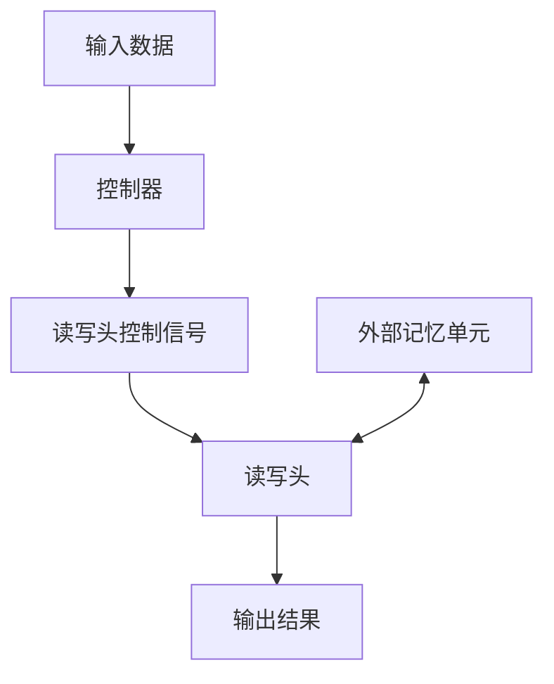

# 基于神经图灵机的复杂问题求解在智能物流优化中的应用研究

> 关键词：神经图灵机、复杂问题求解、智能物流优化、应用研究、机器学习

> 摘要：本文聚焦于神经图灵机在智能物流优化领域的应用。首先介绍了研究的背景、目的、预期读者和文档结构等内容。详细阐述了神经图灵机的核心概念、原理架构以及与之相关的联系，并给出了文本示意图和Mermaid流程图。深入讲解了神经图灵机的核心算法原理，通过Python源代码进行详细说明，同时介绍了其数学模型和公式，并举例加以解释。通过项目实战，展示了如何搭建开发环境、实现源代码并进行代码解读。探讨了神经图灵机在智能物流优化中的实际应用场景，推荐了相关的学习资源、开发工具框架和论文著作。最后总结了未来的发展趋势与挑战，解答了常见问题，并提供了扩展阅读和参考资料，旨在为神经图灵机在智能物流优化中的应用提供全面且深入的研究。

## 1. 背景介绍 
### 1.1 目的和范围
智能物流作为现代物流发展的重要方向，面临着众多复杂问题，如货物配送路径规划、仓库库存管理、物流资源调度等。这些问题具有高度的复杂性和动态性，传统的优化方法在处理时往往存在一定的局限性。神经图灵机（Neural Turing Machine，NTM）作为一种新型的机器学习模型，结合了神经网络和图灵机的优点，具有强大的记忆和推理能力，为解决智能物流中的复杂问题提供了新的思路和方法。

本研究的目的在于深入探讨神经图灵机在智能物流优化中的应用，分析其在解决复杂问题方面的优势和潜力。具体范围包括神经图灵机的原理、算法实现，以及如何将其应用于智能物流中的路径规划、库存管理和资源调度等实际问题，并通过实验和案例分析验证其有效性和可行性。

### 1.2 预期读者
本文的预期读者主要包括对机器学习、人工智能和智能物流领域感兴趣的研究人员、工程师和学生。对于从事智能物流系统开发、优化和管理的专业人士，本文可以提供新的技术思路和解决方案；对于机器学习和人工智能领域的研究人员，本文可以为神经图灵机的应用研究提供一个新的视角和应用场景；对于相关专业的学生，本文可以作为学习和了解神经图灵机以及智能物流优化的参考资料。

### 1.3 文档结构概述
本文共分为十个部分。第一部分为背景介绍，阐述了研究的目的、范围、预期读者和文档结构。第二部分介绍神经图灵机的核心概念与联系，包括其原理、架构以及与其他相关概念的关系，并给出文本示意图和Mermaid流程图。第三部分详细讲解神经图灵机的核心算法原理，并通过Python源代码进行说明。第四部分介绍神经图灵机的数学模型和公式，并举例进行详细解释。第五部分通过项目实战，展示如何搭建开发环境、实现源代码并进行代码解读。第六部分探讨神经图灵机在智能物流优化中的实际应用场景。第七部分推荐相关的学习资源、开发工具框架和论文著作。第八部分总结神经图灵机在智能物流优化中的未来发展趋势与挑战。第九部分为附录，解答常见问题。第十部分提供扩展阅读和参考资料。

### 1.4 术语表
#### 1.4.1 核心术语定义
- **神经图灵机（Neural Turing Machine，NTM）**：一种结合了神经网络和图灵机思想的机器学习模型，具有可微分的外部记忆单元，能够模拟图灵机的读写操作，从而实现更强大的记忆和推理能力。
- **智能物流**：利用先进的信息技术和智能化手段，对物流活动进行全面的管理和优化，提高物流效率、降低物流成本、提升服务质量的现代物流模式。
- **路径规划**：在物流配送过程中，根据货物的起始点、终点和其他约束条件，寻找最优的配送路径，以减少运输时间和成本。
- **库存管理**：对仓库中的货物进行有效的管理和控制，包括库存水平的确定、补货策略的制定等，以满足客户需求并降低库存成本。
- **资源调度**：合理分配物流资源，如车辆、人员、仓库空间等，以提高资源利用率和物流效率。

#### 1.4.2 相关概念解释
- **神经网络**：一种模仿人类神经系统的计算模型，由大量的神经元组成，通过对数据的学习和训练，能够自动提取数据中的特征和模式。
- **图灵机**：一种抽象的计算模型，由艾伦·图灵在1936年提出，它可以模拟任何可计算的算法，是现代计算机科学的基础。
- **可微分计算**：在神经网络中，可微分计算是指模型的参数可以通过梯度下降等优化算法进行更新，从而使模型能够不断学习和改进。
- **外部记忆单元**：神经图灵机中的一个重要组成部分，用于存储和读取信息，类似于计算机的内存。

#### 1.4.3 缩略词列表
- **NTM**：Neural Turing Machine（神经图灵机）
- **MLP**：Multi - Layer Perceptron（多层感知机）
- **LSTM**：Long Short - Term Memory（长短期记忆网络）

## 2. 核心概念与联系 

### 神经图灵机的原理
神经图灵机主要由控制器（Controller）、外部记忆单元（External Memory）和读写头（Read/Write Heads）三部分组成。控制器通常是一个神经网络，如多层感知机（MLP）或长短期记忆网络（LSTM），它负责接收输入数据，并根据输入数据生成读写头的控制信号和输出结果。外部记忆单元是一个二维矩阵，用于存储信息，每个元素可以看作是一个记忆单元。读写头负责对外部记忆单元进行读写操作，根据控制器生成的控制信号，选择要读取或写入的记忆单元。

### 神经图灵机的架构
神经图灵机的架构可以用以下文本示意图表示：

```plaintext
输入数据 -> 控制器 -> 读写头控制信号
                        |
                        v
外部记忆单元 <----> 读写头 -> 输出结果
```

在这个架构中，输入数据首先进入控制器，控制器根据输入数据生成读写头的控制信号。读写头根据控制信号对外部记忆单元进行读写操作，读取外部记忆单元中的信息或向外部记忆单元写入新的信息。最后，控制器根据读取的信息和输入数据生成输出结果。

### Mermaid流程图


### 与其他概念的联系
神经图灵机与传统的神经网络和图灵机有着密切的联系。与传统的神经网络相比，神经图灵机引入了外部记忆单元，使得模型能够存储和处理更多的信息，从而具有更强的记忆和推理能力。与图灵机相比，神经图灵机是一种可微分的模型，能够通过梯度下降等优化算法进行训练，从而自动学习数据中的模式和规律。

## 3. 核心算法原理 & 具体操作步骤 

### 核心算法原理
神经图灵机的核心算法主要包括控制器的计算、读写头的操作和外部记忆单元的更新。以下是详细的算法步骤：

1. **控制器计算**：控制器接收输入数据 $x_t$，并根据当前的状态 $h_{t - 1}$ 计算新的状态 $h_t$ 和读写头的控制信号 $u_t$。控制器可以使用不同的神经网络结构，如MLP或LSTM。以LSTM为例，控制器的计算可以表示为：

```python
import torch
import torch.nn as nn

class Controller(nn.Module):
    def __init__(self, input_size, hidden_size):
        super(Controller, self).__init__()
        self.lstm = nn.LSTM(input_size, hidden_size)

    def forward(self, x, h_prev):
        output, h_next = self.lstm(x.unsqueeze(0), h_prev)
        return output.squeeze(0), h_next
```

2. **读写头操作**：读写头根据控制器生成的控制信号 $u_t$ 对外部记忆单元 $M_{t - 1}$ 进行读写操作。读头计算读取权重 $w_{r,t}$，并根据读取权重从外部记忆单元中读取信息 $r_t$；写头计算写入权重 $w_{w,t}$ 和写入向量 $e_t$、$a_t$，并根据写入权重和写入向量更新外部记忆单元。

```python
import torch
import torch.nn.functional as F

def read_head(M_prev, w_r):
    r = torch.matmul(w_r.unsqueeze(1).transpose(1, 2), M_prev).squeeze(1)
    return r

def write_head(M_prev, w_w, e, a):
    M = M_prev * (1 - torch.matmul(w_w.unsqueeze(2), e.unsqueeze(1)))
    M = M + torch.matmul(w_w.unsqueeze(2), a.unsqueeze(1))
    return M
```

3. **外部记忆单元更新**：根据写头的操作，更新外部记忆单元 $M_{t - 1}$ 为 $M_t$。

### 具体操作步骤
以下是神经图灵机的具体操作步骤：

1. 初始化控制器的状态 $h_0$ 和外部记忆单元 $M_0$。
2. 对于每个时间步 $t$：
    - 接收输入数据 $x_t$。
    - 控制器根据输入数据 $x_t$ 和当前状态 $h_{t - 1}$ 计算新的状态 $h_t$ 和读写头的控制信号 $u_t$。
    - 读头根据控制信号 $u_t$ 计算读取权重 $w_{r,t}$，并从外部记忆单元 $M_{t - 1}$ 中读取信息 $r_t$。
    - 写头根据控制信号 $u_t$ 计算写入权重 $w_{w,t}$ 和写入向量 $e_t$、$a_t$，并更新外部记忆单元 $M_{t - 1}$ 为 $M_t$。
    - 控制器根据读取的信息 $r_t$ 和输入数据 $x_t$ 生成输出结果 $y_t$。
3. 重复步骤2，直到处理完所有的输入数据。

```python
import torch

# 初始化参数
input_size = 10
hidden_size = 20
memory_size = 30
memory_length = 40

controller = Controller(input_size, hidden_size)
h_prev = (torch.zeros(1, 1, hidden_size), torch.zeros(1, 1, hidden_size))
M_prev = torch.randn(memory_length, memory_size)

# 模拟输入数据
input_sequence = torch.randn(5, input_size)

for t in range(len(input_sequence)):
    x_t = input_sequence[t]
    output, h_next = controller(x_t, h_prev)
    
    # 模拟读写头操作
    w_r = F.softmax(torch.randn(memory_length), dim = 0)
    r_t = read_head(M_prev, w_r)
    
    w_w = F.softmax(torch.randn(memory_length), dim = 0)
    e = torch.sigmoid(torch.randn(memory_size))
    a = torch.randn(memory_size)
    M_t = write_head(M_prev, w_w, e, a)
    
    h_prev = h_next
    M_prev = M_t
```

## 4. 数学模型和公式 & 详细讲解 & 举例说明 

### 控制器计算
控制器的计算可以使用不同的神经网络结构，如LSTM。LSTM的数学模型可以表示为：

$$
\begin{align*}
i_t &= \sigma(W_{ii}x_t + W_{hi}h_{t - 1}+b_i)\\
f_t &= \sigma(W_{if}x_t + W_{hf}h_{t - 1}+b_f)\\
o_t &= \sigma(W_{io}x_t + W_{ho}h_{t - 1}+b_o)\\
g_t &= \tanh(W_{ig}x_t + W_{hg}h_{t - 1}+b_g)\\
c_t &= f_t \odot c_{t - 1}+i_t \odot g_t\\
h_t &= o_t \odot \tanh(c_t)
\end{align*}
$$

其中，$i_t$、$f_t$、$o_t$ 分别为输入门、遗忘门和输出门，$g_t$ 为候选记忆单元，$c_t$ 为细胞状态，$h_t$ 为隐藏状态，$\sigma$ 为Sigmoid函数，$\tanh$ 为双曲正切函数，$W$ 为权重矩阵，$b$ 为偏置向量。

### 读头操作
读头的读取权重 $w_{r,t}$ 可以通过注意力机制计算得到，通常使用软注意力（Soft Attention）：

$$
w_{r,t} = \text{Softmax}(K_{r,t}^T M_{t - 1})
$$

其中，$K_{r,t}$ 为读头的键向量，$M_{t - 1}$ 为上一时刻的外部记忆单元。读取的信息 $r_t$ 可以表示为：

$$
r_t = \sum_{i = 1}^N w_{r,t}(i)M_{t - 1}(i)
$$

其中，$N$ 为外部记忆单元的长度。

### 写头操作
写头的写入权重 $w_{w,t}$ 同样可以通过注意力机制计算得到：

$$
w_{w,t} = \text{Softmax}(K_{w,t}^T M_{t - 1})
$$

其中，$K_{w,t}$ 为写头的键向量。写入向量 $e_t$ 和 $a_t$ 用于更新外部记忆单元，更新公式为：

$$
M_t(i) = M_{t - 1}(i)(1 - w_{w,t}(i)e_t)+w_{w,t}(i)a_t
$$

### 举例说明
假设外部记忆单元 $M_{t - 1}$ 是一个 $3\times 2$ 的矩阵：

$$
M_{t - 1}=\begin{bmatrix}
1 & 2\\
3 & 4\\
5 & 6
\end{bmatrix}
$$

读头的读取权重 $w_{r,t} = [0.2, 0.3, 0.5]$，则读取的信息 $r_t$ 为：

$$
r_t = 0.2\begin{bmatrix}1\\2\end{bmatrix}+0.3\begin{bmatrix}3\\4\end{bmatrix}+0.5\begin{bmatrix}5\\6\end{bmatrix}=\begin{bmatrix}3.6\\4.8\end{bmatrix}
$$

写头的写入权重 $w_{w,t} = [0.1, 0.4, 0.5]$，写入向量 $e_t = [0.2, 0.3]$，$a_t = [0.5, 0.6]$，则更新后的外部记忆单元 $M_t$ 为：

$$
M_t(1)=\begin{bmatrix}1\\2\end{bmatrix}(1 - 0.1\times\begin{bmatrix}0.2\\0.3\end{bmatrix})+0.1\times\begin{bmatrix}0.5\\0.6\end{bmatrix}=\begin{bmatrix}0.982\\1.974\end{bmatrix}
$$

$$
M_t(2)=\begin{bmatrix}3\\4\end{bmatrix}(1 - 0.4\times\begin{bmatrix}0.2\\0.3\end{bmatrix})+0.4\times\begin{bmatrix}0.5\\0.6\end{bmatrix}=\begin{bmatrix}3.088\\4.144\end{bmatrix}
$$

$$
M_t(3)=\begin{bmatrix}5\\6\end{bmatrix}(1 - 0.5\times\begin{bmatrix}0.2\\0.3\end{bmatrix})+0.5\times\begin{bmatrix}0.5\\0.6\end{bmatrix}=\begin{bmatrix}5.1\\6.135\end{bmatrix}
$$


## 5. 项目实战：代码实际案例和详细解释说明 

### 5.1  开发环境搭建
为了实现基于神经图灵机的智能物流优化项目，我们需要搭建相应的开发环境。以下是具体的步骤：

1. **安装Python**：推荐使用Python 3.7及以上版本，可以从Python官方网站（https://www.python.org/downloads/）下载并安装。
2. **安装深度学习框架**：我们使用PyTorch作为深度学习框架，可以通过以下命令安装：
```sh
pip install torch torchvision
```
3. **安装其他依赖库**：还需要安装一些其他的依赖库，如NumPy、Matplotlib等，可以使用以下命令安装：
```sh
pip install numpy matplotlib
```

### 5.2  源代码详细实现和代码解读
以下是一个基于神经图灵机的简单路径规划问题的代码实现：

```python
import torch
import torch.nn as nn
import torch.nn.functional as F

# 定义控制器
class Controller(nn.Module):
    def __init__(self, input_size, hidden_size):
        super(Controller, self).__init__()
        self.lstm = nn.LSTM(input_size, hidden_size)

    def forward(self, x, h_prev):
        output, h_next = self.lstm(x.unsqueeze(0), h_prev)
        return output.squeeze(0), h_next

# 读头操作
def read_head(M_prev, w_r):
    r = torch.matmul(w_r.unsqueeze(1).transpose(1, 2), M_prev).squeeze(1)
    return r

# 写头操作
def write_head(M_prev, w_w, e, a):
    M = M_prev * (1 - torch.matmul(w_w.unsqueeze(2), e.unsqueeze(1)))
    M = M + torch.matmul(w_w.unsqueeze(2), a.unsqueeze(1))
    return M

# 神经图灵机模型
class NTM(nn.Module):
    def __init__(self, input_size, hidden_size, memory_size, memory_length):
        super(NTM, self).__init__()
        self.controller = Controller(input_size, hidden_size)
        self.memory_size = memory_size
        self.memory_length = memory_length

    def forward(self, input_sequence):
        h_prev = (torch.zeros(1, 1, self.controller.lstm.hidden_size),
                  torch.zeros(1, 1, self.controller.lstm.hidden_size))
        M_prev = torch.randn(self.memory_length, self.memory_size)

        outputs = []
        for t in range(len(input_sequence)):
            x_t = input_sequence[t]
            output, h_next = self.controller(x_t, h_prev)

            # 模拟读写头操作
            w_r = F.softmax(torch.randn(self.memory_length), dim = 0)
            r_t = read_head(M_prev, w_r)

            w_w = F.softmax(torch.randn(self.memory_length), dim = 0)
            e = torch.sigmoid(torch.randn(self.memory_size))
            a = torch.randn(self.memory_size)
            M_t = write_head(M_prev, w_w, e, a)

            h_prev = h_next
            M_prev = M_t
            outputs.append(output)

        return torch.stack(outputs)

# 模拟路径规划问题
input_size = 10
hidden_size = 20
memory_size = 30
memory_length = 40
ntm = NTM(input_size, hidden_size, memory_size, memory_length)

input_sequence = torch.randn(5, input_size)
output = ntm(input_sequence)
print(output.shape)
```

### 代码解读与分析
1. **控制器部分**：`Controller` 类使用LSTM作为控制器，接收输入数据并计算新的状态和读写头的控制信号。
2. **读写头操作部分**：`read_head` 函数根据读取权重从外部记忆单元中读取信息，`write_head` 函数根据写入权重和写入向量更新外部记忆单元。
3. **神经图灵机模型部分**：`NTM` 类将控制器、读写头操作和外部记忆单元结合起来，实现了神经图灵机的完整功能。
4. **路径规划模拟部分**：我们模拟了一个路径规划问题，生成随机的输入序列，并将其输入到神经图灵机模型中，最后输出结果。

通过这个代码示例，我们可以看到如何使用神经图灵机来处理路径规划问题。在实际应用中，我们需要根据具体的问题对输入数据和模型进行调整。

## 6. 实际应用场景 
### 路径规划
在智能物流中，路径规划是一个重要的问题。神经图灵机可以通过学习历史数据和实时交通信息，找到最优的配送路径。例如，在一个城市的物流配送网络中，神经图灵机可以根据货物的起始点、终点、交通流量、道路状况等信息，规划出一条最短时间或最低成本的配送路径。同时，神经图灵机的外部记忆单元可以存储历史路径信息和交通模式，从而在处理新的路径规划问题时能够更好地利用这些信息。

### 库存管理
库存管理是智能物流中的另一个关键问题。神经图灵机可以用于预测货物的需求，优化库存水平和补货策略。通过分析历史销售数据、季节因素、市场趋势等信息，神经图灵机可以学习到货物需求的模式和规律，并根据这些信息预测未来的需求。同时，神经图灵机可以根据库存水平和需求预测，自动调整补货策略，确保库存水平既能满足客户需求，又能降低库存成本。

### 资源调度
物流资源调度包括车辆调度、人员调度、仓库空间调度等。神经图灵机可以根据物流任务的需求和资源的可用性，合理分配资源，提高资源利用率和物流效率。例如，在车辆调度中，神经图灵机可以根据货物的数量、重量、体积、配送时间要求等信息，合理安排车辆的行驶路线和装载方案，减少车辆的空载率和行驶里程。

## 7. 工具和资源推荐
### 7.1 学习资源推荐
#### 7.1.1 书籍推荐
- 《深度学习》（Deep Learning）：由Ian Goodfellow、Yoshua Bengio和Aaron Courville所著，是深度学习领域的经典教材，涵盖了神经网络、卷积神经网络、循环神经网络等多个方面的内容。
- 《Python深度学习》（Deep Learning with Python）：由Francois Chollet所著，介绍了如何使用Python和Keras库进行深度学习模型的开发，适合初学者入门。
- 《人工智能：一种现代的方法》（Artificial Intelligence: A Modern Approach）：由Stuart Russell和Peter Norvig所著，是人工智能领域的权威教材，全面介绍了人工智能的各个方面，包括搜索算法、知识表示、机器学习等。

#### 7.1.2 在线课程
- Coursera上的“深度学习专项课程”（Deep Learning Specialization）：由Andrew Ng教授授课，包括神经网络和深度学习、改善深层神经网络、结构化机器学习项目、卷积神经网络、序列模型等五个课程，是学习深度学习的优质课程。
- edX上的“麻省理工学院：计算机科学和编程导论”（Introduction to Computer Science and Programming Using Python）：由麻省理工学院的教授授课，介绍了Python编程和计算机科学的基础知识，适合初学者。

#### 7.1.3 技术博客和网站
- Medium：上面有很多关于机器学习、人工智能和深度学习的技术博客和文章，例如Towards Data Science、The AI Summer等。
- arXiv：一个预印本平台，包含了大量的机器学习、人工智能和相关领域的研究论文，可以及时了解最新的研究成果。

### 7.2 开发工具框架推荐
#### 7.2.1 IDE和编辑器
- PyCharm：一款专业的Python集成开发环境，具有代码编辑、调试、自动补全、版本控制等功能，适合Python项目的开发。
- Jupyter Notebook：一个交互式的开发环境，可以将代码、文本、图像等内容整合在一起，方便进行数据分析和模型开发。

#### 7.2.2 调试和性能分析工具
- TensorBoard：TensorFlow的可视化工具，可以用于可视化模型的训练过程、损失函数曲线、网络结构等，帮助开发者进行模型调试和性能分析。
- PyTorch Profiler：PyTorch的性能分析工具，可以分析模型的运行时间、内存使用情况等，帮助开发者优化模型性能。

#### 7.2.3 相关框架和库
- PyTorch：一个开源的深度学习框架，具有动态计算图、易于使用等优点，广泛应用于学术界和工业界。
- NumPy：一个用于科学计算的Python库，提供了高效的多维数组对象和各种数学函数，是机器学习和深度学习的基础库。
- Matplotlib：一个用于数据可视化的Python库，可以绘制各种类型的图表，如折线图、柱状图、散点图等，帮助开发者更好地理解数据。

### 7.3 相关论文著作推荐
#### 7.3.1 经典论文
- "Neural Turing Machines"：由Alex Graves、Greg Wayne和Ivo Danihelka发表，首次提出了神经图灵机的概念，并详细介绍了其原理和实现方法。
- "Long Short-Term Memory"：由Sepp Hochreiter和Jürgen Schmidhuber发表，介绍了长短期记忆网络（LSTM）的原理和应用，是循环神经网络领域的经典论文。

#### 7.3.2 最新研究成果
- 关注arXiv上关于神经图灵机和智能物流优化的最新研究论文，可以了解到该领域的最新发展动态和研究成果。
- 参加相关的学术会议，如NeurIPS、ICML、KDD等，这些会议上会有很多关于机器学习和人工智能的最新研究成果展示。

#### 7.3.3 应用案例分析
- 一些大型物流企业的技术博客和研究报告中可能会有关于智能物流优化的应用案例分析，可以从中学习到实际应用中的经验和方法。
- 相关的行业杂志和期刊也会发表一些关于智能物流优化的应用案例和研究成果，可以关注这些资源。

## 8. 总结：未来发展趋势与挑战
### 未来发展趋势
- **与其他技术的融合**：神经图灵机可能会与其他技术，如强化学习、区块链、物联网等进行融合，以解决更复杂的智能物流问题。例如，与强化学习结合可以实现智能物流系统的自主决策和优化；与区块链结合可以提高物流信息的安全性和可信度；与物联网结合可以实现物流设备的实时监控和管理。
- **更广泛的应用场景**：除了路径规划、库存管理和资源调度等传统应用场景，神经图灵机还可能应用于智能物流的其他领域，如物流需求预测、物流质量控制、物流风险管理等。
- **模型的改进和优化**：未来可能会对神经图灵机的模型结构和算法进行改进和优化，以提高其性能和效率。例如，研究更高效的读写头操作方法、更强大的控制器结构等。

### 挑战
- **数据质量和数量**：神经图灵机需要大量的高质量数据进行训练，而在智能物流领域，数据的收集和整理可能会面临一些困难，如数据的准确性、完整性和一致性等问题。
- **计算资源和时间成本**：神经图灵机的训练和推理过程需要大量的计算资源和时间，特别是在处理大规模物流数据时，计算资源和时间成本可能会成为一个瓶颈。
- **模型的可解释性**：神经图灵机作为一种深度学习模型，其决策过程往往难以解释，这在一些对决策可解释性要求较高的物流场景中可能会成为一个问题。

## 9. 附录：常见问题与解答
### 问题1：神经图灵机与传统神经网络有什么区别？
答：神经图灵机与传统神经网络的主要区别在于引入了外部记忆单元。传统神经网络通常只能依靠自身的参数来存储和处理信息，而神经图灵机的外部记忆单元可以存储更多的信息，并且可以通过读写头进行灵活的读写操作，从而具有更强的记忆和推理能力。

### 问题2：神经图灵机在智能物流优化中的应用效果如何？
答：神经图灵机在智能物流优化中的应用效果取决于多个因素，如数据质量、模型结构、训练方法等。在一些实验和案例中，神经图灵机已经显示出了在路径规划、库存管理和资源调度等方面的优势，但在实际应用中，还需要进一步的验证和优化。

### 问题3：如何训练神经图灵机模型？
答：训练神经图灵机模型通常使用梯度下降等优化算法。首先需要定义一个损失函数，用于衡量模型的输出与真实标签之间的差异。然后，通过反向传播算法计算损失函数对模型参数的梯度，并使用优化算法更新模型参数，直到损失函数收敛。

### 问题4：神经图灵机的计算复杂度高吗？
答：神经图灵机的计算复杂度相对较高，特别是在处理大规模数据时。这是因为神经图灵机需要进行读写头的操作和外部记忆单元的更新，这些操作的计算量较大。为了降低计算复杂度，可以采用一些优化方法，如并行计算、模型压缩等。

## 10. 扩展阅读 & 参考资料
### 扩展阅读
- 《机器学习实战》（Machine Learning in Action）：通过实际案例介绍了机器学习的各种算法和应用，帮助读者更好地理解和应用机器学习技术。
- 《算法导论》（Introduction to Algorithms）：经典的算法教材，介绍了各种算法的设计和分析方法，对于理解神经图灵机的算法原理有很大的帮助。

### 参考资料
- Graves, A., Wayne, G., & Danihelka, I. (2014). Neural Turing Machines. arXiv preprint arXiv:1410.5401.
- Hochreiter, S., & Schmidhuber, J. (1997). Long short-term memory. Neural computation, 9(8), 1735-1780.

作者：AI天才研究院/AI Genius Institute & 禅与计算机程序设计艺术 /Zen And The Art of Computer Programming