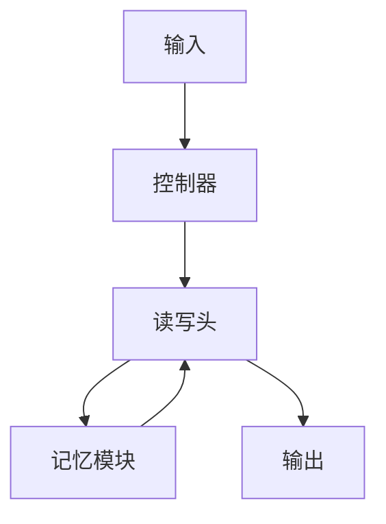

# 基于神经图灵机的复杂问题求解在运筹学优化中的应用

> 关键词：神经图灵机、复杂问题求解、运筹学优化、深度学习、强化学习

> 摘要：本文聚焦于神经图灵机在运筹学优化领域复杂问题求解中的应用。首先介绍了相关背景，包括研究目的、预期读者、文档结构和术语表。接着阐述了神经图灵机的核心概念与架构，以及其与运筹学优化的联系。详细讲解了神经图灵机的核心算法原理，并给出Python代码示例。探讨了相关数学模型和公式，通过具体例子加深理解。进行了项目实战，包括开发环境搭建、源代码实现与解读。分析了神经图灵机在运筹学优化中的实际应用场景。推荐了学习资源、开发工具框架和相关论文著作。最后总结了未来发展趋势与挑战，并提供常见问题解答和扩展阅读参考资料。

## 1. 背景介绍 
### 1.1 目的和范围
运筹学优化旨在通过数学方法对各种实际问题进行建模和求解，以实现资源的最优配置和决策的最优化。然而，现实中的许多运筹学问题具有高度的复杂性，如大规模的约束条件、非线性目标函数、动态变化的环境等，传统的优化算法在处理这些复杂问题时往往面临效率低下、难以找到全局最优解等挑战。

神经图灵机（Neural Turing Machine，NTM）是一种结合了神经网络和图灵机思想的新型计算模型，它具有外部记忆模块，能够模拟图灵机的读写操作，从而具备更强的存储和处理信息的能力。本研究的目的是探索神经图灵机在运筹学优化复杂问题求解中的应用，评估其有效性和潜力，为解决运筹学中的难题提供新的思路和方法。

本研究的范围主要涵盖神经图灵机的基本原理、核心算法，以及如何将其应用于运筹学中的典型优化问题，如旅行商问题（TSP）、车辆路径规划问题（VRP）等。同时，将通过实际案例分析和实验验证神经图灵机在这些问题上的性能表现。

### 1.2 预期读者
本文的预期读者主要包括以下几类人群：
1. **运筹学领域的研究人员和从业者**：他们对运筹学优化问题的求解方法有深入的了解，希望探索新的技术和算法来解决复杂的实际问题。神经图灵机的引入可能为他们提供新的研究方向和解决方案。
2. **人工智能和机器学习领域的研究者**：神经图灵机是人工智能领域的一个前沿研究课题，对于关注神经网络和深度学习发展的研究者来说，了解其在运筹学优化中的应用可以拓宽研究视野，探索跨领域的创新应用。
3. **计算机科学专业的学生和爱好者**：对计算机算法和编程有一定的基础，希望学习和了解新型计算模型及其在实际问题中的应用。本文提供了详细的算法原理和代码示例，有助于他们深入理解神经图灵机的工作机制。

### 1.3 文档结构概述
本文将按照以下结构进行组织：
1. **背景介绍**：阐述研究的目的和范围、预期读者、文档结构概述以及相关术语的定义。
2. **核心概念与联系**：介绍神经图灵机的核心概念、架构和工作原理，以及它与运筹学优化之间的联系。
3. **核心算法原理 & 具体操作步骤**：详细讲解神经图灵机的核心算法，包括读写操作、注意力机制等，并给出Python代码实现。
4. **数学模型和公式 & 详细讲解 & 举例说明**：建立神经图灵机在运筹学优化中的数学模型，推导相关公式，并通过具体例子进行说明。
5. **项目实战：代码实际案例和详细解释说明**：以旅行商问题为例，介绍开发环境的搭建、源代码的实现和详细解读。
6. **实际应用场景**：分析神经图灵机在运筹学优化中的实际应用场景，如物流配送、生产调度等。
7. **工具和资源推荐**：推荐学习神经图灵机和运筹学优化的相关资源，包括书籍、在线课程、技术博客、开发工具和相关论文。
8. **总结：未来发展趋势与挑战**：总结神经图灵机在运筹学优化中的应用现状，分析未来的发展趋势和面临的挑战。
9. **附录：常见问题与解答**：回答读者在阅读过程中可能遇到的常见问题。
10. **扩展阅读 & 参考资料**：提供进一步学习和研究的扩展阅读材料和参考资料。

### 1.4 术语表
#### 1.4.1 核心术语定义
1. **神经图灵机（Neural Turing Machine，NTM）**：一种结合了神经网络和图灵机思想的计算模型，具有外部记忆模块，能够模拟图灵机的读写操作。
2. **运筹学优化（Operations Research Optimization）**：运用数学方法对实际问题进行建模和求解，以实现资源的最优配置和决策的最优化。
3. **旅行商问题（Traveling Salesman Problem，TSP）**：给定一系列城市和每对城市之间的距离，求解访问每个城市恰好一次并返回起始城市的最短路径。
4. **车辆路径规划问题（Vehicle Routing Problem，VRP）**：在满足一定约束条件下，为一组车辆规划最优的行驶路径，以完成货物配送或人员运输任务。
5. **注意力机制（Attention Mechanism）**：一种在神经网络中用于选择性地关注输入信息的机制，能够提高模型的处理效率和性能。

#### 1.4.2 相关概念解释
1. **图灵机（Turing Machine）**：由英国数学家艾伦·图灵提出的一种抽象计算模型，它由一个无限长的纸带和一个读写头组成，能够模拟任何可计算的算法。
2. **神经网络（Neural Network）**：一种模仿人类神经系统的计算模型，由大量的神经元组成，通过学习数据的特征和模式来进行预测和决策。
3. **强化学习（Reinforcement Learning）**：一种机器学习方法，通过智能体与环境进行交互，根据环境反馈的奖励信号来学习最优的行为策略。
4. **深度学习（Deep Learning）**：一种基于神经网络的机器学习方法，通过构建多层神经网络来学习数据的深层特征和模式。

#### 1.4.3 缩略词列表
1. **NTM**：Neural Turing Machine（神经图灵机）
2. **OR**：Operations Research（运筹学）
3. **TSP**：Traveling Salesman Problem（旅行商问题）
4. **VRP**：Vehicle Routing Problem（车辆路径规划问题）
5. **RL**：Reinforcement Learning（强化学习）
6. **DL**：Deep Learning（深度学习）

## 2. 核心概念与联系 

### 神经图灵机的核心概念
神经图灵机（NTM）是一种将神经网络与图灵机的思想相结合的模型。传统的神经网络虽然在处理模式识别、分类等任务上表现出色，但缺乏显式的记忆和推理能力。而图灵机具有强大的计算能力和记忆机制，NTM试图将这两者的优势结合起来。

NTM主要由三部分组成：控制器（Controller）、记忆模块（Memory）和读写头（Read/Write Heads）。控制器通常是一个神经网络，它接收输入并生成控制信号，用于指导读写头对记忆模块进行读写操作。记忆模块是一个二维矩阵，用于存储信息。读写头则根据控制器的指令，在记忆模块上进行位置定位和信息读写。

### 神经图灵机的架构
下面是神经图灵机的架构示意图：



### 神经图灵机与运筹学优化的联系
运筹学优化中的许多问题需要对大量的信息进行存储和处理，同时需要进行复杂的推理和决策。神经图灵机的外部记忆模块可以有效地存储和管理问题的相关信息，而其强大的计算能力可以进行复杂的推理和优化。

例如，在旅行商问题中，我们需要存储城市之间的距离信息和已经访问过的城市信息。神经图灵机的记忆模块可以方便地存储这些信息，而控制器可以根据这些信息生成最优的路径规划。

在车辆路径规划问题中，需要考虑车辆的容量限制、时间窗口等约束条件。神经图灵机可以通过记忆模块存储这些约束条件，并在计算过程中动态地调整路径规划，以满足这些约束条件。

## 3. 核心算法原理 & 具体操作步骤 

### 核心算法原理
神经图灵机的核心算法主要包括读写操作和注意力机制。

#### 读写操作
- **读操作**：读头根据控制器生成的权重向量，从记忆模块中读取信息。具体来说，读头会计算一个权重分布 $w_t$，表示在时刻 $t$ 对记忆模块中每个位置的关注程度。然后，将权重分布与记忆模块中的内容相乘并求和，得到读取的信息 $r_t$。
- **写操作**：写头根据控制器生成的权重向量和写入内容，对记忆模块进行更新。写头会先计算一个擦除向量 $e_t$ 和一个添加向量 $a_t$，然后根据以下公式更新记忆模块中的内容：
  $$M_t(i) = M_{t - 1}(i)(1 - w_t(i)e_t) + w_t(i)a_t$$

#### 注意力机制
注意力机制用于生成读写头的权重向量。在NTM中，通常使用基于内容的注意力机制。具体来说，控制器会生成一个查询向量 $q_t$，然后计算查询向量与记忆模块中每个位置的相似度，根据相似度生成权重分布。

### 具体操作步骤
以下是神经图灵机的具体操作步骤：
1. **初始化**：初始化记忆模块 $M_0$、读写头的权重向量 $w_0$ 和控制器的参数。
2. **输入处理**：将输入数据输入到控制器中，控制器生成控制信号。
3. **读写操作**：根据控制信号，读写头对记忆模块进行读写操作。
4. **更新记忆模块**：根据写操作的结果，更新记忆模块的内容。
5. **输出生成**：控制器根据读取的信息和当前状态，生成输出。
6. **重复步骤2 - 5**：直到达到终止条件。

### Python代码实现
```python
import torch
import torch.nn as nn
import torch.nn.functional as F

class NeuralTuringMachine(nn.Module):
    def __init__(self, input_size, output_size, controller_size, memory_size, memory_length):
        super(NeuralTuringMachine, self).__init__()
        self.input_size = input_size
        self.output_size = output_size
        self.controller_size = controller_size
        self.memory_size = memory_size
        self.memory_length = memory_length

        # 控制器
        self.controller = nn.LSTM(input_size + memory_size, controller_size)
        # 读头
        self.read_head = nn.Linear(controller_size, memory_length)
        # 写头
        self.write_head = nn.Linear(controller_size, memory_length + 2 * memory_size)

        # 初始化记忆模块
        self.memory = torch.zeros(memory_size, memory_length)

    def forward(self, input):
        # 控制器输入
        read = self.read(self.memory, self.read_head)
        controller_input = torch.cat([input, read], dim=1)

        # 控制器输出
        output, _ = self.controller(controller_input.unsqueeze(0))
        output = output.squeeze(0)

        # 读写操作
        read = self.read(self.memory, self.read_head(output))
        self.write(self.memory, self.write_head(output))

        # 最终输出
        final_output = torch.cat([output, read], dim=1)
        return final_output

    def read(self, memory, read_head_output):
        # 计算权重分布
        weights = F.softmax(read_head_output, dim=1)
        # 读取信息
        read = torch.matmul(weights, memory.transpose(0, 1))
        return read

    def write(self, memory, write_head_output):
        # 分离擦除向量和添加向量
        erase = write_head_output[:, :self.memory_size]
        add = write_head_output[:, self.memory_size:]
        weights = F.softmax(write_head_output[:, -self.memory_length:], dim=1)

        # 更新记忆模块
        memory = memory * (1 - torch.matmul(weights.transpose(0, 1), erase.unsqueeze(1))) + torch.matmul(weights.transpose(0, 1), add.unsqueeze(1))
        return memory
```

## 4. 数学模型和公式 & 详细讲解 & 举例说明 

### 数学模型
在运筹学优化中，我们通常需要定义一个目标函数和一组约束条件。以旅行商问题为例，目标函数是最小化旅行的总距离，约束条件是每个城市恰好访问一次。

假设我们有 $n$ 个城市，城市之间的距离矩阵为 $D = [d_{ij}]_{n\times n}$，其中 $d_{ij}$ 表示城市 $i$ 到城市 $j$ 的距离。设 $x_{ij}$ 为二进制变量，如果旅行路线中从城市 $i$ 直接到城市 $j$，则 $x_{ij} = 1$，否则 $x_{ij} = 0$。

目标函数可以表示为：
$$\min \sum_{i = 1}^{n}\sum_{j = 1}^{n}d_{ij}x_{ij}$$

约束条件包括：
1. 每个城市恰好离开一次：
$$\sum_{j = 1}^{n}x_{ij} = 1, \quad i = 1, 2, \cdots, n$$
2. 每个城市恰好到达一次：
$$\sum_{i = 1}^{n}x_{ij} = 1, \quad j = 1, 2, \cdots, n$$
3. 消除子回路：
$$\sum_{i\in S}\sum_{j\in S}x_{ij}\leq |S| - 1, \quad S\subset \{1, 2, \cdots, n\}, 2\leq |S|\leq n - 1$$

### 详细讲解
- **目标函数**：目标函数表示旅行的总距离，我们的目标是找到一组 $x_{ij}$ 的取值，使得总距离最小。
- **约束条件**：
  - 第一个约束条件保证每个城市恰好离开一次，第二个约束条件保证每个城市恰好到达一次。
  - 第三个约束条件用于消除子回路，即避免出现不包含所有城市的回路。

### 举例说明
假设有 3 个城市，距离矩阵为：
$$D = \begin{bmatrix}
0 & 10 & 15 \\
10 & 0 & 20 \\
15 & 20 & 0
\end{bmatrix}$$

我们可以列出目标函数和约束条件：
目标函数：
$$\min 10x_{12} + 15x_{13} + 10x_{21} + 20x_{23} + 15x_{31} + 20x_{32}$$

约束条件：
$$x_{11} + x_{12} + x_{13} = 1$$
$$x_{21} + x_{22} + x_{23} = 1$$
$$x_{31} + x_{32} + x_{33} = 1$$
$$x_{11} + x_{21} + x_{31} = 1$$
$$x_{12} + x_{22} + x_{32} = 1$$
$$x_{13} + x_{23} + x_{33} = 1$$
$$x_{12} + x_{21}\leq 1$$
$$x_{13} + x_{31}\leq 1$$
$$x_{23} + x_{32}\leq 1$$

通过求解这个线性规划问题，我们可以得到最优的旅行路线。

## 5. 项目实战：代码实际案例和详细解释说明 

### 5.1  开发环境搭建
为了实现基于神经图灵机的旅行商问题求解，我们需要搭建以下开发环境：
1. **Python**：建议使用Python 3.7及以上版本。
2. **PyTorch**：用于构建和训练神经图灵机模型。可以通过以下命令安装：
```sh
pip install torch torchvision
```
3. **NumPy**：用于数值计算和矩阵操作。可以通过以下命令安装：
```sh
pip install numpy
```
4. **Matplotlib**：用于可视化结果。可以通过以下命令安装：
```sh
pip install matplotlib
```

### 5.2  源代码详细实现和代码解读
以下是一个基于神经图灵机的旅行商问题求解的完整代码示例：

```python
import torch
import torch.nn as nn
import torch.optim as optim
import numpy as np
import matplotlib.pyplot as plt

# 神经图灵机模型
class NeuralTuringMachine(nn.Module):
    def __init__(self, input_size, output_size, controller_size, memory_size, memory_length):
        super(NeuralTuringMachine, self).__init__()
        self.input_size = input_size
        self.output_size = output_size
        self.controller_size = controller_size
        self.memory_size = memory_size
        self.memory_length = memory_length

        # 控制器
        self.controller = nn.LSTM(input_size + memory_size, controller_size)
        # 读头
        self.read_head = nn.Linear(controller_size, memory_length)
        # 写头
        self.write_head = nn.Linear(controller_size, memory_length + 2 * memory_size)

        # 初始化记忆模块
        self.memory = torch.zeros(memory_size, memory_length)

    def forward(self, input):
        # 控制器输入
        read = self.read(self.memory, self.read_head)
        controller_input = torch.cat([input, read], dim=1)

        # 控制器输出
        output, _ = self.controller(controller_input.unsqueeze(0))
        output = output.squeeze(0)

        # 读写操作
        read = self.read(self.memory, self.read_head(output))
        self.write(self.memory, self.write_head(output))

        # 最终输出
        final_output = torch.cat([output, read], dim=1)
        return final_output

    def read(self, memory, read_head_output):
        # 计算权重分布
        weights = F.softmax(read_head_output, dim=1)
        # 读取信息
        read = torch.matmul(weights, memory.transpose(0, 1))
        return read

    def write(self, memory, write_head_output):
        # 分离擦除向量和添加向量
        erase = write_head_output[:, :self.memory_size]
        add = write_head_output[:, self.memory_size:]
        weights = F.softmax(write_head_output[:, -self.memory_length:], dim=1)

        # 更新记忆模块
        memory = memory * (1 - torch.matmul(weights.transpose(0, 1), erase.unsqueeze(1))) + torch.matmul(weights.transpose(0, 1), add.unsqueeze(1))
        return memory

# 旅行商问题环境
class TSPEnv:
    def __init__(self, num_cities):
        self.num_cities = num_cities
        self.cities = np.random.rand(num_cities, 2)
        self.distance_matrix = self.calculate_distance_matrix()
        self.reset()

    def calculate_distance_matrix(self):
        distance_matrix = np.zeros((self.num_cities, self.num_cities))
        for i in range(self.num_cities):
            for j in range(self.num_cities):
                distance_matrix[i, j] = np.linalg.norm(self.cities[i] - self.cities[j])
        return distance_matrix

    def reset(self):
        self.current_city = np.random.randint(0, self.num_cities)
        self.visited_cities = [self.current_city]
        self.total_distance = 0
        return self.get_state()

    def step(self, action):
        next_city = action
        distance = self.distance_matrix[self.current_city, next_city]
        self.total_distance += distance
        self.current_city = next_city
        self.visited_cities.append(next_city)

        if len(self.visited_cities) == self.num_cities:
            # 回到起始城市
            distance = self.distance_matrix[self.current_city, self.visited_cities[0]]
            self.total_distance += distance
            done = True
        else:
            done = False

        reward = -self.total_distance if done else 0
        next_state = self.get_state()
        return next_state, reward, done

    def get_state(self):
        state = np.zeros(self.num_cities)
        for city in self.visited_cities:
            state[city] = 1
        return state

# 训练过程
def train():
    num_cities = 5
    env = TSPEnv(num_cities)
    input_size = num_cities
    output_size = num_cities
    controller_size = 128
    memory_size = 32
    memory_length = 32

    model = NeuralTuringMachine(input_size, output_size, controller_size, memory_size, memory_length)
    optimizer = optim.Adam(model.parameters(), lr=0.001)

    num_episodes = 1000
    rewards = []

    for episode in range(num_episodes):
        state = env.reset()
        state = torch.tensor(state, dtype=torch.float32).unsqueeze(0)
        done = False
        total_reward = 0

        while not done:
            output = model(state)
            action = torch.argmax(output).item()
            next_state, reward, done = env.step(action)
            next_state = torch.tensor(next_state, dtype=torch.float32).unsqueeze(0)

            optimizer.zero_grad()
            loss = -reward
            loss.backward()
            optimizer.step()

            state = next_state
            total_reward += reward

        rewards.append(total_reward)
        if episode % 100 == 0:
            print(f"Episode {episode}: Total Reward = {total_reward}")

    plt.plot(rewards)
    plt.xlabel('Episode')
    plt.ylabel('Total Reward')
    plt.show()

if __name__ == "__main__":
    train()
```

### 5.3  代码解读与分析
- **神经图灵机模型**：`NeuralTuringMachine` 类定义了神经图灵机的结构，包括控制器、读头和写头。在 `forward` 方法中，完成了控制器的计算、读写操作和最终输出的生成。
- **旅行商问题环境**：`TSPEnv` 类定义了旅行商问题的环境，包括城市的生成、距离矩阵的计算、状态的更新和奖励的计算。
- **训练过程**：在 `train` 函数中，我们使用强化学习的方法训练神经图灵机模型。通过不断地与环境进行交互，根据环境反馈的奖励信号来更新模型的参数。

## 6. 实际应用场景 
神经图灵机在运筹学优化中有许多实际应用场景，以下是一些常见的例子：

### 物流配送
在物流配送中，需要为一组车辆规划最优的行驶路径，以满足客户的需求并最小化运输成本。神经图灵机可以通过存储客户的位置信息、车辆的容量限制和时间窗口等约束条件，动态地生成最优的配送方案。

### 生产调度
在生产调度中，需要合理安排生产任务的顺序和时间，以提高生产效率和降低成本。神经图灵机可以存储生产设备的状态、任务的优先级和加工时间等信息，根据这些信息进行生产任务的调度和优化。

### 资源分配
在资源分配问题中，需要将有限的资源分配给不同的任务或项目，以最大化资源的利用效率。神经图灵机可以存储资源的数量、任务的需求和优先级等信息，根据这些信息进行资源的分配和优化。

### 网络优化
在网络优化中，需要设计最优的网络拓扑结构和路由策略，以提高网络的性能和可靠性。神经图灵机可以存储网络节点的信息、链路的带宽和延迟等信息，根据这些信息进行网络的优化和设计。

## 7. 工具和资源推荐
### 7.1 学习资源推荐
#### 7.1.1 书籍推荐
1. 《深度学习》（Deep Learning）：由Ian Goodfellow、Yoshua Bengio和Aaron Courville所著，是深度学习领域的经典教材，涵盖了神经网络、优化算法、卷积神经网络等内容。
2. 《人工智能：一种现代的方法》（Artificial Intelligence: A Modern Approach）：由Stuart Russell和Peter Norvig所著，是人工智能领域的权威教材，介绍了人工智能的基本概念、算法和应用。
3. 《运筹学导论》（Introduction to Operations Research）：由Frederick S. Hillier和Gerald J. Lieberman所著，是运筹学领域的经典教材，涵盖了线性规划、整数规划、动态规划等内容。

#### 7.1.2 在线课程
1. Coursera上的“深度学习专项课程”（Deep Learning Specialization）：由Andrew Ng教授授课，包括神经网络和深度学习、改善深层神经网络、结构化机器学习项目、卷积神经网络和序列模型等课程。
2. edX上的“人工智能导论”（Introduction to Artificial Intelligence）：由麻省理工学院（MIT）的Patrick H. Winston教授授课，介绍了人工智能的基本概念、算法和应用。
3. 中国大学MOOC上的“运筹学”：由国内多所高校的教师授课，涵盖了运筹学的基本理论和方法。

#### 7.1.3 技术博客和网站
1. Medium上的Towards Data Science：一个专注于数据科学和机器学习的技术博客，有许多关于神经图灵机和运筹学优化的文章。
2. arXiv.org：一个预印本服务器，提供了大量关于人工智能、机器学习和运筹学的最新研究成果。
3. 知乎：一个知识分享平台，有许多关于神经图灵机和运筹学优化的讨论和问答。

### 7.2 开发工具框架推荐
#### 7.2.1 IDE和编辑器
1. PyCharm：一个专业的Python集成开发环境，提供了代码编辑、调试、版本控制等功能。
2. Jupyter Notebook：一个交互式的笔记本环境，适合进行数据分析和模型开发。
3. Visual Studio Code：一个轻量级的代码编辑器，支持多种编程语言和插件扩展。

#### 7.2.2 调试和性能分析工具
1. PyTorch Profiler：PyTorch提供的性能分析工具，可以帮助我们分析模型的运行时间和内存使用情况。
2. TensorBoard：一个可视化工具，可以帮助我们监控模型的训练过程和性能指标。
3. cProfile：Python标准库中的性能分析工具，可以帮助我们分析Python代码的运行时间和函数调用情况。

#### 7.2.3 相关框架和库
1. PyTorch：一个开源的深度学习框架，提供了丰富的神经网络模块和优化算法。
2. NumPy：一个用于数值计算和矩阵操作的Python库。
3. SciPy：一个用于科学计算和优化的Python库，提供了许多优化算法和工具。

### 7.3 相关论文著作推荐
#### 7.3.1 经典论文
1. "Neural Turing Machines"：由Alex Graves、Greg Wayne和Ivo Danihelka发表于2014年，首次提出了神经图灵机的概念。
2. "Attention Is All You Need"：由Ashish Vaswani等人发表于2017年，提出了Transformer模型和注意力机制。
3. "The Traveling Salesman Problem: A Guided Tour of Combinatorial Optimization"：由E. L. Lawler等人所著，是旅行商问题领域的经典著作。

#### 7.3.2 最新研究成果
1. 可以通过arXiv.org、ACM Digital Library、IEEE Xplore等学术数据库搜索关于神经图灵机和运筹学优化的最新研究论文。
2. 关注顶级学术会议，如NeurIPS（神经信息处理系统大会）、ICML（国际机器学习会议）、AAAI（美国人工智能协会会议）等，这些会议上会有许多相关的研究成果发布。

#### 7.3.3 应用案例分析
1. 可以在工业界的技术博客和研究报告中找到神经图灵机和运筹学优化在实际应用中的案例分析。
2. 一些知名企业，如谷歌、亚马逊、微软等，会在其官方网站上发布关于人工智能和运筹学优化的应用案例。

## 8. 总结：未来发展趋势与挑战
### 未来发展趋势
1. **融合多种技术**：神经图灵机可能会与其他技术，如强化学习、遗传算法、模拟退火算法等相结合，以提高复杂问题的求解能力。
2. **应用领域拓展**：除了运筹学优化领域，神经图灵机有望在自然语言处理、计算机视觉、机器人等领域得到更广泛的应用。
3. **模型改进与优化**：研究人员可能会对神经图灵机的结构和算法进行改进和优化，以提高其性能和效率。

### 挑战
1. **计算资源需求**：神经图灵机的训练和推理过程通常需要大量的计算资源，如何降低计算成本是一个挑战。
2. **可解释性**：神经图灵机是一种基于神经网络的模型，其决策过程往往难以解释，如何提高模型的可解释性是一个重要的问题。
3. **数据质量和数量**：神经图灵机的性能很大程度上依赖于训练数据的质量和数量，如何获取高质量的大规模数据是一个挑战。

## 9. 附录：常见问题与解答
### 问题1：神经图灵机与传统神经网络有什么区别？
神经图灵机与传统神经网络的主要区别在于其具有外部记忆模块和读写操作能力。传统神经网络缺乏显式的记忆和推理能力，而神经图灵机可以通过外部记忆模块存储和处理信息，从而具备更强的计算和推理能力。

### 问题2：神经图灵机在运筹学优化中的应用有哪些局限性？
神经图灵机在运筹学优化中的应用存在一些局限性，如计算资源需求大、可解释性差、对数据质量和数量要求高等。此外，神经图灵机的训练过程通常比较复杂，需要较长的时间和大量的计算资源。

### 问题3：如何评估神经图灵机在运筹学优化中的性能？
可以使用以下指标来评估神经图灵机在运筹学优化中的性能：
1. **解的质量**：比较神经图灵机得到的解与最优解的差距，评估解的质量。
2. **计算效率**：评估神经图灵机的计算时间和空间复杂度，衡量其计算效率。
3. **泛化能力**：评估神经图灵机在不同数据集和问题实例上的性能，衡量其泛化能力。

## 10. 扩展阅读 & 参考资料
### 扩展阅读
1. 《深度学习进阶：自然语言处理》（Deep Learning for Natural Language Processing）：深入介绍了深度学习在自然语言处理中的应用，包括神经图灵机在自然语言处理中的应用。
2. 《强化学习：原理与Python实现》（Reinforcement Learning: Principles and Python Implementations）：详细介绍了强化学习的原理和算法，以及如何使用Python实现强化学习模型。
3. 《机器学习实战》（Machine Learning in Action）：通过实际案例介绍了机器学习的基本算法和应用，包括神经图灵机在机器学习中的应用。

### 参考资料
1. Graves, A., Wayne, G., & Danihelka, I. (2014). Neural Turing Machines. arXiv preprint arXiv:1410.5401.
2. Vaswani, A., Shazeer, N., Parmar, N., Uszkoreit, J., Jones, L., Gomez, A. N.,... & Polosukhin, I. (2017). Attention Is All You Need. Advances in Neural Information Processing Systems, 5998-6008.
3. Lawler, E. L., Lenstra, J. K., Rinnooy Kan, A. H. G., & Shmoys, D. B. (Eds.). (1985). The Traveling Salesman Problem: A Guided Tour of Combinatorial Optimization. Wiley.

作者：AI天才研究院/AI Genius Institute & 禅与计算机程序设计艺术 /Zen And The Art of Computer Programming