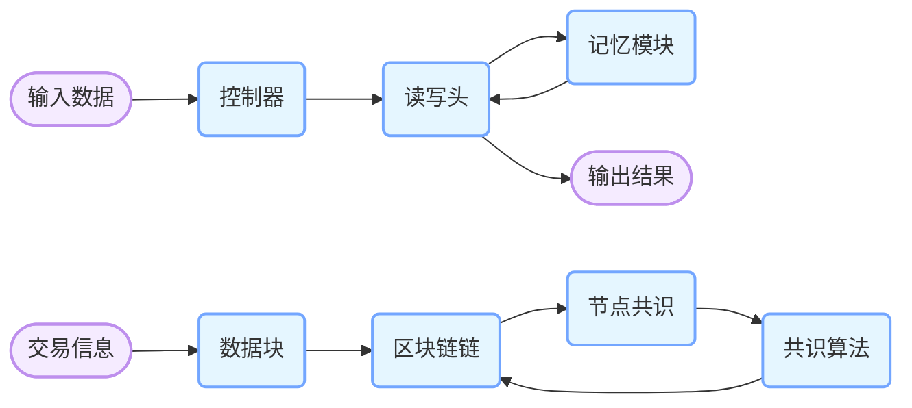

# 基于神经图灵机的高级算法自动优化在区块链技术中的应用

> 关键词：神经图灵机、算法自动优化、区块链技术、智能合约、共识算法

> 摘要：本文深入探讨了基于神经图灵机的高级算法自动优化在区块链技术中的应用。首先介绍了研究的背景、目的和预期读者等信息，阐述了神经图灵机和区块链的核心概念及联系。详细讲解了相关核心算法原理，并给出 Python 源代码示例。同时，给出了数学模型和公式，通过具体例子进行说明。在项目实战部分，展示了开发环境搭建、源代码实现及解读。分析了该技术在区块链不同场景下的实际应用，推荐了学习资源、开发工具框架和相关论文著作。最后总结了未来发展趋势与挑战，并对常见问题进行解答，提供了扩展阅读和参考资料。

## 1. 背景介绍 
### 1.1 目的和范围
区块链技术作为一种分布式账本技术，具有去中心化、不可篡改、安全可靠等特点，在金融、供应链、物联网等众多领域展现出巨大的应用潜力。然而，随着区块链应用的不断拓展，其面临着性能瓶颈、可扩展性差、智能合约执行效率低等问题。神经图灵机（Neural Turing Machine, NTM）是一种结合了神经网络和图灵机思想的计算模型，具有强大的记忆和推理能力。本研究的目的在于探索如何利用神经图灵机实现区块链中算法的自动优化，提高区块链系统的性能和效率，具体范围涵盖共识算法优化、智能合约执行优化等方面。

### 1.2 预期读者
本文预期读者包括区块链技术开发者、人工智能研究人员、对区块链和人工智能交叉领域感兴趣的技术爱好者、金融科技从业者以及相关领域的学术研究人员。这些读者具备一定的计算机科学和数学基础，希望深入了解神经图灵机在区块链技术中的应用原理和实现方法。

### 1.3 文档结构概述
本文将按照以下结构展开：首先介绍相关核心概念，包括神经图灵机和区块链的原理及联系；接着详细讲解核心算法原理和具体操作步骤，并给出 Python 代码示例；然后阐述相关数学模型和公式，并举例说明；在项目实战部分，展示如何搭建开发环境、实现源代码并进行解读；分析该技术在区块链中的实际应用场景；推荐学习资源、开发工具框架和相关论文著作；最后总结未来发展趋势与挑战，解答常见问题并提供扩展阅读和参考资料。

### 1.4 术语表
#### 1.4.1 核心术语定义
- **神经图灵机（Neural Turing Machine）**：一种结合了神经网络和图灵机思想的计算模型，通过可微分的读写操作对外部记忆进行访问，具备强大的记忆和推理能力。
- **区块链（Blockchain）**：一种分布式账本技术，由一个个数据块组成，每个数据块包含一定时间内的交易信息，通过密码学方法保证数据的不可篡改和安全性。
- **共识算法（Consensus Algorithm）**：区块链网络中用于达成节点间共识的算法，确保所有节点对区块链的状态达成一致。
- **智能合约（Smart Contract）**：一种以代码形式编写的合约，运行在区块链上，当满足预设条件时自动执行。

#### 1.4.2 相关概念解释
- **分布式账本**：一种去中心化的账本，多个节点共同维护，每个节点都保存着完整的账本副本。
- **密码学哈希函数**：一种将任意长度的输入数据转换为固定长度输出的函数，具有单向性、确定性和抗碰撞性等特点，常用于区块链中的数据验证和完整性保护。
- **图灵完备**：指一个计算系统能够模拟图灵机的所有计算能力，智能合约通常要求具备图灵完备性以实现复杂的逻辑运算。

#### 1.4.3 缩略词列表
- **NTM**：Neural Turing Machine（神经图灵机）
- **PoW**：Proof of Work（工作量证明）
- **PoS**：Proof of Stake（权益证明）
- **ETH**：Ethereum（以太坊）

## 2. 核心概念与联系 

### 神经图灵机原理
神经图灵机由控制器（Controller）、记忆模块（Memory）和读写头（Read/Write Heads）组成。控制器通常是一个神经网络，负责处理输入数据并生成控制信号，控制读写头对记忆模块进行读写操作。记忆模块是一个二维矩阵，用于存储信息。读写头根据控制器的指令在记忆模块上进行寻址和读写操作，通过可微分的方式更新记忆内容。

其工作流程如下：
1. 输入数据进入控制器，控制器根据输入生成控制信号。
2. 控制信号驱动读写头在记忆模块上进行寻址，确定读写位置。
3. 读写头对记忆模块进行读写操作，更新记忆内容。
4. 控制器根据更新后的记忆内容生成输出。

### 区块链原理
区块链是由一个个数据块组成的链式结构，每个数据块包含前一个数据块的哈希值、时间戳、交易信息等内容。区块链网络中的节点通过共识算法达成对区块链状态的一致，确保数据的一致性和不可篡改。常见的共识算法有工作量证明（PoW）、权益证明（PoS）等。

智能合约是区块链上的一段代码，运行在虚拟机中，当满足预设条件时自动执行。智能合约可以实现各种复杂的业务逻辑，如金融交易、供应链管理等。

### 核心概念联系
神经图灵机的强大记忆和推理能力可以用于优化区块链中的算法。例如，在共识算法中，神经图灵机可以学习节点的历史行为和网络状态，自动调整算法参数，提高共识效率和安全性。在智能合约执行方面，神经图灵机可以对合约代码进行分析和优化，减少执行时间和资源消耗。

### 文本示意图
```plaintext
神经图灵机 <---- 输入数据 ----> 控制器
           |
           | 控制信号
           v
        读写头 <---- 寻址 ----> 记忆模块
           |
           | 读写操作
           v
        输出结果

区块链 <---- 交易信息 ----> 数据块
           |
           | 哈希链接
           v
        区块链链
           |
           | 共识算法
           v
        节点共识
```

### Mermaid 流程图


## 3. 核心算法原理 & 具体操作步骤 

### 神经图灵机核心算法原理
神经图灵机的核心在于控制器、读写头和记忆模块之间的交互。控制器通常采用循环神经网络（RNN）或长短期记忆网络（LSTM），以处理序列数据。读写头通过注意力机制对记忆模块进行寻址，实现灵活的读写操作。

#### 寻址机制
寻址机制分为基于内容的寻址和基于位置的寻址。基于内容的寻址通过计算查询向量与记忆模块中每个位置的相似度来确定读写位置，基于位置的寻址则通过移动读写头的位置来实现。

#### 读写操作
读操作从记忆模块中读取信息，写操作包括擦除和写入两个步骤。擦除操作通过一个擦除向量将记忆模块中指定位置的信息清零，写入操作则将新的信息写入到指定位置。

### Python 代码实现
```python
import torch
import torch.nn as nn
import torch.nn.functional as F

# 定义控制器
class Controller(nn.Module):
    def __init__(self, input_size, hidden_size, output_size):
        super(Controller, self).__init__()
        self.rnn = nn.LSTM(input_size, hidden_size)
        self.fc = nn.Linear(hidden_size, output_size)

    def forward(self, x):
        output, _ = self.rnn(x)
        output = self.fc(output)
        return output

# 定义神经图灵机
class NeuralTuringMachine(nn.Module):
    def __init__(self, input_size, hidden_size, output_size, memory_size, memory_length):
        super(NeuralTuringMachine, self).__init__()
        self.controller = Controller(input_size, hidden_size, output_size)
        self.memory = torch.zeros(memory_size, memory_length)
        self.read_head = nn.Linear(output_size, memory_length)
        self.write_head = nn.Linear(output_size, memory_length * 2)

    def forward(self, x):
        control_output = self.controller(x)
        # 读操作
        read_weight = F.softmax(self.read_head(control_output), dim=1)
        read_content = torch.matmul(read_weight, self.memory)
        # 写操作
        write_params = self.write_head(control_output)
        erase_vector = torch.sigmoid(write_params[:, :self.memory.size(1)])
        add_vector = torch.tanh(write_params[:, self.memory.size(1):])
        self.memory = self.memory * (1 - torch.ger(read_weight.squeeze(), erase_vector.squeeze()))
        self.memory = self.memory + torch.ger(read_weight.squeeze(), add_vector.squeeze())
        return read_content

# 测试代码
input_size = 10
hidden_size = 20
output_size = 30
memory_size = 5
memory_length = 10
ntm = NeuralTuringMachine(input_size, hidden_size, output_size, memory_size, memory_length)
input_data = torch.randn(1, 1, input_size)
output = ntm(input_data)
print(output)
```

### 具体操作步骤
1. **初始化神经图灵机**：设置输入大小、隐藏大小、输出大小、记忆模块大小和长度，创建控制器、读写头和记忆模块。
2. **输入数据**：将输入数据传入控制器，得到控制输出。
3. **读操作**：根据控制输出生成读权重，通过读权重从记忆模块中读取信息。
4. **写操作**：根据控制输出生成擦除向量和添加向量，对记忆模块进行擦除和写入操作。
5. **输出结果**：返回读取的信息作为输出。

## 4. 数学模型和公式 & 详细讲解 & 举例说明 

### 寻址机制数学模型
#### 基于内容的寻址
基于内容的寻址通过计算查询向量 $q_t$ 与记忆模块中每个位置的相似度来确定读写位置。相似度计算通常使用余弦相似度：
$$
w_t^c(i) = \frac{K(q_t, M_t(i))}{\sum_{j=1}^N K(q_t, M_t(j))}
$$
其中，$w_t^c(i)$ 是第 $t$ 时刻第 $i$ 个位置的基于内容的权重，$K(q_t, M_t(i))$ 是查询向量 $q_t$ 与记忆模块 $M_t$ 中第 $i$ 个位置的余弦相似度，$N$ 是记忆模块的长度。

#### 基于位置的寻址
基于位置的寻址通过一个移位向量 $s_t$ 对基于内容的权重进行移位操作：
$$
w_t^g = \gamma_t w_t^c + (1 - \gamma_t) w_{t-1}
$$
$$
w_t^s(i) = \sum_{j=0}^{N-1} w_t^g(j) s_t((i - j) \bmod N)
$$
其中，$w_t^g$ 是加权后的权重，$\gamma_t$ 是一个门控参数，$w_{t-1}$ 是上一时刻的权重，$w_t^s(i)$ 是第 $t$ 时刻第 $i$ 个位置的基于位置的权重。

### 读写操作数学模型
#### 读操作
读操作从记忆模块中读取信息：
$$
r_t = \sum_{i=1}^N w_t^r(i) M_t(i)
$$
其中，$r_t$ 是第 $t$ 时刻读取的信息，$w_t^r(i)$ 是第 $t$ 时刻第 $i$ 个位置的读权重。

#### 写操作
写操作包括擦除和写入两个步骤：
$$
M_t'(i) = M_{t-1}(i) (1 - w_t^w(i) e_t)
$$
$$
M_t(i) = M_t'(i) + w_t^w(i) a_t
$$
其中，$M_t'(i)$ 是擦除后的记忆模块，$e_t$ 是擦除向量，$a_t$ 是添加向量，$w_t^w(i)$ 是第 $t$ 时刻第 $i$ 个位置的写权重。

### 举例说明
假设记忆模块 $M$ 是一个 $3 \times 3$ 的矩阵：
$$
M = \begin{bmatrix}
1 & 2 & 3 \\
4 & 5 & 6 \\
7 & 8 & 9
\end{bmatrix}
$$
查询向量 $q = [1, 2, 3]$，计算基于内容的权重：
$$
K(q, M(1)) = \frac{q \cdot M(1)}{\|q\| \|M(1)\|} = \frac{1\times1 + 2\times2 + 3\times3}{\sqrt{1^2 + 2^2 + 3^2} \sqrt{1^2 + 2^2 + 3^2}} = 1
$$
$$
K(q, M(2)) = \frac{q \cdot M(2)}{\|q\| \|M(2)\|} = \frac{1\times4 + 2\times5 + 3\times6}{\sqrt{1^2 + 2^2 + 3^2} \sqrt{4^2 + 5^2 + 6^2}} \approx 0.97
$$
$$
K(q, M(3)) = \frac{q \cdot M(3)}{\|q\| \|M(3)\|} = \frac{1\times7 + 2\times8 + 3\times9}{\sqrt{1^2 + 2^2 + 3^2} \sqrt{7^2 + 8^2 + 9^2}} \approx 0.94
$$
$$
w^c = \frac{[1, 0.97, 0.94]}{1 + 0.97 + 0.94} \approx [0.34, 0.33, 0.33]
$$
假设移位向量 $s = [0, 1, 0]$，则基于位置的权重：
$$
w^s = [0.33, 0.34, 0.33]
$$
读操作读取的信息：
$$
r = 0.33 \times [1, 2, 3] + 0.34 \times [4, 5, 6] + 0.33 \times [7, 8, 9] \approx [4.0, 5.0, 6.0]
$$

## 5. 项目实战：代码实际案例和详细解释说明 

### 5.1  开发环境搭建
#### 操作系统
建议使用 Linux 系统，如 Ubuntu 18.04 或更高版本，因为 Linux 系统对深度学习开发具有良好的支持。

#### 编程语言和框架
- **Python**：使用 Python 3.7 或更高版本，Python 是深度学习开发中最常用的编程语言，具有丰富的库和工具。
- **PyTorch**：使用 PyTorch 深度学习框架，它提供了动态图机制，方便进行模型开发和调试。

#### 安装步骤
1. 安装 Python：可以从 Python 官方网站下载并安装 Python 3.7 或更高版本。
2. 安装 PyTorch：根据自己的系统和 CUDA 版本，从 PyTorch 官方网站选择合适的安装命令进行安装。例如，对于 CPU 版本的 PyTorch，可以使用以下命令：
```bash
pip install torch torchvision
```

### 5.2  源代码详细实现和代码解读
#### 项目需求
实现一个基于神经图灵机的区块链智能合约优化系统，通过神经图灵机学习智能合约的执行模式，自动优化合约代码，提高执行效率。

#### 源代码实现
```python
import torch
import torch.nn as nn
import torch.optim as optim

# 定义控制器
class Controller(nn.Module):
    def __init__(self, input_size, hidden_size, output_size):
        super(Controller, self).__init__()
        self.rnn = nn.LSTM(input_size, hidden_size)
        self.fc = nn.Linear(hidden_size, output_size)

    def forward(self, x):
        output, _ = self.rnn(x)
        output = self.fc(output)
        return output

# 定义神经图灵机
class NeuralTuringMachine(nn.Module):
    def __init__(self, input_size, hidden_size, output_size, memory_size, memory_length):
        super(NeuralTuringMachine, self).__init__()
        self.controller = Controller(input_size, hidden_size, output_size)
        self.memory = torch.zeros(memory_size, memory_length)
        self.read_head = nn.Linear(output_size, memory_length)
        self.write_head = nn.Linear(output_size, memory_length * 2)

    def forward(self, x):
        control_output = self.controller(x)
        # 读操作
        read_weight = torch.softmax(self.read_head(control_output), dim=1)
        read_content = torch.matmul(read_weight, self.memory)
        # 写操作
        write_params = self.write_head(control_output)
        erase_vector = torch.sigmoid(write_params[:, :self.memory.size(1)])
        add_vector = torch.tanh(write_params[:, self.memory.size(1):])
        self.memory = self.memory * (1 - torch.ger(read_weight.squeeze(), erase_vector.squeeze()))
        self.memory = self.memory + torch.ger(read_weight.squeeze(), add_vector.squeeze())
        return read_content

# 定义智能合约优化模型
class SmartContractOptimizer(nn.Module):
    def __init__(self, input_size, hidden_size, output_size, memory_size, memory_length):
        super(SmartContractOptimizer, self).__init__()
        self.ntm = NeuralTuringMachine(input_size, hidden_size, output_size, memory_size, memory_length)
        self.fc = nn.Linear(output_size, input_size)

    def forward(self, x):
        ntm_output = self.ntm(x)
        output = self.fc(ntm_output)
        return output

# 训练模型
def train_model(model, train_data, epochs, learning_rate):
    criterion = nn.MSELoss()
    optimizer = optim.Adam(model.parameters(), lr=learning_rate)
    for epoch in range(epochs):
        total_loss = 0
        for data in train_data:
            input_data = data.unsqueeze(0).unsqueeze(0)
            target = input_data
            optimizer.zero_grad()
            output = model(input_data)
            loss = criterion(output, target)
            loss.backward()
            optimizer.step()
            total_loss += loss.item()
        print(f'Epoch {epoch+1}/{epochs}, Loss: {total_loss/len(train_data)}')

# 测试代码
input_size = 10
hidden_size = 20
output_size = 30
memory_size = 5
memory_length = 10
model = SmartContractOptimizer(input_size, hidden_size, output_size, memory_size, memory_length)
train_data = [torch.randn(input_size) for _ in range(100)]
train_model(model, train_data, epochs=10, learning_rate=0.001)
```

#### 代码解读
1. **控制器（Controller）**：使用 LSTM 作为控制器，处理输入数据并生成控制信号。
2. **神经图灵机（NeuralTuringMachine）**：包含控制器、记忆模块和读写头，实现了读操作和写操作。
3. **智能合约优化模型（SmartContractOptimizer）**：将神经图灵机的输出通过全连接层映射回输入大小，用于优化智能合约代码。
4. **训练模型（train_model）**：使用均方误差损失函数和 Adam 优化器进行模型训练。

### 5.3  代码解读与分析
#### 模型结构分析
- **控制器**：LSTM 可以处理序列数据，捕捉智能合约执行过程中的时间依赖关系。
- **神经图灵机**：通过读写头对记忆模块进行操作，实现对智能合约执行模式的学习和记忆。
- **全连接层**：将神经图灵机的输出映射回输入大小，用于生成优化后的智能合约代码。

#### 训练过程分析
- **损失函数**：使用均方误差损失函数，衡量优化后的代码与原始代码之间的差异。
- **优化器**：使用 Adam 优化器，自适应调整学习率，提高训练效率。

#### 模型性能分析
通过训练过程中的损失值可以评估模型的性能。如果损失值逐渐下降，说明模型在不断学习和优化；如果损失值趋于稳定或不再下降，可能需要调整模型结构或训练参数。

## 6. 实际应用场景 
### 共识算法优化
在区块链网络中，共识算法是确保节点间达成一致的关键。传统的共识算法如工作量证明（PoW）和权益证明（PoS）存在性能瓶颈和安全性问题。基于神经图灵机的算法自动优化可以学习节点的历史行为、网络状态和交易模式，自动调整共识算法的参数，提高共识效率和安全性。例如，神经图灵机可以根据节点的计算能力、网络延迟等因素动态调整挖矿难度或权益分配，减少共识时间和能源消耗。

### 智能合约执行优化
智能合约是区块链上的自动化合约，其执行效率直接影响区块链应用的性能。神经图灵机可以对智能合约代码进行分析和优化，识别代码中的冗余部分和低效逻辑，自动生成优化后的代码。同时，神经图灵机可以学习智能合约的执行模式，提前预测合约的执行结果，减少不必要的计算和存储操作，提高智能合约的执行效率。

### 区块链数据存储优化
区块链中的数据存储是一个重要的问题，随着区块链规模的不断扩大，数据存储和检索的效率成为制约区块链发展的关键因素。神经图灵机可以学习区块链数据的分布和访问模式，优化数据存储结构和索引机制。例如，神经图灵机可以根据数据的访问频率和相关性将数据分组存储，提高数据检索效率；同时，通过预测数据的未来访问趋势，提前进行数据缓存，减少数据访问延迟。

### 区块链隐私保护
区块链的公开透明性在某些场景下可能会导致隐私泄露问题。神经图灵机可以用于设计更加安全和隐私保护的区块链协议。例如，神经图灵机可以学习用户的隐私需求和数据访问模式，对区块链数据进行加密和脱敏处理，确保数据的隐私性和安全性。同时，神经图灵机可以在不泄露用户隐私的前提下，实现区块链上的数据分析和挖掘，为用户提供有价值的信息。

## 7. 工具和资源推荐
### 7.1 学习资源推荐
#### 7.1.1 书籍推荐
- 《深度学习》（Deep Learning）：由 Ian Goodfellow、Yoshua Bengio 和 Aaron Courville 撰写，是深度学习领域的经典教材，涵盖了深度学习的基本概念、算法和应用。
- 《区块链技术指南》：全面介绍了区块链的技术原理、应用场景和发展趋势，适合初学者入门。
- 《Python 深度学习》（Deep Learning with Python）：由 Francois Chollet 撰写，通过实际案例介绍了如何使用 Python 和 Keras 进行深度学习开发。

#### 7.1.2 在线课程
- Coursera 上的“深度学习专项课程”（Deep Learning Specialization）：由 Andrew Ng 教授授课，包括深度学习基础、卷积神经网络、循环神经网络等内容。
- edX 上的“区块链技术基础”（Blockchain Technology Basics）：介绍了区块链的基本概念、技术原理和应用场景。
- Udemy 上的“神经图灵机实战”（Neural Turing Machine实战）：通过实际项目介绍了神经图灵机的原理和实现方法。

#### 7.1.3 技术博客和网站
- Medium：是一个技术博客平台，有很多关于深度学习、区块链和人工智能的优质文章。
- arXiv：是一个预印本数据库，提供了最新的学术研究论文，包括神经图灵机和区块链领域的研究成果。
- 区块链技术论坛：如巴比特、链闻等，提供了区块链技术的最新动态和技术交流平台。

### 7.2 开发工具框架推荐
#### 7.2.1 IDE和编辑器
- PyCharm：是一款专业的 Python 集成开发环境，提供了代码编辑、调试、版本控制等功能，适合深度学习开发。
- Jupyter Notebook：是一个交互式的开发环境，支持 Python、R 等多种编程语言，方便进行代码调试和数据分析。
- Visual Studio Code：是一款轻量级的代码编辑器，支持多种编程语言和插件，具有丰富的扩展功能。

#### 7.2.2 调试和性能分析工具
- PyTorch Profiler：是 PyTorch 提供的性能分析工具，可以分析模型的运行时间、内存使用等情况，帮助优化模型性能。
- TensorBoard：是 TensorFlow 提供的可视化工具，也可以用于 PyTorch 模型的可视化，支持损失曲线、准确率曲线等多种可视化方式。
- cProfile：是 Python 自带的性能分析工具，可以分析代码的运行时间和函数调用次数，帮助找出代码中的性能瓶颈。

#### 7.2.3 相关框架和库
- PyTorch：是一个开源的深度学习框架，提供了动态图机制和丰富的深度学习模型库，适合进行神经图灵机和区块链相关的研究和开发。
- Ethereum（以太坊）：是一个开源的区块链平台，支持智能合约的开发和部署，提供了 Solidity 编程语言和开发工具。
- Hyperledger Fabric：是一个开源的企业级区块链平台，提供了灵活的架构和丰富的组件，适合构建企业级区块链应用。

### 7.3 相关论文著作推荐
#### 7.3.1 经典论文
- 《Neural Turing Machines》：介绍了神经图灵机的基本原理和实现方法，是神经图灵机领域的经典论文。
- 《Bitcoin: A Peer-to-Peer Electronic Cash System》：比特币的白皮书，介绍了比特币的基本概念、技术原理和实现方法，是区块链领域的奠基之作。
- 《Ethereum: A Next-Generation Smart Contract and Decentralized Application Platform》：以太坊的白皮书，介绍了以太坊的智能合约和去中心化应用平台的概念和实现方法。

#### 7.3.2 最新研究成果
- 在 arXiv 上搜索“Neural Turing Machine in Blockchain”可以找到最新的关于神经图灵机在区块链中的应用研究成果。
- 参加国际学术会议如 IEEE International Conference on Blockchain and Cryptocurrency（ICBC）、ACM Conference on Computer and Communications Security（CCS）等，可以了解到最新的区块链和人工智能领域的研究动态。

#### 7.3.3 应用案例分析
- 分析以太坊上的去中心化金融（DeFi）应用案例，了解智能合约在金融领域的应用和优化方法。
- 研究 Hyperledger Fabric 在供应链管理、医疗保健等领域的应用案例，了解企业级区块链应用的开发和优化方法。

## 8. 总结：未来发展趋势与挑战
### 未来发展趋势
- **融合发展**：神经图灵机与区块链技术的融合将越来越深入，不仅在共识算法、智能合约等方面进行优化，还将拓展到区块链的各个层面，如数据存储、隐私保护、跨链交互等。
- **应用拓展**：基于神经图灵机的区块链技术将在更多领域得到应用，如物联网、金融科技、医疗保健、供应链管理等，为这些领域带来更高效、更安全、更智能的解决方案。
- **技术创新**：随着人工智能和区块链技术的不断发展，将涌现出更多新的算法和模型，进一步提升神经图灵机在区块链中的应用效果。

### 挑战
- **计算资源需求**：神经图灵机的训练和推理需要大量的计算资源，特别是在处理大规模区块链数据时，计算资源的需求将更加突出。如何降低计算资源的消耗，提高算法的效率是一个亟待解决的问题。
- **模型可解释性**：神经图灵机是一种深度学习模型，其内部结构和决策过程具有一定的黑盒性，缺乏可解释性。在区块链应用中，特别是涉及到金融交易和法律合规等领域，模型的可解释性至关重要。
- **安全性问题**：虽然神经图灵机可以提高区块链的安全性，但自身也面临着安全风险，如模型被攻击、数据泄露等。如何保障神经图灵机在区块链中的安全性是一个重要的挑战。

## 9. 附录：常见问题与解答
### 1. 神经图灵机与传统神经网络有什么区别？
神经图灵机与传统神经网络的主要区别在于引入了外部记忆模块和可微分的读写操作。传统神经网络主要依赖于内部的神经元来存储和处理信息，而神经图灵机可以通过读写头对外部记忆模块进行访问，实现更强大的记忆和推理能力。

### 2. 如何评估基于神经图灵机的区块链算法优化效果？
可以从多个方面评估基于神经图灵机的区块链算法优化效果，如共识时间、交易吞吐量、智能合约执行时间、能源消耗等。通过对比优化前后的指标，可以直观地评估优化效果。

### 3. 神经图灵机在区块链中的应用是否会增加系统的复杂性？
是的，神经图灵机的引入会增加系统的复杂性。神经图灵机的训练和推理需要更多的计算资源和时间，同时其模型结构和参数调整也更加复杂。但是，通过合理的设计和优化，可以在一定程度上降低系统的复杂性。

### 4. 如何解决神经图灵机在区块链中的可解释性问题？
可以采用一些方法来提高神经图灵机在区块链中的可解释性，如可视化技术、特征重要性分析、规则提取等。通过这些方法，可以将神经图灵机的决策过程可视化，找出对决策影响较大的特征，提取出可解释的规则。

## 10. 扩展阅读 & 参考资料
### 扩展阅读
- 《人工智能：现代方法》（Artificial Intelligence: A Modern Approach）：全面介绍了人工智能的基本概念、算法和应用，适合深入学习人工智能领域的知识。
- 《区块链革命：比特币底层技术如何改变货币、商业和世界》（The Blockchain Revolution: How the Technology Behind Bitcoin Is Changing Money, Business, and the World）：介绍了区块链技术的发展历程和应用前景，适合了解区块链技术的社会影响。

### 参考资料
- [Neural Turing Machines](https://arxiv.org/abs/1410.5401)
- [Bitcoin: A Peer-to-Peer Electronic Cash System](https://bitcoin.org/bitcoin.pdf)
- [Ethereum: A Next-Generation Smart Contract and Decentralized Application Platform](https://ethereum.org/en/whitepaper/)

作者：AI天才研究院/AI Genius Institute & 禅与计算机程序设计艺术 /Zen And The Art of Computer Programming