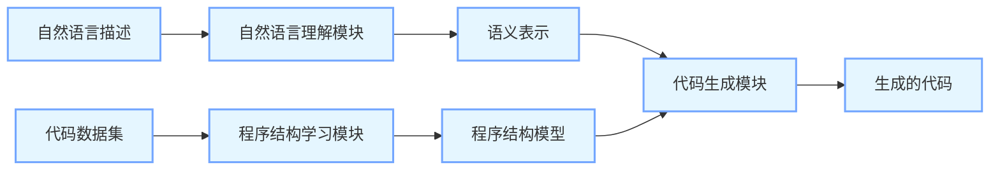

# 基于神经程序合成的自动推理代码生成

> 关键词：神经程序合成、自动推理、代码生成、深度学习、自然语言处理

> 摘要：本文围绕基于神经程序合成的自动推理代码生成展开深入探讨。首先介绍了该领域的背景，包括目的、预期读者等信息。接着详细阐述了核心概念、算法原理、数学模型等内容，并通过Python代码进行原理展示。在项目实战部分，给出了开发环境搭建、源代码实现与解读。同时，探讨了实际应用场景，推荐了相关的工具和资源。最后对未来发展趋势与挑战进行总结，并提供常见问题解答和扩展阅读参考资料。旨在为研究者和开发者全面深入地了解基于神经程序合成的自动推理代码生成技术提供有价值的指导。

## 1. 背景介绍 
### 1.1 目的和范围
在当今软件开发领域，提高代码生成的效率和质量是至关重要的目标。基于神经程序合成的自动推理代码生成技术旨在利用神经网络模型，根据自然语言描述或问题规格自动生成可执行的代码。本文章的范围涵盖了该技术的核心概念、算法原理、数学模型、实际应用以及未来发展等多个方面，旨在为读者提供全面而深入的了解。

### 1.2 预期读者
本文预期读者包括计算机科学领域的研究者、软件开发工程师、人工智能爱好者等。对于正在从事代码生成、自然语言处理、机器学习等相关研究的学者，本文可提供前沿的技术思路和研究方向；对于软件开发人员，可帮助他们了解如何利用该技术提高开发效率；对于人工智能爱好者，能让他们对这一前沿技术有更深入的认识。

### 1.3 文档结构概述
本文将按照以下结构进行组织：首先介绍背景信息，让读者了解该技术的研究目的和适用人群；接着阐述核心概念与联系，包括相关的原理和架构；然后详细讲解核心算法原理及具体操作步骤，并结合Python代码进行说明；之后介绍数学模型和公式，并举例说明；再通过项目实战展示代码的实际应用和详细解释；探讨实际应用场景；推荐相关的工具和资源；总结未来发展趋势与挑战；最后提供常见问题解答和扩展阅读参考资料。

### 1.4 术语表
#### 1.4.1 核心术语定义
- **神经程序合成（Neural Program Synthesis）**：利用神经网络模型从自然语言描述、示例输入输出等信息中自动生成程序代码的技术。
- **自动推理（Automated Reasoning）**：使用计算机自动进行逻辑推理，以证明定理、推导结论等的过程。
- **代码生成（Code Generation）**：将某种形式的描述（如自然语言、抽象语法树等）转换为可执行代码的过程。

#### 1.4.2 相关概念解释
- **深度学习（Deep Learning）**：一种基于人工神经网络的机器学习方法，通过构建多层神经网络模型来学习数据的复杂特征和模式。
- **自然语言处理（Natural Language Processing，NLP）**：研究如何让计算机理解、处理和生成自然语言的技术领域。

#### 1.4.3 缩略词列表
- **NLP**：Natural Language Processing，自然语言处理
- **DNN**：Deep Neural Network，深度神经网络
- **RNN**：Recurrent Neural Network，循环神经网络
- **LSTM**：Long Short - Term Memory，长短期记忆网络
- **GRU**：Gated Recurrent Unit，门控循环单元

## 2. 核心概念与联系 

### 核心概念原理
基于神经程序合成的自动推理代码生成主要涉及自然语言理解、程序结构学习和代码生成三个关键步骤。

首先，自然语言理解模块将用户输入的自然语言描述转换为机器可理解的表示。这通常借助自然语言处理技术，如词法分析、句法分析和语义分析等，将文本解析为有意义的语义表示，例如抽象语法树（AST）或中间表示（IR）。

其次，程序结构学习模块利用深度学习模型学习程序的结构和语义。常见的模型包括循环神经网络（RNN）及其变体（如LSTM、GRU）、卷积神经网络（CNN）和Transformer等。这些模型通过在大规模代码数据集上进行训练，学习代码的语法和语义模式，从而能够生成符合语法规则和语义要求的代码。

最后，代码生成模块根据前面得到的语义表示和学习到的程序结构，生成最终的可执行代码。这一过程通常是一个序列生成问题，通过解码器逐步生成代码的各个部分。

### 架构示意图


该架构图展示了基于神经程序合成的自动推理代码生成的整体流程。自然语言描述经过自然语言理解模块转换为语义表示，同时程序结构学习模块从代码数据集中学习程序结构，最后代码生成模块结合语义表示和程序结构模型生成最终的代码。

## 3. 核心算法原理 & 具体操作步骤 

### 算法原理
基于神经程序合成的自动推理代码生成通常采用编码器 - 解码器架构。编码器将输入的自然语言描述或问题规格编码为一个固定长度的向量表示，解码器则根据这个向量表示逐步生成代码序列。

以下是一个简单的基于LSTM的编码器 - 解码器实现的Python代码示例：

```python
import torch
import torch.nn as nn

# 编码器
class Encoder(nn.Module):
    def __init__(self, input_size, hidden_size):
        super(Encoder, self).__init__()
        self.hidden_size = hidden_size
        self.embedding = nn.Embedding(input_size, hidden_size)
        self.lstm = nn.LSTM(hidden_size, hidden_size)

    def forward(self, input, hidden):
        embedded = self.embedding(input).view(1, 1, -1)
        output, hidden = self.lstm(embedded, hidden)
        return output, hidden

    def initHidden(self):
        return (torch.zeros(1, 1, self.hidden_size),
                torch.zeros(1, 1, self.hidden_size))

# 解码器
class Decoder(nn.Module):
    def __init__(self, hidden_size, output_size):
        super(Decoder, self).__init__()
        self.hidden_size = hidden_size
        self.embedding = nn.Embedding(output_size, hidden_size)
        self.lstm = nn.LSTM(hidden_size, hidden_size)
        self.out = nn.Linear(hidden_size, output_size)
        self.softmax = nn.LogSoftmax(dim=1)

    def forward(self, input, hidden):
        output = self.embedding(input).view(1, 1, -1)
        output = nn.functional.relu(output)
        output, hidden = self.lstm(output, hidden)
        output = self.softmax(self.out(output[0]))
        return output, hidden

    def initHidden(self):
        return (torch.zeros(1, 1, self.hidden_size),
                torch.zeros(1, 1, self.hidden_size))
```

### 具体操作步骤
1. **数据准备**：收集和整理大规模的代码数据集，并将自然语言描述与对应的代码进行配对。对数据进行预处理，如分词、词向量编码等。
2. **模型训练**：
    - 初始化编码器和解码器模型。
    - 定义损失函数（如交叉熵损失）和优化器（如Adam优化器）。
    - 迭代训练数据，将自然语言描述输入编码器，得到编码向量，然后将编码向量输入解码器生成代码序列，计算损失并更新模型参数。
3. **代码生成**：
    - 输入新的自然语言描述，通过编码器得到编码向量。
    - 解码器根据编码向量逐步生成代码序列，直到生成结束标志。

以下是一个简单的训练和生成代码的示例：

```python
# 训练示例
encoder = Encoder(input_size=1000, hidden_size=256)
decoder = Decoder(hidden_size=256, output_size=1000)
criterion = nn.NLLLoss()
optimizer = torch.optim.Adam(list(encoder.parameters()) + list(decoder.parameters()), lr=0.001)

# 模拟训练数据
input_tensor = torch.randint(0, 1000, (10,))
target_tensor = torch.randint(0, 1000, (10,))

encoder_hidden = encoder.initHidden()
encoder_outputs = torch.zeros(10, encoder.hidden_size)

for ei in range(len(input_tensor)):
    encoder_output, encoder_hidden = encoder(input_tensor[ei].unsqueeze(0), encoder_hidden)
    encoder_outputs[ei] = encoder_output[0, 0]

decoder_input = torch.tensor([[0]])  # 起始标志
decoder_hidden = encoder_hidden

loss = 0
for di in range(len(target_tensor)):
    decoder_output, decoder_hidden = decoder(decoder_input, decoder_hidden)
    topv, topi = decoder_output.topk(1)
    decoder_input = topi.squeeze().detach()  # 选择最可能的下一个词
    loss += criterion(decoder_output, target_tensor[di].unsqueeze(0))

optimizer.zero_grad()
loss.backward()
optimizer.step()

# 生成代码示例
input_tensor = torch.randint(0, 1000, (5,))
encoder_hidden = encoder.initHidden()
encoder_outputs = torch.zeros(5, encoder.hidden_size)

for ei in range(len(input_tensor)):
    encoder_output, encoder_hidden = encoder(input_tensor[ei].unsqueeze(0), encoder_hidden)
    encoder_outputs[ei] = encoder_output[0, 0]

decoder_input = torch.tensor([[0]])  # 起始标志
decoder_hidden = encoder_hidden
generated_code = []

for _ in range(10):  # 生成10个词
    decoder_output, decoder_hidden = decoder(decoder_input, decoder_hidden)
    topv, topi = decoder_output.topk(1)
    decoder_input = topi.squeeze().detach()
    generated_code.append(decoder_input.item())

print("Generated code:", generated_code)
```

## 4. 数学模型和公式 & 详细讲解 & 举例说明 

### 数学模型
基于神经程序合成的自动推理代码生成的核心数学模型是概率模型。假设输入的自然语言描述为 $x$，生成的代码序列为 $y = [y_1, y_2, \cdots, y_T]$，则生成代码的概率可以表示为：

$$P(y|x) = \prod_{t=1}^{T} P(y_t|y_{<t}, x)$$

其中，$P(y_t|y_{<t}, x)$ 表示在给定之前生成的代码序列 $y_{<t} = [y_1, y_2, \cdots, y_{t - 1}]$ 和输入自然语言描述 $x$ 的条件下，生成第 $t$ 个代码元素 $y_t$ 的概率。

### 详细讲解
在编码器 - 解码器架构中，编码器将输入 $x$ 编码为一个固定长度的向量 $h$，解码器则根据 $h$ 和之前生成的代码序列 $y_{<t}$ 计算 $P(y_t|y_{<t}, x)$。具体来说，解码器通常使用一个循环神经网络（如LSTM或GRU）来生成代码序列，其计算公式如下：

- **LSTM单元**：
    - 输入门：$i_t = \sigma(W_{ii} x_t + W_{hi} h_{t - 1} + b_i)$
    - 遗忘门：$f_t = \sigma(W_{if} x_t + W_{hf} h_{t - 1} + b_f)$
    - 候选记忆单元：$\tilde{C}_t = \tanh(W_{ic} x_t + W_{hc} h_{t - 1} + b_c)$
    - 记忆单元：$C_t = f_t \odot C_{t - 1} + i_t \odot \tilde{C}_t$
    - 输出门：$o_t = \sigma(W_{io} x_t + W_{ho} h_{t - 1} + b_o)$
    - 隐藏状态：$h_t = o_t \odot \tanh(C_t)$

其中，$x_t$ 是输入，$h_{t - 1}$ 是上一时刻的隐藏状态，$C_{t - 1}$ 是上一时刻的记忆单元，$W$ 是权重矩阵，$b$ 是偏置向量，$\sigma$ 是 sigmoid 函数，$\tanh$ 是双曲正切函数，$\odot$ 表示逐元素相乘。

- **代码生成概率**：
    - 解码器的输出经过一个全连接层和 softmax 函数得到生成每个代码元素的概率：
    $$P(y_t|y_{<t}, x) = \text{softmax}(W_{out} h_t + b_{out})$$

其中，$W_{out}$ 是输出层的权重矩阵，$b_{out}$ 是偏置向量。

### 举例说明
假设我们有一个简单的自然语言描述 “计算两个数的和”，输入编码器后得到编码向量 $h$。解码器从起始标志开始生成代码序列。假设在第 $t$ 步，解码器的隐藏状态为 $h_t$，经过全连接层和 softmax 函数后，得到生成每个代码元素的概率分布。例如，生成 “+” 运算符的概率为 0.8，生成 “-” 运算符的概率为 0.1，生成其他运算符的概率为 0.1。则根据这个概率分布，我们选择概率最大的 “+” 作为第 $t$ 个代码元素，继续生成下一个代码元素，直到生成结束标志。

## 5. 项目实战：代码实际案例和详细解释说明 

### 5.1  开发环境搭建
#### 操作系统
建议使用 Linux 或 macOS 操作系统，因为它们对深度学习开发有较好的支持。Windows 系统也可以使用，但可能需要额外的配置。

#### 编程语言和库
- **Python**：版本 3.6 及以上。
- **深度学习框架**：PyTorch，可通过以下命令安装：
```bash
pip install torch torchvision
```
- **自然语言处理库**：NLTK、SpaCy 等，可通过以下命令安装：
```bash
pip install nltk spacy
python -m spacy download en_core_web_sm
```

#### 代码编辑器
推荐使用 PyCharm 或 Jupyter Notebook，它们都提供了方便的代码编辑和调试功能。

### 5.2  源代码详细实现和代码解读
以下是一个完整的基于神经程序合成的自动推理代码生成的项目示例：

```python
import torch
import torch.nn as nn
import torch.optim as optim
from torch.utils.data import Dataset, DataLoader
import numpy as np
import random

# 定义数据集类
class CodeDataset(Dataset):
    def __init__(self, data):
        self.data = data

    def __len__(self):
        return len(self.data)

    def __getitem__(self, idx):
        input_text, target_code = self.data[idx]
        input_tensor = torch.tensor(input_text, dtype=torch.long)
        target_tensor = torch.tensor(target_code, dtype=torch.long)
        return input_tensor, target_tensor

# 编码器
class Encoder(nn.Module):
    def __init__(self, input_size, hidden_size):
        super(Encoder, self).__init__()
        self.hidden_size = hidden_size
        self.embedding = nn.Embedding(input_size, hidden_size)
        self.lstm = nn.LSTM(hidden_size, hidden_size)

    def forward(self, input, hidden):
        embedded = self.embedding(input).view(1, 1, -1)
        output, hidden = self.lstm(embedded, hidden)
        return output, hidden

    def initHidden(self):
        return (torch.zeros(1, 1, self.hidden_size),
                torch.zeros(1, 1, self.hidden_size))

# 解码器
class Decoder(nn.Module):
    def __init__(self, hidden_size, output_size):
        super(Decoder, self).__init__()
        self.hidden_size = hidden_size
        self.embedding = nn.Embedding(output_size, hidden_size)
        self.lstm = nn.LSTM(hidden_size, hidden_size)
        self.out = nn.Linear(hidden_size, output_size)
        self.softmax = nn.LogSoftmax(dim=1)

    def forward(self, input, hidden):
        output = self.embedding(input).view(1, 1, -1)
        output = nn.functional.relu(output)
        output, hidden = self.lstm(output, hidden)
        output = self.softmax(self.out(output[0]))
        return output, hidden

    def initHidden(self):
        return (torch.zeros(1, 1, self.hidden_size),
                torch.zeros(1, 1, self.hidden_size))

# 训练函数
def train(input_tensor, target_tensor, encoder, decoder, encoder_optimizer, decoder_optimizer, criterion):
    encoder_hidden = encoder.initHidden()
    encoder_optimizer.zero_grad()
    decoder_optimizer.zero_grad()

    input_length = input_tensor.size(0)
    target_length = target_tensor.size(0)

    encoder_outputs = torch.zeros(input_length, encoder.hidden_size)

    for ei in range(input_length):
        encoder_output, encoder_hidden = encoder(input_tensor[ei].unsqueeze(0), encoder_hidden)
        encoder_outputs[ei] = encoder_output[0, 0]

    decoder_input = torch.tensor([[0]])  # 起始标志
    decoder_hidden = encoder_hidden

    loss = 0

    for di in range(target_length):
        decoder_output, decoder_hidden = decoder(decoder_input, decoder_hidden)
        topv, topi = decoder_output.topk(1)
        decoder_input = topi.squeeze().detach()  # 选择最可能的下一个词
        loss += criterion(decoder_output, target_tensor[di].unsqueeze(0))

    loss.backward()

    encoder_optimizer.step()
    decoder_optimizer.step()

    return loss.item() / target_length

# 生成代码函数
def generate_code(input_text, encoder, decoder, max_length=20):
    with torch.no_grad():
        input_tensor = torch.tensor(input_text, dtype=torch.long)
        encoder_hidden = encoder.initHidden()
        input_length = input_tensor.size(0)
        encoder_outputs = torch.zeros(input_length, encoder.hidden_size)

        for ei in range(input_length):
            encoder_output, encoder_hidden = encoder(input_tensor[ei].unsqueeze(0), encoder_hidden)
            encoder_outputs[ei] = encoder_output[0, 0]

        decoder_input = torch.tensor([[0]])  # 起始标志
        decoder_hidden = encoder_hidden
        generated_code = []

        for _ in range(max_length):
            decoder_output, decoder_hidden = decoder(decoder_input, decoder_hidden)
            topv, topi = decoder_output.topk(1)
            decoder_input = topi.squeeze().detach()
            if decoder_input.item() == 1:  # 结束标志
                break
            generated_code.append(decoder_input.item())

        return generated_code

# 主函数
if __name__ == "__main__":
    # 模拟数据集
    data = [
        ([1, 2, 3], [4, 5, 6]),
        ([7, 8, 9], [10, 11, 12])
    ]
    dataset = CodeDataset(data)
    dataloader = DataLoader(dataset, batch_size=1, shuffle=True)

    input_size = 1000
    hidden_size = 256
    output_size = 1000

    encoder = Encoder(input_size, hidden_size)
    decoder = Decoder(hidden_size, output_size)

    encoder_optimizer = optim.Adam(encoder.parameters(), lr=0.001)
    decoder_optimizer = optim.Adam(decoder.parameters(), lr=0.001)
    criterion = nn.NLLLoss()

    # 训练模型
    n_epochs = 10
    for epoch in range(n_epochs):
        total_loss = 0
        for input_tensor, target_tensor in dataloader:
            input_tensor = input_tensor.squeeze(0)
            target_tensor = target_tensor.squeeze(0)
            loss = train(input_tensor, target_tensor, encoder, decoder, encoder_optimizer, decoder_optimizer, criterion)
            total_loss += loss
        print(f'Epoch {epoch + 1}/{n_epochs}, Loss: {total_loss / len(dataloader)}')

    # 生成代码
    input_text = [1, 2, 3]
    generated_code = generate_code(input_text, encoder, decoder)
    print("Generated code:", generated_code)
```

### 5.3  代码解读与分析
#### 数据集类 `CodeDataset`
该类继承自 `torch.utils.data.Dataset`，用于封装数据集。`__init__` 方法初始化数据集，`__len__` 方法返回数据集的长度，`__getitem__` 方法根据索引返回输入文本和目标代码的张量。

#### 编码器类 `Encoder`
编码器使用 `nn.Embedding` 将输入的词索引转换为词向量，然后通过 `nn.LSTM` 进行编码。`forward` 方法实现了前向传播，`initHidden` 方法初始化隐藏状态。

#### 解码器类 `Decoder`
解码器同样使用 `nn.Embedding` 和 `nn.LSTM`，并通过 `nn.Linear` 和 `nn.LogSoftmax` 生成代码元素的概率分布。`forward` 方法实现了前向传播，`initHidden` 方法初始化隐藏状态。

#### 训练函数 `train`
该函数实现了模型的训练过程。首先将输入文本通过编码器进行编码，然后将编码向量传递给解码器，逐步生成代码序列。计算损失并进行反向传播更新模型参数。

#### 生成代码函数 `generate_code`
该函数根据输入文本生成代码序列。在生成过程中，解码器根据之前生成的代码元素和编码向量逐步生成下一个代码元素，直到遇到结束标志或达到最大长度。

#### 主函数
主函数中，首先创建数据集和数据加载器，然后初始化编码器和解码器模型，定义优化器和损失函数。接着进行模型训练，最后使用训练好的模型生成代码。

## 6. 实际应用场景 
### 软件开发
在软件开发中，基于神经程序合成的自动推理代码生成技术可以帮助开发人员快速生成代码模板，提高开发效率。例如，根据需求文档自动生成数据库操作代码、接口调用代码等。

### 教育领域
在编程教育中，该技术可以为学生提供代码示例和提示，帮助他们更好地理解编程概念和实现方法。例如，当学生遇到编程难题时，系统可以根据问题描述自动生成相关的代码。

### 代码修复和优化
该技术可以用于代码修复和优化。通过分析代码的错误信息和需求描述，自动生成修复后的代码或优化建议。例如，当代码出现语法错误或性能问题时，系统可以自动生成修正后的代码。

### 智能编程助手
开发智能编程助手，根据用户输入的自然语言指令自动生成代码。例如，在集成开发环境（IDE）中集成该技术，用户可以通过语音或文本输入需求，助手自动生成代码并插入到编辑器中。

## 7. 工具和资源推荐
### 7.1 学习资源推荐
#### 7.1.1 书籍推荐
- 《深度学习》（Deep Learning）：Ian Goodfellow、Yoshua Bengio 和 Aaron Courville 著，是深度学习领域的经典教材，涵盖了神经网络、优化算法等基础知识。
- 《自然语言处理入门》（Natural Language Processing with Python）：Steven Bird、Ewan Klein 和 Edward Loper 著，介绍了使用 Python 进行自然语言处理的基本方法和技术。
- 《Python 深度学习》（Deep Learning with Python）：Francois Chollet 著，通过实际案例介绍了如何使用 Keras 和 TensorFlow 进行深度学习开发。

#### 7.1.2 在线课程
- Coursera 上的 “深度学习专项课程”（Deep Learning Specialization）：由 Andrew Ng 教授授课，系统介绍了深度学习的各个方面，包括神经网络、卷积神经网络、循环神经网络等。
- edX 上的 “自然语言处理”（Natural Language Processing）：由宾夕法尼亚大学提供，涵盖了自然语言处理的基础理论和实践方法。
- Udemy 上的 “Python 深度学习实战”（Deep Learning with Python Hands-On）：通过实际项目介绍了如何使用 PyTorch 进行深度学习开发。

#### 7.1.3 技术博客和网站
- Medium 上的 Towards Data Science：汇集了大量的数据科学和人工智能相关的文章，包括神经程序合成、代码生成等领域的最新研究成果。
- arXiv：提供了大量的学术论文预印本，涵盖了计算机科学、人工智能等多个领域。
- GitHub：可以找到许多开源的代码生成项目和相关的代码实现，学习他人的经验和技巧。

### 7.2 开发工具框架推荐
#### 7.2.1 IDE和编辑器
- PyCharm：是一款专门为 Python 开发设计的集成开发环境，提供了代码编辑、调试、版本控制等功能，适合专业的 Python 开发者。
- Jupyter Notebook：是一个交互式的笔记本环境，支持 Python、R 等多种编程语言，适合进行数据分析、模型训练和代码演示。
- Visual Studio Code：是一款轻量级的代码编辑器，支持多种编程语言和插件扩展，具有丰富的代码提示和调试功能。

#### 7.2.2 调试和性能分析工具
- PyTorch Profiler：是 PyTorch 提供的性能分析工具，可以帮助开发者分析模型的运行时间、内存使用等情况，优化模型性能。
- TensorBoard：是 TensorFlow 提供的可视化工具，也可以与 PyTorch 集成，用于可视化模型的训练过程、损失曲线等信息。
- cProfile：是 Python 内置的性能分析工具，可以帮助开发者找出代码中的性能瓶颈。

#### 7.2.3 相关框架和库
- PyTorch：是一个开源的深度学习框架，提供了丰富的神经网络层和优化算法，支持 GPU 加速，适合进行神经程序合成和代码生成的研究和开发。
- Hugging Face Transformers：是一个用于自然语言处理的开源库，提供了预训练的 Transformer 模型，如 BERT、GPT 等，可以用于自然语言理解和生成任务。
- NLTK：是一个用于自然语言处理的 Python 库，提供了丰富的语料库和工具，如分词、词性标注、命名实体识别等。

### 7.3 相关论文著作推荐
#### 7.3.1 经典论文
- “Sequence to Sequence Learning with Neural Networks”：提出了编码器 - 解码器架构，是神经程序合成和代码生成领域的基础论文。
- “Attention Is All You Need”：介绍了 Transformer 模型，该模型在自然语言处理和代码生成任务中取得了很好的效果。
- “Neural Program Synthesis”：系统介绍了神经程序合成的概念、方法和应用。

#### 7.3.2 最新研究成果
- 在 arXiv 上搜索 “Neural Program Synthesis” 和 “Code Generation” 可以找到最新的研究成果，如基于强化学习的代码生成方法、结合知识图谱的代码生成方法等。

#### 7.3.3 应用案例分析
- 在 ACM SIGPLAN、IEEE Transactions on Software Engineering 等学术期刊和会议上可以找到许多关于代码生成的应用案例分析，了解该技术在实际项目中的应用效果和挑战。

## 8. 总结：未来发展趋势与挑战
### 未来发展趋势
#### 多模态融合
未来的代码生成技术可能会融合多种模态的信息，如自然语言描述、图像、语音等。例如，用户可以通过语音指令和手绘草图来描述需求，系统自动生成相应的代码。

#### 结合知识图谱
将知识图谱与神经程序合成相结合，可以为代码生成提供更丰富的语义信息。知识图谱可以存储领域知识、代码规范等信息，帮助模型生成更准确、更符合规范的代码。

#### 强化学习优化
使用强化学习来优化代码生成过程，可以使生成的代码在性能、可读性等方面达到更好的效果。例如，通过奖励机制鼓励模型生成运行速度更快、资源消耗更低的代码。

#### 跨语言代码生成
支持跨语言的代码生成，用户可以用一种语言描述需求，系统自动生成多种编程语言的代码。这将大大提高代码的复用性和开发效率。

### 挑战
#### 语义理解的准确性
自然语言描述往往具有歧义性和模糊性，如何准确理解用户的需求并将其转换为可执行的代码是一个挑战。需要进一步研究自然语言处理技术，提高语义理解的准确性。

#### 代码质量和可维护性
生成的代码质量和可维护性是一个重要问题。目前的技术生成的代码可能存在语法错误、逻辑漏洞等问题，需要人工进行修改和优化。未来需要研究如何生成高质量、可维护的代码。

#### 数据稀缺性
神经程序合成需要大量的代码数据集进行训练，但在某些领域，代码数据可能比较稀缺。如何在数据稀缺的情况下训练出有效的模型是一个挑战。可以考虑使用迁移学习、数据增强等技术来解决这个问题。

#### 计算资源消耗
训练大规模的神经网络模型需要大量的计算资源，这对于一些小型企业和研究机构来说可能是一个障碍。需要研究如何优化模型结构和训练算法，降低计算资源的消耗。

## 9. 附录：常见问题与解答
### 问题 1：神经程序合成和传统的代码生成方法有什么区别？
神经程序合成使用神经网络模型从自然语言描述或示例中自动生成代码，具有较强的学习能力和泛化能力。传统的代码生成方法通常基于规则或模板，需要人工编写大量的规则和模板，灵活性和适应性较差。

### 问题 2：生成的代码是否可以直接运行？
生成的代码可能存在语法错误、逻辑漏洞等问题，不一定可以直接运行。需要对生成的代码进行检查和调试，确保其正确性和可执行性。

### 问题 3：如何提高代码生成的准确性和质量？
可以从以下几个方面提高代码生成的准确性和质量：
- 使用更大规模、更高质量的代码数据集进行训练。
- 改进模型结构和训练算法，如使用更先进的神经网络模型、优化损失函数等。
- 结合知识图谱等外部知识，为代码生成提供更多的语义信息。
- 对生成的代码进行后处理，如代码修复、优化等。

### 问题 4：该技术是否可以应用于所有编程语言？
该技术可以应用于多种编程语言，但不同编程语言的语法和语义有所不同，需要针对不同的编程语言进行适当的调整和优化。在实际应用中，通常需要为每种编程语言构建特定的模型和数据集。

## 10. 扩展阅读 & 参考资料
- 《人工智能：一种现代的方法》（Artificial Intelligence: A Modern Approach）：全面介绍了人工智能的各个领域，包括机器学习、自然语言处理等，为理解神经程序合成和代码生成技术提供了理论基础。
- 《代码大全》（Code Complete）：是软件开发领域的经典著作，介绍了代码编写的最佳实践和方法，对于提高生成代码的质量和可维护性有很大帮助。
- OpenAI 的官方网站（https://openai.com/）：提供了许多关于人工智能和代码生成的研究成果和技术报告，可以了解该领域的最新动态。
- Google Research 的博客（https://research.googleblog.com/）：发布了许多关于机器学习、自然语言处理等领域的研究成果，包括一些与代码生成相关的工作。

作者：AI天才研究院/AI Genius Institute & 禅与计算机程序设计艺术 /Zen And The Art of Computer Programming