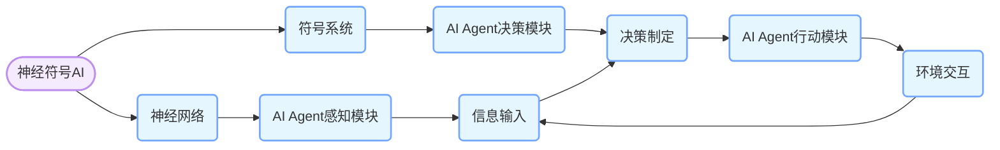

# 基于神经符号AI的AI Agent逻辑推理

> 关键词：神经符号AI、AI Agent、逻辑推理、深度学习、符号处理

> 摘要：本文聚焦于基于神经符号AI的AI Agent逻辑推理这一前沿领域。首先介绍了相关背景知识，包括目的范围、预期读者等内容。接着阐述了神经符号AI和AI Agent的核心概念及其联系，给出了原理和架构的示意图与流程图。详细讲解了核心算法原理，并用Python代码进行示例。通过数学模型和公式进一步剖析逻辑推理过程，并举例说明。结合实际项目，展示了代码实现及解读。探讨了该技术在多个领域的实际应用场景，推荐了学习资源、开发工具框架以及相关论文著作。最后总结了未来发展趋势与挑战，还提供了常见问题解答和扩展阅读参考资料，旨在为读者全面深入地理解基于神经符号AI的AI Agent逻辑推理提供详尽的知识体系。

## 1. 背景介绍 
### 1.1 目的和范围
随着人工智能技术的不断发展，AI Agent在各个领域的应用越来越广泛。然而，传统的AI技术在逻辑推理方面存在一定的局限性。神经符号AI结合了神经网络的强大感知能力和符号系统的逻辑推理能力，为AI Agent的逻辑推理提供了新的思路和方法。本文的目的是深入探讨基于神经符号AI的AI Agent逻辑推理的原理、算法、应用等方面，为相关研究和开发人员提供全面的参考。范围涵盖了神经符号AI和AI Agent的基本概念、核心算法原理、数学模型、项目实战、实际应用场景以及相关的工具和资源推荐等。

### 1.2 预期读者
本文预期读者包括人工智能领域的研究人员、开发者、学生以及对人工智能技术感兴趣的爱好者。对于有一定编程基础和机器学习知识的读者，能够更深入地理解文章中的算法原理和代码实现；而对于初学者，通过本文可以了解神经符号AI和AI Agent逻辑推理的基本概念和应用场景，为进一步学习和研究打下基础。

### 1.3 文档结构概述
本文按照以下结构进行组织：首先介绍背景知识，包括目的范围、预期读者和文档结构概述；接着阐述核心概念与联系，给出相关原理和架构的示意图与流程图；然后详细讲解核心算法原理和具体操作步骤，并用Python代码进行示例；通过数学模型和公式进一步剖析逻辑推理过程，并举例说明；结合实际项目，展示代码实现及解读；探讨该技术在多个领域的实际应用场景；推荐学习资源、开发工具框架以及相关论文著作；最后总结未来发展趋势与挑战，提供常见问题解答和扩展阅读参考资料。

### 1.4 术语表
#### 1.4.1 核心术语定义
- **神经符号AI（Neural-Symbolic AI）**：将神经网络和符号处理相结合的人工智能方法，旨在充分发挥神经网络的感知能力和符号系统的逻辑推理能力。
- **AI Agent（人工智能智能体）**：能够感知环境、做出决策并采取行动以实现特定目标的智能实体。
- **逻辑推理（Logical Reasoning）**：根据已知的事实和规则，通过逻辑运算得出新的结论的过程。

#### 1.4.2 相关概念解释
- **神经网络（Neural Network）**：一种模仿人类神经系统的计算模型，由大量的神经元组成，能够自动从数据中学习特征和模式。
- **符号系统（Symbolic System）**：使用符号和规则来表示知识和进行推理的系统，具有明确的语义和逻辑结构。
- **知识图谱（Knowledge Graph）**：一种以图的形式表示知识的方法，节点表示实体，边表示实体之间的关系，可用于知识表示和推理。

#### 1.4.3 缩略词列表
- **NN**：Neural Network（神经网络）
- **KB**：Knowledge Base（知识库）
- **RL**：Reinforcement Learning（强化学习）

## 2. 核心概念与联系 

### 2.1 神经符号AI的原理
神经符号AI的核心思想是将神经网络和符号处理相结合。神经网络具有强大的感知能力，能够从大量的数据中学习到复杂的模式和特征，例如图像识别、语音识别等任务。而符号系统则具有明确的语义和逻辑结构，能够进行精确的推理和决策。神经符号AI通过将神经网络的输出转换为符号表示，或者将符号信息融入到神经网络的训练中，实现了感知和推理的有机结合。

### 2.2 AI Agent的架构
AI Agent通常由感知模块、决策模块和行动模块组成。感知模块负责收集环境信息，例如传感器数据、文本信息等；决策模块根据感知到的信息和预设的目标，使用逻辑推理和优化算法做出决策；行动模块根据决策结果执行相应的行动，改变环境状态。在基于神经符号AI的AI Agent中，感知模块可以使用神经网络进行信息处理，决策模块则可以结合符号系统进行逻辑推理。

### 2.3 神经符号AI与AI Agent逻辑推理的联系
神经符号AI为AI Agent的逻辑推理提供了更强大的能力。通过将神经网络的感知能力和符号系统的逻辑推理能力相结合，AI Agent能够更好地理解环境信息，进行复杂的逻辑推理和决策。例如，在智能机器人领域，AI Agent可以使用神经网络识别物体和场景，然后使用符号系统进行路径规划和任务调度。

### 2.4 核心概念原理和架构的文本示意图
```plaintext
                +----------------+
                |  神经符号AI   |
                +----------------+
               /                  \
              /                    \
+----------------+            +----------------+
|  神经网络      |            |  符号系统      |
|  感知能力      |            |  逻辑推理能力  |
+----------------+            +----------------+
              |                          |
              |                          |
+----------------+            +----------------+
|  AI Agent感知模块 |            |  AI Agent决策模块 |
+----------------+            +----------------+
              |                          |
              |                          |
              +--------------------------+
                          |
                  +----------------+
                  |  AI Agent行动模块 |
                  +----------------+
```

### 2.5 Mermaid流程图


## 3. 核心算法原理 & 具体操作步骤 

### 3.1 核心算法原理
基于神经符号AI的AI Agent逻辑推理主要涉及到两个方面的算法：神经网络算法和符号推理算法。

#### 3.1.1 神经网络算法
神经网络算法主要用于感知模块，对环境信息进行处理和特征提取。常见的神经网络模型包括卷积神经网络（CNN）、循环神经网络（RNN）、长短时记忆网络（LSTM）等。以CNN为例，其原理是通过卷积层、池化层和全连接层对图像数据进行处理，提取图像的特征。

#### 3.1.2 符号推理算法
符号推理算法主要用于决策模块，根据感知模块输出的信息和预设的知识规则进行逻辑推理。常见的符号推理算法包括基于规则的推理、基于本体的推理、基于知识图谱的推理等。以基于规则的推理为例，其原理是根据预先定义的规则和事实，使用逻辑运算符（如与、或、非）进行推理，得出新的结论。

### 3.2 具体操作步骤
#### 3.2.1 数据预处理
首先，对感知模块收集到的环境信息进行预处理，包括数据清洗、特征提取等操作。例如，对于图像数据，可以进行归一化、裁剪等操作；对于文本数据，可以进行分词、词性标注等操作。

#### 3.2.2 神经网络训练
使用预处理后的数据对神经网络进行训练，调整神经网络的参数，使其能够准确地提取环境信息的特征。训练过程通常使用反向传播算法和优化算法（如随机梯度下降）。

#### 3.2.3 符号表示转换
将神经网络输出的特征向量转换为符号表示，以便进行逻辑推理。例如，可以使用聚类算法将特征向量映射到不同的符号类别。

#### 3.2.4 符号推理
根据符号表示和预设的知识规则，使用符号推理算法进行逻辑推理，得出决策结果。

#### 3.2.5 行动执行
根据决策结果，AI Agent的行动模块执行相应的行动，改变环境状态。

### 3.3 Python源代码示例
```python
import numpy as np
import tensorflow as tf
from sklearn.cluster import KMeans

# 数据预处理
def preprocess_data(data):
    # 这里简单示例，假设数据是图像数据，进行归一化处理
    return data / 255.0

# 神经网络训练
def train_neural_network(data, labels):
    model = tf.keras.Sequential([
        tf.keras.layers.Conv2D(32, (3, 3), activation='relu', input_shape=(28, 28, 1)),
        tf.keras.layers.MaxPooling2D((2, 2)),
        tf.keras.layers.Flatten(),
        tf.keras.layers.Dense(64, activation='relu'),
        tf.keras.layers.Dense(10, activation='softmax')
    ])
    model.compile(optimizer='adam',
                  loss='sparse_categorical_crossentropy',
                  metrics=['accuracy'])
    model.fit(data, labels, epochs=5)
    return model

# 符号表示转换
def convert_to_symbol(features):
    kmeans = KMeans(n_clusters=3)
    kmeans.fit(features)
    symbols = kmeans.labels_
    return symbols

# 符号推理
def symbolic_reasoning(symbols):
    # 简单示例，根据符号进行决策
    if symbols[0] == 0:
        return "行动1"
    elif symbols[0] == 1:
        return "行动2"
    else:
        return "行动3"

# 主函数
def main():
    # 模拟数据
    data = np.random.rand(100, 28, 28, 1)
    labels = np.random.randint(0, 10, 100)
    
    # 数据预处理
    preprocessed_data = preprocess_data(data)
    
    # 神经网络训练
    model = train_neural_network(preprocessed_data, labels)
    
    # 提取特征
    features = model.predict(preprocessed_data)
    
    # 符号表示转换
    symbols = convert_to_symbol(features)
    
    # 符号推理
    decision = symbolic_reasoning(symbols)
    
    print("决策结果:", decision)

if __name__ == "__main__":
    main()
```

## 4. 数学模型和公式 & 详细讲解 & 举例说明 

### 4.1 神经网络的数学模型
#### 4.1.1 神经元模型
神经网络的基本单元是神经元，其数学模型可以表示为：
$$
y = f\left(\sum_{i=1}^{n} w_{i} x_{i} + b\right)
$$
其中，$x_{i}$ 是输入信号，$w_{i}$ 是连接权重，$b$ 是偏置，$f$ 是激活函数，$y$ 是输出信号。

#### 4.1.2 卷积神经网络的卷积操作
卷积神经网络中的卷积操作可以表示为：
$$
y_{j}(i) = \sum_{k=1}^{K} w_{jk}(i) * x_{k}(i) + b_{j}
$$
其中，$x_{k}(i)$ 是输入特征图，$w_{jk}(i)$ 是卷积核，$b_{j}$ 是偏置，$y_{j}(i)$ 是输出特征图。

### 4.2 符号推理的数学模型
#### 4.2.1 基于规则的推理
基于规则的推理可以使用逻辑表达式来表示，例如：
$$
\text{规则：} A \land B \rightarrow C
$$
其中，$A$、$B$ 是前提条件，$C$ 是结论。当 $A$ 和 $B$ 都为真时，结论 $C$ 为真。

### 4.3 详细讲解
#### 4.3.1 神经网络的数学模型讲解
神经元模型中的激活函数 $f$ 起到了非线性变换的作用，使得神经网络能够学习到复杂的模式和特征。常见的激活函数包括 sigmoid 函数、ReLU 函数等。卷积神经网络中的卷积操作通过卷积核在输入特征图上滑动，提取局部特征，从而减少了参数数量，提高了计算效率。

#### 4.3.2 符号推理的数学模型讲解
基于规则的推理是一种确定性的推理方法，其推理过程可以使用逻辑运算符进行精确的描述。通过定义不同的规则和事实，可以实现复杂的逻辑推理。

### 4.4 举例说明
#### 4.4.1 神经网络举例
假设我们有一个简单的神经元，输入信号 $x_1 = 0.5$，$x_2 = 0.3$，连接权重 $w_1 = 0.2$，$w_2 = 0.4$，偏置 $b = 0.1$，激活函数为 sigmoid 函数：
$$
f(x)=\frac{1}{1 + e^{-x}}
$$
则神经元的输出为：
$$
\begin{align*}
y&=f(w_1x_1 + w_2x_2 + b)\\
&=f(0.2\times0.5 + 0.4\times0.3 + 0.1)\\
&=f(0.1 + 0.12 + 0.1)\\
&=f(0.32)\\
&=\frac{1}{1 + e^{-0.32}}\\
&\approx 0.579
\end{align*}
$$

#### 4.4.2 符号推理举例
假设我们有以下规则和事实：
- 规则：$A \land B \rightarrow C$
- 事实：$A = \text{True}$，$B = \text{True}$

根据规则和事实，我们可以得出结论 $C = \text{True}$。

## 5. 项目实战：代码实际案例和详细解释说明 

### 5.1  开发环境搭建
#### 5.1.1 安装Python
首先，需要安装Python环境。建议使用Python 3.7及以上版本，可以从Python官方网站（https://www.python.org/downloads/）下载安装包进行安装。

#### 5.1.2 安装必要的库
使用pip命令安装必要的库，包括TensorFlow、NumPy、Scikit-learn等：
```sh
pip install tensorflow numpy scikit-learn
```

### 5.2  源代码详细实现和代码解读
```python
import numpy as np
import tensorflow as tf
from sklearn.cluster import KMeans

# 数据预处理
def preprocess_data(data):
    # 这里简单示例，假设数据是图像数据，进行归一化处理
    return data / 255.0

# 神经网络训练
def train_neural_network(data, labels):
    # 构建卷积神经网络模型
    model = tf.keras.Sequential([
        tf.keras.layers.Conv2D(32, (3, 3), activation='relu', input_shape=(28, 28, 1)),
        tf.keras.layers.MaxPooling2D((2, 2)),
        tf.keras.layers.Flatten(),
        tf.keras.layers.Dense(64, activation='relu'),
        tf.keras.layers.Dense(10, activation='softmax')
    ])
    # 编译模型
    model.compile(optimizer='adam',
                  loss='sparse_categorical_crossentropy',
                  metrics=['accuracy'])
    # 训练模型
    model.fit(data, labels, epochs=5)
    return model

# 符号表示转换
def convert_to_symbol(features):
    # 使用KMeans聚类算法将特征向量转换为符号表示
    kmeans = KMeans(n_clusters=3)
    kmeans.fit(features)
    symbols = kmeans.labels_
    return symbols

# 符号推理
def symbolic_reasoning(symbols):
    # 简单示例，根据符号进行决策
    if symbols[0] == 0:
        return "行动1"
    elif symbols[0] == 1:
        return "行动2"
    else:
        return "行动3"

# 主函数
def main():
    # 模拟数据
    data = np.random.rand(100, 28, 28, 1)
    labels = np.random.randint(0, 10, 100)
    
    # 数据预处理
    preprocessed_data = preprocess_data(data)
    
    # 神经网络训练
    model = train_neural_network(preprocessed_data, labels)
    
    # 提取特征
    features = model.predict(preprocessed_data)
    
    # 符号表示转换
    symbols = convert_to_symbol(features)
    
    # 符号推理
    decision = symbolic_reasoning(symbols)
    
    print("决策结果:", decision)

if __name__ == "__main__":
    main()
```

### 5.3  代码解读与分析
#### 5.3.1 数据预处理
`preprocess_data` 函数对输入的数据进行归一化处理，将数据的取值范围缩放到 [0, 1] 之间，有助于提高神经网络的训练效果。

#### 5.3.2 神经网络训练
`train_neural_network` 函数构建了一个简单的卷积神经网络模型，包括卷积层、池化层、全连接层等。使用 `compile` 方法编译模型，指定优化器、损失函数和评估指标。使用 `fit` 方法对模型进行训练。

#### 5.3.3 符号表示转换
`convert_to_symbol` 函数使用 KMeans 聚类算法将神经网络输出的特征向量转换为符号表示。通过将特征向量聚类到不同的类别中，每个类别对应一个符号。

#### 5.3.4 符号推理
`symbolic_reasoning` 函数根据符号表示进行简单的决策。根据符号的值，返回不同的行动。

#### 5.3.5 主函数
`main` 函数是程序的入口，依次调用数据预处理、神经网络训练、特征提取、符号表示转换和符号推理等函数，最终输出决策结果。

## 6. 实际应用场景 
### 6.1 智能机器人领域
在智能机器人领域，基于神经符号AI的AI Agent可以使用神经网络识别物体和场景，例如识别障碍物、目标物体等。然后使用符号系统进行路径规划和任务调度，根据环境信息和预设的任务目标，推理出最优的行动方案。例如，在物流仓库中，智能机器人可以使用神经符号AI技术自动识别货物，规划搬运路径，提高物流效率。

### 6.2 医疗诊断领域
在医疗诊断领域，AI Agent可以使用神经网络分析医学图像（如X光、CT等）和病历数据，提取特征和信息。然后使用符号系统结合医学知识和临床经验进行逻辑推理，辅助医生进行疾病诊断和治疗方案制定。例如，通过分析患者的影像数据和症状信息，推理出可能的疾病类型和治疗建议。

### 6.3 金融风险评估领域
在金融风险评估领域，AI Agent可以使用神经网络分析金融市场数据、企业财务数据等，提取关键特征。然后使用符号系统结合金融规则和风险评估模型进行逻辑推理，评估企业的信用风险和市场风险。例如，通过分析企业的财务报表和市场趋势，推理出企业的违约概率和风险等级。

### 6.4 智能交通领域
在智能交通领域，AI Agent可以使用神经网络感知交通环境，例如识别交通标志、车辆和行人等。然后使用符号系统进行交通流量预测和交通控制策略推理，优化交通信号控制，提高交通效率。例如，根据实时交通数据和历史交通模式，推理出最佳的交通信号配时方案。

## 7. 工具和资源推荐
### 7.1 学习资源推荐
#### 7.1.1 书籍推荐
- 《深度学习》（Deep Learning）：由Ian Goodfellow、Yoshua Bengio和Aaron Courville所著，是深度学习领域的经典教材，涵盖了神经网络、卷积神经网络、循环神经网络等内容。
- 《人工智能：一种现代的方法》（Artificial Intelligence: A Modern Approach）：由Stuart Russell和Peter Norvig所著，全面介绍了人工智能的各个方面，包括搜索算法、知识表示、逻辑推理等。
- 《神经符号人工智能：从原理到实践》（Neural-Symbolic Artificial Intelligence: Principles and Practice）：专门介绍神经符号AI的书籍，详细阐述了神经符号AI的原理、算法和应用。

#### 7.1.2 在线课程
- Coursera上的“深度学习专项课程”（Deep Learning Specialization）：由Andrew Ng教授讲授，包括神经网络基础、卷积神经网络、循环神经网络等课程。
- edX上的“人工智能导论”（Introduction to Artificial Intelligence）：由麻省理工学院（MIT）提供，介绍了人工智能的基本概念、算法和应用。
- Udemy上的“神经符号AI实战课程”（Hands-On Neural-Symbolic AI）：专门针对神经符号AI的实战课程，通过实际项目帮助学员掌握神经符号AI的开发技巧。

#### 7.1.3 技术博客和网站
- Towards Data Science：一个专注于数据科学和人工智能的博客平台，有很多关于神经符号AI、深度学习等方面的文章。
- Medium上的AI板块：Medium上有很多人工智能领域的专家和开发者分享他们的经验和见解，包括神经符号AI的最新研究成果。
- arXiv：一个预印本论文库，提供了大量关于人工智能、机器学习等领域的最新研究论文。

### 7.2 开发工具框架推荐
#### 7.2.1 IDE和编辑器
- PyCharm：一款专业的Python集成开发环境（IDE），提供了代码编辑、调试、版本控制等功能，适合Python开发。
- Jupyter Notebook：一个交互式的笔记本环境，支持Python、R等多种编程语言，方便进行数据分析和模型开发。
- Visual Studio Code：一款轻量级的代码编辑器，支持多种编程语言和插件扩展，适合快速开发和调试。

#### 7.2.2 调试和性能分析工具
- TensorBoard：TensorFlow提供的可视化工具，可以帮助开发者监控模型训练过程、可视化模型结构和性能指标。
- Py-Spy：一个Python性能分析工具，可以实时监控Python程序的CPU使用率、函数调用时间等信息，帮助开发者找出性能瓶颈。
- gdb：一个通用的调试器，支持多种编程语言，可用于调试Python程序和C++扩展模块。

#### 7.2.3 相关框架和库
- TensorFlow：一个开源的机器学习框架，提供了丰富的神经网络模型和工具，支持分布式训练和部署。
- PyTorch：另一个流行的深度学习框架，具有动态图机制，易于使用和调试，广泛应用于学术界和工业界。
- scikit-learn：一个简单高效的机器学习库，提供了各种机器学习算法和工具，如分类、回归、聚类等。

### 7.3 相关论文著作推荐
#### 7.3.1 经典论文
- "Neural-Symbolic Learning and Reasoning: Contributions and Challenges"：这篇论文系统地介绍了神经符号AI的发展历程、主要贡献和面临的挑战。
- "DeepProbLog: Neural Probabilistic Logic Programming"：提出了DeepProbLog模型，将深度学习和概率逻辑编程相结合，实现了神经符号AI的一种新方法。
- "Neural-Symbolic AI: The State of the Art and the Road Ahead"：对神经符号AI的现状和未来发展方向进行了全面的综述和展望。

#### 7.3.2 最新研究成果
- 关注顶级学术会议（如NeurIPS、ICML、AAAI等）和期刊（如Journal of Artificial Intelligence Research、Artificial Intelligence等）上发表的关于神经符号AI的最新研究论文，了解该领域的前沿动态。

#### 7.3.3 应用案例分析
- 一些实际应用案例的研究报告和论文，如智能机器人、医疗诊断、金融风险评估等领域的神经符号AI应用案例，通过分析这些案例可以学习到如何将神经符号AI技术应用到实际场景中。

## 8. 总结：未来发展趋势与挑战
### 8.1 未来发展趋势
#### 8.1.1 融合更多的知识表示和推理方法
未来，神经符号AI将融合更多的知识表示和推理方法，如概率逻辑、模糊逻辑等，以处理更复杂的不确定性和模糊性问题。通过将不同的知识表示和推理方法相结合，可以提高AI Agent的逻辑推理能力和决策的准确性。

#### 8.1.2 实现更高效的训练和推理
随着硬件技术的不断发展和算法的优化，神经符号AI将实现更高效的训练和推理。例如，使用并行计算和分布式计算技术加速神经网络的训练过程，使用符号编译和优化技术提高符号推理的效率。

#### 8.1.3 拓展应用领域
基于神经符号AI的AI Agent逻辑推理技术将在更多的领域得到应用，如智能家居、智能教育、智能农业等。通过将该技术应用到不同的领域，可以解决实际问题，提高生产效率和生活质量。

### 8.2 挑战
#### 8.2.1 知识融合的挑战
将神经网络的连续特征和符号系统的离散知识进行有效的融合是一个挑战。如何将神经网络输出的特征向量准确地转换为符号表示，以及如何将符号信息融入到神经网络的训练中，仍然是需要研究的问题。

#### 8.2.2 可解释性的挑战
虽然神经符号AI在一定程度上提高了模型的可解释性，但仍然存在可解释性不足的问题。如何让AI Agent的决策过程更加透明和可解释，以便人类用户能够理解和信任AI的决策结果，是一个亟待解决的问题。

#### 8.2.3 计算资源的挑战
神经符号AI的训练和推理过程通常需要大量的计算资源，尤其是在处理大规模数据和复杂模型时。如何在有限的计算资源下实现高效的训练和推理，是一个需要面对的挑战。

## 9. 附录：常见问题与解答
### 9.1 什么是神经符号AI？
神经符号AI是将神经网络和符号处理相结合的人工智能方法，旨在充分发挥神经网络的感知能力和符号系统的逻辑推理能力。

### 9.2 神经符号AI与传统AI有什么区别？
传统AI主要基于符号系统进行推理和决策，缺乏对复杂数据的感知能力；而神经符号AI结合了神经网络的感知能力和符号系统的逻辑推理能力，能够更好地处理复杂的现实问题。

### 9.3 如何将神经网络和符号系统相结合？
可以通过将神经网络的输出转换为符号表示，或者将符号信息融入到神经网络的训练中，实现神经网络和符号系统的结合。例如，使用聚类算法将神经网络输出的特征向量映射到不同的符号类别，或者在神经网络的损失函数中加入符号约束。

### 9.4 神经符号AI的应用场景有哪些？
神经符号AI的应用场景包括智能机器人、医疗诊断、金融风险评估、智能交通等领域。在这些领域中，神经符号AI可以帮助AI Agent更好地理解环境信息，进行复杂的逻辑推理和决策。

### 9.5 学习神经符号AI需要具备哪些知识？
学习神经符号AI需要具备一定的机器学习、深度学习、逻辑学等方面的知识。熟悉Python编程语言和相关的深度学习框架（如TensorFlow、PyTorch）也是必要的。

## 10. 扩展阅读 & 参考资料
### 10.1 扩展阅读
- 阅读更多关于知识图谱、概率逻辑编程等方面的书籍和论文，深入了解神经符号AI的相关技术。
- 关注人工智能领域的前沿研究动态，参加学术会议和研讨会，与同行交流和学习。

### 10.2 参考资料
- 本文参考了相关的学术论文、书籍、在线课程和技术博客等资料，具体参考文献如下：
  - Goodfellow, I., Bengio, Y., & Courville, A. (2016). Deep Learning. MIT Press.
  - Russell, S. J., & Norvig, P. (2016). Artificial Intelligence: A Modern Approach. Pearson.
  - Hitzler, P., & Seda, A. K. (2018). Neural-Symbolic Artificial Intelligence: Principles and Practice. CRC Press.

作者：AI天才研究院/AI Genius Institute & 禅与计算机程序设计艺术 /Zen And The Art of Computer Programming