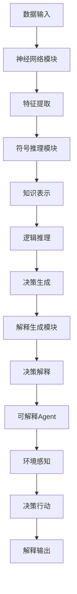

# 基于神经符号AI的可解释Agent设计

> 关键词：神经符号AI、可解释Agent、人工智能、符号推理、神经网络

> 摘要：本文聚焦于基于神经符号AI的可解释Agent设计。首先介绍了相关背景，包括目的范围、预期读者等内容。接着阐述核心概念，分析神经符号AI与可解释Agent之间的联系，并给出原理和架构的示意图与流程图。详细讲解了核心算法原理及具体操作步骤，用Python代码进行说明。深入探讨了数学模型和公式，并举例阐释。通过项目实战展示代码实现与解读。分析了实际应用场景，推荐了学习资源、开发工具框架以及相关论文著作。最后总结未来发展趋势与挑战，解答常见问题并提供扩展阅读和参考资料，旨在为该领域的研究和实践提供全面的指导。

## 1. 背景介绍 
### 1.1 目的和范围
随着人工智能技术的广泛应用，Agent系统在众多领域发挥着重要作用。然而，传统的Agent设计往往缺乏可解释性，这在一些对安全性、可靠性要求较高的场景中成为了阻碍。神经符号AI结合了神经网络的感知能力和符号系统的推理能力，为可解释Agent的设计提供了新的思路。本文的目的在于深入探讨基于神经符号AI的可解释Agent设计方法，涵盖从核心概念、算法原理到实际应用等多个方面，旨在为研究人员和开发者提供全面的技术指导。

### 1.2 预期读者
本文预期读者包括人工智能领域的研究人员、软件开发工程师、对可解释AI感兴趣的学者以及相关专业的学生。无论是希望深入了解神经符号AI和可解释Agent技术的理论基础，还是寻求将其应用于实际项目的实践者，都能从本文中获得有价值的信息。

### 1.3 文档结构概述
本文将按照以下结构展开：首先介绍背景知识，为后续内容奠定基础；接着阐述核心概念，明确神经符号AI和可解释Agent的相关原理和联系；详细讲解核心算法原理和具体操作步骤，并通过Python代码进行说明；深入分析数学模型和公式，结合实际例子帮助理解；通过项目实战展示代码的实际应用和详细解读；探讨该技术的实际应用场景；推荐相关的学习资源、开发工具框架和论文著作；最后总结未来发展趋势与挑战，解答常见问题并提供扩展阅读和参考资料。

### 1.4 术语表
#### 1.4.1 核心术语定义
- **神经符号AI（Neural-Symbolic AI）**：将神经网络的感知能力与符号系统的逻辑推理能力相结合的人工智能范式，旨在充分发挥两者的优势，实现更强大、更可解释的智能系统。
- **可解释Agent（Interpretable Agent）**：一种能够对其决策和行为提供清晰解释的智能Agent，使得用户能够理解其行为背后的原因和逻辑。
- **Agent（智能体）**：在特定环境中能够自主感知、决策和行动的实体，通过与环境的交互来实现特定的目标。

#### 1.4.2 相关概念解释
- **神经网络（Neural Network）**：一种模仿人类神经系统的计算模型，由大量的神经元组成，通过对数据的学习来自动提取特征和模式。
- **符号推理（Symbolic Reasoning）**：基于符号逻辑的推理方法，使用符号和规则来表示知识和进行推理，具有明确的语义和可解释性。
- **知识图谱（Knowledge Graph）**：一种以图的形式表示知识的结构化数据，节点表示实体，边表示实体之间的关系，可用于知识的存储和推理。

#### 1.4.3 缩略词列表
- **AI（Artificial Intelligence）**：人工智能
- **ML（Machine Learning）**：机器学习
- **DL（Deep Learning）**：深度学习
- **NN（Neural Network）**：神经网络

## 2. 核心概念与联系 

### 2.1 神经符号AI的原理
神经符号AI旨在将神经网络的强大感知能力与符号系统的精确推理能力相结合。神经网络可以自动从大量数据中学习到复杂的模式和特征，例如图像识别、语音识别等任务中，神经网络能够取得很好的效果。然而，神经网络的决策过程往往是一个黑盒，难以解释其输出结果的原因。符号系统则基于逻辑规则和知识表示，能够进行精确的推理和决策，并且其推理过程具有明确的语义和可解释性。神经符号AI通过将两者结合，使得系统既能够处理复杂的数据，又能够对决策过程进行解释。

### 2.2 可解释Agent的概念
可解释Agent是一种能够对其决策和行为提供清晰解释的智能Agent。在实际应用中，用户往往需要了解Agent为什么做出某个决策，以便评估其可靠性和安全性。可解释Agent通过使用可解释的模型和方法，将其决策过程以人类可理解的方式呈现出来，例如使用自然语言解释、逻辑规则解释等。

### 2.3 神经符号AI与可解释Agent的联系
神经符号AI为可解释Agent的设计提供了有力的支持。通过将神经网络和符号推理相结合，可解释Agent可以利用神经网络进行数据感知和特征提取，同时使用符号系统进行决策和推理，并对决策过程进行解释。例如，在一个智能医疗诊断Agent中，神经网络可以对患者的病历数据和影像数据进行分析，提取相关特征，然后符号系统根据这些特征和医学知识进行诊断和推理，并给出诊断结果的解释。

### 2.4 核心概念原理和架构的文本示意图
```plaintext
+-------------------+
|  神经符号AI系统   |
+-------------------+
|  神经网络模块     |
|  - 数据感知       |
|  - 特征提取       |
+-------------------+
|  符号推理模块     |
|  - 知识表示       |
|  - 逻辑推理       |
+-------------------+
|  解释生成模块     |
|  - 决策解释       |
|  - 行为解释       |
+-------------------+
|  可解释Agent      |
|  - 环境感知       |
|  - 决策行动       |
|  - 解释输出       |
+-------------------+
```

### 2.5 Mermaid流程图


## 3. 核心算法原理 & 具体操作步骤 

### 3.1 核心算法原理
基于神经符号AI的可解释Agent设计主要涉及两个核心部分：神经网络的特征提取和符号系统的推理。下面我们将详细介绍这两个部分的算法原理，并使用Python代码进行说明。

#### 3.1.1 神经网络特征提取
神经网络通常采用卷积神经网络（CNN）或循环神经网络（RNN）等模型进行特征提取。以CNN为例，其基本原理是通过卷积层、池化层和全连接层对输入数据进行处理，提取出有意义的特征。以下是一个简单的CNN模型的Python代码示例：

```python
import torch
import torch.nn as nn

class SimpleCNN(nn.Module):
    def __init__(self):
        super(SimpleCNN, self).__init__()
        self.conv1 = nn.Conv2d(3, 16, kernel_size=3, padding=1)
        self.relu1 = nn.ReLU()
        self.pool1 = nn.MaxPool2d(2)
        self.conv2 = nn.Conv2d(16, 32, kernel_size=3, padding=1)
        self.relu2 = nn.ReLU()
        self.pool2 = nn.MaxPool2d(2)
        self.fc1 = nn.Linear(32 * 8 * 8, 128)
        self.relu3 = nn.ReLU()
        self.fc2 = nn.Linear(128, 10)

    def forward(self, x):
        x = self.pool1(self.relu1(self.conv1(x)))
        x = self.pool2(self.relu2(self.conv2(x)))
        x = x.view(-1, 32 * 8 * 8)
        x = self.relu3(self.fc1(x))
        x = self.fc2(x)
        return x

# 初始化模型
model = SimpleCNN()
# 输入数据
input_data = torch.randn(1, 3, 32, 32)
# 前向传播
output = model(input_data)
print(output)
```

#### 3.1.2 符号系统推理
符号系统推理通常基于规则引擎或知识图谱进行。以规则引擎为例，其基本原理是根据预先定义的规则对输入的事实进行匹配和推理。以下是一个简单的规则引擎的Python代码示例：

```python
class RuleEngine:
    def __init__(self):
        self.rules = []

    def add_rule(self, rule):
        self.rules.append(rule)

    def evaluate(self, facts):
        results = []
        for rule in self.rules:
            if rule.evaluate(facts):
                results.append(rule.conclusion)
        return results

class Rule:
    def __init__(self, conditions, conclusion):
        self.conditions = conditions
        self.conclusion = conclusion

    def evaluate(self, facts):
        for condition in self.conditions:
            if condition not in facts:
                return False
        return True

# 创建规则引擎
engine = RuleEngine()
# 定义规则
rule1 = Rule(["A", "B"], "C")
rule2 = Rule(["C", "D"], "E")
# 添加规则到引擎
engine.add_rule(rule1)
engine.add_rule(rule2)
# 输入事实
facts = ["A", "B", "D"]
# 进行推理
results = engine.evaluate(facts)
print(results)
```

### 3.2 具体操作步骤
#### 3.2.1 数据预处理
在使用神经网络进行特征提取之前，需要对输入数据进行预处理。常见的预处理操作包括数据归一化、数据增强等。例如，对于图像数据，可以使用`torchvision.transforms`进行预处理：

```python
import torchvision.transforms as transforms

transform = transforms.Compose([
    transforms.Resize((32, 32)),
    transforms.ToTensor(),
    transforms.Normalize((0.5, 0.5, 0.5), (0.5, 0.5, 0.5))
])
```

#### 3.2.2 模型训练
使用预处理后的数据对神经网络模型进行训练。训练过程通常包括定义损失函数、选择优化器和进行多次迭代训练。以下是一个简单的训练代码示例：

```python
import torch.optim as optim

# 定义损失函数和优化器
criterion = nn.CrossEntropyLoss()
optimizer = optim.SGD(model.parameters(), lr=0.001, momentum=0.9)

# 模拟训练数据
train_data = torch.randn(10, 3, 32, 32)
train_labels = torch.randint(0, 10, (10,))

# 训练模型
for epoch in range(5):
    running_loss = 0.0
    optimizer.zero_grad()
    outputs = model(train_data)
    loss = criterion(outputs, train_labels)
    loss.backward()
    optimizer.step()
    running_loss += loss.item()
    print(f'Epoch {epoch + 1}, Loss: {running_loss / 10}')
```

#### 3.2.3 符号系统规则定义
根据具体的应用场景，定义符号系统的规则。规则可以根据领域知识和专家经验进行设计。例如，在一个智能推荐系统中，可以定义规则“如果用户喜欢电影A，且电影B与电影A属于同一类型，则推荐电影B”。

#### 3.2.4 决策和解释生成
将神经网络提取的特征输入到符号系统中进行推理，得到决策结果。同时，根据推理过程生成相应的解释。例如，在一个医疗诊断系统中，如果根据患者的症状和检查结果推理出患有某种疾病，可以解释为“根据患者的症状X和检查结果Y，符合疾病Z的诊断标准，因此诊断为疾病Z”。

## 4. 数学模型和公式 & 详细讲解 & 举例说明 

### 4.1 神经网络的数学模型
#### 4.1.1 卷积层
卷积层是CNN的核心组成部分，其数学模型可以表示为：

$$y_{i,j}^l = \sum_{m=0}^{M-1}\sum_{n=0}^{N-1}x_{i+m,j+n}^{l-1} \cdot w_{m,n}^l + b^l$$

其中，$y_{i,j}^l$ 表示第 $l$ 层卷积层在位置 $(i,j)$ 的输出，$x_{i+m,j+n}^{l-1}$ 表示第 $l-1$ 层在位置 $(i+m,j+n)$ 的输入，$w_{m,n}^l$ 表示第 $l$ 层的卷积核在位置 $(m,n)$ 的权重，$b^l$ 表示第 $l$ 层的偏置，$M$ 和 $N$ 分别表示卷积核的高度和宽度。

#### 4.1.2 激活函数
激活函数用于引入非线性因素，常见的激活函数有ReLU（Rectified Linear Unit），其数学表达式为：

$$f(x) = \max(0, x)$$

#### 4.1.3 全连接层
全连接层的数学模型可以表示为：

$$y_j^l = \sum_{i=0}^{N-1}x_i^{l-1} \cdot w_{i,j}^l + b_j^l$$

其中，$y_j^l$ 表示第 $l$ 层全连接层的第 $j$ 个输出，$x_i^{l-1}$ 表示第 $l-1$ 层的第 $i$ 个输入，$w_{i,j}^l$ 表示第 $l$ 层的权重，$b_j^l$ 表示第 $l$ 层的偏置，$N$ 表示第 $l-1$ 层的神经元数量。

### 4.2 符号系统的数学模型
#### 4.2.1 规则表示
符号系统的规则可以用逻辑表达式表示，例如：

$$(A \land B) \rightarrow C$$

其中，$A$、$B$ 和 $C$ 是命题，$\land$ 表示逻辑与，$\rightarrow$ 表示逻辑蕴含。

#### 4.2.2 推理规则
符号系统的推理规则通常基于逻辑推理规则，例如假言推理规则：

$$\frac{A, A \rightarrow B}{B}$$

### 4.3 举例说明
#### 4.3.1 神经网络举例
假设我们有一个简单的一维卷积层，输入数据 $x = [1, 2, 3, 4]$，卷积核 $w = [1, 1]$，偏置 $b = 0$。根据卷积层的数学模型，我们可以计算输出：

$$y_0 = x_0 \cdot w_0 + x_1 \cdot w_1 + b = 1 \cdot 1 + 2 \cdot 1 + 0 = 3$$
$$y_1 = x_1 \cdot w_0 + x_2 \cdot w_1 + b = 2 \cdot 1 + 3 \cdot 1 + 0 = 5$$
$$y_2 = x_2 \cdot w_0 + x_3 \cdot w_1 + b = 3 \cdot 1 + 4 \cdot 1 + 0 = 7$$

因此，输出 $y = [3, 5, 7]$。

#### 4.3.2 符号系统举例
假设我们有规则 $(A \land B) \rightarrow C$，并且已知事实 $A$ 和 $B$ 为真。根据假言推理规则，我们可以得出结论 $C$ 为真。

## 5. 项目实战：代码实际案例和详细解释说明 

### 5.1  开发环境搭建
#### 5.1.1 安装Python
首先，确保你已经安装了Python 3.x版本。可以从Python官方网站（https://www.python.org/downloads/）下载并安装。

#### 5.1.2 安装必要的库
使用`pip`安装以下必要的库：
```sh
pip install torch torchvision numpy pandas
```

### 5.2  源代码详细实现和代码解读
#### 5.2.1 项目概述
我们将实现一个基于神经符号AI的简单图像分类可解释Agent。该Agent使用CNN进行图像特征提取，然后使用规则引擎进行分类决策，并给出决策解释。

#### 5.2.2 代码实现

```python
import torch
import torch.nn as nn
import torch.optim as optim
import torchvision.transforms as transforms
from torchvision.datasets import CIFAR10
from torch.utils.data import DataLoader

# 定义CNN模型
class SimpleCNN(nn.Module):
    def __init__(self):
        super(SimpleCNN, self).__init__()
        self.conv1 = nn.Conv2d(3, 16, kernel_size=3, padding=1)
        self.relu1 = nn.ReLU()
        self.pool1 = nn.MaxPool2d(2)
        self.conv2 = nn.Conv2d(16, 32, kernel_size=3, padding=1)
        self.relu2 = nn.ReLU()
        self.pool2 = nn.MaxPool2d(2)
        self.fc1 = nn.Linear(32 * 8 * 8, 128)
        self.relu3 = nn.ReLU()
        self.fc2 = nn.Linear(128, 10)

    def forward(self, x):
        x = self.pool1(self.relu1(self.conv1(x)))
        x = self.pool2(self.relu2(self.conv2(x)))
        x = x.view(-1, 32 * 8 * 8)
        x = self.relu3(self.fc1(x))
        x = self.fc2(x)
        return x

# 数据预处理
transform = transforms.Compose([
    transforms.Resize((32, 32)),
    transforms.ToTensor(),
    transforms.Normalize((0.5, 0.5, 0.5), (0.5, 0.5, 0.5))
])

# 加载数据集
train_dataset = CIFAR10(root='./data', train=True, transform=transform, download=True)
train_loader = DataLoader(train_dataset, batch_size=32, shuffle=True)

# 初始化模型
model = SimpleCNN()

# 定义损失函数和优化器
criterion = nn.CrossEntropyLoss()
optimizer = optim.SGD(model.parameters(), lr=0.001, momentum=0.9)

# 训练模型
for epoch in range(5):
    running_loss = 0.0
    for i, data in enumerate(train_loader, 0):
        inputs, labels = data
        optimizer.zero_grad()
        outputs = model(inputs)
        loss = criterion(outputs, labels)
        loss.backward()
        optimizer.step()
        running_loss += loss.item()
    print(f'Epoch {epoch + 1}, Loss: {running_loss / len(train_loader)}')

# 规则引擎类
class RuleEngine:
    def __init__(self):
        self.rules = []

    def add_rule(self, rule):
        self.rules.append(rule)

    def evaluate(self, facts):
        results = []
        for rule in self.rules:
            if rule.evaluate(facts):
                results.append(rule.conclusion)
        return results

# 规则类
class Rule:
    def __init__(self, conditions, conclusion):
        self.conditions = conditions
        self.conclusion = conclusion

    def evaluate(self, facts):
        for condition in self.conditions:
            if condition not in facts:
                return False
        return True

# 创建规则引擎
engine = RuleEngine()
# 定义规则（简单示例）
rule1 = Rule(["feature1"], "class1")
rule2 = Rule(["feature2"], "class2")
engine.add_rule(rule1)
engine.add_rule(rule2)

# 模拟测试数据
test_image = torch.randn(1, 3, 32, 32)
# 提取特征
features = model(test_image)
# 假设根据特征得到事实
facts = ["feature1"]
# 进行推理
results = engine.evaluate(facts)
print("分类结果:", results)
print("解释: 根据特征 'feature1'，符合规则 'feature1 -> class1'，因此分类为 'class1'")
```

### 5.3  代码解读与分析
#### 5.3.1 CNN模型部分
- `SimpleCNN`类定义了一个简单的CNN模型，包含两个卷积层、两个池化层和两个全连接层。
- `forward`方法实现了模型的前向传播过程。

#### 5.3.2 数据预处理和训练部分
- 使用`transforms.Compose`定义了数据预处理操作，包括图像缩放、转换为张量和归一化。
- 加载CIFAR-10数据集，并使用`DataLoader`进行批量加载。
- 定义损失函数和优化器，进行5个epoch的训练。

#### 5.3.3 规则引擎部分
- `RuleEngine`类实现了规则引擎的基本功能，包括添加规则和进行推理。
- `Rule`类表示一个规则，包含条件和结论。

#### 5.3.4 测试和解释部分
- 模拟测试图像，使用训练好的模型提取特征。
- 假设根据特征得到事实，使用规则引擎进行推理，得到分类结果。
- 输出分类结果和相应的解释。

## 6. 实际应用场景 
### 6.1 医疗诊断
在医疗诊断领域，基于神经符号AI的可解释Agent可以帮助医生更准确地进行疾病诊断。神经网络可以对患者的病历数据、影像数据等进行分析，提取相关特征，符号系统则可以根据医学知识和临床经验进行推理，给出诊断结果和解释。例如，在诊断癌症时，神经网络可以对患者的病理切片图像进行分析，提取肿瘤的特征，符号系统则可以根据这些特征和癌症的诊断标准进行推理，判断患者是否患有癌症，并解释诊断的依据。

### 6.2 金融风险评估
在金融领域，可解释Agent可以用于风险评估和投资决策。神经网络可以对市场数据、企业财务数据等进行分析，提取风险特征，符号系统则可以根据金融规则和专家经验进行推理，评估风险等级并给出决策建议。例如，在评估企业的信用风险时，神经网络可以对企业的财务报表、市场表现等数据进行分析，提取相关特征，符号系统则可以根据信用评估模型和行业规则进行推理，判断企业的信用风险等级，并解释评估的理由。

### 6.3 智能交通
在智能交通领域，可解释Agent可以用于交通流量预测和交通控制。神经网络可以对交通传感器数据、地图数据等进行分析，提取交通流量特征，符号系统则可以根据交通规则和交通管理策略进行推理，预测交通流量并给出控制建议。例如，在城市交通管理中，神经网络可以对道路上的车辆传感器数据进行分析，提取交通流量的变化趋势，符号系统则可以根据交通规则和拥堵缓解策略进行推理，预测未来的交通流量情况，并给出交通信号控制的建议，同时解释决策的原因。

### 6.4 工业制造
在工业制造领域，可解释Agent可以用于质量控制和故障诊断。神经网络可以对生产过程中的传感器数据、图像数据等进行分析，提取产品质量特征，符号系统则可以根据生产标准和故障诊断规则进行推理，判断产品质量是否合格，并诊断设备是否存在故障。例如，在汽车制造过程中，神经网络可以对汽车零部件的图像数据进行分析，提取零部件的尺寸、外观等特征，符号系统则可以根据汽车制造标准和质量控制规则进行推理，判断零部件是否合格，并解释判断的依据。如果设备出现故障，可解释Agent可以根据传感器数据和故障诊断规则进行推理，找出故障原因并给出维修建议。

## 7. 工具和资源推荐
### 7.1 学习资源推荐
#### 7.1.1 书籍推荐
- 《人工智能：一种现代的方法》（Artificial Intelligence: A Modern Approach）：这是一本经典的人工智能教材，全面介绍了人工智能的各个领域，包括神经符号AI、Agent技术等，适合初学者和有一定基础的读者。
- 《深度学习》（Deep Learning）：由Ian Goodfellow、Yoshua Bengio和Aaron Courville所著，深入介绍了深度学习的原理和方法，对于理解神经网络在神经符号AI中的应用非常有帮助。
- 《知识图谱：方法、实践与应用》：详细介绍了知识图谱的构建、表示和推理方法，对于学习符号系统在神经符号AI中的应用有很大的帮助。

#### 7.1.2 在线课程
- Coursera上的“人工智能基础”（Foundations of Artificial Intelligence）课程：由知名教授授课，系统地介绍了人工智能的基本概念和方法，包括神经符号AI和可解释Agent的相关内容。
- edX上的“深度学习基础”（Deep Learning Fundamentals）课程：专注于深度学习的基础知识和实践，对于掌握神经网络的原理和应用非常有帮助。
- Udemy上的“知识图谱与语义网”（Knowledge Graphs and Semantic Web）课程：详细介绍了知识图谱的构建和应用，对于理解符号系统在神经符号AI中的作用有很大的帮助。

#### 7.1.3 技术博客和网站
- Medium上的人工智能相关博客：有很多人工智能领域的专家和从业者分享他们的研究成果和实践经验，包括神经符号AI和可解释Agent的最新进展。
- arXiv.org：一个开放的预印本平台，提供了大量的人工智能研究论文，包括神经符号AI和可解释Agent的最新研究成果。
- AI开源社区：如GitHub上的人工智能项目，有很多开源的神经符号AI和可解释Agent的实现代码，可以供学习者参考和学习。

### 7.2 开发工具框架推荐
#### 7.2.1 IDE和编辑器
- PyCharm：一款专门为Python开发设计的集成开发环境，提供了丰富的代码编辑、调试和分析功能，适合开发基于Python的神经符号AI和可解释Agent项目。
- Jupyter Notebook：一个交互式的开发环境，可以方便地进行代码编写、实验和文档记录，非常适合进行机器学习和深度学习的实验和研究。
- Visual Studio Code：一款轻量级的代码编辑器，支持多种编程语言和插件扩展，对于开发神经符号AI和可解释Agent项目也非常方便。

#### 7.2.2 调试和性能分析工具
- TensorBoard：一个用于可视化深度学习模型训练过程和结果的工具，可以帮助开发者监控模型的训练进度、损失函数变化等信息，便于调试和优化模型。
- PyTorch Profiler：PyTorch提供的性能分析工具，可以帮助开发者分析模型的性能瓶颈，找出耗时较长的操作，从而进行优化。
- NVIDIA Nsight Systems：一款用于GPU性能分析的工具，可以帮助开发者分析GPU的使用情况，优化GPU代码，提高模型的训练和推理速度。

#### 7.2.3 相关框架和库
- PyTorch：一个开源的深度学习框架，提供了丰富的神经网络模型和工具，方便开发者进行模型的构建、训练和推理。
- TensorFlow：另一个流行的深度学习框架，具有强大的分布式训练和部署能力，广泛应用于工业界和学术界。
- rdflib：一个用于处理RDF（资源描述框架）数据的Python库，对于构建和处理知识图谱非常有用。
- pyknow：一个基于Python的规则引擎库，提供了简单易用的规则定义和推理功能，适合实现符号系统的推理部分。

### 7.3 相关论文著作推荐
#### 7.3.1 经典论文
- "Neural-Symbolic Learning and Reasoning: Contributions and Challenges"：该论文全面介绍了神经符号AI的发展历程、主要方法和面临的挑战，是神经符号AI领域的经典论文之一。
- "Explainable Artificial Intelligence: A Review of the State of the Art"：对可解释人工智能的研究现状进行了全面的综述，介绍了各种可解释性方法和技术。
- "Towards Explainable Reinforcement Learning"：探讨了强化学习中的可解释性问题，提出了一些解决方法和思路。

#### 7.3.2 最新研究成果
- 关注arXiv.org上关于神经符号AI和可解释Agent的最新预印本论文，了解该领域的最新研究动态和技术进展。
- 参加人工智能领域的顶级会议，如NeurIPS、ICML、AAAI等，获取最新的研究成果和学术报告。

#### 7.3.3 应用案例分析
- 阅读相关的学术期刊和会议论文，了解神经符号AI和可解释Agent在不同领域的应用案例，学习其实现方法和经验教训。
- 关注工业界的技术博客和案例分享，了解实际应用中的挑战和解决方案。

## 8. 总结：未来发展趋势与挑战
### 8.1 未来发展趋势
#### 8.1.1 融合更多的模态信息
未来的基于神经符号AI的可解释Agent将不仅仅局限于处理图像、文本等单一模态的数据，而是会融合更多的模态信息，如语音、视频、传感器数据等。通过多模态信息的融合，Agent可以更全面地感知环境，做出更准确的决策，并提供更丰富的解释。

#### 8.1.2 与人类更紧密的协作
可解释Agent将与人类进行更紧密的协作，成为人类的智能助手。Agent可以根据人类的需求和偏好提供个性化的服务和建议，并通过可解释性让人类更好地理解其决策过程，增强人类对Agent的信任。例如，在医疗领域，可解释Agent可以辅助医生进行诊断和治疗方案的制定，与医生进行有效的沟通和协作。

#### 8.1.3 应用于更多的领域
随着技术的不断发展，基于神经符号AI的可解释Agent将应用于更多的领域，如教育、农业、能源等。在教育领域，可解释Agent可以根据学生的学习情况提供个性化的学习建议和辅导；在农业领域，可解释Agent可以根据土壤、气候等信息提供农作物种植和病虫害防治的建议。

### 8.2 挑战
#### 8.2.1 理论基础的完善
目前，神经符号AI的理论基础还不够完善，缺乏统一的数学模型和理论框架。需要进一步深入研究神经网络和符号系统的融合机制，建立更加完善的理论体系，为可解释Agent的设计提供坚实的理论支持。

#### 8.2.2 计算资源的需求
神经符号AI通常需要大量的计算资源来进行模型训练和推理，尤其是在处理大规模数据和复杂任务时。如何有效地利用计算资源，提高模型的训练和推理效率，是一个亟待解决的问题。

#### 8.2.3 知识表示和获取的难题
符号系统的推理依赖于准确的知识表示和获取。然而，知识的表示和获取是一个复杂的问题，需要解决知识的不确定性、不一致性和不完备性等问题。如何有效地表示和获取知识，是神经符号AI和可解释Agent发展的关键挑战之一。

#### 8.2.4 可解释性的评估标准
目前，对于可解释Agent的可解释性评估还缺乏统一的标准和方法。如何准确地评估Agent的可解释性，判断其解释的质量和可信度，是一个需要深入研究的问题。

## 9. 附录：常见问题与解答
### 9.1 什么是神经符号AI？
神经符号AI是将神经网络的感知能力与符号系统的逻辑推理能力相结合的人工智能范式。神经网络可以自动从大量数据中学习到复杂的模式和特征，而符号系统则基于逻辑规则和知识表示，能够进行精确的推理和决策，并且其推理过程具有明确的语义和可解释性。通过将两者结合，神经符号AI可以实现更强大、更可解释的智能系统。

### 9.2 为什么需要可解释Agent？
在许多实际应用场景中，用户需要了解Agent为什么做出某个决策，以便评估其可靠性和安全性。例如，在医疗诊断、金融风险评估等领域，可解释Agent可以为医生和金融从业者提供决策依据，增强他们对Agent的信任。此外，可解释Agent还有助于发现模型中的潜在问题和偏差，提高模型的可维护性和可扩展性。

### 9.3 神经符号AI和传统AI有什么区别？
传统AI主要分为基于规则的专家系统和基于统计的机器学习方法。基于规则的专家系统具有明确的推理过程和可解释性，但知识获取和规则维护比较困难；基于统计的机器学习方法，如神经网络，具有强大的学习能力，但决策过程往往是一个黑盒，难以解释。神经符号AI结合了两者的优势，既能够处理复杂的数据，又能够对决策过程进行解释。

### 9.4 如何评估可解释Agent的可解释性？
目前，可解释性的评估还没有统一的标准和方法。常见的评估指标包括解释的清晰度、准确性、完整性、一致性等。此外，还可以通过用户调查、实验对比等方法来评估用户对解释的满意度和理解程度。

### 9.5 基于神经符号AI的可解释Agent的开发难度大吗？
基于神经符号AI的可解释Agent的开发具有一定的难度。一方面，需要掌握神经网络和符号系统的相关知识和技术，包括模型的构建、训练和推理；另一方面，需要解决知识表示、知识获取、融合机制等问题。此外，还需要进行大量的实验和调优，以提高模型的性能和可解释性。但是，随着相关技术的不断发展和工具的不断完善，开发难度也在逐渐降低。

## 10. 扩展阅读 & 参考资料
### 10.1 扩展阅读
- 《人工智能哲学》：探讨了人工智能的哲学基础和伦理问题，对于深入理解人工智能的本质和发展方向有很大的帮助。
- 《智能时代》：介绍了人工智能在各个领域的应用和影响，以及对社会和人类的挑战和机遇。
- 《未来简史：从智人到神人》：从宏观的角度探讨了人类的未来发展，其中涉及到人工智能对人类社会的深刻影响。

### 10.2 参考资料
- McCarthy, J. (2007). What Is Artificial Intelligence?. Stanford Artificial Intelligence Laboratory.
- Mitchell, T. M. (1997). Machine Learning. McGraw-Hill.
- Goodfellow, I. J., Bengio, Y., & Courville, A. (2016). Deep Learning. MIT Press.

作者：AI天才研究院/AI Genius Institute & 禅与计算机程序设计艺术 /Zen And The Art of Computer Programming