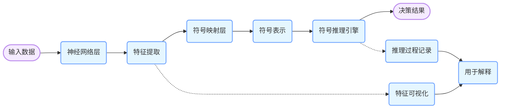

# 基于神经符号推理的可解释AI系统在关键决策领域的性能优化

> 关键词：神经符号推理、可解释AI、关键决策领域、性能优化、符号逻辑

> 摘要：本文聚焦于基于神经符号推理的可解释AI系统在关键决策领域的性能优化问题。首先介绍了相关背景，包括研究目的、预期读者等内容。详细阐述了神经符号推理与可解释AI的核心概念及联系，给出了原理和架构的示意图与流程图。深入分析了核心算法原理，并用Python代码进行详细说明，同时介绍了相关数学模型和公式。通过项目实战展示了代码实现和解读，探讨了实际应用场景。推荐了一系列学习资源、开发工具框架以及相关论文著作。最后总结了未来发展趋势与挑战，提供了常见问题解答和扩展阅读参考资料，旨在为相关领域的研究者和开发者提供全面且深入的技术指导。

## 1. 背景介绍 
### 1.1 目的和范围
在当今复杂的社会环境中，关键决策领域如医疗诊断、金融投资、自动驾驶等对AI系统的需求日益增长。然而，传统的深度学习模型往往缺乏可解释性，这在关键决策场景中可能导致严重的问题。基于神经符号推理的可解释AI系统旨在结合神经网络强大的感知能力和符号推理的逻辑表达能力，为决策提供可解释的依据。本文的目的是深入探讨如何优化这类系统在关键决策领域的性能，范围涵盖核心概念、算法原理、数学模型、实际案例以及未来发展趋势等方面。

### 1.2 预期读者
本文预期读者包括AI领域的研究者、开发者、相关专业的学生以及对可解释AI在关键决策领域应用感兴趣的人士。对于研究者，本文可提供前沿的研究思路和方向；对于开发者，能为其在系统开发和优化过程中提供技术支持；对于学生，有助于加深对相关领域知识的理解；对于其他感兴趣的人士，可作为了解该领域的入门资料。

### 1.3 文档结构概述
本文首先介绍背景信息，让读者了解研究的目的和意义。接着阐述核心概念与联系，帮助读者建立起对神经符号推理和可解释AI的基本认识。然后详细讲解核心算法原理和具体操作步骤，通过Python代码进行说明。之后介绍相关的数学模型和公式，并举例说明。通过项目实战展示代码的实际应用和解读。探讨实际应用场景，让读者了解该技术的实际用途。推荐学习资源、开发工具框架和相关论文著作，为读者提供进一步学习和研究的途径。最后总结未来发展趋势与挑战，解答常见问题，并提供扩展阅读参考资料。

### 1.4 术语表
#### 1.4.1 核心术语定义
- **神经符号推理**：将神经网络和符号推理相结合的一种技术，利用神经网络进行感知和特征提取，符号推理进行逻辑推理和知识表示。
- **可解释AI**：指能够以人类可理解的方式解释其决策过程和结果的AI系统。
- **关键决策领域**：涉及到重大利益、安全等方面的决策场景，如医疗、金融、交通等。

#### 1.4.2 相关概念解释
- **神经网络**：一种模仿人类神经系统的计算模型，由大量的神经元组成，能够自动学习数据中的模式和特征。
- **符号推理**：基于符号逻辑进行推理和演绎的方法，通过定义符号和规则来处理知识和信息。

#### 1.4.3 缩略词列表
- **AI**：Artificial Intelligence，人工智能
- **ML**：Machine Learning，机器学习
- **DL**：Deep Learning，深度学习

## 2. 核心概念与联系 

### 核心概念原理
神经符号推理的核心思想是将神经网络和符号推理有机结合。神经网络具有强大的感知能力，能够处理复杂的输入数据，如图像、文本等。它通过大量的神经元和多层的结构，自动学习数据中的特征和模式。例如，在图像识别任务中，卷积神经网络（CNN）可以自动提取图像的特征，判断图像中物体的类别。

符号推理则基于符号逻辑，能够进行精确的推理和知识表示。它通过定义符号和规则，对知识进行编码和处理。例如，在逻辑推理中，可以使用谓词逻辑来表示事实和规则，通过推理引擎进行推理。

可解释AI的目标是让AI系统的决策过程和结果能够被人类理解。神经符号推理为可解释AI提供了一种有效的方法。通过符号推理，可以将神经网络的输出转化为人类可理解的符号表示，从而解释AI系统的决策依据。

### 架构的文本示意图
```plaintext
输入数据 -> 神经网络层 -> 特征提取 -> 符号映射层 -> 符号表示 -> 符号推理引擎 -> 决策结果
                             |                                 |
                             |                                 |
                             +-- 特征可视化（用于解释） -------+-- 推理过程记录（用于解释）
```

### Mermaid 流程图


## 3. 核心算法原理 & 具体操作步骤 

### 核心算法原理
神经符号推理的核心算法主要包括以下几个步骤：
1. **特征提取**：使用神经网络对输入数据进行特征提取。例如，对于图像数据，可以使用卷积神经网络（CNN）提取图像的特征；对于文本数据，可以使用循环神经网络（RNN）或Transformer模型提取文本的特征。
2. **符号映射**：将提取的特征映射到符号空间。这可以通过定义映射函数或使用训练好的模型来实现。例如，可以将特征向量映射到一组预定义的符号集合中。
3. **符号推理**：使用符号推理引擎对符号表示进行推理。符号推理引擎可以基于逻辑规则、知识图谱等进行推理。例如，可以使用一阶谓词逻辑进行推理，得出决策结果。

### 具体操作步骤
以下是一个简单的基于Python的神经符号推理示例，假设我们要实现一个简单的图像分类任务，并对分类结果进行解释。

```python
import torch
import torch.nn as nn
import torch.optim as optim

# 定义一个简单的卷积神经网络
class SimpleCNN(nn.Module):
    def __init__(self):
        super(SimpleCNN, self).__init__()
        self.conv1 = nn.Conv2d(3, 16, kernel_size=3, padding=1)
        self.relu1 = nn.ReLU()
        self.pool1 = nn.MaxPool2d(2)
        self.fc1 = nn.Linear(16 * 16 * 16, 10)

    def forward(self, x):
        x = self.conv1(x)
        x = self.relu1(x)
        x = self.pool1(x)
        x = x.view(-1, 16 * 16 * 16)
        x = self.fc1(x)
        return x

# 定义符号映射函数
def feature_to_symbol(feature):
    # 简单示例：根据特征的最大值进行符号映射
    max_index = torch.argmax(feature)
    symbols = ['A', 'B', 'C', 'D', 'E', 'F', 'G', 'H', 'I', 'J']
    return symbols[max_index]

# 定义符号推理引擎
def symbol_reasoning(symbol):
    # 简单示例：根据符号进行推理
    if symbol == 'A':
        return '类别1'
    elif symbol == 'B':
        return '类别2'
    else:
        return '其他类别'

# 训练神经网络
model = SimpleCNN()
criterion = nn.CrossEntropyLoss()
optimizer = optim.SGD(model.parameters(), lr=0.001, momentum=0.9)

# 模拟输入数据
input_data = torch.randn(1, 3, 32, 32)

# 前向传播
output = model(input_data)

# 特征提取
features = output

# 符号映射
symbol = feature_to_symbol(features)

# 符号推理
result = symbol_reasoning(symbol)

print(f"决策结果: {result}")
```

### 代码解释
1. **定义神经网络**：`SimpleCNN` 类定义了一个简单的卷积神经网络，用于图像特征提取。
2. **符号映射函数**：`feature_to_symbol` 函数将神经网络的输出特征映射到符号空间。
3. **符号推理引擎**：`symbol_reasoning` 函数根据符号进行推理，得出决策结果。
4. **训练和推理过程**：模拟输入数据，通过神经网络进行前向传播，提取特征，进行符号映射和推理，最终得到决策结果。

## 4. 数学模型和公式 & 详细讲解 & 举例说明 

### 特征提取的数学模型
在神经网络中，特征提取通常通过卷积操作来实现。对于二维卷积，输入图像 $X$ 经过卷积核 $W$ 的卷积操作得到特征图 $Y$，其数学公式为：

$$Y_{i,j}=\sum_{m=0}^{M - 1}\sum_{n=0}^{N - 1}X_{i + m,j + n}W_{m,n}+b$$

其中，$Y_{i,j}$ 是特征图中第 $(i,j)$ 位置的元素，$X_{i + m,j + n}$ 是输入图像中对应位置的元素，$W_{m,n}$ 是卷积核中第 $(m,n)$ 位置的元素，$b$ 是偏置项，$M$ 和 $N$ 是卷积核的大小。

### 符号映射的数学模型
符号映射可以看作是一个从特征空间到符号空间的映射函数 $f$。假设特征向量为 $\mathbf{x}\in\mathbb{R}^d$，符号集合为 $\mathcal{S}=\{s_1,s_2,\cdots,s_k\}$，则符号映射函数可以表示为：

$$s = f(\mathbf{x})$$

例如，在前面的代码示例中，符号映射函数根据特征向量的最大值进行映射，即：

$$s=\arg\max_{i = 1}^{d}x_i$$

### 符号推理的数学模型
符号推理通常基于逻辑规则进行。例如，在一阶谓词逻辑中，假设我们有一个规则：$\forall x(P(x)\rightarrow Q(x))$，表示如果 $x$ 满足条件 $P$，则 $x$ 满足条件 $Q$。如果我们已知 $P(a)$ 为真，通过推理规则可以得出 $Q(a)$ 为真。

### 举例说明
假设我们有一个简单的图像分类任务，输入图像是一个 $32\times32$ 的彩色图像，经过卷积神经网络提取特征后得到一个长度为 10 的特征向量 $\mathbf{x}=[0.1, 0.2, 0.3, 0.05, 0.08, 0.12, 0.03, 0.07, 0.04, 0.01]$。

- **特征提取**：通过卷积操作将输入图像转换为特征向量 $\mathbf{x}$。
- **符号映射**：根据符号映射函数 $f$，由于 $\arg\max_{i = 1}^{10}x_i = 3$，假设符号集合为 $\{s_1,s_2,s_3,s_4,s_5,s_6,s_7,s_8,s_9,s_{10}\}$，则映射后的符号为 $s_3$。
- **符号推理**：假设我们有一个规则：如果符号为 $s_3$，则图像属于“猫”的类别。那么通过符号推理，我们可以得出该图像的分类结果为“猫”。

## 5. 项目实战：代码实际案例和详细解释说明 

### 5.1  开发环境搭建
#### 硬件环境
- 处理器：Intel Core i7 及以上
- 内存：16GB 及以上
- 显卡：NVIDIA GPU（如 GeForce GTX 1080 及以上）

#### 软件环境
- 操作系统：Ubuntu 18.04 或 Windows 10
- Python 版本：Python 3.7 及以上
- 深度学习框架：PyTorch 1.7 及以上
- 其他依赖库：NumPy、Matplotlib 等

### 5.2  源代码详细实现和代码解读
以下是一个更完整的基于神经符号推理的图像分类项目的代码示例：

```python
import torch
import torch.nn as nn
import torch.optim as optim
import torchvision
import torchvision.transforms as transforms
import matplotlib.pyplot as plt
import numpy as np

# 数据预处理
transform = transforms.Compose(
    [transforms.ToTensor(),
     transforms.Normalize((0.5, 0.5, 0.5), (0.5, 0.5, 0.5))])

# 加载数据集
trainset = torchvision.datasets.CIFAR10(root='./data', train=True,
                                        download=True, transform=transform)
trainloader = torch.utils.data.DataLoader(trainset, batch_size=4,
                                          shuffle=True, num_workers=2)

testset = torchvision.datasets.CIFAR10(root='./data', train=False,
                                       download=True, transform=transform)
testloader = torch.utils.data.DataLoader(testset, batch_size=4,
                                         shuffle=False, num_workers=2)

classes = ('plane', 'car', 'bird', 'cat',
           'deer', 'dog', 'frog', 'horse', 'ship', 'truck')

# 定义一个简单的卷积神经网络
class SimpleCNN(nn.Module):
    def __init__(self):
        super(SimpleCNN, self).__init__()
        self.conv1 = nn.Conv2d(3, 16, kernel_size=3, padding=1)
        self.relu1 = nn.ReLU()
        self.pool1 = nn.MaxPool2d(2)
        self.conv2 = nn.Conv2d(16, 32, kernel_size=3, padding=1)
        self.relu2 = nn.ReLU()
        self.pool2 = nn.MaxPool2d(2)
        self.fc1 = nn.Linear(32 * 8 * 8, 128)
        self.relu3 = nn.ReLU()
        self.fc2 = nn.Linear(128, 10)

    def forward(self, x):
        x = self.conv1(x)
        x = self.relu1(x)
        x = self.pool1(x)
        x = self.conv2(x)
        x = self.relu2(x)
        x = self.pool2(x)
        x = x.view(-1, 32 * 8 * 8)
        x = self.fc1(x)
        x = self.relu3(x)
        x = self.fc2(x)
        return x

# 定义符号映射函数
def feature_to_symbol(feature):
    max_index = torch.argmax(feature)
    symbols = ['S1', 'S2', 'S3', 'S4', 'S5', 'S6', 'S7', 'S8', 'S9', 'S10']
    return symbols[max_index]

# 定义符号推理引擎
def symbol_reasoning(symbol):
    symbol_to_class = {
        'S1': 'plane',
        'S2': 'car',
        'S3': 'bird',
        'S4': 'cat',
        'S5': 'deer',
        'S6': 'dog',
        'S7': 'frog',
        'S8': 'horse',
        'S9': 'ship',
        'S10': 'truck'
    }
    return symbol_to_class.get(symbol, 'unknown')

# 训练神经网络
model = SimpleCNN()
criterion = nn.CrossEntropyLoss()
optimizer = optim.SGD(model.parameters(), lr=0.001, momentum=0.9)

for epoch in range(2):  # 训练 2 个 epoch
    running_loss = 0.0
    for i, data in enumerate(trainloader, 0):
        inputs, labels = data
        optimizer.zero_grad()
        outputs = model(inputs)
        loss = criterion(outputs, labels)
        loss.backward()
        optimizer.step()

        running_loss += loss.item()
        if i % 2000 == 1999:
            print(f'[{epoch + 1}, {i + 1:5d}] loss: {running_loss / 2000:.3f}')
            running_loss = 0.0

print('Finished Training')

# 测试模型
correct = 0
total = 0
with torch.no_grad():
    for data in testloader:
        images, labels = data
        outputs = model(images)
        _, predicted = torch.max(outputs.data, 1)
        total += labels.size(0)
        correct += (predicted == labels).sum().item()

print(f'Accuracy of the network on the 10000 test images: {100 * correct / total}%')

# 进行神经符号推理
dataiter = iter(testloader)
images, labels = dataiter.next()
outputs = model(images)
features = outputs

for i in range(len(features)):
    symbol = feature_to_symbol(features[i])
    result = symbol_reasoning(symbol)
    print(f'图像 {i + 1} 的预测结果: {result}')
```

### 代码解读与分析
1. **数据预处理**：使用 `torchvision.transforms` 对图像数据进行预处理，包括转换为张量和归一化操作。
2. **数据集加载**：使用 `torchvision.datasets` 加载 CIFAR-10 数据集，并使用 `torch.utils.data.DataLoader` 进行数据加载。
3. **定义神经网络**：`SimpleCNN` 类定义了一个简单的卷积神经网络，包含两个卷积层和两个全连接层。
4. **符号映射函数**：`feature_to_symbol` 函数将神经网络的输出特征映射到符号空间。
5. **符号推理引擎**：`symbol_reasoning` 函数根据符号进行推理，得出决策结果。
6. **训练神经网络**：使用交叉熵损失函数和随机梯度下降优化器对神经网络进行训练。
7. **测试模型**：在测试集上测试模型的准确率。
8. **神经符号推理**：对测试集中的图像进行神经符号推理，输出预测结果。

## 6. 实际应用场景 
### 医疗诊断领域
在医疗诊断中，基于神经符号推理的可解释AI系统可以帮助医生更准确地诊断疾病。例如，通过分析患者的医学影像（如X光、CT等）和病历数据，神经网络可以提取图像和文本的特征，然后将这些特征映射到符号空间，使用符号推理引擎结合医学知识进行推理。系统可以给出诊断结果，并解释诊断的依据，如哪些特征表明患者可能患有某种疾病。这有助于医生做出更明智的决策，同时也提高了诊断的可解释性和可信度。

### 金融投资领域
在金融投资中，该系统可以用于风险评估和投资决策。通过分析市场数据、公司财务报表等信息，神经网络可以提取相关特征，如股票价格趋势、财务指标等。符号映射将这些特征转换为符号表示，符号推理引擎可以根据金融知识和规则进行推理，评估投资风险和预测投资回报。系统可以为投资者提供决策建议，并解释建议的依据，帮助投资者更好地理解投资决策的逻辑。

### 自动驾驶领域
在自动驾驶中，可解释AI系统可以提高安全性和可靠性。通过传感器获取车辆周围的环境信息，如摄像头图像、雷达数据等，神经网络进行特征提取，识别障碍物、交通标志等。符号映射将特征转换为符号表示，符号推理引擎根据交通规则和安全策略进行推理，做出驾驶决策，如加速、减速、转弯等。系统可以解释决策的原因，例如为什么要采取某个驾驶动作，这有助于提高公众对自动驾驶技术的信任。

## 7. 工具和资源推荐
### 7.1 学习资源推荐
#### 7.1.1 书籍推荐
- 《深度学习》（Deep Learning）：由 Ian Goodfellow、Yoshua Bengio 和 Aaron Courville 所著，是深度学习领域的经典教材，涵盖了神经网络、深度学习模型、优化算法等方面的知识。
- 《人工智能：一种现代的方法》（Artificial Intelligence: A Modern Approach）：由 Stuart Russell 和 Peter Norvig 所著，全面介绍了人工智能的各个领域，包括搜索算法、知识表示、推理等内容。
- 《神经网络与深度学习》：由邱锡鹏所著，系统地介绍了神经网络和深度学习的基本原理、模型和算法，适合初学者和进阶学习者。

#### 7.1.2 在线课程
- Coursera 上的“深度学习专项课程”（Deep Learning Specialization）：由 Andrew Ng 教授授课，包括神经网络基础、卷积神经网络、循环神经网络等内容，是学习深度学习的经典课程。
- edX 上的“人工智能导论”（Introduction to Artificial Intelligence）：由麻省理工学院（MIT）的 Patrick Winston 教授授课，介绍了人工智能的基本概念、方法和应用。
- 哔哩哔哩（Bilibili）上有很多关于深度学习和人工智能的教程视频，如李沐老师的“动手学深度学习”系列课程，通过实践代码讲解深度学习的原理和应用。

#### 7.1.3 技术博客和网站
- Medium：有很多关于AI和深度学习的技术博客，如 Towards Data Science，上面有很多专业人士分享的技术文章和实践经验。
- arXiv：是一个预印本平台，提供了大量关于AI和相关领域的最新研究论文。
- GitHub：是一个开源代码托管平台，上面有很多关于神经符号推理和可解释AI的开源项目，可以学习和参考。

### 7.2 开发工具框架推荐
#### 7.2.1 IDE和编辑器
- PyCharm：是一款专门为Python开发设计的集成开发环境（IDE），提供了代码编辑、调试、代码分析等功能，适合开发基于Python的AI项目。
- Jupyter Notebook：是一个交互式的开发环境，支持代码、文本、图像等多种格式的展示，非常适合进行数据探索和模型实验。
- Visual Studio Code：是一款轻量级的代码编辑器，支持多种编程语言，通过安装插件可以实现代码调试、版本控制等功能，是很多开发者喜欢的工具之一。

#### 7.2.2 调试和性能分析工具
- PyTorch Profiler：是PyTorch自带的性能分析工具，可以帮助开发者分析模型的运行时间、内存使用等情况，找出性能瓶颈。
- TensorBoard：是TensorFlow的可视化工具，也可以与PyTorch结合使用，用于可视化模型的训练过程、损失曲线、准确率等指标。
- cProfile：是Python的内置性能分析模块，可以分析Python代码的运行时间和函数调用情况。

#### 7.2.3 相关框架和库
- PyTorch：是一个开源的深度学习框架，提供了丰富的神经网络层和优化算法，支持GPU加速，易于使用和扩展。
- TensorFlow：是另一个广泛使用的深度学习框架，具有强大的分布式训练能力和丰富的工具集。
- PyDatalog：是一个用于Python的逻辑编程库，可以用于实现符号推理功能。

### 7.3 相关论文著作推荐
#### 7.3.1 经典论文
- “Neural-Symbolic Learning and Reasoning: Contributions and Challenges”：该论文介绍了神经符号学习和推理的发展历程、主要方法和面临的挑战。
- “Explainable Artificial Intelligence: A Tutorial Overview of Methods and Metrics”：对可解释AI的方法和评估指标进行了全面的介绍和分析。
- “A Survey on Neural Symbolic Computing”：对神经符号计算的研究进行了系统的综述，包括神经符号推理、知识表示等方面。

#### 7.3.2 最新研究成果
- 可以通过 arXiv、ACM Digital Library、IEEE Xplore 等学术平台搜索最新的关于神经符号推理和可解释AI的研究论文。

#### 7.3.3 应用案例分析
- 一些顶级学术会议（如 NeurIPS、ICML、CVPR 等）的论文集中会有关于神经符号推理和可解释AI在不同领域应用的案例分析，可以从中学习到实际应用中的经验和方法。

## 8. 总结：未来发展趋势与挑战
### 未来发展趋势
- **融合更多知识源**：未来的神经符号推理系统将融合更多的知识源，如知识图谱、文本知识库等，以提高推理的准确性和可解释性。通过整合不同类型的知识，可以更全面地理解问题，做出更合理的决策。
- **跨领域应用拓展**：该技术将在更多领域得到应用，如教育、农业、环保等。在教育领域，可以用于智能辅导系统，为学生提供个性化的学习建议；在农业领域，可以用于农作物病虫害诊断和种植决策；在环保领域，可以用于环境监测和污染治理决策。
- **与其他技术结合**：神经符号推理将与其他技术如强化学习、迁移学习等相结合，进一步提高系统的性能和适应性。例如，将神经符号推理与强化学习结合，可以在复杂环境中进行更有效的决策和学习。

### 挑战
- **知识表示和融合难题**：如何有效地表示和融合不同类型的知识是一个挑战。不同的知识源可能具有不同的结构和语义，需要开发新的方法来统一表示和处理这些知识。
- **计算资源需求大**：神经符号推理系统通常需要大量的计算资源，尤其是在处理大规模数据和复杂推理任务时。如何优化算法和模型，降低计算成本，是需要解决的问题。
- **可解释性与性能的平衡**：在提高系统可解释性的同时，需要保证系统的性能。有时候，为了获得更好的可解释性，可能会牺牲一定的性能，如何在两者之间找到平衡是一个挑战。

## 9. 附录：常见问题与解答
### 问题1：神经符号推理与传统神经网络有什么区别？
答：传统神经网络主要通过大量的数据进行训练，学习数据中的模式和特征，但缺乏明确的逻辑推理能力和可解释性。神经符号推理则结合了神经网络的感知能力和符号推理的逻辑表达能力，能够将神经网络的输出转化为符号表示，进行逻辑推理，并给出可解释的决策结果。

### 问题2：如何评估基于神经符号推理的可解释AI系统的性能？
答：可以从多个方面评估系统的性能。在准确性方面，可以使用传统的分类准确率、召回率等指标。在可解释性方面，可以评估解释的清晰度、完整性和可信度。此外，还可以考虑系统的推理效率、计算资源消耗等方面。

### 问题3：神经符号推理系统在实际应用中存在哪些局限性？
答：目前神经符号推理系统在实际应用中存在一些局限性。例如，知识表示和融合的难度较大，可能无法充分利用所有的知识；计算资源需求较高，在一些资源受限的环境中难以应用；可解释性的程度还不够理想，解释的质量可能受到多种因素的影响。

## 10. 扩展阅读 & 参考资料
- [1] Goodfellow, I., Bengio, Y., & Courville, A. (2016). Deep Learning. MIT Press.
- [2] Russell, S. J., & Norvig, P. (2016). Artificial Intelligence: A Modern Approach. Pearson.
- [3] 邱锡鹏. (2019). 神经网络与深度学习. 机械工业出版社.
- [4] Towards Data Science. https://towardsdatascience.com/
- [5] arXiv. https://arxiv.org/
- [6] GitHub. https://github.com/

作者：AI天才研究院/AI Genius Institute & 禅与计算机程序设计艺术 /Zen And The Art of Computer Programming