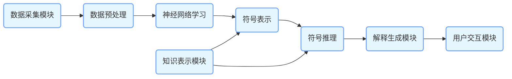

# 基于神经符号推理的可解释决策支持系统

> 关键词：神经符号推理、可解释决策支持系统、人工智能、知识表示、推理机制

> 摘要：本文聚焦于基于神经符号推理的可解释决策支持系统。首先介绍了该系统提出的背景，明确其目的、范围、预期读者等。详细阐述了神经符号推理和可解释决策支持系统的核心概念及联系，给出了相应的原理和架构示意图与流程图。深入讲解了核心算法原理，并用 Python 代码进行详细说明，同时介绍了相关的数学模型和公式。通过项目实战，从开发环境搭建到源代码实现及解读进行了全面分析。探讨了该系统的实际应用场景，推荐了学习、开发所需的工具和资源，包括书籍、在线课程、技术博客、IDE 等。最后总结了系统未来的发展趋势与挑战，还给出了常见问题解答和扩展阅读参考资料，旨在为相关领域的研究和实践提供全面且深入的指导。

## 1. 背景介绍 
### 1.1 目的和范围
在当今复杂多变的环境中，决策过程面临着诸多挑战。传统的决策支持系统虽然能够提供一定的帮助，但在处理复杂的知识和不确定性信息时往往表现不佳。同时，随着人工智能技术的发展，黑盒模型（如深度神经网络）在很多任务中取得了优异的性能，但这些模型缺乏可解释性，使得决策者难以理解其决策依据，从而限制了它们在一些关键领域（如医疗、金融等）的应用。

基于神经符号推理的可解释决策支持系统的目的在于结合神经网络强大的感知和学习能力以及符号推理的可解释性和逻辑表达能力，为决策者提供更加准确、可解释的决策建议。其范围涵盖了多个领域，包括但不限于医疗诊断、金融风险评估、智能交通规划等。

### 1.2 预期读者
本文预期读者包括人工智能、机器学习、决策科学等领域的研究人员和学者，他们可以从本文中获取关于神经符号推理和可解释决策支持系统的最新研究进展和技术细节。同时，从事相关行业（如医疗、金融等）的从业者也可以通过本文了解如何利用该系统来提升决策的质量和可解释性。此外，对人工智能技术感兴趣的学生和爱好者也能从本文中获得基础知识和深入的学习指导。

### 1.3 文档结构概述
本文将按照以下结构进行组织：首先介绍核心概念与联系，包括神经符号推理和可解释决策支持系统的原理和架构；接着详细阐述核心算法原理和具体操作步骤，并给出 Python 代码示例；然后介绍相关的数学模型和公式，并进行详细讲解和举例说明；通过项目实战，展示系统的开发过程和代码实现；探讨系统的实际应用场景；推荐学习和开发所需的工具和资源；总结系统未来的发展趋势与挑战；提供常见问题解答和扩展阅读参考资料。

### 1.4 术语表
#### 1.4.1 核心术语定义
- **神经符号推理**：将神经网络的感知和学习能力与符号推理的逻辑表达和可解释性相结合的一种推理方法。通过神经网络对数据进行特征提取和表示，然后利用符号推理机制进行逻辑推理和知识演绎。
- **可解释决策支持系统**：一种能够为决策者提供决策建议，并且能够解释这些建议的依据和推理过程的系统。它可以帮助决策者更好地理解决策的合理性，提高决策的质量和可信度。
- **知识表示**：将人类的知识以计算机能够理解和处理的方式进行表示的方法。常见的知识表示方法包括逻辑表达式、语义网络、框架等。
- **推理机制**：根据已知的知识和事实，通过一定的规则和算法推导出新的知识和结论的过程。常见的推理机制包括演绎推理、归纳推理、类比推理等。

#### 1.4.2 相关概念解释
- **神经网络**：一种模仿人类神经系统的计算模型，由大量的神经元组成。神经网络可以通过学习数据中的模式和规律，自动提取特征和进行预测。
- **符号系统**：一种基于符号和规则的系统，用于表示和处理知识。符号系统可以进行逻辑推理和知识演绎，具有很强的可解释性。
- **可解释性**：指模型或系统能够以人类可理解的方式解释其决策过程和结果的能力。可解释性对于决策者来说非常重要，因为它可以帮助他们理解决策的依据，从而更好地做出决策。

#### 1.4.3 缩略词列表
- **AI**：Artificial Intelligence，人工智能
- **ML**：Machine Learning，机器学习
- **DNN**：Deep Neural Network，深度神经网络
- **KB**：Knowledge Base，知识库

## 2. 核心概念与联系 
### 2.1 神经符号推理原理
神经符号推理的核心思想是将神经网络和符号推理相结合，充分发挥两者的优势。神经网络具有强大的感知和学习能力，能够自动从数据中提取特征和模式。而符号推理则具有明确的逻辑结构和可解释性，能够进行精确的知识表示和推理。

具体来说，神经符号推理的过程可以分为以下几个步骤：
1. **数据预处理**：将原始数据进行清洗、转换和特征提取，以便神经网络能够更好地处理。
2. **神经网络学习**：使用预处理后的数据训练神经网络，使其学习数据中的模式和规律。
3. **符号表示**：将神经网络的输出转换为符号表示，以便进行符号推理。
4. **符号推理**：利用符号推理机制，根据已知的知识和事实进行逻辑推理和知识演绎。
5. **结果解释**：将符号推理的结果转换为人类可理解的解释，为决策者提供决策建议。

### 2.2 可解释决策支持系统架构
可解释决策支持系统通常由以下几个部分组成：
1. **数据采集模块**：负责收集和整理与决策相关的数据，包括历史数据、实时数据等。
2. **知识表示模块**：将领域知识以合适的方式进行表示，构建知识库。
3. **神经符号推理模块**：结合神经网络和符号推理，对数据进行处理和推理，生成决策建议。
4. **解释生成模块**：根据推理结果，生成人类可理解的解释，说明决策建议的依据和推理过程。
5. **用户交互模块**：提供用户界面，方便用户输入问题和获取决策建议及解释。

### 2.3 核心概念联系示意图
下面是神经符号推理和可解释决策支持系统核心概念联系的文本示意图：

```plaintext
数据采集模块 --> 数据预处理 --> 神经网络学习 --> 符号表示 --> 符号推理 --> 解释生成模块 --> 用户交互模块
               |                                                     |
               |                                                     |
               |<--------------------- 知识表示模块 ------------------->|
```

### 2.4 Mermaid 流程图


## 3. 核心算法原理 & 具体操作步骤 
### 3.1 核心算法原理
神经符号推理的核心算法主要包括神经网络训练算法和符号推理算法。

#### 3.1.1 神经网络训练算法
常用的神经网络训练算法是反向传播算法（Backpropagation Algorithm）。反向传播算法通过计算损失函数对神经网络参数的梯度，然后使用梯度下降法更新参数，使得损失函数最小化。

假设我们有一个神经网络，其输入为 $x$，输出为 $y$，目标输出为 $\hat{y}$。损失函数可以定义为：

$$L = \frac{1}{2} \sum_{i=1}^{n} (y_i - \hat{y}_i)^2$$

其中 $n$ 是输出的维度。

反向传播算法的具体步骤如下：
1. **前向传播**：将输入 $x$ 传入神经网络，计算输出 $y$。
2. **计算损失**：根据输出 $y$ 和目标输出 $\hat{y}$，计算损失函数 $L$。
3. **反向传播**：从输出层开始，依次计算损失函数对每个神经元的梯度。
4. **参数更新**：根据梯度，使用梯度下降法更新神经网络的参数。

#### 3.1.2 符号推理算法
符号推理算法通常基于逻辑规则和知识表示。常见的符号推理算法包括归结推理、演绎推理等。

归结推理是一种基于逻辑归结原理的推理方法。给定一组逻辑子句，归结推理通过不断地进行归结操作，直到推导出矛盾或得到所需的结论。

演绎推理是一种从一般到特殊的推理方法。根据已知的前提和逻辑规则，推导出新的结论。

### 3.2 具体操作步骤
#### 3.2.1 数据准备
首先，需要收集和整理与决策相关的数据。数据可以包括历史数据、实时数据等。然后，对数据进行预处理，包括清洗、转换和特征提取。

#### 3.2.2 神经网络训练
使用预处理后的数据训练神经网络。可以选择合适的神经网络架构，如多层感知机（MLP）、卷积神经网络（CNN）等。在训练过程中，使用反向传播算法更新神经网络的参数。

#### 3.2.3 符号表示
将神经网络的输出转换为符号表示。可以使用编码方法，将连续的数值输出转换为离散的符号。

#### 3.2.4 符号推理
利用符号推理机制，根据已知的知识和事实进行逻辑推理。可以使用归结推理、演绎推理等算法。

#### 3.2.5 结果解释
将符号推理的结果转换为人类可理解的解释。可以使用自然语言生成技术，生成解释文本。

### 3.3 Python 代码示例
以下是一个简单的神经符号推理示例，使用 Python 和 PyTorch 库：

```python
import torch
import torch.nn as nn
import torch.optim as optim

# 定义神经网络模型
class NeuralNetwork(nn.Module):
    def __init__(self):
        super(NeuralNetwork, self).__init__()
        self.fc1 = nn.Linear(2, 5)
        self.fc2 = nn.Linear(5, 1)

    def forward(self, x):
        x = torch.relu(self.fc1(x))
        x = self.fc2(x)
        return x

# 数据准备
X = torch.tensor([[0, 0], [0, 1], [1, 0], [1, 1]], dtype=torch.float32)
y = torch.tensor([[0], [1], [1], [0]], dtype=torch.float32)

# 初始化模型
model = NeuralNetwork()

# 定义损失函数和优化器
criterion = nn.MSELoss()
optimizer = optim.SGD(model.parameters(), lr=0.01)

# 训练模型
for epoch in range(1000):
    optimizer.zero_grad()
    outputs = model(X)
    loss = criterion(outputs, y)
    loss.backward()
    optimizer.step()

# 符号表示
threshold = 0.5
symbolic_outputs = (outputs > threshold).float()

# 简单的符号推理（这里只是示例）
if symbolic_outputs[0] == 0:
    result = "Decision A"
else:
    result = "Decision B"

print("Symbolic Outputs:", symbolic_outputs)
print("Decision Result:", result)
```

在这个示例中，我们首先定义了一个简单的神经网络模型，然后使用反向传播算法训练模型。接着，将神经网络的输出转换为符号表示，最后进行简单的符号推理，得出决策结果。

## 4. 数学模型和公式 & 详细讲解 & 举例说明 
### 4.1 神经网络相关数学模型和公式
#### 4.1.1 神经元模型
神经元是神经网络的基本组成单元。一个简单的神经元模型可以表示为：

$$y = f(\sum_{i=1}^{n} w_i x_i + b)$$

其中 $x_i$ 是输入，$w_i$ 是权重，$b$ 是偏置，$f$ 是激活函数。常见的激活函数包括 sigmoid 函数、ReLU 函数等。

- **sigmoid 函数**：

$$\sigma(x) = \frac{1}{1 + e^{-x}}$$

sigmoid 函数将输入映射到 $(0, 1)$ 区间，常用于二分类问题。

- **ReLU 函数**：

$$ReLU(x) = \max(0, x)$$

ReLU 函数在 $x > 0$ 时输出 $x$，在 $x \leq 0$ 时输出 0，具有计算简单、收敛速度快等优点。

#### 4.1.2 损失函数
常见的损失函数包括均方误差损失（MSE）、交叉熵损失等。

- **均方误差损失（MSE）**：

$$L_{MSE} = \frac{1}{n} \sum_{i=1}^{n} (y_i - \hat{y}_i)^2$$

其中 $y_i$ 是真实值，$\hat{y}_i$ 是预测值。

- **交叉熵损失**：

对于二分类问题，交叉熵损失可以表示为：

$$L_{CE} = - \frac{1}{n} \sum_{i=1}^{n} [y_i \log(\hat{y}_i) + (1 - y_i) \log(1 - \hat{y}_i)]$$

#### 4.1.3 梯度下降法
梯度下降法是一种常用的优化算法，用于更新神经网络的参数。参数更新公式为：

$$\theta_{t+1} = \theta_t - \alpha \nabla L(\theta_t)$$

其中 $\theta$ 是参数，$\alpha$ 是学习率，$\nabla L(\theta_t)$ 是损失函数在 $\theta_t$ 处的梯度。

### 4.2 符号推理相关数学模型和公式
#### 4.2.1 逻辑归结原理
逻辑归结原理是归结推理的基础。给定两个子句 $C_1$ 和 $C_2$，如果存在一个互补文字对（一个文字是另一个文字的否定），则可以进行归结操作，得到一个新的子句 $C$。

例如，给定子句 $C_1 = P \vee Q$ 和 $C_2 = \neg P \vee R$，由于 $P$ 和 $\neg P$ 是互补文字对，进行归结操作得到新子句 $C = Q \vee R$。

#### 4.2.2 演绎推理规则
演绎推理规则包括假言推理、拒取式推理等。

- **假言推理**：

如果已知 $P \to Q$ 和 $P$ 为真，则可以推出 $Q$ 为真。

- **拒取式推理**：

如果已知 $P \to Q$ 和 $\neg Q$ 为真，则可以推出 $\neg P$ 为真。

### 4.3 举例说明
#### 4.3.1 神经网络举例
假设我们有一个简单的二分类问题，输入为 $x_1$ 和 $x_2$，输出为 $y$。我们使用一个包含一个隐藏层的神经网络进行训练。

输入数据为：

$$X = \begin{bmatrix}
0 & 0 \\
0 & 1 \\
1 & 0 \\
1 & 1
\end{bmatrix}$$

目标输出为：

$$y = \begin{bmatrix}
0 \\
1 \\
1 \\
0
\end{bmatrix}$$

我们使用均方误差损失函数和梯度下降法进行训练。经过多次迭代，神经网络可以学习到输入和输出之间的关系。

#### 4.3.2 符号推理举例
假设我们有以下知识：
- 如果天气晴朗（$P$），则可以去野餐（$Q$）。
- 现在天气晴朗（$P$ 为真）。

根据假言推理规则，可以推出可以去野餐（$Q$ 为真）。

## 5. 项目实战：代码实际案例和详细解释说明 
### 5.1  开发环境搭建
#### 5.1.1 安装 Python
首先，需要安装 Python 环境。可以从 Python 官方网站（https://www.python.org/downloads/） 下载适合自己操作系统的 Python 版本，并按照安装向导进行安装。

#### 5.1.2 安装必要的库
在开发基于神经符号推理的可解释决策支持系统时，需要安装一些必要的库，如 PyTorch、NumPy、Pandas 等。可以使用以下命令进行安装：

```bash
pip install torch numpy pandas
```

#### 5.1.3 安装开发工具
可以选择合适的开发工具，如 PyCharm、Jupyter Notebook 等。PyCharm 是一个功能强大的 Python 集成开发环境，适合大型项目的开发。Jupyter Notebook 则适合交互式开发和实验。

### 5.2  源代码详细实现和代码解读
以下是一个完整的基于神经符号推理的可解释决策支持系统的代码示例：

```python
import torch
import torch.nn as nn
import torch.optim as optim
import pandas as pd

# 定义神经网络模型
class NeuralNetwork(nn.Module):
    def __init__(self):
        super(NeuralNetwork, self).__init__()
        self.fc1 = nn.Linear(2, 5)
        self.fc2 = nn.Linear(5, 1)

    def forward(self, x):
        x = torch.relu(self.fc1(x))
        x = self.fc2(x)
        return x

# 数据准备
data = pd.read_csv('data.csv')
X = torch.tensor(data[['feature1', 'feature2']].values, dtype=torch.float32)
y = torch.tensor(data['label'].values.reshape(-1, 1), dtype=torch.float32)

# 初始化模型
model = NeuralNetwork()

# 定义损失函数和优化器
criterion = nn.MSELoss()
optimizer = optim.SGD(model.parameters(), lr=0.01)

# 训练模型
for epoch in range(1000):
    optimizer.zero_grad()
    outputs = model(X)
    loss = criterion(outputs, y)
    loss.backward()
    optimizer.step()

# 符号表示
threshold = 0.5
symbolic_outputs = (outputs > threshold).float()

# 知识表示（示例规则）
rules = {
    "rule1": {"condition": [1, 1], "decision": "Decision A"},
    "rule2": {"condition": [1, 0], "decision": "Decision B"},
    "rule3": {"condition": [0, 1], "decision": "Decision C"},
    "rule4": {"condition": [0, 0], "decision": "Decision D"}
}

# 符号推理
decisions = []
for output in symbolic_outputs:
    output_list = output.tolist()
    for rule in rules.values():
        if output_list == rule["condition"]:
            decisions.append(rule["decision"])
            break

# 结果解释
for i in range(len(decisions)):
    print(f"Input: {X[i].tolist()}, Symbolic Output: {symbolic_outputs[i].tolist()}, Decision: {decisions[i]}")
```

### 5.3  代码解读与分析
#### 5.3.1 数据准备
使用 Pandas 库读取 CSV 文件中的数据，并将其转换为 PyTorch 张量。

#### 5.3.2 神经网络训练
定义一个简单的神经网络模型，使用均方误差损失函数和随机梯度下降优化器进行训练。

#### 5.3.3 符号表示
将神经网络的输出转换为符号表示，通过设置阈值将连续的数值输出转换为离散的符号。

#### 5.3.4 知识表示和符号推理
使用字典表示知识规则，根据符号输出进行符号推理，得出决策结果。

#### 5.3.5 结果解释
将输入、符号输出和决策结果进行打印，为用户提供解释。

## 6. 实际应用场景 
### 6.1 医疗诊断
在医疗诊断中，基于神经符号推理的可解释决策支持系统可以帮助医生更准确地诊断疾病。系统可以通过分析患者的病历、检查结果等数据，利用神经网络提取特征，然后结合医学知识进行符号推理，给出诊断建议和解释。例如，在乳腺癌诊断中，系统可以根据患者的乳腺超声图像、病理检查结果等信息，判断患者是否患有乳腺癌，并解释判断的依据，如哪些特征对诊断结果起到了关键作用。

### 6.2 金融风险评估
在金融领域，可解释决策支持系统可以用于评估金融风险。系统可以分析客户的信用记录、财务状况等数据，使用神经网络预测客户的违约概率，然后通过符号推理机制解释预测结果的原因。例如，在银行贷款审批中，系统可以判断客户是否有违约风险，并解释是哪些因素（如收入水平、负债情况等）导致了风险的评估结果。

### 6.3 智能交通规划
在智能交通领域，该系统可以用于交通流量预测和交通规划。系统可以收集交通传感器数据、地图信息等，利用神经网络预测交通流量，然后结合交通规则和城市规划知识进行符号推理，给出交通规划建议。例如，在城市道路建设中，系统可以根据预测的交通流量和道路网络情况，建议是否需要新建或扩建道路，并解释建议的依据。

### 6.4 工业故障诊断
在工业生产中，可解释决策支持系统可以用于设备故障诊断。系统可以监测设备的运行状态数据，如温度、压力、振动等，使用神经网络检测设备是否存在故障，然后通过符号推理机制解释故障的原因和可能的解决方案。例如，在电力设备故障诊断中，系统可以判断变压器是否出现故障，并解释是哪些因素（如温度过高、绝缘老化等）导致了故障的发生。

## 7. 工具和资源推荐
### 7.1 学习资源推荐
#### 7.1.1 书籍推荐
- 《深度学习》（Deep Learning）：由 Ian Goodfellow、Yoshua Bengio 和 Aaron Courville 所著，是深度学习领域的经典教材，涵盖了神经网络、深度学习算法等方面的知识。
- 《人工智能：一种现代的方法》（Artificial Intelligence: A Modern Approach）：由 Stuart Russell 和 Peter Norvig 所著，全面介绍了人工智能的各个领域，包括知识表示、推理、机器学习等。
- 《Python 深度学习》（Deep Learning with Python）：由 Francois Chollet 所著，结合 Keras 库介绍了深度学习的实践方法，适合初学者快速上手。

#### 7.1.2 在线课程
- Coursera 上的“深度学习专项课程”（Deep Learning Specialization）：由 Andrew Ng 教授授课，系统地介绍了深度学习的基础知识和应用。
- edX 上的“人工智能导论”（Introduction to Artificial Intelligence）：由麻省理工学院（MIT）提供，涵盖了人工智能的核心概念和算法。
- Udemy 上的“Python 机器学习实战”（Machine Learning A-Z™: Hands-On Python & R In Data Science）：通过实际案例介绍了机器学习的应用，包括神经网络、决策树等算法。

#### 7.1.3 技术博客和网站
- Medium 上的 Towards Data Science：提供了大量关于数据科学、机器学习、深度学习等方面的技术文章和案例分析。
- ArXiv：一个预印本平台，包含了许多最新的人工智能研究论文。
- GitHub：可以找到许多开源的人工智能项目和代码示例，有助于学习和实践。

### 7.2 开发工具框架推荐
#### 7.2.1 IDE和编辑器
- PyCharm：功能强大的 Python 集成开发环境，提供了代码编辑、调试、版本控制等功能，适合大型项目的开发。
- Jupyter Notebook：交互式开发环境，支持 Python、R 等多种编程语言，适合快速实验和数据分析。
- Visual Studio Code：轻量级的代码编辑器，具有丰富的插件扩展功能，支持 Python 开发。

#### 7.2.2 调试和性能分析工具
- PyTorch Profiler：用于分析 PyTorch 模型的性能，包括计算时间、内存使用等。
- TensorBoard：可以可视化神经网络的训练过程和性能指标，帮助调试和优化模型。
- cProfile：Python 内置的性能分析工具，可以分析代码的运行时间和函数调用情况。

#### 7.2.3 相关框架和库
- PyTorch：一个开源的深度学习框架，提供了丰富的神经网络模型和优化算法，易于使用和扩展。
- TensorFlow：另一个流行的深度学习框架，具有强大的分布式计算能力和广泛的应用场景。
- SymPy：Python 中的符号计算库，可以进行符号推理和数学表达式的化简。

### 7.3 相关论文著作推荐
#### 7.3.1 经典论文
- “Neural-Symbolic Learning and Reasoning: Contributions and Challenges”：该论文介绍了神经符号学习和推理的发展历程、主要贡献和面临的挑战。
- “Towards Explainable AI: A Unified Overview of the Concepts, Datasets, and Approaches”：对可解释人工智能的概念、数据集和方法进行了全面的综述。
- “Knowledge Graph Embedding: A Survey of Approaches and Applications”：详细介绍了知识图谱嵌入的方法和应用。

#### 7.3.2 最新研究成果
可以通过 ArXiv、ACM Digital Library、IEEE Xplore 等学术平台搜索最新的神经符号推理和可解释决策支持系统的研究成果。

#### 7.3.3 应用案例分析
可以关注相关领域的学术会议（如 AAAI、IJCAI、NeurIPS 等）和期刊（如 Journal of Artificial Intelligence Research、Artificial Intelligence 等）上的应用案例分析，了解该技术在实际中的应用效果。

## 8. 总结：未来发展趋势与挑战
### 8.1 未来发展趋势
#### 8.1.1 融合更多的模态信息
未来的基于神经符号推理的可解释决策支持系统将融合更多的模态信息，如文本、图像、音频等。通过多模态信息的融合，可以更全面地理解问题，提高决策的准确性和可解释性。

#### 8.1.2 与知识图谱的深度结合
知识图谱是一种结构化的知识表示方法，可以为符号推理提供丰富的知识资源。未来的系统将与知识图谱深度结合，利用知识图谱的语义信息进行更复杂的推理和决策。

#### 8.1.3 自适应学习和推理
系统将具备自适应学习和推理的能力，能够根据不同的任务和数据自动调整模型和推理策略。同时，系统还可以在运行过程中不断学习新的知识，提高自身的性能。

#### 8.1.4 应用领域的拓展
随着技术的不断发展，基于神经符号推理的可解释决策支持系统将在更多的领域得到应用，如教育、农业、环保等。

### 8.2 挑战
#### 8.2.1 知识表示和获取的难题
如何有效地表示和获取领域知识是一个挑战。知识的多样性和复杂性使得知识表示和获取变得困难，需要研究更加高效和准确的方法。

#### 8.2.2 神经网络和符号推理的融合难题
神经网络和符号推理的融合存在一定的困难。神经网络是基于数据驱动的，而符号推理是基于逻辑规则的，如何将两者有机地结合起来，发挥各自的优势，是一个需要解决的问题。

#### 8.2.3 可解释性的度量和评估
目前，对于可解释性的度量和评估还没有统一的标准。如何准确地度量和评估系统的可解释性，是一个亟待解决的问题。

#### 8.2.4 计算资源的需求
神经符号推理系统通常需要大量的计算资源，尤其是在处理大规模数据和复杂模型时。如何有效地利用计算资源，提高系统的效率，是一个挑战。

## 9. 附录：常见问题与解答
### 9.1 什么是神经符号推理？
神经符号推理是将神经网络的感知和学习能力与符号推理的逻辑表达和可解释性相结合的一种推理方法。通过神经网络对数据进行特征提取和表示，然后利用符号推理机制进行逻辑推理和知识演绎。

### 9.2 为什么需要可解释决策支持系统？
在一些关键领域（如医疗、金融等），决策者需要了解决策的依据和推理过程，以便做出更加合理和可靠的决策。可解释决策支持系统可以提供决策建议，并解释这些建议的依据，提高决策的可信度和可接受性。

### 9.3 神经网络和符号推理如何结合？
可以通过以下几种方式结合：将神经网络的输出转换为符号表示，然后进行符号推理；或者在神经网络中引入符号知识，指导神经网络的学习和推理过程。

### 9.4 如何评估可解释决策支持系统的性能？
可以从以下几个方面评估：决策的准确性、可解释性的质量、系统的效率等。决策的准确性可以通过与真实结果进行比较来评估；可解释性的质量可以通过人工评估或自动评估指标来衡量；系统的效率可以通过计算时间、内存使用等指标来评估。

### 9.5 神经符号推理系统的计算资源需求大吗？
神经符号推理系统通常需要一定的计算资源，尤其是在处理大规模数据和复杂模型时。可以通过优化算法、使用并行计算等方法来减少计算资源的需求。

## 10. 扩展阅读 & 参考资料
### 10.1 扩展阅读
- 《可解释人工智能》（Explainable Artificial Intelligence）：深入探讨了可解释人工智能的理论和方法。
- 《知识图谱：方法、实践与应用》：详细介绍了知识图谱的构建、表示和应用。
- 《机器学习中的可解释性方法》（Interpretable Machine Learning: A Guide for Making Black Box Models Explainable）：介绍了机器学习中常用的可解释性方法。

### 10.2 参考资料
- 相关学术论文和研究报告。
- 开源项目的文档和代码。
- 在线课程的课件和笔记。

作者：AI天才研究院/AI Genius Institute & 禅与计算机程序设计艺术 /Zen And The Art of Computer Programming