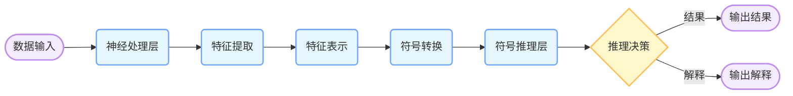

# 基于神经符号整合的可解释AI推理系统

> 关键词：神经符号整合、可解释AI、推理系统、深度学习、符号逻辑

> 摘要：本文聚焦于基于神经符号整合的可解释AI推理系统。首先介绍了该系统提出的背景，包括目的、预期读者、文档结构和相关术语。接着阐述了神经符号整合及可解释AI推理系统的核心概念与联系，通过文本示意图和Mermaid流程图进行清晰展示。详细讲解了核心算法原理，并给出Python源代码。深入探讨了相关数学模型和公式，辅以举例说明。通过项目实战，从开发环境搭建到源代码实现及解读进行了全面分析。列举了该系统的实际应用场景，推荐了学习资源、开发工具框架以及相关论文著作。最后总结了未来发展趋势与挑战，提供常见问题解答和扩展阅读参考资料，旨在为研究者和开发者深入理解和构建此类系统提供全面的技术指导。

## 1. 背景介绍 
### 1.1 目的和范围
在当今人工智能领域，深度学习模型在诸多任务中取得了显著成果，但这些模型往往缺乏可解释性，其决策过程如同“黑箱”，难以理解和信任。基于神经符号整合的可解释AI推理系统旨在结合神经网络强大的感知和学习能力与符号逻辑的明确性和可解释性，构建一个既能高效处理复杂数据，又能清晰解释推理过程的AI系统。本文章的范围涵盖该系统的核心概念、算法原理、数学模型、实际案例以及相关工具和资源推荐等方面，为读者全面了解和开发此类系统提供技术支持。

### 1.2 预期读者
本文预期读者包括人工智能领域的研究者、开发者、学生，以及对可解释AI推理系统感兴趣的专业人士。对于希望深入了解神经符号整合技术，掌握可解释AI系统开发方法的人员具有重要参考价值。

### 1.3 文档结构概述
本文将按照以下结构展开：首先介绍核心概念与联系，帮助读者建立系统的基本认知；接着阐述核心算法原理和具体操作步骤，通过Python代码详细说明；然后深入讲解数学模型和公式，并举例说明；通过项目实战展示系统的实际开发过程；列举实际应用场景，体现系统的实用性；推荐相关的工具和资源，助力读者进一步学习和研究；最后总结未来发展趋势与挑战，提供常见问题解答和扩展阅读参考资料。

### 1.4 术语表
#### 1.4.1 核心术语定义
- **神经符号整合**：将神经网络和符号逻辑相结合的技术，旨在充分发挥两者的优势，实现更强大和可解释的AI系统。
- **可解释AI**：指人工智能系统能够以人类可理解的方式解释其决策过程和输出结果的能力。
- **推理系统**：根据已知信息和规则进行逻辑推导，得出新结论的系统。

#### 1.4.2 相关概念解释
- **神经网络**：一种模仿人类神经系统的计算模型，由大量神经元组成，通过学习数据中的模式和特征进行预测和分类。
- **符号逻辑**：使用符号和规则来表示和处理知识的逻辑系统，具有明确的语义和推理规则。

#### 1.4.3 缩略词列表
- **AI**：Artificial Intelligence，人工智能
- **ML**：Machine Learning，机器学习
- **DL**：Deep Learning，深度学习

## 2. 核心概念与联系 

### 核心概念原理
神经符号整合的可解释AI推理系统的核心在于将神经网络的感知能力与符号逻辑的推理能力相结合。神经网络可以从大量数据中自动学习特征和模式，适用于处理复杂的感知任务，如图像识别、自然语言处理等。而符号逻辑则可以对知识进行明确的表示和推理，能够提供可解释的决策过程。通过将两者整合，可以构建一个既能处理复杂数据，又能清晰解释推理结果的系统。

### 架构的文本示意图
该系统主要由三个部分组成：数据输入层、神经处理层和符号推理层。
- **数据输入层**：负责接收各种类型的数据，如图像、文本、传感器数据等。
- **神经处理层**：使用神经网络对输入数据进行特征提取和学习，将原始数据转换为抽象的特征表示。
- **符号推理层**：将神经处理层输出的特征转换为符号表示，然后使用符号逻辑进行推理，得出最终的决策结果。推理结果可以通过符号逻辑的规则进行解释，从而实现系统的可解释性。

### Mermaid流程图


## 3. 核心算法原理 & 具体操作步骤 

### 核心算法原理
该系统的核心算法主要包括神经网络的特征提取和符号逻辑的推理。

#### 神经网络特征提取
使用卷积神经网络（CNN）或循环神经网络（RNN）等对输入数据进行特征提取。以CNN为例，其基本原理是通过卷积层、池化层和全连接层对图像数据进行处理。卷积层使用卷积核提取图像的局部特征，池化层对特征进行降维，全连接层将特征映射到输出空间。

#### 符号逻辑推理
使用一阶逻辑、描述逻辑等符号逻辑系统进行推理。符号逻辑推理基于一组规则和事实，通过逻辑推导得出新的结论。例如，在一阶逻辑中，可以使用谓词和量词来表示知识，使用推理规则进行推导。

### 具体操作步骤
#### 步骤1：数据预处理
对输入数据进行清洗、归一化等预处理操作，以便神经网络能够更好地学习。

#### 步骤2：神经网络训练
使用预处理后的数据对神经网络进行训练，调整网络参数，使其能够准确地提取特征。

#### 步骤3：特征转换
将神经网络输出的特征转换为符号表示，以便进行符号逻辑推理。

#### 步骤4：符号逻辑推理
使用符号逻辑规则对转换后的符号进行推理，得出最终的决策结果。

### Python源代码详细阐述
```python
import torch
import torch.nn as nn
import torch.optim as optim

# 定义一个简单的卷积神经网络
class SimpleCNN(nn.Module):
    def __init__(self):
        super(SimpleCNN, self).__init__()
        self.conv1 = nn.Conv2d(3, 16, kernel_size=3, padding=1)
        self.relu1 = nn.ReLU()
        self.pool1 = nn.MaxPool2d(2)
        self.fc1 = nn.Linear(16 * 16 * 16, 128)
        self.relu2 = nn.ReLU()
        self.fc2 = nn.Linear(128, 10)

    def forward(self, x):
        x = self.conv1(x)
        x = self.relu1(x)
        x = self.pool1(x)
        x = x.view(-1, 16 * 16 * 16)
        x = self.fc1(x)
        x = self.relu2(x)
        x = self.fc2(x)
        return x

# 数据预处理和训练过程
def train_model():
    # 初始化模型
    model = SimpleCNN()
    criterion = nn.CrossEntropyLoss()
    optimizer = optim.Adam(model.parameters(), lr=0.001)

    # 模拟数据
    inputs = torch.randn(10, 3, 32, 32)
    labels = torch.randint(0, 10, (10,))

    # 训练模型
    for epoch in range(10):
        optimizer.zero_grad()
        outputs = model(inputs)
        loss = criterion(outputs, labels)
        loss.backward()
        optimizer.step()
        print(f'Epoch {epoch + 1}, Loss: {loss.item()}')

    return model

# 特征转换和符号逻辑推理部分（简化示例）
def symbolic_reasoning(model, input_data):
    # 提取特征
    features = model(input_data)
    # 简单的符号转换和推理规则（示例）
    if features[0][0] > 0:
        result = "Class A"
    else:
        result = "Class B"
    return result

if __name__ == "__main__":
    trained_model = train_model()
    test_input = torch.randn(1, 3, 32, 32)
    output = symbolic_reasoning(trained_model, test_input)
    print(f"推理结果: {output}")
```

## 4. 数学模型和公式 & 详细讲解 & 举例说明 

### 神经网络的数学模型
#### 卷积层
卷积层的数学模型可以表示为：
$$y_{i,j}^k = \sum_{m=0}^{M-1}\sum_{n=0}^{N-1}x_{i+m,j+n}^l \cdot w_{m,n}^{k,l} + b^k$$
其中，$y_{i,j}^k$ 是第 $k$ 个卷积核在位置 $(i,j)$ 处的输出，$x_{i+m,j+n}^l$ 是输入特征图 $l$ 在位置 $(i+m,j+n)$ 处的值，$w_{m,n}^{k,l}$ 是第 $k$ 个卷积核在位置 $(m,n)$ 处的权重，$b^k$ 是第 $k$ 个卷积核的偏置，$M$ 和 $N$ 是卷积核的大小。

#### 池化层
最大池化层的数学模型可以表示为：
$$y_{i,j}^k = \max_{m=0}^{M-1}\max_{n=0}^{N-1}x_{i \cdot s + m,j \cdot s + n}^k$$
其中，$y_{i,j}^k$ 是池化后第 $k$ 个特征图在位置 $(i,j)$ 处的值，$x_{i \cdot s + m,j \cdot s + n}^k$ 是输入特征图 $k$ 在位置 $(i \cdot s + m,j \cdot s + n)$ 处的值，$s$ 是池化步长，$M$ 和 $N$ 是池化窗口的大小。

#### 全连接层
全连接层的数学模型可以表示为：
$$y_j = \sum_{i=0}^{I-1}x_i \cdot w_{i,j} + b_j$$
其中，$y_j$ 是输出层第 $j$ 个神经元的值，$x_i$ 是输入层第 $i$ 个神经元的值，$w_{i,j}$ 是输入层第 $i$ 个神经元到输出层第 $j$ 个神经元的权重，$b_j$ 是输出层第 $j$ 个神经元的偏置，$I$ 是输入层神经元的数量。

### 符号逻辑的数学模型
#### 一阶逻辑
一阶逻辑使用谓词、量词和逻辑连接词来表示知识。例如，命题 “所有的猫都是动物” 可以表示为：
$$\forall x (Cat(x) \to Animal(x))$$
其中，$\forall$ 是全称量词，表示 “对于所有的”，$x$ 是变量，$Cat(x)$ 表示 $x$ 是猫，$Animal(x)$ 表示 $x$ 是动物，$\to$ 是逻辑蕴含符号。

#### 推理规则
在一阶逻辑中，常用的推理规则包括假言推理规则：
$$\frac{P, P \to Q}{Q}$$
其中，$P$ 和 $Q$ 是命题，如果已知 $P$ 为真，且 $P$ 蕴含 $Q$，则可以推出 $Q$ 为真。

### 举例说明
假设我们有一个简单的图像分类任务，使用上述的卷积神经网络进行特征提取。输入图像的大小为 $32 \times 32$ 像素，有 3 个通道。卷积层使用 16 个大小为 $3 \times 3$ 的卷积核，池化层使用 $2 \times 2$ 的最大池化窗口，步长为 2。全连接层将特征映射到 10 个类别。

对于输入图像 $x$，经过卷积层后，输出特征图的大小为 $32 \times 32 \times 16$。经过池化层后，特征图的大小变为 $16 \times 16 \times 16$。最后，经过全连接层，输出一个长度为 10 的向量，表示图像属于每个类别的概率。

在符号逻辑推理部分，假设我们有以下规则：如果图像属于类别 1 或类别 2，则输出 “类别 A”；否则输出 “类别 B”。可以使用符号逻辑表示为：
$$(Class1 \vee Class2) \to ClassA$$
$$\neg(Class1 \vee Class2) \to ClassB$$
其中，$Class1$、$Class2$、$ClassA$ 和 $ClassB$ 是命题。根据神经网络输出的概率，判断图像属于哪个类别，然后使用上述规则进行推理，得出最终的决策结果。

## 5. 项目实战：代码实际案例和详细解释说明 

### 5.1  开发环境搭建
#### 操作系统
建议使用 Linux 或 macOS 操作系统，因为它们对深度学习框架的支持更好。

#### Python 环境
安装 Python 3.7 或更高版本。可以使用 Anaconda 来管理 Python 环境，方便安装和管理各种依赖库。

#### 深度学习框架
安装 PyTorch 深度学习框架。可以根据自己的需求选择 CPU 或 GPU 版本。在 Anaconda 环境中，可以使用以下命令安装 PyTorch：
```bash
conda install pytorch torchvision torchaudio cudatoolkit=xx.x -c pytorch
```
其中，`xx.x` 是 CUDA 版本号，如果使用 CPU 版本，则不需要指定 `cudatoolkit`。

#### 其他依赖库
安装必要的依赖库，如 NumPy、Matplotlib 等：
```bash
conda install numpy matplotlib
```

### 5.2  源代码详细实现和代码解读
```python
import torch
import torch.nn as nn
import torch.optim as optim
import torchvision
import torchvision.transforms as transforms

# 数据预处理
transform = transforms.Compose(
    [transforms.ToTensor(),
     transforms.Normalize((0.5, 0.5, 0.5), (0.5, 0.5, 0.5))])

# 加载数据集
trainset = torchvision.datasets.CIFAR10(root='./data', train=True,
                                        download=True, transform=transform)
trainloader = torch.utils.data.DataLoader(trainset, batch_size=4,
                                          shuffle=True, num_workers=2)

testset = torchvision.datasets.CIFAR10(root='./data', train=False,
                                       download=True, transform=transform)
testloader = torch.utils.data.DataLoader(testset, batch_size=4,
                                         shuffle=False, num_workers=2)

classes = ('plane', 'car', 'bird', 'cat',
           'deer', 'dog', 'frog', 'horse', 'ship', 'truck')

# 定义一个更复杂的卷积神经网络
class ComplexCNN(nn.Module):
    def __init__(self):
        super(ComplexCNN, self).__init__()
        self.conv1 = nn.Conv2d(3, 6, kernel_size=5)
        self.pool = nn.MaxPool2d(2, 2)
        self.conv2 = nn.Conv2d(6, 16, kernel_size=5)
        self.fc1 = nn.Linear(16 * 5 * 5, 120)
        self.fc2 = nn.Linear(120, 84)
        self.fc3 = nn.Linear(84, 10)

    def forward(self, x):
        x = self.pool(nn.functional.relu(self.conv1(x)))
        x = self.pool(nn.functional.relu(self.conv2(x)))
        x = x.view(-1, 16 * 5 * 5)
        x = nn.functional.relu(self.fc1(x))
        x = nn.functional.relu(self.fc2(x))
        x = self.fc3(x)
        return x

# 初始化模型、损失函数和优化器
net = ComplexCNN()
criterion = nn.CrossEntropyLoss()
optimizer = optim.SGD(net.parameters(), lr=0.001, momentum=0.9)

# 训练模型
for epoch in range(2):  # 训练2个epoch
    running_loss = 0.0
    for i, data in enumerate(trainloader, 0):
        inputs, labels = data
        optimizer.zero_grad()
        outputs = net(inputs)
        loss = criterion(outputs, labels)
        loss.backward()
        optimizer.step()

        running_loss += loss.item()
        if i % 2000 == 1999:    # 每2000个batch打印一次损失值
            print(f'[{epoch + 1}, {i + 1:5d}] loss: {running_loss / 2000:.3f}')
            running_loss = 0.0

print('Finished Training')

# 特征转换和符号逻辑推理部分（简化示例）
def symbolic_reasoning(net, input_data):
    # 提取特征
    features = net(input_data)
    _, predicted = torch.max(features, 1)
    # 简单的符号转换和推理规则（示例）
    if predicted.item() in [0, 1, 8, 9]:
        result = "Transportation"
    else:
        result = "Animal"
    return result

# 测试模型
dataiter = iter(testloader)
images, labels = dataiter.next()
output = symbolic_reasoning(net, images)
print(f"推理结果: {output}")
```

### 5.3  代码解读与分析
#### 数据预处理
使用 `torchvision.transforms` 对图像数据进行预处理，包括将图像转换为张量和归一化操作。

#### 数据集加载
使用 `torchvision.datasets.CIFAR10` 加载 CIFAR-10 数据集，并使用 `torch.utils.data.DataLoader` 创建数据加载器，方便批量加载数据。

#### 模型定义
定义了一个更复杂的卷积神经网络 `ComplexCNN`，包含两个卷积层、两个池化层和三个全连接层。

#### 模型训练
使用交叉熵损失函数和随机梯度下降优化器对模型进行训练。在每个 epoch 中，遍历训练数据集，计算损失并更新模型参数。

#### 特征转换和符号逻辑推理
在 `symbolic_reasoning` 函数中，首先使用训练好的模型提取输入数据的特征，然后根据特征的最大值确定预测类别。最后，根据预测类别使用简单的符号逻辑规则进行推理，得出最终的决策结果。

## 6. 实际应用场景 
### 医疗诊断
在医疗诊断领域，基于神经符号整合的可解释AI推理系统可以结合医学影像（如X光、CT扫描等）和医学知识（如疾病诊断标准、治疗指南等）进行疾病诊断。神经网络可以从医学影像中提取特征，符号逻辑推理可以根据提取的特征和医学知识进行诊断，并给出可解释的诊断结果和建议。例如，在肺癌诊断中，系统可以根据肺部CT图像中的结节特征，结合肺癌的诊断标准，判断患者是否患有肺癌，并解释诊断的依据。

### 金融风险评估
在金融领域，该系统可以用于风险评估和投资决策。神经网络可以从大量的金融数据（如股票价格、财务报表等）中学习特征，符号逻辑推理可以根据这些特征和金融规则（如风险评估模型、投资策略等）进行风险评估和投资决策。例如，在股票投资中，系统可以根据股票的历史数据和市场趋势，结合投资策略，给出投资建议，并解释建议的原因。

### 智能交通
在智能交通领域，该系统可以用于交通流量预测、交通事故预警等。神经网络可以从交通传感器数据（如车辆速度、流量等）中提取特征，符号逻辑推理可以根据这些特征和交通规则（如交通拥堵模型、事故预警规则等）进行预测和预警。例如，在交通拥堵预测中，系统可以根据实时交通数据和历史数据，结合交通拥堵模型，预测未来一段时间内的交通拥堵情况，并解释预测的依据。

### 工业质量检测
在工业生产中，该系统可以用于产品质量检测。神经网络可以从产品图像或传感器数据中提取特征，符号逻辑推理可以根据这些特征和质量标准进行质量检测，并给出可解释的检测结果。例如，在电子产品生产中，系统可以根据电路板的图像特征，结合质量标准，判断电路板是否合格，并解释检测的依据。

## 7. 工具和资源推荐
### 7.1 学习资源推荐
#### 7.1.1 书籍推荐
- 《深度学习》（Deep Learning）：由 Ian Goodfellow、Yoshua Bengio 和 Aaron Courville 撰写，是深度学习领域的经典教材，全面介绍了深度学习的基本原理、算法和应用。
- 《人工智能：一种现代的方法》（Artificial Intelligence: A Modern Approach）：由 Stuart Russell 和 Peter Norvig 撰写，是人工智能领域的权威教材，涵盖了人工智能的各个方面，包括搜索、知识表示、推理、机器学习等。
- 《神经网络与深度学习》：由 Michael Nielsen 撰写，以通俗易懂的方式介绍了神经网络和深度学习的基本原理和算法，适合初学者入门。

#### 7.1.2 在线课程
- Coursera 上的 “深度学习专项课程”（Deep Learning Specialization）：由 Andrew Ng 教授授课，包括五门课程，全面介绍了深度学习的各个方面，如神经网络基础、卷积神经网络、循环神经网络等。
- edX 上的 “人工智能导论”（Introduction to Artificial Intelligence）：由麻省理工学院（MIT）的 Patrick Winston 教授授课，介绍了人工智能的基本概念、方法和应用。
- 哔哩哔哩（Bilibili）上有许多关于深度学习和人工智能的教学视频，如李沐的 “动手学深度学习” 系列课程，通过实际代码演示和讲解，帮助学习者快速掌握深度学习的实践技能。

#### 7.1.3 技术博客和网站
- Medium 上有许多关于人工智能和深度学习的技术博客，如 Towards Data Science，分享了大量的技术文章和实践经验。
- arXiv 是一个预印本数据库，包含了大量的人工智能和深度学习领域的最新研究成果，可以及时了解该领域的前沿动态。
- 机器之心、新智元等中文科技媒体网站，提供了丰富的人工智能领域的资讯、技术文章和行业分析。

### 7.2 开发工具框架推荐
#### 7.2.1 IDE和编辑器
- PyCharm：是一款专门为 Python 开发设计的集成开发环境（IDE），具有强大的代码编辑、调试、自动补全和项目管理功能，适合开发大型的 Python 项目。
- Jupyter Notebook：是一个基于 Web 的交互式计算环境，支持多种编程语言，如 Python、R 等。可以方便地进行代码编写、运行和可视化展示，适合数据探索和模型实验。
- Visual Studio Code：是一款轻量级的代码编辑器，支持多种编程语言和插件扩展。具有丰富的代码编辑功能和调试工具，适合快速开发和调试代码。

#### 7.2.2 调试和性能分析工具
- PyTorch Profiler：是 PyTorch 提供的性能分析工具，可以帮助开发者分析模型的运行时间、内存使用情况等，找出性能瓶颈并进行优化。
- TensorBoard：是 TensorFlow 提供的可视化工具，也可以与 PyTorch 集成使用。可以用于可视化模型的训练过程、损失曲线、准确率曲线等，方便开发者监控模型的训练状态。
- cProfile：是 Python 标准库中的性能分析模块，可以分析 Python 代码的运行时间和函数调用次数，帮助开发者找出代码中的性能瓶颈。

#### 7.2.3 相关框架和库
- PyTorch：是一个开源的深度学习框架，具有动态图和静态图两种模式，支持 GPU 加速，提供了丰富的神经网络层和优化器，方便开发者构建和训练深度学习模型。
- TensorFlow：是另一个广泛使用的开源深度学习框架，具有强大的分布式训练和部署能力，提供了高级的模型构建 API 和工具，适合大规模的工业应用。
- SymPy：是一个 Python 库，用于符号计算和数学表达式处理。可以用于实现符号逻辑推理，进行公式推导和化简。

### 7.3 相关论文著作推荐
#### 7.3.1 经典论文
- “Neural-Symbolic Learning and Reasoning: Contributions and Challenges”：该论文全面介绍了神经符号学习和推理的发展历程、主要方法和面临的挑战，是该领域的经典综述论文。
- “DeepProbLog: Neural Probabilistic Logic Programming”：提出了 DeepProbLog 模型，将深度学习和概率逻辑编程相结合，实现了可解释的概率推理。
- “End-to-End Differentiable Proving”：提出了一种端到端可微分的证明方法，将神经网络和符号推理相结合，实现了可学习的逻辑推理。

#### 7.3.2 最新研究成果
- 关注 NeurIPS、ICML、CVPR、ACL 等顶级人工智能会议的论文，这些会议每年都会收录大量的神经符号整合和可解释AI领域的最新研究成果。
- 阅读相关领域的顶级期刊，如 Journal of Artificial Intelligence Research（JAIR）、Artificial Intelligence 等，了解该领域的前沿研究动态。

#### 7.3.3 应用案例分析
- 一些实际应用案例可以在相关的行业报告和学术论文中找到。例如，在医疗诊断领域，可以参考一些关于医学影像诊断的研究论文；在金融领域，可以参考一些关于风险评估和投资决策的应用案例。

## 8. 总结：未来发展趋势与挑战
### 未来发展趋势
#### 更强大的整合方法
未来将不断探索更有效的神经符号整合方法，以充分发挥神经网络和符号逻辑的优势。例如，研究如何更好地将神经网络的特征表示与符号逻辑的知识表示相结合，实现更高效的推理和学习。

#### 跨领域应用拓展
基于神经符号整合的可解释AI推理系统将在更多领域得到应用，如教育、农业、环境科学等。通过结合不同领域的知识和数据，为这些领域提供更智能、可解释的决策支持。

#### 与其他技术的融合
该系统将与其他人工智能技术，如强化学习、知识图谱等进行深度融合。例如，结合强化学习实现智能决策和行动规划，结合知识图谱丰富系统的知识表示和推理能力。

### 挑战
#### 整合难度
神经网络和符号逻辑具有不同的表示方式和计算机制，如何有效地将它们整合在一起是一个挑战。需要解决特征表示的一致性、推理过程的可微性等问题。

#### 知识获取和表示
符号逻辑推理需要大量的知识，如何获取和表示这些知识是一个难题。特别是在一些复杂领域，知识的获取和整理需要耗费大量的人力和时间。

#### 计算效率
神经符号整合的推理过程通常比较复杂，计算效率较低。如何提高系统的计算效率，使其能够在实际应用中实时响应是一个亟待解决的问题。

## 9. 附录：常见问题与解答
### 问题1：神经符号整合和传统的深度学习有什么区别？
传统的深度学习主要依赖神经网络从数据中自动学习特征和模式，但其决策过程往往缺乏可解释性。而神经符号整合结合了神经网络的感知能力和符号逻辑的可解释性，能够在处理复杂数据的同时，提供清晰的推理过程和决策解释。

### 问题2：如何选择合适的神经网络模型进行特征提取？
选择合适的神经网络模型需要考虑任务的特点和数据的类型。例如，对于图像数据，卷积神经网络（CNN）通常是一个不错的选择；对于序列数据，循环神经网络（RNN）或其变体（如 LSTM、GRU）可能更合适。此外，还可以根据数据集的大小和复杂度选择合适的模型架构。

### 问题3：符号逻辑推理规则是如何确定的？
符号逻辑推理规则通常是根据领域知识和专家经验确定的。在某些领域，已经存在一些成熟的逻辑规则和标准，如医学诊断标准、金融风险评估模型等。可以将这些规则转化为符号逻辑的形式，用于系统的推理。此外，也可以通过数据挖掘和机器学习的方法从数据中自动发现一些潜在的规则。

### 问题4：该系统的可解释性是如何实现的？
该系统的可解释性主要通过符号逻辑推理来实现。符号逻辑推理基于明确的规则和事实，推理过程可以用人类可理解的方式进行解释。在系统中，神经网络提取的特征被转换为符号表示，然后使用符号逻辑规则进行推理，最终的决策结果可以根据推理规则进行解释。

## 10. 扩展阅读 & 参考资料
### 扩展阅读
- 《知识图谱：方法、实践与应用》：介绍了知识图谱的基本概念、构建方法和应用场景，与神经符号整合中的知识表示和推理有密切关系。
- 《强化学习：原理与Python实现》：讲解了强化学习的基本原理和算法，为神经符号整合与强化学习的融合提供了理论基础。

### 参考资料
- Goodfellow, I., Bengio, Y., & Courville, A. (2016). Deep Learning. MIT Press.
- Russell, S. J., & Norvig, P. (2020). Artificial Intelligence: A Modern Approach. Pearson.
- Nielsen, M. A. (2015). Neural Networks and Deep Learning. Determination Press.

作者：AI天才研究院/AI Genius Institute & 禅与计算机程序设计艺术 /Zen And The Art of Computer Programming