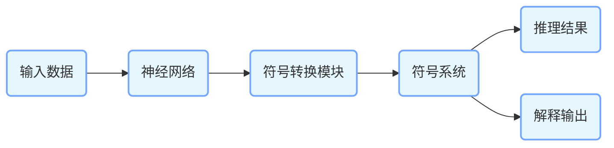

# 基于神经符号整合的可解释AI推理系统性能评估

> 关键词：神经符号整合、可解释AI、推理系统、性能评估、人工智能

> 摘要：本文聚焦于基于神经符号整合的可解释AI推理系统的性能评估。首先介绍了研究的背景，包括目的、预期读者、文档结构和相关术语。接着阐述了神经符号整合与可解释AI推理系统的核心概念及其联系，给出了原理和架构的示意图与流程图。详细讲解了核心算法原理，并结合Python代码说明具体操作步骤。探讨了相关的数学模型和公式，通过举例加深理解。进行项目实战，展示开发环境搭建、源代码实现与解读。分析了该系统的实际应用场景，推荐了学习资源、开发工具框架和相关论文著作。最后总结了未来发展趋势与挑战，提供常见问题解答和扩展阅读参考资料，旨在为该领域的研究和实践提供全面的指导。

## 1. 背景介绍 
### 1.1 目的和范围
随着人工智能技术的飞速发展，可解释性成为了AI领域的关键问题之一。基于神经符号整合的可解释AI推理系统结合了神经网络强大的感知能力和符号系统的逻辑推理能力，有望解决AI系统的黑盒问题。本研究的目的是建立一套科学合理的性能评估体系，用于评估基于神经符号整合的可解释AI推理系统的性能，范围涵盖系统的准确性、可解释性、效率等多个方面。

### 1.2 预期读者
本文预期读者包括人工智能领域的研究人员、开发者、对可解释AI感兴趣的学者以及相关行业的从业者。希望通过本文，为他们在研究和开发基于神经符号整合的可解释AI推理系统时提供性能评估的参考和指导。

### 1.3 文档结构概述
本文将按照以下结构展开：首先介绍核心概念与联系，帮助读者理解神经符号整合和可解释AI推理系统的基本原理；接着详细讲解核心算法原理和具体操作步骤，结合Python代码进行说明；然后阐述相关的数学模型和公式，并举例说明；通过项目实战展示系统的开发和性能评估过程；分析实际应用场景；推荐学习资源、开发工具框架和相关论文著作；最后总结未来发展趋势与挑战，提供常见问题解答和扩展阅读参考资料。

### 1.4 术语表
#### 1.4.1 核心术语定义
- **神经符号整合**：将神经网络和符号系统相结合的技术，充分发挥两者的优势，实现感知和推理的协同工作。
- **可解释AI**：能够以人类可理解的方式解释其决策和推理过程的人工智能系统。
- **推理系统**：基于一定的规则和知识，从已知信息中推导出新信息的系统。
- **性能评估**：对系统的各项性能指标进行量化和分析的过程。

#### 1.4.2 相关概念解释
- **神经网络**：一种模仿人类神经系统的计算模型，通过大量的神经元和连接进行信息处理和学习。
- **符号系统**：使用符号和规则来表示和处理知识的系统，具有明确的语义和逻辑结构。
- **可解释性度量**：用于衡量系统可解释性程度的指标，如解释的清晰度、可信度等。

#### 1.4.3 缩略词列表
- **AI**：Artificial Intelligence（人工智能）
- **NN**：Neural Network（神经网络）
- **SS**：Symbolic System（符号系统）
- **XAI**：Explainable Artificial Intelligence（可解释人工智能）

## 2. 核心概念与联系 
### 核心概念原理
#### 神经符号整合
神经符号整合旨在将神经网络的感知能力和符号系统的逻辑推理能力相结合。神经网络可以自动从大量数据中学习特征和模式，具有强大的模式识别能力，但缺乏明确的语义表示和逻辑推理能力。符号系统则可以使用符号和规则来表示知识和进行推理，具有明确的语义和可解释性，但在处理复杂的感知任务时效率较低。通过神经符号整合，可以实现两者的优势互补。

#### 可解释AI推理系统
可解释AI推理系统不仅要能够进行准确的推理，还要能够以人类可理解的方式解释其推理过程。基于神经符号整合的可解释AI推理系统通过神经网络对输入数据进行感知和特征提取，然后将提取的特征转化为符号表示，利用符号系统进行逻辑推理，最后输出推理结果并给出相应的解释。

### 架构的文本示意图
```plaintext
输入数据 -> 神经网络（感知与特征提取） -> 符号转换模块 -> 符号系统（逻辑推理） -> 推理结果 + 解释输出
```

### Mermaid流程图


## 3. 核心算法原理 & 具体操作步骤 
### 核心算法原理
基于神经符号整合的可解释AI推理系统的核心算法主要包括神经网络的训练、符号转换和符号推理三个部分。

#### 神经网络训练
使用深度学习算法（如卷积神经网络、循环神经网络等）对输入数据进行训练，学习数据的特征和模式。以卷积神经网络为例，其基本原理是通过卷积层、池化层和全连接层对输入图像进行特征提取和分类。

#### 符号转换
将神经网络提取的特征转化为符号表示。这可以通过定义特征与符号之间的映射关系来实现。例如，对于图像分类任务，可以将图像的特征向量映射到相应的类别符号。

#### 符号推理
利用符号系统的规则和知识进行逻辑推理。符号系统可以使用一阶逻辑、产生式规则等形式来表示知识和规则，通过推理引擎进行推理。

### 具体操作步骤（Python代码实现）
```python
import torch
import torch.nn as nn
import torch.optim as optim

# 定义一个简单的卷积神经网络
class SimpleCNN(nn.Module):
    def __init__(self):
        super(SimpleCNN, self).__init__()
        self.conv1 = nn.Conv2d(3, 16, kernel_size=3, padding=1)
        self.relu1 = nn.ReLU()
        self.pool1 = nn.MaxPool2d(2)
        self.fc1 = nn.Linear(16 * 16 * 16, 10)

    def forward(self, x):
        x = self.conv1(x)
        x = self.relu1(x)
        x = self.pool1(x)
        x = x.view(-1, 16 * 16 * 16)
        x = self.fc1(x)
        return x

# 训练神经网络
def train_model(model, train_loader, criterion, optimizer, epochs):
    model.train()
    for epoch in range(epochs):
        running_loss = 0.0
        for i, (images, labels) in enumerate(train_loader):
            optimizer.zero_grad()
            outputs = model(images)
            loss = criterion(outputs, labels)
            loss.backward()
            optimizer.step()
            running_loss += loss.item()
        print(f'Epoch {epoch + 1}, Loss: {running_loss / len(train_loader)}')

# 符号转换函数（简单示例）
def feature_to_symbol(features):
    # 这里只是简单示例，实际应用中需要根据具体任务定义映射关系
    symbol = torch.argmax(features, dim=1)
    return symbol

# 符号推理函数（简单示例）
def symbolic_reasoning(symbol):
    # 这里只是简单示例，实际应用中需要使用符号系统的规则进行推理
    if symbol == 0:
        result = "类别A"
    else:
        result = "类别B"
    return result

# 主函数
def main():
    # 初始化模型
    model = SimpleCNN()
    criterion = nn.CrossEntropyLoss()
    optimizer = optim.Adam(model.parameters(), lr=0.001)

    # 模拟训练数据加载器
    train_loader = []  # 这里需要实际加载训练数据
    epochs = 10
    train_model(model, train_loader, criterion, optimizer, epochs)

    # 模拟输入数据
    input_data = torch.randn(1, 3, 32, 32)
    features = model(input_data)
    symbol = feature_to_symbol(features)
    result = symbolic_reasoning(symbol)
    print(f'推理结果: {result}')

if __name__ == "__main__":
    main()
```

## 4. 数学模型和公式 & 详细讲解 & 举例说明 
### 神经网络的数学模型
#### 卷积层
卷积层是卷积神经网络的核心层，其数学模型可以表示为：
$$y_{i,j}^l = \sum_{m=0}^{M-1}\sum_{n=0}^{N-1}x_{i+m,j+n}^{l-1} \cdot w_{m,n}^l + b^l$$
其中，$y_{i,j}^l$ 是第 $l$ 层卷积层输出特征图中第 $(i,j)$ 位置的值，$x_{i+m,j+n}^{l-1}$ 是第 $l-1$ 层输入特征图中相应位置的值，$w_{m,n}^l$ 是卷积核的权重，$b^l$ 是偏置，$M$ 和 $N$ 是卷积核的大小。

#### 全连接层
全连接层的数学模型可以表示为：
$$y_j^l = \sum_{i=0}^{I-1}x_i^{l-1} \cdot w_{i,j}^l + b_j^l$$
其中，$y_j^l$ 是第 $l$ 层全连接层输出向量中第 $j$ 个元素的值，$x_i^{l-1}$ 是第 $l-1$ 层输入向量中第 $i$ 个元素的值，$w_{i,j}^l$ 是连接权重，$b_j^l$ 是偏置，$I$ 是输入向量的维度。

### 符号推理的数学模型
符号推理可以使用一阶逻辑进行建模。例如，对于一个简单的规则：“如果 $A$ 成立且 $B$ 成立，则 $C$ 成立”，可以表示为：
$$A \land B \Rightarrow C$$
其中，$\land$ 表示逻辑与，$\Rightarrow$ 表示逻辑蕴含。

### 举例说明
#### 神经网络示例
假设输入图像的大小为 $32 \times 32$，通道数为 3，卷积核的大小为 $3 \times 3$，卷积核的数量为 16。则卷积层的输出特征图大小为 $32 \times 32$（假设使用了适当的填充），通道数为 16。对于全连接层，如果输入特征图经过池化后大小变为 $16 \times 16$，通道数为 16，则输入向量的维度为 $16 \times 16 \times 16$。

#### 符号推理示例
假设有以下规则：
- 规则 1：如果动物是哺乳动物且会飞，则动物是蝙蝠。
- 规则 2：如果动物是鸟类且不会飞，则动物是鸵鸟。

已知事实：动物 $A$ 是哺乳动物且会飞。通过符号推理，可以得出动物 $A$ 是蝙蝠的结论。

## 5. 项目实战：代码实际案例和详细解释说明 
### 5.1  开发环境搭建
#### 操作系统
推荐使用 Linux 系统（如 Ubuntu）或 macOS，这些系统对深度学习开发有较好的支持。

#### 编程语言
使用 Python 作为开发语言，Python 具有丰富的深度学习库和工具。

#### 深度学习框架
使用 PyTorch 作为深度学习框架，PyTorch 具有动态图机制，易于调试和开发。

#### 安装依赖库
```bash
pip install torch torchvision numpy matplotlib
```

### 5.2  源代码详细实现和代码解读
```python
import torch
import torch.nn as nn
import torch.optim as optim
import torchvision
import torchvision.transforms as transforms

# 数据预处理
transform = transforms.Compose(
    [transforms.ToTensor(),
     transforms.Normalize((0.5, 0.5, 0.5), (0.5, 0.5, 0.5))])

# 加载 CIFAR-10 数据集
trainset = torchvision.datasets.CIFAR10(root='./data', train=True,
                                        download=True, transform=transform)
trainloader = torch.utils.data.DataLoader(trainset, batch_size=4,
                                          shuffle=True, num_workers=2)

testset = torchvision.datasets.CIFAR10(root='./data', train=False,
                                       download=True, transform=transform)
testloader = torch.utils.data.DataLoader(testset, batch_size=4,
                                         shuffle=False, num_workers=2)

# 定义一个简单的卷积神经网络
class SimpleCNN(nn.Module):
    def __init__(self):
        super(SimpleCNN, self).__init__()
        self.conv1 = nn.Conv2d(3, 16, kernel_size=3, padding=1)
        self.relu1 = nn.ReLU()
        self.pool1 = nn.MaxPool2d(2)
        self.conv2 = nn.Conv2d(16, 32, kernel_size=3, padding=1)
        self.relu2 = nn.ReLU()
        self.pool2 = nn.MaxPool2d(2)
        self.fc1 = nn.Linear(32 * 8 * 8, 128)
        self.relu3 = nn.ReLU()
        self.fc2 = nn.Linear(128, 10)

    def forward(self, x):
        x = self.conv1(x)
        x = self.relu1(x)
        x = self.pool1(x)
        x = self.conv2(x)
        x = self.relu2(x)
        x = self.pool2(x)
        x = x.view(-1, 32 * 8 * 8)
        x = self.fc1(x)
        x = self.relu3(x)
        x = self.fc2(x)
        return x

# 初始化模型
model = SimpleCNN()

# 定义损失函数和优化器
criterion = nn.CrossEntropyLoss()
optimizer = optim.SGD(model.parameters(), lr=0.001, momentum=0.9)

# 训练模型
for epoch in range(2):  # 训练 2 个 epoch
    running_loss = 0.0
    for i, data in enumerate(trainloader, 0):
        inputs, labels = data

        optimizer.zero_grad()

        outputs = model(inputs)
        loss = criterion(outputs, labels)
        loss.backward()
        optimizer.step()

        running_loss += loss.item()
        if i % 2000 == 1999:    # 每 2000 个 batch 打印一次损失
            print(f'[{epoch + 1}, {i + 1:5d}] loss: {running_loss / 2000:.3f}')
            running_loss = 0.0

print('Finished Training')

# 符号转换函数（简单示例）
def feature_to_symbol(features):
    symbol = torch.argmax(features, dim=1)
    return symbol

# 符号推理函数（简单示例）
def symbolic_reasoning(symbol):
    classes = ('plane', 'car', 'bird', 'cat',
               'deer', 'dog', 'frog', 'horse', 'ship', 'truck')
    result = classes[symbol.item()]
    return result

# 测试模型
dataiter = iter(testloader)
images, labels = dataiter.next()

outputs = model(images)
features = outputs
symbol = feature_to_symbol(features[0])
result = symbolic_reasoning(symbol)
print(f'推理结果: {result}')
```

### 5.3  代码解读与分析
#### 数据预处理
使用 `torchvision.transforms` 对数据进行预处理，包括将图像转换为张量和归一化处理。

#### 数据集加载
使用 `torchvision.datasets` 加载 CIFAR-10 数据集，并使用 `torch.utils.data.DataLoader` 创建数据加载器。

#### 模型定义
定义了一个简单的卷积神经网络 `SimpleCNN`，包括两个卷积层、两个池化层和两个全连接层。

#### 训练模型
使用交叉熵损失函数和随机梯度下降优化器对模型进行训练，训练 2 个 epoch。

#### 符号转换和推理
定义了简单的符号转换和推理函数，将神经网络的输出转换为符号表示，并进行简单的推理。

## 6. 实际应用场景 
### 医疗领域
在医疗诊断中，基于神经符号整合的可解释AI推理系统可以对医学影像（如X光、CT等）进行分析，同时提供可解释的诊断结果。例如，系统可以通过神经网络对影像进行特征提取，然后利用符号系统结合医学知识和规则进行推理，判断患者是否患有某种疾病，并给出诊断依据，帮助医生做出更准确的决策。

### 金融领域
在金融风险评估中，该系统可以分析客户的信用数据、交易记录等信息，进行风险评估和预测。通过神经符号整合，系统可以不仅给出风险评估结果，还能解释评估的依据和推理过程，提高金融决策的透明度和可信度。

### 交通领域
在自动驾驶中，可解释AI推理系统可以处理传感器采集的图像、雷达数据等信息，进行目标识别和决策推理。例如，系统可以识别道路上的车辆、行人等目标，同时解释其决策（如是否刹车、转向等）的原因，增强自动驾驶系统的安全性和可靠性。

## 7. 工具和资源推荐
### 7.1 学习资源推荐
#### 7.1.1 书籍推荐
- 《深度学习》（Deep Learning）：由 Ian Goodfellow、Yoshua Bengio 和 Aaron Courville 撰写，是深度学习领域的经典教材，涵盖了神经网络、卷积神经网络、循环神经网络等内容。
- 《人工智能：一种现代的方法》（Artificial Intelligence: A Modern Approach）：由 Stuart Russell 和 Peter Norvig 撰写，全面介绍了人工智能的各个方面，包括知识表示、推理、机器学习等。
- 《可解释人工智能：算法与应用》（Explainable Artificial Intelligence: Algorithms and Applications）：专注于可解释AI的理论和方法，提供了许多实际应用案例。

#### 7.1.2 在线课程
- Coursera 上的“深度学习专项课程”（Deep Learning Specialization）：由 Andrew Ng 教授授课，包括神经网络、卷积神经网络、循环神经网络等课程。
- edX 上的“人工智能导论”（Introduction to Artificial Intelligence）：由麻省理工学院（MIT）提供，介绍了人工智能的基本概念和方法。
- 哔哩哔哩（Bilibili）上有许多关于深度学习和可解释AI的教学视频，适合初学者学习。

#### 7.1.3 技术博客和网站
- Medium：有许多人工智能领域的专家和开发者在 Medium 上分享他们的研究成果和经验。
- arXiv：是一个预印本平台，提供了大量关于人工智能、机器学习等领域的最新研究论文。
- AI科技评论：专注于人工智能领域的技术报道和分析，提供了许多有价值的资讯和观点。

### 7.2 开发工具框架推荐
#### 7.2.1 IDE和编辑器
- PyCharm：是一款专门为 Python 开发设计的集成开发环境（IDE），具有强大的代码编辑、调试和分析功能。
- Jupyter Notebook：是一个交互式的开发环境，适合进行数据探索、模型训练和实验。
- Visual Studio Code：是一款轻量级的代码编辑器，支持多种编程语言和插件，具有良好的扩展性。

#### 7.2.2 调试和性能分析工具
- PyTorch Profiler：是 PyTorch 提供的性能分析工具，可以帮助开发者分析模型的性能瓶颈和资源使用情况。
- TensorBoard：是 TensorFlow 提供的可视化工具，也可以与 PyTorch 结合使用，用于可视化模型的训练过程和性能指标。
- cProfile：是 Python 标准库中的性能分析工具，可以分析 Python 代码的执行时间和调用关系。

#### 7.2.3 相关框架和库
- PyTorch：是一个开源的深度学习框架，具有动态图机制，易于调试和开发。
- TensorFlow：是另一个广泛使用的深度学习框架，具有强大的分布式训练和部署能力。
- AllenNLP：是一个用于自然语言处理的深度学习框架，提供了许多预训练模型和工具。

### 7.3 相关论文著作推荐
#### 7.3.1 经典论文
- "Neural-Symbolic Learning and Reasoning: Contributions and Challenges"：介绍了神经符号整合的基本概念和方法，以及面临的挑战。
- "Explainable Artificial Intelligence: A Tutorial Overview of Trends and Techniques"：对可解释AI的技术和方法进行了全面的综述。
- "Deep Learning"：由 Yann LeCun、Yoshua Bengio 和 Geoffrey Hinton 撰写的深度学习领域的经典综述论文。

#### 7.3.2 最新研究成果
可以通过 arXiv、ACM Digital Library、IEEE Xplore 等学术数据库搜索关于神经符号整合和可解释AI的最新研究论文。

#### 7.3.3 应用案例分析
- "Medical Image Analysis with Deep Learning: A Review"：介绍了深度学习在医学影像分析中的应用案例和研究进展。
- "Deep Learning in Finance: A Survey"：对深度学习在金融领域的应用进行了综述和分析。
- "Autonomous Driving: A Survey"：介绍了自动驾驶领域的技术和应用案例。

## 8. 总结：未来发展趋势与挑战
### 未来发展趋势
#### 更强大的神经符号整合方法
未来的研究将致力于开发更强大的神经符号整合方法，实现神经网络和符号系统的更紧密结合，提高系统的性能和可解释性。

#### 多模态融合
随着人工智能技术的发展，多模态数据（如图像、文本、语音等）的处理将变得越来越重要。基于神经符号整合的可解释AI推理系统将能够更好地处理多模态数据，实现更复杂的推理和决策。

#### 应用领域的拓展
该技术将在更多的领域得到应用，如教育、农业、工业制造等，为各行业的智能化发展提供支持。

### 挑战
#### 计算资源需求
神经符号整合系统通常需要大量的计算资源，特别是在处理大规模数据和复杂模型时。如何降低计算资源需求，提高系统的效率是一个亟待解决的问题。

#### 符号知识的获取和表示
符号系统的知识获取和表示是一个难题，需要人工手动编写大量的规则和知识。如何自动获取和表示符号知识，提高知识的质量和可用性是未来的研究方向之一。

#### 可解释性的度量和评估
目前，可解释性的度量和评估还没有统一的标准和方法。如何建立科学合理的可解释性度量和评估体系，准确评估系统的可解释性是一个挑战。

## 9. 附录：常见问题与解答
### 问题1：神经符号整合和传统的机器学习方法有什么区别？
答：传统的机器学习方法主要基于数据驱动，通过学习数据中的模式和规律进行预测和分类。而神经符号整合结合了神经网络的感知能力和符号系统的逻辑推理能力，不仅能够进行准确的预测，还能提供可解释的推理过程。

### 问题2：如何评估基于神经符号整合的可解释AI推理系统的可解释性？
答：可以从解释的清晰度、可信度、完整性等方面进行评估。例如，可以通过人工评估、用户反馈等方式来评估解释的质量，也可以使用一些定量的指标（如解释的长度、复杂度等）来衡量可解释性。

### 问题3：该系统在处理复杂问题时的性能如何？
答：系统的性能取决于多个因素，如神经网络的架构、符号系统的规则和知识、数据的质量和数量等。在处理复杂问题时，需要设计合适的模型和算法，并进行充分的训练和优化，以提高系统的性能。

## 10. 扩展阅读 & 参考资料
### 扩展阅读
- "The Future of AI: Combining Neural Networks and Symbolic Reasoning"
- "Explainable AI for Healthcare: Challenges and Opportunities"
- "Neural-Symbolic AI: A New Paradigm for Machine Learning"

### 参考资料
- Goodfellow, I., Bengio, Y., & Courville, A. (2016). Deep Learning. MIT Press.
- Russell, S. J., & Norvig, P. (2020). Artificial Intelligence: A Modern Approach. Pearson.
- Guidotti, R., Monreale, A., Ruggieri, S., Turini, F., Giannotti, F., & Pedreschi, D. (2018). A survey of methods for explaining black box models. ACM Computing Surveys (CSUR), 51(5), 1-42.

作者：AI天才研究院/AI Genius Institute & 禅与计算机程序设计艺术 /Zen And The Art of Computer Programming