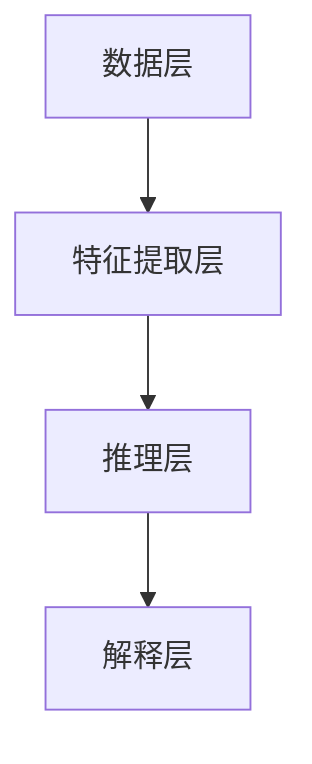

# 基于神经符号整合的可解释推理系统在医疗诊断决策中的实践

> 关键词：神经符号整合、可解释推理系统、医疗诊断决策、深度学习、符号逻辑

> 摘要：本文聚焦于基于神经符号整合的可解释推理系统在医疗诊断决策中的应用。首先介绍了该研究的背景、目的和范围，明确预期读者与文档结构。详细阐述了神经符号整合、可解释推理等核心概念及其联系，给出了相应的文本示意图和 Mermaid 流程图。深入讲解了核心算法原理，用 Python 代码进行详细阐述，同时给出数学模型和公式并举例说明。通过项目实战，展示了开发环境搭建、源代码实现与解读。探讨了该系统在医疗诊断决策中的实际应用场景，推荐了相关学习资源、开发工具框架和论文著作。最后总结了未来发展趋势与挑战，并提供了常见问题解答和扩展阅读参考资料，旨在为医疗领域利用神经符号整合技术进行可解释推理诊断提供全面的技术指导。

## 1. 背景介绍 
### 1.1 目的和范围
在医疗诊断决策领域，准确且可解释的诊断结果至关重要。传统的机器学习和深度学习模型虽然在医疗数据处理和诊断预测方面取得了一定成果，但缺乏可解释性，使得医生难以理解模型的决策过程，从而影响了其在临床实践中的广泛应用。本研究的目的是构建基于神经符号整合的可解释推理系统，将神经网络强大的数据处理能力与符号逻辑的可解释性相结合，为医疗诊断决策提供更准确、更具可解释性的支持。

本研究的范围涵盖了神经符号整合技术的原理、算法实现，以及如何将其应用于医疗诊断决策的具体实践。包括对医疗数据的处理、模型的训练与评估，以及在实际医疗场景中的应用测试。

### 1.2 预期读者
本文预期读者包括医疗领域的专业人员，如医生、医学研究人员，他们希望借助先进的技术手段提高诊断决策的准确性和可解释性；计算机科学领域的研究人员和开发者，对神经符号整合技术、可解释人工智能感兴趣，希望将其应用于医疗等实际领域；以及对医疗信息技术交叉领域有研究需求的学生和学者。

### 1.3 文档结构概述
本文将按照以下结构进行组织：首先介绍核心概念与联系，包括神经符号整合、可解释推理等概念的原理和架构；接着阐述核心算法原理和具体操作步骤，并用 Python 代码详细说明；然后给出数学模型和公式，并进行详细讲解和举例；通过项目实战展示系统的开发环境搭建、源代码实现和代码解读；探讨该系统在医疗诊断决策中的实际应用场景；推荐相关的学习资源、开发工具框架和论文著作；最后总结未来发展趋势与挑战，提供常见问题解答和扩展阅读参考资料。

### 1.4 术语表
#### 1.4.1 核心术语定义
- **神经符号整合**：将神经网络的学习能力与符号逻辑的推理能力相结合的技术，旨在发挥两者的优势，实现更强大、更可解释的智能系统。
- **可解释推理系统**：能够对其推理过程和决策结果进行解释的系统，使得用户可以理解系统是如何得出结论的。
- **医疗诊断决策**：医生根据患者的症状、检查结果等信息，运用专业知识和经验，对疾病进行诊断并制定治疗方案的过程。

#### 1.4.2 相关概念解释
- **神经网络**：一种模仿人类神经系统的计算模型，由大量的神经元组成，通过对数据的学习来自动提取特征和模式。
- **符号逻辑**：使用符号和规则进行推理和表达知识的方法，具有明确的语义和推理机制。
- **深度学习**：神经网络的一个分支，通过多层神经网络对数据进行深度特征学习，在图像识别、自然语言处理等领域取得了显著成果。

#### 1.4.3 缩略词列表
- **AI**：Artificial Intelligence，人工智能
- **ML**：Machine Learning，机器学习
- **DL**：Deep Learning，深度学习
- **NLP**：Natural Language Processing，自然语言处理

## 2. 核心概念与联系 

### 2.1 神经符号整合原理
神经符号整合的核心思想是将神经网络和符号逻辑进行有机结合。神经网络擅长处理复杂的感知任务，如对医疗图像的识别、对患者症状文本的理解等。它可以自动从大量的数据中学习到隐藏的模式和特征。而符号逻辑则具有明确的语义和推理规则，能够进行精确的知识表示和推理。

例如，在医疗诊断中，神经网络可以对患者的X光片、CT扫描等图像进行分析，提取出可能的病变特征。而符号逻辑可以根据医学知识和规则，对这些特征进行推理，判断患者可能患有的疾病。

### 2.2 可解释推理系统架构
可解释推理系统通常由数据层、特征提取层、推理层和解释层组成。

- **数据层**：负责收集和存储医疗数据，包括患者的基本信息、症状描述、检查结果等。
- **特征提取层**：使用神经网络对数据进行处理，提取出有价值的特征。例如，使用卷积神经网络（CNN）对医疗图像进行特征提取，使用循环神经网络（RNN）对文本数据进行处理。
- **推理层**：基于符号逻辑对提取的特征进行推理，得出诊断结果。可以使用专家系统、知识图谱等技术来实现推理。
- **解释层**：对推理过程和结果进行解释，使得医生可以理解系统是如何得出诊断结果的。可以使用自然语言生成技术将推理过程以自然语言的形式呈现给医生。

### 2.3 文本示意图
```plaintext
数据层（医疗数据：患者信息、症状、检查结果）
    |
    v
特征提取层（神经网络：CNN、RNN等）
    |
    v
推理层（符号逻辑：专家系统、知识图谱）
    |
    v
解释层（自然语言生成：解释推理过程和结果）
```

### 2.4 Mermaid 流程图


## 3. 核心算法原理 & 具体操作步骤 

### 3.1 核心算法原理
神经符号整合的核心算法主要包括神经网络的训练和符号逻辑的推理。

#### 3.1.1 神经网络训练
以卷积神经网络（CNN）为例，其训练过程主要包括前向传播和反向传播。前向传播是将输入数据通过卷积层、池化层和全连接层进行处理，得到输出结果。反向传播是根据输出结果与真实标签之间的误差，通过梯度下降算法更新网络的参数，使得误差最小化。

#### 3.1.2 符号逻辑推理
符号逻辑推理可以使用基于规则的推理方法，例如产生式规则。产生式规则的基本形式为“IF 条件 THEN 结论”。在医疗诊断中，可以定义一系列的规则，如“IF 患者有咳嗽、发热症状 AND 胸部X光显示肺部有阴影 THEN 患者可能患有肺炎”。

### 3.2 具体操作步骤
#### 3.2.1 数据预处理
对收集到的医疗数据进行清洗、归一化等预处理操作，以提高数据的质量和可用性。

#### 3.2.2 特征提取
使用神经网络对预处理后的数据进行特征提取。以下是一个使用 Python 和 PyTorch 实现的简单 CNN 特征提取代码示例：
```python
import torch
import torch.nn as nn

# 定义一个简单的 CNN 模型
class SimpleCNN(nn.Module):
    def __init__(self):
        super(SimpleCNN, self).__init__()
        self.conv1 = nn.Conv2d(3, 16, kernel_size=3, padding=1)
        self.relu1 = nn.ReLU()
        self.pool1 = nn.MaxPool2d(2)
        self.fc1 = nn.Linear(16 * 16 * 16, 128)
        self.relu2 = nn.ReLU()

    def forward(self, x):
        x = self.conv1(x)
        x = self.relu1(x)
        x = self.pool1(x)
        x = x.view(-1, 16 * 16 * 16)
        x = self.fc1(x)
        x = self.relu2(x)
        return x

# 初始化模型
model = SimpleCNN()

# 加载医疗图像数据
image_data = torch.randn(1, 3, 32, 32)

# 进行特征提取
features = model(image_data)
print(features.shape)
```

#### 3.2.3 符号逻辑推理
根据提取的特征，使用符号逻辑规则进行推理。以下是一个简单的基于规则的推理代码示例：
```python
# 定义规则
rules = [
    {
        "condition": lambda features: features[0] > 0.5 and features[1] > 0.5,
        "conclusion": "患者可能患有疾病 A"
    }
]

# 进行推理
for rule in rules:
    if rule["condition"](features.detach().numpy()[0]):
        print(rule["conclusion"])
```

#### 3.2.4 结果解释
使用自然语言生成技术对推理结果进行解释。例如，可以根据推理过程中使用的规则和特征，生成相应的解释文本。

## 4. 数学模型和公式 & 详细讲解 & 举例说明 

### 4.1 神经网络的数学模型
以简单的全连接神经网络为例，假设输入层有 $n$ 个神经元，隐藏层有 $m$ 个神经元，输出层有 $k$ 个神经元。输入向量为 $\mathbf{x} = [x_1, x_2, \cdots, x_n]^T$，隐藏层的输入为 $\mathbf{z}^h$，输出为 $\mathbf{a}^h$，输出层的输入为 $\mathbf{z}^o$，输出为 $\mathbf{a}^o$。

隐藏层的输入和输出计算公式如下：
$$
\mathbf{z}^h = \mathbf{W}^h \mathbf{x} + \mathbf{b}^h
$$
$$
\mathbf{a}^h = f(\mathbf{z}^h)
$$
其中，$\mathbf{W}^h$ 是隐藏层的权重矩阵，$\mathbf{b}^h$ 是隐藏层的偏置向量，$f$ 是激活函数，如 sigmoid 函数、ReLU 函数等。

输出层的输入和输出计算公式如下：
$$
\mathbf{z}^o = \mathbf{W}^o \mathbf{a}^h + \mathbf{b}^o
$$
$$
\mathbf{a}^o = g(\mathbf{z}^o)
$$
其中，$\mathbf{W}^o$ 是输出层的权重矩阵，$\mathbf{b}^o$ 是输出层的偏置向量，$g$ 是输出层的激活函数，如 softmax 函数用于多分类问题。

### 4.2 损失函数
在神经网络训练中，需要定义一个损失函数来衡量输出结果与真实标签之间的误差。常见的损失函数有均方误差（MSE）和交叉熵损失（Cross Entropy Loss）。

#### 4.2.1 均方误差（MSE）
对于回归问题，均方误差的计算公式为：
$$
L_{MSE} = \frac{1}{N} \sum_{i=1}^{N} (\mathbf{a}^o_i - \mathbf{y}_i)^2
$$
其中，$N$ 是样本数量，$\mathbf{a}^o_i$ 是第 $i$ 个样本的输出结果，$\mathbf{y}_i$ 是第 $i$ 个样本的真实标签。

#### 4.2.2 交叉熵损失（Cross Entropy Loss）
对于分类问题，交叉熵损失的计算公式为：
$$
L_{CE} = - \frac{1}{N} \sum_{i=1}^{N} \sum_{j=1}^{k} y_{ij} \log(a_{ij}^o)
$$
其中，$N$ 是样本数量，$k$ 是类别数量，$y_{ij}$ 是第 $i$ 个样本的第 $j$ 个类别的真实标签（通常为 0 或 1），$a_{ij}^o$ 是第 $i$ 个样本的第 $j$ 个类别的输出概率。

### 4.3 梯度下降算法
梯度下降算法是用于更新神经网络参数的常用方法。其基本思想是沿着损失函数的负梯度方向更新参数，使得损失函数逐渐减小。

参数更新公式如下：
$$
\mathbf{W} = \mathbf{W} - \alpha \frac{\partial L}{\partial \mathbf{W}}
$$
$$
\mathbf{b} = \mathbf{b} - \alpha \frac{\partial L}{\partial \mathbf{b}}
$$
其中，$\mathbf{W}$ 和 $\mathbf{b}$ 是神经网络的参数，$\alpha$ 是学习率，$\frac{\partial L}{\partial \mathbf{W}}$ 和 $\frac{\partial L}{\partial \mathbf{b}}$ 是损失函数对参数的偏导数。

### 4.4 举例说明
假设我们有一个简单的二分类问题，输入向量 $\mathbf{x} = [x_1, x_2]$，隐藏层有 2 个神经元，输出层有 1 个神经元。权重矩阵和偏置向量如下：
$$
\mathbf{W}^h = \begin{bmatrix}
0.1 & 0.2 \\
0.3 & 0.4
\end{bmatrix}, \quad \mathbf{b}^h = \begin{bmatrix}
0.1 \\
0.2
\end{bmatrix}
$$
$$
\mathbf{W}^o = \begin{bmatrix}
0.5 & 0.6
\end{bmatrix}, \quad \mathbf{b}^o = [0.3]
$$
输入向量 $\mathbf{x} = [0.1, 0.2]$，激活函数使用 sigmoid 函数 $f(z) = \frac{1}{1 + e^{-z}}$。

首先计算隐藏层的输入和输出：
$$
\mathbf{z}^h = \mathbf{W}^h \mathbf{x} + \mathbf{b}^h = \begin{bmatrix}
0.1 & 0.2 \\
0.3 & 0.4
\end{bmatrix} \begin{bmatrix}
0.1 \\
0.2
\end{bmatrix} + \begin{bmatrix}
0.1 \\
0.2
\end{bmatrix} = \begin{bmatrix}
0.15 \\
0.25
\end{bmatrix}
$$
$$
\mathbf{a}^h = f(\mathbf{z}^h) = \begin{bmatrix}
\frac{1}{1 + e^{-0.15}} \\
\frac{1}{1 + e^{-0.25}}
\end{bmatrix} \approx \begin{bmatrix}
0.537 \\
0.562
\end{bmatrix}
$$

然后计算输出层的输入和输出：
$$
\mathbf{z}^o = \mathbf{W}^o \mathbf{a}^h + \mathbf{b}^o = \begin{bmatrix}
0.5 & 0.6
\end{bmatrix} \begin{bmatrix}
0.537 \\
0.562
\end{bmatrix} + 0.3 \approx 0.804
$$
$$
\mathbf{a}^o = f(\mathbf{z}^o) = \frac{1}{1 + e^{-0.804}} \approx 0.69
$$

假设真实标签 $\mathbf{y} = [1]$，使用交叉熵损失计算误差：
$$
L_{CE} = - (1 \times \log(0.69) + (1 - 1) \times \log(1 - 0.69)) \approx 0.37
$$

## 5. 项目实战：代码实际案例和详细解释说明 

### 5.1  开发环境搭建
#### 5.1.1 安装 Python
建议使用 Python 3.7 及以上版本，可以从 Python 官方网站（https://www.python.org/downloads/）下载并安装。

#### 5.1.2 安装必要的库
使用 pip 安装以下必要的库：
```sh
pip install torch torchvision numpy pandas matplotlib scikit-learn
```

#### 5.1.3 准备医疗数据集
可以从公开的医疗数据集中获取数据，如 Kaggle 上的医疗图像数据集、医疗文本数据集等。将数据集下载并解压到合适的目录。

### 5.2  源代码详细实现和代码解读
#### 5.2.1 数据加载和预处理
```python
import torch
from torchvision import datasets, transforms
from torch.utils.data import DataLoader

# 定义数据预处理步骤
transform = transforms.Compose([
    transforms.Resize((32, 32)),
    transforms.ToTensor(),
    transforms.Normalize((0.5, 0.5, 0.5), (0.5, 0.5, 0.5))
])

# 加载医疗图像数据集
train_dataset = datasets.ImageFolder(root='path/to/train/data', transform=transform)
test_dataset = datasets.ImageFolder(root='path/to/test/data', transform=transform)

# 创建数据加载器
train_loader = DataLoader(train_dataset, batch_size=32, shuffle=True)
test_loader = DataLoader(test_dataset, batch_size=32, shuffle=False)
```
代码解读：首先定义了数据预处理步骤，包括图像的缩放、转换为张量和归一化。然后使用 `torchvision.datasets.ImageFolder` 加载医疗图像数据集，并使用 `torch.utils.data.DataLoader` 创建数据加载器，方便批量处理数据。

#### 5.2.2 定义神经网络模型
```python
import torch.nn as nn

class MedicalCNN(nn.Module):
    def __init__(self):
        super(MedicalCNN, self).__init__()
        self.conv1 = nn.Conv2d(3, 16, kernel_size=3, padding=1)
        self.relu1 = nn.ReLU()
        self.pool1 = nn.MaxPool2d(2)
        self.conv2 = nn.Conv2d(16, 32, kernel_size=3, padding=1)
        self.relu2 = nn.ReLU()
        self.pool2 = nn.MaxPool2d(2)
        self.fc1 = nn.Linear(32 * 8 * 8, 128)
        self.relu3 = nn.ReLU()
        self.fc2 = nn.Linear(128, 10)

    def forward(self, x):
        x = self.conv1(x)
        x = self.relu1(x)
        x = self.pool1(x)
        x = self.conv2(x)
        x = self.relu2(x)
        x = self.pool2(x)
        x = x.view(-1, 32 * 8 * 8)
        x = self.fc1(x)
        x = self.relu3(x)
        x = self.fc2(x)
        return x

# 初始化模型
model = MedicalCNN()
```
代码解读：定义了一个简单的卷积神经网络 `MedicalCNN`，包括两个卷积层、两个池化层和两个全连接层。`forward` 方法定义了数据在网络中的前向传播过程。

#### 5.2.3 训练模型
```python
import torch.optim as optim

# 定义损失函数和优化器
criterion = nn.CrossEntropyLoss()
optimizer = optim.Adam(model.parameters(), lr=0.001)

# 训练模型
num_epochs = 10
for epoch in range(num_epochs):
    running_loss = 0.0
    for i, (images, labels) in enumerate(train_loader):
        optimizer.zero_grad()
        outputs = model(images)
        loss = criterion(outputs, labels)
        loss.backward()
        optimizer.step()
        running_loss += loss.item()
    print(f'Epoch {epoch + 1}, Loss: {running_loss / len(train_loader)}')
```
代码解读：使用交叉熵损失函数和 Adam 优化器进行模型训练。在每个 epoch 中，遍历训练数据加载器，计算损失并进行反向传播更新模型参数。

#### 5.2.4 符号逻辑推理和结果解释
```python
# 定义符号逻辑规则
rules = [
    {
        "condition": lambda outputs: torch.argmax(outputs, dim=1) == 0,
        "conclusion": "患者可能患有疾病 A"
    },
    {
        "condition": lambda outputs: torch.argmax(outputs, dim=1) == 1,
        "conclusion": "患者可能患有疾病 B"
    }
]

# 进行推理和解释
with torch.no_grad():
    for images, labels in test_loader:
        outputs = model(images)
        for i in range(len(outputs)):
            for rule in rules:
                if rule["condition"](outputs[i].unsqueeze(0)):
                    print(f'图像 {i + 1}: {rule["conclusion"]}')
```
代码解读：定义了符号逻辑规则，根据模型的输出进行推理，并输出相应的诊断结论。

### 5.3  代码解读与分析
#### 5.3.1 数据加载和预处理
数据加载和预处理是模型训练的基础。通过对图像进行缩放、转换为张量和归一化，可以提高模型的训练效果。

#### 5.3.2 神经网络模型
定义的卷积神经网络可以自动提取图像的特征，通过卷积层和池化层减少参数数量，提高模型的泛化能力。

#### 5.3.3 模型训练
使用交叉熵损失函数和 Adam 优化器可以有效地训练模型。在训练过程中，通过反向传播更新模型参数，使得损失函数逐渐减小。

#### 5.3.4 符号逻辑推理和结果解释
符号逻辑推理可以根据模型的输出进行进一步的判断，结合医学知识和规则得出诊断结论。结果解释可以帮助医生理解模型的决策过程。

## 6. 实际应用场景 
### 6.1 疾病诊断
基于神经符号整合的可解释推理系统可以辅助医生进行疾病诊断。例如，在肺炎诊断中，系统可以对患者的胸部X光片进行分析，提取特征，然后根据符号逻辑规则判断患者是否患有肺炎，并给出相应的解释。

### 6.2 治疗方案推荐
系统可以根据患者的诊断结果和个人信息，结合医学知识和临床经验，推荐合适的治疗方案。例如，对于患有糖尿病的患者，系统可以根据患者的血糖水平、并发症情况等，推荐合适的药物治疗方案。

### 6.3 医疗风险评估
通过对患者的历史数据和当前状况进行分析，系统可以评估患者的医疗风险。例如，预测患者在手术过程中可能出现的并发症，帮助医生做好相应的准备。

### 6.4 医学研究支持
该系统可以为医学研究提供支持。例如，分析大量的医疗数据，发现疾病的发病规律和影响因素，为医学研究提供数据支持和决策依据。

## 7. 工具和资源推荐
### 7.1 学习资源推荐
#### 7.1.1 书籍推荐
- 《深度学习》（Deep Learning）：由 Ian Goodfellow、Yoshua Bengio 和 Aaron Courville 编写，是深度学习领域的经典教材，全面介绍了深度学习的理论和应用。
- 《Python 机器学习》（Python Machine Learning）：由 Sebastian Raschka 和 Vahid Mirjalili 编写，详细介绍了使用 Python 进行机器学习的方法和技巧。
- 《人工智能：一种现代的方法》（Artificial Intelligence: A Modern Approach）：由 Stuart Russell 和 Peter Norvig 编写，是人工智能领域的权威教材，涵盖了人工智能的各个方面。

#### 7.1.2 在线课程
- Coursera 上的“深度学习专项课程”（Deep Learning Specialization）：由 Andrew Ng 教授授课，包括神经网络、卷积神经网络、循环神经网络等内容。
- edX 上的“人工智能导论”（Introduction to Artificial Intelligence）：由麻省理工学院（MIT）的 Patrick Winston 教授授课，介绍了人工智能的基本概念和方法。
- Udemy 上的“Python 数据科学和机器学习实战”（Python for Data Science and Machine Learning Bootcamp）：详细介绍了使用 Python 进行数据科学和机器学习的实战技巧。

#### 7.1.3 技术博客和网站
- Medium 上的 Towards Data Science：是一个专注于数据科学和机器学习的技术博客，有很多优秀的文章和教程。
- arXiv：是一个预印本服务器，提供了大量的学术论文，包括人工智能、机器学习等领域的最新研究成果。
- Kaggle：是一个数据科学竞赛平台，有很多数据集和优秀的解决方案，可以学习到很多实际应用的技巧。

### 7.2 开发工具框架推荐
#### 7.2.1 IDE和编辑器
- PyCharm：是一款专门为 Python 开发设计的集成开发环境（IDE），具有强大的代码编辑、调试和项目管理功能。
- Jupyter Notebook：是一个交互式的开发环境，适合进行数据分析和模型实验，可以实时查看代码的运行结果。
- Visual Studio Code：是一款轻量级的代码编辑器，支持多种编程语言，有丰富的插件可以扩展功能。

#### 7.2.2 调试和性能分析工具
- PyTorch Profiler：是 PyTorch 提供的性能分析工具，可以帮助开发者分析模型的性能瓶颈，优化代码。
- TensorBoard：是 TensorFlow 提供的可视化工具，也可以用于 PyTorch 模型的可视化和调试，方便查看模型的训练过程和性能指标。
- cProfile：是 Python 标准库中的性能分析工具，可以分析 Python 代码的运行时间和函数调用情况。

#### 7.2.3 相关框架和库
- PyTorch：是一个开源的深度学习框架，具有动态图机制，方便模型的开发和调试。
- TensorFlow：是另一个广泛使用的深度学习框架，提供了丰富的工具和库，适合大规模的深度学习应用。
- scikit-learn：是一个用于机器学习的 Python 库，提供了多种机器学习算法和工具，如分类、回归、聚类等。

### 7.3 相关论文著作推荐
#### 7.3.1 经典论文
- “Deep Residual Learning for Image Recognition”：提出了残差网络（ResNet），解决了深度神经网络训练过程中的梯度消失问题。
- “Attention Is All You Need”：提出了 Transformer 模型，在自然语言处理领域取得了巨大的成功。
- “Neural-Symbolic Learning and Reasoning: Contributions and Challenges”：对神经符号整合技术进行了全面的综述和分析。

#### 7.3.2 最新研究成果
- 关注 arXiv 上关于神经符号整合、可解释人工智能、医疗人工智能等领域的最新论文，了解最新的研究动态和技术进展。
- 参加相关的学术会议，如 NeurIPS、ICML、AAAI 等，获取最新的研究成果和交流机会。

#### 7.3.3 应用案例分析
- 查看 Kaggle 上的医疗数据竞赛解决方案，学习如何将神经符号整合技术应用于实际的医疗诊断决策问题。
- 阅读相关的学术论文和报告，了解神经符号整合技术在医疗领域的实际应用案例和效果。

## 8. 总结：未来发展趋势与挑战
### 8.1 未来发展趋势
#### 8.1.1 更强大的神经符号整合方法
未来，将不断探索更有效的神经符号整合方法，提高系统的推理能力和可解释性。例如，结合强化学习和符号逻辑，实现更智能的决策和推理。

#### 8.1.2 跨模态数据融合
医疗数据包括图像、文本、生理信号等多种模态，未来的系统将能够更好地融合这些跨模态数据，提供更全面、准确的诊断结果。

#### 8.1.3 与医疗信息系统的深度集成
将神经符号整合的可解释推理系统与医院的电子病历系统、医疗设备等进行深度集成，实现数据的实时共享和交互，提高医疗诊断决策的效率和准确性。

### 8.2 挑战
#### 8.2.1 数据质量和隐私问题
医疗数据的质量和隐私是一个重要的挑战。需要确保数据的准确性、完整性和安全性，同时遵守相关的法律法规，保护患者的隐私。

#### 8.2.2 模型的可解释性和可靠性
虽然神经符号整合技术提高了模型的可解释性，但仍然需要进一步提高解释的准确性和可靠性，让医生能够真正信任系统的诊断结果。

#### 8.2.3 技术的普及和应用
将神经符号整合技术应用于实际的医疗诊断决策中，需要解决技术的普及和应用问题。医生和医疗机构需要接受相关的培训，提高对新技术的认知和应用能力。

## 9. 附录：常见问题与解答
### 9.1 神经符号整合技术与传统机器学习技术有什么区别？
传统机器学习技术主要依赖于数据驱动的方法，通过对大量数据的学习来建立模型，但缺乏可解释性。神经符号整合技术将神经网络的学习能力与符号逻辑的推理能力相结合，既能够处理复杂的数据，又能够提供可解释的推理结果。

### 9.2 如何评估可解释推理系统的性能？
可以从多个方面评估可解释推理系统的性能，包括诊断准确性、解释的合理性和可理解性、系统的鲁棒性等。可以使用真实的医疗数据进行测试和验证，与医生的诊断结果进行对比。

### 9.3 神经符号整合技术在医疗诊断决策中的应用是否会取代医生？
不会。神经符号整合技术可以为医生提供辅助诊断和决策支持，但不能取代医生的专业判断和临床经验。医生仍然需要根据患者的具体情况，综合考虑各种因素，做出最终的诊断和治疗决策。

### 9.4 如何解决医疗数据的质量和隐私问题？
可以通过数据清洗、预处理等方法提高医疗数据的质量。在数据隐私方面，可以采用加密技术、匿名化处理等方法保护患者的隐私。同时，需要遵守相关的法律法规，确保数据的合法使用。

## 10. 扩展阅读 & 参考资料
### 10.1 扩展阅读
- 《可解释人工智能》（Explainable Artificial Intelligence）：深入探讨了可解释人工智能的理论和方法。
- 《医疗人工智能》（Medical Artificial Intelligence）：介绍了人工智能在医疗领域的应用和发展趋势。
- 《知识图谱：方法、实践与应用》（Knowledge Graph: Methods, Practices and Applications）：详细介绍了知识图谱的构建和应用，对神经符号整合技术有重要的参考价值。

### 10.2 参考资料
- 相关的学术论文和研究报告，如在 IEEE、ACM 等学术数据库中搜索关于神经符号整合、可解释人工智能、医疗诊断决策等方面的论文。
- 开源代码库，如 GitHub 上的相关项目，学习他人的代码实现和经验。

作者：AI天才研究院/AI Genius Institute & 禅与计算机程序设计艺术 /Zen And The Art of Computer Programming