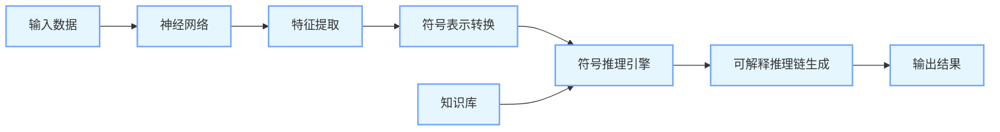

# 基于神经符号整合的可解释推理链生成技术

> 关键词：神经符号整合、可解释推理链、生成技术、人工智能、知识表示

> 摘要：本文围绕基于神经符号整合的可解释推理链生成技术展开深入探讨。首先介绍了该技术提出的背景、目的、适用读者以及文档结构等信息。接着详细阐述了神经符号整合和可解释推理链的核心概念及其联系，并给出相应的原理和架构示意图与流程图。通过Python代码对核心算法原理和具体操作步骤进行了详细说明，同时给出了相关的数学模型和公式，并举例进行解释。在项目实战部分，从开发环境搭建到源代码实现及解读进行了全面分析。此外，还探讨了该技术的实际应用场景，推荐了相关的学习资源、开发工具框架以及论文著作。最后总结了该技术的未来发展趋势与挑战，并提供了常见问题解答和扩展阅读参考资料，旨在为读者全面深入地了解该技术提供有益的指导。

## 1. 背景介绍 
### 1.1 目的和范围
在人工智能领域，可解释性一直是一个重要且具有挑战性的问题。传统的神经网络模型虽然在很多任务上取得了优异的性能，但它们往往像“黑盒”一样，难以理解其决策过程。而符号推理系统具有明确的逻辑规则和可解释性，但在处理复杂的、不确定的信息时存在一定的局限性。基于神经符号整合的可解释推理链生成技术旨在结合神经网络强大的感知能力和符号系统的可解释性，生成能够清晰展示推理过程的推理链，从而提高人工智能系统的可解释性和可信度。

本文的范围主要涵盖了该技术的核心概念、算法原理、数学模型、项目实战、应用场景以及相关的工具和资源推荐等方面，旨在为读者提供一个全面深入的技术指南。

### 1.2 预期读者
本文预期读者包括人工智能领域的研究人员、工程师、开发者，以及对可解释人工智能技术感兴趣的学生和爱好者。对于希望了解如何将神经和符号技术相结合以实现可解释推理的读者，本文将提供有价值的信息和实践指导。

### 1.3 文档结构概述
本文的结构如下：首先介绍技术背景，包括目的、预期读者和文档结构概述；接着阐述核心概念与联系，通过示意图和流程图帮助读者理解；然后详细讲解核心算法原理和具体操作步骤，结合Python代码进行说明；随后给出数学模型和公式，并举例解释；在项目实战部分，介绍开发环境搭建、源代码实现和代码解读；之后探讨实际应用场景；再推荐相关的工具和资源；最后总结未来发展趋势与挑战，提供常见问题解答和扩展阅读参考资料。

### 1.4 术语表
#### 1.4.1 核心术语定义
- **神经符号整合**：将神经网络技术和符号推理技术相结合，充分发挥两者的优势，实现更强大、更可解释的人工智能系统。
- **可解释推理链**：一系列有序的推理步骤，能够清晰地展示从输入到输出的推理过程，使得人工智能系统的决策具有可解释性。
- **神经网络**：一种模仿人类神经系统的计算模型，由大量的神经元组成，能够自动学习数据中的模式和特征。
- **符号推理**：基于符号逻辑和规则进行推理的方法，具有明确的语义和可解释性。

#### 1.4.2 相关概念解释
- **知识表示**：将现实世界中的知识以计算机能够理解和处理的方式进行表示，常见的知识表示方法包括符号表示、向量表示等。
- **推理引擎**：用于执行推理任务的程序模块，根据给定的知识和规则进行推理，得出结论。

#### 1.4.3 缩略词列表
- **NN**：Neural Network，神经网络
- **KB**：Knowledge Base，知识库

## 2. 核心概念与联系 

### 2.1 神经符号整合原理
神经符号整合的核心思想是将神经网络的感知能力和符号推理的可解释性相结合。神经网络可以自动从数据中学习特征和模式，而符号推理则可以基于逻辑规则进行精确的推理。通过将两者结合，可以实现既能够处理复杂数据又具有可解释性的人工智能系统。

例如，在自然语言处理任务中，神经网络可以用于对文本进行语义理解和特征提取，而符号推理则可以根据提取的特征和预定义的规则进行推理，得出结论。

### 2.2 可解释推理链的概念
可解释推理链是指一系列有序的推理步骤，每个步骤都有明确的逻辑依据和语义解释。通过生成可解释推理链，可以让用户清楚地了解人工智能系统是如何从输入数据得出输出结果的，从而提高系统的可解释性和可信度。

例如，在医疗诊断系统中，可解释推理链可以展示从患者的症状、检查结果到最终诊断结论的推理过程，医生可以根据推理链来验证诊断结果的合理性。

### 2.3 核心概念的架构示意图
下面是神经符号整合与可解释推理链生成的架构示意图：



该架构的工作流程如下：
1. 输入数据首先经过神经网络进行特征提取。
2. 提取的特征被转换为符号表示。
3. 符号推理引擎根据知识库中的规则和符号表示进行推理。
4. 生成可解释推理链，并输出最终结果。

## 3. 核心算法原理 & 具体操作步骤 

### 3.1 核心算法原理
基于神经符号整合的可解释推理链生成算法主要包括以下几个步骤：
1. **特征提取**：使用神经网络对输入数据进行特征提取。例如，在图像识别任务中，可以使用卷积神经网络（CNN）提取图像的特征；在自然语言处理任务中，可以使用循环神经网络（RNN）或Transformer模型提取文本的特征。
2. **符号表示转换**：将提取的特征转换为符号表示。可以使用聚类算法或预定义的规则将特征映射到符号空间。
3. **符号推理**：基于符号表示和知识库中的规则进行推理。可以使用逻辑推理算法，如前向推理、后向推理等。
4. **推理链生成**：根据推理过程生成可解释推理链。可以使用图算法，如深度优先搜索、广度优先搜索等，来构建推理链。

### 3.2 具体操作步骤及Python代码实现
下面是一个简单的基于神经符号整合的可解释推理链生成的Python代码示例：

```python
import numpy as np
from sklearn.cluster import KMeans
from sympy import symbols, Eq, solve

# 步骤1：特征提取
def feature_extraction(input_data):
    # 这里简单模拟特征提取，实际应用中可以使用具体的神经网络模型
    return np.random.rand(len(input_data), 10)

# 步骤2：符号表示转换
def symbol_representation_conversion(features):
    # 使用KMeans聚类将特征转换为符号表示
    kmeans = KMeans(n_clusters=3)
    labels = kmeans.fit_predict(features)
    return labels

# 步骤3：符号推理
def symbolic_reasoning(symbols):
    # 定义符号变量
    x, y, z = symbols('x y z')
    # 定义规则
    rule1 = Eq(x + y, 10)
    rule2 = Eq(y + z, 20)
    # 根据符号进行推理
    solutions = solve((rule1, rule2), (x, y, z))
    return solutions

# 步骤4：推理链生成
def reasoning_chain_generation(solutions):
    # 简单模拟推理链生成
    chain = []
    for var, value in solutions.items():
        chain.append(f"{var} = {value}")
    return chain

# 主函数
def main():
    input_data = np.random.rand(100, 20)
    # 步骤1：特征提取
    features = feature_extraction(input_data)
    # 步骤2：符号表示转换
    symbols = symbol_representation_conversion(features)
    # 步骤3：符号推理
    solutions = symbolic_reasoning(symbols)
    # 步骤4：推理链生成
    chain = reasoning_chain_generation(solutions)
    print("可解释推理链：", chain)

if __name__ == "__main__":
    main()
```

### 3.3 代码解释
- **feature_extraction**：该函数模拟了特征提取的过程，实际应用中可以使用具体的神经网络模型进行特征提取。
- **symbol_representation_conversion**：使用KMeans聚类算法将特征转换为符号表示。
- **symbolic_reasoning**：使用SymPy库进行符号推理，定义了一些规则并求解方程。
- **reasoning_chain_generation**：根据推理结果生成可解释推理链。
- **main**：主函数，依次调用上述四个步骤，最终输出可解释推理链。

## 4. 数学模型和公式 & 详细讲解 & 举例说明 

### 4.1 特征提取的数学模型
在特征提取阶段，通常使用神经网络来提取输入数据的特征。以卷积神经网络（CNN）为例，其数学模型可以表示为：

$$
\mathbf{y} = f(W \ast \mathbf{x} + b)
$$

其中，$\mathbf{x}$ 是输入数据，$W$ 是卷积核，$\ast$ 表示卷积操作，$b$ 是偏置项，$f$ 是激活函数，$\mathbf{y}$ 是提取的特征。

### 4.2 符号表示转换的数学模型
在符号表示转换阶段，通常使用聚类算法将特征映射到符号空间。以KMeans聚类为例，其目标是最小化样本到其所属聚类中心的距离之和：

$$
\min_{C} \sum_{i=1}^{n} \min_{c_j \in C} \| \mathbf{x}_i - c_j \|^2
$$

其中，$C = \{ c_1, c_2, \cdots, c_k \}$ 是聚类中心的集合，$\mathbf{x}_i$ 是第 $i$ 个样本，$k$ 是聚类的数量。

### 4.3 符号推理的数学模型
在符号推理阶段，通常使用逻辑规则进行推理。以命题逻辑为例，假设我们有以下规则：

- 规则1：$A \land B \Rightarrow C$
- 规则2：$C \land D \Rightarrow E$

如果已知 $A$ 和 $B$ 为真，那么可以通过规则1推出 $C$ 为真；再结合 $D$ 为真，可以通过规则2推出 $E$ 为真。

### 4.4 举例说明
假设我们有一个简单的图像分类任务，输入是一张猫的图像。
1. **特征提取**：使用CNN对图像进行特征提取，得到一个特征向量 $\mathbf{y}$。
2. **符号表示转换**：使用KMeans聚类将特征向量 $\mathbf{y}$ 映射到符号空间，假设得到符号 “猫特征类”。
3. **符号推理**：根据知识库中的规则 “如果图像具有猫特征类，则图像为猫”，可以推出该图像为猫。
4. **推理链生成**：生成的推理链为 “输入图像 -> 提取猫特征 -> 属于猫特征类 -> 根据规则判断为猫”。

## 5. 项目实战：代码实际案例和详细解释说明 

### 5.1  开发环境搭建
#### 5.1.1 安装Python
首先需要安装Python环境，建议使用Python 3.7及以上版本。可以从Python官方网站（https://www.python.org/downloads/）下载并安装。

#### 5.1.2 安装必要的库
使用以下命令安装必要的库：

```bash
pip install numpy scikit-learn sympy
```

### 5.2  源代码详细实现和代码解读
以下是一个更完整的基于神经符号整合的可解释推理链生成的Python代码示例：

```python
import numpy as np
from sklearn.cluster import KMeans
from sympy import symbols, Eq, solve

# 步骤1：特征提取
class FeatureExtractor:
    def __init__(self):
        pass

    def extract(self, input_data):
        # 这里简单模拟特征提取，实际应用中可以使用具体的神经网络模型
        return np.random.rand(len(input_data), 10)

# 步骤2：符号表示转换
class SymbolConverter:
    def __init__(self, n_clusters=3):
        self.kmeans = KMeans(n_clusters=n_clusters)

    def convert(self, features):
        labels = self.kmeans.fit_predict(features)
        return labels

# 步骤3：符号推理
class SymbolicReasoner:
    def __init__(self):
        self.x, self.y, self.z = symbols('x y z')
        self.rule1 = Eq(self.x + self.y, 10)
        self.rule2 = Eq(self.y + self.z, 20)

    def reason(self, symbols):
        solutions = solve((self.rule1, self.rule2), (self.x, self.y, self.z))
        return solutions

# 步骤4：推理链生成
class ReasoningChainGenerator:
    def __init__(self):
        pass

    def generate(self, solutions):
        chain = []
        for var, value in solutions.items():
            chain.append(f"{var} = {value}")
        return chain

# 主类
class InterpretableReasoningChainSystem:
    def __init__(self):
        self.feature_extractor = FeatureExtractor()
        self.symbol_converter = SymbolConverter()
        self.symbolic_reasoner = SymbolicReasoner()
        self.reasoning_chain_generator = ReasoningChainGenerator()

    def run(self, input_data):
        # 步骤1：特征提取
        features = self.feature_extractor.extract(input_data)
        # 步骤2：符号表示转换
        symbols = self.symbol_converter.convert(features)
        # 步骤3：符号推理
        solutions = self.symbolic_reasoner.reason(symbols)
        # 步骤4：推理链生成
        chain = self.reasoning_chain_generator.generate(solutions)
        return chain

# 主函数
def main():
    input_data = np.random.rand(100, 20)
    system = InterpretableReasoningChainSystem()
    chain = system.run(input_data)
    print("可解释推理链：", chain)

if __name__ == "__main__":
    main()
```

### 5.3  代码解读与分析
- **FeatureExtractor**：该类负责特征提取，`extract` 方法模拟了特征提取的过程，实际应用中可以使用具体的神经网络模型。
- **SymbolConverter**：该类负责符号表示转换，使用KMeans聚类算法将特征转换为符号表示。
- **SymbolicReasoner**：该类负责符号推理，定义了一些规则并使用SymPy库进行求解。
- **ReasoningChainGenerator**：该类负责推理链生成，根据推理结果生成可解释推理链。
- **InterpretableReasoningChainSystem**：主类，依次调用上述四个步骤，最终输出可解释推理链。
- **main**：主函数，创建主类的实例并运行系统，输出可解释推理链。

## 6. 实际应用场景 
### 6.1 医疗诊断
在医疗诊断领域，基于神经符号整合的可解释推理链生成技术可以帮助医生更好地理解诊断结果。通过分析患者的症状、检查结果等数据，系统可以生成可解释推理链，展示从数据到诊断结论的推理过程。医生可以根据推理链来验证诊断结果的合理性，提高诊断的准确性和可信度。

### 6.2 金融风险评估
在金融领域，该技术可以用于风险评估。通过分析客户的信用记录、财务状况等数据，系统可以生成可解释推理链，展示风险评估的过程和依据。金融机构可以根据推理链来做出更明智的决策，降低风险。

### 6.3 智能客服
在智能客服领域，该技术可以提高客服系统的可解释性。当用户提出问题时，系统可以生成可解释推理链，展示如何从用户的问题到给出答案的推理过程。用户可以更好地理解系统的回答，提高用户满意度。

## 7. 工具和资源推荐
### 7.1 学习资源推荐
#### 7.1.1 书籍推荐
- 《人工智能：一种现代的方法》：这本书是人工智能领域的经典教材，涵盖了人工智能的各个方面，包括知识表示、推理、机器学习等。
- 《深度学习》：由Ian Goodfellow、Yoshua Bengio和Aaron Courville合著，是深度学习领域的权威书籍，介绍了深度学习的基本原理和应用。

#### 7.1.2 在线课程
- Coursera上的“人工智能基础”课程：由知名教授授课，系统地介绍了人工智能的基本概念和方法。
- edX上的“深度学习”课程：提供了深度学习的深入学习内容，包括神经网络、卷积神经网络等。

#### 7.1.3 技术博客和网站
- Medium上的人工智能相关博客：有很多人工智能领域的专家分享他们的研究成果和实践经验。
- arXiv.org：一个预印本平台，提供了大量的人工智能相关的研究论文。

### 7.2 开发工具框架推荐
#### 7.2.1 IDE和编辑器
- PyCharm：一款功能强大的Python集成开发环境，提供了代码编辑、调试、版本控制等功能。
- Jupyter Notebook：一个交互式的开发环境，适合进行数据探索和模型实验。

#### 7.2.2 调试和性能分析工具
- TensorBoard：TensorFlow提供的可视化工具，可以用于查看模型的训练过程和性能指标。
- Py-Spy：一个Python性能分析工具，可以帮助开发者找出代码中的性能瓶颈。

#### 7.2.3 相关框架和库
- TensorFlow：一个开源的深度学习框架，提供了丰富的工具和库，用于构建和训练神经网络。
- PyTorch：另一个流行的深度学习框架，具有动态图的优势，易于使用和调试。
- SymPy：一个Python库，用于符号计算和推理。

### 7.3 相关论文著作推荐
#### 7.3.1 经典论文
- “Neural-Symbolic Learning and Reasoning: Contributions and Challenges”：这篇论文介绍了神经符号学习和推理的基本概念和方法，分析了该领域的挑战和机遇。
- “Explainable AI: An Overview”：对可解释人工智能进行了全面的综述，介绍了各种可解释性方法和技术。

#### 7.3.2 最新研究成果
- 可以关注顶级人工智能会议，如NeurIPS、ICML、ACL等，这些会议上会有很多关于神经符号整合和可解释推理的最新研究成果。

#### 7.3.3 应用案例分析
- 一些实际应用案例可以在相关的行业报告和学术论文中找到，通过分析这些案例可以更好地了解该技术在实际中的应用效果。

## 8. 总结：未来发展趋势与挑战
### 8.1 未来发展趋势
- **更强大的整合方法**：未来将不断探索更有效的神经符号整合方法，以提高系统的性能和可解释性。
- **跨领域应用**：该技术将在更多领域得到应用，如交通、能源、教育等，为各行业带来更智能、更可解释的解决方案。
- **与其他技术的融合**：将与其他技术，如区块链、物联网等融合，创造出更具创新性的应用场景。

### 8.2 挑战
- **数据质量和数量**：神经符号整合需要大量高质量的数据，数据的质量和数量将直接影响系统的性能。
- **计算资源需求**：神经网络和符号推理都需要大量的计算资源，如何在有限的资源下实现高效的推理是一个挑战。
- **可解释性评估标准**：目前缺乏统一的可解释性评估标准，如何准确评估推理链的可解释性是一个亟待解决的问题。

## 9. 附录：常见问题与解答
### 9.1 神经符号整合的优势是什么？
神经符号整合结合了神经网络的强大感知能力和符号推理的可解释性，既能够处理复杂的数据，又能够提供清晰的推理过程，提高了人工智能系统的可解释性和可信度。

### 9.2 如何选择合适的聚类算法进行符号表示转换？
选择合适的聚类算法需要考虑数据的特点和任务的需求。如果数据具有明显的聚类结构，可以选择KMeans聚类；如果数据分布复杂，可以选择层次聚类或DBSCAN等算法。

### 9.3 可解释推理链的长度是否会影响系统的性能？
可解释推理链的长度可能会影响系统的性能。如果推理链过长，可能会导致推理时间增加，同时也会增加理解的难度。因此，需要在可解释性和性能之间进行权衡。

## 10. 扩展阅读 & 参考资料
### 10.1 扩展阅读
- 可以阅读更多关于知识表示、推理算法、深度学习等方面的书籍和论文，以深入了解相关技术。
- 关注人工智能领域的最新研究动态和发展趋势，参加相关的学术会议和研讨会。

### 10.2 参考资料
- 《人工智能：一种现代的方法》，Stuart Russell, Peter Norvig
- “Neural-Symbolic Learning and Reasoning: Contributions and Challenges”，Artur d’Avila Garcez et al.
- TensorFlow官方文档（https://www.tensorflow.org/）
- PyTorch官方文档（https://pytorch.org/）

作者：AI天才研究院/AI Genius Institute & 禅与计算机程序设计艺术 /Zen And The Art of Computer Programming