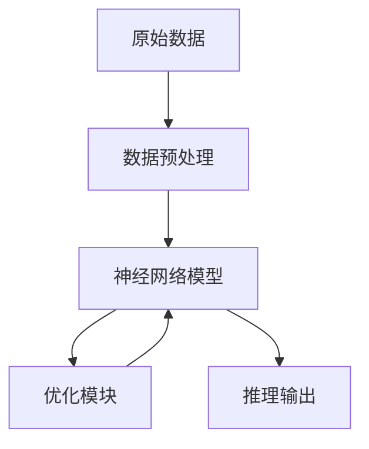

# 基于神经网络的复杂系统推理模型优化

> 关键词：神经网络、复杂系统、推理模型、优化算法、深度学习

> 摘要：本文聚焦于基于神经网络的复杂系统推理模型优化问题。在当今复杂多变的环境下，复杂系统的准确推理面临诸多挑战，而神经网络凭借其强大的非线性映射能力为解决这些问题提供了有效途径。文章深入探讨了复杂系统推理模型的核心概念、算法原理、数学模型等方面，通过详细的项目实战案例展示了优化过程，并分析了其实际应用场景。同时，推荐了相关的学习资源、开发工具和论文著作，最后对未来发展趋势与挑战进行了总结，旨在为相关领域的研究和实践提供全面且深入的参考。

## 1. 背景介绍 
### 1.1 目的和范围
在现代科技发展的浪潮中，复杂系统无处不在，如生态系统、金融市场、交通网络等。这些系统具有高度的复杂性、不确定性和动态性，对其进行准确的推理和预测具有重要的理论和实际意义。基于神经网络的复杂系统推理模型能够处理大量的数据和复杂的关系，但现有的模型在性能、准确性和效率等方面仍存在不足。本文的目的在于深入研究如何对基于神经网络的复杂系统推理模型进行优化，提高其在复杂系统中的推理能力和性能。范围涵盖了从核心概念的阐述到实际应用场景的分析，以及相关工具和资源的推荐等多个方面。

### 1.2 预期读者
本文预期读者包括人工智能、计算机科学、系统工程等领域的研究人员、工程师和学生。对于希望深入了解神经网络在复杂系统推理中的应用和优化方法的专业人士，以及对相关领域感兴趣并希望学习相关知识的初学者都具有一定的参考价值。

### 1.3 文档结构概述
本文将按照以下结构展开：首先介绍背景知识，包括目的、预期读者和文档结构概述等；接着阐述核心概念与联系，通过文本示意图和 Mermaid 流程图展示相关原理和架构；然后详细讲解核心算法原理和具体操作步骤，并使用 Python 源代码进行阐述；之后介绍数学模型和公式，并举例说明；通过项目实战展示代码实际案例和详细解释说明；分析实际应用场景；推荐相关的工具和资源；总结未来发展趋势与挑战；提供常见问题与解答的附录；最后给出扩展阅读和参考资料。

### 1.4 术语表
#### 1.4.1 核心术语定义
- **神经网络（Neural Network）**：一种模仿人类神经系统的计算模型，由大量的神经元组成，通过神经元之间的连接和信号传递来处理信息。
- **复杂系统（Complex System）**：由大量相互作用的组件组成，具有高度的复杂性、不确定性和动态性的系统。
- **推理模型（Inference Model）**：用于根据已知信息推断未知信息的模型。
- **优化（Optimization）**：通过调整模型的参数和结构，提高模型的性能和效率。

#### 1.4.2 相关概念解释
- **深度学习（Deep Learning）**：一种基于神经网络的机器学习方法，通过多层神经网络来学习数据的特征和模式。
- **非线性映射（Nonlinear Mapping）**：神经网络能够处理输入和输出之间的非线性关系，这种映射关系被称为非线性映射。
- **损失函数（Loss Function）**：用于衡量模型预测结果与真实结果之间的差异，是优化模型的重要依据。

#### 1.4.3 缩略词列表
- **ANN（Artificial Neural Network）**：人工神经网络
- **CNN（Convolutional Neural Network）**：卷积神经网络
- **RNN（Recurrent Neural Network）**：循环神经网络
- **LSTM（Long Short-Term Memory）**：长短期记忆网络

## 2. 核心概念与联系 

### 核心概念原理
基于神经网络的复杂系统推理模型的核心原理是利用神经网络的强大非线性映射能力，对复杂系统中的数据进行学习和分析，从而实现对系统状态和行为的推理。神经网络由输入层、隐藏层和输出层组成，输入层接收复杂系统的相关数据，隐藏层对数据进行特征提取和转换，输出层给出推理结果。通过不断调整神经网络的权重和偏置，使得模型的预测结果与真实结果之间的误差最小化。

### 架构的文本示意图
基于神经网络的复杂系统推理模型架构主要包括数据预处理模块、神经网络模型、优化模块和推理输出模块。数据预处理模块对复杂系统的原始数据进行清洗、归一化等处理，使其适合神经网络的输入。神经网络模型根据不同的任务和数据特点选择合适的网络结构，如前馈神经网络、卷积神经网络、循环神经网络等。优化模块使用优化算法对神经网络的参数进行调整，以提高模型的性能。推理输出模块根据训练好的模型对新的数据进行推理，给出预测结果。

### Mermaid 流程图


## 3. 核心算法原理 & 具体操作步骤 

### 核心算法原理
基于神经网络的复杂系统推理模型的核心算法主要包括前向传播和反向传播。前向传播是指数据从输入层经过隐藏层传递到输出层的过程，在这个过程中，每个神经元根据输入和权重计算输出。反向传播是指根据输出层的误差，通过链式法则计算每个神经元的梯度，然后根据梯度对权重和偏置进行更新，以减小误差。

### 具体操作步骤
1. **数据准备**：收集复杂系统的相关数据，并进行预处理，包括数据清洗、归一化等。
2. **模型选择**：根据数据的特点和任务的需求，选择合适的神经网络模型，如前馈神经网络、卷积神经网络、循环神经网络等。
3. **初始化参数**：随机初始化神经网络的权重和偏置。
4. **前向传播**：将输入数据传入神经网络，经过隐藏层的计算，得到输出结果。
5. **计算损失**：根据输出结果和真实结果，计算损失函数的值。
6. **反向传播**：根据损失函数的值，计算每个神经元的梯度。
7. **参数更新**：根据梯度，使用优化算法对权重和偏置进行更新。
8. **重复步骤 4-7**：直到损失函数的值收敛或达到预设的迭代次数。

### Python 源代码实现
```python
import numpy as np

# 定义激活函数
def sigmoid(x):
    return 1 / (1 + np.exp(-x))

# 定义神经网络类
class NeuralNetwork:
    def __init__(self, input_size, hidden_size, output_size):
        # 初始化权重和偏置
        self.weights_input_hidden = np.random.rand(input_size, hidden_size)
        self.bias_hidden = np.zeros((1, hidden_size))
        self.weights_hidden_output = np.random.rand(hidden_size, output_size)
        self.bias_output = np.zeros((1, output_size))

    def forward(self, X):
        # 前向传播
        self.hidden_input = np.dot(X, self.weights_input_hidden) + self.bias_hidden
        self.hidden_output = sigmoid(self.hidden_input)
        self.output_input = np.dot(self.hidden_output, self.weights_hidden_output) + self.bias_output
        self.output_output = sigmoid(self.output_input)
        return self.output_output

    def backward(self, X, y, learning_rate):
        # 反向传播
        output_error = y - self.output_output
        output_gradient = output_error * self.output_output * (1 - self.output_output)
        hidden_error = np.dot(output_gradient, self.weights_hidden_output.T)
        hidden_gradient = hidden_error * self.hidden_output * (1 - self.hidden_output)

        # 更新权重和偏置
        self.weights_hidden_output += learning_rate * np.dot(self.hidden_output.T, output_gradient)
        self.bias_output += learning_rate * np.sum(output_gradient, axis=0, keepdims=True)
        self.weights_input_hidden += learning_rate * np.dot(X.T, hidden_gradient)
        self.bias_hidden += learning_rate * np.sum(hidden_gradient, axis=0, keepdims=True)

# 训练模型
def train_model(model, X, y, learning_rate, epochs):
    for epoch in range(epochs):
        output = model.forward(X)
        model.backward(X, y, learning_rate)
        if epoch % 100 == 0:
            loss = np.mean((y - output) ** 2)
            print(f'Epoch {epoch}: Loss = {loss}')

# 示例数据
X = np.array([[0, 0], [0, 1], [1, 0], [1, 1]])
y = np.array([[0], [1], [1], [0]])

# 创建神经网络模型
model = NeuralNetwork(input_size=2, hidden_size=2, output_size=1)

# 训练模型
train_model(model, X, y, learning_rate=0.1, epochs=1000)
```

## 4. 数学模型和公式 & 详细讲解 & 举例说明 

### 数学模型
基于神经网络的复杂系统推理模型的数学模型可以表示为一个函数 $f(x; \theta)$，其中 $x$ 是输入数据，$\theta$ 是模型的参数，包括权重和偏置。模型的目标是通过调整参数 $\theta$，使得模型的输出 $f(x; \theta)$ 尽可能接近真实结果 $y$。

### 损失函数
常用的损失函数有均方误差（Mean Squared Error，MSE）和交叉熵损失（Cross Entropy Loss）等。均方误差的数学公式为：
$$MSE = \frac{1}{n} \sum_{i=1}^{n} (y_i - \hat{y}_i)^2$$
其中 $n$ 是样本数量，$y_i$ 是真实结果，$\hat{y}_i$ 是模型的预测结果。

交叉熵损失的数学公式为：
$$CE = - \frac{1}{n} \sum_{i=1}^{n} [y_i \log(\hat{y}_i) + (1 - y_i) \log(1 - \hat{y}_i)]$$

### 优化算法
常用的优化算法有梯度下降法（Gradient Descent）、随机梯度下降法（Stochastic Gradient Descent，SGD）、Adagrad、Adadelta、Adam 等。梯度下降法的更新公式为：
$$\theta_{t+1} = \theta_t - \alpha \nabla L(\theta_t)$$
其中 $\theta_t$ 是第 $t$ 次迭代的参数，$\alpha$ 是学习率，$\nabla L(\theta_t)$ 是损失函数 $L$ 关于参数 $\theta_t$ 的梯度。

### 举例说明
假设我们有一个简单的二分类问题，输入数据 $x$ 是一个二维向量，真实结果 $y$ 是一个标量（0 或 1）。我们使用一个简单的前馈神经网络进行建模，输入层有 2 个神经元，隐藏层有 2 个神经元，输出层有 1 个神经元。使用均方误差作为损失函数，梯度下降法作为优化算法。

输入数据 $X = \begin{bmatrix} 0 & 0 \\ 0 & 1 \\ 1 & 0 \\ 1 & 1 \end{bmatrix}$，真实结果 $y = \begin{bmatrix} 0 \\ 1 \\ 1 \\ 0 \end{bmatrix}$。

在训练过程中，我们不断调整神经网络的权重和偏置，使得均方误差逐渐减小。经过多次迭代，模型的预测结果会越来越接近真实结果。

## 5. 项目实战：代码实际案例和详细解释说明 

### 5.1  开发环境搭建
- **操作系统**：推荐使用 Linux 或 macOS 系统，也可以使用 Windows 系统。
- **Python 版本**：建议使用 Python 3.6 及以上版本。
- **深度学习框架**：使用 PyTorch 或 TensorFlow 等深度学习框架，这里以 PyTorch 为例。

安装 PyTorch 可以使用以下命令：
```sh
pip install torch torchvision
```

### 5.2  源代码详细实现和代码解读
```python
import torch
import torch.nn as nn
import torch.optim as optim

# 定义神经网络模型
class ComplexSystemInferenceModel(nn.Module):
    def __init__(self, input_size, hidden_size, output_size):
        super(ComplexSystemInferenceModel, self).__init__()
        self.fc1 = nn.Linear(input_size, hidden_size)
        self.relu = nn.ReLU()
        self.fc2 = nn.Linear(hidden_size, output_size)

    def forward(self, x):
        out = self.fc1(x)
        out = self.relu(out)
        out = self.fc2(out)
        return out

# 示例数据
X = torch.tensor([[0, 0], [0, 1], [1, 0], [1, 1]], dtype=torch.float32)
y = torch.tensor([[0], [1], [1], [0]], dtype=torch.float32)

# 初始化模型
input_size = 2
hidden_size = 2
output_size = 1
model = ComplexSystemInferenceModel(input_size, hidden_size, output_size)

# 定义损失函数和优化器
criterion = nn.MSELoss()
optimizer = optim.SGD(model.parameters(), lr=0.1)

# 训练模型
epochs = 1000
for epoch in range(epochs):
    # 前向传播
    outputs = model(X)
    loss = criterion(outputs, y)

    # 反向传播和优化
    optimizer.zero_grad()
    loss.backward()
    optimizer.step()

    if epoch % 100 == 0:
        print(f'Epoch {epoch}: Loss = {loss.item()}')
```

### 5.3  代码解读与分析
- **模型定义**：`ComplexSystemInferenceModel` 类继承自 `nn.Module`，定义了一个简单的前馈神经网络，包括一个输入层、一个隐藏层和一个输出层。
- **数据准备**：使用 `torch.tensor` 定义输入数据 $X$ 和真实结果 $y$。
- **初始化模型**：根据输入数据的维度、隐藏层的大小和输出数据的维度初始化模型。
- **定义损失函数和优化器**：使用均方误差作为损失函数，随机梯度下降法作为优化器。
- **训练模型**：在每个迭代中，进行前向传播计算输出结果，计算损失函数的值，然后进行反向传播和参数更新。

## 6. 实际应用场景 
### 生态系统预测
在生态系统中，存在着大量的生物和环境因素，这些因素之间相互作用，形成了复杂的生态系统。基于神经网络的复杂系统推理模型可以对生态系统的状态和变化进行预测，例如预测物种的数量变化、生态系统的稳定性等。通过收集生态系统的相关数据，如物种数量、环境温度、湿度等，训练神经网络模型，从而实现对生态系统的准确预测。

### 金融市场分析
金融市场是一个高度复杂和不确定的系统，受到多种因素的影响，如宏观经济数据、政策变化、市场情绪等。基于神经网络的复杂系统推理模型可以对金融市场的走势进行分析和预测，例如预测股票价格、汇率波动等。通过收集金融市场的历史数据，训练神经网络模型，从而为投资者提供决策支持。

### 交通流量预测
交通网络是一个复杂的系统，受到人口流动、道路状况、天气等多种因素的影响。基于神经网络的复杂系统推理模型可以对交通流量进行预测，例如预测道路的拥堵情况、公共交通的客流量等。通过收集交通网络的相关数据，如车辆速度、道路占有率等，训练神经网络模型，从而为交通管理部门提供决策依据。

## 7. 工具和资源推荐
### 7.1 学习资源推荐
#### 7.1.1 书籍推荐
- 《深度学习》（Deep Learning）：由 Ian Goodfellow、Yoshua Bengio 和 Aaron Courville 所著，是深度学习领域的经典教材，全面介绍了深度学习的基本概念、算法和应用。
- 《Python 深度学习》（Deep Learning with Python）：由 Francois Chollet 所著，通过实际案例介绍了如何使用 Python 和 Keras 进行深度学习开发。
- 《神经网络与深度学习》：由 Geoffrey Hinton、Yoshua Bengio 和 Yann LeCun 所著，是神经网络和深度学习领域的权威著作，介绍了神经网络的基本原理和最新进展。

#### 7.1.2 在线课程
- Coursera 上的《深度学习专项课程》（Deep Learning Specialization）：由 Andrew Ng 教授授课，全面介绍了深度学习的各个方面，包括神经网络、卷积神经网络、循环神经网络等。
- edX 上的《强化学习》（Reinforcement Learning）：由 Richard S. Sutton 和 Andrew G. Barto 教授授课，介绍了强化学习的基本概念、算法和应用。
- 哔哩哔哩上的《动手学深度学习》（Dive into Deep Learning）：由李沐等老师授课，通过实际代码演示了如何使用深度学习框架进行深度学习开发。

#### 7.1.3 技术博客和网站
- Medium：一个技术博客平台，上面有很多关于深度学习、人工智能等领域的优秀文章。
- arXiv：一个预印本数据库，上面有很多最新的学术论文，包括神经网络、复杂系统等领域的研究成果。
- AI开源社区：提供了很多深度学习的开源代码和项目案例，方便开发者学习和参考。

### 7.2 开发工具框架推荐
#### 7.2.1 IDE和编辑器
- PyCharm：一款专业的 Python 集成开发环境，提供了代码编辑、调试、版本控制等功能，适合大规模的 Python 项目开发。
- Jupyter Notebook：一个交互式的开发环境，支持 Python、R 等多种编程语言，适合数据探索和模型开发。
- Visual Studio Code：一款轻量级的代码编辑器，支持多种编程语言和插件，适合快速开发和调试。

#### 7.2.2 调试和性能分析工具
- TensorBoard：TensorFlow 提供的一个可视化工具，用于可视化训练过程中的损失函数、准确率等指标，帮助开发者调试和优化模型。
- PyTorch Profiler：PyTorch 提供的一个性能分析工具，用于分析模型的性能瓶颈，帮助开发者优化模型的运行效率。
- NVIDIA Nsight Systems：一款用于分析 GPU 应用程序性能的工具，帮助开发者优化 GPU 计算效率。

#### 7.2.3 相关框架和库
- PyTorch：一个开源的深度学习框架，提供了丰富的神经网络层和优化算法，支持 GPU 加速，适合深度学习的研究和开发。
- TensorFlow：一个开源的深度学习框架，由 Google 开发，提供了高级的神经网络 API 和分布式训练功能，适合大规模的深度学习应用。
- Scikit-learn：一个开源的机器学习库，提供了丰富的机器学习算法和工具，适合传统机器学习的研究和开发。

### 7.3 相关论文著作推荐
#### 7.3.1 经典论文
- 《Gradient-based learning applied to document recognition》：由 Yann LeCun、Léon Bottou、Yoshua Bengio 和 Patrick Haffner 所著，介绍了卷积神经网络在手写数字识别中的应用，是卷积神经网络领域的经典论文。
- 《Long Short-Term Memory》：由 Sepp Hochreiter 和 Jürgen Schmidhuber 所著，介绍了长短期记忆网络（LSTM）的基本原理和应用，是循环神经网络领域的经典论文。
- 《ImageNet Classification with Deep Convolutional Neural Networks》：由 Alex Krizhevsky、Ilya Sutskever 和 Geoffrey E. Hinton 所著，介绍了 AlexNet 卷积神经网络在 ImageNet 图像分类任务中的应用，开启了深度学习在计算机视觉领域的热潮。

#### 7.3.2 最新研究成果
- 《Attention Is All You Need》：提出了 Transformer 模型，是自然语言处理领域的重要突破，为后续的 BERT、GPT 等模型的发展奠定了基础。
- 《Generative Adversarial Networks》：提出了生成对抗网络（GAN），为生成式模型的发展提供了新的思路和方法。
- 《Neural Ordinary Differential Equations》：提出了神经常微分方程（NODE），为深度学习模型的设计和优化提供了新的视角。

#### 7.3.3 应用案例分析
- 《Deep Learning for Healthcare》：介绍了深度学习在医疗领域的应用，包括疾病诊断、医学影像分析等方面的案例。
- 《Deep Learning in Finance》：介绍了深度学习在金融领域的应用，包括股票价格预测、风险评估等方面的案例。
- 《Deep Learning in Transportation》：介绍了深度学习在交通领域的应用，包括交通流量预测、自动驾驶等方面的案例。

## 8. 总结：未来发展趋势与挑战
### 未来发展趋势
- **多模态融合**：将多种模态的数据，如图像、文本、音频等进行融合，利用神经网络的强大能力进行复杂系统的推理和分析，提高模型的性能和准确性。
- **强化学习与神经网络的结合**：强化学习可以在复杂系统中进行决策和优化，将强化学习与神经网络相结合，可以实现更加智能和自适应的复杂系统推理模型。
- **可解释性神经网络**：随着神经网络在各个领域的广泛应用，其可解释性问题越来越受到关注。未来的研究将致力于开发可解释性的神经网络模型，使得模型的决策过程更加透明和可理解。

### 挑战
- **数据质量和数量**：复杂系统的数据通常具有高维度、噪声大、不完整等特点，如何获取高质量和足够数量的数据是一个挑战。
- **计算资源和效率**：神经网络模型的训练和推理需要大量的计算资源，如何提高计算效率和降低计算成本是一个重要的问题。
- **模型的泛化能力**：复杂系统具有高度的不确定性和动态性，如何提高模型的泛化能力，使其在不同的环境和条件下都能表现良好，是一个挑战。

## 9. 附录：常见问题与解答
### 问题 1：如何选择合适的神经网络模型？
解答：选择合适的神经网络模型需要考虑数据的特点和任务的需求。如果数据是图像数据，可以选择卷积神经网络；如果数据是序列数据，可以选择循环神经网络或长短期记忆网络；如果数据是普通的数值数据，可以选择前馈神经网络。同时，还需要考虑模型的复杂度和计算资源的限制。

### 问题 2：如何调整神经网络的超参数？
解答：调整神经网络的超参数可以使用网格搜索、随机搜索、贝叶斯优化等方法。网格搜索是一种穷举搜索方法，通过遍历所有可能的超参数组合，找到最优的超参数；随机搜索是一种随机采样的方法，通过随机采样一定数量的超参数组合，找到较优的超参数；贝叶斯优化是一种基于概率模型的优化方法，通过对超参数的先验分布进行建模，找到最优的超参数。

### 问题 3：如何处理复杂系统中的噪声数据？
解答：处理复杂系统中的噪声数据可以使用数据清洗、数据平滑、特征选择等方法。数据清洗是指去除数据中的异常值和缺失值；数据平滑是指对数据进行平滑处理，减少噪声的影响；特征选择是指选择对模型性能影响较大的特征，去除噪声较大的特征。

## 10. 扩展阅读 & 参考资料
- Goodfellow, I., Bengio, Y., & Courville, A. (2016). Deep Learning. MIT Press.
- Chollet, F. (2018). Deep Learning with Python. Manning Publications.
- LeCun, Y., Bottou, L., Bengio, Y., & Haffner, P. (1998). Gradient-based learning applied to document recognition. Proceedings of the IEEE, 86(11), 2278-2324.
- Hochreiter, S., & Schmidhuber, J. (1997). Long Short-Term Memory. Neural Computation, 9(8), 1735-1780.
- Krizhevsky, A., Sutskever, I., & Hinton, G. E. (2012). ImageNet Classification with Deep Convolutional Neural Networks. Advances in Neural Information Processing Systems, 25.
- Vaswani, A., Shazeer, N., Parmar, N., Uszkoreit, J., Jones, L., Gomez, A. N., ... & Polosukhin, I. (2017). Attention Is All You Need. Advances in Neural Information Processing Systems, 30.
- Goodfellow, I. J., Pouget-Abadie, J., Mirza, M., Xu, B., Warde-Farley, D., Ozair, S., ... & Bengio, Y. (2014). Generative Adversarial Networks. Advances in Neural Information Processing Systems, 27.
- Chen, R. T. Q., Rubanova, Y., Bettencourt, J., & Duvenaud, D. K. (2018). Neural Ordinary Differential Equations. Advances in Neural Information Processing Systems, 31.

作者：AI天才研究院/AI Genius Institute & 禅与计算机程序设计艺术 /Zen And The Art of Computer Programming