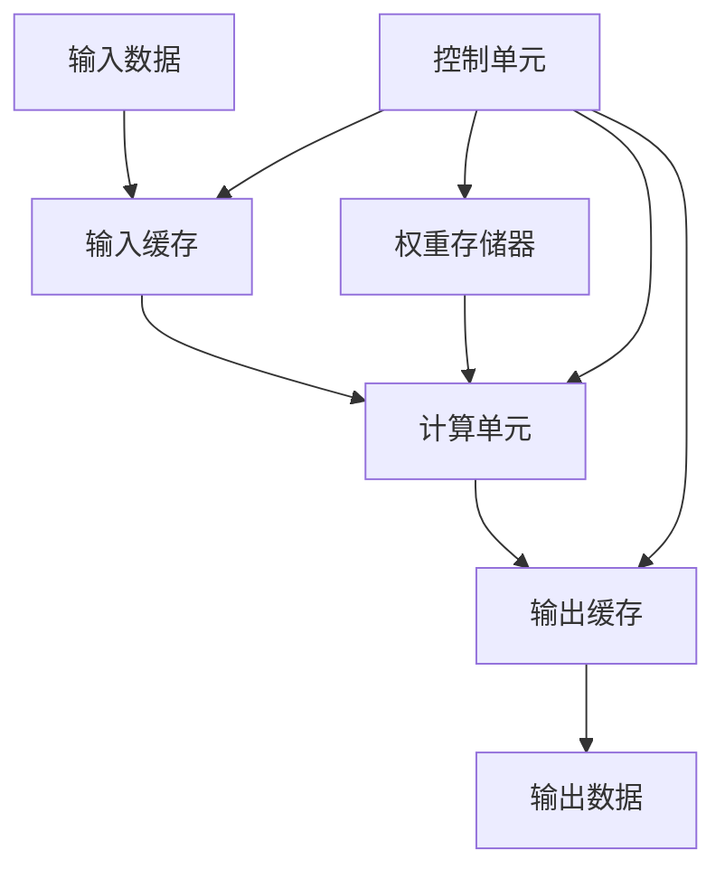

# 基于神经网络量化的超低功耗推理芯片设计

> 关键词：神经网络量化、超低功耗、推理芯片设计、量化算法、芯片架构

> 摘要：本文聚焦于基于神经网络量化的超低功耗推理芯片设计这一前沿技术领域。首先介绍了该研究的背景、目的、预期读者以及文档结构等内容。接着详细阐述了神经网络量化和超低功耗推理芯片的核心概念与联系，包括其原理和架构，并通过Mermaid流程图进行清晰展示。深入分析了核心算法原理，结合Python代码进行具体操作步骤的说明。探讨了相关的数学模型和公式，并举例加以解释。通过项目实战，从开发环境搭建、源代码实现到代码解读进行了全面剖析。列举了实际应用场景，推荐了学习资源、开发工具框架以及相关论文著作。最后总结了未来发展趋势与挑战，并对常见问题进行了解答，同时提供了扩展阅读和参考资料，旨在为该领域的研究和实践提供全面且深入的指导。

## 1. 背景介绍 
### 1.1 目的和范围
在人工智能技术飞速发展的当下，神经网络在图像识别、自然语言处理、语音识别等众多领域取得了巨大的成功。然而，神经网络模型通常具有大量的参数和复杂的计算，这使得其在推理过程中需要消耗大量的计算资源和能量。对于一些资源受限的设备，如物联网设备、可穿戴设备等，高功耗的推理过程成为了限制其发展的瓶颈。因此，设计超低功耗的推理芯片具有重要的现实意义。

本文的目的在于探讨如何基于神经网络量化技术来设计超低功耗的推理芯片。具体范围涵盖了神经网络量化的基本原理、量化算法的实现、超低功耗推理芯片的架构设计、相关数学模型的分析以及实际项目的开发和应用等方面。

### 1.2 预期读者
本文预期读者主要包括以下几类人群：
- **科研人员**：对人工智能芯片设计、神经网络量化技术等领域进行深入研究的科研人员，希望通过本文了解最新的技术动态和研究方法。
- **工程师**：从事芯片设计、算法开发等工作的工程师，能够从本文中获取实际的设计思路和技术方案，应用于实际项目中。
- **学生**：相关专业的本科生和研究生，作为学习参考资料，帮助他们了解该领域的基础知识和前沿技术。

### 1.3 文档结构概述
本文将按照以下结构进行组织：
- **核心概念与联系**：介绍神经网络量化和超低功耗推理芯片的核心概念，以及它们之间的联系，并通过示意图和流程图进行展示。
- **核心算法原理 & 具体操作步骤**：详细阐述神经网络量化的核心算法原理，并使用Python代码进行具体操作步骤的说明。
- **数学模型和公式 & 详细讲解 & 举例说明**：分析相关的数学模型和公式，并通过具体例子进行解释。
- **项目实战：代码实际案例和详细解释说明**：通过实际项目，介绍开发环境搭建、源代码实现和代码解读等方面的内容。
- **实际应用场景**：列举基于神经网络量化的超低功耗推理芯片的实际应用场景。
- **工具和资源推荐**：推荐相关的学习资源、开发工具框架和论文著作。
- **总结：未来发展趋势与挑战**：总结该领域的未来发展趋势和面临的挑战。
- **附录：常见问题与解答**：对常见问题进行解答。
- **扩展阅读 & 参考资料**：提供扩展阅读的内容和参考资料。

### 1.4 术语表
#### 1.4.1 核心术语定义
- **神经网络量化**：将神经网络中的浮点数参数和运算转换为低精度的整数或定点数表示，以减少计算量和存储需求。
- **超低功耗推理芯片**：专门设计用于神经网络推理任务，具有极低功耗的芯片。
- **推理**：在训练好的神经网络模型上，对输入数据进行预测或分类的过程。
- **量化算法**：用于实现神经网络量化的具体算法，如线性量化、非线性量化等。

#### 1.4.2 相关概念解释
- **定点数**：一种表示实数的方式，其小数点位置固定。与浮点数相比，定点数的表示范围和精度相对固定，但计算速度更快，存储需求更小。
- **量化误差**：由于量化过程中对浮点数进行近似表示而产生的误差。量化误差会影响神经网络的性能，因此需要在量化过程中进行控制。
- **芯片架构**：芯片的总体设计结构，包括处理器核、存储器、总线等组件的布局和连接方式。

#### 1.4.3 缩略词列表
- **DNN**：Deep Neural Network，深度神经网络
- **CNN**：Convolutional Neural Network，卷积神经网络
- **RNN**：Recurrent Neural Network，循环神经网络
- **FPGA**：Field-Programmable Gate Array，现场可编程门阵列
- **ASIC**：Application-Specific Integrated Circuit，专用集成电路

## 2. 核心概念与联系 

### 2.1 神经网络量化原理
神经网络量化的核心思想是将神经网络中的浮点数参数和运算转换为低精度的整数或定点数表示。在传统的神经网络中，参数通常使用32位浮点数（FP32）进行表示，这种表示方式具有较高的精度，但计算量和存储需求也较大。而量化后的神经网络可以使用8位整数（INT8）甚至更低精度的表示方式，从而显著减少计算量和存储需求。

神经网络量化的过程可以分为两个主要步骤：量化参数和量化运算。量化参数是指将神经网络中的权重和偏置从浮点数转换为低精度的整数或定点数。量化运算则是指在推理过程中，使用量化后的参数进行计算，将原本的浮点运算转换为整数运算。

### 2.2 超低功耗推理芯片架构
超低功耗推理芯片的架构设计需要综合考虑多个因素，如计算效率、存储效率、功耗等。一种常见的架构设计是采用专用的计算单元和存储单元，以提高计算和存储的效率。同时，芯片还需要具备低功耗的设计特点，如采用低电压供电、优化电路结构等。

以下是一个简单的超低功耗推理芯片架构示意图：



在这个架构中，输入数据首先被存储在输入缓存中，然后计算单元从权重存储器中读取量化后的权重，并与输入数据进行计算。计算结果被存储在输出缓存中，最后输出到外部设备。控制单元负责协调各个组件的工作，确保芯片的正常运行。

### 2.3 核心概念之间的联系
神经网络量化和超低功耗推理芯片之间存在着密切的联系。神经网络量化可以显著减少神经网络的计算量和存储需求，从而降低芯片的功耗。而超低功耗推理芯片的架构设计需要充分考虑量化后的神经网络的特点，以提高芯片的计算效率和存储效率。

具体来说，量化后的神经网络可以使用更简单的计算单元和更小的存储单元，从而降低芯片的面积和功耗。同时，芯片的架构设计也需要支持量化运算，如整数乘法和加法等。

## 3. 核心算法原理 & 具体操作步骤 

### 3.1 线性量化算法原理
线性量化是一种常见的神经网络量化算法，其基本思想是将浮点数映射到一个有限的整数范围内。具体来说，线性量化可以表示为以下公式：

$$
q = \text{round}\left(\frac{f}{S} + Z\right)
$$

其中，$f$ 是浮点数，$q$ 是量化后的整数，$S$ 是缩放因子，$Z$ 是零点。缩放因子 $S$ 和零点 $Z$ 可以通过以下公式计算：

$$
S = \frac{f_{\text{max}} - f_{\text{min}}}{q_{\text{max}} - q_{\text{min}}}
$$

$$
Z = q_{\text{min}} - \text{round}\left(\frac{f_{\text{min}}}{S}\right)
$$

其中，$f_{\text{max}}$ 和 $f_{\text{min}}$ 分别是浮点数的最大值和最小值，$q_{\text{max}}$ 和 $q_{\text{min}}$ 分别是量化后整数的最大值和最小值。

### 3.2 Python代码实现
以下是一个使用Python实现线性量化的示例代码：

```python
import numpy as np

def linear_quantize(f, q_min, q_max):
    f_min = np.min(f)
    f_max = np.max(f)
    S = (f_max - f_min) / (q_max - q_min)
    Z = q_min - np.round(f_min / S)
    q = np.round(f / S + Z)
    q = np.clip(q, q_min, q_max)
    return q, S, Z

# 示例数据
f = np.random.randn(10)
q_min = -128
q_max = 127

# 量化
q, S, Z = linear_quantize(f, q_min, q_max)

print("原始数据:", f)
print("量化后数据:", q)
print("缩放因子:", S)
print("零点:", Z)
```

### 3.3 具体操作步骤
1. **确定量化范围**：确定量化后整数的最大值 $q_{\text{max}}$ 和最小值 $q_{\text{min}}$，通常对于8位整数，$q_{\text{min}} = -128$，$q_{\text{max}} = 127$。
2. **计算缩放因子和零点**：根据浮点数的最大值 $f_{\text{max}}$ 和最小值 $f_{\text{min}}$，计算缩放因子 $S$ 和零点 $Z$。
3. **量化浮点数**：将浮点数 $f$ 按照公式 $q = \text{round}\left(\frac{f}{S} + Z\right)$ 进行量化，并将结果限制在 $[q_{\text{min}}, q_{\text{max}}]$ 范围内。

## 4. 数学模型和公式 & 详细讲解 & 举例说明 

### 4.1 量化误差分析
量化误差是指由于量化过程中对浮点数进行近似表示而产生的误差。量化误差可以通过以下公式计算：

$$
e = f - (q - Z) \times S
$$

其中，$e$ 是量化误差，$f$ 是浮点数，$q$ 是量化后的整数，$S$ 是缩放因子，$Z$ 是零点。

量化误差的大小会影响神经网络的性能，因此需要在量化过程中进行控制。一种常见的方法是使用更精细的量化策略，如非线性量化或自适应量化。

### 4.2 量化后的计算
在量化后的神经网络中，原本的浮点运算需要转换为整数运算。例如，对于两个量化后的向量 $q_1$ 和 $q_2$，其点积可以表示为：

$$
\text{dot}(q_1, q_2) = \sum_{i=1}^{n} (q_{1i} - Z_1) \times (q_{2i} - Z_2) \times S_1 \times S_2
$$

其中，$n$ 是向量的长度，$Z_1$ 和 $Z_2$ 分别是 $q_1$ 和 $q_2$ 的零点，$S_1$ 和 $S_2$ 分别是 $q_1$ 和 $q_2$ 的缩放因子。

### 4.3 举例说明
假设我们有两个浮点数向量 $f_1 = [1.0, 2.0, 3.0]$ 和 $f_2 = [4.0, 5.0, 6.0]$，我们将其量化为8位整数。

首先，我们计算 $f_1$ 和 $f_2$ 的最大值和最小值：

$$
f_{1\text{min}} = 1.0, f_{1\text{max}} = 3.0
$$

$$
f_{2\text{min}} = 4.0, f_{2\text{max}} = 6.0
$$

然后，我们计算缩放因子和零点：

$$
S_1 = \frac{3.0 - 1.0}{127 - (-128)} = \frac{2.0}{255}
$$

$$
Z_1 = -128 - \text{round}\left(\frac{1.0}{S_1}\right) = -128 - \text{round}(127.5) = -255
$$

$$
S_2 = \frac{6.0 - 4.0}{127 - (-128)} = \frac{2.0}{255}
$$

$$
Z_2 = -128 - \text{round}\left(\frac{4.0}{S_2}\right) = -128 - \text{round}(510) = -638
$$

接着，我们将 $f_1$ 和 $f_2$ 进行量化：

$$
q_1 = \text{round}\left(\frac{f_1}{S_1} + Z_1\right) = \text{round}\left(\frac{[1.0, 2.0, 3.0]}{\frac{2.0}{255}} - 255\right) = [-128, 0, 127]
$$

$$
q_2 = \text{round}\left(\frac{f_2}{S_2} + Z_2\right) = \text{round}\left(\frac{[4.0, 5.0, 6.0]}{\frac{2.0}{255}} - 638\right) = [-128, 0, 127]
$$

最后，我们计算量化后的点积：

$$
\text{dot}(q_1, q_2) = \sum_{i=1}^{3} (q_{1i} - Z_1) \times (q_{2i} - Z_2) \times S_1 \times S_2
$$

$$
= ((-128 - (-255)) \times (-128 - (-638)) + (0 - (-255)) \times (0 - (-638)) + (127 - (-255)) \times (127 - (-638))) \times \frac{2.0}{255} \times \frac{2.0}{255}
$$

$$
= (127 \times 510 + 255 \times 638 + 382 \times 765) \times \frac{4.0}{65025}
$$

$$
= (64770 + 162690 + 292230) \times \frac{4.0}{65025}
$$

$$
= 519690 \times \frac{4.0}{65025} \approx 32.0
$$

而原始的点积为：

$$
\text{dot}(f_1, f_2) = 1.0 \times 4.0 + 2.0 \times 5.0 + 3.0 \times 6.0 = 32.0
$$

可以看到，量化后的点积与原始的点积非常接近。

## 5. 项目实战：代码实际案例和详细解释说明 

### 5.1  开发环境搭建
本项目使用Python和PyTorch进行开发，开发环境的搭建步骤如下：
1. **安装Python**：从Python官方网站（https://www.python.org/downloads/）下载并安装Python 3.x版本。
2. **安装PyTorch**：根据自己的操作系统和CUDA版本，从PyTorch官方网站（https://pytorch.org/get-started/locally/）选择合适的安装命令进行安装。
3. **安装其他依赖库**：使用以下命令安装其他必要的依赖库：

```bash
pip install numpy matplotlib
```

### 5.2  源代码详细实现和代码解读
以下是一个使用PyTorch实现神经网络量化的示例代码：

```python
import torch
import torch.nn as nn
import torch.optim as optim
import torchvision
import torchvision.transforms as transforms

# 定义简单的神经网络模型
class SimpleNet(nn.Module):
    def __init__(self):
        super(SimpleNet, self).__init__()
        self.fc1 = nn.Linear(784, 128)
        self.fc2 = nn.Linear(128, 10)

    def forward(self, x):
        x = x.view(-1, 784)
        x = torch.relu(self.fc1(x))
        x = self.fc2(x)
        return x

# 加载MNIST数据集
transform = transforms.Compose([
    transforms.ToTensor(),
    transforms.Normalize((0.5,), (0.5,))
])

trainset = torchvision.datasets.MNIST(root='./data', train=True,
                                      download=True, transform=transform)
trainloader = torch.utils.data.DataLoader(trainset, batch_size=64,
                                          shuffle=True)

testset = torchvision.datasets.MNIST(root='./data', train=False,
                                     download=True, transform=transform)
testloader = torch.utils.data.DataLoader(testset, batch_size=64,
                                         shuffle=False)

# 初始化模型、损失函数和优化器
model = SimpleNet()
criterion = nn.CrossEntropyLoss()
optimizer = optim.SGD(model.parameters(), lr=0.001, momentum=0.9)

# 训练模型
for epoch in range(5):
    running_loss = 0.0
    for i, data in enumerate(trainloader, 0):
        inputs, labels = data
        optimizer.zero_grad()

        outputs = model(inputs)
        loss = criterion(outputs, labels)
        loss.backward()
        optimizer.step()

        running_loss += loss.item()
        if i % 200 == 199:
            print(f'[{epoch + 1}, {i + 1}] loss: {running_loss / 200:.3f}')
            running_loss = 0.0

print('Finished Training')

# 量化模型
import torch.quantization

# 定义量化配置
model.qconfig = torch.quantization.get_default_qconfig('fbgemm')

# 准备量化模型
model_prepared = torch.quantization.prepare(model)

# 校准量化模型
with torch.no_grad():
    for data in testloader:
        inputs, _ = data
        model_prepared(inputs)

# 转换为量化模型
model_quantized = torch.quantization.convert(model_prepared)

# 测试量化模型
correct = 0
total = 0
with torch.no_grad():
    for data in testloader:
        images, labels = data
        outputs = model_quantized(images)
        _, predicted = torch.max(outputs.data, 1)
        total += labels.size(0)
        correct += (predicted == labels).sum().item()

print(f'Accuracy of the quantized network on the 10000 test images: {100 * correct / total}%')
```

### 5.3  代码解读与分析
1. **模型定义**：定义了一个简单的全连接神经网络模型 `SimpleNet`，包含两个全连接层。
2. **数据加载**：使用 `torchvision` 加载MNIST数据集，并进行预处理。
3. **模型训练**：使用交叉熵损失函数和随机梯度下降优化器对模型进行训练。
4. **量化模型**：
    - **定义量化配置**：使用 `torch.quantization.get_default_qconfig('fbgemm')` 定义量化配置。
    - **准备量化模型**：使用 `torch.quantization.prepare` 准备量化模型。
    - **校准量化模型**：使用测试数据集对量化模型进行校准。
    - **转换为量化模型**：使用 `torch.quantization.convert` 将校准后的模型转换为量化模型。
5. **测试量化模型**：使用测试数据集对量化模型进行测试，计算准确率。

通过以上步骤，我们可以将一个浮点模型转换为量化模型，并测试其准确率。

## 6. 实际应用场景 
基于神经网络量化的超低功耗推理芯片在以下实际应用场景中具有重要的应用价值：

### 6.1 物联网设备
物联网设备通常具有资源受限的特点，如计算能力、存储容量和电池续航能力等。基于神经网络量化的超低功耗推理芯片可以在这些设备上实现高效的神经网络推理，如智能家居设备中的图像识别、语音识别等功能。

### 6.2 可穿戴设备
可穿戴设备对功耗非常敏感，因为它们通常需要长时间运行而无需频繁充电。超低功耗推理芯片可以在可穿戴设备上实现实时的健康监测、运动跟踪等功能，同时延长设备的电池续航时间。

### 6.3 智能摄像头
智能摄像头需要在本地进行实时的图像和视频处理，如目标检测、人脸识别等。基于神经网络量化的超低功耗推理芯片可以在智能摄像头中实现高效的推理，减少数据传输和处理的延迟。

### 6.4 自动驾驶汽车
自动驾驶汽车需要在短时间内处理大量的传感器数据，如摄像头、雷达等。超低功耗推理芯片可以在自动驾驶汽车中实现高效的神经网络推理，提高系统的实时性和可靠性。

## 7. 工具和资源推荐
### 7.1 学习资源推荐
#### 7.1.1 书籍推荐
- 《深度学习》（Deep Learning）：由Ian Goodfellow、Yoshua Bengio和Aaron Courville撰写，是深度学习领域的经典教材，涵盖了神经网络量化等相关内容。
- 《神经网络与深度学习》：由邱锡鹏撰写，全面介绍了神经网络和深度学习的基本原理和方法，包括量化技术。

#### 7.1.2 在线课程
- Coursera上的“深度学习专项课程”（Deep Learning Specialization）：由Andrew Ng教授授课，包括深度学习的基础知识和应用，对神经网络量化有一定的介绍。
- edX上的“人工智能基础”（Foundations of Artificial Intelligence）：介绍了人工智能的基本概念和方法，包括神经网络量化的相关内容。

#### 7.1.3 技术博客和网站
- Medium上的Towards Data Science：有许多关于深度学习和神经网络量化的技术文章。
- arXiv：提供了大量的学术论文，包括神经网络量化领域的最新研究成果。

### 7.2 开发工具框架推荐
#### 7.2.1 IDE和编辑器
- PyCharm：是一款专业的Python集成开发环境，支持代码编辑、调试、版本控制等功能。
- Visual Studio Code：是一款轻量级的代码编辑器，支持多种编程语言，有丰富的插件扩展。

#### 7.2.2 调试和性能分析工具
- TensorBoard：是TensorFlow提供的可视化工具，可以用于查看模型的训练过程和性能指标。
- PyTorch Profiler：可以帮助用户分析PyTorch模型的性能瓶颈，找出需要优化的部分。

#### 7.2.3 相关框架和库
- PyTorch：是一个开源的深度学习框架，提供了丰富的工具和接口，支持神经网络量化。
- TensorFlow：是另一个广泛使用的深度学习框架，也提供了量化工具和库。

### 7.3 相关论文著作推荐
#### 7.3.1 经典论文
- “Deep Compression: Compressing Deep Neural Networks with Pruning, Trained Quantization and Huffman Coding”：提出了一种深度压缩方法，包括剪枝、量化和霍夫曼编码，用于减少神经网络的存储和计算需求。
- “Quantization and Training of Neural Networks for Efficient Integer-Arithmetic-Only Inference”：介绍了一种用于高效整数运算推理的神经网络量化和训练方法。

#### 7.3.2 最新研究成果
- 可以在arXiv上搜索最新的神经网络量化相关论文，了解该领域的最新研究动态。

#### 7.3.3 应用案例分析
- 一些学术会议和期刊上会发表神经网络量化在实际应用中的案例分析，如CVPR、ICML等会议。

## 8. 总结：未来发展趋势与挑战
### 8.1 未来发展趋势
- **更低的量化精度**：未来的研究将致力于实现更低的量化精度，如4位、2位甚至1位量化，以进一步减少计算量和存储需求。
- **自适应量化**：自适应量化可以根据不同的输入数据和模型结构动态调整量化参数，提高量化的准确性和效率。
- **硬件与算法的协同设计**：未来的超低功耗推理芯片设计将更加注重硬件与算法的协同设计，以实现更高的性能和更低的功耗。
- **多模态融合**：随着人工智能技术的发展，多模态融合将成为一个重要的研究方向。基于神经网络量化的超低功耗推理芯片可以在多模态融合中发挥重要作用。

### 8.2 挑战
- **量化误差控制**：量化误差会影响神经网络的性能，如何在降低量化精度的同时控制量化误差是一个挑战。
- **模型性能损失**：量化过程可能会导致模型性能的损失，如何在保证低功耗的前提下尽量减少模型性能的损失是一个需要解决的问题。
- **硬件实现难度**：实现超低功耗推理芯片需要考虑硬件的设计和制造工艺，如何在硬件上高效地实现量化算法是一个挑战。
- **标准和规范缺乏**：目前神经网络量化领域缺乏统一的标准和规范，这给研究和开发带来了一定的困难。

## 9. 附录：常见问题与解答
### 9.1 什么是神经网络量化？
神经网络量化是将神经网络中的浮点数参数和运算转换为低精度的整数或定点数表示，以减少计算量和存储需求。

### 9.2 为什么要进行神经网络量化？
进行神经网络量化的主要原因是为了降低神经网络的计算量和存储需求，从而减少功耗和提高推理速度。这对于资源受限的设备，如物联网设备、可穿戴设备等非常重要。

### 9.3 量化会影响神经网络的性能吗？
量化过程可能会导致神经网络的性能损失，因为量化误差会引入一定的噪声。但是，通过合理的量化策略和训练方法，可以在保证低功耗的前提下尽量减少模型性能的损失。

### 9.4 如何选择合适的量化算法？
选择合适的量化算法需要考虑多个因素，如量化精度、计算效率、模型性能等。一般来说，线性量化是一种简单而有效的量化算法，适用于大多数情况。对于一些对精度要求较高的应用，可以考虑使用非线性量化或自适应量化算法。

### 9.5 如何评估量化模型的性能？
可以使用测试数据集对量化模型进行评估，计算准确率、召回率、F1值等性能指标。同时，还可以比较量化模型和原始浮点模型的性能差异，评估量化对模型性能的影响。

## 10. 扩展阅读 & 参考资料
### 10.1 扩展阅读
- 《人工智能芯片技术》：介绍了人工智能芯片的设计原理和技术，包括神经网络量化在芯片设计中的应用。
- 《低功耗集成电路设计》：探讨了低功耗集成电路的设计方法和技术，对超低功耗推理芯片的设计有一定的参考价值。

### 10.2 参考资料
- Goodfellow, I., Bengio, Y., & Courville, A. (2016). Deep Learning. MIT Press.
- 邱锡鹏. (2019). 神经网络与深度学习. 机械工业出版社.
- Jacob, B., Kligys, S., Chen, B., Zhu, M., Tang, M., Howard, A.,... & Adam, H. (2018). Quantization and Training of Neural Networks for Efficient Integer-Arithmetic-Only Inference. arXiv preprint arXiv:1712.05877.

作者：AI天才研究院/AI Genius Institute & 禅与计算机程序设计艺术 /Zen And The Art of Computer Programming