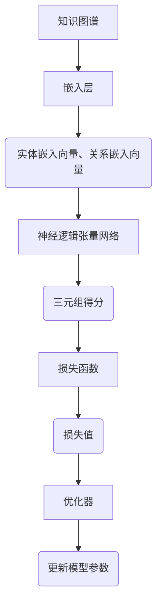

# 基于神经逻辑张量分解的关系推理模型

> 关键词：神经逻辑张量分解、关系推理模型、知识图谱、深度学习、张量分解、逻辑推理

> 摘要：本文围绕基于神经逻辑张量分解的关系推理模型展开深入探讨。首先介绍了该模型提出的背景和意义，包括在知识图谱补全、智能问答等领域的重要应用。详细阐述了神经逻辑张量分解的核心概念、原理及架构，通过Python代码深入分析了核心算法原理与具体操作步骤，并结合数学模型和公式进行理论支撑。通过项目实战展示了该模型的代码实现和详细解读，探讨了其在不同实际场景中的应用。同时，推荐了相关的学习资源、开发工具框架以及论文著作。最后总结了该模型的未来发展趋势与挑战，解答了常见问题，并提供了扩展阅读和参考资料，旨在为相关领域的研究者和开发者提供全面且深入的技术指导。

## 1. 背景介绍 
### 1.1 目的和范围
在当今信息爆炸的时代，知识图谱作为一种强大的知识表示和管理工具，被广泛应用于多个领域，如搜索引擎、智能推荐、智能问答等。然而，现有的知识图谱往往存在不完整性，许多潜在的关系没有被显式地表示出来。关系推理模型的目标就是从已有的知识图谱中挖掘出潜在的关系，补全知识图谱，提高其完整性和可用性。

基于神经逻辑张量分解的关系推理模型结合了深度学习和逻辑推理的优势，旨在更有效地处理知识图谱中的关系推理问题。本文章的范围涵盖了该模型的理论基础、算法实现、实际应用以及相关的工具和资源推荐等方面，为读者全面了解和应用该模型提供指导。

### 1.2 预期读者
本文预期读者包括计算机科学、人工智能、机器学习等领域的研究人员、开发者以及对知识图谱和关系推理感兴趣的学生。对于有一定编程基础和机器学习知识的读者，能够更好地理解文中的代码实现和算法原理；而对于初学者，也可以通过本文了解该领域的基本概念和研究方向。

### 1.3 文档结构概述
本文将按照以下结构进行组织：
1. **背景介绍**：介绍文章的目的、预期读者、文档结构概述以及相关术语。
2. **核心概念与联系**：阐述神经逻辑张量分解和关系推理模型的核心概念、原理及架构，并通过示意图和流程图进行直观展示。
3. **核心算法原理 & 具体操作步骤**：使用Python代码详细讲解核心算法原理和具体操作步骤。
4. **数学模型和公式 & 详细讲解 & 举例说明**：介绍相关的数学模型和公式，并通过具体例子进行说明。
5. **项目实战：代码实际案例和详细解释说明**：展示基于神经逻辑张量分解的关系推理模型的项目实战，包括开发环境搭建、源代码实现和代码解读。
6. **实际应用场景**：探讨该模型在不同实际场景中的应用。
7. **工具和资源推荐**：推荐相关的学习资源、开发工具框架以及论文著作。
8. **总结：未来发展趋势与挑战**：总结该模型的未来发展趋势和面临的挑战。
9. **附录：常见问题与解答**：解答读者在学习和应用该模型过程中常见的问题。
10. **扩展阅读 & 参考资料**：提供相关的扩展阅读材料和参考资料。

### 1.4 术语表
#### 1.4.1 核心术语定义
- **知识图谱**：一种以图的形式表示知识的方法，由实体（节点）和关系（边）组成，用于描述实体之间的语义关系。
- **关系推理**：从已有的知识图谱中挖掘出潜在的关系，补全知识图谱的过程。
- **神经逻辑张量分解**：一种结合了神经网络和逻辑推理的张量分解方法，用于处理知识图谱中的关系推理问题。
- **张量**：多维数组的推广，可以看作是矩阵在高维空间中的扩展。
- **嵌入表示**：将实体和关系映射到低维向量空间中的表示方法，便于计算机进行处理和计算。

#### 1.4.2 相关概念解释
- **深度学习**：一种基于人工神经网络的机器学习方法，通过多层神经网络自动学习数据的特征和模式。
- **逻辑推理**：根据已知的事实和规则，推导出新的结论的过程。
- **张量分解**：将一个高维张量分解为多个低维张量的乘积的过程，常用于降维和数据压缩。

#### 1.4.3 缩略词列表
- **KG**：Knowledge Graph，知识图谱
- **NN**：Neural Network，神经网络
- **NLT**：Neural Logic Tensor，神经逻辑张量

## 2. 核心概念与联系 

### 2.1 神经逻辑张量分解的原理
神经逻辑张量分解（Neural Logic Tensor Decomposition，NLT）是一种结合了神经网络和逻辑推理的张量分解方法。其基本思想是将知识图谱中的实体和关系表示为低维向量，通过神经网络学习这些向量之间的关系，同时利用逻辑推理的规则来约束学习过程，从而实现关系推理的目的。

在知识图谱中，一个三元组 $(h, r, t)$ 表示实体 $h$（头实体）和实体 $t$（尾实体）之间存在关系 $r$。神经逻辑张量分解将实体和关系映射到低维向量空间中，得到实体嵌入向量 $\mathbf{e}_h$、$\mathbf{e}_t$ 和关系嵌入向量 $\mathbf{r}$。然后，通过一个神经逻辑张量网络（Neural Logic Tensor Network，NLTN）来计算三元组的得分 $f(h, r, t)$，得分越高表示该三元组越有可能存在于知识图谱中。

### 2.2 关系推理模型的架构
基于神经逻辑张量分解的关系推理模型主要由以下几个部分组成：
1. **嵌入层**：将实体和关系映射到低维向量空间中，得到实体嵌入向量和关系嵌入向量。
2. **神经逻辑张量网络**：根据实体嵌入向量和关系嵌入向量计算三元组的得分。
3. **损失函数**：用于衡量模型预测结果与真实标签之间的差异，通过最小化损失函数来优化模型参数。
4. **优化器**：根据损失函数的梯度更新模型参数，使得模型的预测结果更加准确。

### 2.3 核心概念的联系
神经逻辑张量分解和关系推理模型之间存在着紧密的联系。神经逻辑张量分解为关系推理模型提供了一种有效的表示方法和计算方式，通过将实体和关系表示为低维向量，并利用神经逻辑张量网络计算三元组的得分，实现了关系推理的目的。而关系推理模型则是神经逻辑张量分解的具体应用场景，通过不断优化模型参数，提高关系推理的准确性和效率。

### 2.4 文本示意图
```plaintext
知识图谱 --(嵌入层)--> 实体嵌入向量、关系嵌入向量
实体嵌入向量、关系嵌入向量 --(神经逻辑张量网络)--> 三元组得分
三元组得分 --(损失函数)--> 损失值
损失值 --(优化器)--> 更新模型参数
```

### 2.5 Mermaid 流程图


## 3. 核心算法原理 & 具体操作步骤 

### 3.1 核心算法原理
神经逻辑张量分解的核心算法主要包括以下几个步骤：
1. **嵌入初始化**：随机初始化实体嵌入向量和关系嵌入向量。
2. **三元组得分计算**：根据实体嵌入向量和关系嵌入向量，通过神经逻辑张量网络计算三元组的得分。
3. **损失计算**：根据三元组的得分和真实标签，计算损失函数的值。
4. **参数更新**：根据损失函数的梯度，使用优化器更新模型参数。

### 3.2 具体操作步骤
下面使用Python代码详细讲解神经逻辑张量分解的具体操作步骤：

```python
import torch
import torch.nn as nn
import torch.optim as optim

# 定义神经逻辑张量网络
class NeuralLogicTensorNetwork(nn.Module):
    def __init__(self, entity_dim, relation_dim, hidden_dim):
        super(NeuralLogicTensorNetwork, self).__init__()
        self.entity_dim = entity_dim
        self.relation_dim = relation_dim
        self.hidden_dim = hidden_dim
        
        # 定义张量 W
        self.W = nn.Parameter(torch.randn(relation_dim, entity_dim, entity_dim))
        # 定义矩阵 V
        self.V = nn.Parameter(torch.randn(relation_dim, 2 * entity_dim))
        # 定义偏置 b
        self.b = nn.Parameter(torch.randn(relation_dim))
        
    def forward(self, e_h, e_t, r):
        # 计算 e_h^T * W_r * e_t
        part1 = torch.einsum('bi,rjk,bk->br', e_h, self.W, e_t)
        # 计算 V_r * [e_h; e_t]
        part2 = torch.matmul(torch.cat((e_h, e_t), dim=1), self.V.t())
        # 计算三元组得分
        score = torch.tanh(part1 + part2 + self.b)
        return score

# 定义嵌入层
class EmbeddingLayer(nn.Module):
    def __init__(self, num_entities, num_relations, entity_dim, relation_dim):
        super(EmbeddingLayer, self).__init__()
        self.entity_embeddings = nn.Embedding(num_entities, entity_dim)
        self.relation_embeddings = nn.Embedding(num_relations, relation_dim)
        
    def forward(self, h, r, t):
        e_h = self.entity_embeddings(h)
        e_t = self.entity_embeddings(t)
        e_r = self.relation_embeddings(r)
        return e_h, e_t, e_r

# 定义关系推理模型
class RelationReasoningModel(nn.Module):
    def __init__(self, num_entities, num_relations, entity_dim, relation_dim, hidden_dim):
        super(RelationReasoningModel, self).__init__()
        self.embedding_layer = EmbeddingLayer(num_entities, num_relations, entity_dim, relation_dim)
        self.nltn = NeuralLogicTensorNetwork(entity_dim, relation_dim, hidden_dim)
        
    def forward(self, h, r, t):
        e_h, e_t, e_r = self.embedding_layer(h, r, t)
        score = self.nltn(e_h, e_t, e_r)
        return score

# 初始化模型参数
num_entities = 100
num_relations = 20
entity_dim = 50
relation_dim = 30
hidden_dim = 20

model = RelationReasoningModel(num_entities, num_relations, entity_dim, relation_dim, hidden_dim)

# 定义损失函数和优化器
criterion = nn.MSELoss()
optimizer = optim.Adam(model.parameters(), lr=0.001)

# 模拟训练数据
h = torch.randint(0, num_entities, (10,))
r = torch.randint(0, num_relations, (10,))
t = torch.randint(0, num_entities, (10,))
labels = torch.randn(10, relation_dim)

# 训练模型
num_epochs = 100
for epoch in range(num_epochs):
    optimizer.zero_grad()
    scores = model(h, r, t)
    loss = criterion(scores, labels)
    loss.backward()
    optimizer.step()
    if (epoch + 1) % 10 == 0:
        print(f'Epoch [{epoch + 1}/{num_epochs}], Loss: {loss.item():.4f}')
```

### 3.3 代码解释
1. **NeuralLogicTensorNetwork 类**：定义了神经逻辑张量网络，包含张量 $W$、矩阵 $V$ 和偏置 $b$，通过 `forward` 方法计算三元组的得分。
2. **EmbeddingLayer 类**：定义了嵌入层，将实体和关系映射到低维向量空间中。
3. **RelationReasoningModel 类**：定义了关系推理模型，包含嵌入层和神经逻辑张量网络。
4. **训练过程**：模拟训练数据，定义损失函数和优化器，通过多次迭代训练模型，不断更新模型参数，使得损失函数的值逐渐减小。

## 4. 数学模型和公式 & 详细讲解 & 举例说明 

### 4.1 数学模型和公式
神经逻辑张量分解的核心数学模型可以表示为：

$$
f(h, r, t) = \tanh(\mathbf{e}_h^T \mathbf{W}_r \mathbf{e}_t + \mathbf{V}_r [\mathbf{e}_h; \mathbf{e}_t] + \mathbf{b}_r)
$$

其中：
- $\mathbf{e}_h$ 和 $\mathbf{e}_t$ 分别是头实体和尾实体的嵌入向量。
- $\mathbf{r}$ 是关系的嵌入向量。
- $\mathbf{W}_r \in \mathbb{R}^{d \times d}$ 是一个与关系 $r$ 相关的张量。
- $\mathbf{V}_r \in \mathbb{R}^{d \times 2d}$ 是一个与关系 $r$ 相关的矩阵。
- $\mathbf{b}_r \in \mathbb{R}^{d}$ 是一个与关系 $r$ 相关的偏置向量。
- $d$ 是嵌入向量的维度。

### 4.2 详细讲解
1. **$\mathbf{e}_h^T \mathbf{W}_r \mathbf{e}_t$**：这一项表示头实体嵌入向量 $\mathbf{e}_h$ 和尾实体嵌入向量 $\mathbf{e}_t$ 通过张量 $\mathbf{W}_r$ 进行交互，捕捉实体之间的非线性关系。
2. **$\mathbf{V}_r [\mathbf{e}_h; \mathbf{e}_t]$**：这一项表示将头实体嵌入向量 $\mathbf{e}_h$ 和尾实体嵌入向量 $\mathbf{e}_t$ 拼接后，通过矩阵 $\mathbf{V}_r$ 进行线性变换，捕捉实体之间的线性关系。
3. **$\mathbf{b}_r$**：这一项是偏置向量，用于调整模型的输出。
4. **$\tanh$ 函数**：这是一个激活函数，用于将模型的输出映射到 $[-1, 1]$ 之间，使得模型的输出具有一定的范围。

### 4.3 举例说明
假设我们有一个知识图谱，包含 3 个实体 $E = \{e_1, e_2, e_3\}$ 和 2 个关系 $R = \{r_1, r_2\}$，嵌入向量的维度 $d = 2$。

- 实体嵌入向量：$\mathbf{e}_1 = [0.1, 0.2]^T$，$\mathbf{e}_2 = [0.3, 0.4]^T$，$\mathbf{e}_3 = [0.5, 0.6]^T$。
- 关系嵌入向量：$\mathbf{r}_1 = [0.7, 0.8]^T$，$\mathbf{r}_2 = [0.9, 1.0]^T$。
- 张量 $\mathbf{W}_{r_1} = \begin{bmatrix} 0.1 & 0.2 \\ 0.3 & 0.4 \end{bmatrix}$，$\mathbf{W}_{r_2} = \begin{bmatrix} 0.5 & 0.6 \\ 0.7 & 0.8 \end{bmatrix}$。
- 矩阵 $\mathbf{V}_{r_1} = \begin{bmatrix} 0.1 & 0.2 & 0.3 & 0.4 \\ 0.5 & 0.6 & 0.7 & 0.8 \end{bmatrix}$，$\mathbf{V}_{r_2} = \begin{bmatrix} 0.9 & 1.0 & 1.1 & 1.2 \\ 1.3 & 1.4 & 1.5 & 1.6 \end{bmatrix}$。
- 偏置向量 $\mathbf{b}_{r_1} = [0.1, 0.2]^T$，$\mathbf{b}_{r_2} = [0.3, 0.4]^T$。

现在我们要计算三元组 $(e_1, r_1, e_2)$ 的得分：

1. 计算 $\mathbf{e}_1^T \mathbf{W}_{r_1} \mathbf{e}_2$：
$$
\mathbf{e}_1^T \mathbf{W}_{r_1} \mathbf{e}_2 = [0.1, 0.2] \begin{bmatrix} 0.1 & 0.2 \\ 0.3 & 0.4 \end{bmatrix} \begin{bmatrix} 0.3 \\ 0.4 \end{bmatrix} = [0.1, 0.2] \begin{bmatrix} 0.11 \\ 0.25 \end{bmatrix} = 0.061
$$

2. 计算 $\mathbf{V}_{r_1} [\mathbf{e}_1; \mathbf{e}_2]$：
$$
\mathbf{V}_{r_1} [\mathbf{e}_1; \mathbf{e}_2] = \begin{bmatrix} 0.1 & 0.2 & 0.3 & 0.4 \\ 0.5 & 0.6 & 0.7 & 0.8 \end{bmatrix} \begin{bmatrix} 0.1 \\ 0.2 \\ 0.3 \\ 0.4 \end{bmatrix} =