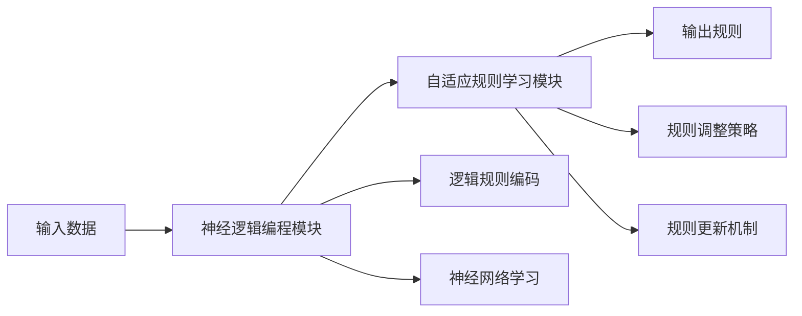

# 基于神经逻辑编程的自适应规则学习

> 关键词：神经逻辑编程、自适应规则学习、逻辑推理、机器学习、知识表示

> 摘要：本文围绕基于神经逻辑编程的自适应规则学习展开深入探讨。首先介绍了该研究的背景，包括目的、预期读者、文档结构和相关术语。接着阐述了神经逻辑编程和自适应规则学习的核心概念及其联系，并给出了相应的文本示意图和Mermaid流程图。详细讲解了核心算法原理，通过Python代码进行了具体说明，同时介绍了相关的数学模型和公式。在项目实战部分，给出了开发环境搭建的步骤、源代码实现和代码解读。分析了实际应用场景，推荐了学习资源、开发工具框架以及相关论文著作。最后总结了未来发展趋势与挑战，还设置了附录解答常见问题，并提供了扩展阅读和参考资料，旨在为读者全面呈现基于神经逻辑编程的自适应规则学习的技术全貌。

## 1. 背景介绍 
### 1.1 目的和范围
在当今复杂的数据环境中，传统的机器学习方法往往难以有效地结合逻辑推理和知识表示。神经逻辑编程（Neural Logic Programming，NLP）作为一种新兴的技术，旨在将神经网络的学习能力与逻辑编程的推理能力相结合。自适应规则学习则是在此基础上，让系统能够根据不同的数据和任务自动调整和学习规则。本研究的目的是深入探讨基于神经逻辑编程的自适应规则学习的原理、算法和应用，为相关领域的研究和实践提供理论支持和技术指导。

研究范围涵盖了神经逻辑编程和自适应规则学习的核心概念、算法原理、数学模型，以及实际应用场景和开发过程。通过具体的代码示例和项目实战，展示如何实现基于神经逻辑编程的自适应规则学习系统。

### 1.2 预期读者
本文预期读者包括人工智能、机器学习、知识工程等领域的研究人员和从业者，以及对神经逻辑编程和自适应规则学习感兴趣的技术爱好者。对于具有一定编程基础和机器学习知识的读者，能够更好地理解文中的技术细节和代码实现。

### 1.3 文档结构概述
本文将按照以下结构进行组织：
- 核心概念与联系：介绍神经逻辑编程和自适应规则学习的核心概念，以及它们之间的联系，并通过文本示意图和Mermaid流程图进行直观展示。
- 核心算法原理 & 具体操作步骤：详细讲解基于神经逻辑编程的自适应规则学习的核心算法原理，使用Python代码进行具体说明。
- 数学模型和公式 & 详细讲解 & 举例说明：介绍相关的数学模型和公式，并通过具体例子进行详细讲解。
- 项目实战：代码实际案例和详细解释说明：通过一个实际的项目案例，展示如何搭建开发环境、实现源代码，并对代码进行解读和分析。
- 实际应用场景：分析基于神经逻辑编程的自适应规则学习在不同领域的实际应用场景。
- 工具和资源推荐：推荐学习资源、开发工具框架和相关论文著作。
- 总结：未来发展趋势与挑战：总结基于神经逻辑编程的自适应规则学习的未来发展趋势和面临的挑战。
- 附录：常见问题与解答：解答读者在学习和实践过程中可能遇到的常见问题。
- 扩展阅读 & 参考资料：提供进一步学习和研究的扩展阅读材料和参考资料。

### 1.4 术语表
#### 1.4.1 核心术语定义
- **神经逻辑编程（Neural Logic Programming）**：一种将神经网络和逻辑编程相结合的技术，旨在利用神经网络的学习能力和逻辑编程的推理能力，实现更强大的知识表示和推理。
- **自适应规则学习（Adaptive Rule Learning）**：系统能够根据不同的数据和任务自动调整和学习规则的过程。
- **逻辑规则（Logical Rule）**：用逻辑语言表达的规则，用于描述事物之间的关系和推理过程。
- **神经网络（Neural Network）**：一种模仿人类神经系统的计算模型，由大量的神经元组成，能够自动学习数据中的模式和规律。

#### 1.4.2 相关概念解释
- **知识表示（Knowledge Representation）**：将人类知识以计算机能够理解和处理的方式进行表示的过程。神经逻辑编程通过逻辑规则和神经网络来实现知识的表示。
- **推理（Reasoning）**：根据已知的事实和规则，推导出新的结论的过程。神经逻辑编程利用逻辑规则进行推理，并通过神经网络学习规则的参数。
- **机器学习（Machine Learning）**：让计算机通过数据自动学习模式和规律的技术。自适应规则学习是机器学习的一种应用，通过不断调整规则来适应不同的数据和任务。

#### 1.4.3 缩略词列表
- **NLP**：Neural Logic Programming（神经逻辑编程）
- **ML**：Machine Learning（机器学习）

## 2. 核心概念与联系 
### 核心概念原理
#### 神经逻辑编程
神经逻辑编程结合了神经网络和逻辑编程的优点。逻辑编程使用逻辑规则来表示知识和进行推理，例如经典的一阶逻辑规则可以表示为 “如果 A 成立，并且 B 成立，那么 C 成立”。而神经网络则是一种强大的机器学习模型，能够自动学习数据中的模式和规律。

在神经逻辑编程中，逻辑规则被编码为神经网络的结构或参数。通过神经网络的学习能力，可以自动调整逻辑规则的参数，使得规则能够更好地适应数据。例如，在一个知识图谱推理任务中，可以使用神经逻辑编程来学习实体之间的关系规则。

#### 自适应规则学习
自适应规则学习的核心思想是让系统能够根据不同的数据和任务自动调整和学习规则。传统的规则学习方法通常需要人工手动定义规则，并且规则一旦确定就很难改变。而自适应规则学习可以根据新的数据不断更新和优化规则。

自适应规则学习可以通过多种方式实现，例如基于强化学习的方法，系统通过与环境的交互获得奖励信号，根据奖励信号来调整规则；或者基于在线学习的方法，系统在不断接收新数据的过程中实时更新规则。

### 架构的文本示意图
```plaintext
+---------------------+
|     输入数据       |
+---------------------+
        |
        v
+---------------------+
|  神经逻辑编程模块  |
|  - 逻辑规则编码    |
|  - 神经网络学习    |
+---------------------+
        |
        v
+---------------------+
|  自适应规则学习模块 |
|  - 规则调整策略    |
|  - 规则更新机制    |
+---------------------+
        |
        v
+---------------------+
|     输出规则       |
+---------------------+
```

### Mermaid 流程图


## 3. 核心算法原理 & 具体操作步骤 
### 算法原理
基于神经逻辑编程的自适应规则学习的核心算法主要包括两个部分：神经逻辑编程和自适应规则调整。

#### 神经逻辑编程
神经逻辑编程的目标是将逻辑规则编码为神经网络，并通过神经网络的学习能力来调整规则的参数。具体来说，我们可以将逻辑规则表示为一个逻辑程序，每个规则可以表示为一个子句。例如，一个简单的逻辑规则 “如果 x 是猫，那么 x 是动物” 可以表示为：

```plaintext
animal(X) :- cat(X).
```

我们可以将这个规则编码为一个神经网络，其中输入层表示规则的前提条件（cat(X)），输出层表示规则的结论（animal(X)）。通过训练神经网络，我们可以学习到规则的参数，使得规则能够更好地适应数据。

#### 自适应规则调整
自适应规则调整的目标是根据新的数据和任务自动调整规则。我们可以使用强化学习的方法来实现自适应规则调整。具体来说，我们定义一个奖励函数，用于评估规则的性能。例如，在一个分类任务中，奖励函数可以是分类的准确率。

系统通过与环境的交互获得奖励信号，根据奖励信号来调整规则的参数。例如，如果一个规则在某个数据集上的准确率较低，系统可以通过调整规则的参数来提高准确率。

### Python 源代码详细阐述
以下是一个简单的基于神经逻辑编程的自适应规则学习的 Python 代码示例：

```python
import torch
import torch.nn as nn
import torch.optim as optim

# 定义神经网络模型
class NeuralLogicProgramming(nn.Module):
    def __init__(self, input_size, output_size):
        super(NeuralLogicProgramming, self).__init__()
        self.fc = nn.Linear(input_size, output_size)

    def forward(self, x):
        return torch.sigmoid(self.fc(x))

# 定义训练函数
def train(model, data, labels, epochs, learning_rate):
    criterion = nn.BCELoss()
    optimizer = optim.Adam(model.parameters(), lr=learning_rate)

    for epoch in range(epochs):
        optimizer.zero_grad()
        outputs = model(data)
        loss = criterion(outputs, labels)
        loss.backward()
        optimizer.step()

        if (epoch + 1) % 100 == 0:
            print(f'Epoch [{epoch + 1}/{epochs}], Loss: {loss.item():.4f}')

# 生成示例数据
input_size = 5
output_size = 1
data = torch.randn(100, input_size)
labels = torch.randint(0, 2, (100, output_size)).float()

# 创建模型
model = NeuralLogicProgramming(input_size, output_size)

# 训练模型
train(model, data, labels, epochs=1000, learning_rate=0.001)

# 测试模型
test_data = torch.randn(10, input_size)
predictions = model(test_data)
print('Predictions:', predictions)
```

### 具体操作步骤
1. **定义神经网络模型**：定义一个简单的神经网络模型，用于实现神经逻辑编程。在这个示例中，我们使用一个全连接层和一个 sigmoid 激活函数。
2. **定义训练函数**：定义一个训练函数，用于训练神经网络模型。在训练过程中，我们使用二元交叉熵损失函数和 Adam 优化器。
3. **生成示例数据**：生成一些示例数据，用于训练和测试模型。
4. **创建模型**：创建一个神经网络模型的实例。
5. **训练模型**：调用训练函数，对模型进行训练。
6. **测试模型**：使用测试数据对模型进行测试，输出预测结果。

## 4. 数学模型和公式 & 详细讲解 & 举例说明 
### 神经逻辑编程的数学模型
#### 逻辑规则的表示
逻辑规则可以用一阶逻辑表示。例如，一个简单的逻辑规则 “如果 A 成立，并且 B 成立，那么 C 成立” 可以表示为：

$$C \leftarrow A \land B$$

在神经逻辑编程中，我们可以将这个规则表示为一个神经网络。假设 $A$、$B$ 和 $C$ 分别用向量 $\mathbf{a}$、$\mathbf{b}$ 和 $\mathbf{c}$ 表示，我们可以定义一个神经网络函数 $f$，使得：

$$\mathbf{c} = f(\mathbf{a}, \mathbf{b})$$

#### 神经网络的学习
神经网络的学习目标是最小化预测结果和真实结果之间的误差。假设我们有一个训练数据集 $\{(x_i, y_i)\}_{i=1}^N$，其中 $x_i$ 是输入数据，$y_i$ 是真实标签。我们可以定义一个损失函数 $L$，例如二元交叉熵损失函数：

$$L(\theta) = -\frac{1}{N} \sum_{i=1}^N [y_i \log(f(x_i; \theta)) + (1 - y_i) \log(1 - f(x_i; \theta))]$$

其中 $\theta$ 是神经网络的参数，$f(x_i; \theta)$ 是神经网络的预测结果。

通过最小化损失函数 $L(\theta)$，我们可以学习到神经网络的参数 $\theta$。常用的优化方法是随机梯度下降（SGD）或其变种，如 Adam 优化器。

### 自适应规则调整的数学模型
#### 奖励函数
在自适应规则调整中，我们使用奖励函数来评估规则的性能。假设我们有一个规则 $r$，在一个数据集 $D$ 上的性能可以用一个奖励函数 $R(r, D)$ 表示。例如，在一个分类任务中，奖励函数可以是分类的准确率：

$$R(r, D) = \frac{\text{正确分类的样本数}}{\text{总样本数}}$$

#### 规则调整
我们可以使用强化学习的方法来调整规则。假设我们有一个规则集 $\mathcal{R}$，系统通过与环境的交互获得奖励信号。在每个时间步 $t$，系统选择一个规则 $r_t \in \mathcal{R}$，并根据奖励信号 $R(r_t, D_t)$ 来调整规则的参数。

常用的强化学习算法是 Q - learning，其更新公式为：

$$Q(s_t, a_t) \leftarrow Q(s_t, a_t) + \alpha [R(s_t, a_t) + \gamma \max_{a} Q(s_{t+1}, a) - Q(s_t, a_t)]$$

其中 $Q(s_t, a_t)$ 是在状态 $s_t$ 下选择动作 $a_t$ 的 Q 值，$\alpha$ 是学习率，$\gamma$ 是折扣因子。

### 举例说明
假设我们有一个简单的分类任务，输入数据是二维向量，标签是 0 或 1。我们可以定义一个逻辑规则：“如果 $x_1 > 0$ 并且 $x_2 > 0$，那么 $y = 1$”。

我们可以将这个规则编码为一个神经网络，输入层有两个神经元，分别表示 $x_1$ 和 $x_2$，输出层有一个神经元，表示预测的标签。通过训练神经网络，我们可以学习到规则的参数，使得规则能够更好地适应数据。

在自适应规则调整方面，我们可以使用 Q - learning 算法来调整规则。假设我们有一个规则集，包含不同的逻辑规则。在每个时间步，系统选择一个规则进行分类，并根据分类的准确率获得奖励信号。根据奖励信号，系统使用 Q - learning 算法更新规则的 Q 值，从而选择更优的规则。

## 5. 项目实战：代码实际案例和详细解释说明 
### 5.1  开发环境搭建
#### 安装 Python
首先，确保你已经安装了 Python 3.x 版本。你可以从 Python 官方网站（https://www.python.org/downloads/）下载并安装 Python。

#### 安装依赖库
我们需要安装一些常用的 Python 库，如 PyTorch、NumPy 等。可以使用以下命令进行安装：

```sh
pip install torch numpy
```

### 5.2  源代码详细实现和代码解读
```python
import torch
import torch.nn as nn
import torch.optim as optim
import numpy as np

# 定义神经逻辑编程模型
class NeuralLogicProgramming(nn.Module):
    def __init__(self, input_size, output_size):
        super(NeuralLogicProgramming, self).__init__()
        # 定义一个全连接层
        self.fc = nn.Linear(input_size, output_size)

    def forward(self, x):
        # 使用 sigmoid 激活函数
        return torch.sigmoid(self.fc(x))

# 定义训练函数
def train(model, data, labels, epochs, learning_rate):
    # 定义二元交叉熵损失函数
    criterion = nn.BCELoss()
    # 定义 Adam 优化器
    optimizer = optim.Adam(model.parameters(), lr=learning_rate)

    for epoch in range(epochs):
        # 清零梯度
        optimizer.zero_grad()
        # 前向传播
        outputs = model(data)
        # 计算损失
        loss = criterion(outputs, labels)
        # 反向传播
        loss.backward()
        # 更新参数
        optimizer.step()

        if (epoch + 1) % 100 == 0:
            print(f'Epoch [{epoch + 1}/{epochs}], Loss: {loss.item():.4f}')

# 生成示例数据
input_size = 5
output_size = 1
# 生成 100 个输入样本
data = torch.randn(100, input_size)
# 生成 100 个标签
labels = torch.randint(0, 2, (100, output_size)).float()

# 创建模型
model = NeuralLogicProgramming(input_size, output_size)

# 训练模型
train(model, data, labels, epochs=1000, learning_rate=0.001)

# 测试模型
test_data = torch.randn(10, input_size)
predictions = model(test_data)
print('Predictions:', predictions)
```

### 代码解读与分析
#### 模型定义
- `NeuralLogicProgramming` 类继承自 `nn.Module`，是一个简单的神经网络模型。
- `__init__` 方法中，定义了一个全连接层 `self.fc`，用于将输入数据映射到输出数据。
- `forward` 方法中，使用 `sigmoid` 激活函数对全连接层的输出进行处理，得到最终的预测结果。

#### 训练函数
- `train` 函数用于训练模型。
- `criterion` 定义了二元交叉熵损失函数，用于衡量预测结果和真实标签之间的误差。
- `optimizer` 定义了 Adam 优化器，用于更新模型的参数。
- 在每个 epoch 中，首先清零梯度，然后进行前向传播、计算损失、反向传播和参数更新。

#### 数据生成
- `data` 是一个形状为 `(100, 5)` 的张量，表示 100 个输入样本，每个样本有 5 个特征。
- `labels` 是一个形状为 `(100, 1)` 的张量，表示 100 个标签，每个标签是 0 或 1。

#### 模型训练和测试
- 创建 `NeuralLogicProgramming` 模型的实例。
- 调用 `train` 函数对模型进行训练。
- 生成 10 个测试样本，调用模型的 `forward` 方法进行预测，并输出预测结果。

## 6. 实际应用场景 
### 知识图谱推理
知识图谱是一种用于表示实体之间关系的图结构。在知识图谱推理中，我们需要根据已知的实体和关系，推导出新的实体关系。基于神经逻辑编程的自适应规则学习可以用于学习知识图谱中的逻辑规则，并根据新的数据不断调整规则，提高推理的准确性。

例如，在一个人物关系知识图谱中，已知 “A 是 B 的父亲” 和 “B 是 C 的父亲”，我们可以使用神经逻辑编程学习到 “A 是 C 的祖父” 这样的规则。当有新的人物关系数据加入时，系统可以自动调整规则，以适应新的数据。

### 医疗诊断
在医疗诊断中，医生需要根据患者的症状、检查结果等信息进行诊断。基于神经逻辑编程的自适应规则学习可以用于学习医疗诊断规则，并根据不同患者的数据和新的医学研究成果不断调整规则。

例如，对于某种疾病的诊断，系统可以学习到 “如果患者有症状 A、症状 B 和检查结果 C，那么患者患有疾病 D” 这样的规则。当有新的病例出现或医学研究有新的发现时，系统可以自动更新规则，提高诊断的准确性。

### 智能客服
智能客服系统需要根据用户的问题进行回答。基于神经逻辑编程的自适应规则学习可以用于学习客服规则，并根据用户的反馈和新的问题不断调整规则。

例如，对于常见的问题，系统可以学习到 “如果用户问问题 A，那么回答 B” 这样的规则。当有新的问题出现或用户对回答不满意时，系统可以自动调整规则，提高服务质量。

## 7. 工具和资源推荐
### 7.1 学习资源推荐
#### 7.1.1 书籍推荐
- 《深度学习》（Deep Learning）：由 Ian Goodfellow、Yoshua Bengio 和 Aaron Courville 撰写，是深度学习领域的经典教材，涵盖了神经网络、优化算法等方面的知识。
- 《人工智能：一种现代的方法》（Artificial Intelligence: A Modern Approach）：由 Stuart Russell 和 Peter Norvig 撰写，全面介绍了人工智能的各个领域，包括逻辑推理、机器学习等。
- 《神经逻辑编程》相关的研究专著：可以深入了解神经逻辑编程的原理和应用。

#### 7.1.2 在线课程
- Coursera 上的 “深度学习专项课程”（Deep Learning Specialization）：由 Andrew Ng 教授授课，系统介绍了深度学习的基础知识和应用。
- edX 上的 “人工智能导论”（Introduction to Artificial Intelligence）：提供了人工智能的全面介绍，包括逻辑推理和机器学习的内容。

#### 7.1.3 技术博客和网站
- arXiv.org：一个预印本服务器，提供了大量的人工智能和机器学习领域的最新研究论文。
- Medium 上的人工智能相关博客：许多专家和研究人员会在 Medium 上分享他们的研究成果和经验。

### 7.2 开发工具框架推荐
#### 7.2.1 IDE和编辑器
- PyCharm：一款功能强大的 Python 集成开发环境，提供了代码编辑、调试、版本控制等功能。
- Jupyter Notebook：一个交互式的开发环境，适合进行数据分析和模型实验。

#### 7.2.2 调试和性能分析工具
- PyTorch Profiler：PyTorch 提供的性能分析工具，可以帮助用户分析模型的运行时间和内存使用情况。
- TensorBoard：一个可视化工具，可以用于监控模型的训练过程和性能。

#### 7.2.3 相关框架和库
- PyTorch：一个开源的深度学习框架，提供了丰富的神经网络层和优化算法，支持 GPU 加速。
- NumPy：一个用于科学计算的 Python 库，提供了高效的数组操作和数学函数。

### 7.3 相关论文著作推荐
#### 7.3.1 经典论文
- “Neural Logic Programming”：介绍了神经逻辑编程的基本概念和方法。
- “Differentiable Learning of Logical Rules for Knowledge Base Reasoning”：提出了一种可微分的逻辑规则学习方法，用于知识图谱推理。

#### 7.3.2 最新研究成果
可以关注 arXiv.org 上关于神经逻辑编程和自适应规则学习的最新研究论文，了解该领域的最新发展动态。

#### 7.3.3 应用案例分析
一些学术会议和期刊上会发表关于神经逻辑编程和自适应规则学习的应用案例分析，如 AAAI、IJCAI 等会议。

## 8. 总结：未来发展趋势与挑战
### 未来发展趋势
- **与其他技术的融合**：神经逻辑编程和自适应规则学习将与其他技术，如强化学习、图神经网络等进行更深入的融合，以实现更强大的智能系统。
- **在更多领域的应用**：随着技术的不断发展，基于神经逻辑编程的自适应规则学习将在医疗、金融、交通等更多领域得到广泛应用。
- **可解释性的提升**：提高模型的可解释性是未来的一个重要发展方向，使得人们能够更好地理解模型的决策过程和规则。

### 挑战
- **计算资源需求**：神经逻辑编程和自适应规则学习通常需要大量的计算资源，特别是在处理大规模数据和复杂规则时。如何优化算法和模型结构，降低计算资源需求是一个挑战。
- **规则的复杂性**：现实世界中的规则往往非常复杂，如何有效地表示和学习这些规则是一个难题。
- **数据的质量和标注**：高质量的数据和准确的标注是模型训练的关键。如何获取和处理高质量的数据，以及如何减少标注的工作量是需要解决的问题。

## 9. 附录：常见问题与解答
### 问题 1：神经逻辑编程和传统逻辑编程有什么区别？
神经逻辑编程结合了神经网络的学习能力和逻辑编程的推理能力。传统逻辑编程通常需要人工手动定义规则，并且规则一旦确定就很难改变。而神经逻辑编程可以通过神经网络自动学习规则的参数，并且可以根据新的数据不断调整规则。

### 问题 2：自适应规则学习需要大量的数据吗？
自适应规则学习的性能通常与数据的数量和质量有关。一般来说，更多的数据可以帮助模型学习到更准确的规则。但是，通过合适的算法和模型结构，也可以在较少的数据上实现较好的自适应规则学习效果。

### 问题 3：如何评估自适应规则学习的性能？
可以使用多种指标来评估自适应规则学习的性能，如准确率、召回率、F1 值等。在不同的应用场景中，可以根据具体的需求选择合适的评估指标。

## 10. 扩展阅读 & 参考资料
### 扩展阅读
- 相关的学术论文和研究报告，深入了解神经逻辑编程和自适应规则学习的最新研究成果。
- 其他关于知识表示、逻辑推理和机器学习的书籍和文章，拓宽知识面。

### 参考资料
- 本文中引用的学术论文和书籍。
- 相关的开源代码库和项目，如 GitHub 上的神经逻辑编程相关项目。

作者：AI天才研究院/AI Genius Institute & 禅与计算机程序设计艺术 /Zen And The Art of Computer Programming