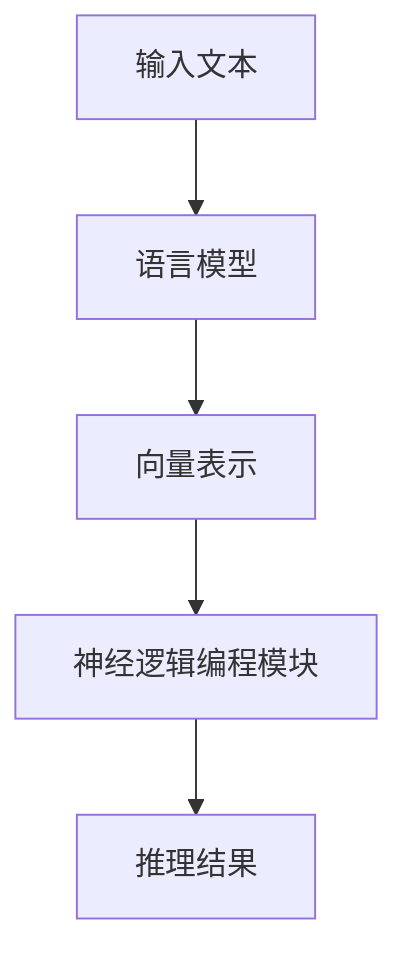

# 基于神经逻辑编程的语言模型推理框架

> 关键词：神经逻辑编程、语言模型推理框架、深度学习、逻辑推理、知识表示

> 摘要：本文深入探讨了基于神经逻辑编程的语言模型推理框架。首先介绍了该研究的背景，包括目的、预期读者、文档结构和相关术语。接着阐述了核心概念，分析了其原理和架构，并给出了相应的文本示意图和 Mermaid 流程图。详细讲解了核心算法原理，使用 Python 代码进行了示例。通过数学模型和公式进一步解释了相关概念，并举例说明。提供了项目实战案例，包括开发环境搭建、源代码实现和代码解读。探讨了实际应用场景，推荐了学习资源、开发工具框架和相关论文著作。最后总结了未来发展趋势与挑战，解答了常见问题，并列出了扩展阅读和参考资料，旨在为相关领域的研究者和开发者提供全面的技术指导。

## 1. 背景介绍 

### 1.1 目的和范围
在自然语言处理领域，语言模型已经取得了显著的进展，如 GPT 系列等大型语言模型在文本生成、问答系统等任务中表现出色。然而，现有的语言模型在逻辑推理能力方面仍存在不足，难以处理复杂的逻辑问题。神经逻辑编程结合了神经网络的学习能力和逻辑编程的推理能力，为提升语言模型的推理能力提供了新的途径。本文的目的是深入研究基于神经逻辑编程的语言模型推理框架，探讨其原理、算法和应用，为开发更强大的语言处理系统提供理论和实践支持。本文的范围涵盖了神经逻辑编程的基本概念、核心算法、数学模型、项目实战以及实际应用场景等方面。

### 1.2 预期读者
本文预期读者包括自然语言处理领域的研究者、人工智能开发者、对神经逻辑编程和语言模型推理感兴趣的学生和专业人士。读者需要具备一定的深度学习和编程基础，熟悉 Python 编程语言和常见的深度学习框架，如 PyTorch 或 TensorFlow。

### 1.3 文档结构概述
本文将按照以下结构进行组织：
1. **背景介绍**：阐述研究的目的、预期读者、文档结构和相关术语。
2. **核心概念与联系**：介绍神经逻辑编程和语言模型推理框架的核心概念，分析其原理和架构，并给出示意图和流程图。
3. **核心算法原理 & 具体操作步骤**：详细讲解核心算法原理，使用 Python 代码进行示例。
4. **数学模型和公式 & 详细讲解 & 举例说明**：通过数学模型和公式进一步解释相关概念，并举例说明。
5. **项目实战：代码实际案例和详细解释说明**：提供项目实战案例，包括开发环境搭建、源代码实现和代码解读。
6. **实际应用场景**：探讨基于神经逻辑编程的语言模型推理框架的实际应用场景。
7. **工具和资源推荐**：推荐学习资源、开发工具框架和相关论文著作。
8. **总结：未来发展趋势与挑战**：总结研究成果，分析未来发展趋势和面临的挑战。
9. **附录：常见问题与解答**：解答读者可能遇到的常见问题。
10. **扩展阅读 & 参考资料**：列出扩展阅读和参考资料，方便读者进一步深入研究。

### 1.4 术语表

#### 1.4.1 核心术语定义
- **神经逻辑编程（Neural Logic Programming, NLP）**：一种将神经网络和逻辑编程相结合的方法，旨在利用神经网络的学习能力来学习逻辑规则，同时利用逻辑编程的推理能力进行知识推理。
- **语言模型推理框架**：一种用于处理自然语言的系统，它可以根据输入的文本进行推理，得出相关的结论。
- **深度学习**：一种基于人工神经网络的机器学习方法，通过多层神经网络来学习数据的特征和模式。
- **逻辑推理**：根据已知的事实和规则，推导出新的结论的过程。
- **知识表示**：将知识以计算机可以处理的形式进行表示的方法。

#### 1.4.2 相关概念解释
- **神经网络**：由大量的神经元组成的计算模型，它可以自动学习数据的特征和模式。
- **逻辑规则**：描述事物之间关系的规则，通常用逻辑表达式来表示。
- **推理引擎**：用于执行逻辑推理的程序模块，它可以根据已知的事实和规则推导出新的结论。
- **嵌入（Embedding）**：将离散的符号（如单词、实体等）映射到连续的向量空间中的过程，以便于神经网络进行处理。

#### 1.4.3 缩略词列表
- **NLP**：Neural Logic Programming（神经逻辑编程）
- **LSTM**：Long Short-Term Memory（长短期记忆网络）
- **GRU**：Gated Recurrent Unit（门控循环单元）
- **MLP**：Multi-Layer Perceptron（多层感知机）
- **API**：Application Programming Interface（应用程序编程接口）

## 2. 核心概念与联系 

### 核心概念原理
神经逻辑编程的核心思想是将逻辑规则嵌入到神经网络中，使得神经网络可以学习和执行逻辑推理。在传统的逻辑编程中，逻辑规则通常用一阶逻辑或 Horn 子句来表示，推理过程是基于规则的匹配和推导。而在神经逻辑编程中，逻辑规则被表示为神经网络的参数，推理过程则通过神经网络的前向传播来实现。

语言模型推理框架则是在神经逻辑编程的基础上，结合了语言模型的能力，用于处理自然语言的推理任务。语言模型可以将输入的文本转换为向量表示，神经逻辑编程模块则可以根据这些向量表示进行逻辑推理，得出相关的结论。

### 架构示意图
以下是基于神经逻辑编程的语言模型推理框架的架构示意图：

```plaintext
+----------------------+
|  输入文本             |
+----------------------+
         |
         v
+----------------------+
|  语言模型             |
|  （如 BERT、GPT 等）   |
+----------------------+
         |
         v
+----------------------+
|  向量表示             |
+----------------------+
         |
         v
+----------------------+
|  神经逻辑编程模块    |
|  （学习和执行逻辑规则）|
+----------------------+
         |
         v
+----------------------+
|  推理结果             |
+----------------------+
```

### Mermaid 流程图


这个流程图展示了基于神经逻辑编程的语言模型推理框架的主要流程。首先，输入的文本经过语言模型处理，转换为向量表示。然后，神经逻辑编程模块根据这些向量表示进行逻辑推理，最终得出推理结果。

## 3. 核心算法原理 & 具体操作步骤 

### 核心算法原理
神经逻辑编程的核心算法主要包括两个方面：规则学习和推理执行。

#### 规则学习
规则学习的目标是从数据中学习逻辑规则。在神经逻辑编程中，通常使用神经网络来学习规则的参数。具体来说，我们可以将逻辑规则表示为一个神经网络的结构，通过训练神经网络来学习规则的权重。

例如，考虑一个简单的逻辑规则：“如果 A 是真的，并且 B 是真的，那么 C 是真的”。我们可以将这个规则表示为一个神经网络，其中输入节点分别表示 A 和 B，输出节点表示 C，中间的隐藏层用于学习规则的权重。

#### 推理执行
推理执行的目标是根据已知的事实和学习到的规则进行推理。在神经逻辑编程中，推理执行通常通过神经网络的前向传播来实现。具体来说，我们将已知的事实作为输入，通过神经网络的前向传播计算出推理结果。

### 具体操作步骤
以下是基于神经逻辑编程的语言模型推理框架的具体操作步骤：

1. **数据预处理**：对输入的文本数据进行预处理，包括分词、去除停用词、词干提取等操作。
2. **语言模型编码**：使用预训练的语言模型（如 BERT、GPT 等）将预处理后的文本转换为向量表示。
3. **规则学习**：使用神经网络学习逻辑规则的参数。可以使用监督学习或强化学习的方法进行训练。
4. **推理执行**：将语言模型编码得到的向量表示作为输入，通过神经逻辑编程模块进行推理，得出推理结果。
5. **结果评估**：使用评估指标（如准确率、召回率等）对推理结果进行评估，根据评估结果调整模型的参数。

### Python 代码示例
以下是一个简单的 Python 代码示例，演示了如何使用 PyTorch 实现一个简单的神经逻辑编程模块：

```python
import torch
import torch.nn as nn

# 定义一个简单的神经逻辑编程模块
class NeuralLogicProgramming(nn.Module):
    def __init__(self, input_size, hidden_size, output_size):
        super(NeuralLogicProgramming, self).__init__()
        self.fc1 = nn.Linear(input_size, hidden_size)
        self.relu = nn.ReLU()
        self.fc2 = nn.Linear(hidden_size, output_size)
        self.sigmoid = nn.Sigmoid()

    def forward(self, x):
        out = self.fc1(x)
        out = self.relu(out)
        out = self.fc2(out)
        out = self.sigmoid(out)
        return out

# 初始化模型
input_size = 10
hidden_size = 20
output_size = 1
model = NeuralLogicProgramming(input_size, hidden_size, output_size)

# 定义输入数据
input_data = torch.randn(1, input_size)

# 进行推理
output = model(input_data)
print("推理结果:", output.item())
```

在这个代码示例中，我们定义了一个简单的神经逻辑编程模块，它包含一个全连接层、一个 ReLU 激活函数和一个 Sigmoid 激活函数。然后，我们初始化了模型，并使用随机生成的输入数据进行推理，最后打印出推理结果。

## 4. 数学模型和公式 & 详细讲解 & 举例说明 

### 数学模型
在神经逻辑编程中，逻辑规则可以用数学模型来表示。通常，我们可以将逻辑规则表示为一个神经网络的结构，其中输入节点表示事实，输出节点表示结论，中间的隐藏层表示规则的权重。

假设我们有一个简单的逻辑规则：“如果 A 是真的，并且 B 是真的，那么 C 是真的”。我们可以将这个规则表示为一个神经网络，其中输入节点分别表示 A 和 B，输出节点表示 C。假设输入节点的取值为 $x_1$ 和 $x_2$，输出节点的取值为 $y$，中间隐藏层的权重为 $w_1$ 和 $w_2$，偏置为 $b$。则神经网络的输出可以表示为：

$$
y = \sigma(w_1x_1 + w_2x_2 + b)
$$

其中，$\sigma$ 是 Sigmoid 激活函数，用于将输出值映射到 $[0, 1]$ 区间。

### 详细讲解
在这个数学模型中，$x_1$ 和 $x_2$ 分别表示输入的事实 A 和 B 的取值，$w_1$ 和 $w_2$ 表示规则的权重，$b$ 表示偏置。通过训练神经网络，我们可以学习到合适的权重和偏置，使得神经网络的输出能够正确地表示规则的结论。

Sigmoid 激活函数的定义为：

$$
\sigma(z) = \frac{1}{1 + e^{-z}}
$$

它的作用是将输入值映射到 $[0, 1]$ 区间，使得输出值可以表示概率。当 $z$ 趋近于正无穷时，$\sigma(z)$ 趋近于 1；当 $z$ 趋近于负无穷时，$\sigma(z)$ 趋近于 0。

### 举例说明
假设我们有以下训练数据：

| A | B | C |
|---|---|---|
| 1 | 1 | 1 |
| 1 | 0 | 0 |
| 0 | 1 | 0 |
| 0 | 0 | 0 |

我们可以使用这些训练数据来训练神经网络，学习规则的权重和偏置。具体来说，我们可以定义一个损失函数，如交叉熵损失函数，来衡量神经网络的输出和真实标签之间的差异。然后，使用梯度下降算法来更新神经网络的参数，使得损失函数最小化。

以下是一个使用 PyTorch 实现的训练代码示例：

```python
import torch
import torch.nn as nn
import torch.optim as optim

# 定义训练数据
input_data = torch.tensor([[1, 1], [1, 0], [0, 1], [0, 0]], dtype=torch.float32)
target_data = torch.tensor([[1], [0], [0], [0]], dtype=torch.float32)

# 定义神经逻辑编程模块
class NeuralLogicProgramming(nn.Module):
    def __init__(self, input_size, output_size):
        super(NeuralLogicProgramming, self).__init__()
        self.fc = nn.Linear(input_size, output_size)
        self.sigmoid = nn.Sigmoid()

    def forward(self, x):
        out = self.fc(x)
        out = self.sigmoid(out)
        return out

# 初始化模型
input_size = 2
output_size = 1
model = NeuralLogicProgramming(input_size, output_size)

# 定义损失函数和优化器
criterion = nn.BCELoss()
optimizer = optim.SGD(model.parameters(), lr=0.1)

# 训练模型
num_epochs = 1000
for epoch in range(num_epochs):
    # 前向传播
    outputs = model(input_data)
    loss = criterion(outputs, target_data)

    # 反向传播和优化
    optimizer.zero_grad()
    loss.backward()
    optimizer.step()

    if (epoch + 1) % 100 == 0:
        print(f'Epoch [{epoch+1}/{num_epochs}], Loss: {loss.item():.4f}')

# 测试模型
test_input = torch.tensor([[1, 1]], dtype=torch.float32)
test_output = model(test_input)
print("测试结果:", test_output.item())
```

在这个代码示例中，我们定义了一个简单的神经逻辑编程模块，使用交叉熵损失函数和随机梯度下降算法进行训练。经过 1000 个 epoch 的训练，我们可以得到一个能够正确表示逻辑规则的神经网络。最后，我们使用一个测试数据进行测试，打印出测试结果。

## 5. 项目实战：代码实际案例和详细解释说明 

### 5.1  开发环境搭建
在进行基于神经逻辑编程的语言模型推理框架的项目实战之前，我们需要搭建开发环境。以下是搭建开发环境的步骤：

1. **安装 Python**：建议使用 Python 3.7 或更高版本。可以从 Python 官方网站（https://www.python.org/downloads/）下载并安装。
2. **安装深度学习框架**：本文使用 PyTorch 作为深度学习框架。可以根据自己的系统和 CUDA 版本选择合适的安装方式。可以参考 PyTorch 官方网站（https://pytorch.org/get-started/locally/）进行安装。
3. **安装其他依赖库**：还需要安装一些其他的依赖库，如 NumPy、Pandas、Scikit-learn 等。可以使用 pip 或 conda 进行安装。例如：
```bash
pip install numpy pandas scikit-learn
```

### 5.2  源代码详细实现和代码解读
以下是一个完整的基于神经逻辑编程的语言模型推理框架的源代码示例，使用 PyTorch 和 Hugging Face 的 Transformers 库：

```python
import torch
from transformers import AutoTokenizer, AutoModel
import torch.nn as nn

# 加载预训练的语言模型和分词器
tokenizer = AutoTokenizer.from_pretrained('bert-base-uncased')
model = AutoModel.from_pretrained('bert-base-uncased')

# 定义神经逻辑编程模块
class NeuralLogicProgramming(nn.Module):
    def __init__(self, input_size, hidden_size, output_size):
        super(NeuralLogicProgramming, self).__init__()
        self.fc1 = nn.Linear(input_size, hidden_size)
        self.relu = nn.ReLU()
        self.fc2 = nn.Linear(hidden_size, output_size)
        self.sigmoid = nn.Sigmoid()

    def forward(self, x):
        out = self.fc1(x)
        out = self.relu(out)
        out = self.fc2(out)
        out = self.sigmoid(out)
        return out

# 初始化神经逻辑编程模块
input_size = 768  # BERT 模型的输出维度
hidden_size = 20
output_size = 1
nlp_model = NeuralLogicProgramming(input_size, hidden_size, output_size)

# 定义输入文本
input_text = "This is a test sentence."

# 对输入文本进行分词和编码
inputs = tokenizer(input_text, return_tensors='pt')

# 使用语言模型进行编码
with torch.no_grad():
    outputs = model(**inputs)

# 获取 [CLS] 标记的输出作为句子的向量表示
sentence_embedding = outputs.last_hidden_state[:, 0, :]

# 进行推理
result = nlp_model(sentence_embedding)
print("推理结果:", result.item())
```

### 代码解读
1. **加载预训练的语言模型和分词器**：使用 Hugging Face 的 Transformers 库加载预训练的 BERT 模型和分词器。
2. **定义神经逻辑编程模块**：定义一个简单的神经逻辑编程模块，包含两个全连接层和一个 ReLU 激活函数和一个 Sigmoid 激活函数。
3. **初始化神经逻辑编程模块**：根据 BERT 模型的输出维度初始化神经逻辑编程模块。
4. **对输入文本进行分词和编码**：使用分词器对输入文本进行分词和编码，得到输入的张量。
5. **使用语言模型进行编码**：使用预训练的 BERT 模型对输入文本进行编码，得到句子的向量表示。
6. **获取 [CLS] 标记的输出作为句子的向量表示**：在 BERT 模型中，[CLS] 标记的输出可以作为整个句子的向量表示。
7. **进行推理**：将句子的向量表示输入到神经逻辑编程模块中，进行推理，得到推理结果。

### 5.3  代码解读与分析
在这个代码示例中，我们结合了预训练的语言模型和神经逻辑编程模块，实现了一个简单的语言模型推理框架。通过使用预训练的语言模型，我们可以将输入的文本转换为向量表示，然后使用神经逻辑编程模块进行逻辑推理。

需要注意的是，这个代码示例只是一个简单的演示，实际应用中可能需要根据具体任务进行调整和优化。例如，可以使用更复杂的神经逻辑编程模块，使用更多的训练数据进行训练，或者结合其他技术（如强化学习）来提高推理能力。

## 6. 实际应用场景 
基于神经逻辑编程的语言模型推理框架在多个领域都有广泛的应用场景，以下是一些具体的应用场景：

### 问答系统
在问答系统中，用户输入一个问题，系统需要根据已知的知识和逻辑规则进行推理，给出正确的答案。基于神经逻辑编程的语言模型推理框架可以结合语言模型的语义理解能力和逻辑编程的推理能力，更好地处理复杂的问题。例如，在一个医学问答系统中，系统可以根据患者的症状和医学知识进行推理，给出可能的诊断结果和治疗建议。

### 智能客服
智能客服系统可以使用基于神经逻辑编程的语言模型推理框架来理解用户的问题，并根据预设的规则和知识库进行推理，给出合适的回答。通过结合逻辑推理能力，智能客服可以处理更复杂的问题，提供更准确的服务。例如，在一个电商客服系统中，系统可以根据用户的订单信息、商品信息和退换货规则进行推理，处理用户的退换货请求。

### 知识图谱推理
知识图谱是一种用于表示知识的图结构，其中节点表示实体，边表示实体之间的关系。基于神经逻辑编程的语言模型推理框架可以用于知识图谱的推理任务，如实体链接、关系预测等。通过将知识图谱中的信息和逻辑规则嵌入到神经网络中，可以学习到更有效的推理模型，提高知识图谱的推理能力。

### 文本生成
在文本生成任务中，如故事生成、新闻写作等，基于神经逻辑编程的语言模型推理框架可以引入逻辑规则，使得生成的文本更加合理和连贯。例如，在故事生成中，可以使用逻辑规则来控制故事的情节发展，使得故事更加符合逻辑和常理。

### 金融风险评估
在金融领域，基于神经逻辑编程的语言模型推理框架可以用于风险评估。通过分析金融文本（如财报、新闻等）和金融数据，结合逻辑规则进行推理，可以评估企业的信用风险、市场风险等。例如，根据企业的财务指标和行业规则进行推理，判断企业是否存在违约风险。

## 7. 工具和资源推荐

### 7.1 学习资源推荐

#### 7.1.1 书籍推荐
- 《深度学习》（Deep Learning）：由 Ian Goodfellow、Yoshua Bengio 和 Aaron Courville 撰写，是深度学习领域的经典教材，涵盖了深度学习的基本概念、算法和应用。
- 《自然语言处理入门》（Natural Language Processing with Python）：由 Steven Bird、Ewan Klein 和 Edward Loper 撰写，介绍了使用 Python 进行自然语言处理的基本方法和技术。
- 《人工智能：一种现代的方法》（Artificial Intelligence: A Modern Approach）：由 Stuart Russell 和 Peter Norvig 撰写，是人工智能领域的权威教材，涵盖了人工智能的各个方面，包括逻辑推理、机器学习等。

#### 7.1.2 在线课程
- Coursera 上的“深度学习专项课程”（Deep Learning Specialization）：由 Andrew Ng 教授授课，包括五门课程，涵盖了深度学习的基础知识、卷积神经网络、循环神经网络等内容。
- edX 上的“自然语言处理”（Natural Language Processing）：由哥伦比亚大学的教授授课，介绍了自然语言处理的基本概念、算法和应用。
- Udemy 上的“Python 深度学习实战”（Deep Learning with Python）：通过实际项目介绍了使用 Python 和 Keras 进行深度学习的方法和技术。

#### 7.1.3 技术博客和网站
- Hugging Face Blog（https://huggingface.co/blog）：Hugging Face 是自然语言处理领域的知名公司，其博客上发布了很多关于自然语言处理和深度学习的最新研究成果和技术文章。
- Towards Data Science（https://towardsdatascience.com/）：是一个数据科学和机器学习领域的技术博客，上面有很多关于深度学习、自然语言处理等方面的文章。
- arXiv（https://arxiv.org/）：是一个预印本服务器，上面发布了很多最新的学术论文，包括神经逻辑编程、语言模型等领域的研究成果。

### 7.2 开发工具框架推荐

#### 7.2.1 IDE和编辑器
- PyCharm：是一款专门为 Python 开发设计的集成开发环境（IDE），具有代码编辑、调试、版本控制等功能，非常适合深度学习项目的开发。
- Jupyter Notebook：是一个交互式的开发环境，支持 Python、R 等多种编程语言，可以方便地进行代码编写、数据可视化和实验记录。
- Visual Studio Code：是一款轻量级的代码编辑器，支持多种编程语言和插件，具有丰富的扩展功能，也可以用于深度学习项目的开发。

#### 7.2.2 调试和性能分析工具
- PyTorch Profiler：是 PyTorch 自带的性能分析工具，可以帮助开发者分析模型的性能瓶颈，优化代码性能。
- TensorBoard：是 TensorFlow 自带的可视化工具，也可以用于 PyTorch 项目的可视化分析，支持绘制损失曲线、准确率曲线等。
- NVIDIA Nsight Systems：是 NVIDIA 提供的性能分析工具，可以帮助开发者分析 GPU 代码的性能，优化 GPU 计算效率。

#### 7.2.3 相关框架和库
- PyTorch：是一个开源的深度学习框架，具有动态图和静态图两种模式，支持 GPU 加速，广泛应用于自然语言处理、计算机视觉等领域。
- TensorFlow：是另一个开源的深度学习框架，具有强大的分布式训练和部署能力，也广泛应用于各个领域。
- Transformers：是 Hugging Face 开发的一个自然语言处理库，提供了大量预训练的语言模型，如 BERT、GPT 等，方便开发者进行自然语言处理任务的开发。

### 7.3 相关论文著作推荐

#### 7.3.1 经典论文
- “Neural Logic Machines”：提出了一种将神经网络和逻辑编程相结合的方法，实现了在神经网络中进行逻辑推理的功能。
- “Differentiable Learning of Logical Rules for Knowledge Base Reasoning”：介绍了一种可微分的逻辑规则学习方法，用于知识库推理任务。
- “BERT: Pre-training of Deep Bidirectional Transformers for Language Understanding”：提出了 BERT 模型，是自然语言处理领域的一个重要突破。

#### 7.3.2 最新研究成果
- 可以关注 arXiv 上的最新论文，以及顶级学术会议（如 ACL、NeurIPS、ICML 等）上的研究成果，了解神经逻辑编程和语言模型推理领域的最新进展。

#### 7.3.3 应用案例分析
- 可以参考一些实际应用案例的论文和报告，了解基于神经逻辑编程的语言模型推理框架在不同领域的应用效果和实践经验。

## 8. 总结：未来发展趋势与挑战
### 未来发展趋势
- **与多模态技术融合**：未来，基于神经逻辑编程的语言模型推理框架可能会与多模态技术（如图像、音频等）相结合，实现更加复杂和智能的推理任务。例如，在一个智能安防系统中，可以结合图像和文本信息进行推理，判断是否存在安全隐患。
- **强化学习的应用**：强化学习可以用于优化神经逻辑编程模块的推理策略，提高推理效率和准确性。通过与环境进行交互，学习到最优的推理策略，从而更好地处理复杂的推理任务。
- **可解释性研究**：随着人工智能技术的广泛应用，模型的可解释性变得越来越重要。未来，研究人员可能会更加关注神经逻辑编程的可解释性，开发出更加可解释的模型和算法，使得模型的推理过程更加透明和可信。
- **在工业界的广泛应用**：基于神经逻辑编程的语言模型推理框架具有很大的应用潜力，未来可能会在工业界得到更广泛的应用，如智能制造业、金融科技、医疗保健等领域。

### 挑战
- **数据质量和数量**：神经逻辑编程需要大量高质量的数据进行训练，然而，在实际应用中，数据的质量和数量往往是一个挑战。如何获取足够的、高质量的数据，并进行有效的数据预处理和增强，是需要解决的问题。
- **计算资源需求**：神经逻辑编程通常需要大量的计算资源进行训练和推理，尤其是在处理大规模数据和复杂模型时。如何优化算法和模型结构，降低计算资源需求，提高计算效率，是一个重要的挑战。
- **逻辑规则的学习和表示**：如何有效地学习和表示逻辑规则是神经逻辑编程的核心问题之一。逻辑规则的复杂性和多样性使得规则的学习和表示变得困难，需要开发更加有效的算法和模型来解决这个问题。
- **模型的可扩展性**：随着应用场景的不断扩大和数据量的不断增加，模型的可扩展性变得越来越重要。如何设计具有良好可扩展性的模型和算法，使得模型能够处理大规模的数据和复杂的任务，是需要解决的问题。

## 9. 附录：常见问题与解答
### 问题 1：神经逻辑编程和传统逻辑编程有什么区别？
神经逻辑编程结合了神经网络的学习能力和逻辑编程的推理能力。传统逻辑编程使用符号逻辑和规则进行推理，推理过程是确定性的，但缺乏学习能力。而神经逻辑编程通过神经网络学习逻辑规则的参数，推理过程是基于神经网络的前向传播，具有一定的不确定性和学习能力。

### 问题 2：如何选择合适的语言模型用于推理框架？
选择合适的语言模型需要考虑多个因素，如任务类型、数据规模、计算资源等。对于一般的自然语言处理任务，可以选择预训练的大型语言模型，如 BERT、GPT 等。如果计算资源有限，可以选择较小的模型或进行模型压缩。此外，还可以根据任务的特点选择特定领域的预训练模型。

### 问题 3：神经逻辑编程模块的训练过程需要注意什么？
在训练神经逻辑编程模块时，需要注意以下几点：
- **数据质量**：使用高质量的训练数据，确保数据的准确性和一致性。
- **损失函数的选择**：选择合适的损失函数，如交叉熵损失函数、均方误差损失函数等，根据任务的特点进行调整。
- **优化器的选择**：选择合适的优化器，如随机梯度下降（SGD）、Adam 等，调整学习率和其他超参数。
- **过拟合问题**：使用正则化方法（如 L1、L2 正则化）和数据增强技术来防止过拟合。

### 问题 4：如何评估基于神经逻辑编程的语言模型推理框架的性能？
可以使用多种评估指标来评估基于神经逻辑编程的语言模型推理框架的性能，如准确率、召回率、F1 值、均方误差等。具体选择哪些指标需要根据任务的类型和特点来决定。此外，还可以进行人工评估，通过人工判断推理结果的正确性和合理性来评估模型的性能。

## 10. 扩展阅读 & 参考资料
### 扩展阅读
- 《神经网络与深度学习》：进一步深入学习神经网络和深度学习的原理和算法。
- 《知识图谱：方法、实践与应用》：了解知识图谱的相关知识和技术，以及如何将知识图谱与神经逻辑编程相结合。
- 《自然语言处理中的深度学习》：深入学习自然语言处理中的深度学习方法和技术。

### 参考资料
- Hugging Face 官方文档（https://huggingface.co/docs）：提供了 Transformers 库的详细文档和使用指南。
- PyTorch 官方文档（https://pytorch.org/docs/stable/index.html）：提供了 PyTorch 框架的详细文档和教程。
- arXiv 上的相关论文：可以通过搜索关键词“Neural Logic Programming”、“Language Model Reasoning”等获取相关的研究论文。

作者：AI天才研究院/AI Genius Institute & 禅与计算机程序设计艺术 /Zen And The Art of Computer Programming