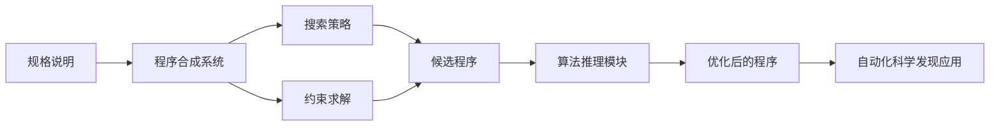

# 基于程序合成的算法推理在自动化科学发现中的创新应用

> 关键词：程序合成、算法推理、自动化科学发现、创新应用、计算模型

> 摘要：本文聚焦于基于程序合成的算法推理在自动化科学发现中的创新应用。首先介绍了相关背景知识，包括研究目的、预期读者等。接着详细阐述了程序合成与算法推理的核心概念及其联系，给出了原理和架构的示意图与流程图。深入探讨了核心算法原理，用 Python 代码进行详细说明，并给出了数学模型和公式。通过实际项目案例展示了代码的实现和解读。分析了其在不同领域的实际应用场景，推荐了学习、开发工具和相关论文著作。最后总结了未来发展趋势与挑战，并提供了常见问题解答和扩展阅读资料。旨在全面展现这一新兴技术在推动自动化科学发现方面的潜力和价值。

## 1. 背景介绍 
### 1.1 目的和范围
在当今科学研究领域，随着数据量的爆炸式增长和问题复杂度的不断提升，传统的科学发现方式面临着巨大的挑战。基于程序合成的算法推理为自动化科学发现提供了一种新的途径。本文的目的在于深入探讨这种新方法在自动化科学发现中的创新应用，研究其原理、算法、实际应用场景等方面的内容。范围涵盖了从理论基础到实际项目案例，涉及计算机科学、物理学、生物学等多个领域。

### 1.2 预期读者
本文预期读者包括计算机科学领域的研究人员、程序员、软件架构师，以及其他对自动化科学发现感兴趣的科研工作者。对于希望了解程序合成和算法推理在科学研究中应用的跨学科研究者也具有一定的参考价值。

### 1.3 文档结构概述
本文首先介绍相关背景知识，让读者对研究的目的、适用人群和文档结构有清晰的认识。接着阐述核心概念与联系，帮助读者建立起基本的理论框架。通过核心算法原理和数学模型的讲解，深入剖析技术的本质。项目实战部分展示了如何将理论应用到实际中。分析实际应用场景，让读者了解该技术的具体用途。推荐相关的工具和资源，方便读者进一步学习和研究。最后总结未来发展趋势与挑战，并提供常见问题解答和扩展阅读资料。

### 1.4 术语表
#### 1.4.1 核心术语定义
- **程序合成**：是指根据给定的规格说明自动生成满足该规格的程序的过程。规格说明可以是输入输出示例、自然语言描述、形式化逻辑公式等。
- **算法推理**：基于已有的算法知识和规则，通过逻辑推导和计算得出新的算法或算法改进的过程。
- **自动化科学发现**：利用计算机技术和算法，自动地从数据中发现新的科学知识、规律和模型的过程。

#### 1.4.2 相关概念解释
- **符号执行**：一种程序分析技术，通过模拟程序的执行过程，使用符号值代替具体的输入值，从而可以探索程序在不同输入情况下的行为。在程序合成中，符号执行可以帮助生成满足特定条件的程序。
- **归纳编程**：通过对有限的输入输出示例进行学习，归纳出一般性的程序的方法。它是程序合成的一种重要方法。

#### 1.4.3 缩略词列表
- **SAT**：布尔可满足性问题（Boolean Satisfiability Problem），是指给定一个布尔公式，判断是否存在一组变量赋值使得该公式的值为真。
- **SMT**：可满足性模理论问题（Satisfiability Modulo Theories），是 SAT 问题的扩展，允许在布尔公式中使用更丰富的理论，如整数算术、实数算术等。

## 2. 核心概念与联系 
### 核心概念原理
#### 程序合成原理
程序合成的核心思想是将程序的生成问题转化为一个搜索问题。给定一个规格说明，程序合成系统会在程序空间中搜索满足该规格的程序。常见的搜索策略包括基于枚举的方法、基于学习的方法和基于约束求解的方法。

基于枚举的方法会按照一定的规则枚举所有可能的程序，然后检查每个程序是否满足规格。这种方法简单直接，但对于复杂的程序空间，枚举的规模会非常大，效率较低。

基于学习的方法通过对输入输出示例进行学习，归纳出一般性的程序。例如，使用机器学习算法对示例进行建模，然后生成满足模型的程序。

基于约束求解的方法将规格说明转化为一组约束条件，然后使用约束求解器求解这些约束，得到满足条件的程序。例如，将程序的输入输出关系表示为逻辑公式，使用 SAT 或 SMT 求解器求解该公式。

#### 算法推理原理
算法推理基于已有的算法知识和规则，通过逻辑推导和计算得出新的算法或算法改进。算法推理可以分为演绎推理和归纳推理。

演绎推理从一般的算法规则出发，推导出具体的算法实例。例如，根据排序算法的一般原理，推导出快速排序算法的具体实现。

归纳推理从具体的算法实例出发，归纳出一般性的算法规则。例如，通过对多个排序算法的分析，归纳出排序算法的通用性质。

### 架构的文本示意图
```plaintext
           规格说明
              |
              v
       程序合成系统
       /           \
  搜索策略      约束求解
       \           /
              v
         候选程序
              |
              v
     算法推理模块
              |
              v
    优化后的程序
              |
              v
  自动化科学发现应用
```

### Mermaid 流程图


## 3. 核心算法原理 & 具体操作步骤 
### 核心算法原理
这里我们以基于约束求解的程序合成算法为例进行说明。该算法的核心思想是将程序合成问题转化为一个 SMT 问题，然后使用 SMT 求解器求解该问题。

假设我们要合成一个程序 $P$，该程序接受一个整数输入 $x$，并输出一个整数 $y$，满足 $y = 2x + 1$。我们可以将这个规格说明转化为一个 SMT 公式。

首先，我们定义程序 $P$ 的语法结构。假设 $P$ 是一个简单的表达式，由变量 $x$、常数和运算符组成。我们可以使用符号执行来生成程序的符号表达式。

设程序 $P$ 的符号表达式为 $e$，则我们的目标是找到一个表达式 $e$，使得对于任意的输入 $x$，都有 $e(x) = 2x + 1$。我们可以将这个条件表示为一个 SMT 公式：

$\forall x. e(x) = 2x + 1$

### Python 源代码详细阐述
```python
from z3 import *

# 定义输入变量 x
x = Int('x')

# 定义符号表达式 e
# 假设 e 是一个线性表达式 a * x + b
a = Int('a')
b = Int('b')
e = a * x + b

# 定义目标表达式
target = 2 * x + 1

# 创建 SMT 求解器
solver = Solver()

# 添加约束条件
solver.add(ForAll([x], e == target))

# 检查约束是否可满足
if solver.check() == sat:
    model = solver.model()
    # 输出结果
    print(f"a = {model[a]}, b = {model[b]}")
else:
    print("No solution found.")
```

### 具体操作步骤
1. **定义输入变量和符号表达式**：在上述代码中，我们定义了输入变量 $x$ 和符号表达式 $e$。
2. **定义目标表达式**：根据规格说明，定义目标表达式 $2x + 1$。
3. **创建 SMT 求解器**：使用 Z3 库创建一个 SMT 求解器。
4. **添加约束条件**：将符号表达式 $e$ 等于目标表达式的条件添加到求解器中。
5. **检查约束是否可满足**：调用求解器的 `check` 方法检查约束是否可满足。如果可满足，获取模型并输出结果；否则，输出无解信息。

## 4. 数学模型和公式 & 详细讲解 & 举例说明 
### 数学模型
在基于约束求解的程序合成中，我们可以将程序合成问题建模为一个约束满足问题（CSP）。设 $P$ 是程序空间，$S$ 是规格说明空间，我们的目标是找到一个程序 $p \in P$，使得 $p$ 满足规格说明 $s \in S$。

用数学公式表示为：

$\exists p \in P. \text{Satisfies}(p, s)$

其中，$\text{Satisfies}(p, s)$ 是一个布尔函数，表示程序 $p$ 是否满足规格说明 $s$。

### 详细讲解
在上述公式中，程序空间 $P$ 可以是所有可能的程序的集合，规格说明空间 $S$ 可以是所有可能的规格说明的集合。$\text{Satisfies}(p, s)$ 函数的具体定义取决于规格说明的类型。例如，如果规格说明是输入输出示例，$\text{Satisfies}(p, s)$ 可以定义为程序 $p$ 对于所有输入输出示例都能产生正确的输出。

### 举例说明
假设我们要合成一个程序 $p$，该程序接受一个整数输入 $x$，并输出 $x$ 的平方。规格说明 $s$ 可以表示为一组输入输出示例：$\{(1, 1), (2, 4), (3, 9)\}$。

程序空间 $P$ 可以是所有由变量 $x$、常数和运算符组成的表达式的集合。$\text{Satisfies}(p, s)$ 函数可以定义为：

$\text{Satisfies}(p, s) = \bigwedge_{(x_i, y_i) \in s} p(x_i) = y_i$

即程序 $p$ 对于所有输入输出示例 $(x_i, y_i)$ 都能产生正确的输出 $y_i$。

我们可以将这个问题转化为一个 SMT 问题，使用 SMT 求解器求解。设程序 $p$ 的符号表达式为 $e$，则我们的目标是找到一个表达式 $e$，使得：

$\bigwedge_{(x_i, y_i) \in s} e(x_i) = y_i$

以下是使用 Python 和 Z3 库实现的代码：

```python
from z3 import *

# 定义输入输出示例
examples = [(1, 1), (2, 4), (3, 9)]

# 定义输入变量 x
x = Int('x')

# 定义符号表达式 e
# 假设 e 是一个二次表达式 a * x * x + b * x + c
a = Int('a')
b = Int('b')
c = Int('c')
e = a * x * x + b * x + c

# 创建 SMT 求解器
solver = Solver()

# 添加约束条件
for (xi, yi) in examples:
    solver.add(e.substitute(x, xi) == yi)

# 检查约束是否可满足
if solver.check() == sat:
    model = solver.model()
    # 输出结果
    print(f"a = {model[a]}, b = {model[b]}, c = {model[c]}")
else:
    print("No solution found.")
```

## 5. 项目实战：代码实际案例和详细解释说明 
### 5.1  开发环境搭建
#### 安装 Python
首先，确保你已经安装了 Python 3.x 版本。可以从 Python 官方网站（https://www.python.org/downloads/）下载并安装。

#### 安装 Z3 库
Z3 是一个强大的 SMT 求解器，我们可以使用 Python 接口来调用它。可以使用以下命令安装 Z3 库：

```sh
pip install z3-solver
```

### 5.2  源代码详细实现和代码解读
#### 项目需求
我们要实现一个程序合成系统，用于合成一个排序算法。给定一组整数输入，程序需要输出一个按升序排列的整数列表。

#### 源代码实现
```python
from z3 import *

# 定义输入列表
n = 5  # 列表长度
input_list = [Int(f"x{i}") for i in range(n)]

# 定义输出列表
output_list = [Int(f"y{i}") for i in range(n)]

# 定义排序约束
solver = Solver()

# 输出列表元素是输入列表元素的排列
for y in output_list:
    solver.add(Or([y == x for x in input_list]))

# 输出列表元素按升序排列
for i in range(n - 1):
    solver.add(output_list[i] <= output_list[i + 1])

# 检查约束是否可满足
if solver.check() == sat:
    model = solver.model()
    result = [model[y].as_long() for y in output_list]
    print("Sorted list:", result)
else:
    print("No solution found.")
```

#### 代码解读
1. **定义输入列表和输出列表**：使用 Z3 的 `Int` 函数定义输入列表和输出列表的元素。
2. **定义排序约束**：
    - 输出列表元素是输入列表元素的排列：使用 `Or` 函数表示每个输出列表元素必须等于某个输入列表元素。
    - 输出列表元素按升序排列：使用 `<=` 运算符表示相邻元素之间的大小关系。
3. **检查约束是否可满足**：调用求解器的 `check` 方法检查约束是否可满足。如果可满足，获取模型并输出排序后的列表；否则，输出无解信息。

### 5.3  代码解读与分析
#### 复杂度分析
该算法的时间复杂度主要取决于 SMT 求解器的求解时间。在最坏情况下，SMT 求解问题是 NP 完全问题，因此时间复杂度可能是指数级的。

#### 可扩展性分析
该代码可以很容易地扩展到处理不同长度的输入列表。只需要修改 `n` 的值即可。此外，还可以扩展到处理不同类型的排序问题，如降序排序、自定义排序规则等。

## 6. 实际应用场景 
### 物理学领域
在物理学研究中，基于程序合成的算法推理可以用于自动发现物理规律。例如，通过对实验数据的分析，程序合成系统可以自动生成描述物理现象的数学模型。在天体物理学中，通过对星系运动数据的分析，合成描述星系运动规律的程序，帮助天文学家更好地理解星系的演化过程。

### 生物学领域
在生物学中，该技术可以用于基因序列分析、蛋白质结构预测等方面。例如，通过对大量基因序列数据的学习，程序合成系统可以自动生成识别特定基因模式的程序，帮助生物学家发现新的基因功能。

### 材料科学领域
在材料科学中，基于程序合成的算法推理可以用于材料性能预测和新材料设计。通过对材料的化学成分、结构和性能数据的分析，合成预测材料性能的程序，为新材料的研发提供指导。

### 计算机科学领域
在计算机科学中，该技术可以用于自动程序修复、软件测试用例生成等方面。例如，当程序出现故障时，程序合成系统可以根据故障信息自动生成修复程序的代码。

## 7. 工具和资源推荐
### 7.1 学习资源推荐
#### 7.1.1 书籍推荐
- 《人工智能：一种现代的方法》：全面介绍了人工智能的基本概念、算法和应用，包括程序合成和算法推理的相关内容。
- 《程序设计语言的形式语义》：深入讲解了程序设计语言的形式化方法，对于理解程序合成的理论基础有很大帮助。

#### 7.1.2 在线课程
- Coursera 上的“人工智能基础”课程：系统地介绍了人工智能的基础知识，包括搜索算法、约束求解等与程序合成相关的内容。
- edX 上的“程序分析与合成”课程：专门讲解程序分析和合成的技术和方法。

#### 7.1.3 技术博客和网站
- Hacker News：一个汇聚了计算机科学领域最新技术和研究成果的社区，经常有关于程序合成和算法推理的讨论。
- arXiv：一个预印本服务器，提供了大量计算机科学、物理学等领域的最新研究论文，包括程序合成和自动化科学发现的相关研究。

### 7.2 开发工具框架推荐
#### 7.2.1 IDE和编辑器
- PyCharm：一款功能强大的 Python 集成开发环境，提供了代码编辑、调试、版本控制等功能，方便开发基于 Python 的程序合成系统。
- Visual Studio Code：一款轻量级的代码编辑器，支持多种编程语言，具有丰富的插件生态系统，可以用于开发程序合成和算法推理相关的代码。

#### 7.2.2 调试和性能分析工具
- PDB：Python 自带的调试器，可以帮助开发者定位程序中的错误。
- cProfile：Python 标准库中的性能分析工具，可以分析程序的运行时间和内存使用情况。

#### 7.2.3 相关框架和库
- Z3：一个强大的 SMT 求解器，提供了 Python 接口，方便开发者在 Python 代码中使用。
- PySMT：一个 Python 库，提供了统一的接口来调用不同的 SMT 求解器，方便开发者进行 SMT 求解。

### 7.3 相关论文著作推荐
#### 7.3.1 经典论文
- "Program Synthesis by Sketching"：介绍了基于草图的程序合成方法，是程序合成领域的经典论文之一。
- "Automated Theorem Proving and Program Synthesis"：探讨了自动定理证明和程序合成之间的关系，为程序合成提供了理论基础。

#### 7.3.2 最新研究成果
- "Neural Program Synthesis with Execution-Guided Search"：提出了一种基于神经网络的程序合成方法，结合了执行引导搜索，提高了程序合成的效率。
- "Automated Scientific Discovery with Program Synthesis"：研究了基于程序合成的自动化科学发现方法，展示了该技术在科学研究中的应用潜力。

#### 7.3.3 应用案例分析
- "Using Program Synthesis to Discover Physical Laws from Experimental Data"：介绍了如何使用程序合成从实验数据中发现物理规律的具体案例。
- "Program Synthesis for Biological Sequence Analysis"：展示了程序合成在生物学序列分析中的应用案例。

## 8. 总结：未来发展趋势与挑战
### 未来发展趋势
- **与机器学习的深度融合**：将程序合成与机器学习技术相结合，利用机器学习的强大学习能力来提高程序合成的效率和准确性。例如，使用深度学习模型来学习程序的结构和语义，从而更好地指导程序合成过程。
- **跨学科应用的拓展**：基于程序合成的算法推理将在更多的学科领域得到应用，如医学、经济学等。通过与不同学科的知识相结合，为解决复杂的科学问题提供新的思路和方法。
- **自动化科学发现平台的建设**：构建集成化的自动化科学发现平台，将程序合成、算法推理、数据处理等功能集成在一起，方便科研人员使用。

### 挑战
- **程序空间的复杂性**：随着程序功能的不断增加，程序空间的规模会呈指数级增长，这给程序合成带来了巨大的挑战。如何有效地搜索程序空间，找到满足规格的程序，是一个亟待解决的问题。
- **规格说明的表达能力**：目前的规格说明语言的表达能力有限，难以准确地描述复杂的科学问题。如何设计更强大的规格说明语言，是提高程序合成应用范围的关键。
- **可解释性问题**：程序合成生成的程序往往缺乏可解释性，难以理解其工作原理。在科学研究中，可解释性是非常重要的，因此如何提高程序合成结果的可解释性是一个重要的挑战。

## 9. 附录：常见问题与解答
### 问题 1：程序合成和传统编程有什么区别？
解答：传统编程是由程序员手动编写代码来实现特定的功能，而程序合成是根据给定的规格说明自动生成程序。程序合成可以提高编程效率，减少人为错误，但目前还不能完全替代传统编程。

### 问题 2：程序合成的准确性如何保证？
解答：程序合成的准确性主要依赖于规格说明的准确性和求解算法的正确性。在实际应用中，需要对规格说明进行仔细的设计和验证，同时选择合适的求解算法。此外，还可以通过对合成程序进行测试和验证来保证其准确性。

### 问题 3：基于程序合成的算法推理在自动化科学发现中的应用有哪些局限性？
解答：其局限性主要包括程序空间的复杂性、规格说明的表达能力和可解释性问题等。此外，该技术对数据的质量和数量要求较高，如果数据存在噪声或不足，可能会影响合成结果的准确性。

## 10. 扩展阅读 & 参考资料
### 扩展阅读
- 《计算理论导引》：深入讲解了计算理论的基本概念和方法，对于理解程序合成和算法推理的理论基础有很大帮助。
- 《算法导论》：经典的算法教材，介绍了各种算法的设计和分析方法，为算法推理提供了丰富的知识。

### 参考资料
- Z3 官方文档：https://github.com/Z3Prover/z3/wiki
- PySMT 官方文档：https://pysmt.readthedocs.io/en/latest/

作者：AI天才研究院/AI Genius Institute & 禅与计算机程序设计艺术 /Zen And The Art of Computer Programming