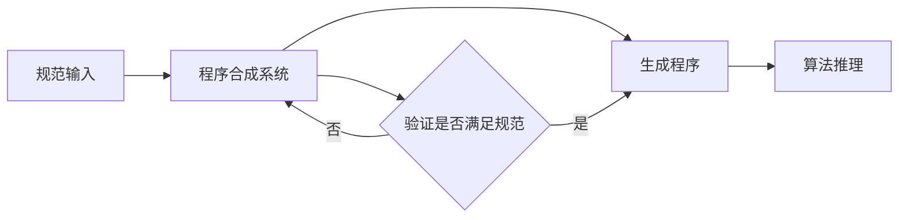

# 基于程序合成的算法推理能力增强方法

> 关键词：程序合成、算法推理能力、符号执行、机器学习、代码生成

> 摘要：本文聚焦于基于程序合成的算法推理能力增强方法。首先介绍了相关背景知识，包括目的、预期读者等内容。接着阐述了程序合成与算法推理的核心概念及两者之间的联系，通过文本示意图和 Mermaid 流程图进行了直观展示。详细讲解了核心算法原理，结合 Python 源代码呈现具体操作步骤。深入探讨了其中涉及的数学模型和公式，并举例说明。通过项目实战，从开发环境搭建、源代码实现到代码解读进行了全面分析。介绍了该方法在实际中的应用场景，推荐了相关的学习资源、开发工具框架以及论文著作。最后总结了未来发展趋势与挑战，并提供了常见问题解答和扩展阅读参考资料，旨在为提升算法推理能力提供全面且深入的技术指导。

## 1. 背景介绍 
### 1.1 目的和范围
随着计算机科学的不断发展，算法推理能力在软件开发、人工智能等众多领域中起着至关重要的作用。程序合成作为一种自动化的代码生成技术，能够根据给定的规范自动生成满足要求的程序。本文章的目的在于探讨如何利用程序合成技术来增强算法推理能力，具体范围涵盖了程序合成的核心概念、相关算法原理、数学模型，以及通过实际项目案例展示其应用，并对未来发展趋势进行展望。

### 1.2 预期读者
本文预期读者包括计算机科学领域的专业人士，如程序员、软件架构师、人工智能研究者等。同时，对于对程序合成和算法推理感兴趣的学生和爱好者也具有一定的参考价值。这些读者通常具备一定的编程基础和算法知识，希望深入了解如何利用程序合成技术提升算法推理能力。

### 1.3 文档结构概述
本文将按照以下结构进行组织：首先介绍相关背景知识，为读者奠定基础；接着阐述程序合成与算法推理的核心概念及联系，使读者对主题有清晰的认识；然后详细讲解核心算法原理和具体操作步骤，结合 Python 代码进行说明；之后介绍涉及的数学模型和公式，并举例解释；通过项目实战部分展示实际应用，包括开发环境搭建、代码实现和解读；介绍该方法在实际中的应用场景；推荐相关的学习资源、开发工具框架和论文著作；最后总结未来发展趋势与挑战，提供常见问题解答和扩展阅读参考资料。

### 1.4 术语表
#### 1.4.1 核心术语定义
- **程序合成**：根据给定的规范（如输入输出示例、功能描述等）自动生成满足要求的程序的技术。
- **算法推理能力**：理解、分析和设计算法的能力，包括对算法的正确性、复杂度等方面的判断。
- **符号执行**：一种程序分析技术，通过使用符号值代替具体值来执行程序，从而探索程序的所有可能执行路径。
- **机器学习**：让计算机通过数据学习模式和规律，从而实现预测和决策的技术。

#### 1.4.2 相关概念解释
- **代码生成**：与程序合成密切相关，是指生成可执行代码的过程。程序合成可以看作是一种更高级的代码生成方式，它基于规范自动生成完整的程序。
- **自动化推理**：利用计算机自动进行逻辑推理的过程，在程序合成和算法推理中都有重要应用。

#### 1.4.3 缩略词列表
- **SAT**：布尔可满足性问题（Boolean Satisfiability Problem）
- **SMT**：可满足性模理论（Satisfiability Modulo Theories）

## 2. 核心概念与联系 

### 程序合成的核心概念
程序合成的目标是根据给定的规范生成满足要求的程序。规范可以有多种形式，例如输入输出示例、功能描述、逻辑公式等。程序合成系统通常由以下几个部分组成：
1. **规范输入模块**：接收用户提供的规范信息。
2. **搜索空间定义**：确定可能的程序解的范围。
3. **搜索算法**：在搜索空间中寻找满足规范的程序。
4. **验证模块**：验证生成的程序是否满足规范。

### 算法推理能力的核心概念
算法推理能力包括对算法的理解、设计和优化。在理解算法时，需要分析算法的正确性、复杂度和适用场景。在设计算法时，需要根据问题的特点选择合适的算法策略。在优化算法时，需要考虑如何减少算法的时间和空间复杂度。

### 程序合成与算法推理能力的联系
程序合成可以为算法推理提供支持。通过程序合成，可以自动生成满足特定规范的算法，从而帮助开发者更好地理解算法的设计思路。同时，程序合成过程中涉及的搜索和验证技术也可以用于算法推理中的正确性证明和复杂度分析。

### 文本示意图
```plaintext
           规范输入
               |
               v
        程序合成系统
  （搜索空间定义、搜索算法、验证模块）
               |
               v
        生成程序
               |
               v
  算法推理（正确性分析、复杂度分析）
```

### Mermaid 流程图


## 3. 核心算法原理 & 具体操作步骤 

### 基于符号执行的程序合成算法原理
符号执行是一种重要的程序分析技术，在程序合成中也有广泛应用。其基本思想是使用符号值代替具体值来执行程序，从而探索程序的所有可能执行路径。在程序合成中，我们可以通过符号执行来生成程序的约束条件，然后求解这些约束条件得到满足要求的程序。

### Python 代码示例
```python
import z3

# 定义符号变量
x = z3.Int('x')
y = z3.Int('y')

# 定义程序规范：计算两个数的和
spec = z3.And(y == x + 2, x > 0)

# 创建求解器
solver = z3.Solver()
solver.add(spec)

# 检查是否有解
if solver.check() == z3.sat:
    model = solver.model()
    print(f"x = {model[x]}, y = {model[y]}")
else:
    print("No solution found.")
```

### 具体操作步骤
1. **定义符号变量**：使用符号执行时，需要定义符号变量来表示程序中的输入和输出。在上述代码中，我们使用 `z3.Int` 定义了两个符号变量 `x` 和 `y`。
2. **定义程序规范**：根据问题的要求，定义程序的规范。在上述代码中，我们定义了一个规范 `spec`，表示 `y` 等于 `x + 2` 且 `x` 大于 0。
3. **创建求解器**：使用 Z3 库创建一个求解器对象，用于求解约束条件。
4. **添加约束条件**：将程序规范添加到求解器中。
5. **检查是否有解**：调用求解器的 `check` 方法检查是否存在满足约束条件的解。如果有解，则可以通过 `model` 方法获取解的值。

## 4. 数学模型和公式 & 详细讲解 & 举例说明 

### 布尔可满足性问题（SAT）
布尔可满足性问题是一个经典的 NP 完全问题，其目标是判断一个布尔公式是否存在一组变量赋值使得公式的值为真。布尔公式通常由布尔变量和逻辑运算符（如与、或、非）组成。

#### 数学公式
一个布尔公式可以表示为 $F(x_1, x_2, \cdots, x_n)$，其中 $x_i$ 是布尔变量。SAT 问题就是要找到一组赋值 $x_1 = v_1, x_2 = v_2, \cdots, x_n = v_n$，使得 $F(v_1, v_2, \cdots, v_n) = \text{True}$。

#### 举例说明
考虑布尔公式 $F(x, y) = (x \land y) \lor (\neg x \land \neg y)$。我们可以通过枚举所有可能的赋值来判断该公式是否可满足：
- 当 $x = \text{True}, y = \text{True}$ 时，$F(\text{True}, \text{True}) = (\text{True} \land \text{True}) \lor (\neg \text{True} \land \neg \text{True}) = \text{True} \lor \text{False} = \text{True}$。
- 当 $x = \text{True}, y = \text{False}$ 时，$F(\text{True}, \text{False}) = (\text{True} \land \text{False}) \lor (\neg \text{True} \land \neg \text{False}) = \text{False} \lor \text{False} = \text{False}$。
- 当 $x = \text{False}, y = \text{True}$ 时，$F(\text{False}, \text{True}) = (\text{False} \land \text{True}) \lor (\neg \text{False} \land \neg \text{True}) = \text{False} \lor \text{False} = \text{False}$。
- 当 $x = \text{False}, y = \text{False}$ 时，$F(\text{False}, \text{False}) = (\text{False} \land \text{False}) \lor (\neg \text{False} \land \neg \text{False}) = \text{False} \lor \text{True} = \text{True}$。

因此，该布尔公式是可满足的。

### 可满足性模理论（SMT）
可满足性模理论是 SAT 问题的扩展，它允许在布尔公式中引入其他理论，如整数算术、实数算术等。SMT 求解器可以用于求解包含这些理论的约束条件。

#### 数学公式
一个 SMT 问题可以表示为 $T \land F(x_1, x_2, \cdots, x_n)$，其中 $T$ 是一组理论公理，$F$ 是布尔公式。SMT 问题就是要找到一组赋值 $x_1 = v_1, x_2 = v_2, \cdots, x_n = v_n$，使得 $T \land F(v_1, v_2, \cdots, v_n)$ 为真。

#### 举例说明
考虑以下 SMT 问题：$x + y = 5 \land x > 0 \land y > 0$，其中 $x$ 和 $y$ 是整数。我们可以使用 SMT 求解器来求解该问题：
```python
import z3

x = z3.Int('x')
y = z3.Int('y')

spec = z3.And(x + y == 5, x > 0, y > 0)

solver = z3.Solver()
solver.add(spec)

if solver.check() == z3.sat:
    model = solver.model()
    print(f"x = {model[x]}, y = {model[y]}")
else:
    print("No solution found.")
```

在上述代码中，我们使用 Z3 求解器求解了该 SMT 问题。如果存在满足约束条件的解，则输出解的值；否则输出 "No solution found."。

## 5. 项目实战：代码实际案例和详细解释说明 

### 5.1  开发环境搭建
#### 安装 Python
首先，确保你已经安装了 Python 3.x 版本。可以从 Python 官方网站（https://www.python.org/downloads/）下载并安装。

#### 安装 Z3 库
Z3 是一个强大的 SMT 求解器，我们可以使用它来实现程序合成。可以使用以下命令安装 Z3 库：
```sh
pip install z3-solver
```

### 5.2  源代码详细实现和代码解读
#### 问题描述
我们要实现一个程序合成的示例，目标是生成一个函数，该函数接收一个整数列表，返回列表中的最大值。

#### 源代码实现
```python
import z3

def program_synthesis():
    # 定义符号变量
    n = z3.Int('n')  # 列表的长度
    i = z3.Int('i')  # 循环变量
    max_val = z3.Int('max_val')  # 最大值
    array = [z3.Int(f'arr_{j}') for j in range(10)]  # 定义数组

    # 定义程序规范
    spec = []
    # 初始化最大值为数组的第一个元素
    spec.append(max_val == array[0])
    # 循环遍历数组，更新最大值
    for j in range(1, 10):
        spec.append(z3.Implies(array[j] > max_val, max_val == array[j]))

    # 创建求解器
    solver = z3.Solver()
    solver.add(z3.And(spec))

    # 检查是否有解
    if solver.check() == z3.sat:
        model = solver.model()
        # 生成 Python 代码
        code = f"""
def find_max(arr):
    max_val = arr[0]
    for num in arr[1:]:
        if num > max_val:
            max_val = num
    return max_val
        """
        return code
    else:
        return None

# 调用程序合成函数
code = program_synthesis()
if code:
    print("Generated code:")
    print(code)
else:
    print("No solution found.")
```

#### 代码解读
1. **定义符号变量**：我们定义了符号变量 `n` 表示列表的长度，`i` 表示循环变量，`max_val` 表示最大值，以及一个符号数组 `array` 表示输入的整数列表。
2. **定义程序规范**：程序规范包括初始化最大值为数组的第一个元素，以及循环遍历数组，更新最大值的条件。
3. **创建求解器**：使用 Z3 求解器来求解程序规范。
4. **检查是否有解**：如果求解器找到满足规范的解，则生成相应的 Python 代码；否则输出 "No solution found."。

### 5.3  代码解读与分析
#### 正确性分析
生成的代码 `find_max` 函数通过初始化最大值为数组的第一个元素，然后遍历数组的其余元素，如果当前元素大于最大值，则更新最大值。最后返回最大值，因此该函数可以正确地找到数组中的最大值。

#### 复杂度分析
该函数的时间复杂度为 $O(n)$，其中 $n$ 是数组的长度。因为只需要遍历数组一次。空间复杂度为 $O(1)$，因为只使用了常数级的额外空间。

## 6. 实际应用场景 
### 软件开发
在软件开发中，程序合成可以帮助开发者快速生成满足特定需求的代码。例如，在编写测试用例时，可以使用程序合成技术根据程序的规范自动生成测试用例代码，提高测试效率。

### 人工智能
在人工智能领域，程序合成可以用于生成智能代理的行为策略。例如，在机器人导航中，可以根据环境信息和目标要求，使用程序合成技术生成机器人的导航策略。

### 算法设计与优化
程序合成可以辅助算法设计和优化。通过自动生成满足特定性能要求的算法，开发者可以更好地理解算法的设计思路，并对算法进行优化。

### 教育领域
在教育领域，程序合成可以作为一种教学工具，帮助学生更好地理解算法和编程。学生可以通过提供规范，使用程序合成工具生成代码，从而加深对编程和算法的理解。

## 7. 工具和资源推荐
### 7.1 学习资源推荐
#### 7.1.1 书籍推荐
- 《程序设计语言的形式语义》：介绍了程序设计语言的形式化方法，对于理解程序合成和算法推理的理论基础有很大帮助。
- 《人工智能：一种现代的方法》：涵盖了人工智能的各个方面，包括自动化推理、机器学习等内容，与程序合成和算法推理密切相关。

#### 7.1.2 在线课程
- Coursera 上的“Automated Reasoning”课程：深入讲解了自动化推理的理论和方法，包括 SAT 和 SMT 求解器的应用。
- edX 上的“Program Synthesis”课程：专门介绍了程序合成的技术和应用。

#### 7.1.3 技术博客和网站
- ACM SIGPLAN：提供了编程语言和程序设计领域的最新研究成果和技术动态。
- arXiv：可以找到关于程序合成和算法推理的最新学术论文。

### 7.2 开发工具框架推荐
#### 7.2.1 IDE和编辑器
- PyCharm：一款功能强大的 Python 集成开发环境，支持代码调试、代码分析等功能。
- Visual Studio Code：一款轻量级的代码编辑器，支持多种编程语言，并且有丰富的插件扩展。

#### 7.2.2 调试和性能分析工具
- PDB：Python 自带的调试工具，可以帮助开发者定位代码中的问题。
- cProfile：Python 标准库中的性能分析工具，可以分析代码的运行时间和函数调用次数。

#### 7.2.3 相关框架和库
- Z3：一个强大的 SMT 求解器，广泛应用于程序分析和程序合成领域。
- KLEE：一个符号执行引擎，可以用于程序的自动化测试和漏洞检测。

### 7.3 相关论文著作推荐
#### 7.3.1 经典论文
- “The Boolean Satisfiability Problem: An Overview”：对布尔可满足性问题进行了全面的介绍，是 SAT 领域的经典论文。
- “Program Synthesis from Examples”：提出了基于示例的程序合成方法，具有重要的理论和实践意义。

#### 7.3.2 最新研究成果
- 在顶级学术会议（如 POPL、PLDI 等）上发表的关于程序合成和算法推理的论文，反映了该领域的最新研究进展。

#### 7.3.3 应用案例分析
- 一些实际应用案例的研究论文，如程序合成在软件开发、人工智能等领域的应用案例，可以帮助读者更好地理解该技术的实际应用。

## 8. 总结：未来发展趋势与挑战
### 未来发展趋势
- **与机器学习的深度融合**：将程序合成与机器学习技术相结合，可以提高程序合成的效率和准确性。例如，使用机器学习模型来预测程序的搜索空间，减少不必要的搜索。
- **多领域应用拓展**：程序合成技术将在更多领域得到应用，如生物信息学、金融科技等。通过解决这些领域的实际问题，进一步推动程序合成技术的发展。
- **自动化程度的提高**：未来的程序合成系统将更加自动化，能够处理更复杂的规范和问题。开发者只需要提供简单的需求描述，系统就可以自动生成满足要求的程序。

### 挑战
- **搜索空间的爆炸问题**：随着问题的复杂度增加，程序合成的搜索空间会呈指数级增长，导致搜索效率低下。如何有效地缩小搜索空间是一个亟待解决的问题。
- **规范的精确性和完整性**：程序合成依赖于准确和完整的规范。然而，在实际应用中，用户提供的规范往往是模糊和不完整的。如何处理不精确的规范是一个挑战。
- **可解释性问题**：程序合成生成的代码往往比较复杂，难以理解和解释。如何提高生成代码的可解释性，使开发者能够更好地理解和维护代码，是一个重要的问题。

## 9. 附录：常见问题与解答
### 问题 1：程序合成和代码生成有什么区别？
程序合成是一种更高级的代码生成方式，它基于规范自动生成完整的程序。代码生成可以是更广义的概念，包括手动编写模板代码、使用代码生成工具等。程序合成更强调自动化和根据规范生成代码的能力。

### 问题 2：程序合成的效率如何？
程序合成的效率取决于问题的复杂度和使用的算法。对于简单的问题，程序合成可以快速生成满足要求的程序。但对于复杂的问题，搜索空间可能会非常大，导致合成效率低下。可以通过优化搜索算法、缩小搜索空间等方法来提高效率。

### 问题 3：程序合成生成的代码质量如何？
程序合成生成的代码质量取决于规范的准确性和合成算法的设计。如果规范准确，合成算法合理，生成的代码通常可以满足要求。但生成的代码可能不够优化，需要开发者进行进一步的优化和调整。

## 10. 扩展阅读 & 参考资料
### 扩展阅读
- 《形式化方法与验证》：深入介绍了形式化方法在程序验证和合成中的应用。
- 《编程语言基础》：讲解了编程语言的基本概念和原理，对于理解程序合成和算法推理有帮助。

### 参考资料
- [Z3 官方文档](https://github.com/Z3Prover/z3/wiki)
- [KLEE 官方网站](https://klee.github.io/)
- [ACM SIGPLAN 官方网站](https://www.sigplan.org/)
- [arXiv 官方网站](https://arxiv.org/)

作者：AI天才研究院/AI Genius Institute & 禅与计算机程序设计艺术 /Zen And The Art of Computer Programming