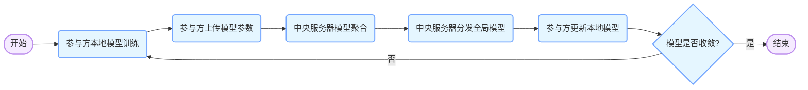

# 基于联邦学习的AI隐私保护推荐系统优化

> 关键词：联邦学习、AI隐私保护、推荐系统、数据安全、系统优化

> 摘要：本文聚焦于基于联邦学习的AI隐私保护推荐系统优化。首先介绍了研究的背景、目的和范围等信息，阐述了联邦学习、AI隐私保护及推荐系统的核心概念与联系。详细讲解了核心算法原理，并用Python代码进行了说明，同时给出了相关数学模型和公式。通过项目实战展示了系统的开发环境搭建、源代码实现及解读。探讨了该系统在实际中的应用场景，推荐了学习、开发所需的工具和资源，最后总结了未来发展趋势与挑战，并提供常见问题解答和扩展阅读参考资料。旨在为构建更安全、高效的隐私保护推荐系统提供全面的技术指导。

## 1. 背景介绍 
### 1.1 目的和范围
在当今数字化时代，推荐系统广泛应用于各个领域，如电商、社交媒体、在线视频等，为用户提供个性化的服务和内容推荐。然而，传统推荐系统在收集和使用用户数据时，往往会面临严重的隐私泄露风险。用户的个人信息、浏览记录、购买行为等敏感数据可能会被泄露或滥用，这不仅侵犯了用户的隐私权，也可能导致用户遭受诈骗、骚扰等问题。

联邦学习作为一种新兴的机器学习技术，能够在不共享原始数据的情况下，实现多个参与方之间的模型训练，从而有效保护用户数据的隐私。本研究的目的是探索如何利用联邦学习优化AI隐私保护推荐系统，在保证推荐准确性的同时，最大程度地保护用户的隐私。

本研究的范围主要包括联邦学习的核心算法原理、AI隐私保护推荐系统的架构设计、相关数学模型的建立与分析、项目实战案例的开发与验证，以及该系统在实际应用场景中的评估和推广等方面。

### 1.2 预期读者
本文预期读者包括但不限于以下几类人群：
- 从事人工智能、机器学习、数据挖掘等领域的科研人员，希望了解联邦学习在隐私保护推荐系统中的应用原理和技术细节，为其研究工作提供参考和启发。
- 互联网企业的技术人员，如算法工程师、数据分析师、系统架构师等，需要掌握基于联邦学习的隐私保护推荐系统的开发和优化方法，以提升企业产品的竞争力和用户体验。
- 对数据隐私和安全问题感兴趣的普通读者，希望通过本文了解联邦学习和隐私保护推荐系统的基本概念和应用价值，增强对数据隐私保护的认识和意识。

### 1.3 文档结构概述
本文将按照以下结构进行组织：
- 核心概念与联系：介绍联邦学习、AI隐私保护和推荐系统的核心概念，并分析它们之间的联系，给出相关的文本示意图和Mermaid流程图。
- 核心算法原理 & 具体操作步骤：详细讲解联邦学习的核心算法原理，并用Python代码进行具体实现和说明。
- 数学模型和公式 & 详细讲解 & 举例说明：建立基于联邦学习的AI隐私保护推荐系统的数学模型，给出相关公式，并通过具体例子进行详细讲解。
- 项目实战：代码实际案例和详细解释说明：通过一个实际的项目案例，展示基于联邦学习的AI隐私保护推荐系统的开发过程，包括开发环境搭建、源代码实现和代码解读。
- 实际应用场景：探讨基于联邦学习的AI隐私保护推荐系统在不同领域的实际应用场景。
- 工具和资源推荐：推荐学习、开发基于联邦学习的AI隐私保护推荐系统所需的工具和资源，包括书籍、在线课程、技术博客、开发工具框架、相关论文著作等。
- 总结：未来发展趋势与挑战：总结基于联邦学习的AI隐私保护推荐系统的发展趋势和面临的挑战。
- 附录：常见问题与解答：解答读者在阅读本文过程中可能遇到的常见问题。
- 扩展阅读 & 参考资料：提供与本文相关的扩展阅读材料和参考资料。

### 1.4 术语表
#### 1.4.1 核心术语定义
- **联邦学习（Federated Learning）**：一种机器学习技术，多个参与方在不共享原始数据的情况下，通过交换模型参数或梯度信息，协同训练一个全局模型。
- **AI隐私保护（AI Privacy Protection）**：在人工智能系统中，采取各种技术和措施，保护用户数据的隐私不被泄露或滥用。
- **推荐系统（Recommendation System）**：一种信息过滤系统，根据用户的历史行为、偏好等信息，为用户推荐个性化的物品或服务。
- **本地模型（Local Model）**：每个参与方在本地数据集上训练得到的模型。
- **全局模型（Global Model）**：通过联邦学习算法，综合各个参与方的本地模型得到的模型。
- **差分隐私（Differential Privacy）**：一种严格的隐私定义，通过在数据中添加噪声，使得查询结果对单个数据记录的存在与否不敏感，从而保护数据的隐私。

#### 1.4.2 相关概念解释
- **数据孤岛（Data Silos）**：指各个组织或部门拥有自己的数据，由于隐私、安全等原因，这些数据不能自由共享和流通，形成了一个个孤立的数据单元。联邦学习可以打破数据孤岛，实现数据的协同利用。
- **模型聚合（Model Aggregation）**：在联邦学习中，将各个参与方的本地模型参数或梯度信息进行综合，得到全局模型的过程。常见的模型聚合方法包括联邦平均算法（Federated Averaging，FedAvg）等。
- **同态加密（Homomorphic Encryption）**：一种加密技术，允许在加密数据上进行特定的计算，而无需先解密数据。在联邦学习中，可以使用同态加密技术保护模型参数或梯度信息的隐私。

#### 1.4.3 缩略词列表
- **FL**：Federated Learning，联邦学习
- **AI**：Artificial Intelligence，人工智能
- **RS**：Recommendation System，推荐系统
- **FedAvg**：Federated Averaging，联邦平均算法
- **DP**：Differential Privacy，差分隐私
- **HE**：Homomorphic Encryption，同态加密

## 2. 核心概念与联系 

### 核心概念原理
#### 联邦学习
联邦学习的核心思想是在多个参与方（如不同的企业、机构或设备）之间进行模型训练，而无需共享原始数据。每个参与方在本地数据集上训练自己的模型，然后将模型参数或梯度信息上传到中央服务器。中央服务器对这些信息进行聚合，得到全局模型，并将全局模型分发给各个参与方。各个参与方再根据全局模型更新自己的本地模型，如此反复迭代，直到全局模型收敛。

联邦学习主要分为横向联邦学习、纵向联邦学习和联邦迁移学习三种类型：
- **横向联邦学习（Horizontal Federated Learning）**：参与方的数据特征空间相同，但样本空间不同。例如，不同地区的银行拥有相同的用户特征（如年龄、性别、收入等），但用户群体不同。横向联邦学习可以在这些银行之间协同训练模型，提高模型的性能。
- **纵向联邦学习（Vertical Federated Learning）**：参与方的数据样本空间相同，但特征空间不同。例如，电商平台和物流企业拥有相同的用户群体，但电商平台拥有用户的购买行为数据，物流企业拥有用户的物流信息数据。纵向联邦学习可以将这些数据结合起来，训练更准确的推荐模型。
- **联邦迁移学习（Federated Transfer Learning）**：参与方的数据特征空间和样本空间都不同，但可以通过迁移学习的方法，在不同领域的数据之间进行知识迁移，实现模型的协同训练。

#### AI隐私保护
AI隐私保护是指在人工智能系统中，采取各种技术和措施，保护用户数据的隐私不被泄露或滥用。常见的AI隐私保护技术包括差分隐私、同态加密、安全多方计算等。
- **差分隐私**：通过在数据中添加噪声，使得查询结果对单个数据记录的存在与否不敏感，从而保护数据的隐私。差分隐私可以应用于数据收集、存储、处理和发布等各个环节。
- **同态加密**：允许在加密数据上进行特定的计算，而无需先解密数据。在联邦学习中，可以使用同态加密技术保护模型参数或梯度信息的隐私，使得中央服务器在聚合模型时无法获取参与方的原始数据。
- **安全多方计算**：多个参与方在不泄露各自私有数据的情况下，协同完成某种计算任务。安全多方计算可以用于联邦学习中的模型聚合过程，确保各个参与方的隐私不被泄露。

#### 推荐系统
推荐系统是一种信息过滤系统，根据用户的历史行为、偏好等信息，为用户推荐个性化的物品或服务。常见的推荐系统算法包括基于内容的推荐、协同过滤推荐、深度学习推荐等。
- **基于内容的推荐（Content-based Recommendation）**：根据物品的特征和用户的历史行为，为用户推荐与历史行为相似的物品。例如，根据用户的浏览记录，为用户推荐相关主题的文章或商品。
- **协同过滤推荐（Collaborative Filtering Recommendation）**：根据用户之间的相似性或物品之间的相似性，为用户推荐其他用户喜欢的物品。协同过滤推荐可以分为基于用户的协同过滤和基于物品的协同过滤两种类型。
- **深度学习推荐（Deep Learning Recommendation）**：利用深度学习模型，如神经网络、卷积神经网络等，对用户的历史行为和物品的特征进行建模，从而为用户推荐个性化的物品或服务。深度学习推荐可以处理复杂的非线性关系，提高推荐的准确性。

### 架构的文本示意图
```plaintext
+-------------------+          +-------------------+
|  参与方1 (本地数据) |          |  参与方2 (本地数据) |
|  +-------------+   |          |  +-------------+   |
|  | 本地模型训练 |   |          |  | 本地模型训练 |   |
|  +-------------+   |          |  +-------------+   |
|        |           |          |        |           |
| 上传模型参数  |          | 上传模型参数  |
|        v           |          |        v           |
+-------------------+          +-------------------+
                 \                    /
                  \                  /
                   \                /
                    +--------------+
                    | 中央服务器    |
                    | +------------+ |
                    | | 模型聚合    | |
                    | +------------+ |
                    |        |       |
                    | 分发全局模型 |
                    |        v       |
                    +--------------+
                          |
                          v
+-------------------+          +-------------------+
|  参与方1 (本地数据) |          |  参与方2 (本地数据) |
|  +-------------+   |          |  +-------------+   |
|  | 更新本地模型 |   |          |  | 更新本地模型 |   |
|  +-------------+   |          |  +-------------+   |
```

### Mermaid流程图


## 3. 核心算法原理 & 具体操作步骤 

### 核心算法原理
本研究主要采用联邦平均算法（Federated Averaging，FedAvg）作为联邦学习的核心算法。FedAvg算法的基本思想是，在每个训练轮次中，中央服务器随机选择一部分参与方，将全局模型分发给这些参与方。各个参与方在本地数据集上使用随机梯度下降（Stochastic Gradient Descent，SGD）算法训练本地模型，然后将本地模型的参数上传到中央服务器。中央服务器对这些参数进行加权平均，得到新的全局模型，并将新的全局模型分发给各个参与方，如此反复迭代，直到全局模型收敛。

### 具体操作步骤
1. **初始化**：中央服务器初始化全局模型的参数 $\theta^0$，并将其分发给各个参与方。
2. **选择参与方**：在每个训练轮次 $t$ 中，中央服务器随机选择 $m$ 个参与方 $S_t \subseteq \{1, 2, \cdots, n\}$，其中 $n$ 是参与方的总数。
3. **本地模型训练**：对于每个参与方 $k \in S_t$，在本地数据集 $D_k$ 上使用随机梯度下降算法训练本地模型，迭代 $E$ 次，得到本地模型的参数 $\theta_k^{t+1}$。具体的更新公式如下：
   - 随机选择一个小批量数据 $B \subseteq D_k$。
   - 计算小批量数据上的梯度 $\nabla L(\theta_k^t, B)$，其中 $L$ 是损失函数。
   - 更新本地模型的参数：$\theta_k^{t+1} = \theta_k^t - \eta \nabla L(\theta_k^t, B)$，其中 $\eta$ 是学习率。
4. **模型聚合**：中央服务器收集各个参与方的本地模型参数 $\theta_k^{t+1}$，$k \in S_t$，并进行加权平均，得到新的全局模型参数 $\theta^{t+1}$。具体的聚合公式如下：
   - 计算每个参与方的权重 $w_k = \frac{|D_k|}{\sum_{i \in S_t}|D_i|}$，其中 $|D_k|$ 是参与方 $k$ 的本地数据集的大小。
   - 计算新的全局模型参数：$\theta^{t+1} = \sum_{k \in S_t} w_k \theta_k^{t+1}$。
5. **分发全局模型**：中央服务器将新的全局模型参数 $\theta^{t+1}$ 分发给各个参与方。
6. **判断收敛**：重复步骤2 - 5，直到全局模型收敛，即满足某个收敛条件，如损失函数的值不再下降或达到最大训练轮次。

### Python源代码实现
```python
import numpy as np

# 定义损失函数（这里以均方误差为例）
def loss_function(y_true, y_pred):
    return np.mean((y_true - y_pred) ** 2)

# 定义随机梯度下降算法
def sgd(theta, X, y, learning_rate):
    num_samples = len(X)
    # 随机选择一个样本
    idx = np.random.randint(0, num_samples)
    x = X[idx]
    y_true = y[idx]
    # 计算预测值
    y_pred = np.dot(x, theta)
    # 计算梯度
    gradient = -2 * (y_true - y_pred) * x
    # 更新参数
    theta = theta - learning_rate * gradient
    return theta

# 定义联邦平均算法
def federated_averaging(num_clients, num_rounds, num_epochs, learning_rate, X_list, y_list):
    # 初始化全局模型参数
    theta_global = np.zeros(X_list[0].shape[1])
    for t in range(num_rounds):
        # 随机选择参与方
        selected_clients = np.random.choice(num_clients, size=num_clients, replace=False)
        theta_local_list = []
        for k in selected_clients:
            X = X_list[k]
            y = y_list[k]
            theta_local = theta_global.copy()
            # 本地模型训练
            for e in range(num_epochs):
                theta_local = sgd(theta_local, X, y, learning_rate)
            theta_local_list.append(theta_local)
        # 模型聚合
        theta_global = np.mean(theta_local_list, axis=0)
    return theta_global

# 示例数据
num_clients = 3
num_samples_per_client = 100
num_features = 5
X_list = [np.random.randn(num_samples_per_client, num_features) for _ in range(num_clients)]
y_list = [np.random.randn(num_samples_per_client) for _ in range(num_clients)]

# 训练参数
num_rounds = 10
num_epochs = 5
learning_rate = 0.01

# 训练全局模型
theta_global = federated_averaging(num_clients, num_rounds, num_epochs, learning_rate, X_list, y_list)
print("全局模型参数:", theta_global)
```

### 代码解释
- `loss_function`：定义了均方误差损失函数，用于计算模型的损失。
- `sgd`：实现了随机梯度下降算法，用于在本地数据集上更新模型参数。
- `federated_averaging`：实现了联邦平均算法，包括选择参与方、本地模型训练、模型聚合和分发全局模型等步骤。
- 示例数据部分生成了3个参与方的随机数据，每个参与方有100个样本，每个样本有5个特征。
- 训练参数部分设置了训练轮次、本地训练的迭代次数和学习率。
- 最后调用 `federated_averaging` 函数训练全局模型，并打印出全局模型的参数。

## 4. 数学模型和公式 & 详细讲解 & 举例说明 

### 数学模型
假设我们有 $n$ 个参与方，每个参与方 $k$ 拥有本地数据集 $D_k = \{(x_{i}^k, y_{i}^k)\}_{i=1}^{N_k}$，其中 $x_{i}^k \in \mathbb{R}^d$ 是输入特征，$y_{i}^k \in \mathbb{R}$ 是目标值，$N_k$ 是参与方 $k$ 的本地数据集的大小。

我们的目标是训练一个全局模型 $\theta \in \mathbb{R}^d$，使得全局损失函数 $L(\theta)$ 最小化。全局损失函数可以定义为各个参与方的本地损失函数的加权和：
$$
L(\theta) = \sum_{k=1}^{n} \frac{N_k}{N} L_k(\theta)
$$
其中 $N = \sum_{k=1}^{n} N_k$ 是所有参与方的数据集的总大小，$L_k(\theta)$ 是参与方 $k$ 的本地损失函数：
$$
L_k(\theta) = \frac{1}{N_k} \sum_{i=1}^{N_k} l(y_{i}^k, f(x_{i}^k; \theta))
$$
其中 $l$ 是损失函数，如均方误差、交叉熵等，$f(x; \theta)$ 是模型的预测函数。

### 联邦平均算法的数学公式
在联邦平均算法中，每个训练轮次 $t$ 的具体步骤如下：
1. **本地模型训练**：对于每个参与方 $k$，在本地数据集 $D_k$ 上使用随机梯度下降算法更新本地模型的参数 $\theta_k$。假设在第 $t$ 轮训练开始时，全局模型的参数为 $\theta^t$，参与方 $k$ 的本地模型的参数初始化为 $\theta_k^t = \theta^t$。在本地训练 $E$ 次后，得到本地模型的参数 $\theta_k^{t+1}$。具体的更新公式如下：
   - 随机选择一个小批量数据 $B \subseteq D_k$。
   - 计算小批量数据上的梯度 $\nabla L_k(\theta_k^t, B)$。
   - 更新本地模型的参数：$\theta_k^{t+1} = \theta_k^t - \eta \nabla L_k(\theta_k^t, B)$，其中 $\eta$ 是学习率。
2. **模型聚合**：中央服务器收集各个参与方的本地模型参数 $\theta_k^{t+1}$，并进行加权平均，得到新的全局模型参数 $\theta^{t+1}$。具体的聚合公式如下：
   - 计算每个参与方的权重 $w_k = \frac{N_k}{N}$。
   - 计算新的全局模型参数：$\theta^{t+1} = \sum_{k=1}^{n} w_k \theta_k^{t+1}$。

### 详细讲解
- **全局损失函数**：全局损失函数 $L(\theta)$ 是各个参与方的本地损失函数的加权和，权重为每个参与方的数据集大小占总数据集大小的比例。这样可以确保全局模型在各个参与方的数据集上都能取得较好的性能。
- **本地模型训练**：每个参与方在本地数据集上使用随机梯度下降算法更新本地模型的参数。随机梯度下降算法通过随机选择一个小批量数据，计算该小批量数据上的梯度，并根据梯度更新模型参数。这样可以减少计算量，提高训练效率。
- **模型聚合**：中央服务器收集各个参与方的本地模型参数，并进行加权平均，得到新的全局模型参数。加权平均的权重为每个参与方的数据集大小占总数据集大小的比例，这样可以确保全局模型综合考虑了各个参与方的信息。

### 举例说明
假设我们有两个参与方，参与方1的数据集大小为 $N_1 = 100$，参与方2的数据集大小为 $N_2 = 200$，总数据集大小为 $N = N_1 + N_2 = 300$。

在第 $t$ 轮训练开始时，全局模型的参数为 $\theta^t = [0.1, 0.2, 0.3]$。参与方1和参与方2分别在本地数据集上进行训练，得到本地模型的参数 $\theta_1^{t+1} = [0.2, 0.3, 0.4]$ 和 $\theta_2^{t+1} = [0.3, 0.4, 0.5]$。

计算每个参与方的权重：
- $w_1 = \frac{N_1}{N} = \frac{100}{300} = \frac{1}{3}$
- $w_2 = \frac{N_2}{N} = \frac{200}{300} = \frac{2}{3}$

计算新的全局模型参数：
$$
\theta^{t+1} = w_1 \theta_1^{t+1} + w_2 \theta_2^{t+1} = \frac{1}{3} [0.2, 0.3, 0.4] + \frac{2}{3} [0.3, 0.4, 0.5] = [0.2667, 0.3667, 0.4667]
$$

这样，我们就得到了第 $t+1$ 轮训练后的全局模型参数。

## 5. 项目实战：代码实际案例和详细解释说明 

### 5.1  开发环境搭建
#### 安装Python
首先，确保你已经安装了Python 3.x 版本。可以从Python官方网站（https://www.python.org/downloads/） 下载并安装适合你操作系统的Python版本。

#### 安装必要的库
本项目需要使用一些Python库，如NumPy、Pandas、Scikit-learn等。可以使用以下命令来安装这些库：
```sh
pip install numpy pandas scikit-learn
```

#### 数据集准备
我们使用一个简单的电影推荐数据集作为示例。该数据集包含用户的电影评分信息，我们的目标是根据用户的历史评分记录，为用户推荐可能喜欢的电影。可以从公开数据集网站（如MovieLens）下载相关数据集，并将其保存到本地。

### 5.2  源代码详细实现和代码解读
```python
import numpy as np
import pandas as pd
from sklearn.model_selection import train_test_split
from sklearn.linear_model import SGDRegressor

# 加载数据集
def load_data(file_path):
    data = pd.read_csv(file_path)
    X = data.drop('rating', axis=1).values
    y = data['rating'].values
    return X, y

# 模拟多个参与方的数据
def split_data_for_clients(X, y, num_clients):
    X_clients = []
    y_clients = []
    num_samples_per_client = len(X) // num_clients
    for i in range(num_clients):
        start_idx = i * num_samples_per_client
        end_idx = (i + 1) * num_samples_per_client if i < num_clients - 1 else len(X)
        X_clients.append(X[start_idx:end_idx])
        y_clients.append(y[start_idx:end_idx])
    return X_clients, y_clients

# 本地模型训练
def local_training(X, y, num_epochs, learning_rate):
    model = SGDRegressor(learning_rate='constant', eta0=learning_rate)
    for _ in range(num_epochs):
        model.partial_fit(X, y)
    return model.coef_

# 模型聚合
def model_aggregation(theta_list, weights):
    theta_global = np.zeros_like(theta_list[0])
    for i in range(len(theta_list)):
        theta_global += weights[i] * theta_list[i]
    return theta_global

# 联邦学习训练
def federated_learning(X_clients, y_clients, num_rounds, num_epochs, learning_rate):
    num_clients = len(X_clients)
    num_samples = [len(X) for X in X_clients]
    total_samples = sum(num_samples)
    weights = [n / total_samples for n in num_samples]
    # 初始化全局模型参数
    theta_global = np.zeros(X_clients[0].shape[1])
    for t in range(num_rounds):
        theta_local_list = []
        for k in range(num_clients):
            X = X_clients[k]
            y = y_clients[k]
            theta_local = local_training(X, y, num_epochs, learning_rate)
            theta_local_list.append(theta_local)
        # 模型聚合
        theta_global = model_aggregation(theta_local_list, weights)
    return theta_global

# 主函数
if __name__ == "__main__":
    file_path = 'movie_ratings.csv'
    X, y = load_data(file_path)
    # 划分训练集和测试集
    X_train, X_test, y_train, y_test = train_test_split(X, y, test_size=0.2, random_state=42)
    num_clients = 3
    X_clients, y_clients = split_data_for_clients(X_train, y_train, num_clients)
    num_rounds = 10
    num_epochs = 5
    learning_rate = 0.01
    theta_global = federated_learning(X_clients, y_clients, num_rounds, num_epochs, learning_rate)
    print("全局模型参数:", theta_global)
```

### 5.3  代码解读与分析
- **load_data**：该函数用于加载数据集，将数据集分为输入特征 $X$ 和目标值 $y$。
- **split_data_for_clients**：该函数用于模拟多个参与方的数据，将训练数据集划分为多个子集，每个子集对应一个参与方。
- **local_training**：该函数用于在本地数据集上训练模型，使用 `SGDRegressor` 进行随机梯度下降训练。
- **model_aggregation**：该函数用于将各个参与方的本地模型参数进行加权平均，得到全局模型参数。
- **federated_learning**：该函数实现了联邦学习的整个训练过程，包括本地模型训练和模型聚合。
- 主函数部分：加载数据集，划分训练集和测试集，模拟多个参与方的数据，调用 `federated_learning` 函数进行训练，并打印出全局模型参数。

通过这个项目实战，我们可以看到如何使用联邦学习算法在不共享原始数据的情况下，协同训练一个全局模型，从而实现隐私保护的推荐系统。

## 6. 实际应用场景 
### 电商推荐系统
在电商领域，不同的电商平台可能拥有不同的用户数据，如用户的浏览记录、购买行为、收藏列表等。由于隐私和竞争等原因，这些平台之间不能直接共享用户数据。通过联邦学习，可以在不共享原始数据的情况下，协同训练一个推荐模型。例如，多个电商平台可以联合训练一个商品推荐模型，根据用户的历史行为为用户推荐更符合其需求的商品，同时保护用户的隐私。

### 医疗健康推荐系统
在医疗健康领域，不同的医疗机构拥有患者的病历、诊断结果、治疗记录等敏感数据。为了保护患者的隐私，这些数据不能随意共享。联邦学习可以用于医疗健康推荐系统的训练，例如，多个医院可以联合训练一个疾病诊断模型或治疗方案推荐模型，提高诊断的准确性和治疗的效果，同时确保患者数据的隐私安全。

### 社交媒体推荐系统
社交媒体平台拥有大量用户的社交关系、兴趣爱好、发布内容等数据。为了保护用户的隐私和数据安全，不同的社交媒体平台可以采用联邦学习技术，协同训练一个个性化的内容推荐模型。例如，根据用户的社交圈子和兴趣爱好，为用户推荐更感兴趣的文章、视频、好友等内容。

### 金融风控推荐系统
在金融领域，银行、证券、保险等机构拥有用户的信用记录、交易行为、资产状况等敏感数据。为了防范金融风险和保护用户隐私，这些机构可以通过联邦学习技术，协同训练一个风控推荐模型。例如，根据用户的信用状况和交易行为，为用户推荐合适的金融产品，同时评估用户的风险等级，预防金融诈骗和违约行为。

## 7. 工具和资源推荐
### 7.1 学习资源推荐
#### 7.1.1 书籍推荐
- 《联邦学习》：全面介绍了联邦学习的基本概念、算法原理、应用场景等内容，是学习联邦学习的经典书籍。
- 《深度学习》：由Ian Goodfellow、Yoshua Bengio和Aaron Courville三位深度学习领域的专家撰写，系统地介绍了深度学习的理论和实践，对于理解推荐系统中的深度学习算法有很大帮助。
- 《推荐系统实践》：详细介绍了推荐系统的各种算法和技术，包括基于内容的推荐、协同过滤推荐、深度学习推荐等，并结合实际案例进行了讲解。

#### 7.1.2 在线课程
- Coursera上的“Deep Learning Specialization”：由Andrew Ng教授授课，涵盖了深度学习的各个方面，包括神经网络、卷积神经网络、循环神经网络等，对于提升深度学习的理论和实践能力有很大帮助。
- edX上的“Federated Learning for Data Privacy and Confidentiality”：专门介绍了联邦学习的相关知识，包括联邦学习的算法原理、隐私保护技术、应用案例等。
- 中国大学MOOC上的“人工智能：模型与算法”：系统地介绍了人工智能的基本概念、模型和算法，对于理解推荐系统的底层原理有很大帮助。

#### 7.1.3 技术博客和网站
- Medium上的“Towards Data Science”：汇集了众多数据科学和机器学习领域的优秀文章，包括联邦学习、推荐系统等方面的内容。
- arXiv.org：一个预印本论文库，提供了大量关于联邦学习、人工智能、机器学习等领域的最新研究成果。
- 开源中国：提供了丰富的技术文章和开源项目，对于了解联邦学习和推荐系统的开源实现有很大帮助。

### 7.2 开发工具框架推荐
#### 7.2.1 IDE和编辑器
- PyCharm：一款专业的Python集成开发环境，提供了丰富的代码编辑、调试、分析等功能，适合开发基于Python的联邦学习和推荐系统。
- Jupyter Notebook：一个交互式的编程环境，支持Python、R等多种编程语言，适合进行数据探索、模型实验和代码演示。
- Visual Studio Code：一款轻量级的代码编辑器，支持多种编程语言和插件，具有强大的代码编辑和调试功能，适合开发各种类型的项目。

#### 7.2.2 调试和性能分析工具
- TensorBoard：TensorFlow提供的一个可视化工具，可以用于监控模型的训练过程、可视化模型的结构和性能指标等。
- PyTorch Profiler：PyTorch提供的一个性能分析工具，可以用于分析模型的计算性能、内存使用情况等，帮助优化模型的性能。
- cProfile：Python标准库中的一个性能分析工具，可以用于分析Python代码的执行时间和函数调用情况，帮助找出代码中的性能瓶颈。

#### 7.2.3 相关框架和库
- TensorFlow Federated：Google开发的一个用于联邦学习的开源框架，提供了丰富的联邦学习算法和工具，支持分布式训练和模型部署。
- PySyft：OpenMined开发的一个用于隐私保护机器学习的开源库，支持联邦学习、差分隐私、同态加密等多种隐私保护技术。
- Surprise：一个用于构建和分析推荐系统的Python库，提供了多种推荐算法的实现，如基于内容的推荐、协同过滤推荐等。

### 7.3 相关论文著作推荐
#### 7.3.1 经典论文
- 《Communication-Efficient Learning of Deep Networks from Decentralized Data》：首次提出了联邦平均算法（Federated Averaging，FedAvg），是联邦学习领域的经典论文。
- 《Differential Privacy》：介绍了差分隐私的基本概念和理论，为数据隐私保护提供了一种严格的数学定义和方法。
- 《Item-Based Collaborative Filtering Recommendation Algorithms》：提出了基于物品的协同过滤推荐算法，是推荐系统领域的经典论文。

#### 7.3.2 最新研究成果
- 《Federated Learning with Non-IID Data》：研究了在非独立同分布（Non-IID）数据下的联邦学习问题，提出了一些解决方法和优化策略。
- 《Privacy-Preserving Federated Learning with Homomorphic Encryption》：探讨了如何使用同态加密技术实现隐私保护的联邦学习，提高了联邦学习的安全性。
- 《Deep Neural Networks for YouTube Recommendations》：介绍了YouTube使用深度学习技术构建推荐系统的方法和经验，为推荐系统的研究和实践提供了重要参考。

#### 7.3.3 应用案例分析
- 《Federated Learning in Healthcare: A Systematic Review》：对联邦学习在医疗健康领域的应用进行了系统的综述，分析了联邦学习在医疗数据隐私保护和协同分析方面的优势和挑战。
- 《Federated Learning for Smart Cities: Challenges and Opportunities》：探讨了联邦学习在智慧城市建设中的应用场景和潜力，分析了联邦学习在智能交通、能源管理、环境监测等方面的应用案例。
- 《Federated Learning in Finance: A Survey》：对联邦学习在金融领域的应用进行了全面的调查，介绍了联邦学习在金融风控、客户推荐、市场预测等方面的应用案例和实践经验。

## 8. 总结：未来发展趋势与挑战
### 未来发展趋势
#### 多模态联邦学习
随着数据类型的日益丰富，如文本、图像、音频、视频等，未来的联邦学习将朝着多模态方向发展。多模态联邦学习可以综合利用不同类型的数据，提高模型的性能和泛化能力。例如，在推荐系统中，可以结合用户的文本评论、图像浏览记录和音频播放历史等多模态数据，为用户提供更个性化、精准的推荐。

#### 跨领域联邦学习
未来的联邦学习将不仅仅局限于同一领域内的多个参与方之间的合作，还将拓展到跨领域的合作。例如，医疗领域可以与金融领域、教育领域等进行跨领域的联邦学习，实现不同领域数据的协同利用，挖掘更多的价值。

#### 与区块链技术结合
区块链技术具有去中心化、不可篡改、可追溯等特点，可以为联邦学习提供更安全、可信的环境。未来的联邦学习系统可能会与区块链技术相结合，利用区块链技术来管理参与方的身份认证、数据共享和模型更新等过程，提高联邦学习的安全性和可信度。

#### 自动化联邦学习
随着人工智能技术的发展，未来的联邦学习将朝着自动化方向发展。自动化联邦学习可以自动选择最优的算法、参数和模型结构，减少人工干预，提高联邦学习的效率和性能。例如，使用自动机器学习（AutoML）技术来自动优化联邦学习模型。

### 面临的挑战
#### 数据异构性问题
在实际应用中，不同参与方的数据往往具有不同的分布和特征，即数据异构性问题。数据异构性会导致联邦学习模型的性能下降，甚至无法收敛。如何解决数据异构性问题，是未来联邦学习研究的一个重要挑战。

#### 通信开销问题
联邦学习需要在参与方和中央服务器之间频繁地交换模型参数或梯度信息，这会带来较大的通信开销。特别是在大规模分布式环境下，通信开销可能会成为制约联邦学习性能的瓶颈。如何降低通信开销，提高联邦学习的通信效率，是未来需要解决的一个关键问题。

#### 隐私保护与模型性能的平衡问题
在联邦学习中，隐私保护是一个重要的目标，但过度的隐私保护可能会导致模型性能的下降。如何在保证隐私保护的前提下，尽可能地提高模型的性能，是未来联邦学习研究需要解决的一个难题。

#### 安全攻击问题
联邦学习系统面临着各种安全攻击，如模型中毒攻击、数据窃取攻击等。如何设计安全可靠的联邦学习算法和协议，抵御各种安全攻击，保障联邦学习系统的安全性和可靠性，是未来需要研究的一个重要方向。

## 9. 附录：常见问题与解答
### 1. 联邦学习与传统机器学习有什么区别？
传统机器学习通常需要将所有数据集中到一个中心节点进行训练，而联邦学习则允许在不共享原始数据的情况下，多个参与方协同训练一个全局模型。联邦学习可以有效保护数据的隐私，解决数据孤岛问题，适用于数据分散、隐私要求高的场景。

### 2. 联邦学习的收敛速度如何？
联邦学习的收敛速度受到多种因素的影响，如数据分布、模型复杂度、参与方数量、通信开销等。在数据异构性较大的情况下，联邦学习的收敛速度可能会较慢。可以通过优化算法、调整参数、采用自适应策略等方法来提高联邦学习的收敛速度。

### 3. 如何评估联邦学习模型的性能？
可以使用与传统机器学习相同的评估指标来评估联邦学习模型的性能，如准确率、召回率、F1值、均方误差等。同时，还需要考虑联邦学习模型的隐私保护效果，如差分隐私预算、同态加密的安全性等。

### 4. 联邦学习是否适用于所有场景？
联邦学习并不适用于所有场景。它更适合于数据分散、隐私要求高、参与方之间需要协同合作的场景。对于数据集中、隐私要求不高的场景，传统机器学习可能更合适。

### 5. 如何确保联邦学习系统的安全性？
可以采用多种技术和措施来确保联邦学习系统的安全性，如差分隐私、同态加密、安全多方计算等。同时，还需要建立严格的身份认证和访问控制机制，防止恶意参与方的攻击和数据泄露。

## 10. 扩展阅读 & 参考资料
### 扩展阅读
- 《人工智能时代的隐私保护》：深入探讨了人工智能时代数据隐私保护的重要性和挑战，介绍了各种隐私保护技术和方法。
- 《大数据安全与隐私》：全面介绍了大数据安全与隐私的相关知识，包括数据加密、访问控制、匿名化处理等技术。
- 《机器学习实战》：通过实际案例介绍了机器学习的各种算法和应用，对于理解联邦学习和推荐系统的实践应用有很大帮助。

### 参考资料
- [Federated Learning: Challenges, Methods, and Future Directions](https://arxiv.org/abs/1908.07873)
- [Differential Privacy: A Survey of Results](https://link.springer.com/chapter/10.1007/978-3-642-17373-8_1)
- [Item-Based Collaborative Filtering Recommendation Algorithms](https://dl.acm.org/doi/10.1145/371920.372071)

作者：AI天才研究院/AI Genius Institute & 禅与计算机程序设计艺术 /Zen And The Art of Computer Programming