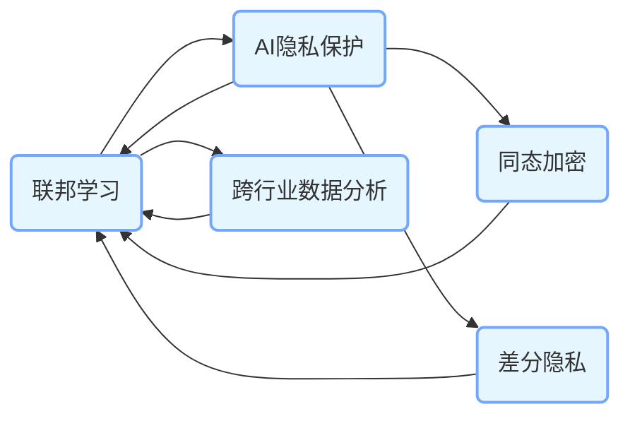

# 基于联邦学习的AI隐私保护跨行业数据分析系统

> 关键词：联邦学习、AI隐私保护、跨行业数据分析、数据安全、系统架构

> 摘要：本文深入探讨了基于联邦学习的AI隐私保护跨行业数据分析系统。在当今数据驱动的时代，跨行业数据分析具有巨大的价值，但数据隐私和安全问题成为了阻碍其发展的关键因素。联邦学习作为一种新兴的技术，为解决这一问题提供了有效的途径。文章详细介绍了联邦学习的核心概念、算法原理、数学模型，通过实际案例展示了该系统的开发和应用，分析了其实际应用场景，并推荐了相关的学习资源、开发工具和论文著作。最后对该系统的未来发展趋势与挑战进行了总结，并提供了常见问题的解答和扩展阅读的参考资料。

## 1. 背景介绍 
### 1.1 目的和范围
在当今数字化时代，数据已成为推动各行业发展的核心资产。跨行业数据分析能够整合不同行业的数据，挖掘出更有价值的信息和知识，为企业决策、社会发展提供有力支持。然而，数据隐私和安全问题一直是跨行业数据分析面临的重大挑战。不同行业的数据往往包含大量敏感信息，如用户的个人身份、健康状况、财务信息等，这些数据的泄露可能会给用户带来严重的损失。

联邦学习作为一种新兴的机器学习技术，允许在不共享原始数据的情况下进行模型训练，有效地保护了数据的隐私和安全。本文章的目的是详细介绍基于联邦学习的AI隐私保护跨行业数据分析系统，包括其核心概念、算法原理、数学模型、实际应用等方面，为相关领域的研究人员和开发者提供全面的技术参考。

本文的范围涵盖了联邦学习的基本原理、跨行业数据分析系统的架构设计、核心算法的实现、数学模型的建立、实际应用场景的分析，以及相关工具和资源的推荐等内容。

### 1.2 预期读者
本文预期读者包括但不限于以下几类人群：
- **科研人员**：对联邦学习、数据隐私保护和跨行业数据分析等领域感兴趣的科研人员，希望通过本文了解最新的技术进展和研究方向。
- **开发者**：从事人工智能、机器学习、数据分析等领域的开发者，希望学习如何使用联邦学习技术构建AI隐私保护跨行业数据分析系统。
- **企业决策者**：企业的高层管理人员和决策者，希望了解联邦学习技术在跨行业数据分析中的应用价值和潜力，为企业的战略决策提供参考。
- **学生**：计算机科学、统计学、数学等相关专业的学生，希望通过本文了解联邦学习的基本原理和应用场景，拓宽自己的知识面。

### 1.3 文档结构概述
本文的文档结构如下：
- **核心概念与联系**：介绍联邦学习、AI隐私保护和跨行业数据分析的核心概念，以及它们之间的联系。
- **核心算法原理 & 具体操作步骤**：详细讲解联邦学习的核心算法原理，并给出具体的操作步骤和Python源代码实现。
- **数学模型和公式 & 详细讲解 & 举例说明**：建立联邦学习的数学模型，给出相关的公式，并通过具体的例子进行详细讲解。
- **项目实战：代码实际案例和详细解释说明**：通过一个实际的项目案例，展示如何使用联邦学习技术构建AI隐私保护跨行业数据分析系统，包括开发环境搭建、源代码实现和代码解读。
- **实际应用场景**：分析基于联邦学习的AI隐私保护跨行业数据分析系统在不同行业的实际应用场景。
- **工具和资源推荐**：推荐相关的学习资源、开发工具和论文著作，帮助读者进一步深入学习和研究。
- **总结：未来发展趋势与挑战**：对基于联邦学习的AI隐私保护跨行业数据分析系统的未来发展趋势进行总结，并分析面临的挑战。
- **附录：常见问题与解答**：解答读者在学习和使用过程中常见的问题。
- **扩展阅读 & 参考资料**：提供相关的扩展阅读材料和参考资料，方便读者进一步深入学习。

### 1.4 术语表
#### 1.4.1 核心术语定义
- **联邦学习（Federated Learning）**：一种机器学习技术，允许在多个参与方之间进行模型训练，而无需共享原始数据。每个参与方在本地数据上训练模型，然后将模型参数发送给中央服务器进行聚合，最终得到一个全局模型。
- **AI隐私保护（AI Privacy Protection）**：指在人工智能系统中采取各种技术和措施，保护数据的隐私和安全，防止数据泄露和滥用。
- **跨行业数据分析（Cross - Industry Data Analysis）**：整合不同行业的数据，进行数据分析和挖掘，以发现更有价值的信息和知识。
- **数据泄露（Data Leakage）**：指未经授权的数据披露，可能导致敏感信息被泄露给外部人员。
- **模型聚合（Model Aggregation）**：在联邦学习中，将各个参与方的本地模型参数进行加权平均，得到一个全局模型的过程。

#### 1.4.2 相关概念解释
- **同态加密（Homomorphic Encryption）**：一种加密技术，允许在加密数据上进行计算，而无需解密数据。在联邦学习中，可以使用同态加密技术对模型参数进行加密，保护数据的隐私。
- **差分隐私（Differential Privacy）**：一种隐私保护技术，通过在数据中添加噪声，使得攻击者无法从数据中推断出某个个体的信息。在联邦学习中，可以使用差分隐私技术对模型参数进行处理，提高数据的隐私性。
- **区块链（Blockchain）**：一种分布式账本技术，具有去中心化、不可篡改等特点。在联邦学习中，可以使用区块链技术来管理参与方的身份和数据，提高系统的安全性和可信度。

#### 1.4.3 缩略词列表
- **FL**：Federated Learning（联邦学习）
- **AI**：Artificial Intelligence（人工智能）
- **DP**：Differential Privacy（差分隐私）
- **HE**：Homomorphic Encryption（同态加密）

## 2. 核心概念与联系 

### 2.1 联邦学习的核心概念
联邦学习是一种新兴的机器学习范式，旨在解决数据隐私和安全问题。传统的机器学习方法通常需要将所有数据集中到一个中心服务器上进行训练，这在涉及敏感数据时会带来严重的隐私风险。而联邦学习允许数据保留在本地，各个参与方在本地数据上训练模型，然后将模型参数上传到中央服务器进行聚合，最终得到一个全局模型。

联邦学习主要分为以下几种类型：
- **横向联邦学习（Horizontal Federated Learning）**：参与方的数据特征空间相同，但样本空间不同。例如，不同地区的银行拥有相似的客户特征（如年龄、收入等），但客户群体不同。
- **纵向联邦学习（Vertical Federated Learning）**：参与方的数据样本空间相同，但特征空间不同。例如，电商平台和物流公司拥有相同的用户群体，但电商平台拥有用户的购物信息，物流公司拥有用户的物流信息。
- **联邦迁移学习（Federated Transfer Learning）**：参与方的数据特征空间和样本空间都不同，但可以通过迁移学习的方法在不同领域的数据上进行模型训练。

### 2.2 AI隐私保护的核心概念
AI隐私保护是指在人工智能系统中采取各种技术和措施，保护数据的隐私和安全。随着人工智能技术的广泛应用，数据隐私问题日益突出。AI隐私保护的主要目标包括：
- **数据保密性**：确保数据不被未经授权的访问和泄露。
- **数据完整性**：保证数据在传输和处理过程中不被篡改。
- **数据可用性**：确保数据在需要时能够正常使用。

常见的AI隐私保护技术包括同态加密、差分隐私、多方安全计算等。

### 2.3 跨行业数据分析的核心概念
跨行业数据分析是指整合不同行业的数据，进行数据分析和挖掘，以发现更有价值的信息和知识。不同行业的数据往往具有互补性，通过跨行业数据分析可以打破数据壁垒，挖掘出隐藏在数据中的潜在价值。例如，医疗行业和保险行业的数据结合可以用于风险评估和保险定价；金融行业和科技行业的数据结合可以用于金融创新和风险管理。

### 2.4 核心概念之间的联系
联邦学习为AI隐私保护和跨行业数据分析提供了有效的技术手段。在跨行业数据分析中，不同行业的数据往往包含敏感信息，直接共享数据会带来隐私风险。联邦学习允许在不共享原始数据的情况下进行模型训练，有效地保护了数据的隐私和安全。同时，通过联邦学习可以整合不同行业的数据，进行跨行业数据分析，挖掘出更有价值的信息和知识。

AI隐私保护技术可以进一步增强联邦学习系统的安全性。例如，同态加密和差分隐私技术可以用于保护模型参数的隐私，防止数据泄露。

以下是核心概念联系的Mermaid流程图：


## 3. 核心算法原理 & 具体操作步骤 

### 3.1 联邦学习的核心算法原理
联邦学习的核心算法是联邦平均算法（Federated Averaging，简称FedAvg）。该算法由Google于2016年提出，是一种简单而有效的联邦学习算法。

FedAvg算法的基本思想是：中央服务器初始化一个全局模型，然后将模型参数分发给各个参与方。每个参与方在本地数据上使用梯度下降法训练模型，得到本地模型参数。接着，各个参与方将本地模型参数上传到中央服务器，中央服务器对这些参数进行加权平均，得到新的全局模型参数。重复上述过程，直到全局模型收敛。

### 3.2 具体操作步骤
以下是FedAvg算法的具体操作步骤：
1. **初始化**：中央服务器初始化一个全局模型 $W_0$，并将其分发给各个参与方。
2. **本地训练**：每个参与方 $i$ 在本地数据 $D_i$ 上使用梯度下降法训练模型，得到本地模型参数 $W_i^t$，其中 $t$ 表示训练轮数。
3. **参数上传**：各个参与方将本地模型参数 $W_i^t$ 上传到中央服务器。
4. **模型聚合**：中央服务器对各个参与方的本地模型参数进行加权平均，得到新的全局模型参数 $W_{t + 1}$：
   $$W_{t + 1}=\sum_{i = 1}^{n}\frac{N_i}{N}W_i^t$$
   其中，$n$ 表示参与方的数量，$N_i$ 表示参与方 $i$ 的本地数据样本数量，$N=\sum_{i = 1}^{n}N_i$ 表示所有参与方的总数据样本数量。
5. **模型分发**：中央服务器将新的全局模型参数 $W_{t + 1}$ 分发给各个参与方。
6. **重复步骤2 - 5**：直到全局模型收敛。

### 3.3 Python源代码实现
以下是使用Python和PyTorch实现FedAvg算法的示例代码：
```python
import torch
import torch.nn as nn
import torch.optim as optim
from torch.utils.data import DataLoader, Dataset

# 定义一个简单的神经网络模型
class SimpleNet(nn.Module):
    def __init__(self):
        super(SimpleNet, self).__init__()
        self.fc1 = nn.Linear(10, 20)
        self.fc2 = nn.Linear(20, 1)

    def forward(self, x):
        x = torch.relu(self.fc1(x))
        x = self.fc2(x)
        return x

# 定义本地训练函数
def local_train(model, dataloader, epochs=1):
    criterion = nn.MSELoss()
    optimizer = optim.SGD(model.parameters(), lr=0.01)
    for epoch in range(epochs):
        for data, target in dataloader:
            optimizer.zero_grad()
            output = model(data)
            loss = criterion(output, target)
            loss.backward()
            optimizer.step()
    return model.state_dict()

# 定义模型聚合函数
def model_aggregation(local_models, data_sizes):
    total_size = sum(data_sizes)
    global_model = {}
    for key in local_models[0].keys():
        global_model[key] = torch.zeros_like(local_models[0][key])
        for i, model in enumerate(local_models):
            global_model[key] += (data_sizes[i] / total_size) * model[key]
    return global_model

# 模拟跨行业数据
class CustomDataset(Dataset):
    def __init__(self, data, targets):
        self.data = data
        self.targets = targets

    def __len__(self):
        return len(self.data)

    def __getitem__(self, idx):
        return self.data[idx], self.targets[idx]

# 主函数
def main():
    # 初始化全局模型
    global_model = SimpleNet()
    num_clients = 3
    client_data_sizes = [100, 200, 300]
    client_dataloaders = []
    for size in client_data_sizes:
        data = torch.randn(size, 10)
        targets = torch.randn(size, 1)
        dataset = CustomDataset(data, targets)
        dataloader = DataLoader(dataset, batch_size=10, shuffle=True)
        client_dataloaders.append(dataloader)

    num_rounds = 10
    for round in range(num_rounds):
        local_models = []
        for i in range(num_clients):
            client_model = SimpleNet()
            client_model.load_state_dict(global_model.state_dict())
            local_model_params = local_train(client_model, client_dataloaders[i])
            local_models.append(local_model_params)
        global_model_params = model_aggregation(local_models, client_data_sizes)
        global_model.load_state_dict(global_model_params)
    print("Training finished!")

if __name__ == "__main__":
    main()
```

## 4. 数学模型和公式 & 详细讲解 & 举例说明 

### 4.1 数学模型
联邦学习的数学模型可以描述为以下优化问题：
$$\min_{W}F(W)=\sum_{i = 1}^{n}\frac{N_i}{N}f_i(W)$$
其中，$W$ 表示全局模型参数，$F(W)$ 表示全局损失函数，$f_i(W)$ 表示参与方 $i$ 的本地损失函数，$n$ 表示参与方的数量，$N_i$ 表示参与方 $i$ 的本地数据样本数量，$N=\sum_{i = 1}^{n}N_i$ 表示所有参与方的总数据样本数量。

### 4.2 公式详细讲解
- **本地损失函数**：参与方 $i$ 的本地损失函数 $f_i(W)$ 可以表示为：
  $$f_i(W)=\frac{1}{N_i}\sum_{x_j,y_j\in D_i}L(W;x_j,y_j)$$
  其中，$D_i$ 表示参与方 $i$ 的本地数据集，$(x_j,y_j)$ 表示数据集中的一个样本，$L(W;x_j,y_j)$ 表示样本 $(x_j,y_j)$ 的损失函数。
- **全局损失函数**：全局损失函数 $F(W)$ 是各个参与方本地损失函数的加权平均：
  $$F(W)=\sum_{i = 1}^{n}\frac{N_i}{N}f_i(W)=\frac{1}{N}\sum_{i = 1}^{n}\sum_{x_j,y_j\in D_i}L(W;x_j,y_j)$$
- **模型聚合公式**：在联邦平均算法中，新的全局模型参数 $W_{t + 1}$ 是各个参与方本地模型参数 $W_i^t$ 的加权平均：
  $$W_{t + 1}=\sum_{i = 1}^{n}\frac{N_i}{N}W_i^t$$

### 4.3 举例说明
假设有两个参与方 $A$ 和 $B$，参与方 $A$ 有 $N_A = 100$ 个样本，参与方 $B$ 有 $N_B = 200$ 个样本。总样本数量 $N = N_A+N_B = 300$。

在第 $t$ 轮训练后，参与方 $A$ 的本地模型参数为 $W_A^t$，参与方 $B$ 的本地模型参数为 $W_B^t$。则新的全局模型参数 $W_{t + 1}$ 可以计算如下：
$$W_{t + 1}=\frac{N_A}{N}W_A^t+\frac{N_B}{N}W_B^t=\frac{100}{300}W_A^t+\frac{200}{300}W_B^t$$

## 5. 项目实战：代码实际案例和详细解释说明 

### 5.1  开发环境搭建
为了实现基于联邦学习的AI隐私保护跨行业数据分析系统，我们需要搭建相应的开发环境。以下是具体的搭建步骤：
1. **安装Python**：建议使用Python 3.7及以上版本。可以从Python官方网站（https://www.python.org/downloads/）下载并安装。
2. **安装深度学习框架**：我们使用PyTorch作为深度学习框架。可以使用以下命令安装：
   ```sh
   pip install torch torchvision
   ```
3. **安装其他依赖库**：根据具体需求，可能需要安装其他依赖库，如NumPy、Pandas等。可以使用以下命令安装：
   ```sh
   pip install numpy pandas
   ```

### 5.2  源代码详细实现和代码解读
以下是一个完整的基于联邦学习的AI隐私保护跨行业数据分析系统的源代码实现：
```python
import torch
import torch.nn as nn
import torch.optim as optim
from torch.utils.data import DataLoader, Dataset
import numpy as np
import pandas as pd

# 定义一个简单的神经网络模型
class SimpleNet(nn.Module):
    def __init__(self):
        super(SimpleNet, self).__init__()
        self.fc1 = nn.Linear(10, 20)
        self.fc2 = nn.Linear(20, 1)

    def forward(self, x):
        x = torch.relu(self.fc1(x))
        x = self.fc2(x)
        return x

# 定义本地训练函数
def local_train(model, dataloader, epochs=1):
    criterion = nn.MSELoss()
    optimizer = optim.SGD(model.parameters(), lr=0.01)
    for epoch in range(epochs):
        for data, target in dataloader:
            optimizer.zero_grad()
            output = model(data)
            loss = criterion(output, target)
            loss.backward()
            optimizer.step()
    return model.state_dict()

# 定义模型聚合函数
def model_aggregation(local_models, data_sizes):
    total_size = sum(data_sizes)
    global_model = {}
    for key in local_models[0].keys():
        global_model[key] = torch.zeros_like(local_models[0][key])
        for i, model in enumerate(local_models):
            global_model[key] += (data_sizes[i] / total_size) * model[key]
    return global_model

# 模拟跨行业数据
class CustomDataset(Dataset):
    def __init__(self, data, targets):
        self.data = data
        self.targets = targets

    def __len__(self):
        return len(self.data)

    def __getitem__(self, idx):
        return self.data[idx], self.targets[idx]

# 主函数
def main():
    # 初始化全局模型
    global_model = SimpleNet()
    num_clients = 3
    client_data_sizes = [100, 200, 300]
    client_dataloaders = []
    for size in client_data_sizes:
        data = torch.randn(size, 10)
        targets = torch.randn(size, 1)
        dataset = CustomDataset(data, targets)
        dataloader = DataLoader(dataset, batch_size=10, shuffle=True)
        client_dataloaders.append(dataloader)

    num_rounds = 10
    for round in range(num_rounds):
        local_models = []
        for i in range(num_clients):
            client_model = SimpleNet()
            client_model.load_state_dict(global_model.state_dict())
            local_model_params = local_train(client_model, client_dataloaders[i])
            local_models.append(local_model_params)
        global_model_params = model_aggregation(local_models, client_data_sizes)
        global_model.load_state_dict(global_model_params)
    print("Training finished!")

if __name__ == "__main__":
    main()
```

### 代码解读与分析
1. **模型定义**：定义了一个简单的神经网络模型 `SimpleNet`，包含两个全连接层。
2. **本地训练函数**：`local_train` 函数实现了在本地数据上训练模型的过程，使用均方误差损失函数和随机梯度下降优化器。
3. **模型聚合函数**：`model_aggregation` 函数实现了将各个参与方的本地模型参数进行加权平均，得到新的全局模型参数的过程。
4. **数据模拟**：使用 `CustomDataset` 类模拟跨行业数据，并使用 `DataLoader` 进行数据加载。
5. **主函数**：在主函数中，初始化全局模型，模拟多个参与方的数据，进行多轮的联邦学习训练，最后输出训练完成的信息。

## 6. 实际应用场景 
### 6.1 医疗行业
在医疗行业，不同医院拥有大量的患者数据，但由于数据隐私和安全问题，这些数据难以共享。基于联邦学习的AI隐私保护跨行业数据分析系统可以在不共享患者原始数据的情况下，联合多个医院的数据进行模型训练。例如，可以使用联邦学习技术训练疾病预测模型、药物研发模型等，提高医疗诊断和治疗的准确性。

### 6.2 金融行业
金融行业涉及大量的用户敏感信息，如银行账户信息、信用记录等。通过联邦学习，可以整合不同金融机构的数据，进行风险评估、反欺诈检测等任务。例如，多个银行可以联合训练一个信用评分模型，提高信用评估的准确性，同时保护用户的隐私。

### 6.3 交通行业
交通行业的数据包括车辆行驶数据、交通流量数据等。不同的交通管理部门和企业拥有各自的数据，通过联邦学习可以整合这些数据，进行交通流量预测、智能交通控制等任务。例如，多个城市的交通管理部门可以联合训练一个交通流量预测模型，优化交通信号灯的控制，提高交通效率。

### 6.4 教育行业
教育行业的数据包括学生的学习成绩、学习行为等。不同学校和教育机构可以使用联邦学习技术，联合训练学生学习能力预测模型、个性化学习推荐模型等，提高教育教学质量，同时保护学生的隐私。

## 7. 工具和资源推荐
### 7.1 学习资源推荐
#### 7.1.1 书籍推荐
- 《联邦学习》：全面介绍了联邦学习的基本原理、算法、应用等方面的内容，是学习联邦学习的经典书籍。
- 《人工智能隐私保护》：深入探讨了人工智能领域的数据隐私保护问题，包括各种隐私保护技术和方法。
- 《数据分析实战》：介绍了数据分析的基本方法和技巧，以及如何在实际项目中应用数据分析技术。

#### 7.1.2 在线课程
- Coursera上的“Federated Learning”课程：由知名学者授课，系统地介绍了联邦学习的理论和实践。
- edX上的“Artificial Intelligence Privacy Protection”课程：讲解了人工智能隐私保护的相关知识和技术。
- 网易云课堂上的“数据分析实战”课程：通过实际案例，教授数据分析的方法和技巧。

#### 7.1.3 技术博客和网站
- 联邦学习官方网站（https://federatedlearning.org/）：提供了联邦学习的最新研究成果和技术动态。
- arXiv（https://arxiv.org/）：一个预印本平台，包含了大量的学术论文，其中有很多关于联邦学习和AI隐私保护的研究。
- 机器之心（https://www.alienzone.org/）：关注人工智能领域的最新技术和应用，有很多关于联邦学习和数据分析的文章。

### 7.2 开发工具框架推荐
#### 7.2.1 IDE和编辑器
- PyCharm：一款功能强大的Python集成开发环境，支持代码编辑、调试、版本控制等功能。
- Jupyter Notebook：一个交互式的开发环境，适合进行数据分析和模型训练的实验。
- Visual Studio Code：一款轻量级的代码编辑器，支持多种编程语言，有丰富的插件扩展。

#### 7.2.2 调试和性能分析工具
- PyTorch Profiler：PyTorch自带的性能分析工具，可以帮助开发者分析模型的性能瓶颈。
- TensorBoard：一个可视化工具，可以用于监控模型的训练过程、可视化模型结构等。
- cProfile：Python标准库中的性能分析工具，可以分析代码的运行时间和函数调用情况。

#### 7.2.3 相关框架和库
- PySyft：一个基于PyTorch的联邦学习框架，提供了丰富的联邦学习功能和工具。
- Flower：一个通用的联邦学习框架，支持多种深度学习框架，如PyTorch、TensorFlow等。
- OpenMined：一个开源的隐私计算社区，提供了多种隐私保护技术和工具。

### 7.3 相关论文著作推荐
#### 7.3.1 经典论文
- 《Communication-Efficient Learning of Deep Networks from Decentralized Data》：提出了联邦平均算法（FedAvg），是联邦学习领域的经典论文。
- 《Differential Privacy: A Survey of Results》：对差分隐私技术进行了全面的综述，介绍了差分隐私的基本概念、算法和应用。
- 《Homomorphic Encryption for Machine Learning: A Survey》：对同态加密在机器学习中的应用进行了综述，介绍了同态加密的基本原理和算法。

#### 7.3.2 最新研究成果
- 《Federated Learning with Non-IID Data: A Survey》：对非独立同分布（Non-IID）数据下的联邦学习进行了综述，介绍了当前的研究现状和挑战。
- 《Privacy-Preserving Machine Learning in the Age of Big Data》：探讨了大数据时代下隐私保护机器学习的发展趋势和挑战。
- 《Federated Transfer Learning: Challenges, Methods, and Future Directions》：对联邦迁移学习进行了研究，介绍了联邦迁移学习的挑战、方法和未来发展方向。

#### 7.3.3 应用案例分析
- 《Federated Learning in Healthcare: A Systematic Review》：对联邦学习在医疗行业的应用进行了系统的综述，介绍了联邦学习在医疗数据共享、疾病预测等方面的应用案例。
- 《Federated Learning for Financial Services: Opportunities and Challenges》：分析了联邦学习在金融服务领域的应用机会和挑战，介绍了联邦学习在风险评估、反欺诈检测等方面的应用案例。
- 《Federated Learning in Transportation: A Review》：对联邦学习在交通行业的应用进行了综述，介绍了联邦学习在交通流量预测、智能交通控制等方面的应用案例。

## 8. 总结：未来发展趋势与挑战
### 8.1 未来发展趋势
- **技术融合**：联邦学习将与其他技术如区块链、同态加密、差分隐私等进一步融合，提高系统的安全性和隐私保护能力。
- **跨领域应用拓展**：联邦学习将在更多的领域得到应用，如能源、农业、环保等，为这些领域的数据分析和决策提供支持。
- **标准化和规范化**：随着联邦学习技术的发展，相关的标准和规范将逐渐完善，促进联邦学习技术的广泛应用和推广。

### 8.2 挑战
- **通信开销**：联邦学习需要在各个参与方和中央服务器之间进行频繁的通信，通信开销较大，特别是在数据量较大和参与方较多的情况下。
- **数据异构性**：不同参与方的数据可能存在异构性，如数据格式不同、数据分布不同等，这会影响模型的训练效果。
- **安全和隐私保护**：虽然联邦学习可以在一定程度上保护数据的隐私和安全，但仍然面临着一些安全威胁，如模型参数泄露、恶意攻击等。

## 9. 附录：常见问题与解答
### 9.1 联邦学习与传统机器学习有什么区别？
传统机器学习通常需要将所有数据集中到一个中心服务器上进行训练，而联邦学习允许数据保留在本地，各个参与方在本地数据上训练模型，然后将模型参数上传到中央服务器进行聚合。联邦学习可以有效保护数据的隐私和安全，避免数据泄露。

### 9.2 联邦学习有哪些类型？
联邦学习主要分为横向联邦学习、纵向联邦学习和联邦迁移学习三种类型。横向联邦学习适用于数据特征空间相同但样本空间不同的场景；纵向联邦学习适用于数据样本空间相同但特征空间不同的场景；联邦迁移学习适用于数据特征空间和样本空间都不同的场景。

### 9.3 如何保证联邦学习系统的安全性和隐私性？
可以使用多种技术来保证联邦学习系统的安全性和隐私性，如使用同态加密技术对模型参数进行加密，使用差分隐私技术对模型参数进行处理，使用区块链技术来管理参与方的身份和数据等。

### 9.4 联邦学习的通信开销如何解决？
可以采用以下方法来解决联邦学习的通信开销问题：
- **压缩模型参数**：在上传模型参数之前，对模型参数进行压缩，减少数据传输量。
- **选择合适的通信协议**：选择高效的通信协议，提高数据传输效率。
- **采用异步通信方式**：采用异步通信方式，减少通信等待时间。

## 10. 扩展阅读 & 参考资料
### 10.1 扩展阅读
- 《区块链与联邦学习的融合研究》
- 《同态加密技术在联邦学习中的应用》
- 《差分隐私在联邦学习中的优化策略》

### 10.2 参考资料
- 《Federated Learning: Challenges, Methods, and Future Directions》
- 《Privacy-Preserving Machine Learning: A Survey》
- 《Artificial Intelligence and Data Privacy: A Comprehensive Guide》

作者：AI天才研究院/AI Genius Institute & 禅与计算机程序设计艺术 /Zen And The Art of Computer Programming