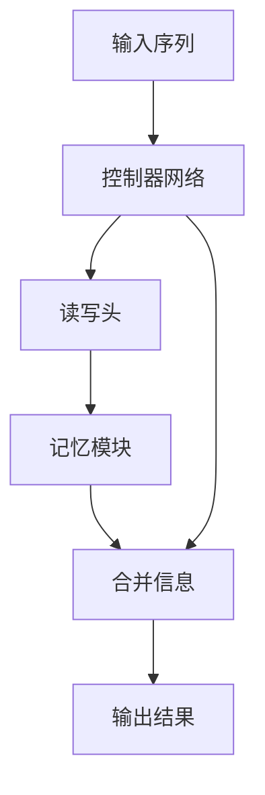

# 基于记忆增强网络的长期依赖推理优化

> 关键词：记忆增强网络、长期依赖推理、优化算法、深度学习、神经网络

> 摘要：本文围绕基于记忆增强网络的长期依赖推理优化展开深入探讨。首先介绍了研究的背景、目的和范围，明确预期读者和文档结构。接着阐述了记忆增强网络和长期依赖推理的核心概念及其联系，给出原理和架构的示意图与流程图。详细讲解了核心算法原理，并通过Python代码进行具体操作步骤的阐述。深入分析了相关数学模型和公式，结合实例进行说明。通过项目实战展示代码的实际应用，包括开发环境搭建、源代码实现与解读。探讨了该技术在多个实际场景中的应用，推荐了学习资源、开发工具框架以及相关论文著作。最后总结了未来发展趋势与挑战，并提供常见问题解答和扩展阅读参考资料，旨在为相关领域的研究和实践提供全面且深入的指导。

## 1. 背景介绍 
### 1.1 目的和范围
在深度学习领域，许多任务如自然语言处理、语音识别、时间序列预测等都面临着长期依赖推理的挑战。传统的神经网络在处理长序列信息时，往往难以有效地捕捉序列中远距离元素之间的依赖关系，导致推理性能下降。记忆增强网络（Memory Augmented Neural Networks，MANNs）作为一种新兴的技术，为解决长期依赖问题提供了新的思路。

本文的目的在于深入研究基于记忆增强网络的长期依赖推理优化方法，探讨如何通过合理设计记忆模块和网络结构，提高模型在处理长序列信息时的推理能力。具体范围包括记忆增强网络的核心概念、算法原理、数学模型，以及在实际项目中的应用和优化策略。

### 1.2 预期读者
本文预期读者包括深度学习领域的研究人员、工程师、学生，以及对人工智能技术感兴趣并希望深入了解长期依赖推理优化方法的技术爱好者。对于有一定机器学习和神经网络基础的读者，能够更好地理解文中的技术细节和原理。

### 1.3 文档结构概述
本文共分为十个部分。第一部分为背景介绍，阐述研究的目的、范围、预期读者和文档结构。第二部分介绍核心概念与联系，包括记忆增强网络和长期依赖推理的原理和架构。第三部分详细讲解核心算法原理，并给出Python代码实现具体操作步骤。第四部分分析相关数学模型和公式，并举例说明。第五部分通过项目实战展示代码的实际应用，包括开发环境搭建、源代码实现与解读。第六部分探讨实际应用场景。第七部分推荐学习资源、开发工具框架和相关论文著作。第八部分总结未来发展趋势与挑战。第九部分为附录，提供常见问题与解答。第十部分列出扩展阅读和参考资料。

### 1.4 术语表
#### 1.4.1 核心术语定义
- **记忆增强网络（Memory Augmented Neural Networks，MANNs）**：一种在传统神经网络基础上引入外部记忆模块的网络结构，通过记忆模块来存储和检索信息，以增强网络处理长序列信息的能力。
- **长期依赖推理**：指在处理序列数据时，需要捕捉序列中远距离元素之间的依赖关系，并根据这些关系进行推理和预测的过程。
- **注意力机制（Attention Mechanism）**：一种在神经网络中用于动态分配权重的机制，能够让网络自动关注序列中的重要部分，提高信息处理的效率。
- **记忆模块（Memory Module）**：记忆增强网络中的关键组件，用于存储和管理信息，通常具有读写操作接口。

#### 1.4.2 相关概念解释
- **传统神经网络**：如多层感知机（Multilayer Perceptron，MLP）、卷积神经网络（Convolutional Neural Network，CNN）等，在处理长序列信息时存在一定的局限性，难以有效捕捉长期依赖关系。
- **循环神经网络（Recurrent Neural Network，RNN）**：一种专门用于处理序列数据的神经网络，通过循环结构在时间步之间传递信息，但在处理长序列时容易出现梯度消失或梯度爆炸问题。
- **长短期记忆网络（Long Short-Term Memory，LSTM）和门控循环单元（Gated Recurrent Unit，GRU）**：是对RNN的改进，通过引入门控机制来解决梯度消失和梯度爆炸问题，在一定程度上提高了处理长期依赖的能力，但仍然存在局限性。

#### 1.4.3 缩略词列表
- **MANNs**：Memory Augmented Neural Networks
- **RNN**：Recurrent Neural Network
- **LSTM**：Long Short-Term Memory
- **GRU**：Gated Recurrent Unit
- **MLP**：Multilayer Perceptron
- **CNN**：Convolutional Neural Network

## 2. 核心概念与联系 

### 2.1 记忆增强网络原理
记忆增强网络的核心思想是在传统神经网络的基础上引入一个外部记忆模块，该模块可以存储和检索信息，从而帮助网络更好地处理长序列数据。记忆模块通常由一组记忆单元组成，每个记忆单元可以存储一个向量表示的信息。

记忆增强网络的工作流程主要包括读取和写入操作。在读取操作中，网络根据当前输入和内部状态从记忆模块中检索相关信息；在写入操作中，网络将新的信息写入记忆模块，更新记忆内容。通过不断地进行读写操作，记忆增强网络可以在处理长序列数据时积累和利用历史信息，从而更好地捕捉长期依赖关系。

### 2.2 长期依赖推理原理
长期依赖推理是指在处理序列数据时，需要考虑序列中远距离元素之间的依赖关系，并根据这些关系进行推理和预测的过程。例如，在自然语言处理中，一个句子的语义理解可能需要考虑句子开头的词汇对后面词汇的影响；在时间序列预测中，当前时刻的预测可能需要依赖于过去很长一段时间的历史数据。

传统的神经网络在处理长期依赖问题时存在困难，因为它们的信息传递机制有限，难以有效地捕捉远距离元素之间的依赖关系。而记忆增强网络通过引入记忆模块，可以存储和检索历史信息，从而在一定程度上解决了长期依赖问题。

### 2.3 核心概念架构的文本示意图
```plaintext
输入序列 --> 控制器网络 --> 读写头 --> 记忆模块
                     |             |
                     v             v
               输出结果 <-- 合并信息
```
- **输入序列**：待处理的序列数据，如自然语言文本、时间序列数据等。
- **控制器网络**：通常是一个神经网络，负责根据输入序列生成读写头的控制信号。
- **读写头**：根据控制器网络的输出，对记忆模块进行读写操作。
- **记忆模块**：存储和管理信息的组件，由多个记忆单元组成。
- **输出结果**：经过处理后得到的推理结果。

### 2.4 Mermaid流程图


## 3. 核心算法原理 & 具体操作步骤 

### 3.1 核心算法原理
记忆增强网络的核心算法主要包括读取操作和写入操作。下面分别介绍这两个操作的原理。

#### 3.1.1 读取操作
读取操作的目的是从记忆模块中检索与当前输入相关的信息。具体步骤如下：
1. 控制器网络根据当前输入和内部状态生成读取权重向量 $\mathbf{w}_r$，表示每个记忆单元在读取时的重要性。
2. 计算读取向量 $\mathbf{r}$，它是记忆模块中所有记忆单元的加权和，权重由读取权重向量 $\mathbf{w}_r$ 决定。
   - 设记忆模块有 $N$ 个记忆单元，每个记忆单元的向量表示为 $\mathbf{M}_i$，$i = 1, 2, \cdots, N$，则读取向量 $\mathbf{r}$ 的计算公式为：
     $$\mathbf{r} = \sum_{i = 1}^{N} w_{r,i} \mathbf{M}_i$$
   其中 $w_{r,i}$ 是读取权重向量 $\mathbf{w}_r$ 的第 $i$ 个元素。

#### 3.1.2 写入操作
写入操作的目的是将新的信息写入记忆模块，更新记忆内容。具体步骤如下：
1. 控制器网络根据当前输入和内部状态生成写入权重向量 $\mathbf{w}_w$，表示每个记忆单元在写入时的重要性。
2. 生成擦除向量 $\mathbf{e}$ 和添加向量 $\mathbf{a}$，分别用于擦除和添加记忆单元中的信息。
3. 更新记忆模块中的每个记忆单元 $\mathbf{M}_i$：
   - 首先，使用擦除向量 $\mathbf{e}$ 擦除记忆单元中的部分信息：
     $$\mathbf{M}_i' = \mathbf{M}_i \odot (1 - w_{w,i} \mathbf{e})$$
   其中 $\odot$ 表示逐元素相乘。
   - 然后，使用添加向量 $\mathbf{a}$ 添加新的信息：
     $$\mathbf{M}_i'' = \mathbf{M}_i' + w_{w,i} \mathbf{a}$$

### 3.2 具体操作步骤的Python代码实现
```python
import torch
import torch.nn as nn

class MemoryModule(nn.Module):
    def __init__(self, memory_size, memory_dim):
        super(MemoryModule, self).__init__()
        self.memory_size = memory_size
        self.memory_dim = memory_dim
        self.memory = nn.Parameter(torch.randn(memory_size, memory_dim))

    def read(self, read_weights):
        """
        读取操作
        :param read_weights: 读取权重向量，形状为 (batch_size, memory_size)
        :return: 读取向量，形状为 (batch_size, memory_dim)
        """
        read_vector = torch.matmul(read_weights, self.memory)
        return read_vector

    def write(self, write_weights, erase_vector, add_vector):
        """
        写入操作
        :param write_weights: 写入权重向量，形状为 (batch_size, memory_size)
        :param erase_vector: 擦除向量，形状为 (batch_size, memory_dim)
        :param add_vector: 添加向量，形状为 (batch_size, memory_dim)
        """
        # 擦除操作
        erase_term = write_weights.unsqueeze(-1) * erase_vector.unsqueeze(1)
        memory_erased = self.memory * (1 - erase_term)

        # 添加操作
        add_term = write_weights.unsqueeze(-1) * add_vector.unsqueeze(1)
        self.memory.data = memory_erased + add_term


class ControllerNetwork(nn.Module):
    def __init__(self, input_dim, hidden_dim, memory_size, memory_dim):
        super(ControllerNetwork, self).__init__()
        self.fc1 = nn.Linear(input_dim, hidden_dim)
        self.fc_read_weights = nn.Linear(hidden_dim, memory_size)
        self.fc_write_weights = nn.Linear(hidden_dim, memory_size)
        self.fc_erase_vector = nn.Linear(hidden_dim, memory_dim)
        self.fc_add_vector = nn.Linear(hidden_dim, memory_dim)
        self.softmax = nn.Softmax(dim=1)

    def forward(self, input):
        """
        前向传播
        :param input: 输入向量，形状为 (batch_size, input_dim)
        :return: 读取权重向量、写入权重向量、擦除向量、添加向量
        """
        hidden = torch.relu(self.fc1(input))
        read_weights = self.softmax(self.fc_read_weights(hidden))
        write_weights = self.softmax(self.fc_write_weights(hidden))
        erase_vector = torch.sigmoid(self.fc_erase_vector(hidden))
        add_vector = torch.tanh(self.fc_add_vector(hidden))
        return read_weights, write_weights, erase_vector, add_vector


class MemoryAugmentedNetwork(nn.Module):
    def __init__(self, input_dim, hidden_dim, memory_size, memory_dim):
        super(MemoryAugmentedNetwork, self).__init__()
        self.controller = ControllerNetwork(input_dim, hidden_dim, memory_size, memory_dim)
        self.memory_module = MemoryModule(memory_size, memory_dim)

    def forward(self, input):
        """
        前向传播
        :param input: 输入向量，形状为 (batch_size, input_dim)
        :return: 读取向量
        """
        read_weights, write_weights, erase_vector, add_vector = self.controller(input)
        self.memory_module.write(write_weights, erase_vector, add_vector)
        read_vector = self.memory_module.read(read_weights)
        return read_vector


# 示例使用
input_dim = 10
hidden_dim = 20
memory_size = 30
memory_dim = 15
batch_size = 5

model = MemoryAugmentedNetwork(input_dim, hidden_dim, memory_size, memory_dim)
input = torch.randn(batch_size, input_dim)
output = model(input)
print("Output shape:", output.shape)
```

### 3.3 代码解释
- **MemoryModule类**：实现了记忆模块的读写操作。`read` 方法根据读取权重向量从记忆模块中读取信息，`write` 方法根据写入权重向量、擦除向量和添加向量更新记忆模块的内容。
- **ControllerNetwork类**：作为控制器网络，根据输入生成读取权重向量、写入权重向量、擦除向量和添加向量。
- **MemoryAugmentedNetwork类**：将控制器网络和记忆模块组合在一起，实现了整个记忆增强网络的前向传播过程。

## 4. 数学模型和公式 & 详细讲解 & 举例说明 

### 4.1 读取操作数学模型
读取操作的数学模型可以表示为：
$$\mathbf{r} = \sum_{i = 1}^{N} w_{r,i} \mathbf{M}_i$$
其中 $\mathbf{r}$ 是读取向量，$w_{r,i}$ 是读取权重向量 $\mathbf{w}_r$ 的第 $i$ 个元素，$\mathbf{M}_i$ 是记忆模块中第 $i$ 个记忆单元的向量表示，$N$ 是记忆单元的数量。

这个公式的含义是，读取向量 $\mathbf{r}$ 是记忆模块中所有记忆单元的加权和，权重由读取权重向量 $\mathbf{w}_r$ 决定。读取权重向量 $\mathbf{w}_r$ 表示每个记忆单元在读取时的重要性，通过控制器网络根据当前输入和内部状态生成。

**举例说明**：假设记忆模块有 3 个记忆单元，每个记忆单元的向量表示分别为 $\mathbf{M}_1 = [1, 2, 3]^T$，$\mathbf{M}_2 = [4, 5, 6]^T$，$\mathbf{M}_3 = [7, 8, 9]^T$，读取权重向量为 $\mathbf{w}_r = [0.2, 0.3, 0.5]^T$。则读取向量 $\mathbf{r}$ 的计算过程如下：
$$
\begin{align*}
\mathbf{r} &= 0.2 \times [1, 2, 3]^T + 0.3 \times [4, 5, 6]^T + 0.5 \times [7, 8, 9]^T \\
&= [0.2, 0.4, 0.6]^T + [1.2, 1.5, 1.8]^T + [3.5, 4, 4.5]^T \\
&= [4.9, 5.9, 6.9]^T
\end{align*}
$$

### 4.2 写入操作数学模型
写入操作的数学模型主要包括擦除操作和添加操作。

#### 4.2.1 擦除操作
擦除操作的公式为：
$$\mathbf{M}_i' = \mathbf{M}_i \odot (1 - w_{w,i} \mathbf{e})$$
其中 $\mathbf{M}_i$ 是记忆模块中第 $i$ 个记忆单元的原始向量表示，$\mathbf{M}_i'$ 是擦除部分信息后的向量表示，$w_{w,i}$ 是写入权重向量 $\mathbf{w}_w$ 的第 $i$ 个元素，$\mathbf{e}$ 是擦除向量，$\odot$ 表示逐元素相乘。

这个公式的含义是，对于每个记忆单元 $\mathbf{M}_i$，根据写入权重向量 $\mathbf{w}_w$ 和擦除向量 $\mathbf{e}$ 擦除部分信息。写入权重向量 $\mathbf{w}_w$ 表示每个记忆单元在写入时的重要性，擦除向量 $\mathbf{e}$ 控制擦除的程度。

#### 4.2.2 添加操作
添加操作的公式为：
$$\mathbf{M}_i'' = \mathbf{M}_i' + w_{w,i} \mathbf{a}$$
其中 $\mathbf{M}_i'$ 是擦除部分信息后的向量表示，$\mathbf{M}_i''$ 是添加新信息后的向量表示，$w_{w,i}$ 是写入权重向量 $\mathbf{w}_w$ 的第 $i$ 个元素，$\mathbf{a}$ 是添加向量。

这个公式的含义是，对于每个记忆单元 $\mathbf{M}_i'$，根据写入权重向量 $\mathbf{w}_w$ 和添加向量 $\mathbf{a}$ 添加新的信息。

**举例说明**：假设记忆模块有 2 个记忆单元，$\mathbf{M}_1 = [1, 2]^T$，$\mathbf{M}_2 = [3, 4]^T$，写入权重向量为 $\mathbf{w}_w = [0.4, 0.6]^T$，擦除向量为 $\mathbf{e} = [0.5, 0.5]^T$，添加向量为 $\mathbf{a} = [2, 3]^T$。

首先进行擦除操作：
$$
\begin{align*}
\mathbf{M}_1' &= \mathbf{M}_1 \odot (1 - w_{w,1} \mathbf{e}) \\
&= [1, 2]^T \odot (1 - 0.4 \times [0.5, 0.5]^T) \\
&= [1, 2]^T \odot [0.8, 0.8]^T \\
&= [0.8, 1.6]^T
\end{align*}
$$
$$
\begin{align*}
\mathbf{M}_2' &= \mathbf{M}_2 \odot (1 - w_{w,2} \mathbf{e}) \\
&= [3, 4]^T \odot (1 - 0.6 \times [0.5, 0.5]^T) \\
&= [3, 4]^T \odot [0.7, 0.7]^T \\
&= [2.1, 2.8]^T
\end{align*}
$$

然后进行添加操作：
$$
\begin{align*}
\mathbf{M}_1'' &= \mathbf{M}_1' + w_{w,1} \mathbf{a} \\
&= [0.8, 1.6]^T + 0.4 \times [2, 3]^T \\
&= [0.8, 1.6]^T + [0.8, 1.2]^T \\
&= [1.6, 2.8]^T
\end{align*}
$$
$$
\begin{align*}
\mathbf{M}_2'' &= \mathbf{M}_2' + w_{w,2} \mathbf{a} \\
&= [2.1, 2.8]^T + 0.6 \times [2, 3]^T \\
&= [2.1, 2.8]^T + [1.2, 1.8]^T \\
&= [3.3, 4.6]^T
\end{align*}
$$

## 5. 项目实战：代码实际案例和详细解释说明 

### 5.1  开发环境搭建
#### 5.1.1 安装Python
首先，确保你已经安装了Python 3.x 版本。可以从Python官方网站（https://www.python.org/downloads/）下载并安装适合你操作系统的Python版本。

#### 5.1.2 安装深度学习框架
本文使用PyTorch作为深度学习框架，你可以根据自己的CUDA版本和操作系统，从PyTorch官方网站（https://pytorch.org/get-started/locally/）选择合适的安装命令进行安装。例如，如果你使用的是CPU版本的PyTorch，可以使用以下命令进行安装：
```sh
pip install torch torchvision
```

#### 5.1.3 安装其他依赖库
还需要安装一些其他的依赖库，如NumPy、Matplotlib等。可以使用以下命令进行安装：
```sh
pip install numpy matplotlib
```

### 5.2  源代码详细实现和代码解读
#### 5.2.1 数据准备
我们以一个简单的序列预测任务为例，生成一些模拟数据。以下是生成数据的代码：
```python
import numpy as np

def generate_data(seq_length, num_samples):
    """
    生成模拟序列数据
    :param seq_length: 序列长度
    :param num_samples: 样本数量
    :return: 输入序列和目标序列
    """
    inputs = np.random.randint(0, 10, size=(num_samples, seq_length))
    targets = np.sum(inputs, axis=1)
    return inputs, targets

seq_length = 10
num_samples = 1000
inputs, targets = generate_data(seq_length, num_samples)

# 转换为PyTorch张量
import torch
inputs = torch.tensor(inputs, dtype=torch.float32)
targets = torch.tensor(targets, dtype=torch.float32).unsqueeze(1)
```
这段代码生成了 `num_samples` 个长度为 `seq_length` 的随机整数序列作为输入，目标值为每个序列的元素之和。

#### 5.2.2 定义记忆增强网络模型
使用之前定义的 `MemoryAugmentedNetwork` 类作为模型：
```python
input_dim = seq_length
hidden_dim = 20
memory_size = 30
memory_dim = 15

model = MemoryAugmentedNetwork(input_dim, hidden_dim, memory_size, memory_dim)
```

#### 5.2.3 定义损失函数和优化器
使用均方误差损失函数（MSE Loss）和Adam优化器：
```python
import torch.optim as optim

criterion = torch.nn.MSELoss()
optimizer = optim.Adam(model.parameters(), lr=0.001)
```

#### 5.2.4 训练模型
```python
num_epochs = 100
for epoch in range(num_epochs):
    optimizer.zero_grad()
    outputs = model(inputs)
    loss = criterion(outputs, targets)
    loss.backward()
    optimizer.step()
    if (epoch + 1) % 10 == 0:
        print(f'Epoch [{epoch+1}/{num_epochs}], Loss: {loss.item():.4f}')
```
这段代码实现了模型的训练过程，每个epoch计算一次损失并进行反向传播更新模型参数。

### 5.3  代码解读与分析
#### 5.3.1 数据准备部分
`generate_data` 函数生成了模拟的序列数据，输入序列是随机整数序列，目标值是序列元素之和。将数据转换为PyTorch张量，方便后续的模型训练。

#### 5.3.2 模型定义部分
使用之前定义的 `MemoryAugmentedNetwork` 类定义了模型，设置了输入维度、隐藏维度、记忆单元数量和记忆单元维度。

#### 5.3.3 损失函数和优化器部分
选择均方误差损失函数（MSE Loss）来衡量模型预测值和目标值之间的误差，使用Adam优化器来更新模型参数。

#### 5.3.4 训练过程部分
在每个epoch中，首先将优化器的梯度清零，然后通过模型前向传播得到预测值，计算损失，进行反向传播更新模型参数。每10个epoch打印一次损失值，方便观察训练过程。

## 6. 实际应用场景 
### 6.1 自然语言处理
在自然语言处理中，许多任务如机器翻译、文本生成、问答系统等都需要处理长文本信息，面临着长期依赖推理的挑战。记忆增强网络可以通过记忆模块存储和检索历史信息，帮助模型更好地捕捉句子中远距离词汇之间的依赖关系，从而提高模型的性能。

例如，在机器翻译任务中，一个句子的翻译可能需要考虑句子开头的词汇对后面词汇的影响。记忆增强网络可以记住前面出现的词汇信息，在翻译后面的词汇时更好地理解上下文，提高翻译的准确性。

### 6.2 语音识别
语音识别任务需要处理连续的语音信号，语音信号中的语义信息可能分布在较长的时间序列中。记忆增强网络可以用于捕捉语音信号中远距离元素之间的依赖关系，提高语音识别的准确率。

例如，在识别一段较长的语音时，记忆增强网络可以通过记忆模块存储之前的语音特征信息，在处理后续语音时结合历史信息进行更准确的识别。

### 6.3 时间序列预测
时间序列预测任务如股票价格预测、天气预测等，需要根据历史数据预测未来的值。记忆增强网络可以利用记忆模块存储历史时间序列数据，帮助模型更好地捕捉时间序列中的长期依赖关系，提高预测的准确性。

例如，在股票价格预测中，记忆增强网络可以记住过去一段时间的股票价格信息，在预测未来价格时考虑这些历史信息，从而做出更准确的预测。

### 6.4 游戏AI
在游戏AI中，智能体需要根据历史游戏状态做出决策。记忆增强网络可以用于存储和管理历史游戏状态信息，帮助智能体更好地理解游戏的长期发展趋势，从而做出更明智的决策。

例如，在策略游戏中，智能体可以使用记忆增强网络记住过去的游戏行动和结果，在当前决策时结合这些历史信息，制定更优的策略。

## 7. 工具和资源推荐
### 7.1 学习资源推荐
#### 7.1.1 书籍推荐
- 《深度学习》（Deep Learning）：由Ian Goodfellow、Yoshua Bengio和Aaron Courville撰写，是深度学习领域的经典教材，涵盖了深度学习的基本概念、算法和应用。
- 《Python深度学习》（Deep Learning with Python）：由Francois Chollet撰写，介绍了如何使用Python和Keras进行深度学习开发，适合初学者入门。
- 《动手学深度学习》（Dive into Deep Learning）：由 Aston Zhang、Zachary C. Lipton、Mu Li和Alexander J. Smola撰写，提供了丰富的代码示例和实践项目，帮助读者深入理解深度学习。

#### 7.1.2 在线课程
- Coursera上的“深度学习专项课程”（Deep Learning Specialization）：由Andrew Ng教授授课，包括五门课程，全面介绍了深度学习的各个方面。
- edX上的“使用PyTorch进行深度学习”（Deep Learning with PyTorch）：详细介绍了如何使用PyTorch进行深度学习开发，适合有一定Python基础的学习者。
- 哔哩哔哩（Bilibili）上有许多深度学习相关的视频教程，如李沐老师的“动手学深度学习”系列课程，讲解生动易懂，适合初学者。

#### 7.1.3 技术博客和网站
- Medium：有许多深度学习领域的专业人士在Medium上分享他们的研究成果和实践经验，如Towards Data Science板块。
- arXiv：是一个预印本数据库，包含了许多最新的深度学习研究论文，可以及时了解领域内的最新进展。
- TensorFlow官方博客和PyTorch官方博客：提供了深度学习框架的最新动态、技术文章和案例分享。

### 7.2 开发工具框架推荐
#### 7.2.1 IDE和编辑器
- PyCharm：是一款专业的Python集成开发环境，提供了丰富的代码编辑、调试和项目管理功能，适合深度学习项目的开发。
- Jupyter Notebook：是一个交互式的开发环境，支持Python代码的实时运行和可视化展示，非常适合进行深度学习模型的实验和调试。
- Visual Studio Code：是一款轻量级的代码编辑器，支持多种编程语言和插件扩展，安装Python相关插件后可以方便地进行深度学习开发。

#### 7.2.2 调试和性能分析工具
- PyTorch Profiler：是PyTorch官方提供的性能分析工具，可以帮助开发者分析模型的运行时间、内存使用等情况，优化模型性能。
- TensorBoard：是TensorFlow官方提供的可视化工具，也可以与PyTorch结合使用，用于可视化模型的训练过程、损失曲线、参数分布等信息。
- NVIDIA Nsight Systems：是一款用于GPU性能分析的工具，可以帮助开发者分析GPU的使用情况，优化模型的GPU加速性能。

#### 7.2.3 相关框架和库
- PyTorch：是一个开源的深度学习框架，提供了丰富的神经网络层和优化算法，支持动态图和静态图两种编程方式，易于使用和扩展。
- TensorFlow：是另一个广泛使用的深度学习框架，具有强大的分布式训练和部署能力，适合大规模深度学习项目的开发。
- NumPy：是Python中用于科学计算的基础库，提供了高效的多维数组对象和数学函数，在深度学习中常用于数据处理和数值计算。
- Pandas：是Python中用于数据处理和分析的库，提供了丰富的数据结构和数据操作方法，在深度学习中常用于数据清洗和预处理。

### 7.3 相关论文著作推荐
#### 7.3.1 经典论文
- "Neural Turing Machines"：介绍了神经图灵机（Neural Turing Machine，NTM），是记忆增强网络的经典论文，提出了使用外部记忆模块来增强神经网络处理长序列信息的能力。
- "Memory Networks"：提出了记忆网络（Memory Networks）的概念，通过引入记忆模块和注意力机制来解决长期依赖问题。
- "Show, Attend and Tell: Neural Image Caption Generation with Visual Attention"：将注意力机制应用于图像描述生成任务，展示了注意力机制在处理序列数据中的有效性。

#### 7.3.2 最新研究成果
- 可以通过arXiv等预印本数据库搜索最新的记忆增强网络相关研究论文，了解领域内的最新进展和技术创新。
- 关注顶级学术会议如NeurIPS、ICML、CVPR等的论文，这些会议收录了许多深度学习领域的最新研究成果。

#### 7.3.3 应用案例分析
- 许多公司和研究机构会在其官方博客或技术报告中分享记忆增强网络在实际项目中的应用案例，如谷歌、微软、Facebook等公司的技术博客。
- 可以通过搜索相关的学术论文和技术报告，了解记忆增强网络在不同领域的具体应用和效果评估。

## 8. 总结：未来发展趋势与挑战
### 8.1 未来发展趋势
#### 8.1.1 模型结构创新
未来，研究人员可能会继续探索记忆增强网络的模型结构创新，设计出更加高效和强大的记忆模块和控制器网络。例如，引入更复杂的注意力机制、强化学习算法等，进一步提高模型处理长期依赖问题的能力。

#### 8.1.2 跨领域应用拓展
记忆增强网络在自然语言处理、语音识别、时间序列预测等领域已经取得了一定的应用成果，未来有望在更多领域得到拓展，如医疗保健、金融、交通等。例如，在医疗保健领域，记忆增强网络可以用于分析患者的历史病历数据，辅助医生进行疾病诊断和治疗方案制定。

#### 8.1.3 与其他技术融合
记忆增强网络可能会与其他人工智能技术如知识图谱、强化学习、生成对抗网络等进行融合，发挥各自的优势，解决更复杂的问题。例如，将记忆增强网络与知识图谱结合，可以利用知识图谱中的先验知识来增强模型的推理能力。

### 8.2 挑战
#### 8.2.1 计算资源需求
记忆增强网络通常需要较大的计算资源来训练和运行，尤其是在处理大规模数据集时。如何优化模型结构和算法，降低计算资源需求，是一个亟待解决的问题。

#### 8.2.2 可解释性问题
深度学习模型的可解释性一直是一个挑战，记忆增强网络也不例外。由于记忆模块和控制器网络的复杂性，模型的决策过程往往难以理解。如何提高记忆增强网络的可解释性，让人们更好地理解模型的行为和决策依据，是未来研究的重要方向。

#### 8.2.3 数据质量和数量
记忆增强网络的性能很大程度上依赖于数据的质量和数量。在实际应用中，获取高质量、大规模的标注数据往往比较困难。如何利用少量数据进行有效的模型训练，以及如何处理数据中的噪声和缺失值，是需要解决的问题。

## 9. 附录：常见问题与解答
### 9.1 记忆增强网络和传统神经网络有什么区别？
传统神经网络在处理长序列信息时存在一定的局限性，难以有效捕捉长期依赖关系。而记忆增强网络通过引入外部记忆模块，可以存储和检索历史信息，从而在一定程度上解决了长期依赖问题。记忆增强网络可以根据当前输入和内部状态从记忆模块中读取相关信息，并将新的信息写入记忆模块，更新记忆内容。

### 9.2 记忆增强网络的训练过程和传统神经网络有什么不同？
记忆增强网络的训练过程和传统神经网络类似，都需要定义损失函数和优化器，通过反向传播算法更新模型参数。但由于记忆增强网络引入了记忆模块，训练过程中需要考虑记忆模块的读写操作对模型性能的影响。例如，在训练过程中需要调整读取权重向量和写入权重向量的生成方式，以提高模型的性能。

### 9.3 如何选择记忆模块的大小和维度？
记忆模块的大小和维度的选择需要根据具体的任务和数据集来确定。一般来说，记忆模块的大小越大，可以存储的信息越多，但计算复杂度也会相应增加；记忆模块的维度越高，可以表示的信息越丰富，但也会增加模型的参数数量和训练难度。可以通过实验的方法，尝试不同的记忆模块大小和维度，选择性能最优的组合。

### 9.4 记忆增强网络在实际应用中可能会遇到哪些问题？
记忆增强网络在实际应用中可能会遇到以下问题：
- 计算资源需求大：记忆增强网络通常需要较大的计算资源来训练和运行，尤其是在处理大规模数据集时。
- 可解释性问题：由于记忆模块和控制器网络的复杂性，模型的决策过程往往难以理解。
- 数据质量和数量：记忆增强网络的性能很大程度上依赖于数据的质量和数量，获取高质量、大规模的标注数据往往比较困难。

## 10. 扩展阅读 & 参考资料
### 10.1 扩展阅读
- 《深度学习进阶：自然语言处理》：进一步深入介绍了深度学习在自然语言处理领域的应用，包括记忆增强网络在自然语言处理中的具体实现和优化方法。
- 《强化学习：原理与Python实现》：介绍了强化学习的基本原理和算法，以及如何将强化学习与记忆增强网络结合，解决更复杂的问题。

### 10.2 参考资料
- Graves, A., Wayne, G., & Danihelka, I. (2014). Neural Turing Machines. arXiv preprint arXiv:1410.5401.
- Weston, J., Chopra, S., & Bordes, A. (2014). Memory Networks. arXiv preprint arXiv:1410.3916.
- Xu, K., Ba, J., Kiros, R., Cho, K., Courville, A., Salakhutdinov, R.,... & Bengio, Y. (2015). Show, Attend and Tell: Neural Image Caption Generation with Visual Attention. arXiv preprint arXiv:1502.03044.

作者：AI天才研究院/AI Genius Institute & 禅与计算机程序设计艺术 /Zen And The Art of Computer Programming