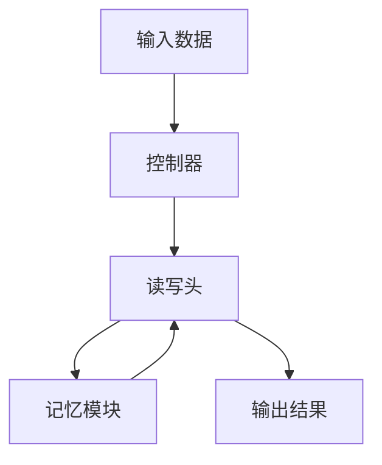

# 基于记忆增强网络的长期依赖推理性能优化

> 关键词：记忆增强网络、长期依赖、推理性能优化、深度学习、循环神经网络

> 摘要：本文聚焦于基于记忆增强网络的长期依赖推理性能优化问题。首先介绍了研究背景，包括目的、范围、预期读者等内容。详细阐述了记忆增强网络等核心概念及其联系，给出了原理和架构的文本示意图与 Mermaid 流程图。深入讲解了核心算法原理，并用 Python 源代码进行详细阐述。探讨了相关数学模型和公式，并举例说明。通过项目实战给出代码实际案例及详细解释。分析了实际应用场景，推荐了相关工具和资源。最后总结了未来发展趋势与挑战，还包含常见问题解答及扩展阅读参考资料，旨在为相关领域的研究者和开发者提供全面且深入的技术参考，以提升基于记忆增强网络处理长期依赖的推理性能。

## 1. 背景介绍 
### 1.1 目的和范围
在深度学习领域，处理序列数据中的长期依赖关系一直是一个具有挑战性的问题。传统的神经网络，如前馈神经网络，难以捕捉序列中相隔较远的元素之间的依赖关系。循环神经网络（RNN）虽然在一定程度上能够处理序列数据，但由于梯度消失或梯度爆炸等问题，在处理长序列时表现不佳。记忆增强网络（Memory Augmented Neural Networks，MANNs）作为一种新兴的神经网络架构，旨在通过引入外部记忆模块来增强网络对长期依赖关系的处理能力。

本研究的目的在于深入探讨基于记忆增强网络的长期依赖推理性能优化方法。具体范围包括对记忆增强网络的核心概念和原理的研究，分析影响长期依赖推理性能的因素，提出相应的优化算法和策略，并通过实验验证优化方法的有效性。

### 1.2 预期读者
本文预期读者包括深度学习领域的研究者、人工智能工程师、对神经网络技术感兴趣的学生以及相关领域的技术爱好者。对于希望深入了解记忆增强网络和长期依赖处理技术的读者，本文将提供系统的知识和实用的技术指导。

### 1.3 文档结构概述
本文的文档结构如下：首先介绍背景信息，包括研究目的、范围、预期读者和术语表。接着详细阐述记忆增强网络的核心概念及其联系，给出原理和架构的文本示意图与 Mermaid 流程图。然后讲解核心算法原理，并使用 Python 源代码进行详细说明。随后探讨相关数学模型和公式，并举例说明。通过项目实战展示代码实际案例及详细解释。分析记忆增强网络在不同场景下的实际应用。推荐相关的学习资源、开发工具框架和论文著作。最后总结未来发展趋势与挑战，提供常见问题解答和扩展阅读参考资料。

### 1.4 术语表
#### 1.4.1 核心术语定义
- **记忆增强网络（Memory Augmented Neural Networks，MANNs）**：一种神经网络架构，通过引入外部记忆模块来增强网络的记忆和处理能力，能够更好地处理序列数据中的长期依赖关系。
- **长期依赖（Long-Term Dependencies）**：在序列数据中，相隔较远的元素之间存在的依赖关系。例如，在自然语言处理中，一个句子开头的某个词汇可能会影响到句子末尾的词汇选择。
- **推理性能（Inference Performance）**：指神经网络在进行推理任务时的表现，包括推理速度、准确性等指标。
- **循环神经网络（Recurrent Neural Networks，RNN）**：一种能够处理序列数据的神经网络，通过在网络中引入循环结构来捕捉序列中的时间信息。
- **梯度消失（Vanishing Gradient）**：在神经网络训练过程中，梯度随着反向传播的层数增加而逐渐变小，导致网络难以学习到长期依赖关系的现象。

#### 1.4.2 相关概念解释
- **外部记忆模块**：记忆增强网络中的一个重要组成部分，用于存储和检索信息。它可以看作是网络的“外部存储器”，网络可以根据需要从记忆模块中读取和写入信息。
- **注意力机制（Attention Mechanism）**：一种在神经网络中广泛应用的机制，用于自动地关注序列中的重要部分。在记忆增强网络中，注意力机制可以帮助网络更好地选择和利用记忆模块中的信息。

#### 1.4.3 缩略词列表
- MANNs：Memory Augmented Neural Networks（记忆增强网络）
- RNN：Recurrent Neural Networks（循环神经网络）
- LSTM：Long Short-Term Memory（长短期记忆网络）
- GRU：Gated Recurrent Unit（门控循环单元）

## 2. 核心概念与联系 
### 记忆增强网络的原理
记忆增强网络的核心思想是引入外部记忆模块来扩展神经网络的记忆能力。传统的神经网络，如 RNN，其内部状态的存储容量有限，难以处理长序列中的长期依赖关系。而记忆增强网络通过将信息存储在外部记忆模块中，并通过读写操作来访问这些信息，从而能够更好地捕捉序列中的长期依赖关系。

记忆增强网络通常由三个主要部分组成：控制器（Controller）、记忆模块（Memory）和读写头（Read/Write Heads）。控制器是一个神经网络，负责处理输入数据并生成读写头的控制信号。记忆模块是一个二维矩阵，用于存储信息。读写头则根据控制器的控制信号对记忆模块进行读写操作。

### 记忆增强网络的架构文本示意图
```plaintext
+-------------------+
|    输入数据       |
+-------------------+
        |
        v
+-------------------+
|    控制器         |
+-------------------+
        |
        | 控制信号
        v
+-------------------+
|    读写头         |
+-------------------+
        |
        | 读写操作
        v
+-------------------+
|    记忆模块       |
+-------------------+
        |
        | 读取信息
        v
+-------------------+
|    输出结果       |
+-------------------+
```

### Mermaid 流程图


### 与长期依赖处理的联系
记忆增强网络通过其外部记忆模块和读写操作，能够有效地处理长期依赖关系。当网络处理序列数据时，控制器可以根据当前输入生成控制信号，指示读写头将重要信息写入记忆模块中。在后续的处理过程中，控制器可以根据需要从记忆模块中读取相关信息，从而利用之前存储的信息来处理当前的输入。这种方式使得网络能够跨越较长的时间步长，捕捉到序列中相隔较远的元素之间的依赖关系，从而提高了长期依赖处理的能力。

### 与其他神经网络架构的联系
记忆增强网络与传统的循环神经网络（RNN）、长短期记忆网络（LSTM）和门控循环单元（GRU）等架构有一定的联系和区别。RNN 是一种基本的序列处理网络，但由于梯度消失问题，难以处理长期依赖关系。LSTM 和 GRU 通过引入门控机制，在一定程度上缓解了梯度消失问题，但它们的记忆能力仍然有限。而记忆增强网络通过引入外部记忆模块，进一步扩展了网络的记忆能力，能够更好地处理长期依赖关系。

## 3. 核心算法原理 & 具体操作步骤 
### 核心算法原理
记忆增强网络的核心算法主要包括控制器的前向传播、读写头的操作和记忆模块的更新。下面分别对这些步骤进行详细说明。

#### 控制器的前向传播
控制器通常是一个神经网络，如多层感知机（MLP）或循环神经网络（RNN）。它的输入是当前的输入数据 $x_t$ 和上一时刻的隐藏状态 $h_{t - 1}$，输出是读写头的控制信号 $c_t$。控制器的前向传播过程可以表示为：
```python
import torch
import torch.nn as nn

class Controller(nn.Module):
    def __init__(self, input_size, hidden_size, output_size):
        super(Controller, self).__init__()
        self.rnn = nn.RNN(input_size, hidden_size, batch_first=True)
        self.fc = nn.Linear(hidden_size, output_size)

    def forward(self, x, h_prev):
        output, h_next = self.rnn(x, h_prev)
        control_signal = self.fc(output)
        return control_signal, h_next
```

#### 读写头的操作
读写头根据控制器生成的控制信号对记忆模块进行读写操作。读头从记忆模块中读取信息，写头将信息写入记忆模块。读头的操作可以表示为：
```python
class ReadHead(nn.Module):
    def __init__(self, memory_size, key_size):
        super(ReadHead, self).__init__()
        self.key_size = key_size
        self.memory_size = memory_size
        self.fc_key = nn.Linear(key_size, memory_size)

    def forward(self, control_signal, memory):
        key = self.fc_key(control_signal)
        similarity = torch.matmul(key, memory.t())
        weights = torch.softmax(similarity, dim=1)
        read_vector = torch.matmul(weights, memory)
        return read_vector
```

写头的操作可以表示为：
```python
class WriteHead(nn.Module):
    def __init__(self, memory_size, key_size):
        super(WriteHead, self).__init__()
        self.key_size = key_size
        self.memory_size = memory_size
        self.fc_key = nn.Linear(key_size, memory_size)
        self.fc_add = nn.Linear(key_size, memory_size)
        self.fc_erase = nn.Linear(key_size, memory_size)

    def forward(self, control_signal, memory):
        key = self.fc_key(control_signal)
        add_vector = torch.sigmoid(self.fc_add(control_signal))
        erase_vector = torch.sigmoid(self.fc_erase(control_signal))
        similarity = torch.matmul(key, memory.t())
        weights = torch.softmax(similarity, dim=1)
        erase = torch.matmul(weights.unsqueeze(-1), erase_vector.unsqueeze(1))
        add = torch.matmul(weights.unsqueeze(-1), add_vector.unsqueeze(1))
        new_memory = memory * (1 - erase) + add
        return new_memory
```

#### 记忆模块的更新
记忆模块的更新是通过写头的操作实现的。在每个时间步，写头根据控制信号对记忆模块进行擦除和写入操作，从而更新记忆模块的内容。

### 具体操作步骤
1. **初始化**：初始化控制器的参数、记忆模块的内容和读写头的参数。
2. **输入数据**：将当前的输入数据 $x_t$ 输入到控制器中。
3. **控制器前向传播**：控制器根据输入数据 $x_t$ 和上一时刻的隐藏状态 $h_{t - 1}$ 生成读写头的控制信号 $c_t$。
4. **读写头操作**：读头根据控制信号从记忆模块中读取信息，写头根据控制信号对记忆模块进行更新。
5. **输出结果**：将读头读取的信息和控制器的输出进行组合，得到最终的输出结果。
6. **更新隐藏状态**：更新控制器的隐藏状态 $h_t$，准备处理下一个时间步的输入数据。

## 4. 数学模型和公式 & 详细讲解 & 举例说明 
### 数学模型和公式
#### 控制器的输出
控制器的输出 $c_t$ 可以表示为：
$$c_t = f(x_t, h_{t - 1})$$
其中 $f$ 是控制器的前向传播函数，$x_t$ 是当前的输入数据，$h_{t - 1}$ 是上一时刻的隐藏状态。

#### 读头的操作
读头的操作可以用以下公式表示：
$$w_t^r = \text{softmax}(K^r(c_t)M_t^T)$$
$$r_t = w_t^rM_t$$
其中 $K^r(c_t)$ 是读头根据控制信号 $c_t$ 生成的查询键，$M_t$ 是当前时刻的记忆模块，$w_t^r$ 是读头的注意力权重，$r_t$ 是读头读取的信息。

#### 写头的操作
写头的操作可以用以下公式表示：
$$w_t^w = \text{softmax}(K^w(c_t)M_t^T)$$
$$e_t = \sigma(E(c_t))$$
$$a_t = \sigma(A(c_t))$$
$$M_{t + 1} = M_t(1 - w_t^w \otimes e_t) + w_t^w \otimes a_t$$
其中 $K^w(c_t)$ 是写头根据控制信号 $c_t$ 生成的查询键，$e_t$ 是擦除向量，$a_t$ 是添加向量，$\sigma$ 是 sigmoid 函数，$\otimes$ 是逐元素相乘。

### 详细讲解
#### 控制器的输出
控制器的输出 $c_t$ 包含了读写头的控制信号，用于指导读写头对记忆模块进行读写操作。控制器可以是一个简单的多层感知机或循环神经网络，根据输入数据和上一时刻的隐藏状态生成控制信号。

#### 读头的操作
读头通过计算查询键 $K^r(c_t)$ 与记忆模块 $M_t$ 的相似度，得到注意力权重 $w_t^r$。然后根据注意力权重从记忆模块中读取信息 $r_t$。注意力权重 $w_t^r$ 表示了读头对记忆模块中每个位置的关注程度。

#### 写头的操作
写头首先计算查询键 $K^w(c_t)$ 与记忆模块 $M_t$ 的相似度，得到注意力权重 $w_t^w$。然后根据控制信号生成擦除向量 $e_t$ 和添加向量 $a_t$。擦除向量 $e_t$ 用于擦除记忆模块中相应位置的信息，添加向量 $a_t$ 用于在相应位置添加新的信息。通过这种方式，写头可以更新记忆模块的内容。

### 举例说明
假设记忆模块 $M_t$ 是一个 $3 \times 4$ 的矩阵：
$$M_t = \begin{bmatrix}
1 & 2 & 3 & 4 \\
5 & 6 & 7 & 8 \\
9 & 10 & 11 & 12
\end{bmatrix}$$
读头的查询键 $K^r(c_t)$ 是一个 $1 \times 4$ 的向量：
$$K^r(c_t) = \begin{bmatrix}
1 & 1 & 1 & 1
\end{bmatrix}$$
计算相似度：
$$\text{similarity} = K^r(c_t)M_t^T = \begin{bmatrix}
1 & 1 & 1 & 1
\end{bmatrix} \begin{bmatrix}
1 & 5 & 9 \\
2 & 6 & 10 \\
3 & 7 & 11 \\
4 & 8 & 12
\end{bmatrix} = \begin{bmatrix}
10 & 26 & 42
\end{bmatrix}$$
计算注意力权重：
$$w_t^r = \text{softmax}(\text{similarity}) = \begin{bmatrix}
0.017 & 0.117 & 0.866
\end{bmatrix}$$
读取信息：
$$r_t = w_t^rM_t = \begin{bmatrix}
0.017 & 0.117 & 0.866
\end{bmatrix} \begin{bmatrix}
1 & 2 & 3 & 4 \\
5 & 6 & 7 & 8 \\
9 & 10 & 11 & 12
\end{bmatrix} = \begin{bmatrix}
8.27 & 9.27 & 10.27 & 11.27
\end{bmatrix}$$

## 5. 项目实战：代码实际案例和详细解释说明 
### 5.1  开发环境搭建
#### 安装 Python
首先需要安装 Python 环境，建议使用 Python 3.7 及以上版本。可以从 Python 官方网站（https://www.python.org/downloads/） 下载并安装。

#### 安装 PyTorch
PyTorch 是一个常用的深度学习框架，用于实现记忆增强网络。可以使用以下命令安装 PyTorch：
```sh
pip install torch torchvision
```

#### 安装其他依赖库
还需要安装一些其他的依赖库，如 numpy、matplotlib 等。可以使用以下命令安装：
```sh
pip install numpy matplotlib
```

### 5.2  源代码详细实现和代码解读
```python
import torch
import torch.nn as nn
import numpy as np

# 定义控制器
class Controller(nn.Module):
    def __init__(self, input_size, hidden_size, output_size):
        super(Controller, self).__init__()
        self.rnn = nn.RNN(input_size, hidden_size, batch_first=True)
        self.fc = nn.Linear(hidden_size, output_size)

    def forward(self, x, h_prev):
        output, h_next = self.rnn(x, h_prev)
        control_signal = self.fc(output)
        return control_signal, h_next

# 定义读头
class ReadHead(nn.Module):
    def __init__(self, memory_size, key_size):
        super(ReadHead, self).__init__()
        self.key_size = key_size
        self.memory_size = memory_size
        self.fc_key = nn.Linear(key_size, memory_size)

    def forward(self, control_signal, memory):
        key = self.fc_key(control_signal)
        similarity = torch.matmul(key, memory.t())
        weights = torch.softmax(similarity, dim=1)
        read_vector = torch.matmul(weights, memory)
        return read_vector

# 定义写头
class WriteHead(nn.Module):
    def __init__(self, memory_size, key_size):
        super(WriteHead, self).__init__()
        self.key_size = key_size
        self.memory_size = memory_size
        self.fc_key = nn.Linear(key_size, memory_size)
        self.fc_add = nn.Linear(key_size, memory_size)
        self.fc_erase = nn.Linear(key_size, memory_size)

    def forward(self, control_signal, memory):
        key = self.fc_key(control_signal)
        add_vector = torch.sigmoid(self.fc_add(control_signal))
        erase_vector = torch.sigmoid(self.fc_erase(control_signal))
        similarity = torch.matmul(key, memory.t())
        weights = torch.softmax(similarity, dim=1)
        erase = torch.matmul(weights.unsqueeze(-1), erase_vector.unsqueeze(1))
        add = torch.matmul(weights.unsqueeze(-1), add_vector.unsqueeze(1))
        new_memory = memory * (1 - erase) + add
        return new_memory

# 定义记忆增强网络
class MemoryAugmentedNeuralNetwork(nn.Module):
    def __init__(self, input_size, hidden_size, output_size, memory_size, key_size):
        super(MemoryAugmentedNeuralNetwork, self).__init__()
        self.controller = Controller(input_size, hidden_size, key_size)
        self.read_head = ReadHead(memory_size, key_size)
        self.write_head = WriteHead(memory_size, key_size)
        self.fc_output = nn.Linear(memory_size + input_size, output_size)

    def forward(self, x):
        batch_size, seq_len, input_size = x.size()
        h_prev = torch.zeros(1, batch_size, self.controller.rnn.hidden_size)
        memory = torch.randn(batch_size, self.read_head.memory_size)
        outputs = []

        for t in range(seq_len):
            x_t = x[:, t, :].unsqueeze(1)
            control_signal, h_prev = self.controller(x_t, h_prev)
            read_vector = self.read_head(control_signal, memory)
            memory = self.write_head(control_signal, memory)
            output = self.fc_output(torch.cat((x_t.squeeze(1), read_vector), dim=1))
            outputs.append(output)

        outputs = torch.stack(outputs, dim=1)
        return outputs

# 测试代码
input_size = 10
hidden_size = 20
output_size = 5
memory_size = 15
key_size = 12
batch_size = 32
seq_len = 20

model = MemoryAugmentedNeuralNetwork(input_size, hidden_size, output_size, memory_size, key_size)
x = torch.randn(batch_size, seq_len, input_size)
output = model(x)
print(output.shape)
```

### 5.3  代码解读与分析
#### 控制器
`Controller` 类实现了控制器的功能。它包含一个 RNN 层和一个全连接层，用于生成读写头的控制信号。

#### 读头
`ReadHead` 类实现了读头的功能。它根据控制信号生成查询键，计算查询键与记忆模块的相似度，得到注意力权重，然后根据注意力权重从记忆模块中读取信息。

#### 写头
`WriteHead` 类实现了写头的功能。它根据控制信号生成查询键、擦除向量和添加向量，计算查询键与记忆模块的相似度，得到注意力权重，然后根据注意力权重对记忆模块进行擦除和写入操作。

#### 记忆增强网络
`MemoryAugmentedNeuralNetwork` 类实现了整个记忆增强网络的功能。它包含控制器、读头和写头，通过循环处理输入序列，在每个时间步进行读写操作，并生成最终的输出结果。

#### 测试代码
测试代码生成了一个随机输入序列，将其输入到记忆增强网络中，并打印输出结果的形状。

## 6. 实际应用场景 
### 自然语言处理
在自然语言处理中，记忆增强网络可以用于处理长文本的理解和生成任务。例如，在机器翻译中，输入的源语言句子可能很长，其中包含多个长期依赖关系。记忆增强网络可以通过其外部记忆模块存储和检索相关信息，从而更好地捕捉这些长期依赖关系，提高翻译的准确性。

在文本生成任务中，如故事生成、诗歌创作等，记忆增强网络可以利用之前生成的文本信息，生成更加连贯和有逻辑的文本内容。

### 语音识别
在语音识别中，语音信号通常是一个长序列，其中包含多个发音单元之间的长期依赖关系。记忆增强网络可以通过其外部记忆模块存储和检索语音特征信息，从而更好地处理这些长期依赖关系，提高语音识别的准确率。

### 时间序列预测
在时间序列预测任务中，如股票价格预测、天气预测等，输入的时间序列数据可能包含多个时间步之间的长期依赖关系。记忆增强网络可以通过其外部记忆模块存储和检索历史数据信息，从而更好地捕捉这些长期依赖关系，提高预测的准确性。

### 机器人控制
在机器人控制中，机器人需要根据当前的环境信息和历史经验来做出决策。记忆增强网络可以通过其外部记忆模块存储和检索机器人的历史经验和环境信息，从而更好地处理长期依赖关系，提高机器人的决策能力和适应性。

## 7. 工具和资源推荐
### 7.1 学习资源推荐
#### 7.1.1 书籍推荐
- 《深度学习》（Deep Learning）：由 Ian Goodfellow、Yoshua Bengio 和 Aaron Courville 编写，是深度学习领域的经典教材，涵盖了神经网络、深度学习算法、优化方法等方面的内容。
- 《Python 深度学习》（Deep Learning with Python）：由 Francois Chollet 编写，介绍了如何使用 Python 和 Keras 进行深度学习开发，包括神经网络的构建、训练和调优。
- 《动手学深度学习》（Dive into Deep Learning）：由 Aston Zhang、Zack C. Lipton、Mu Li 和 Alexander J. Smola 编写，提供了丰富的深度学习代码示例和实践项目，帮助读者快速上手深度学习。

#### 7.1.2 在线课程
- Coursera 上的“深度学习专项课程”（Deep Learning Specialization）：由 Andrew Ng 教授授课，包括神经网络和深度学习、改善深层神经网络、结构化机器学习项目、卷积神经网络、序列模型等五个课程，全面介绍了深度学习的理论和实践。
- edX 上的“使用 PyTorch 进行深度学习”（Introduction to Deep Learning with PyTorch）：介绍了如何使用 PyTorch 进行深度学习开发，包括张量操作、自动求导、神经网络构建等内容。
- 哔哩哔哩上的“李宏毅机器学习课程”：由李宏毅教授授课，课程内容生动有趣，涵盖了机器学习和深度学习的基础知识和应用。

#### 7.1.3 技术博客和网站
- Medium 上的 Towards Data Science：是一个专注于数据科学和机器学习的技术博客平台，提供了大量的深度学习技术文章和案例分析。
- 机器之心：是一个专注于人工智能领域的科技媒体，提供了最新的人工智能技术资讯、研究成果和应用案例。
- 深度学习前沿：是一个专注于深度学习领域的技术博客，提供了深度学习的最新研究进展和技术分享。

### 7.2 开发工具框架推荐
#### 7.2.1 IDE和编辑器
- PyCharm：是一个专业的 Python 集成开发环境，提供了代码编辑、调试、版本控制等功能，支持 PyTorch 等深度学习框架。
- Jupyter Notebook：是一个交互式的开发环境，支持 Python 代码的编写、运行和可视化，非常适合深度学习的实验和演示。
- Visual Studio Code：是一个轻量级的代码编辑器，支持多种编程语言和插件，通过安装相应的插件可以方便地进行深度学习开发。

#### 7.2.2 调试和性能分析工具
- PyTorch Profiler：是 PyTorch 提供的性能分析工具，可以帮助开发者分析模型的性能瓶颈，优化模型的运行效率。
- TensorBoard：是 TensorFlow 提供的可视化工具，也可以与 PyTorch 结合使用，用于可视化模型的训练过程、损失曲线、参数分布等信息。
- NVIDIA Nsight Systems：是 NVIDIA 提供的性能分析工具，可以帮助开发者分析 GPU 上的程序性能，优化 GPU 计算效率。

#### 7.2.3 相关框架和库
- PyTorch：是一个开源的深度学习框架，提供了丰富的神经网络层、优化算法和工具函数，支持 GPU 加速计算。
- TensorFlow：是一个广泛使用的深度学习框架，提供了高级的神经网络构建接口和分布式训练支持。
- NumPy：是一个用于科学计算的 Python 库，提供了高效的多维数组操作和数学函数，是深度学习开发的基础库之一。
- Matplotlib：是一个用于数据可视化的 Python 库，提供了丰富的绘图函数，用于可视化模型的训练过程和结果。

### 7.3 相关论文著作推荐
#### 7.3.1 经典论文
- "Memory Networks"（2014）：由 Jason Weston、Sumit Chopra 和 Antoine Bordes 发表，首次提出了记忆网络的概念，为记忆增强网络的发展奠定了基础。
- "Neural Turing Machines"（2014）：由 Alex Graves、Greg Wayne 和 Ivo Danihelka 发表，提出了神经图灵机（Neural Turing Machines，NTMs），是一种典型的记忆增强网络架构。
- "Show, Attend and Tell: Neural Image Caption Generation with Visual Attention"（2015）：由 Kelvin Xu、Jimmy Ba、Ryan Kiros 等人发表，提出了注意力机制在图像描述生成任务中的应用，为记忆增强网络中的注意力机制提供了重要的参考。

#### 7.3.2 最新研究成果
- 关注 arXiv 预印本平台上的最新研究论文，搜索关键词“Memory Augmented Neural Networks”、“Long-Term Dependencies”等，可以获取到记忆增强网络和长期依赖处理领域的最新研究成果。
- 参加国际顶级的人工智能会议，如 NeurIPS、ICML、CVPR 等，了解最新的研究进展和技术趋势。

#### 7.3.3 应用案例分析
- 许多科技公司和研究机构会发布关于记忆增强网络应用的技术博客和案例分析。例如，谷歌、Facebook、微软等公司的官方博客，以及 OpenAI、DeepMind 等研究机构的网站上都可以找到相关的应用案例。

## 8. 总结：未来发展趋势与挑战
### 未来发展趋势
#### 更强大的记忆模块
未来的记忆增强网络可能会采用更强大的记忆模块，如可微数据库、图结构记忆等，以提高网络的记忆容量和信息存储效率。

#### 更智能的注意力机制
注意力机制在记忆增强网络中起着重要的作用。未来的研究可能会探索更智能的注意力机制，如自适应注意力、层次化注意力等，以更好地处理长期依赖关系。

#### 与其他技术的融合
记忆增强网络可能会与其他技术，如强化学习、生成对抗网络等进行融合，以拓展其应用领域和功能。例如，在机器人控制中，将记忆增强网络与强化学习相结合，可以提高机器人的学习能力和决策能力。

#### 应用领域的拓展
随着记忆增强网络技术的不断发展，其应用领域将不断拓展。除了自然语言处理、语音识别、时间序列预测等领域，还可能应用于医疗保健、金融、交通等领域，为这些领域的发展提供支持。

### 挑战
#### 计算资源需求高
记忆增强网络通常需要大量的计算资源，包括 GPU 计算能力和内存空间。在实际应用中，如何降低计算资源的需求，提高模型的运行效率，是一个需要解决的问题。

#### 训练难度大
记忆增强网络的训练过程比较复杂，需要设计合适的训练算法和损失函数。同时，由于网络的参数较多，容易出现过拟合等问题，如何提高训练的稳定性和泛化能力，是一个挑战。

#### 可解释性差
深度学习模型的可解释性一直是一个难题，记忆增强网络也不例外。由于记忆增强网络的结构复杂，其决策过程难以解释，这在一些对可解释性要求较高的应用场景中，如医疗诊断、金融风险评估等，会受到限制。

#### 数据隐私和安全问题
在记忆增强网络的应用中，需要处理大量的数据，其中可能包含用户的隐私信息。如何保护数据的隐私和安全，防止数据泄露和滥用，是一个重要的问题。

## 9. 附录：常见问题与解答
### 1. 记忆增强网络与传统的循环神经网络有什么区别？
传统的循环神经网络（RNN）通过内部状态来存储和传递信息，但其内部状态的存储容量有限，难以处理长序列中的长期依赖关系。而记忆增强网络通过引入外部记忆模块，扩展了网络的记忆能力，能够更好地处理长期依赖关系。

### 2. 记忆增强网络的训练过程需要注意什么？
记忆增强网络的训练过程比较复杂，需要注意以下几点：
- 设计合适的训练算法和损失函数，以提高训练的稳定性和泛化能力。
- 合理设置网络的参数，如记忆模块的大小、读写头的数量等。
- 采用合适的正则化方法，如 L1、L2 正则化，以防止过拟合。
- 对输入数据进行预处理，如归一化、标准化等，以提高训练的效率和效果。

### 3. 如何选择记忆增强网络的记忆模块大小？
记忆模块的大小需要根据具体的应用场景和任务来选择。如果任务需要处理的信息较多，记忆模块的大小可以适当增大；如果任务的信息复杂度较低，记忆模块的大小可以适当减小。一般来说，可以通过实验来选择合适的记忆模块大小。

### 4. 记忆增强网络在实际应用中可能会遇到哪些问题？
记忆增强网络在实际应用中可能会遇到以下问题：
- 计算资源需求高，需要强大的 GPU 计算能力和内存空间。
- 训练难度大，容易出现过拟合等问题。
- 可解释性差，其决策过程难以解释。
- 数据隐私和安全问题，需要保护用户的隐私信息。

### 5. 如何提高记忆增强网络的推理性能？
可以通过以下方法提高记忆增强网络的推理性能：
- 优化网络结构，减少不必要的计算和参数。
- 采用模型压缩技术，如剪枝、量化等，减小模型的大小。
- 使用高效的硬件设备，如 GPU、TPU 等，加速模型的推理过程。
- 对输入数据进行预处理，减少数据的复杂度。

## 10. 扩展阅读 & 参考资料
### 扩展阅读
- "Adaptive Computation Time for Recurrent Neural Networks"（2016）：提出了自适应计算时间（Adaptive Computation Time，ACT）的概念，用于解决循环神经网络中的计算资源分配问题。
- "Generating Long Sequences with Sparse Transformers"（2019）：提出了稀疏 Transformer 架构，用于处理长序列数据，提高模型的计算效率。
- "Graph Neural Networks: A Review of Methods and Applications"（2018）：对图神经网络的方法和应用进行了综述，为记忆增强网络中引入图结构记忆提供了参考。

### 参考资料
- Goodfellow, I., Bengio, Y., & Courville, A. (2016). Deep Learning. MIT Press.
- Chollet, F. (2018). Deep Learning with Python. Manning Publications.
- Zhang, A., Lipton, Z. C., Li, M., & Smola, A. J. (2020). Dive into Deep Learning. https://d2l.ai/
- Weston, J., Chopra, S., & Bordes, A. (2014). Memory Networks. arXiv preprint arXiv:1410.3916.
- Graves, A., Wayne, G., & Danihelka, I. (2014). Neural Turing Machines. arXiv preprint arXiv:1410.5401.
- Xu, K., Ba, J., Kiros, R., et al. (2015). Show, Attend and Tell: Neural Image Caption Generation with Visual Attention. arXiv preprint arXiv:1502.03044.

作者：AI天才研究院/AI Genius Institute & 禅与计算机程序设计艺术 /Zen And The Art of Computer Programming