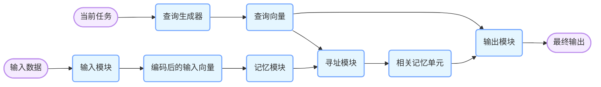

# 基于记忆网络的长期上下文依赖推理增强

> 关键词：记忆网络、长期上下文依赖、推理增强、深度学习、自然语言处理

> 摘要：本文聚焦于基于记忆网络的长期上下文依赖推理增强这一前沿技术领域。首先介绍了该技术的背景，包括目的、预期读者、文档结构和相关术语。接着详细阐述了核心概念，通过文本示意图和 Mermaid 流程图进行清晰展示。在核心算法原理部分，运用 Python 代码进行了详细解释。同时，给出了数学模型和公式，并结合实例说明。通过项目实战，展示了开发环境搭建、源代码实现与解读。探讨了实际应用场景，推荐了学习资源、开发工具框架以及相关论文著作。最后总结了未来发展趋势与挑战，还提供了常见问题解答和扩展阅读参考资料，旨在为读者全面深入地理解和应用该技术提供指导。

## 1. 背景介绍 
### 1.1 目的和范围
在自然语言处理（NLP）、语音识别、图像理解等诸多领域，处理长期上下文依赖并进行有效推理是一个关键挑战。传统的深度学习模型，如循环神经网络（RNN）及其变体（LSTM、GRU），在处理长序列时会面临梯度消失或梯度爆炸的问题，难以捕捉远距离的上下文信息。记忆网络作为一种新兴的技术，为解决长期上下文依赖问题提供了新的思路。

本文的目的是深入探讨基于记忆网络的长期上下文依赖推理增强技术，详细介绍其核心概念、算法原理、数学模型，并通过实际案例展示其应用。范围涵盖了记忆网络的基本原理、不同类型的记忆网络架构、如何利用记忆网络增强长期上下文依赖的推理能力，以及在自然语言处理等领域的实际应用。

### 1.2 预期读者
本文的预期读者包括人工智能、自然语言处理、机器学习等领域的研究人员、开发者和学生。对于希望深入了解记忆网络技术，提升处理长序列数据和增强推理能力的专业人士，本文将提供有价值的参考。同时，对于对人工智能前沿技术感兴趣的初学者，也可以通过本文初步了解记忆网络的基本概念和应用场景。

### 1.3 文档结构概述
本文将按照以下结构进行组织：
1. 背景介绍：阐述本文的目的、预期读者、文档结构和相关术语。
2. 核心概念与联系：介绍记忆网络的核心概念、原理和架构，通过文本示意图和 Mermaid 流程图进行直观展示。
3. 核心算法原理 & 具体操作步骤：详细讲解记忆网络的核心算法原理，并使用 Python 代码进行具体实现和解释。
4. 数学模型和公式 & 详细讲解 & 举例说明：给出记忆网络的数学模型和公式，并结合实例进行详细讲解。
5. 项目实战：代码实际案例和详细解释说明：通过一个实际的自然语言处理项目，展示如何使用记忆网络进行长期上下文依赖推理增强，包括开发环境搭建、源代码实现和代码解读。
6. 实际应用场景：探讨记忆网络在自然语言处理、语音识别、图像理解等领域的实际应用场景。
7. 工具和资源推荐：推荐学习记忆网络的相关书籍、在线课程、技术博客和网站，以及开发工具框架和相关论文著作。
8. 总结：未来发展趋势与挑战：总结记忆网络技术的发展趋势和面临的挑战。
9. 附录：常见问题与解答：解答读者在学习和应用记忆网络过程中常见的问题。
10. 扩展阅读 & 参考资料：提供进一步学习和研究记忆网络的扩展阅读资料和参考文献。

### 1.4 术语表
#### 1.4.1 核心术语定义
- **记忆网络（Memory Network）**：一种具有外部记忆模块的神经网络架构，能够存储和检索信息，以增强模型处理长期上下文依赖的能力。
- **长期上下文依赖（Long-Term Context Dependency）**：指在处理序列数据时，当前时刻的决策需要依赖于远距离的历史信息。
- **推理增强（Reasoning Enhancement）**：通过引入额外的信息或机制，提高模型在处理任务时的推理能力。
- **查询向量（Query Vector）**：用于从记忆网络中检索相关信息的向量。
- **记忆单元（Memory Cell）**：记忆网络中存储信息的基本单元。

#### 1.4.2 相关概念解释
- **注意力机制（Attention Mechanism）**：一种模拟人类注意力的机制，能够自动聚焦于序列中的重要部分。在记忆网络中，注意力机制常用于从记忆单元中选择相关信息。
- **外部记忆（External Memory）**：与模型的内部状态相对应，外部记忆是一个独立的存储结构，用于存储历史信息。
- **循环神经网络（RNN）**：一种能够处理序列数据的神经网络，通过循环结构传递信息，但在处理长序列时存在梯度消失或梯度爆炸的问题。
- **长短时记忆网络（LSTM）**：RNN 的一种变体，通过引入门控机制解决了梯度消失的问题，能够更好地处理长序列数据。

#### 1.4.3 缩略词列表
- **NLP**：自然语言处理（Natural Language Processing）
- **RNN**：循环神经网络（Recurrent Neural Network）
- **LSTM**：长短时记忆网络（Long Short-Term Memory）
- **GRU**：门控循环单元（Gated Recurrent Unit）
- **MLP**：多层感知机（Multi-Layer Perceptron）

## 2. 核心概念与联系 
### 2.1 记忆网络的基本概念
记忆网络是一种具有外部记忆模块的神经网络架构，其主要思想是将历史信息存储在外部记忆中，并在需要时通过查询向量从记忆中检索相关信息。与传统的神经网络不同，记忆网络能够显式地存储和检索信息，从而更好地处理长期上下文依赖。

记忆网络通常由以下几个部分组成：
1. **输入模块（Input Module）**：将输入数据转换为适合模型处理的表示形式。
2. **记忆模块（Memory Module）**：存储历史信息的外部记忆单元。
3. **寻址模块（Addressing Module）**：根据查询向量从记忆模块中选择相关的记忆单元。
4. **输出模块（Output Module）**：根据检索到的信息生成最终的输出。

### 2.2 记忆网络的架构
记忆网络有多种不同的架构，常见的包括端到端记忆网络（End-to-End Memory Networks）、动态记忆网络（Dynamic Memory Networks）等。下面以端到端记忆网络为例，介绍其架构和工作原理。

端到端记忆网络的架构如下：
1. **输入编码**：将输入序列编码为向量表示。
2. **记忆更新**：将编码后的输入向量存储到记忆模块中。
3. **查询生成**：根据当前任务生成查询向量。
4. **寻址操作**：使用查询向量从记忆模块中选择相关的记忆单元。
5. **输出生成**：根据检索到的信息生成最终的输出。

### 2.3 文本示意图
```plaintext
输入数据 -> 输入模块 -> 编码后的输入向量
编码后的输入向量 -> 记忆模块（存储）
当前任务 -> 查询生成器 -> 查询向量
查询向量 -> 寻址模块 -> 相关记忆单元
相关记忆单元 + 查询向量 -> 输出模块 -> 最终输出
```

### 2.4 Mermaid 流程图


### 2.5 核心概念之间的联系
输入模块将输入数据转换为编码后的输入向量，这些向量被存储在记忆模块中。查询生成器根据当前任务生成查询向量，寻址模块使用查询向量从记忆模块中选择相关的记忆单元。输出模块结合查询向量和检索到的记忆单元生成最终的输出。整个过程形成了一个闭环，通过不断地更新记忆和检索信息，记忆网络能够有效地处理长期上下文依赖。

## 3. 核心算法原理 & 具体操作步骤 
### 3.1 端到端记忆网络的核心算法原理
端到端记忆网络的核心思想是通过多次迭代从记忆中检索相关信息，以增强模型的推理能力。具体步骤如下：
1. **输入编码**：将输入序列 $x = [x_1, x_2, \cdots, x_T]$ 编码为向量表示 $m_i$，其中 $i = 1, 2, \cdots, T$。通常使用嵌入层将输入词转换为词向量，然后通过线性变换得到记忆向量。
2. **查询生成**：根据当前任务生成查询向量 $q$。查询向量可以是输入序列的最后一个向量，也可以是经过某种变换得到的向量。
3. **寻址操作**：使用查询向量 $q$ 从记忆模块中选择相关的记忆单元。具体来说，计算查询向量 $q$ 与每个记忆向量 $m_i$ 之间的相似度得分 $u_i$，然后通过 softmax 函数将得分转换为概率分布 $p_i$：
   - 相似度得分：$u_i = f(q, m_i)$，其中 $f$ 是相似度函数，常用的有点积、余弦相似度等。
   - 概率分布：$p_i = \frac{\exp(u_i)}{\sum_{j=1}^{T} \exp(u_j)}$
4. **信息聚合**：根据概率分布 $p_i$ 对记忆向量 $m_i$ 进行加权求和，得到检索到的信息 $o$：
   - $o = \sum_{i=1}^{T} p_i m_i$
5. **输出生成**：将查询向量 $q$ 和检索到的信息 $o$ 进行组合，通过一个线性变换和激活函数得到最终的输出 $y$：
   - $y = g(W[q; o] + b)$，其中 $W$ 是权重矩阵，$b$ 是偏置向量，$g$ 是激活函数。

### 3.2 具体操作步骤的 Python 实现
```python
import torch
import torch.nn as nn
import torch.nn.functional as F

class EndToEndMemoryNetwork(nn.Module):
    def __init__(self, vocab_size, embedding_dim, sentence_size, memory_size):
        super(EndToEndMemoryNetwork, self).__init__()
        self.vocab_size = vocab_size
        self.embedding_dim = embedding_dim
        self.sentence_size = sentence_size
        self.memory_size = memory_size
        
        # 输入嵌入层
        self.input_embedding = nn.Embedding(vocab_size, embedding_dim)
        # 输出嵌入层
        self.output_embedding = nn.Embedding(vocab_size, embedding_dim)
        # 线性层用于输出
        self.linear = nn.Linear(embedding_dim, vocab_size)
        
    def forward(self, input_sequence, query):
        # 输入编码
        input_embedded = self.input_embedding(input_sequence)  # [batch_size, memory_size, sentence_size, embedding_dim]
        input_sum = torch.sum(input_embedded, dim=2)  # [batch_size, memory_size, embedding_dim]
        
        # 查询编码
        query_embedded = self.input_embedding(query)  # [batch_size, sentence_size, embedding_dim]
        query_sum = torch.sum(query_embedded, dim=1)  # [batch_size, embedding_dim]
        
        # 寻址操作
        similarity_scores = torch.bmm(input_sum, query_sum.unsqueeze(-1)).squeeze(-1)  # [batch_size, memory_size]
        attention_weights = F.softmax(similarity_scores, dim=1)  # [batch_size, memory_size]
        
        # 信息聚合
        output_embedded = self.output_embedding(input_sequence)  # [batch_size, memory_size, sentence_size, embedding_dim]
        output_sum = torch.sum(output_embedded, dim=2)  # [batch_size, memory_size, embedding_dim]
        retrieved_info = torch.bmm(attention_weights.unsqueeze(1), output_sum).squeeze(1)  # [batch_size, embedding_dim]
        
        # 输出生成
        combined = query_sum + retrieved_info  # [batch_size, embedding_dim]
        output = self.linear(combined)  # [batch_size, vocab_size]
        return output
```

### 3.3 代码解释
1. **初始化函数 `__init__`**：
   - `vocab_size`：词汇表的大小。
   - `embedding_dim`：词向量的维度。
   - `sentence_size`：每个句子的最大长度。
   - `memory_size`：记忆模块中存储的句子数量。
   - `input_embedding`：输入嵌入层，将输入词转换为词向量。
   - `output_embedding`：输出嵌入层，用于生成输出表示。
   - `linear`：线性层，用于将组合后的向量映射到词汇表空间。

2. **前向传播函数 `forward`**：
   - **输入编码**：将输入序列通过输入嵌入层进行编码，并对每个句子的词向量进行求和。
   - **查询编码**：将查询序列通过输入嵌入层进行编码，并对词向量进行求和。
   - **寻址操作**：计算查询向量与每个记忆向量之间的相似度得分，并通过 softmax 函数得到注意力权重。
   - **信息聚合**：根据注意力权重对输出嵌入层的记忆向量进行加权求和，得到检索到的信息。
   - **输出生成**：将查询向量和检索到的信息相加，通过线性层得到最终的输出。

## 4. 数学模型和公式 & 详细讲解 & 举例说明 
### 4.1 数学模型和公式
#### 4.1.1 输入编码
假设输入序列 $x = [x_1, x_2, \cdots, x_T]$，其中 $x_i$ 是第 $i$ 个输入词。使用嵌入层将输入词转换为词向量 $e(x_i)$，然后对每个句子的词向量进行求和得到记忆向量 $m_i$：
$$m_i = \sum_{j=1}^{S} e(x_{ij})$$
其中 $S$ 是每个句子的最大长度。

#### 4.1.2 查询生成
查询向量 $q$ 可以是输入序列的最后一个向量，也可以是经过某种变换得到的向量。假设查询序列 $y = [y_1, y_2, \cdots, y_S]$，同样使用嵌入层将查询词转换为词向量 $e(y_i)$，然后对词向量进行求和得到查询向量 $q$：
$$q = \sum_{i=1}^{S} e(y_i)$$

#### 4.1.3 寻址操作
计算查询向量 $q$ 与每个记忆向量 $m_i$ 之间的相似度得分 $u_i$，常用的相似度函数是点积：
$$u_i = q^T m_i$$
然后通过 softmax 函数将得分转换为概率分布 $p_i$：
$$p_i = \frac{\exp(u_i)}{\sum_{j=1}^{T} \exp(u_j)}$$

#### 4.1.4 信息聚合
根据概率分布 $p_i$ 对记忆向量 $m_i$ 进行加权求和，得到检索到的信息 $o$：
$$o = \sum_{i=1}^{T} p_i m_i$$

#### 4.1.5 输出生成
将查询向量 $q$ 和检索到的信息 $o$ 进行组合，通过一个线性变换和激活函数得到最终的输出 $y$：
$$y = g(W[q; o] + b)$$
其中 $W$ 是权重矩阵，$b$ 是偏置向量，$g$ 是激活函数，常用的激活函数有 softmax 函数。

### 4.2 详细讲解
- **输入编码**：将输入词转换为词向量可以捕捉词之间的语义关系。对每个句子的词向量进行求和是一种简单的方式来表示整个句子的信息。
- **查询生成**：查询向量表示当前任务的需求，通过与记忆向量进行相似度计算，可以找到与任务相关的信息。
- **寻址操作**：相似度得分反映了查询向量与每个记忆向量之间的相关性，通过 softmax 函数将得分转换为概率分布，可以对记忆向量进行加权选择。
- **信息聚合**：根据概率分布对记忆向量进行加权求和，得到的检索到的信息是与查询相关的记忆信息的综合表示。
- **输出生成**：将查询向量和检索到的信息进行组合，通过线性变换和激活函数得到最终的输出，这个输出可以用于分类、生成等任务。

### 4.3 举例说明
假设我们有一个简单的问答任务，输入序列是一些句子，查询是一个问题。例如：
- 输入序列：["The dog is running.", "The cat is sleeping."]
- 查询："What is the dog doing?"

#### 输入编码
将输入序列中的每个句子转换为词向量，并对词向量进行求和。假设词汇表为 ["the", "dog", "is", "running", "cat", "sleeping"]，词向量维度为 5。经过输入编码后，得到两个记忆向量 $m_1$ 和 $m_2$。

#### 查询生成
将查询转换为词向量，并对词向量进行求和，得到查询向量 $q$。

#### 寻址操作
计算查询向量 $q$ 与每个记忆向量 $m_1$ 和 $m_2$ 之间的相似度得分 $u_1$ 和 $u_2$。由于查询是关于狗的行为，$m_1$ 包含了狗的相关信息，所以 $u_1$ 会比 $u_2$ 大。通过 softmax 函数得到概率分布 $p_1$ 和 $p_2$，$p_1$ 会接近 1，$p_2$ 会接近 0。

#### 信息聚合
根据概率分布对记忆向量进行加权求和，得到检索到的信息 $o$。由于 $p_1$ 接近 1，$o$ 主要由 $m_1$ 决定。

#### 输出生成
将查询向量 $q$ 和检索到的信息 $o$ 进行组合，通过线性变换和激活函数得到最终的输出。输出可以是一个概率分布，表示每个可能答案的概率。在这个例子中，输出可能会显示 "running" 的概率最高。

## 5. 项目实战：代码实际案例和详细解释说明 
### 5.1 开发环境搭建
#### 5.1.1 安装 Python
确保你已经安装了 Python 3.6 或更高版本。可以从 Python 官方网站（https://www.python.org/downloads/）下载并安装。

#### 5.1.2 安装 PyTorch
PyTorch 是一个常用的深度学习框架，用于实现记忆网络。可以根据你的操作系统和 CUDA 版本选择合适的安装方式。在命令行中运行以下命令安装 PyTorch：
```sh
pip install torch torchvision
```

#### 5.1.3 安装其他依赖库
还需要安装一些其他的依赖库，如 NumPy、tqdm 等。在命令行中运行以下命令安装：
```sh
pip install numpy tqdm
```

### 5.2 源代码详细实现和代码解读
#### 5.2.1 数据准备
我们使用一个简单的问答数据集来演示记忆网络的应用。数据集包含一些故事、问题和对应的答案。首先，我们需要对数据进行预处理，将文本转换为数字序列。

```python
import numpy as np
from collections import defaultdict

def load_data(file_path):
    stories = []
    questions = []
    answers = []
    story = []
    with open(file_path, 'r') as f:
        for line in f:
            line = line.strip()
            nid, line = line.split(' ', 1)
            if int(nid) == 1:
                story = []
            if '\t' in line:
                q, a, _ = line.split('\t')
                substory = [x for x in story if x]
                stories.append(substory)
                questions.append(q)
                answers.append(a)
            else:
                story.append(line)
    return stories, questions, answers

def vectorize_data(data, word_idx, sentence_size, memory_size):
    S = []
    Q = []
    A = []
    for story, query, answer in data:
        ss = []
        for i, sentence in enumerate(story, 1):
            ls = max(0, sentence_size - len(sentence))
            ss.append([word_idx[w] for w in sentence] + [0] * ls)
        # 填充记忆
        ss = ss[::-1][:memory_size][::-1]
        for i in range(len(ss)):
            ss[i] = [0] * (sentence_size - len(ss[i])) + ss[i]
        while len(ss) < memory_size:
            ss.append([0] * sentence_size)
        lq = max(0, sentence_size - len(query))
        q = [word_idx[w] for w in query] + [0] * lq
        y = np.zeros(len(word_idx) + 1)
        y[word_idx[answer]] = 1
        S.append(ss)
        Q.append(q)
        A.append(y)
    return np.array(S), np.array(Q), np.array(A)

# 加载数据
train_stories, train_questions, train_answers = load_data('data/train.txt')
test_stories, test_questions, test_answers = load_data('data/test.txt')

# 构建词汇表
vocab = set()
for story in train_stories + test_stories:
    for sentence in story:
        for word in sentence.split():
            vocab.add(word)
for question in train_questions + test_questions:
    for word in question.split():
        vocab.add(word)
for answer in train_answers + test_answers:
    vocab.add(answer)
vocab = sorted(vocab)
vocab_size = len(vocab) + 1
word_idx = dict((c, i + 1) for i, c in enumerate(vocab))

# 数据向量化
sentence_size = max([len(s) for story in train_stories + test_stories for s in story] + [len(q) for q in train_questions + test_questions])
memory_size = max([len(story) for story in train_stories + test_stories])
train_S, train_Q, train_A = vectorize_data(zip(train_stories, train_questions, train_answers), word_idx, sentence_size, memory_size)
test_S, test_Q, test_A = vectorize_data(zip(test_stories, test_questions, test_answers), word_idx, sentence_size, memory_size)
```

#### 5.2.2 模型训练
```python
import torch
import torch.nn as nn
import torch.optim as optim
from tqdm import tqdm

# 定义模型
model = EndToEndMemoryNetwork(vocab_size, embedding_dim=50, sentence_size=sentence_size, memory_size=memory_size)

# 定义损失函数和优化器
criterion = nn.CrossEntropyLoss()
optimizer = optim.Adam(model.parameters(), lr=0.001)

# 训练模型
num_epochs = 10
batch_size = 32
num_batches = len(train_S) // batch_size

for epoch in range(num_epochs):
    total_loss = 0
    for i in tqdm(range(num_batches)):
        start = i * batch_size
        end = start + batch_size
        input_sequence = torch.LongTensor(train_S[start:end])
        query = torch.LongTensor(train_Q[start:end])
        target = torch.argmax(torch.FloatTensor(train_A[start:end]), dim=1)
        
        optimizer.zero_grad()
        output = model(input_sequence, query)
        loss = criterion(output, target)
        loss.backward()
        optimizer.step()
        
        total_loss += loss.item()
    
    print(f'Epoch {epoch+1}/{num_epochs}, Loss: {total_loss/num_batches}')
```

#### 5.2.3 模型评估
```python
# 评估模型
correct = 0
total = len(test_S)
with torch.no_grad():
    for i in range(total):
        input_sequence = torch.LongTensor(test_S[i:i+1])
        query = torch.LongTensor(test_Q[i:i+1])
        target = torch.argmax(torch.FloatTensor(test_A[i:i+1]), dim=1)
        output = model(input_sequence, query)
        predicted = torch.argmax(output, dim=1)
        correct += (predicted == target).sum().item()

accuracy = correct / total
print(f'Test Accuracy: {accuracy}')
```

### 5.3 代码解读与分析
#### 5.3.1 数据准备
- `load_data` 函数用于从文件中加载数据，将故事、问题和答案分别存储在列表中。
- `vectorize_data` 函数将文本数据转换为数字序列，填充到固定长度，并将答案转换为 one-hot 向量。
- 构建词汇表并为每个词分配一个唯一的索引。

#### 5.3.2 模型训练
- 定义 `EndToEndMemoryNetwork` 模型，设置嵌入维度、句子长度和记忆大小。
- 使用交叉熵损失函数和 Adam 优化器进行训练。
- 按批次训练模型，每个批次计算损失并更新模型参数。

#### 5.3.3 模型评估
- 在测试集上评估模型的准确率，通过比较预测结果和真实标签来计算正确预测的数量。

## 6. 实际应用场景 
### 6.1 自然语言处理
#### 6.1.1 问答系统
记忆网络可以用于构建问答系统，通过存储历史对话信息，能够更好地理解用户的问题并提供准确的答案。例如，在智能客服系统中，记忆网络可以记住用户之前的提问和回复，从而在后续的交流中提供更连贯和准确的服务。

#### 6.1.2 文本生成
在文本生成任务中，如故事生成、诗歌创作等，记忆网络可以利用之前生成的文本信息，保持文本的连贯性和逻辑性。通过存储历史文本片段，模型可以在生成新的文本时参考这些信息，生成更符合上下文的内容。

#### 6.1.3 机器翻译
在机器翻译中，记忆网络可以处理长句子的翻译，捕捉源语言和目标语言之间的长期依赖关系。通过存储源语言句子的历史信息，模型可以更好地理解句子的整体语义，从而生成更准确的翻译结果。

### 6.2 语音识别
在语音识别中，记忆网络可以用于处理长语音序列，提高识别的准确率。例如，在会议记录、语音笔记等应用中，语音可能包含较长的段落，记忆网络可以存储之前的语音信息，更好地理解语音的上下文，从而提高识别的效果。

### 6.3 图像理解
在图像理解任务中，如图像描述生成、图像问答等，记忆网络可以结合图像特征和历史信息进行推理。例如，在图像描述生成中，记忆网络可以存储之前生成的描述信息，生成更连贯和详细的图像描述。

## 7. 工具和资源推荐
### 7.1 学习资源推荐
#### 7.1.1 书籍推荐
- 《深度学习》（Deep Learning）：由 Ian Goodfellow、Yoshua Bengio 和 Aaron Courville 撰写，是深度学习领域的经典教材，涵盖了神经网络、深度学习模型等方面的知识。
- 《自然语言处理入门》（Natural Language Processing with Python）：介绍了使用 Python 进行自然语言处理的基础知识和技术，包括文本处理、词法分析、句法分析等。
- 《动手学深度学习》（Dive into Deep Learning）：提供了深度学习的理论和实践指导，包含大量的代码示例和实验，适合初学者和有一定基础的开发者。

#### 7.1.2 在线课程
- Coursera 上的“深度学习专项课程”（Deep Learning Specialization）：由 Andrew Ng 教授授课，涵盖了深度学习的各个方面，包括神经网络、卷积神经网络、循环神经网络等。
- edX 上的“自然语言处理基础”（Foundations of Natural Language Processing）：介绍了自然语言处理的基本概念、技术和应用，适合初学者学习。
- 哔哩哔哩上的一些深度学习和自然语言处理相关的教程视频，如李沐老师的“动手学深度学习”系列课程。

#### 7.1.3 技术博客和网站
- Medium：有很多关于深度学习、自然语言处理的技术博客，如 Towards Data Science 等。
- arXiv：是一个预印本数据库，提供了大量的最新研究论文，涵盖了人工智能、机器学习等领域。
- Hugging Face：是一个专注于自然语言处理的开源社区，提供了很多预训练模型、工具和教程。

### 7.2 开发工具框架推荐
#### 7.2.1 IDE和编辑器
- PyCharm：是一个专门为 Python 开发设计的集成开发环境，提供了代码编辑、调试、版本控制等功能。
- Jupyter Notebook：是一个交互式的开发环境，适合进行数据探索、模型实验和代码演示。
- Visual Studio Code：是一个轻量级的代码编辑器，支持多种编程语言，有丰富的插件扩展。

#### 7.2.2 调试和性能分析工具
- PyTorch Profiler：是 PyTorch 提供的性能分析工具，可以帮助开发者分析模型的运行时间、内存使用等情况。
- TensorBoard：是 TensorFlow 提供的可视化工具，也可以用于 PyTorch 模型的可视化和调试。
- cProfile：是 Python 内置的性能分析工具，可以分析代码的运行时间和函数调用情况。

#### 7.2.3 相关框架和库
- PyTorch：是一个开源的深度学习框架，提供了丰富的神经网络层和优化算法，易于使用和扩展。
- TensorFlow：是另一个广泛使用的深度学习框架，具有强大的分布式训练和部署能力。
- AllenNLP：是一个用于自然语言处理的深度学习框架，提供了很多预定义的模型和工具，方便开发者进行自然语言处理任务。

### 7.3 相关论文著作推荐
#### 7.3.1 经典论文
- "End-To-End Memory Networks"：介绍了端到端记忆网络的架构和算法，是记忆网络领域的经典论文。
- "Dynamic Memory Networks for Visual and Textual Question Answering"：提出了动态记忆网络，用于处理视觉和文本问答任务。
- "Attention Is All You Need"：介绍了 Transformer 模型，引入了注意力机制，对自然语言处理领域产生了深远影响。

#### 7.3.2 最新研究成果
- 可以通过 arXiv、ACM Digital Library、IEEE Xplore 等数据库查找关于记忆网络、长期上下文依赖推理增强的最新研究论文。
- 关注顶级学术会议，如 NeurIPS、ICML、ACL 等，了解最新的研究动态。

#### 7.3.3 应用案例分析
- 可以参考一些实际应用案例的论文，了解记忆网络在不同领域的应用方法和效果。例如，在医疗领域的病历分析、金融领域的风险评估等方面的应用案例。

## 8. 总结：未来发展趋势与挑战
### 8.1 未来发展趋势
#### 8.1.1 模型融合
将记忆网络与其他深度学习模型，如 Transformer、卷积神经网络（CNN）等进行融合，以充分发挥不同模型的优势，提高模型的性能和表达能力。例如，将记忆网络与 Transformer 结合，可以更好地处理长序列数据和进行推理。

#### 8.1.2 多模态应用
随着多模态数据的不断增加，记忆网络在多模态任务中的应用将越来越广泛。例如，在图像、语音和文本的联合处理中，记忆网络可以存储和利用不同模态的数据信息，提高多模态任务的性能。

#### 8.1.3 强化学习结合
将记忆网络与强化学习相结合，用于处理复杂的决策任务。记忆网络可以存储历史状态和动作信息，帮助强化学习智能体更好地进行决策和学习。

### 8.2 挑战
#### 8.2.1 计算资源需求
记忆网络通常需要大量的计算资源来训练和推理，尤其是在处理大规模数据和复杂任务时。如何降低计算成本，提高模型的效率是一个亟待解决的问题。

#### 8.2.2 数据稀疏性
在实际应用中，数据往往是稀疏的，记忆网络可能无法有效地从稀疏数据中学习到有用的信息。如何处理数据稀疏性，提高模型在稀疏数据上的性能是一个挑战。

#### 8.2.3 可解释性
记忆网络作为一种深度学习模型，其决策过程往往是黑盒的，缺乏可解释性。在一些对可解释性要求较高的应用场景中，如医疗诊断、金融风险评估等，如何提高记忆网络的可解释性是一个重要的问题。

## 9. 附录：常见问题与解答
### 9.1 记忆网络与传统神经网络有什么区别？
传统神经网络，如 RNN、LSTM 等，主要通过内部状态来存储和传递信息，在处理长序列时容易出现梯度消失或梯度爆炸的问题。而记忆网络引入了外部记忆模块，能够显式地存储和检索信息，从而更好地处理长期上下文依赖。

### 9.2 如何选择合适的相似度函数？
常见的相似度函数有点积、余弦相似度等。点积计算简单，速度快，适用于大规模数据的处理；余弦相似度考虑了向量的方向，能够更好地衡量向量之间的相似性。在实际应用中，可以根据具体任务和数据特点选择合适的相似度函数。

### 9.3 记忆网络的训练时间较长，如何提高训练效率？
可以采取以下措施提高训练效率：
- 使用 GPU 进行加速训练。
- 调整批次大小，选择合适的学习率。
- 对数据进行预处理，减少不必要的计算。
- 使用优化算法，如 Adam、Adagrad 等。

### 9.4 记忆网络在实际应用中容易出现过拟合问题，如何解决？
可以采取以下方法解决过拟合问题：
- 增加训练数据量。
- 使用正则化方法，如 L1、L2 正则化。
- 采用 Dropout 技术，随机丢弃一些神经元。
- 提前停止训练，避免模型过度拟合训练数据。

## 10. 扩展阅读 & 参考资料
### 10.1 扩展阅读
- "Neural Turing Machines"：介绍了神经图灵机，是一种具有可微分读写操作的记忆网络。
- "Memory Networks"：详细介绍了记忆网络的原理和应用。
- "Hierarchical Memory Networks for Document Classification"：提出了层次化记忆网络，用于文档分类任务。

### 10.2 参考资料
- "End-To-End Memory Networks"：https://arxiv.org/abs/1503.08895
- "Dynamic Memory Networks for Visual and Textual Question Answering"：https://arxiv.org/abs/1603.01417
- "Attention Is All You Need"：https://arxiv.org/abs/1706.03762

作者：AI天才研究院/AI Genius Institute & 禅与计算机程序设计艺术 /Zen And The Art of Computer Programming