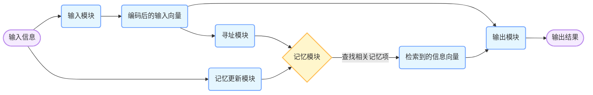

# 基于记忆网络的长期上下文依赖推理能力增强

> 关键词：记忆网络、长期上下文依赖、推理能力、深度学习、自然语言处理、知识表示、注意力机制

> 摘要：本文聚焦于基于记忆网络的长期上下文依赖推理能力增强这一主题。在自然语言处理等领域，处理长期上下文依赖并进行有效推理是极具挑战性的任务。记忆网络作为一种有潜力的技术，能够通过存储和检索历史信息，为推理提供更丰富的上下文支持。文章深入探讨了记忆网络的核心概念、算法原理、数学模型，通过项目实战展示其具体应用，分析了实际应用场景，推荐了相关工具和资源，并对未来发展趋势与挑战进行了总结，旨在为相关领域的研究和实践提供全面而深入的参考。

## 1. 背景介绍 
### 1.1 目的和范围
在自然语言处理、计算机视觉等众多领域，理解和处理长期上下文依赖是实现智能系统的关键。传统的深度学习模型，如循环神经网络（RNN）及其变体（LSTM、GRU），在处理长序列时存在梯度消失或爆炸等问题，难以有效地捕捉长期依赖关系。记忆网络的提出为解决这一问题提供了新的思路。本文的目的在于深入研究基于记忆网络的方法如何增强长期上下文依赖的推理能力，涵盖记忆网络的原理、算法、应用等多个方面，范围涉及自然语言处理中的问答系统、文本生成，计算机视觉中的场景理解等多个应用场景。

### 1.2 预期读者
本文预期读者包括对人工智能、深度学习、自然语言处理等领域感兴趣的研究人员、工程师和学生。对于正在探索如何提高模型长期依赖处理能力和推理能力的从业者，以及希望深入了解记忆网络技术的初学者都具有参考价值。

### 1.3 文档结构概述
本文首先介绍记忆网络的背景知识，包括目的、预期读者和文档结构。接着阐述记忆网络的核心概念与联系，通过文本示意图和Mermaid流程图进行直观展示。然后详细讲解核心算法原理和具体操作步骤，并使用Python源代码进行说明。之后介绍数学模型和公式，通过举例加深理解。通过项目实战展示记忆网络在实际中的应用，包括开发环境搭建、源代码实现和代码解读。分析记忆网络的实际应用场景，推荐相关的工具和资源。最后总结未来发展趋势与挑战，提供常见问题解答和扩展阅读参考资料。

### 1.4 术语表
#### 1.4.1 核心术语定义
- **记忆网络（Memory Network）**：一种具有外部记忆组件的神经网络架构，能够存储和检索信息，以帮助模型更好地处理长期依赖关系。
- **长期上下文依赖（Long-term Context Dependency）**：指在序列数据中，相隔较远的元素之间存在的依赖关系，这种依赖关系对于理解整个序列的语义和进行推理至关重要。
- **推理能力（Reasoning Ability）**：模型根据输入信息和已有的知识，进行逻辑推导和得出结论的能力。
- **注意力机制（Attention Mechanism）**：一种模拟人类注意力的机制，能够自动地聚焦于输入序列中的重要部分，提高模型的处理效率和准确性。

#### 1.4.2 相关概念解释
- **外部记忆（External Memory）**：与传统神经网络的内部状态不同，外部记忆是一个独立的存储单元，用于存储历史信息，以便模型在需要时进行访问。
- **寻址机制（Addressing Mechanism）**：用于在外部记忆中查找和选择相关信息的方法，常见的寻址机制包括基于内容的寻址和基于位置的寻址。
- **记忆更新（Memory Update）**：随着新信息的输入，对外部记忆中的内容进行更新，以反映最新的状态。

#### 1.4.3 缩略词列表
- **RNN（Recurrent Neural Network）**：循环神经网络
- **LSTM（Long Short-Term Memory）**：长短期记忆网络
- **GRU（Gated Recurrent Unit）**：门控循环单元
- **NLP（Natural Language Processing）**：自然语言处理
- **CV（Computer Vision）**：计算机视觉

## 2. 核心概念与联系 

### 核心概念原理
记忆网络的核心思想是引入外部记忆组件，用于存储和管理历史信息。传统的神经网络在处理序列数据时，只能通过内部状态来传递信息，随着序列长度的增加，内部状态会逐渐遗忘早期的信息，导致长期依赖处理能力下降。而记忆网络通过外部记忆，能够将重要的信息长期保存，当需要进行推理时，可以从记忆中检索相关信息，从而更好地处理长期上下文依赖。

记忆网络通常由多个组件组成，包括输入模块、记忆模块、寻址模块、输出模块等。输入模块负责将输入信息进行编码，转换为适合存储和处理的形式。记忆模块是外部记忆的存储单元，用于保存历史信息。寻址模块根据当前输入和任务需求，在记忆模块中查找相关信息。输出模块根据检索到的信息和当前输入，生成最终的输出结果。

### 架构的文本示意图
记忆网络的基本架构可以描述如下：

输入信息首先经过输入模块进行编码，得到编码后的输入向量。这个向量被用于寻址模块，寻址模块在记忆模块中查找相关的记忆项。记忆模块中存储着历史信息，每个记忆项都有一个对应的表示向量。寻址模块通过计算输入向量与记忆项表示向量之间的相似度，确定每个记忆项的权重。根据这些权重，对记忆项进行加权求和，得到检索到的信息向量。最后，输出模块将检索到的信息向量和当前输入向量结合，生成最终的输出结果。同时，随着新信息的输入，记忆模块会根据一定的策略进行更新，以保持记忆的有效性和时效性。

### Mermaid流程图


## 3. 核心算法原理 & 具体操作步骤 

### 核心算法原理
记忆网络的核心算法主要包括寻址算法和记忆更新算法。

#### 寻址算法
常见的寻址算法是基于内容的寻址。给定输入向量 $\mathbf{x}$ 和记忆模块中的记忆项 $\mathbf{m}_i$（$i = 1,2,\cdots,N$，$N$ 为记忆项的数量），首先计算输入向量与每个记忆项之间的相似度得分 $s_i$，通常使用点积或余弦相似度：

$$s_i = \mathbf{x}^T\mathbf{m}_i$$

然后，通过 softmax 函数将相似度得分转换为权重 $\alpha_i$：

$$\alpha_i = \frac{\exp(s_i)}{\sum_{j = 1}^{N}\exp(s_j)}$$

最后，根据权重对记忆项进行加权求和，得到检索到的信息向量 $\mathbf{r}$：

$$\mathbf{r} = \sum_{i = 1}^{N}\alpha_i\mathbf{m}_i$$

#### 记忆更新算法
记忆更新算法的目的是随着新信息的输入，更新记忆模块中的内容。一种简单的更新策略是直接将新的信息添加到记忆模块中，同时删除最旧的记忆项，以保持记忆模块的大小不变。另一种更复杂的策略是根据记忆项的重要性和时效性进行更新，例如使用基于注意力机制的更新方法。

### 具体操作步骤
1. **初始化**：初始化记忆模块，将初始的记忆项存储在记忆模块中。
2. **输入处理**：将输入信息通过输入模块进行编码，得到编码后的输入向量。
3. **寻址操作**：使用寻址算法在记忆模块中查找相关的记忆项，得到检索到的信息向量。
4. **输出生成**：将检索到的信息向量和当前输入向量结合，通过输出模块生成最终的输出结果。
5. **记忆更新**：根据记忆更新算法，更新记忆模块中的内容。
6. **重复步骤 2 - 5**：处理下一个输入信息。

### Python源代码实现
```python
import numpy as np

# 初始化记忆模块
memory_size = 10
embedding_size = 5
memory = np.random.randn(memory_size, embedding_size)

# 输入模块
def input_module(input_info):
    # 简单的编码，这里直接使用输入信息作为编码后的向量
    return input_info

# 寻址模块
def addressing_module(input_vector, memory):
    # 计算相似度得分
    similarity_scores = np.dot(input_vector, memory.T)
    # 计算权重
    weights = np.exp(similarity_scores) / np.sum(np.exp(similarity_scores))
    # 加权求和得到检索到的信息向量
    retrieved_info = np.dot(weights, memory)
    return retrieved_info

# 输出模块
def output_module(input_vector, retrieved_info):
    # 简单的结合方式，将输入向量和检索到的信息向量相加
    output = input_vector + retrieved_info
    return output

# 记忆更新模块
def memory_update_module(new_info, memory):
    # 简单的更新策略，将新信息添加到记忆模块末尾，删除最旧的记忆项
    new_memory = np.vstack((memory[1:], new_info))
    return new_memory

# 处理输入信息
input_info = np.random.randn(embedding_size)
encoded_input = input_module(input_info)
retrieved_info = addressing_module(encoded_input, memory)
output = output_module(encoded_input, retrieved_info)
new_memory = memory_update_module(encoded_input, memory)

print("输出结果:", output)
print("更新后的记忆模块:", new_memory)
```

## 4. 数学模型和公式 & 详细讲解 & 举例说明 

### 数学模型
记忆网络的数学模型可以表示为一个函数 $f$，它接受输入信息 $\mathbf{x}$ 和记忆模块 $\mathbf{M}$ 作为输入，输出结果 $\mathbf{y}$：

$$\mathbf{y} = f(\mathbf{x}, \mathbf{M})$$

其中，$\mathbf{M} = [\mathbf{m}_1, \mathbf{m}_2, \cdots, \mathbf{m}_N]^T$ 是记忆模块，$\mathbf{m}_i$ 是第 $i$ 个记忆项。

### 公式详细讲解
#### 寻址公式
如前面所述，寻址公式包括相似度得分计算、权重计算和检索信息向量计算。

- **相似度得分计算**：$s_i = \mathbf{x}^T\mathbf{m}_i$，点积运算可以衡量输入向量 $\mathbf{x}$ 和记忆项 $\mathbf{m}_i$ 之间的相似度。如果两个向量的方向越相似，点积的值就越大。
- **权重计算**：$\alpha_i = \frac{\exp(s_i)}{\sum_{j = 1}^{N}\exp(s_j)}$，softmax 函数将相似度得分转换为概率分布，使得所有权重之和为 1。这样可以确保在加权求和时，每个记忆项的贡献是合理的。
- **检索信息向量计算**：$\mathbf{r} = \sum_{i = 1}^{N}\alpha_i\mathbf{m}_i$，通过加权求和的方式，将相关的记忆项组合起来，得到检索到的信息向量。

#### 记忆更新公式
记忆更新公式可以根据不同的更新策略进行定义。例如，简单的更新策略可以表示为：

$$\mathbf{M}_{new} = [\mathbf{m}_2, \mathbf{m}_3, \cdots, \mathbf{m}_N, \mathbf{x}]$$

其中，$\mathbf{M}_{new}$ 是更新后的记忆模块，$\mathbf{x}$ 是新的输入信息。

### 举例说明
假设记忆模块中有 3 个记忆项：

$$\mathbf{M} = \begin{bmatrix}
1 & 2 & 3 \\
4 & 5 & 6 \\
7 & 8 & 9
\end{bmatrix}$$

输入向量 $\mathbf{x} = [1, 1, 1]$。

1. **相似度得分计算**：
    - $s_1 = \mathbf{x}^T\mathbf{m}_1 = 1\times1 + 1\times2 + 1\times3 = 6$
    - $s_2 = \mathbf{x}^T\mathbf{m}_2 = 1\times4 + 1\times5 + 1\times6 = 15$
    - $s_3 = \mathbf{x}^T\mathbf{m}_3 = 1\times7 + 1\times8 + 1\times9 = 24$

2. **权重计算**：
    - $\alpha_1 = \frac{\exp(6)}{\exp(6) + \exp(15) + \exp(24)} \approx 0.000002$
    - $\alpha_2 = \frac{\exp(15)}{\exp(6) + \exp(15) + \exp(24)} \approx 0.0003$
    - $\alpha_3 = \frac{\exp(24)}{\exp(6) + \exp(15) + \exp(24)} \approx 0.9997$

3. **检索信息向量计算**：
    - $\mathbf{r} = \alpha_1\mathbf{m}_1 + \alpha_2\mathbf{m}_2 + \alpha_3\mathbf{m}_3 \approx 0.9997\times\begin{bmatrix}7 \\ 8 \\ 9\end{bmatrix} \approx \begin{bmatrix}6.9979 \\ 7.9976 \\ 8.9973\end{bmatrix}$

4. **记忆更新**：
如果采用简单的更新策略，新的记忆模块为：

$$\mathbf{M}_{new} = \begin{bmatrix}
4 & 5 & 6 \\
7 & 8 & 9 \\
1 & 1 & 1
\end{bmatrix}$$

## 5. 项目实战：代码实际案例和详细解释说明 

### 5.1  开发环境搭建
在进行基于记忆网络的项目实战时，我们可以使用 Python 作为开发语言，并使用一些常见的深度学习库，如 PyTorch 或 TensorFlow。以下是使用 PyTorch 搭建开发环境的步骤：

1. **安装 Python**：确保你已经安装了 Python 3.6 或更高版本。可以从 Python 官方网站（https://www.python.org/downloads/）下载并安装。
2. **安装 PyTorch**：根据你的操作系统和 CUDA 版本，选择合适的 PyTorch 安装命令。例如，如果你使用的是 CPU 版本，可以使用以下命令：

```sh
pip install torch torchvision
```

如果你使用的是 GPU 版本，需要根据 CUDA 版本选择相应的安装命令，可以参考 PyTorch 官方网站（https://pytorch.org/get-started/locally/）。

3. **安装其他依赖库**：还需要安装一些其他的依赖库，如 numpy、matplotlib 等，可以使用以下命令进行安装：

```sh
pip install numpy matplotlib
```

### 5.2  源代码详细实现和代码解读
我们以一个简单的问答系统为例，实现一个基于记忆网络的问答模型。

```python
import torch
import torch.nn as nn
import torch.optim as optim
import numpy as np

# 定义记忆网络模型
class MemoryNetwork(nn.Module):
    def __init__(self, input_size, memory_size, embedding_size):
        super(MemoryNetwork, self).__init__()
        self.input_embedding = nn.Linear(input_size, embedding_size)
        self.memory = nn.Parameter(torch.randn(memory_size, embedding_size))
        self.output_layer = nn.Linear(2 * embedding_size, input_size)

    def forward(self, input_info):
        # 输入模块
        encoded_input = self.input_embedding(input_info)
        # 寻址模块
        similarity_scores = torch.matmul(encoded_input, self.memory.t())
        weights = torch.softmax(similarity_scores, dim=1)
        retrieved_info = torch.matmul(weights, self.memory)
        # 输出模块
        combined_info = torch.cat((encoded_input, retrieved_info), dim=1)
        output = self.output_layer(combined_info)
        return output

# 生成一些示例数据
input_size = 10
memory_size = 5
embedding_size = 20
batch_size = 32

input_data = torch.randn(batch_size, input_size)

# 初始化模型、损失函数和优化器
model = MemoryNetwork(input_size, memory_size, embedding_size)
criterion = nn.MSELoss()
optimizer = optim.Adam(model.parameters(), lr=0.001)

# 训练模型
num_epochs = 100
for epoch in range(num_epochs):
    optimizer.zero_grad()
    output = model(input_data)
    loss = criterion(output, input_data)
    loss.backward()
    optimizer.step()
    if (epoch + 1) % 10 == 0:
        print(f'Epoch [{epoch + 1}/{num_epochs}], Loss: {loss.item():.4f}')
```

### 5.3  代码解读与分析
1. **模型定义**：`MemoryNetwork` 类继承自 `nn.Module`，定义了记忆网络的结构。包括输入嵌入层 `input_embedding`、记忆模块 `memory` 和输出层 `output_layer`。
2. **前向传播**：在 `forward` 方法中，首先通过输入嵌入层将输入信息