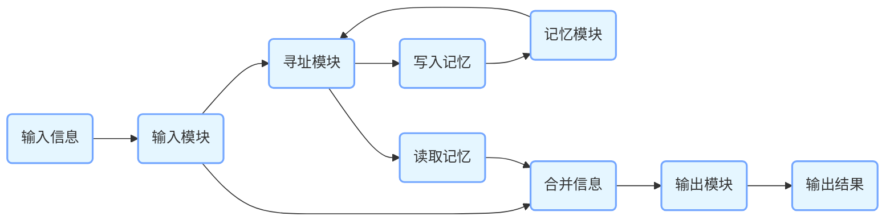

# 基于记忆网络的长期依赖推理能力增强

> 关键词：记忆网络、长期依赖推理、深度学习、知识表示、序列建模

> 摘要：本文围绕基于记忆网络增强长期依赖推理能力展开深入探讨。首先介绍了研究背景和相关概念，阐述了记忆网络的核心原理与架构，通过 Python 代码详细讲解了核心算法。从数学模型和公式层面剖析了记忆网络的工作机制，并结合实际案例进行说明。接着给出项目实战的具体步骤，包括开发环境搭建、源代码实现与解读。分析了记忆网络在多个实际场景中的应用，推荐了相关的学习资源、开发工具框架以及论文著作。最后对未来发展趋势与挑战进行总结，并提供常见问题解答和扩展阅读参考资料，旨在为读者全面深入地理解基于记忆网络增强长期依赖推理能力提供清晰的技术指导。

## 1. 背景介绍 
### 1.1 目的和范围
在自然语言处理、时间序列分析等诸多领域，模型需要具备处理长期依赖信息的能力，即能够捕捉序列中相隔较远元素之间的关联。然而，传统的深度学习模型，如循环神经网络（RNN），在处理长序列时会面临梯度消失或梯度爆炸的问题，导致其难以有效地学习和利用长期依赖信息。记忆网络的出现为解决这一问题提供了新的思路。本文的目的在于深入研究基于记忆网络的方法，如何增强模型的长期依赖推理能力。范围涵盖记忆网络的核心概念、算法原理、数学模型、实际应用案例以及相关工具和资源推荐等方面。

### 1.2 预期读者
本文预期读者包括对深度学习、自然语言处理、时间序列分析等领域感兴趣的研究人员、工程师和学生。具有一定的机器学习和深度学习基础知识，了解神经网络的基本结构和原理，希望进一步探索如何解决长期依赖问题、提升模型推理能力的读者将从本文中获得有价值的信息。

### 1.3 文档结构概述
本文将按照以下结构展开：首先介绍相关背景和核心概念，包括记忆网络的定义、原理和架构；接着详细讲解核心算法原理和具体操作步骤，使用 Python 代码进行阐述；然后给出数学模型和公式，并通过具体例子说明；之后进行项目实战，包括开发环境搭建、源代码实现和代码解读；分析实际应用场景；推荐相关的学习资源、开发工具框架和论文著作；最后总结未来发展趋势与挑战，提供常见问题解答和扩展阅读参考资料。

### 1.4 术语表
#### 1.4.1 核心术语定义
- **记忆网络（Memory Network）**：一种具有外部记忆组件的神经网络模型，能够存储和检索信息，以帮助模型处理长期依赖问题。
- **长期依赖（Long-Term Dependency）**：在序列数据中，相隔较远的元素之间存在重要的关联关系，模型需要捕捉这种关联才能进行准确的推理和预测。
- **推理能力（Reasoning Ability）**：模型根据输入信息，结合自身的知识和学习经验，得出合理结论或预测的能力。
- **注意力机制（Attention Mechanism）**：一种能够自动地从输入序列中选择重要信息的机制，在记忆网络中常用于聚焦于相关的记忆单元。

#### 1.4.2 相关概念解释
- **外部记忆（External Memory）**：与传统神经网络内部的隐藏状态不同，外部记忆是一个独立的存储结构，可以存储大量的信息，并且可以通过特定的操作进行读写。
- **寻址（Addressing）**：在记忆网络中，寻址是指根据输入信息确定需要读取或写入的记忆单元的过程。
- **端到端学习（End-to-End Learning）**：一种训练方式，模型可以直接从输入数据学习到输出结果，不需要进行复杂的特征工程和中间步骤。

#### 1.4.3 缩略词列表
- **RNN（Recurrent Neural Network）**：循环神经网络
- **LSTM（Long Short-Term Memory）**：长短期记忆网络
- **GRU（Gated Recurrent Unit）**：门控循环单元
- **DNN（Deep Neural Network）**：深度神经网络

## 2. 核心概念与联系 
### 核心概念原理
记忆网络的核心思想是引入外部记忆组件，用于存储和检索信息，以帮助模型处理长期依赖问题。传统的神经网络，如 RNN，其隐藏状态的容量有限，难以存储长序列中的所有重要信息。而记忆网络通过外部记忆，可以将相关信息存储在记忆单元中，并在需要时进行检索和利用。

记忆网络通常由以下几个组件组成：
- **输入模块（Input Module）**：负责将输入信息进行处理和编码，以便后续与记忆进行交互。
- **记忆模块（Memory Module）**：包含多个记忆单元，用于存储历史信息。
- **寻址模块（Addressing Module）**：根据输入信息，确定需要读取或写入的记忆单元。
- **输出模块（Output Module）**：根据读取的记忆信息和输入信息，生成最终的输出结果。

### 架构示意图
下面是记忆网络的基本架构示意图：


### 各组件联系说明
输入模块接收输入信息并进行编码，然后将编码后的信息传递给寻址模块。寻址模块根据输入信息，从记忆模块中选择相关的记忆单元进行读取和写入操作。读取的记忆信息与输入信息在合并信息模块中进行融合，最后由输出模块根据融合后的信息生成最终的输出结果。同时，寻址模块还会根据输入信息更新记忆模块中的内容，以便后续使用。

## 3. 核心算法原理 & 具体操作步骤 
### 算法原理
记忆网络的核心算法主要包括寻址和信息融合两个过程。下面我们使用 Python 代码详细阐述这两个过程。

#### 寻址过程
寻址过程的目的是根据输入信息确定需要读取或写入的记忆单元。常见的寻址方法是使用注意力机制，通过计算输入信息与每个记忆单元之间的相似度，得到每个记忆单元的注意力权重。

```python
import torch
import torch.nn.functional as F

# 输入信息
input_info = torch.randn(1, 100)  # 假设输入信息的维度为 100
# 记忆模块，假设有 10 个记忆单元，每个记忆单元的维度为 100
memory = torch.randn(10, 100)

# 计算相似度
similarities = torch.mm(input_info, memory.t())  # 矩阵乘法计算相似度

# 计算注意力权重
attention_weights = F.softmax(similarities, dim=1)

print("注意力权重:", attention_weights)
```

#### 信息融合过程
信息融合过程是将读取的记忆信息与输入信息进行合并，以便后续处理。

```python
# 读取记忆信息
read_memory = torch.mm(attention_weights, memory)

# 合并信息
merged_info = torch.cat((input_info, read_memory), dim=1)

print("合并后的信息维度:", merged_info.shape)
```

### 具体操作步骤
1. **初始化记忆模块**：随机初始化记忆模块中的记忆单元。
2. **输入信息处理**：将输入信息传递给输入模块进行编码。
3. **寻址操作**：根据编码后的输入信息，计算注意力权重，确定需要读取的记忆单元。
4. **读取记忆**：根据注意力权重，从记忆模块中读取相关的记忆信息。
5. **信息融合**：将读取的记忆信息与输入信息进行合并。
6. **输出结果生成**：将合并后的信息传递给输出模块，生成最终的输出结果。
7. **记忆更新**：根据输入信息和输出结果，更新记忆模块中的内容。

## 4. 数学模型和公式 & 详细讲解 & 举例说明 
### 数学模型和公式
#### 相似度计算
在寻址过程中，我们需要计算输入信息 $x$ 与每个记忆单元 $m_i$ 之间的相似度。常用的相似度计算方法是点积相似度：
$$s_i = x^T m_i$$
其中，$s_i$ 表示输入信息与第 $i$ 个记忆单元的相似度，$x$ 是输入信息的向量表示，$m_i$ 是第 $i$ 个记忆单元的向量表示。

#### 注意力权重计算
得到相似度后，我们使用 softmax 函数计算每个记忆单元的注意力权重：
$$a_i = \frac{\exp(s_i)}{\sum_{j=1}^{N} \exp(s_j)}$$
其中，$a_i$ 表示第 $i$ 个记忆单元的注意力权重，$N$ 是记忆单元的数量。

#### 读取记忆
根据注意力权重，我们可以读取相关的记忆信息：
$$r = \sum_{i=1}^{N} a_i m_i$$
其中，$r$ 表示读取的记忆信息。

#### 信息融合
将读取的记忆信息与输入信息进行合并：
$$z = [x; r]$$
其中，$z$ 表示合并后的信息，$[x; r]$ 表示将 $x$ 和 $r$ 按列拼接。

### 详细讲解
- **相似度计算**：点积相似度可以衡量两个向量之间的相关性，相似度越高，说明输入信息与该记忆单元越相关。
- **注意力权重计算**：softmax 函数将相似度转换为概率分布，使得所有注意力权重之和为 1。这样可以确保模型在读取记忆时，能够根据相关性分配不同的权重。
- **读取记忆**：通过加权求和的方式，将所有记忆单元的信息进行融合，得到最终的读取记忆信息。
- **信息融合**：将读取的记忆信息与输入信息进行拼接，使得模型能够同时利用输入信息和历史记忆信息进行推理。

### 举例说明
假设输入信息 $x = [1, 2, 3]$，记忆模块中有两个记忆单元 $m_1 = [4, 5, 6]$ 和 $m_2 = [7, 8, 9]$。

#### 相似度计算
$$s_1 = x^T m_1 = 1\times4 + 2\times5 + 3\times6 = 32$$
$$s_2 = x^T m_2 = 1\times7 + 2\times8 + 3\times9 = 50$$

#### 注意力权重计算
$$a_1 = \frac{\exp(32)}{\exp(32) + \exp(50)} \approx 0$$
$$a_2 = \frac{\exp(50)}{\exp(32) + \exp(50)} \approx 1$$

#### 读取记忆
$$r = a_1 m_1 + a_2 m_2 \approx 0\times[4, 5, 6] + 1\times[7, 8, 9] = [7, 8, 9]$$

#### 信息融合
$$z = [x; r] = [1, 2, 3; 7, 8, 9]$$

## 5. 项目实战：代码实际案例和详细解释说明 
### 5.1  开发环境搭建
为了实现基于记忆网络的长期依赖推理模型，我们需要搭建以下开发环境：
- **Python**：建议使用 Python 3.7 及以上版本。
- **深度学习框架**：使用 PyTorch 作为深度学习框架，可通过以下命令安装：
```sh
pip install torch torchvision
```
- **其他依赖库**：安装 numpy、matplotlib 等常用库：
```sh
pip install numpy matplotlib
```

### 5.2  源代码详细实现和代码解读
下面是一个简单的基于记忆网络的文本分类模型的实现代码：

```python
import torch
import torch.nn as nn
import torch.nn.functional as F

# 定义记忆网络模型
class MemoryNetwork(nn.Module):
    def __init__(self, input_size, memory_size, hidden_size, output_size):
        super(MemoryNetwork, self).__init__()
        self.input_size = input_size
        self.memory_size = memory_size
        self.hidden_size = hidden_size
        self.output_size = output_size
        
        # 输入模块
        self.input_linear = nn.Linear(input_size, hidden_size)
        
        # 记忆模块
        self.memory = nn.Parameter(torch.randn(memory_size, hidden_size))
        
        # 寻址模块
        self.address_linear = nn.Linear(hidden_size, memory_size)
        
        # 输出模块
        self.output_linear = nn.Linear(hidden_size * 2, output_size)

    def forward(self, x):
        # 输入信息处理
        input_encoded = self.input_linear(x)
        
        # 寻址操作
        similarities = self.address_linear(input_encoded)
        attention_weights = F.softmax(similarities, dim=1)
        
        # 读取记忆
        read_memory = torch.mm(attention_weights, self.memory)
        
        # 信息融合
        merged_info = torch.cat((input_encoded, read_memory), dim=1)
        
        # 输出结果生成
        output = self.output_linear(merged_info)
        return output

# 初始化模型
input_size = 100
memory_size = 10
hidden_size = 50
output_size = 2
model = MemoryNetwork(input_size, memory_size, hidden_size, output_size)

# 生成随机输入数据
input_data = torch.randn(1, input_size)

# 前向传播
output = model(input_data)
print("输出结果:", output)
```

### 5.3  代码解读与分析
- **模型定义**：`MemoryNetwork` 类继承自 `nn.Module`，定义了记忆网络的结构。包括输入模块、记忆模块、寻址模块和输出模块。
- **输入模块**：使用线性层 `input_linear` 对输入信息进行编码。
- **记忆模块**：使用 `nn.Parameter` 定义记忆单元，可在训练过程中进行更新。
- **寻址模块**：使用线性层 `address_linear` 计算输入信息与每个记忆单元之间的相似度，然后使用 softmax 函数计算注意力权重。
- **读取记忆**：根据注意力权重，从记忆模块中读取相关的记忆信息。
- **信息融合**：将读取的记忆信息与输入信息进行拼接。
- **输出模块**：使用线性层 `output_linear` 生成最终的输出结果。

通过以上步骤，我们实现了一个简单的基于记忆网络的文本分类模型。在实际应用中，我们可以根据具体任务对模型进行调整和优化。

## 6. 实际应用场景 
### 自然语言处理
- **文本分类**：在文本分类任务中，记忆网络可以帮助模型捕捉文本中的长期依赖信息，提高分类的准确性。例如，在情感分析任务中，模型需要根据文本中的多个句子来判断整体的情感倾向，记忆网络可以存储和利用历史句子的信息，从而做出更准确的判断。
- **机器翻译**：在机器翻译中，记忆网络可以帮助模型处理源语言句子中的长距离依赖关系，提高翻译的质量。例如，在处理一些复杂的句子结构时，模型可以通过记忆网络存储和检索相关的信息，生成更通顺、准确的译文。

### 时间序列分析
- **股票价格预测**：股票价格的变化受到多种因素的影响，并且存在长期的趋势和周期性。记忆网络可以存储历史的股票价格信息和相关的市场数据，帮助模型捕捉长期的价格趋势和周期性变化，从而提高预测的准确性。
- **气象预测**：气象数据是一种典型的时间序列数据，包含了大量的长期依赖信息。记忆网络可以用于气象预测任务，通过存储和利用历史的气象数据，预测未来的天气变化。

### 推荐系统
- **个性化推荐**：在推荐系统中，记忆网络可以帮助模型理解用户的历史行为和偏好，从而提供更个性化的推荐。例如，通过存储用户的历史购买记录、浏览记录等信息，记忆网络可以捕捉用户的长期兴趣和偏好，为用户推荐更符合其需求的商品或服务。

## 7. 工具和资源推荐
### 7.1 学习资源推荐
#### 7.1.1 书籍推荐
- 《深度学习》（Deep Learning）：由 Ian Goodfellow、Yoshua Bengio 和 Aaron Courville 所著，是深度学习领域的经典教材，涵盖了深度学习的基本原理、算法和应用。
- 《动手学深度学习》（Dive into Deep Learning）：由 Aston Zhang、Zack C. Lipton、Mu Li 和 Alexander J. Smola 所著，提供了丰富的代码示例和实践项目，适合初学者快速上手深度学习。
- 《自然语言处理入门》（Natural Language Processing with Python）：由 Steven Bird、Ewan Klein 和 Edward Loper 所著，介绍了自然语言处理的基本概念、算法和工具，是学习自然语言处理的优秀入门书籍。

#### 7.1.2 在线课程
- Coursera 上的“深度学习专项课程”（Deep Learning Specialization）：由 Andrew Ng 教授授课，涵盖了深度学习的各个方面，包括神经网络、卷积神经网络、循环神经网络等。
- edX 上的“数据科学与人工智能微硕士学位项目”（MicroMasters Program in Data Science and AI）：提供了系统的深度学习和数据科学课程，适合有一定基础的学习者深入学习。
- 哔哩哔哩上的“李宏毅机器学习课程”：由台湾大学李宏毅教授授课，课程内容生动有趣，适合初学者快速入门机器学习和深度学习。

#### 7.1.3 技术博客和网站
- Medium 上的 Towards Data Science：汇聚了大量的数据科学和机器学习领域的优质文章，涵盖了最新的研究成果和实践经验。
- arXiv.org：是一个预印本平台，提供了大量的学术论文，包括深度学习、人工智能等领域的最新研究成果。
- Kaggle：是一个数据科学竞赛平台，提供了丰富的数据集和竞赛项目，同时也有很多优秀的数据科学和机器学习教程和代码示例。

### 7.2 开发工具框架推荐
#### 7.2.1 IDE和编辑器
- PyCharm：是一款专门为 Python 开发设计的集成开发环境，提供了丰富的代码编辑、调试、版本控制等功能，适合开发大型的 Python 项目。
- Jupyter Notebook：是一个交互式的开发环境，支持 Python、R 等多种编程语言，适合进行数据分析、模型训练和实验验证。
- Visual Studio Code：是一款轻量级的代码编辑器，支持多种编程语言和插件扩展，具有丰富的代码编辑和调试功能，适合快速开发和调试代码。

#### 7.2.2 调试和性能分析工具
- PyTorch Profiler：是 PyTorch 提供的性能分析工具，可以帮助开发者分析模型的运行时间、内存使用情况等，优化模型的性能。
- TensorBoard：是 TensorFlow 提供的可视化工具，也可以与 PyTorch 集成使用，用于可视化模型的训练过程、损失函数变化等信息。
- cProfile：是 Python 标准库中的性能分析工具，可以帮助开发者分析代码的运行时间和函数调用情况，找出性能瓶颈。

#### 7.2.3 相关框架和库
- PyTorch：是一个开源的深度学习框架，具有动态图机制、易于使用和调试等优点，广泛应用于自然语言处理、计算机视觉等领域。
- TensorFlow：是另一个开源的深度学习框架，具有强大的分布式训练和部署能力，被广泛应用于工业界。
- Hugging Face Transformers：是一个用于自然语言处理的开源库，提供了大量的预训练模型和工具，方便开发者快速搭建和训练自然语言处理模型。

### 7.3 相关论文著作推荐
#### 7.3.1 经典论文
- 《Memory Networks》：由 Jason Weston、Sumit Chopra 和 Antoine Bordes 发表，首次提出了记忆网络的概念，并在问答系统中进行了应用。
- 《Neural Turing Machines》：由 Alex Graves、Greg Wayne 和 Ivo Danihelka 发表，提出了神经图灵机的概念，进一步扩展了记忆网络的功能。
- 《Attention Is All You Need》：由 Ashish Vaswani 等人发表，提出了 Transformer 模型，引入了自注意力机制，在自然语言处理领域取得了巨大的成功。

#### 7.3.2 最新研究成果
- 《Improving Long-Term Dependency Reasoning in Memory Networks with Hierarchical Attention》：提出了一种基于分层注意力机制的记忆网络，用于增强模型的长期依赖推理能力。
- 《Memory-Augmented Neural Networks for Sequential Data Modeling》：研究了如何使用记忆增强神经网络处理序列数据，提高模型的性能。

#### 7.3.3 应用案例分析
- 《Using Memory Networks for Personalized Recommendation》：介绍了如何使用记忆网络实现个性化推荐系统，提高推荐的准确性和用户满意度。
- 《Memory Networks for Weather Forecasting》：探讨了记忆网络在气象预测中的应用，展示了其在处理时间序列数据方面的优势。

## 8. 总结：未来发展趋势与挑战
### 未来发展趋势
- **与其他技术的融合**：记忆网络有望与强化学习、知识图谱等技术进行融合，进一步提升模型的推理能力和智能水平。例如，将记忆网络与强化学习相结合，可以让智能体更好地利用历史经验进行决策；将记忆网络与知识图谱相结合，可以为模型提供更丰富的背景知识，提高推理的准确性。
- **模型的可解释性**：随着深度学习模型的复杂度不断增加，模型的可解释性成为一个重要的研究方向。未来的记忆网络模型可能会更加注重可解释性，通过设计可解释的记忆结构和寻址机制，让模型的决策过程更加透明和可理解。
- **应用领域的拓展**：除了自然语言处理、时间序列分析和推荐系统等领域，记忆网络还有望在更多领域得到应用，如计算机视觉、机器人等。例如，在计算机视觉中，记忆网络可以帮助模型处理视频序列中的长期依赖信息，提高视频分析和理解的能力。

### 挑战
- **计算资源的需求**：记忆网络通常需要较大的计算资源来存储和处理记忆信息，特别是在处理大规模数据集时，计算资源的需求会更加显著。因此，如何优化记忆网络的计算效率，降低计算资源的需求，是一个亟待解决的问题。
- **记忆管理的复杂性**：随着记忆单元的数量和信息的不断增加，记忆管理的复杂性也会随之增加。如何有效地管理和更新记忆信息，避免记忆信息的过载和过时，是记忆网络面临的另一个挑战。
- **数据的质量和数量**：记忆网络的性能很大程度上依赖于数据的质量和数量。如果数据存在噪声、缺失或偏差，会影响模型的学习和推理能力。因此，如何获取高质量、大规模的数据，并进行有效的数据预处理，是提高记忆网络性能的关键。

## 9. 附录：常见问题与解答
### 问题 1：记忆网络与传统的循环神经网络有什么区别？
传统的循环神经网络（如 RNN、LSTM、GRU）通过隐藏状态来存储和传递信息，隐藏状态的容量有限，难以处理长序列中的长期依赖问题。而记忆网络引入了外部记忆组件，能够存储大量的信息，并通过寻址机制进行读取和写入操作，从而更好地处理长期依赖问题。

### 问题 2：如何选择合适的记忆单元数量和维度？
记忆单元的数量和维度需要根据具体的任务和数据集进行调整。一般来说，可以通过实验的方法，尝试不同的记忆单元数量和维度，选择性能最优的组合。同时，也可以参考相关的研究论文和经验，作为选择的参考。

### 问题 3：记忆网络的训练过程有什么特点？
记忆网络的训练过程与传统的神经网络类似，通常使用反向传播算法进行参数更新。但是，由于记忆网络引入了外部记忆组件，训练过程中需要考虑记忆信息的更新和管理。例如，可以使用基于梯度的方法更新记忆单元的参数，或者使用强化学习的方法优化记忆的读写策略。

### 问题 4：记忆网络在实际应用中可能会遇到哪些问题？
在实际应用中，记忆网络可能会遇到以下问题：
- 计算资源不足：记忆网络需要较大的计算资源来存储和处理记忆信息，特别是在处理大规模数据集时，计算资源的需求会更加显著。
- 记忆信息过载：随着记忆单元的数量和信息的不断增加，可能会出现记忆信息过载的问题，导致模型的性能下降。
- 数据质量问题：记忆网络的性能很大程度上依赖于数据的质量和数量，如果数据存在噪声、缺失或偏差，会影响模型的学习和推理能力。

## 10. 扩展阅读 & 参考资料
### 扩展阅读
- 《Deep Learning in Neural Networks: An Overview》：对深度学习中的神经网络进行了全面的综述，包括神经网络的发展历程、基本原理和应用领域。
- 《Natural Language Processing: A Machine Learning Perspective》：从机器学习的角度介绍了自然语言处理的基本概念、算法和应用，适合对自然语言处理感兴趣的读者深入学习。
- 《Time Series Analysis and Its Applications: With R Examples》：介绍了时间序列分析的基本方法和技术，包括时间序列的建模、预测和分析等内容，适合对时间序列分析感兴趣的读者阅读。

### 参考资料
- Weston, J., Chopra, S., & Bordes, A. (2014). Memory Networks. arXiv preprint arXiv:1410.3916.
- Graves, A., Wayne, G., & Danihelka, I. (2014). Neural Turing Machines. arXiv preprint arXiv:1410.5401.
- Vaswani, A., Shazeer, N., Parmar, N., Uszkoreit, J., Jones, L., Gomez, A. N.,... & Polosukhin, I. (2017). Attention Is All You Need. Advances in Neural Information Processing Systems, 5998-6008.

作者：AI天才研究院/AI Genius Institute & 禅与计算机程序设计艺术 /Zen And The Art of Computer Programming