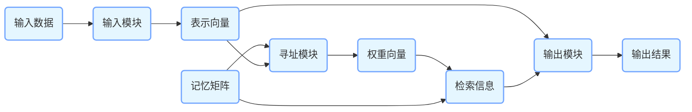

# 基于记忆网络的长期依赖推理能力提升

> 关键词：记忆网络、长期依赖、推理能力、深度学习、知识表示

> 摘要：本文聚焦于基于记忆网络提升长期依赖推理能力这一核心主题。首先介绍了相关背景，包括研究目的、预期读者等内容。详细阐述了记忆网络的核心概念、原理及架构，通过 Mermaid 流程图进行直观展示。深入分析了核心算法原理，用 Python 代码详细说明具体操作步骤。给出了相关数学模型和公式，并结合实例讲解。通过项目实战，搭建开发环境，实现源代码并进行解读分析。探讨了记忆网络在不同实际场景中的应用，推荐了学习资源、开发工具框架以及相关论文著作。最后总结了未来发展趋势与挑战，解答了常见问题并提供扩展阅读与参考资料，旨在为相关领域的研究和实践提供全面而深入的指导。

## 1. 背景介绍 
### 1.1 目的和范围
在自然语言处理、时间序列分析等诸多领域，长期依赖推理能力是一个关键挑战。传统的神经网络模型，如循环神经网络（RNN），在处理长序列时会遇到梯度消失或梯度爆炸的问题，导致难以捕捉序列中的长期依赖关系。记忆网络的提出为解决这一问题提供了新的思路。本文章的目的在于深入探讨基于记忆网络如何有效提升长期依赖推理能力，研究范围涵盖记忆网络的基本概念、核心算法、数学模型、实际应用等多个方面，旨在为相关领域的研究人员和开发者提供全面且深入的技术指导。

### 1.2 预期读者
本文预期读者包括对深度学习、自然语言处理、时间序列分析等领域感兴趣的研究人员、高校学生，以及从事相关技术开发的工程师。无论您是刚刚接触深度学习领域，希望了解记忆网络基本原理的初学者，还是已经具备一定经验，想要深入研究基于记忆网络提升长期依赖推理能力的专业人士，都能从本文中获得有价值的信息。

### 1.3 文档结构概述
本文将按照以下结构进行组织：首先介绍核心概念与联系，包括记忆网络的原理和架构，并通过 Mermaid 流程图进行直观展示；接着详细讲解核心算法原理和具体操作步骤，使用 Python 代码进行阐述；然后给出相关数学模型和公式，并结合具体例子进行说明；之后通过项目实战，包括开发环境搭建、源代码实现和解读分析，让读者更深入地理解记忆网络的应用；再探讨记忆网络在实际场景中的应用；推荐学习资源、开发工具框架和相关论文著作；最后总结未来发展趋势与挑战，解答常见问题并提供扩展阅读与参考资料。

### 1.4 术语表
#### 1.4.1 核心术语定义
- **记忆网络（Memory Network）**：是一种具有外部记忆组件的神经网络架构，能够存储和检索信息，以帮助模型处理长期依赖关系。
- **长期依赖（Long-Term Dependencies）**：指在序列数据中，相隔较远的元素之间存在的依赖关系，传统神经网络难以有效捕捉这种关系。
- **推理能力（Reasoning Ability）**：模型根据输入信息进行逻辑推断和得出结论的能力。

#### 1.4.2 相关概念解释
- **外部记忆（External Memory）**：记忆网络中的外部存储单元，用于存储历史信息，以便模型在需要时进行检索和利用。
- **注意力机制（Attention Mechanism）**：一种能够动态地分配权重到不同信息部分的机制，在记忆网络中用于聚焦于相关的记忆信息。

#### 1.4.3 缩略词列表
- **RNN（Recurrent Neural Network）**：循环神经网络
- **LSTM（Long Short-Term Memory）**：长短期记忆网络
- **GRU（Gated Recurrent Unit）**：门控循环单元

## 2. 核心概念与联系 

### 记忆网络原理
记忆网络的核心思想是引入外部记忆组件，使得模型能够存储和检索历史信息，从而更好地处理长期依赖关系。传统的神经网络在处理长序列时，随着序列长度的增加，模型的性能会逐渐下降，因为它们难以记住较早的信息。而记忆网络通过将信息存储在外部记忆中，并在需要时进行检索，有效地解决了这一问题。

### 记忆网络架构
记忆网络通常由以下几个部分组成：
1. **输入模块（Input Module）**：负责将输入数据转换为适合模型处理的表示形式。
2. **记忆模块（Memory Module）**：存储历史信息，通常表示为一个记忆矩阵。
3. **寻址模块（Addressing Module）**：根据输入信息计算记忆矩阵中每个记忆单元的权重，以确定哪些记忆信息是相关的。
4. **输出模块（Output Module）**：根据寻址模块得到的权重，从记忆矩阵中检索相关信息，并结合输入信息生成输出。

### 文本示意图
```plaintext
输入数据 -> 输入模块 -> 表示向量
                     |
                     v
表示向量 + 记忆矩阵 -> 寻址模块 -> 权重向量
                     |
                     v
权重向量 * 记忆矩阵 -> 检索信息
                     |
                     v
检索信息 + 表示向量 -> 输出模块 -> 输出结果
```

### Mermaid 流程图


## 3. 核心算法原理 & 具体操作步骤 

### 算法原理
记忆网络的核心算法主要包括寻址和检索两个步骤。寻址步骤根据输入信息计算记忆矩阵中每个记忆单元的权重，通常使用注意力机制来实现。检索步骤根据计算得到的权重，从记忆矩阵中检索相关信息。

### Python 代码实现

```python
import numpy as np

# 定义输入模块
def input_module(input_data):
    # 简单示例：将输入数据转换为向量表示
    return np.array(input_data).reshape(-1, 1)

# 定义记忆模块
class MemoryModule:
    def __init__(self, memory_size, embedding_dim):
        # 初始化记忆矩阵
        self.memory = np.random.randn(memory_size, embedding_dim)

    def get_memory(self):
        return self.memory

# 定义寻址模块
def addressing_module(input_vector, memory_matrix):
    # 计算输入向量与记忆矩阵中每个记忆单元的相似度
    similarities = np.dot(memory_matrix, input_vector).flatten()
    # 使用 softmax 函数计算权重
    weights = np.exp(similarities) / np.sum(np.exp(similarities))
    return weights

# 定义输出模块
def output_module(input_vector, retrieved_info):
    # 简单示例：将输入向量和检索信息拼接并返回
    return np.concatenate([input_vector.flatten(), retrieved_info.flatten()])

# 主函数
def memory_network(input_data, memory_size, embedding_dim):
    # 输入模块处理
    input_vector = input_module(input_data)
    # 初始化记忆模块
    memory_module = MemoryModule(memory_size, embedding_dim)
    memory_matrix = memory_module.get_memory()
    # 寻址模块计算权重
    weights = addressing_module(input_vector, memory_matrix)
    # 检索相关信息
    retrieved_info = np.dot(weights, memory_matrix)
    # 输出模块生成输出结果
    output = output_module(input_vector, retrieved_info)
    return output

# 示例输入
input_data = [1, 2, 3]
memory_size = 5
embedding_dim = 10

# 运行记忆网络
output = memory_network(input_data, memory_size, embedding_dim)
print("输出结果:", output)
```

### 代码解释
1. **输入模块**：将输入数据转换为向量表示，这里简单地将输入数据转换为一维向量。
2. **记忆模块**：初始化一个记忆矩阵，用于存储历史信息。
3. **寻址模块**：计算输入向量与记忆矩阵中每个记忆单元的相似度，并使用 softmax 函数将相似度转换为权重。
4. **输出模块**：将输入向量和检索信息拼接并返回。
5. **主函数**：依次调用输入模块、记忆模块、寻址模块和输出模块，生成最终的输出结果。

## 4. 数学模型和公式 & 详细讲解 & 举例说明 

### 数学模型
记忆网络的数学模型主要涉及寻址和检索两个过程。

#### 寻址过程
设输入向量为 $\mathbf{x} \in \mathbb{R}^d$，记忆矩阵为 $\mathbf{M} \in \mathbb{R}^{N \times d}$，其中 $N$ 是记忆单元的数量，$d$ 是向量的维度。则输入向量与第 $i$ 个记忆单元的相似度可以表示为：
$$
s_i = \mathbf{M}_i^T \mathbf{x}
$$
其中 $\mathbf{M}_i$ 是记忆矩阵 $\mathbf{M}$ 的第 $i$ 行。

使用 softmax 函数将相似度转换为权重：
$$
w_i = \frac{\exp(s_i)}{\sum_{j=1}^{N} \exp(s_j)}
$$

#### 检索过程
根据计算得到的权重，从记忆矩阵中检索相关信息：
$$
\mathbf{r} = \sum_{i=1}^{N} w_i \mathbf{M}_i
$$

### 详细讲解
寻址过程的目的是确定哪些记忆单元与输入信息相关，通过计算相似度和使用 softmax 函数得到每个记忆单元的权重。检索过程则根据这些权重，从记忆矩阵中提取相关信息。

### 举例说明
假设输入向量 $\mathbf{x} = [1, 2]^T$，记忆矩阵为：
$$
\mathbf{M} = \begin{bmatrix}
1 & 0 \\
0 & 1 \\
1 & 1
\end{bmatrix}
$$

首先计算相似度：
$$
s_1 = \mathbf{M}_1^T \mathbf{x} = [1, 0] \begin{bmatrix}
1 \\
2
\end{bmatrix} = 1
$$
$$
s_2 = \mathbf{M}_2^T \mathbf{x} = [0, 1] \begin{bmatrix}
1 \\
2
\end{bmatrix} = 2
$$
$$
s_3 = \mathbf{M}_3^T \mathbf{x} = [1, 1] \begin{bmatrix}
1 \\
2
\end{bmatrix} = 3
$$

然后计算权重：
$$
w_1 = \frac{\exp(1)}{\exp(1) + \exp(2) + \exp(3)} \approx 0.09
$$
$$
w_2 = \frac{\exp(2)}{\exp(1) + \exp(2) + \exp(3)} \approx 0.24
$$
$$
w_3 = \frac{\exp(3)}{\exp(1) + \exp(2) + \exp(3)} \approx 0.67
$$

最后检索相关信息：
$$
\mathbf{r} = w_1 \mathbf{M}_1 + w_2 \mathbf{M}_2 + w_3 \mathbf{M}_3 \approx 0.09 \begin{bmatrix}
1 \\
0
\end{bmatrix} + 0.24 \begin{bmatrix}
0 \\
1
\end{bmatrix} + 0.67 \begin{bmatrix}
1 \\
1
\end{bmatrix} = \begin{bmatrix}
0.76 \\
0.91
\end{bmatrix}
$$

## 5. 项目实战：代码实际案例和详细解释说明 

### 5.1  开发环境搭建
为了实现基于记忆网络的长期依赖推理项目，我们需要搭建相应的开发环境。以下是具体步骤：

#### 安装 Python
首先，确保你已经安装了 Python 3.x 版本。你可以从 Python 官方网站（https://www.python.org/downloads/）下载并安装适合你操作系统的版本。

#### 安装必要的库
我们需要安装一些常用的 Python 库，包括 NumPy、TensorFlow 或 PyTorch 等。可以使用以下命令进行安装：
```sh
pip install numpy tensorflow
```
或者如果你选择使用 PyTorch：
```sh
pip install numpy torch torchvision
```

### 5.2  源代码详细实现和代码解读

#### 数据准备
我们以一个简单的时间序列预测任务为例，使用一个包含历史数据的序列作为输入，预测未来的数值。以下是数据准备的代码：
```python
import numpy as np

# 生成示例时间序列数据
def generate_time_series(n_steps):
    time = np.linspace(0, 2 * np.pi, n_steps)
    series = np.sin(time) + np.random.normal(0, 0.1, n_steps)
    return series

# 划分训练集和测试集
n_steps = 100
series = generate_time_series(n_steps)
train_size = int(0.8 * n_steps)
train_series = series[:train_size]
test_series = series[train_size:]

# 准备输入和目标数据
def prepare_data(series, window_size):
    inputs = []
    targets = []
    for i in range(len(series) - window_size):
        inputs.append(series[i:i+window_size])
        targets.append(series[i+window_size])
    return np.array(inputs), np.array(targets)

window_size = 10
train_inputs, train_targets = prepare_data(train_series, window_size)
test_inputs, test_targets = prepare_data(test_series, window_size)
```

#### 记忆网络模型实现
使用 TensorFlow 实现一个简单的记忆网络模型：
```python
import tensorflow as tf
from tensorflow.keras.layers import Input, Dense
from tensorflow.keras.models import Model

# 定义记忆网络模型
def memory_network_model(input_shape, memory_size, embedding_dim):
    inputs = Input(shape=input_shape)
    # 输入模块
    input_vector = Dense(embedding_dim, activation='relu')(inputs)
    # 记忆模块
    memory = tf.Variable(tf.random.normal([memory_size, embedding_dim]))
    # 寻址模块
    similarities = tf.matmul(input_vector, memory, transpose_b=True)
    weights = tf.nn.softmax(similarities)
    # 检索模块
    retrieved_info = tf.matmul(weights, memory)
    # 输出模块
    combined = tf.concat([input_vector, retrieved_info], axis=-1)
    outputs = Dense(1)(combined)
    model = Model(inputs=inputs, outputs=outputs)
    return model

# 初始化模型
input_shape = (window_size,)
memory_size = 20
embedding_dim = 16
model = memory_network_model(input_shape, memory_size, embedding_dim)

# 编译模型
model.compile(optimizer='adam', loss='mse')

# 训练模型
model.fit(train_inputs, train_targets, epochs=50, batch_size=32)
```

#### 模型评估
使用测试集对模型进行评估：
```python
# 模型评估
test_loss = model.evaluate(test_inputs, test_targets)
print("测试集损失:", test_loss)
```

### 5.3  代码解读与分析
#### 数据准备部分
- `generate_time_series` 函数用于生成一个简单的时间序列数据，这里使用正弦函数并添加了一些噪声。
- `prepare_data` 函数将时间序列数据划分为输入和目标数据，每个输入是一个长度为 `window_size` 的序列，目标是该序列的下一个值。

#### 记忆网络模型实现部分
- `memory_network_model` 函数定义了一个简单的记忆网络模型，包括输入模块、记忆模块、寻址模块、检索模块和输出模块。
- 输入模块使用一个全连接层将输入数据转换为向量表示。
- 记忆模块使用一个可训练的变量表示记忆矩阵。
- 寻址模块计算输入向量与记忆矩阵中每个记忆单元的相似度，并使用 softmax 函数得到权重。
- 检索模块根据权重从记忆矩阵中检索相关信息。
- 输出模块将输入向量和检索信息拼接，并通过一个全连接层生成输出。

#### 模型评估部分
使用测试集对模型进行评估，计算测试集上的损失值，以评估模型的性能。

## 6. 实际应用场景 
### 自然语言处理
在自然语言处理领域，记忆网络可以用于处理长文本的理解和生成任务。例如，在机器翻译中，记忆网络可以存储源语言句子中的重要信息，以便在生成目标语言句子时更好地捕捉长距离的依赖关系。在问答系统中，记忆网络可以存储问题和相关的上下文信息，帮助模型更准确地回答问题。

### 时间序列分析
在时间序列分析中，记忆网络可以用于预测未来的数值。例如，在股票价格预测、气象预报等任务中，记忆网络可以存储历史数据中的重要信息，从而更好地预测未来的趋势。

### 图像识别
在图像识别领域，记忆网络可以用于处理具有长距离依赖关系的图像信息。例如，在图像描述生成任务中，记忆网络可以存储图像中的不同部分的信息，以便生成更准确的描述。

## 7. 工具和资源推荐
### 7.1 学习资源推荐
#### 7.1.1 书籍推荐
- 《深度学习》（Deep Learning）：由 Ian Goodfellow、Yoshua Bengio 和 Aaron Courville 所著，是深度学习领域的经典教材，涵盖了神经网络、深度学习模型等多个方面的内容。
- 《神经网络与深度学习》：由邱锡鹏所著，全面介绍了神经网络和深度学习的基本原理、算法和应用。

#### 7.1.2 在线课程
- Coursera 上的“深度学习专项课程”（Deep Learning Specialization）：由 Andrew Ng 教授授课，包括神经网络基础、卷积神经网络、循环神经网络等多个课程，适合初学者和有一定基础的学习者。
- edX 上的“MIT 6.S191：深度学习基础”（Introduction to Deep Learning）：由 MIT 开设的课程，介绍了深度学习的基本概念、算法和应用。

#### 7.1.3 技术博客和网站
- Medium 上的 Towards Data Science：一个专注于数据科学和机器学习的博客平台，有很多关于深度学习和记忆网络的优秀文章。
- arXiv：一个预印本数据库，提供了大量关于深度学习和人工智能的最新研究论文。

### 7.2 开发工具框架推荐
#### 7.2.1 IDE和编辑器
- PyCharm：一款专业的 Python 集成开发环境，提供了丰富的代码编辑、调试和项目管理功能。
- Jupyter Notebook：一个交互式的开发环境，适合进行数据分析和模型实验，支持 Python、R 等多种编程语言。

#### 7.2.2 调试和性能分析工具
- TensorBoard：TensorFlow 提供的可视化工具，可以用于监控模型的训练过程、查看模型的结构和性能指标。
- PyTorch Profiler：PyTorch 提供的性能分析工具，可以帮助开发者找出模型中的性能瓶颈。

#### 7.2.3 相关框架和库
- TensorFlow：一个开源的深度学习框架，提供了丰富的工具和库，支持各种深度学习模型的开发和训练。
- PyTorch：另一个流行的深度学习框架，具有动态图的特点，适合快速开发和实验。

### 7.3 相关论文著作推荐
#### 7.3.1 经典论文
- "Memory Networks"（2014）：由 Jason Weston、Sumit Chopra 和 Antoine Bordes 发表的论文，首次提出了记忆网络的概念。
- "End-To-End Memory Networks"（2015）：由 Sainbayar Sukhbaatar、Arthur Szlam、Jason Weston 和 Rob Fergus 发表的论文，提出了端到端的记忆网络模型。

#### 7.3.2 最新研究成果
- 可以通过 arXiv、ACM Digital Library 等数据库搜索关于记忆网络和长期依赖推理的最新研究论文。

#### 7.3.3 应用案例分析
- 可以参考一些实际应用案例的论文，了解记忆网络在不同领域的具体应用和效果。

## 8. 总结：未来发展趋势与挑战
### 未来发展趋势
- **模型结构优化**：未来的研究可能会致力于设计更高效、更强大的记忆网络模型结构，以进一步提升长期依赖推理能力。例如，引入更复杂的注意力机制、门控机制等。
- **多模态融合**：将记忆网络应用于多模态数据处理，如结合图像、文本和语音等信息，实现更全面的理解和推理。
- **强化学习结合**：将记忆网络与强化学习相结合，用于解决更复杂的决策问题，如机器人导航、游戏智能等。

### 挑战
- **计算资源需求**：记忆网络通常需要大量的计算资源和内存来存储和处理记忆信息，这对于大规模应用来说是一个挑战。
- **数据质量和标注**：记忆网络的性能很大程度上依赖于数据的质量和标注的准确性，如何获取高质量的数据和有效的标注是一个难题。
- **可解释性**：记忆网络的决策过程往往比较复杂，缺乏可解释性，这在一些对解释性要求较高的领域，如医疗、金融等，是一个需要解决的问题。

## 9. 附录：常见问题与解答
### 问题 1：记忆网络和传统的循环神经网络有什么区别？
答：传统的循环神经网络（RNN）在处理长序列时会遇到梯度消失或梯度爆炸的问题，导致难以捕捉序列中的长期依赖关系。而记忆网络引入了外部记忆组件，能够存储和检索历史信息，从而更好地处理长期依赖关系。

### 问题 2：如何选择记忆矩阵的大小和维度？
答：记忆矩阵的大小和维度通常需要根据具体的任务和数据集进行调整。一般来说，可以通过实验来确定最佳的参数值。较大的记忆矩阵可以存储更多的信息，但也会增加计算成本和内存需求。

### 问题 3：记忆网络在实际应用中容易出现过拟合吗？
答：记忆网络在实际应用中可能会出现过拟合的问题，特别是当训练数据较少或模型复杂度较高时。可以通过增加训练数据、使用正则化方法（如 L1 和 L2 正则化）、提前停止训练等方法来缓解过拟合问题。

## 10. 扩展阅读 & 参考资料
### 扩展阅读
- 可以阅读一些关于深度学习和人工智能的前沿研究论文，了解最新的技术发展趋势。
- 参加相关的学术会议和研讨会，与领域内的专家和学者进行交流和学习。

### 参考资料
- Weston, J., Chopra, S., & Bordes, A. (2014). Memory Networks. arXiv preprint arXiv:1410.3916.
- Sukhbaatar, S., Szlam, A., Weston, J., & Fergus, R. (2015). End-To-End Memory Networks. In Advances in neural information processing systems (pp. 2440-2448).

作者：AI天才研究院/AI Genius Institute & 禅与计算机程序设计艺术 /Zen And The Art of Computer Programming