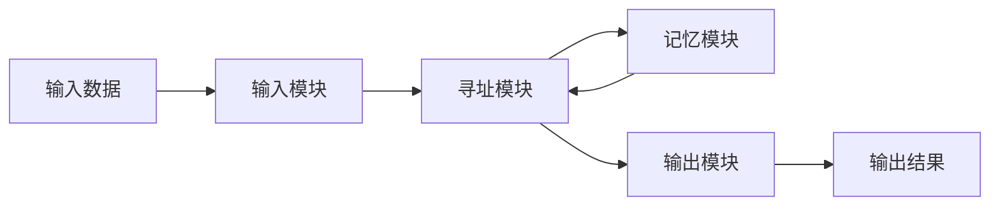

# 基于记忆网络的长期战略规划与推理能力提升

> 关键词：记忆网络、长期战略规划、推理能力提升、人工智能、深度学习

> 摘要：本文围绕基于记忆网络的长期战略规划与推理能力提升展开深入探讨。首先介绍了相关背景，包括研究目的、预期读者等。接着阐述了记忆网络等核心概念及其联系，详细讲解了核心算法原理与操作步骤，给出了相应的数学模型和公式。通过项目实战展示了如何运用记忆网络进行长期战略规划和推理能力提升的代码实现。同时，分析了实际应用场景，推荐了学习资源、开发工具框架以及相关论文著作。最后总结了未来发展趋势与挑战，并提供了常见问题解答和扩展阅读参考资料，旨在为读者全面深入地理解和应用基于记忆网络的长期战略规划与推理能力提升技术提供指导。

## 1. 背景介绍 
### 1.1 目的和范围
在当今复杂多变的环境中，无论是商业决策、智能机器人行动规划还是游戏策略制定等领域，都需要具备长期战略规划和强大的推理能力。传统的人工智能模型在处理长期依赖和复杂推理任务时存在一定的局限性。记忆网络作为一种新兴的深度学习技术，为解决这些问题提供了新的思路。本文章的目的在于深入探讨如何利用记忆网络提升长期战略规划和推理能力，范围涵盖记忆网络的基本原理、算法实现、实际应用以及未来发展等方面。

### 1.2 预期读者
本文预期读者包括人工智能领域的研究人员、开发者、学生，以及对智能决策和推理技术感兴趣的专业人士。对于想要深入了解记忆网络在长期战略规划和推理能力提升方面应用的读者，本文将提供系统的知识和实践指导。

### 1.3 文档结构概述
本文将按照以下结构展开：首先介绍相关背景信息，包括目的、读者和文档结构等；接着阐述记忆网络等核心概念及其联系；详细讲解核心算法原理与具体操作步骤；给出数学模型和公式并举例说明；通过项目实战展示代码实现和详细解释；分析实际应用场景；推荐学习资源、开发工具框架和相关论文著作；总结未来发展趋势与挑战；提供常见问题解答和扩展阅读参考资料。

### 1.4 术语表
#### 1.4.1 核心术语定义
- **记忆网络（Memory Network）**：一种具有外部记忆组件的神经网络模型，能够存储和检索信息，以处理长期依赖和复杂推理任务。
- **长期战略规划（Long - term Strategic Planning）**：在一定的目标和约束条件下，对未来较长时间内的行动方案进行系统性的设计和安排。
- **推理能力（Reasoning Ability）**：根据已知信息和规则，推导出新的结论或做出合理决策的能力。

#### 1.4.2 相关概念解释
- **外部记忆**：与传统神经网络的内部状态不同，外部记忆是一个独立的存储结构，可以显式地存储和读取信息，有助于处理长序列数据和复杂任务。
- **注意力机制（Attention Mechanism）**：在记忆网络中，注意力机制用于确定从外部记忆中读取哪些信息，使得模型能够聚焦于关键信息。

#### 1.4.3 缩略词列表
- **RNN（Recurrent Neural Network）**：循环神经网络
- **LSTM（Long Short - Term Memory）**：长短期记忆网络
- **GRU（Gated Recurrent Unit）**：门控循环单元

## 2. 核心概念与联系 

### 2.1 记忆网络的原理
记忆网络的核心思想是引入外部记忆组件，使得模型能够存储和检索信息，从而处理长期依赖问题。传统的神经网络，如RNN、LSTM和GRU，虽然在一定程度上能够处理序列数据，但在处理长序列时仍然存在信息丢失的问题。记忆网络通过将信息存储在外部记忆中，避免了这种信息丢失。

记忆网络通常由以下几个部分组成：
- **输入模块（Input Module）**：将输入数据进行编码，转换为适合模型处理的表示形式。
- **记忆模块（Memory Module）**：存储历史信息，通常是一个矩阵或张量。
- **寻址模块（Addressing Module）**：根据输入和当前状态，确定从记忆模块中读取哪些信息。
- **输出模块（Output Module）**：根据读取的信息和输入，生成输出结果。

### 2.2 记忆网络与长期战略规划的联系
长期战略规划需要考虑多个时间步的信息和决策，这就要求模型能够处理长期依赖。记忆网络的外部记忆组件可以存储历史决策和环境信息，使得模型在制定战略规划时能够参考过去的经验。例如，在商业战略规划中，记忆网络可以存储过去的市场数据、销售记录等信息，帮助企业制定未来的发展战略。

### 2.3 记忆网络与推理能力提升的联系
推理能力的提升需要模型能够根据已知信息推导出新的结论。记忆网络通过存储和检索信息，能够为推理提供更多的依据。例如，在知识问答系统中，记忆网络可以存储大量的知识信息，当用户提出问题时，模型可以从记忆中检索相关信息，并进行推理得出答案。

### 2.4 核心概念架构的文本示意图
```plaintext
输入数据 -> 输入模块 -> 寻址模块 -> 记忆模块（存储和读取信息） -> 输出模块 -> 输出结果
```

### 2.5 Mermaid 流程图


## 3. 核心算法原理 & 具体操作步骤 

### 3.1 记忆网络的核心算法原理
记忆网络的核心算法主要包括信息存储和信息检索两个过程。

#### 信息存储
输入数据经过输入模块编码后，会被存储到记忆模块中。假设输入数据为 $x$，输入模块的编码函数为 $f_{in}(x)$，记忆模块的存储函数为 $g_{store}$，则存储到记忆模块中的信息 $m$ 可以表示为：
$m = g_{store}(f_{in}(x))$

#### 信息检索
寻址模块根据输入和当前状态，从记忆模块中检索相关信息。假设寻址模块的寻址函数为 $f_{addr}(x, s)$，其中 $x$ 为输入，$s$ 为当前状态，则检索到的信息 $m_{ret}$ 可以表示为：
$m_{ret} = f_{addr}(x, s) \cdot M$
其中 $M$ 为记忆模块中的存储矩阵。

#### 输出生成
输出模块根据检索到的信息和输入，生成输出结果。假设输出模块的生成函数为 $f_{out}(x, m_{ret})$，则输出结果 $y$ 可以表示为：
$y = f_{out}(x, m_{ret})$

### 3.2 具体操作步骤

#### 步骤 1：初始化记忆模块
在开始训练之前，需要初始化记忆模块。通常可以将记忆模块初始化为一个随机矩阵或零矩阵。

```python
import numpy as np

# 初始化记忆模块
memory_size = 100
embedding_size = 50
memory = np.random.randn(memory_size, embedding_size)
```

#### 步骤 2：输入模块编码
将输入数据进行编码，转换为适合模型处理的表示形式。可以使用神经网络（如全连接层）进行编码。

```python
import torch
import torch.nn as nn

# 定义输入模块
class InputModule(nn.Module):
    def __init__(self, input_size, embedding_size):
        super(InputModule, self).__init__()
        self.fc = nn.Linear(input_size, embedding_size)

    def forward(self, x):
        return self.fc(x)

# 示例输入
input_size = 20
input_data = torch.randn(1, input_size)

# 初始化输入模块
input_module = InputModule(input_size, embedding_size)
encoded_input = input_module(input_data)
```

#### 步骤 3：寻址模块检索信息
根据输入和当前状态，从记忆模块中检索相关信息。可以使用注意力机制来实现寻址。

```python
# 定义寻址模块
class AddressingModule(nn.Module):
    def __init__(self, embedding_size):
        super(AddressingModule, self).__init__()
        self.fc = nn.Linear(embedding_size, 1)

    def forward(self, x, memory):
        attention_scores = self.fc(memory)
        attention_weights = torch.softmax(attention_scores, dim=0)
        retrieved_info = torch.sum(attention_weights * memory, dim=0)
        return retrieved_info

# 初始化寻址模块
addressing_module = AddressingModule(embedding_size)
retrieved_info = addressing_module(encoded_input, torch.tensor(memory, dtype=torch.float32))
```

#### 步骤 4：输出模块生成输出
根据检索到的信息和输入，生成输出结果。可以使用神经网络（如全连接层）进行输出生成。

```python
# 定义输出模块
class OutputModule(nn.Module):
    def __init__(self, embedding_size, output_size):
        super(OutputModule, self).__init__()
        self.fc = nn.Linear(embedding_size * 2, output_size)

    def forward(self, x, retrieved_info):
        combined_input = torch.cat([x, retrieved_info.unsqueeze(0)], dim=1)
        return self.fc(combined_input)

# 示例输出大小
output_size = 10

# 初始化输出模块
output_module = OutputModule(embedding_size, output_size)
output = output_module(encoded_input, retrieved_info)
```

## 4. 数学模型和公式 & 详细讲解 & 举例说明 

### 4.1 输入模块的数学模型
输入模块的作用是将输入数据 $x$ 编码为嵌入向量 $e$。假设输入数据的维度为 $d_{in}$，嵌入向量的维度为 $d_{emb}$，输入模块可以表示为一个线性变换：
$e = W_{in}x + b_{in}$
其中 $W_{in} \in \mathbb{R}^{d_{emb} \times d_{in}}$ 是权重矩阵，$b_{in} \in \mathbb{R}^{d_{emb}}$ 是偏置向量。

### 4.2 寻址模块的数学模型
寻址模块使用注意力机制来确定从记忆模块中读取哪些信息。假设记忆模块中的存储矩阵为 $M \in \mathbb{R}^{N \times d_{emb}}$，其中 $N$ 是记忆单元的数量，输入的嵌入向量为 $e$，寻址模块的注意力分数可以表示为：
$a_i = f_{att}(e, M_i)$
其中 $M_i$ 是记忆矩阵 $M$ 的第 $i$ 行，$f_{att}$ 是注意力函数，通常可以使用点积、双线性变换等。注意力权重可以通过 softmax 函数计算：
$w_i = \frac{\exp(a_i)}{\sum_{j=1}^{N} \exp(a_j)}$
检索到的信息可以表示为：
$m_{ret} = \sum_{i=1}^{N} w_i M_i$

### 4.3 输出模块的数学模型
输出模块根据检索到的信息 $m_{ret}$ 和输入的嵌入向量 $e$ 生成输出结果 $y$。假设输出的维度为 $d_{out}$，输出模块可以表示为一个线性变换：
$y = W_{out}[e; m_{ret}] + b_{out}$
其中 $[e; m_{ret}]$ 表示将 $e$ 和 $m_{ret}$ 拼接在一起，$W_{out} \in \mathbb{R}^{d_{out} \times (2d_{emb})}$ 是权重矩阵，$b_{out} \in \mathbb{R}^{d_{out}}$ 是偏置向量。

### 4.4 举例说明
假设输入数据 $x = [1, 2, 3]$，输入维度 $d_{in} = 3$，嵌入维度 $d_{emb} = 2$，则输入模块的权重矩阵 $W_{in} = \begin{bmatrix} 0.1 & 0.2 & 0.3 \\ 0.4 & 0.5 & 0.6 \end{bmatrix}$，偏置向量 $b_{in} = [0.1, 0.2]$。

编码后的嵌入向量 $e$ 为：
$e = W_{in}x + b_{in} = \begin{bmatrix} 0.1 & 0.2 & 0.3 \\ 0.4 & 0.5 & 0.6 \end{bmatrix} \begin{bmatrix} 1 \\ 2 \\ 3 \end{bmatrix} + \begin{bmatrix} 0.1 \\ 0.2 \end{bmatrix} = \begin{bmatrix} 0.1\times1 + 0.2\times2 + 0.3\times3 + 0.1 \\ 0.4\times1 + 0.5\times2 + 0.6\times3 + 0.2 \end{bmatrix} = \begin{bmatrix} 1.5 \\ 3.4 \end{bmatrix}$

假设记忆模块中的存储矩阵 $M = \begin{bmatrix} 0.1 & 0.2 \\ 0.3 & 0.4 \\ 0.5 & 0.6 \end{bmatrix}$，注意力函数 $f_{att}(e, M_i) = e^T M_i$，则注意力分数为：
$a_1 = e^T M_1 = \begin{bmatrix} 1.5 & 3.4 \end{bmatrix} \begin{bmatrix} 0.1 \\ 0.2 \end{bmatrix} = 1.5\times0.1 + 3.4\times0.2 = 0.83$
$a_2 = e^T M_2 = \begin{bmatrix} 1.5 & 3.4 \end{bmatrix} \begin{bmatrix} 0.3 \\ 0.4 \end{bmatrix} = 1.5\times0.3 + 3.4\times0.4 = 1.81$
$a_3 = e^T M_3 = \begin{bmatrix} 1.5 & 3.4 \end{bmatrix} \begin{bmatrix} 0.5 \\ 0.6 \end{bmatrix} = 1.5\times0.5 + 3.4\times0.6 = 2.89$

注意力权重为：
$w_1 = \frac{\exp(0.83)}{\exp(0.83) + \exp(1.81) + \exp(2.89)} \approx 0.05$
$w_2 = \frac{\exp(1.81)}{\exp(0.83) + \exp(1.81) + \exp(2.89)} \approx 0.21$
$w_3 = \frac{\exp(2.89)}{\exp(0.83) + \exp(1.81) + \exp(2.89)} \approx 0.74$

检索到的信息 $m_{ret}$ 为：
$m_{ret} = w_1 M_1 + w_2 M_2 + w_3 M_3 = 0.05\begin{bmatrix} 0.1 \\ 0.2 \end{bmatrix} + 0.21\begin{bmatrix} 0.3 \\ 0.4 \end{bmatrix} + 0.74\begin{bmatrix} 0.5 \\ 0.6 \end{bmatrix} \approx \begin{bmatrix} 0.44 \\ 0.56 \end{bmatrix}$

假设输出维度 $d_{out} = 1$，输出模块的权重矩阵 $W_{out} = \begin{bmatrix} 0.1 & 0.2 & 0.3 & 0.4 \end{bmatrix}$，偏置向量 $b_{out} = [0.1]$，则输出结果 $y$ 为：
$y = W_{out}[e; m_{ret}] + b_{out} = \begin{bmatrix} 0.1 & 0.2 & 0.3 & 0.4 \end{bmatrix} \begin{bmatrix} 1.5 \\ 3.4 \\ 0.44 \\ 0.56 \end{bmatrix} + 0.1 = 0.1\times1.5 + 0.2\times3.4 + 0.3\times0.44 + 0.4\times0.56 + 0.1 \approx 1.13$

## 5. 项目实战：代码实际案例和详细解释说明 

### 5.1  开发环境搭建
#### 安装 Python
首先需要安装 Python 环境，建议使用 Python 3.7 及以上版本。可以从 Python 官方网站（https://www.python.org/downloads/）下载并安装。

#### 安装深度学习框架
本文使用 PyTorch 作为深度学习框架，可以使用以下命令进行安装：
```sh
pip install torch torchvision
```

#### 安装其他依赖库
还需要安装一些其他的依赖库，如 NumPy、Matplotlib 等，可以使用以下命令进行安装：
```sh
pip install numpy matplotlib
```

### 5.2  源代码详细实现和代码解读

#### 完整代码示例
```python
import torch
import torch.nn as nn
import numpy as np

# 定义输入模块
class InputModule(nn.Module):
    def __init__(self, input_size, embedding_size):
        super(InputModule, self).__init__()
        self.fc = nn.Linear(input_size, embedding_size)

    def forward(self, x):
        return self.fc(x)

# 定义寻址模块
class AddressingModule(nn.Module):
    def __init__(self, embedding_size):
        super(AddressingModule, self).__init__()
        self.fc = nn.Linear(embedding_size, 1)

    def forward(self, x, memory):
        attention_scores = self.fc(memory)
        attention_weights = torch.softmax(attention_scores, dim=0)
        retrieved_info = torch.sum(attention_weights * memory, dim=0)
        return retrieved_info

# 定义输出模块
class OutputModule(nn.Module):
    def __init__(self, embedding_size, output_size):
        super(OutputModule, self).__init__()
        self.fc = nn.Linear(embedding_size * 2, output_size)

    def forward(self, x, retrieved_info):
        combined_input = torch.cat([x, retrieved_info.unsqueeze(0)], dim=1)
        return self.fc(combined_input)

# 定义记忆网络模型
class MemoryNetwork(nn.Module):
    def __init__(self, input_size, embedding_size, memory_size, output_size):
        super(MemoryNetwork, self).__init__()
        self.input_module = InputModule(input_size, embedding_size)
        self.addressing_module = AddressingModule(embedding_size)
        self.output_module = OutputModule(embedding_size, output_size)
        self.memory = nn.Parameter(torch.randn(memory_size, embedding_size))

    def forward(self, x):
        encoded_input = self.input_module(x)
        retrieved_info = self.addressing_module(encoded_input, self.memory)
        output = self.output_module(encoded_input, retrieved_info)
        return output

# 示例参数
input_size = 20
embedding_size = 50
memory_size = 100
output_size = 10

# 初始化模型
model = MemoryNetwork(input_size, embedding_size, memory_size, output_size)

# 示例输入
input_data = torch.randn(1, input_size)

# 前向传播
output = model(input_data)
print("Output:", output)
```

#### 代码解读
- **输入模块（InputModule）**：将输入数据进行线性变换，转换为嵌入向量。
- **寻址模块（AddressingModule）**：使用注意力机制从记忆模块中检索相关信息。
- **输出模块（OutputModule）**：将输入的嵌入向量和检索到的信息拼接在一起，进行线性变换生成输出结果。
- **记忆网络模型（MemoryNetwork）**：整合了输入模块、寻址模块和输出模块，并包含一个可训练的记忆矩阵。

### 5.3  代码解读与分析
#### 模型训练
上述代码只是一个简单的前向传播示例，实际应用中需要进行模型训练。可以使用随机梯度下降（SGD）、Adam 等优化器，以及交叉熵损失函数、均方误差损失函数等进行训练。

```python
import torch.optim as optim

# 定义损失函数和优化器
criterion = nn.MSELoss()
optimizer = optim.Adam(model.parameters(), lr=0.001)

# 模拟训练数据
train_data = torch.randn(100, input_size)
train_labels = torch.randn(100, output_size)

# 训练模型
num_epochs = 100
for epoch in range(num_epochs):
    optimizer.zero_grad()
    outputs = model(train_data)
    loss = criterion(outputs, train_labels)
    loss.backward()
    optimizer.step()
    if (epoch + 1) % 10 == 0:
        print(f'Epoch [{epoch + 1}/{num_epochs}], Loss: {loss.item():.4f}')
```

#### 模型分析
通过训练可以观察模型的损失值变化，评估模型的性能。可以使用验证集和测试集来进一步评估模型的泛化能力。同时，可以分析注意力权重，了解模型从记忆模块中检索信息的方式。

## 6. 实际应用场景 
### 6.1 商业战略规划
在商业领域，企业需要制定长期的发展战略，考虑市场趋势、竞争对手、客户需求等多个因素。基于记忆网络的模型可以存储历史市场数据、销售记录、客户反馈等信息，帮助企业分析市场动态，制定合理的战略规划。例如，预测产品的市场需求，优化供应链管理，制定营销策略等。

### 6.2 智能机器人行动规划
智能机器人在执行任务时需要进行长期的行动规划，考虑环境变化、任务目标等因素。记忆网络可以存储机器人的历史行动记录、环境信息等，帮助机器人更好地理解环境，做出合理的决策。例如，在物流仓储中，机器人可以根据记忆中的货物位置信息，规划最优的搬运路径。

### 6.3 游戏策略制定
在游戏领域，玩家需要制定长期的战略规划来赢得游戏。基于记忆网络的模型可以学习游戏的历史数据，包括对手的策略、游戏规则等，帮助玩家制定更优的游戏策略。例如，在棋类游戏中，模型可以根据历史棋局信息，预测对手的下一步行动，从而制定自己的应对策略。

### 6.4 知识问答系统
知识问答系统需要根据用户的问题，从大量的知识信息中检索相关答案。记忆网络可以存储知识库中的知识信息，通过注意力机制快速检索相关信息，并进行推理得出答案。例如，在智能客服系统中，模型可以根据用户的问题，从记忆中检索相关的解决方案，为用户提供准确的回答。

## 7. 工具和资源推荐
### 7.1 学习资源推荐
#### 7.1.1 书籍推荐
- 《深度学习》（Deep Learning）：由 Ian Goodfellow、Yoshua Bengio 和 Aaron Courville 所著，是深度学习领域的经典教材，涵盖了神经网络、深度学习模型等方面的知识。
- 《Python 深度学习》（Deep Learning with Python）：由 Francois Chollet 所著，介绍了如何使用 Python 和 Keras 进行深度学习开发，包含了许多实际案例。

#### 7.1.2 在线课程
- Coursera 上的“深度学习专项课程”（Deep Learning Specialization）：由 Andrew Ng 教授授课，系统地介绍了深度学习的基础知识和应用。
- edX 上的“人工智能导论”（Introduction to Artificial Intelligence）：涵盖了人工智能的各个方面，包括机器学习、深度学习等。

#### 7.1.3 技术博客和网站
- Medium 上的 Towards Data Science：有许多关于深度学习、人工智能的技术文章和案例分享。
- arXiv.org：是一个预印本平台，包含了许多最新的人工智能研究论文。

### 7.2 开发工具框架推荐
#### 7.2.1 IDE和编辑器
- PyCharm：是一款专业的 Python 集成开发环境，提供了代码编辑、调试、版本控制等功能。
- Jupyter Notebook：是一个交互式的开发环境，适合进行数据分析和模型开发。

#### 7.2.2 调试和性能分析工具
- TensorBoard：是 TensorFlow 提供的可视化工具，可以用于可视化模型的训练过程、损失曲线等。
- PyTorch Profiler：可以用于分析 PyTorch 模型的性能，找出性能瓶颈。

#### 7.2.3 相关框架和库
- PyTorch：是一个开源的深度学习框架，提供了丰富的神经网络层和优化器，易于使用和扩展。
- TensorFlow：是另一个流行的深度学习框架，具有强大的分布式训练和部署能力。

### 7.3 相关论文著作推荐
#### 7.3.1 经典论文
- "Memory Networks"（Sainbayar Sukhbaatar 等人）：提出了记忆网络的基本概念和模型结构。
- "Neural Turing Machines"（Alex Graves 等人）：引入了可微分的外部记忆机制，为记忆网络的发展奠定了基础。

#### 7.3.2 最新研究成果
- 可以关注 arXiv.org 上关于记忆网络、长期战略规划和推理能力提升的最新研究论文。

#### 7.3.3 应用案例分析
- 可以在学术数据库（如 IEEE Xplore、ACM Digital Library 等）中查找关于记忆网络在不同领域应用的案例分析论文。

## 8. 总结：未来发展趋势与挑战
### 8.1 未来发展趋势
#### 多模态记忆网络
未来的记忆网络可能会结合多种模态的信息，如图像、语音、文本等，以处理更复杂的任务。例如，在智能安防系统中，记忆网络可以同时存储视频图像和语音信息，提高对异常事件的检测和识别能力。

#### 可解释性记忆网络
随着人工智能的广泛应用，模型的可解释性变得越来越重要。未来的记忆网络可能会更加注重可解释性，使得模型的决策过程更加透明。例如，通过可视化注意力权重，解释模型从记忆中检索信息的方式。

#### 强化学习与记忆网络的结合
强化学习在决策和控制领域有着广泛的应用。未来的研究可能会将强化学习与记忆网络相结合，提高智能体的长期战略规划和决策能力。例如，在自动驾驶领域，结合记忆网络和强化学习可以使车辆更好地应对复杂的交通场景。

### 8.2 挑战
#### 大规模记忆管理
随着数据量的不断增加，如何有效地管理大规模的记忆信息是一个挑战。需要研究高效的存储和检索算法，以提高模型的性能和效率。

#### 模型训练的复杂性
记忆网络的训练通常需要大量的计算资源和时间。如何优化模型的训练过程，降低训练成本，是需要解决的问题。

#### 知识更新和遗忘机制
在实际应用中，知识是不断更新的。记忆网络需要具备知识更新和遗忘机制，以保证存储的信息始终是最新和有用的。

## 9. 附录：常见问题与解答
### 9.1 记忆网络与传统神经网络有什么区别？
传统神经网络（如 RNN、LSTM、GRU）主要通过内部状态来处理序列数据，在处理长序列时容易出现信息丢失的问题。而记忆网络引入了外部记忆组件，可以显式地存储和检索信息，更好地处理长期依赖问题。

### 9.2 如何选择记忆网络的参数？
记忆网络的参数选择通常需要根据具体的任务和数据集进行调整。一般来说，可以通过实验的方法，尝试不同的参数组合，选择性能最优的参数。例如，记忆模块的大小、嵌入向量的维度等参数可以根据数据集的大小和复杂度进行调整。

### 9.3 记忆网络的训练过程中容易出现哪些问题？
记忆网络的训练过程中容易出现梯度消失、梯度爆炸等问题，导致模型无法收敛。可以使用梯度裁剪、调整学习率等方法来解决这些问题。另外，过拟合也是一个常见的问题，可以使用正则化、数据增强等方法来缓解过拟合。

## 10. 扩展阅读 & 参考资料
### 10.1 扩展阅读
- 可以阅读关于深度学习、人工智能、认知科学等领域的相关书籍和论文，深入了解记忆网络的理论基础和应用场景。
- 关注相关的学术会议和研讨会，如 NeurIPS、ICML、CVPR 等，了解最新的研究动态。

### 10.2 参考资料
- Goodfellow, I., Bengio, Y., & Courville, A. (2016). Deep Learning. MIT Press.
- Chollet, F. (2017). Deep Learning with Python. Manning Publications.
- Sukhbaatar, S., Weston, J., & Fergus, R. (2015). Memory Networks. arXiv preprint arXiv:1503.08895.
- Graves, A., Wayne, G., & Danihelka, I. (2014). Neural Turing Machines. arXiv preprint arXiv:1410.5401.

作者：AI天才研究院/AI Genius Institute & 禅与计算机程序设计艺术 /Zen And The Art of Computer Programming