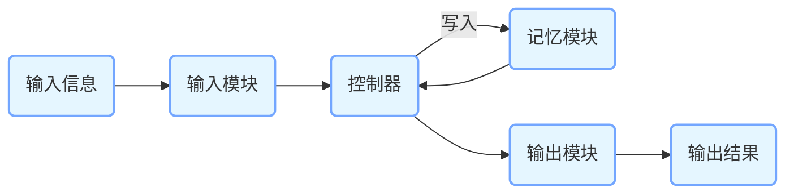

# 基于记忆网络的长程推理能力增强

> 关键词：记忆网络、长程推理、人工智能、深度学习、知识表示、注意力机制、推理算法

> 摘要：本文围绕基于记忆网络的长程推理能力增强展开深入探讨。首先介绍了研究的背景、目的和范围，明确预期读者和文档结构。接着阐述了记忆网络、长程推理等核心概念及其联系，给出原理和架构的文本示意图与 Mermaid 流程图。详细讲解了核心算法原理，并通过 Python 源代码进行说明，同时介绍了相关的数学模型和公式。通过项目实战，展示了代码实际案例并进行详细解释。分析了该技术的实际应用场景，推荐了学习资源、开发工具框架以及相关论文著作。最后总结了未来发展趋势与挑战，还提供了常见问题与解答以及扩展阅读和参考资料，旨在为提升基于记忆网络的长程推理能力提供全面而深入的技术指导。

## 1. 背景介绍 
### 1.1 目的和范围
在人工智能和深度学习领域，长程推理一直是极具挑战性的任务。传统的神经网络模型在处理长序列信息和复杂推理任务时，往往存在信息丢失、推理能力不足等问题。记忆网络的出现为解决这些问题提供了新的思路。本研究的目的在于深入探讨如何利用记忆网络来增强长程推理能力，通过理论分析、算法设计、代码实现和实际应用验证等多个方面进行研究，旨在为相关领域的研究人员和开发者提供全面而深入的技术指导。研究范围涵盖记忆网络的基本原理、长程推理的相关算法、基于记忆网络的长程推理系统的设计与实现，以及在不同实际应用场景中的应用效果分析。

### 1.2 预期读者
本文预期读者包括人工智能、深度学习领域的研究人员，他们可以从本文中获取关于记忆网络和长程推理的最新研究成果和技术思路，为其进一步的研究提供参考；计算机科学专业的学生，通过阅读本文可以深入了解记忆网络和长程推理的基本原理和实现方法，拓宽专业知识面；从事自然语言处理、知识图谱、智能机器人等领域的开发者，能够借鉴本文中的技术和代码实现，提升其系统的长程推理能力。

### 1.3 文档结构概述
本文首先介绍了研究的背景、目的和范围，明确了预期读者和文档结构。接着详细阐述了记忆网络和长程推理的核心概念及其联系，给出了原理和架构的文本示意图与 Mermaid 流程图，帮助读者建立清晰的概念模型。然后深入讲解了核心算法原理，并通过 Python 源代码进行详细说明，使读者能够理解算法的具体实现细节。同时介绍了相关的数学模型和公式，为算法的理解提供理论支持。通过项目实战，展示了代码实际案例并进行详细解释，让读者能够将理论知识应用到实际项目中。分析了该技术的实际应用场景，为读者提供实际应用的思路。推荐了学习资源、开发工具框架以及相关论文著作，方便读者进一步深入学习。最后总结了未来发展趋势与挑战，还提供了常见问题与解答以及扩展阅读和参考资料，使读者能够全面了解基于记忆网络的长程推理能力增强的相关知识。

### 1.4 术语表
#### 1.4.1 核心术语定义
- **记忆网络（Memory Network）**：是一种具有记忆组件的神经网络模型，能够存储和检索信息，用于解决需要长期记忆和推理的任务。
- **长程推理（Long - Range Reasoning）**：指在处理复杂问题时，需要考虑长距离的依赖关系和多步骤的推理过程，以得出准确的结论。
- **注意力机制（Attention Mechanism）**：一种在神经网络中用于动态分配权重的机制，能够帮助模型聚焦于输入序列中的重要部分。
- **知识表示（Knowledge Representation）**：将知识以计算机能够理解和处理的形式进行表示，以便于在推理过程中使用。

#### 1.4.2 相关概念解释
- **深度学习（Deep Learning）**：是机器学习的一个分支领域，通过构建多层神经网络模型，自动从大量数据中学习特征和模式。
- **神经网络（Neural Network）**：由大量神经元组成的计算模型，能够模拟人类大脑的信息处理过程。
- **推理（Reasoning）**：从已知信息中推导出新的结论的过程，是人工智能系统的重要能力之一。

#### 1.4.3 缩略词列表
- **RNN（Recurrent Neural Network）**：循环神经网络
- **LSTM（Long Short - Term Memory）**：长短期记忆网络
- **GRU（Gated Recurrent Unit）**：门控循环单元
- **DNN（Deep Neural Network）**：深度神经网络

## 2. 核心概念与联系 

### 记忆网络原理
记忆网络的核心思想是引入一个外部记忆模块，用于存储和检索信息。传统的神经网络在处理长序列信息时，由于梯度消失或爆炸等问题，难以有效地保留长距离的依赖关系。而记忆网络通过记忆模块，可以将重要的信息存储起来，在需要时进行检索和使用，从而增强模型的长程推理能力。

记忆网络通常由多个组件组成，包括输入模块、记忆模块、输出模块和控制器。输入模块负责将输入信息转换为适合模型处理的形式；记忆模块用于存储历史信息；输出模块根据输入信息和记忆模块中的信息生成输出；控制器则负责协调各个模块之间的工作，决定何时读取和写入记忆模块。

### 长程推理概念
长程推理是指在处理复杂问题时，需要考虑长距离的依赖关系和多步骤的推理过程。例如，在自然语言处理中，理解一篇文章的含义可能需要考虑文章中不同段落之间的关系；在知识图谱中，进行推理查询可能需要跨越多个实体和关系。长程推理需要模型能够有效地处理长序列信息，并进行复杂的逻辑推理。

### 两者联系
记忆网络为长程推理提供了一种有效的解决方案。通过记忆模块，记忆网络可以存储和检索长距离的信息，从而帮助模型处理长程依赖关系。同时，记忆网络的控制器可以根据输入信息和推理任务的需求，动态地选择和使用记忆模块中的信息，实现多步骤的推理过程。长程推理则是记忆网络的重要应用场景之一，通过长程推理任务的需求，可以不断优化和改进记忆网络的结构和算法。

### 文本示意图
记忆网络由输入层接收外部信息，将其传递给控制器。控制器根据输入信息决定是否从记忆模块中读取信息，或者向记忆模块中写入信息。读取的信息与输入信息一起经过处理后，由输出层生成最终的输出结果。长程推理则是在这个过程中，通过不断地从记忆模块中获取历史信息，进行多步骤的推理，以得出准确的结论。

### Mermaid 流程图


## 3. 核心算法原理 & 具体操作步骤 

### 记忆网络的核心算法
记忆网络的核心算法包括记忆更新和信息检索两个主要步骤。记忆更新是指将新的输入信息存储到记忆模块中，信息检索则是指从记忆模块中获取与当前任务相关的信息。

以下是一个简单的记忆网络的 Python 实现示例：

```python
import numpy as np

class MemoryNetwork:
    def __init__(self, memory_size, input_size, output_size):
        # 初始化记忆模块
        self.memory = np.zeros((memory_size, input_size))
        self.memory_size = memory_size
        self.input_size = input_size
        self.output_size = output_size
        # 初始化权重矩阵
        self.W_input = np.random.randn(input_size, input_size)
        self.W_output = np.random.randn(input_size, output_size)

    def update_memory(self, input_vector):
        # 将输入向量更新到记忆模块中
        new_memory = np.dot(input_vector, self.W_input)
        # 循环覆盖旧的记忆
        index = np.random.randint(0, self.memory_size)
        self.memory[index] = new_memory

    def retrieve_memory(self, input_vector):
        # 计算输入向量与记忆模块中每个记忆的相似度
        similarities = np.dot(self.memory, input_vector)
        # 选择相似度最高的记忆
        max_index = np.argmax(similarities)
        retrieved_memory = self.memory[max_index]
        return retrieved_memory

    def forward(self, input_vector):
        # 更新记忆
        self.update_memory(input_vector)
        # 检索记忆
        retrieved_memory = self.retrieve_memory(input_vector)
        # 生成输出
        output = np.dot(retrieved_memory, self.W_output)
        return output
```

### 具体操作步骤
1. **初始化**：创建记忆网络对象，设置记忆模块的大小、输入向量的维度和输出向量的维度。
2. **输入信息**：将输入向量传递给记忆网络的 `forward` 方法。
3. **记忆更新**：在 `forward` 方法中，调用 `update_memory` 方法将输入向量更新到记忆模块中。
4. **信息检索**：调用 `retrieve_memory` 方法从记忆模块中检索与输入向量最相似的记忆。
5. **生成输出**：将检索到的记忆与输出权重矩阵相乘，生成最终的输出结果。

## 4. 数学模型和公式 & 详细讲解 & 举例说明 

### 记忆更新公式
记忆更新的过程可以用以下公式表示：

$$
m_{new} = W_{input} \cdot x
$$

其中，$m_{new}$ 是更新后的记忆向量，$W_{input}$ 是输入权重矩阵，$x$ 是输入向量。

### 信息检索公式
信息检索的过程可以通过计算输入向量与记忆模块中每个记忆向量的相似度来实现。常用的相似度度量方法是点积：

$$
s_i = m_i \cdot x
$$

其中，$s_i$ 是输入向量 $x$ 与第 $i$ 个记忆向量 $m_i$ 的相似度。选择相似度最高的记忆向量作为检索结果：

$$
m_{retrieved} = m_{argmax(s_i)}
$$

### 输出生成公式
输出向量可以通过检索到的记忆向量与输出权重矩阵相乘得到：

$$
y = W_{output} \cdot m_{retrieved}
$$

其中，$y$ 是输出向量，$W_{output}$ 是输出权重矩阵。

### 举例说明
假设输入向量 $x = [1, 2, 3]$，输入权重矩阵 $W_{input} = \begin{bmatrix} 0.1 & 0.2 & 0.3 \\ 0.4 & 0.5 & 0.6 \\ 0.7 & 0.8 & 0.9 \end{bmatrix}$，记忆模块中有三个记忆向量 $m_1 = [0.1, 0.2, 0.3]$，$m_2 = [0.4, 0.5, 0.6]$，$m_3 = [0.7, 0.8, 0.9]$，输出权重矩阵 $W_{output} = \begin{bmatrix} 0.1 & 0.2 \\ 0.3 & 0.4 \\ 0.5 & 0.6 \end{bmatrix}$。

1. **记忆更新**：
$$
m_{new} = W_{input} \cdot x = \begin{bmatrix} 0.1 & 0.2 & 0.3 \\ 0.4 & 0.5 & 0.6 \\ 0.7 & 0.8 & 0.9 \end{bmatrix} \cdot \begin{bmatrix} 1 \\ 2 \\ 3 \end{bmatrix} = \begin{bmatrix} 1.4 \\ 3.2 \\ 5 \end{bmatrix}
$$

2. **信息检索**：
计算相似度：
$$
s_1 = m_1 \cdot x = 0.1 \times 1 + 0.2 \times 2 + 0.3 \times 3 = 1.4
$$
$$
s_2 = m_2 \cdot x = 0.4 \times 1 + 0.5 \times 2 + 0.6 \times 3 = 3.2
$$
$$
s_3 = m_3 \cdot x = 0.7 \times 1 + 0.8 \times 2 + 0.9 \times 3 = 5
$$
选择相似度最高的记忆向量 $m_{retrieved} = m_3 = [0.7, 0.8, 0.9]$。

3. **输出生成**：
$$
y = W_{output} \cdot m_{retrieved} = \begin{bmatrix} 0.1 & 0.2 \\ 0.3 & 0.4 \\ 0.5 & 0.6 \end{bmatrix} \cdot \begin{bmatrix} 0.7 \\ 0.8 \\ 0.9 \end{bmatrix} = \begin{bmatrix} 0.25 \\ 0.61 \end{bmatrix}
$$

## 5. 项目实战：代码实际案例和详细解释说明 

### 5.1  开发环境搭建
本项目使用 Python 语言进行开发，主要依赖的库包括 `numpy`、`torch` 等。可以使用以下命令安装所需的库：

```bash
pip install numpy torch
```

### 5.2  源代码详细实现和代码解读
以下是一个基于 PyTorch 的记忆网络实现长程推理的完整代码示例：

```python
import torch
import torch.nn as nn
import torch.optim as optim

# 定义记忆网络模型
class MemoryNetwork(nn.Module):
    def __init__(self, input_size, memory_size, hidden_size, output_size):
        super(MemoryNetwork, self).__init__()
        self.input_size = input_size
        self.memory_size = memory_size
        self.hidden_size = hidden_size
        self.output_size = output_size

        # 输入层到隐藏层的线性变换
        self.input_layer = nn.Linear(input_size, hidden_size)
        # 记忆模块
        self.memory = nn.Parameter(torch.randn(memory_size, hidden_size))
        # 输出层的线性变换
        self.output_layer = nn.Linear(hidden_size, output_size)

    def forward(self, x):
        # 输入层的前向传播
        hidden = self.input_layer(x)
        # 计算相似度
        similarities = torch.matmul(hidden, self.memory.t())
        # 注意力权重
        attention_weights = torch.softmax(similarities, dim=1)
        # 加权求和得到检索的记忆
        retrieved_memory = torch.matmul(attention_weights, self.memory)
        # 输出层的前向传播
        output = self.output_layer(retrieved_memory)
        return output

# 生成一些示例数据
input_size = 10
memory_size = 20
hidden_size = 15
output_size = 5
batch_size = 32

# 创建模型
model = MemoryNetwork(input_size, memory_size, hidden_size, output_size)

# 定义损失函数和优化器
criterion = nn.MSELoss()
optimizer = optim.Adam(model.parameters(), lr=0.001)

# 训练模型
num_epochs = 100
for epoch in range(num_epochs):
    # 生成随机输入数据
    inputs = torch.randn(batch_size, input_size)
    # 生成随机目标数据
    targets = torch.randn(batch_size, output_size)

    # 前向传播
    outputs = model(inputs)
    loss = criterion(outputs, targets)

    # 反向传播和优化
    optimizer.zero_grad()
    loss.backward()
    optimizer.step()

    if (epoch + 1) % 10 == 0:
        print(f'Epoch [{epoch + 1}/{num_epochs}], Loss: {loss.item():.4f}')
```

### 5.3  代码解读与分析
1. **模型定义**：`MemoryNetwork` 类继承自 `nn.Module`，定义了记忆网络的结构。包括输入层、记忆模块和输出层。
2. **前向传播**：在 `forward` 方法中，首先将输入数据通过输入层进行线性变换得到隐藏层表示。然后计算隐藏层表示与记忆模块中每个记忆的相似度，使用 `softmax` 函数得到注意力权重。通过加权求和得到检索的记忆，最后将检索的记忆通过输出层进行线性变换得到最终的输出。
3. **训练过程**：使用均方误差损失函数 `nn.MSELoss()` 和 Adam 优化器进行训练。在每个 epoch 中，生成随机输入数据和目标数据，进行前向传播计算损失，然后进行反向传播和优化。

## 6. 实际应用场景 
### 自然语言处理
在自然语言处理中，长程推理能力对于理解文本的语义和逻辑关系非常重要。例如，在问答系统中，需要根据用户的问题和相关的文档信息进行长程推理，以给出准确的答案。记忆网络可以存储历史对话信息和相关的知识，帮助系统更好地处理长距离的依赖关系，提高问答的准确性。

### 知识图谱
知识图谱是一种用于表示实体和关系的图结构。在知识图谱中进行推理查询时，可能需要跨越多个实体和关系，这就需要长程推理能力。记忆网络可以存储知识图谱中的实体和关系信息，帮助推理系统更好地进行多步骤的推理，提高推理的效率和准确性。

### 智能机器人
智能机器人在执行任务时，需要根据环境信息和历史经验进行决策和推理。记忆网络可以存储机器人的历史行动和环境信息