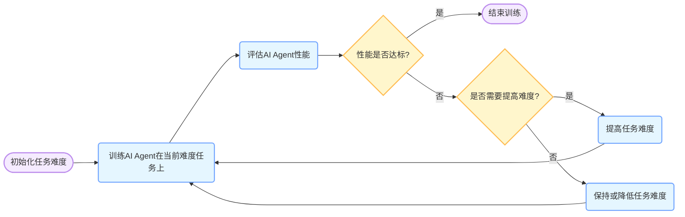

# 基于课程学习的AI Agent能力渐进提升

> 关键词：课程学习、AI Agent、能力渐进提升、强化学习、智能体训练

> 摘要：本文围绕基于课程学习的AI Agent能力渐进提升展开深入探讨。首先介绍了课程学习与AI Agent的相关背景知识，明确了文章的目的、范围、预期读者等信息。接着详细阐述了课程学习和AI Agent的核心概念及它们之间的联系，通过文本示意图和Mermaid流程图进行了直观展示。在核心算法原理部分，使用Python代码详细说明了课程学习算法在AI Agent训练中的应用。同时给出了相关的数学模型和公式，并结合具体例子进行解释。通过项目实战，展示了如何搭建开发环境、实现源代码以及对代码进行解读分析。此外，还探讨了基于课程学习的AI Agent的实际应用场景，推荐了相关的学习资源、开发工具框架和论文著作。最后总结了该领域的未来发展趋势与挑战，解答了常见问题，并提供了扩展阅读和参考资料，旨在为相关研究者和开发者提供全面且深入的技术指导。

## 1. 背景介绍 
### 1.1 目的和范围
随着人工智能技术的飞速发展，AI Agent在众多领域得到了广泛应用，如游戏、机器人控制、自动驾驶等。然而，传统的训练方法在训练AI Agent时往往面临效率低下、收敛速度慢等问题。课程学习作为一种有效的训练策略，能够通过合理安排训练任务的难度顺序，帮助AI Agent逐步提升能力，提高训练效率和性能。本文的目的在于深入探讨基于课程学习的AI Agent能力渐进提升的原理、方法和应用，为相关研究者和开发者提供全面的技术指导。范围涵盖课程学习和AI Agent的核心概念、算法原理、数学模型、项目实战、实际应用场景以及相关的工具和资源推荐等方面。

### 1.2 预期读者
本文预期读者包括人工智能领域的研究者、开发者、学生以及对AI Agent和课程学习感兴趣的技术爱好者。对于正在从事AI Agent训练相关研究的专业人员，本文可以提供新的思路和方法；对于开发者来说，文中的项目实战部分可以作为实际开发的参考；对于学生而言，有助于他们深入理解课程学习和AI Agent的相关知识；而技术爱好者可以通过本文了解该领域的前沿技术和应用。

### 1.3 文档结构概述
本文共分为十个部分。第一部分为背景介绍，阐述了文章的目的、范围、预期读者和文档结构概述，并给出了相关术语的定义和解释。第二部分详细介绍了课程学习和AI Agent的核心概念以及它们之间的联系，通过文本示意图和Mermaid流程图进行直观展示。第三部分讲解了核心算法原理，使用Python源代码详细阐述了课程学习算法在AI Agent训练中的应用。第四部分给出了相关的数学模型和公式，并结合具体例子进行详细讲解。第五部分通过项目实战，展示了如何搭建开发环境、实现源代码以及对代码进行解读分析。第六部分探讨了基于课程学习的AI Agent的实际应用场景。第七部分推荐了相关的学习资源、开发工具框架和论文著作。第八部分总结了该领域的未来发展趋势与挑战。第九部分为附录，解答了常见问题。第十部分提供了扩展阅读和参考资料。

### 1.4 术语表
#### 1.4.1 核心术语定义
- **课程学习（Curriculum Learning）**：是一种训练策略，它将训练任务按照难度顺序进行排列，让模型先从简单的任务开始学习，逐步过渡到复杂的任务，从而提高学习效率和性能。
- **AI Agent（人工智能智能体）**：是一种能够感知环境、做出决策并采取行动以实现特定目标的智能实体。它可以是软件程序、机器人等。
- **强化学习（Reinforcement Learning）**：是一种机器学习方法，智能体通过与环境进行交互，根据环境反馈的奖励信号来学习最优的行为策略。
- **策略网络（Policy Network）**：在强化学习中，策略网络用于生成智能体的行动策略，它将环境状态作为输入，输出每个可能行动的概率。
- **价值网络（Value Network）**：用于估计在某个状态下采取某个行动的价值，帮助智能体评估不同行动的优劣。

#### 1.4.2 相关概念解释
- **任务难度**：指训练任务的复杂程度，通常可以通过任务的状态空间大小、动作空间大小、奖励函数的复杂性等因素来衡量。
- **训练效率**：指在训练过程中，智能体达到一定性能水平所需的时间或计算资源。
- **收敛速度**：在强化学习中，收敛速度指策略网络或价值网络的参数收敛到最优值的速度。

#### 1.4.3 缩略词列表
- **RL**：Reinforcement Learning（强化学习）
- **DNN**：Deep Neural Network（深度神经网络）
- **MDP**：Markov Decision Process（马尔可夫决策过程）

## 2. 核心概念与联系 

### 课程学习的核心概念
课程学习的核心思想是模仿人类学习的过程，从简单到复杂逐步学习知识和技能。在AI Agent训练中，课程学习通过合理安排训练任务的难度顺序，让AI Agent先在简单的任务上进行学习和训练，积累一定的经验和能力后，再逐渐过渡到更复杂的任务。这样可以避免AI Agent在训练初期面对过于复杂的任务而陷入困境，提高训练效率和性能。

### AI Agent的核心概念
AI Agent是一种能够感知环境、做出决策并采取行动以实现特定目标的智能实体。它通常由感知模块、决策模块和执行模块组成。感知模块用于获取环境信息，决策模块根据感知到的信息和预设的目标做出决策，执行模块将决策转化为具体的行动。在强化学习中，AI Agent通过与环境进行交互，根据环境反馈的奖励信号来学习最优的行为策略。

### 课程学习与AI Agent的联系
课程学习为AI Agent的训练提供了一种有效的策略。通过课程学习，AI Agent可以在不同难度的任务上逐步学习和提升能力，避免了在复杂任务上的盲目探索，提高了训练效率和收敛速度。同时，AI Agent的学习效果也会影响课程学习的任务安排，例如，如果AI Agent在某个难度的任务上表现良好，可以适当提高任务难度；如果表现不佳，则需要降低任务难度或增加在该难度任务上的训练时间。

### 文本示意图
```plaintext
课程学习流程
|
|-- 初始化任务难度
|
|-- 训练AI Agent在当前难度任务上
|   |
|   |-- 感知环境
|   |-- 做出决策
|   |-- 执行行动
|   |-- 获取奖励
|   |-- 更新策略
|
|-- 评估AI Agent性能
|
|-- 根据性能调整任务难度
|
|-- 重复训练直到达到目标性能
```

### Mermaid流程图


## 3. 核心算法原理 & 具体操作步骤 

### 课程学习算法原理
课程学习算法的核心在于如何合理地安排训练任务的难度顺序。一种常见的方法是基于任务的难度度量，将任务按照难度从小到大进行排序，然后依次让AI Agent在这些任务上进行训练。在训练过程中，根据AI Agent的性能表现动态调整任务难度。

### 具体操作步骤
1. **任务难度初始化**：选择一个初始的任务难度级别。
2. **训练AI Agent**：让AI Agent在当前难度的任务上进行训练，使用强化学习算法更新AI Agent的策略。
3. **性能评估**：定期评估AI Agent在当前任务上的性能，例如平均奖励、成功率等。
4. **任务难度调整**：根据性能评估结果，决定是否需要调整任务难度。如果AI Agent的性能达到了一定的阈值，则提高任务难度；如果性能不佳，则保持或降低任务难度。
5. **重复训练**：重复步骤2 - 4，直到AI Agent在所有难度的任务上都达到了目标性能。

### Python源代码实现
```python
import numpy as np

# 定义AI Agent类
class AIAgent:
    def __init__(self, num_actions):
        self.num_actions = num_actions
        # 简单初始化策略，这里使用随机策略
        self.policy = np.ones(num_actions) / num_actions

    def choose_action(self):
        return np.random.choice(self.num_actions, p=self.policy)

    def update_policy(self, reward):
        # 简单的策略更新，这里只是示例，实际应用中需要更复杂的算法
        if reward > 0:
            self.policy = self.policy * (1 + 0.1)
        else:
            self.policy = self.policy * (1 - 0.1)
        self.policy = self.policy / np.sum(self.policy)

# 定义任务类
class Task:
    def __init__(self, difficulty):
        self.difficulty = difficulty
        # 简单定义任务的奖励函数，难度越高，奖励越难获得
        self.reward_prob = 1 / (1 + np.exp(difficulty))

    def get_reward(self, action):
        if np.random.rand() < self.reward_prob:
            return 1
        else:
            return -1

# 课程学习算法
def curriculum_learning():
    num_actions = 2
    agent = AIAgent(num_actions)
    initial_difficulty = 0
    max_difficulty = 5
    current_difficulty = initial_difficulty
    target_performance = 0.8
    max_episodes = 1000

    for episode in range(max_episodes):
        task = Task(current_difficulty)
        total_reward = 0
        num_trials = 100

        for trial in range(num_trials):
            action = agent.choose_action()
            reward = task.get_reward(action)
            agent.update_policy(reward)
            total_reward += reward

        performance = total_reward / num_trials

        if performance >= target_performance:
            if current_difficulty < max_difficulty:
                current_difficulty += 1
        else:
            if current_difficulty > initial_difficulty:
                current_difficulty -= 1

        print(f"Episode {episode}: Difficulty = {current_difficulty}, Performance = {performance}")

    return agent

if __name__ == "__main__":
    trained_agent = curriculum_learning()
```

### 代码解释
- **AIAgent类**：表示AI Agent，包含选择行动和更新策略的方法。
- **Task类**：表示训练任务，根据任务难度定义奖励函数。
- **curriculum_learning函数**：实现了课程学习算法，包括任务难度初始化、训练AI Agent、性能评估和任务难度调整等步骤。

## 4. 数学模型和公式 & 详细讲解 & 举例说明 

### 马尔可夫决策过程（MDP）
在强化学习中，通常使用马尔可夫决策过程（MDP）来描述AI Agent与环境的交互过程。MDP可以用一个五元组 $(S, A, P, R, \gamma)$ 表示，其中：
- $S$ 是状态空间，表示环境的所有可能状态。
- $A$ 是动作空间，表示AI Agent可以采取的所有可能动作。
- $P(s'|s, a)$ 是状态转移概率，表示在状态 $s$ 下采取动作 $a$ 后转移到状态 $s'$ 的概率。
- $R(s, a)$ 是奖励函数，表示在状态 $s$ 下采取动作 $a$ 后获得的即时奖励。
- $\gamma \in [0, 1]$ 是折扣因子，用于权衡即时奖励和未来奖励的重要性。

### 策略和价值函数
- **策略（Policy）**：$\pi(a|s)$ 表示在状态 $s$ 下采取动作 $a$ 的概率。
- **状态价值函数（State Value Function）**：$V^{\pi}(s)$ 表示在策略 $\pi$ 下，从状态 $s$ 开始的期望累积折扣奖励，定义为：
$$V^{\pi}(s) = \mathbb{E}_{\pi}\left[\sum_{t=0}^{\infty}\gamma^{t}R(s_{t}, a_{t})|s_{0}=s\right]$$
- **动作价值函数（Action Value Function）**：$Q^{\pi}(s, a)$ 表示在策略 $\pi$ 下，从状态 $s$ 采取动作 $a$ 后开始的期望累积折扣奖励，定义为：
$$Q^{\pi}(s, a) = \mathbb{E}_{\pi}\left[\sum_{t=0}^{\infty}\gamma^{t}R(s_{t}, a_{t})|s_{0}=s, a_{0}=a\right]$$

### 最优策略和最优价值函数
- **最优策略（Optimal Policy）**：$\pi^{*}$ 是使得所有状态的价值函数最大的策略，即：
$$\pi^{*} = \arg\max_{\pi} V^{\pi}(s), \forall s \in S$$
- **最优状态价值函数（Optimal State Value Function）**：$V^{*}(s)$ 是最优策略下的状态价值函数，即：
$$V^{*}(s) = \max_{\pi} V^{\pi}(s)$$
- **最优动作价值函数（Optimal Action Value Function）**：$Q^{*}(s, a)$ 是最优策略下的动作价值函数，即：
$$Q^{*}(s, a) = \max_{\pi} Q^{\pi}(s, a)$$

### 贝尔曼方程
贝尔曼方程描述了价值函数的递归关系。对于状态价值函数，有：
$$V^{\pi}(s) = \sum_{a \in A}\pi(a|s)\left[R(s, a) + \gamma\sum_{s' \in S}P(s'|s, a)V^{\pi}(s')\right]$$
对于动作价值函数，有：
$$Q^{\pi}(s, a) = R(s, a) + \gamma\sum_{s' \in S}P(s'|s, a)\sum_{a' \in A}\pi(a'|s')Q^{\pi}(s', a')$$
最优状态价值函数和最优动作价值函数满足贝尔曼最优方程：
$$V^{*}(s) = \max_{a \in A}\left[R(s, a) + \gamma\sum_{s' \in S}P(s'|s, a)V^{*}(s')\right]$$
$$Q^{*}(s, a) = R(s, a) + \gamma\sum_{s' \in S}P(s'|s, a)\max_{a' \in A}Q^{*}(s', a')$$

### 举例说明
假设有一个简单的网格世界，AI Agent需要从起点移动到终点。状态空间 $S$ 是网格中的所有位置，动作空间 $A$ 包括上下左右四个方向的移动。奖励函数 $R(s, a)$ 在到达终点时为正奖励，其他情况为负奖励或零奖励。折扣因子 $\gamma = 0.9$。

初始时，AI Agent的策略是随机的。通过与环境的交互，根据贝尔曼方程更新价值函数和策略，逐渐学习到最优策略。在课程学习中，可以先从简单的网格世界开始训练，例如网格较小、障碍物较少的情况，随着AI Agent能力的提升，逐渐增加网格大小和障碍物数量，提高任务难度。

## 5. 项目实战：代码实际案例和详细解释说明 

### 5.1  开发环境搭建
#### 安装Python
首先需要安装Python，建议使用Python 3.7及以上版本。可以从Python官方网站（https://www.python.org/downloads/）下载安装包，按照安装向导进行安装。

#### 安装必要的库
本项目需要使用一些常见的Python库，如NumPy、Matplotlib等。可以使用pip命令进行安装：
```sh
pip install numpy matplotlib
```

### 5.2  源代码详细实现和代码解读
```python
import numpy as np
import matplotlib.pyplot as plt

# 定义网格世界类
class GridWorld:
    def __init__(self, size=5, start=(0, 0), goal=(4, 4)):
        self.size = size
        self.start = start
        self.goal = goal
        self.current_state = start

    def reset(self):
        self.current_state = self.start
        return self.current_state

    def step(self, action):
        x, y = self.current_state
        if action == 0:  # 上
            x = max(x - 1, 0)
        elif action == 1:  # 下
            x = min(x + 1, self.size - 1)
        elif action == 2:  # 左
            y = max(y - 1, 0)
        elif action == 3:  # 右
            y = min(y + 1, self.size - 1)

        self.current_state = (x, y)
        done = self.current_state == self.goal
        reward = 1 if done else -0.1
        return self.current_state, reward, done

# 定义AI Agent类
class QLearningAgent:
    def __init__(self, num_states, num_actions, learning_rate=0.1, discount_factor=0.9, exploration_rate=0.1):
        self.num_states = num_states
        self.num_actions = num_actions
        self.learning_rate = learning_rate
        self.discount_factor = discount_factor
        self.exploration_rate = exploration_rate
        self.q_table = np.zeros((num_states, num_actions))

    def choose_action(self, state):
        if np.random.uniform(0, 1) < self.exploration_rate:
            return np.random.choice(self.num_actions)
        else:
            return np.argmax(self.q_table[state])

    def update_q_table(self, state, action, reward, next_state):
        predict = self.q_table[state, action]
        target = reward + self.discount_factor * np.max(self.q_table[next_state])
        self.q_table[state, action] = (1 - self.learning_rate) * predict + self.learning_rate * target

# 课程学习训练函数
def curriculum_learning():
    grid_sizes = [3, 4, 5]
    num_episodes_per_size = 200
    total_rewards = []

    for size in grid_sizes:
        env = GridWorld(size=size)
        num_states = size * size
        num_actions = 4
        agent = QLearningAgent(num_states, num_actions)
        size_rewards = []

        for episode in range(num_episodes_per_size):
            state = env.reset()
            state_index = state[0] * size + state[1]
            episode_reward = 0
            done = False

            while not done:
                action = agent.choose_action(state_index)
                next_state, reward, done = env.step(action)
                next_state_index = next_state[0] * size + next_state[1]
                agent.update_q_table(state_index, action, reward, next_state_index)
                state_index = next_state_index
                episode_reward += reward

            size_rewards.append(episode_reward)

        total_rewards.extend(size_rewards)

    return total_rewards

# 训练并绘制奖励曲线
rewards = curriculum_learning()
plt.plot(rewards)
plt.xlabel('Episode')
plt.ylabel('Total Reward')
plt.title('Curriculum Learning in Grid World')
plt.show()
```

### 5.3  代码解读与分析
- **GridWorld类**：表示网格世界环境，包含初始化、重置环境和执行动作等方法。
- **QLearningAgent类**：实现了Q学习算法，包含选择动作和更新Q表的方法。
- **curriculum_learning函数**：实现了课程学习算法，从简单的网格世界（大小为3x3）开始训练，逐渐增加网格大小到4x4和5x5。
- **奖励曲线绘制**：使用Matplotlib库绘制训练过程中的总奖励曲线，直观展示AI Agent的学习效果。

通过课程学习，AI Agent可以在不同难度的网格世界中逐步学习和提升能力，从简单的任务开始，逐渐适应更复杂的任务。

## 6. 实际应用场景 
### 游戏领域
在游戏开发中，基于课程学习的AI Agent可以用于训练游戏中的智能对手。例如，在格斗游戏中，AI对手可以先从简单的攻击和防御策略开始学习，随着玩家的游戏进度和自身能力的提升，逐渐学习更复杂的战术和技巧，为玩家提供更具挑战性的游戏体验。在策略游戏中，AI Agent可以先学习基本的资源管理和单位部署策略，然后逐渐掌握更高级的战略规划和团队协作。

### 机器人控制
在机器人领域，课程学习可以帮助机器人逐步学习各种技能。例如，机器人在学习行走时，可以先从简单的平地行走开始训练，掌握基本的平衡和移动技巧后，再逐渐学习在不同地形（如斜坡、楼梯）上行走。在机器人操作任务中，如抓取物体，机器人可以先学习在固定位置抓取简单形状的物体，然后逐渐适应不同位置、不同形状和重量的物体。

### 自动驾驶
在自动驾驶领域，基于课程学习的AI Agent可以从简单的驾驶场景开始学习，如在空旷的道路上直线行驶，然后逐渐学习在复杂的交通场景中行驶，如交通拥堵、路口转弯、遇到行人等。通过课程学习，可以提高自动驾驶系统的训练效率和安全性，使其更快地适应各种实际驾驶情况。

### 医疗领域
在医疗诊断和治疗中，AI Agent可以通过课程学习来提升诊断和治疗能力。例如，先从简单的疾病诊断开始学习，根据患者的基本症状进行初步判断，然后逐渐学习结合更多的检查数据（如血液检查、影像检查）进行更准确的诊断。在治疗方案制定方面，AI Agent可以先学习针对常见疾病的标准治疗方案，然后逐渐探索个性化的治疗策略。

## 7. 工具和资源推荐
### 7.1 学习资源推荐
#### 7.1.1 书籍推荐
- 《强化学习：原理与Python实现》：本书系统地介绍了强化学习的基本原理、算法和应用，通过Python代码示例帮助读者更好地理解和实现强化学习算法。
- 《深度学习》：由Ian Goodfellow、Yoshua Bengio和Aaron Courville三位深度学习领域的顶尖专家撰写，全面介绍了深度学习的理论和实践，是深度学习领域的经典教材。
- 《人工智能：一种现代的方法》：涵盖了人工智能的各个方面，包括搜索、知识表示、推理、机器学习、自然语言处理等，是人工智能领域的权威著作。

#### 7.1.2 在线课程
- Coursera上的“强化学习专项课程”：由DeepMind的研究人员授课，深入讲解了强化学习的理论和实践，包括马尔可夫决策过程、Q学习、策略梯度等算法。
- edX上的“深度学习微硕士项目”：提供了深度学习的全面课程，包括神经网络、卷积神经网络、循环神经网络等内容，适合初学者和有一定基础的学习者。
- Udemy上的“人工智能实战课程”：通过实际项目案例，帮助学习者掌握人工智能的应用和开发技巧。

#### 7.1.3 技术博客和网站
- OpenAI博客（https://openai.com/blog/）：OpenAI团队发布的最新研究成果和技术文章，涵盖了人工智能的多个领域，如强化学习、生成对抗网络等。
- DeepMind博客（https://deepmind.com/blog/）：DeepMind公司的官方博客，分享了他们在人工智能领域的研究进展和应用案例。
- Medium上的人工智能相关专栏：有许多人工智能领域的专家和爱好者在Medium上分享他们的见解和经验，是获取最新技术动态的好去处。

### 7.2 开发工具框架推荐
#### 7.2.1 IDE和编辑器
- PyCharm：是一款专门为Python开发设计的集成开发环境（IDE），具有代码自动补全、调试、版本控制等功能，适合专业的Python开发者。
- Jupyter Notebook：是一个基于网页的交互式开发环境，支持多种编程语言，特别适合数据科学和机器学习的开发和实验。
- Visual Studio Code：是一款轻量级的代码编辑器，支持多种编程语言和插件扩展，具有丰富的功能和良好的用户体验。

#### 7.2.2 调试和性能分析工具
- TensorBoard：是TensorFlow提供的可视化工具，可以用于监控模型的训练过程、查看模型的结构和参数、分析训练数据等。
- Py-Spy：是一个用于Python程序的性能分析工具，可以实时监控Python程序的CPU使用情况、函数调用栈等，帮助开发者找出性能瓶颈。
- cProfile：是Python标准库中的性能分析模块，可以对Python程序进行详细的性能分析，输出函数调用时间、调用次数等信息。

#### 7.2.3 相关框架和库
- TensorFlow：是一个开源的深度学习框架，由Google开发，提供了丰富的深度学习模型和工具，支持CPU、GPU和TPU等多种计算设备。
- PyTorch：是另一个流行的深度学习框架，由Facebook开发，具有动态图的特点，易于使用和调试，在学术界和工业界都有广泛的应用。
- Stable Baselines3：是一个基于PyTorch的强化学习库，提供了多种预训练的强化学习算法和环境，方便开发者快速实现和测试强化学习模型。

### 7.3 相关论文著作推荐
#### 7.3.1 经典论文
- 《Curriculum Learning》：Bengio等人发表的关于课程学习的经典论文，首次提出了课程学习的概念，并证明了其在机器学习中的有效性。
- 《Playing Atari with Deep Reinforcement Learning》：DeepMind团队发表的论文，介绍了使用深度强化学习算法在Atari游戏上取得了超越人类玩家的成绩，开创了深度强化学习在游戏领域的应用。
- 《Human-level control through deep reinforcement learning》：同样是DeepMind团队的论文，介绍了使用深度Q网络（DQN）在多种Atari游戏上实现了人类水平的控制，为深度强化学习的发展奠定了基础。

#### 7.3.2 最新研究成果
- 关注NeurIPS、ICML、CVPR等顶级人工智能会议的论文，这些会议收录了人工智能领域的最新研究成果，包括课程学习、强化学习、AI Agent等方面的研究。
- 查阅相关学术期刊，如Journal of Artificial Intelligence Research（JAIR）、Artificial Intelligence等，这些期刊发表了许多高质量的人工智能研究论文。

#### 7.3.3 应用案例分析
- 可以参考一些知名科技公司的技术博客和研究报告，如Google、Facebook、Microsoft等，了解他们在实际项目中应用课程学习和AI Agent的案例和经验。
- 关注开源项目和竞赛，如OpenAI Gym、Kaggle等，这些平台上有许多实际的应用案例和解决方案，可以学习和借鉴。

## 8. 总结：未来发展趋势与挑战
### 未来发展趋势
- **更智能的课程设计**：未来的课程学习算法将更加智能化，能够根据AI Agent的学习能力和特点自动生成最优的训练课程，提高训练效率和性能。
- **多模态课程学习**：结合多种模态的数据（如图像、语音、文本）进行课程学习，使AI Agent能够学习更复杂的任务和技能，提高其在现实世界中的应用能力。
- **与其他技术的融合**：课程学习将与其他人工智能技术（如迁移学习、元学习）相结合，进一步提升AI Agent的学习能力和泛化能力。
- **在更多领域的应用**：基于课程学习的AI Agent将在更多领域得到应用，如金融、教育、农业等，为这些领域带来更智能的解决方案。

### 挑战
- **任务难度度量**：如何准确地度量任务的难度是课程学习面临的一个挑战。目前还没有一种通用的方法能够准确地衡量不同类型任务的难度，需要进一步研究和探索。
- **课程调整策略**：如何根据AI Agent的性能动态调整课程难度也是一个难题。不同的AI Agent在学习过程中的表现可能不同，需要设计出更加灵活和自适应的课程调整策略。
- **计算资源需求**：随着任务复杂度的增加，基于课程学习的AI Agent训练需要大量的计算资源。如何优化算法和利用分布式计算等技术来降低计算成本是一个亟待解决的问题。
- **泛化能力**：尽管课程学习可以提高AI Agent在训练任务上的性能，但如何保证其在未见过的任务上也具有良好的泛化能力仍然是一个挑战。

## 9. 附录：常见问题与解答
### 1. 课程学习和传统的训练方法有什么区别？
课程学习与传统训练方法的主要区别在于任务的安排方式。传统训练方法通常是让模型在所有任务上同时进行训练，而课程学习则是将任务按照难度顺序进行排列，让模型先从简单的任务开始学习，逐步过渡到复杂的任务。这种方式可以提高模型的学习效率和性能，避免在复杂任务上的盲目探索。

### 2. 如何确定任务的难度？
确定任务难度是一个复杂的问题，没有一种通用的方法。可以从以下几个方面来考虑：
- 状态空间和动作空间的大小：状态空间和动作空间越大，任务通常越复杂。
- 奖励函数的复杂性：奖励函数越复杂，任务越难学习。
- 任务的语义复杂性：例如，需要更高层次的推理和决策的任务通常更难。

### 3. 课程学习一定能提高AI Agent的性能吗？
不一定。课程学习的效果取决于课程的设计和任务的安排。如果课程设计不合理，可能会导致AI Agent在简单任务上过度训练，而在复杂任务上仍然表现不佳。因此，需要根据具体的任务和AI Agent的特点来设计合适的课程。

### 4. 课程学习和强化学习有什么关系？
课程学习可以作为一种训练策略应用于强化学习中。在强化学习中，通过课程学习可以合理安排训练任务的难度顺序，帮助AI Agent逐步学习和提升能力，提高训练效率和收敛速度。

### 5. 如何评估AI Agent在课程学习中的性能？
可以使用多种指标来评估AI Agent在课程学习中的性能，如平均奖励、成功率、收敛速度等。平均奖励反映了AI Agent在训练过程中获得的平均奖励值，成功率表示AI Agent在完成任务时的成功比例，收敛速度则衡量了策略网络或价值网络的参数收敛到最优值的速度。

## 10. 扩展阅读 & 参考资料
### 扩展阅读
- Sutton, R. S., & Barto, A. G. (2018). Reinforcement Learning: An Introduction. MIT press.
- Goodfellow, I., Bengio, Y., & Courville, A. (2016). Deep Learning. MIT press.
- Mitchell, T. M. (1997). Machine Learning. McGraw-Hill.

### 参考资料
- Bengio, Y., Louradour, J., Collobert, R., & Weston, J. (2009). Curriculum learning. In Proceedings of the 26th annual international conference on machine learning (pp. 41-48).
- Mnih, V., Kavukcuoglu, K., Silver, D., Graves, A., Antonoglou, I., Wierstra, D., & Riedmiller, M. (2013). Playing Atari with Deep Reinforcement Learning. arXiv preprint arXiv:1312.5602.
- Mnih, V., Kavukcuoglu, K., Silver, D., Rusu, A. A., Veness, J., Bellemare, M. G.,... & Hassabis, D. (2015). Human-level control through deep reinforcement learning. Nature, 518(7540), 529-533.

作者：AI天才研究院/AI Genius Institute & 禅与计算机程序设计艺术 /Zen And The Art of Computer Programming