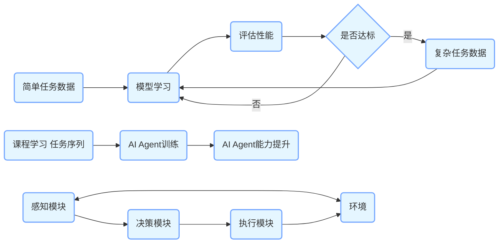

# 基于课程学习的AI Agent能力进阶

> 关键词：课程学习、AI Agent、能力进阶、机器学习、智能体训练

> 摘要：本文围绕基于课程学习的AI Agent能力进阶展开深入探讨。首先介绍了课程学习和AI Agent的相关背景知识，明确了文章的目的、范围、预期读者和文档结构。接着详细阐述了课程学习和AI Agent的核心概念及两者之间的联系，给出了相应的文本示意图和Mermaid流程图。在核心算法原理部分，使用Python代码详细解释了课程学习在AI Agent训练中的应用。通过数学模型和公式进一步分析了课程学习的原理，并举例说明。项目实战部分搭建了开发环境，给出源代码并进行详细解读。同时探讨了基于课程学习的AI Agent的实际应用场景，推荐了相关的学习资源、开发工具框架和论文著作。最后总结了未来发展趋势与挑战，解答了常见问题，并提供了扩展阅读和参考资料。

## 1. 背景介绍 
### 1.1 目的和范围
随着人工智能技术的不断发展，AI Agent在各种领域的应用越来越广泛。然而，如何让AI Agent快速、高效地学习并提升其能力成为了一个关键问题。课程学习作为一种有效的学习策略，能够引导AI Agent逐步学习，从简单到复杂，从而加速其能力的提升。本文的目的在于深入探讨基于课程学习的AI Agent能力进阶的原理、方法和应用，详细介绍相关的算法、数学模型，并通过实际项目案例进行验证。范围涵盖了课程学习的基本概念、AI Agent的训练机制、核心算法的实现、实际应用场景以及未来发展趋势等方面。

### 1.2 预期读者
本文的预期读者主要包括人工智能领域的研究人员、开发者、学生以及对AI Agent和课程学习感兴趣的技术爱好者。对于研究人员，本文可以提供新的研究思路和方法；对于开发者，能够帮助他们在实际项目中应用课程学习来提升AI Agent的性能；对于学生，有助于他们深入理解人工智能的相关概念和技术；对于技术爱好者，能够让他们了解这一领域的前沿动态。

### 1.3 文档结构概述
本文共分为十个部分。第一部分为背景介绍，包括目的和范围、预期读者、文档结构概述和术语表。第二部分阐述核心概念与联系，介绍课程学习和AI Agent的原理和架构，并给出文本示意图和Mermaid流程图。第三部分讲解核心算法原理和具体操作步骤，使用Python代码详细说明。第四部分介绍数学模型和公式，并进行详细讲解和举例说明。第五部分为项目实战，包括开发环境搭建、源代码详细实现和代码解读。第六部分探讨实际应用场景。第七部分推荐相关的工具和资源，包括学习资源、开发工具框架和论文著作。第八部分总结未来发展趋势与挑战。第九部分为附录，解答常见问题。第十部分提供扩展阅读和参考资料。

### 1.4 术语表
#### 1.4.1 核心术语定义
- **课程学习（Curriculum Learning）**：是一种机器学习策略，它按照从简单到复杂的顺序组织训练数据，让模型先学习简单的任务，再逐步学习复杂的任务，从而提高学习效率和性能。
- **AI Agent（人工智能智能体）**：是一种能够感知环境、做出决策并采取行动以实现特定目标的人工智能实体。
- **强化学习（Reinforcement Learning）**：是一种机器学习方法，智能体通过与环境进行交互，根据环境反馈的奖励信号来学习最优的行为策略。

#### 1.4.2 相关概念解释
- **学习难度**：指任务对于AI Agent来说的学习难易程度，通常与任务的复杂度、数据的多样性等因素有关。
- **任务序列**：课程学习中按照学习难度排序的一系列任务，AI Agent依次学习这些任务以提升能力。
- **奖励函数**：在强化学习中，用于衡量智能体行为好坏的函数，智能体的目标是最大化长期累积奖励。

#### 1.4.3 缩略词列表
- **ML（Machine Learning）**：机器学习
- **RL（Reinforcement Learning）**：强化学习
- **AI（Artificial Intelligence）**：人工智能

## 2. 核心概念与联系 

### 课程学习原理
课程学习的核心思想是模仿人类的学习过程，人类在学习新知识时通常是从简单的概念开始，逐步掌握更复杂的内容。在机器学习中，课程学习将训练数据按照学习难度进行排序，让模型先学习简单的数据，然后逐渐过渡到复杂的数据。这样做的好处是模型能够更快地收敛，并且在复杂任务上取得更好的性能。例如，在图像识别任务中，可以先让模型学习识别简单的几何图形，然后再学习识别复杂的物体。

### AI Agent架构
AI Agent通常由感知模块、决策模块和执行模块组成。感知模块负责感知环境信息，例如图像、声音、文本等；决策模块根据感知到的信息和自身的目标，做出决策；执行模块根据决策结果采取相应的行动。在强化学习中，AI Agent通过与环境进行交互，不断调整自己的行为策略，以最大化长期累积奖励。

### 课程学习与AI Agent的联系
课程学习可以应用于AI Agent的训练过程中，帮助AI Agent更快地学习和提升能力。通过将任务按照学习难度排序，AI Agent可以先在简单的任务上进行训练，快速掌握基本的技能和策略，然后再逐步挑战更复杂的任务。这样可以避免AI Agent在复杂任务上陷入局部最优解，提高学习效率和性能。例如，在机器人导航任务中，可以先让机器人在简单的环境中学习导航，然后再逐渐增加环境的复杂度。

### 文本示意图
```plaintext
课程学习流程：
简单任务数据 -> 模型学习 -> 评估性能 -> 复杂任务数据 -> 模型学习 -> 评估性能 ->...

AI Agent架构：
感知模块 <-> 环境
感知模块 -> 决策模块 -> 执行模块
执行模块 -> 环境

课程学习与AI Agent的结合：
课程学习（任务序列） -> AI Agent训练 -> AI Agent能力提升
```

### Mermaid流程图


## 3. 核心算法原理 & 具体操作步骤 

### 课程学习算法原理
课程学习的基本算法可以分为以下几个步骤：
1. **任务排序**：根据任务的学习难度对任务进行排序，生成任务序列。
2. **初始化模型**：初始化AI Agent的模型参数。
3. **依次学习任务**：按照任务序列依次让AI Agent学习每个任务，直到达到停止条件。
4. **评估性能**：在每个任务学习完成后，评估AI Agent的性能。
5. **调整任务序列**：根据评估结果，调整任务序列，例如增加或减少任务的难度。

### Python代码实现
```python
import numpy as np

# 定义任务序列
task_sequence = [
    {"name": "简单任务1", "difficulty": 1},
    {"name": "简单任务2", "difficulty": 2},
    {"name": "中等任务1", "difficulty": 3},
    {"name": "复杂任务1", "difficulty": 4}
]

# 初始化模型参数
model_parameters = np.random.rand(10)

# 定义停止条件
max_iterations = 100
iteration = 0

while iteration < max_iterations:
    for task in task_sequence:
        # 模拟模型在任务上的学习过程
        print(f"学习任务: {task['name']}")
        # 这里可以添加具体的学习代码，例如使用强化学习算法更新模型参数
        # 模拟学习后更新模型参数
        model_parameters += np.random.rand(10) * 0.1
        
        # 评估性能
        performance = np.sum(model_parameters)
        print(f"性能评估: {performance}")
        
    iteration += 1

print("训练完成")
```

### 具体操作步骤
1. **定义任务序列**：根据任务的学习难度对任务进行排序，生成任务序列。可以使用手动定义或自动排序的方法。
2. **初始化模型**：使用随机初始化或预训练的方法初始化AI Agent的模型参数。
3. **循环学习任务**：按照任务序列依次让AI Agent学习每个任务，直到达到停止条件。在每个任务学习完成后，评估AI Agent的性能。
4. **调整任务序列**：根据评估结果，调整任务序列，例如增加或减少任务的难度。可以使用动态调整的方法，根据AI Agent的性能自动调整任务序列。
5. **完成训练**：当达到停止条件时，训练结束。

## 4. 数学模型和公式 & 详细讲解 & 举例说明 

### 课程学习的数学模型
课程学习可以用马尔可夫决策过程（MDP）来建模。马尔可夫决策过程是一个五元组 $(S, A, P, R, \gamma)$，其中：
- $S$ 是状态空间，表示环境的所有可能状态。
- $A$ 是动作空间，表示AI Agent可以采取的所有可能动作。
- $P$ 是状态转移概率函数，表示在状态 $s$ 采取动作 $a$ 后转移到状态 $s'$ 的概率，即 $P(s'|s, a)$。
- $R$ 是奖励函数，表示在状态 $s$ 采取动作 $a$ 后获得的即时奖励，即 $R(s, a)$。
- $\gamma$ 是折扣因子，用于衡量未来奖励的重要性，取值范围为 $[0, 1]$。

在课程学习中，任务序列可以看作是一系列不同的马尔可夫决策过程，AI Agent需要在每个过程中学习最优的行为策略。

### 价值函数和策略函数
在强化学习中，常用的价值函数有状态价值函数 $V(s)$ 和动作价值函数 $Q(s, a)$。状态价值函数表示在状态 $s$ 下，遵循策略 $\pi$ 所能获得的期望累积奖励，定义为：
$$V^{\pi}(s) = \mathbb{E}_{\pi}\left[\sum_{t=0}^{\infty}\gamma^{t}R(s_{t}, a_{t})|s_{0} = s\right]$$
动作价值函数表示在状态 $s$ 采取动作 $a$ 后，遵循策略 $\pi$ 所能获得的期望累积奖励，定义为：
$$Q^{\pi}(s, a) = \mathbb{E}_{\pi}\left[\sum_{t=0}^{\infty}\gamma^{t}R(s_{t}, a_{t})|s_{0} = s, a_{0} = a\right]$$
策略函数 $\pi(a|s)$ 表示在状态 $s$ 下采取动作 $a$ 的概率。

### 策略迭代和值迭代算法
策略迭代和值迭代是强化学习中常用的算法，用于求解最优策略。策略迭代算法的步骤如下：
1. **策略评估**：根据当前策略 $\pi$ 计算状态价值函数 $V^{\pi}(s)$。
2. **策略改进**：根据状态价值函数 $V^{\pi}(s)$ 改进策略 $\pi$，得到新的策略 $\pi'$。
3. **重复步骤1和2**：直到策略收敛。

值迭代算法的步骤如下：
1. **初始化值函数**：初始化状态价值函数 $V(s)$。
2. **更新值函数**：使用贝尔曼最优方程更新状态价值函数 $V(s)$，直到收敛。
3. **生成最优策略**：根据收敛后的状态价值函数 $V(s)$ 生成最优策略 $\pi^{*}$。

### 举例说明
假设有一个简单的网格世界任务，AI Agent需要从起点移动到终点。状态空间 $S$ 是网格世界中的所有位置，动作空间 $A$ 是上下左右四个方向。奖励函数 $R(s, a)$ 定义为：如果到达终点，奖励为1；否则，奖励为 -0.1。折扣因子 $\gamma = 0.9$。

使用值迭代算法求解最优策略的Python代码如下：
```python
import numpy as np

# 定义网格世界的大小
grid_size = (3, 3)
start_state = (0, 0)
goal_state = (2, 2)

# 初始化状态价值函数
V = np.zeros(grid_size)

# 定义动作空间
actions = [(0, 1), (0, -1), (1, 0), (-1, 0)]

# 定义折扣因子
gamma = 0.9

# 定义奖励函数
def reward(s, a):
    next_s = (s[0] + a[0], s[1] + a[1])
    if next_s[0] < 0 or next_s[0] >= grid_size[0] or next_s[1] < 0 or next_s[1] >= grid_size[1]:
        return -0.1
    if next_s == goal_state:
        return 1
    return -0.1

# 值迭代算法
max_iterations = 100
for _ in range(max_iterations):
    V_new = np.zeros(grid_size)
    for i in range(grid_size[0]):
        for j in range(grid_size[1]):
            s = (i, j)
            q_values = []
            for a in actions:
                r = reward(s, a)
                next_s = (s[0] + a[0], s[1] + a[1])
                if next_s[0] < 0 or next_s[0] >= grid_size[0] or next_s[1] < 0 or next_s[1] >= grid_size[1]:
                    next_s = s
                q_values.append(r + gamma * V[next_s])
            V_new[s] = np.max(q_values)
    V = V_new

# 生成最优策略
policy = np.zeros((*grid_size, 4))
for i in range(grid_size[0]):
    for j in range(grid_size[1]):
        s = (i, j)
        q_values = []
        for a in actions:
            r = reward(s, a)
            next_s = (s[0] + a[0], s[1] + a[1])
            if next_s[0] < 0 or next_s[0] >= grid_size[0] or next_s[1] < 0 or next_s[1] >= grid_size[1]:
                next_s = s
            q_values.append(r + gamma * V[next_s])
        best_action = np.argmax(q_values)
        policy[s][best_action] = 1

print("最优状态价值函数:")
print(V)
print("最优策略:")
print(policy)
```

## 5. 项目实战：代码实际案例和详细解释说明 

### 5.1  开发环境搭建
在本项目中，我们将使用Python进行开发，需要安装以下库：
- **NumPy**：用于数值计算。
- **OpenAI Gym**：一个开源的强化学习环境库，提供了各种经典的强化学习任务。

可以使用以下命令安装这些库：
```sh
pip install numpy gym
```

### 5.2  源代码详细实现和代码解读
我们将使用OpenAI Gym中的CartPole-v1环境来演示基于课程学习的AI Agent能力进阶。CartPole-v1环境是一个经典的强化学习任务，AI Agent需要控制一个杆子保持平衡。

```python
import gym
import numpy as np

# 定义任务序列
task_sequence = [
    {"name": "简单任务", "max_steps": 100},
    {"name": "中等任务", "max_steps": 200},
    {"name": "复杂任务", "max_steps": 500}
]

# 初始化环境
env = gym.make('CartPole-v1')

# 定义超参数
learning_rate = 0.1
discount_factor = 0.9
epsilon = 0.1
episodes = 1000

# 初始化Q表
state_space_size = env.observation_space.shape[0]
action_space_size = env.action_space.n
q_table = np.zeros((state_space_size, action_space_size))

# 训练过程
for task in task_sequence:
    print(f"开始学习任务: {task['name']}")
    for episode in range(episodes):
        state = env.reset()
        done = False
        step = 0
        while not done and step < task["max_steps"]:
            # 选择动作
            if np.random.uniform(0, 1) < epsilon:
                action = env.action_space.sample()
            else:
                action = np.argmax(q_table[state])
            
            # 执行动作
            next_state, reward, done, _ = env.step(action)
            
            # 更新Q表
            q_table[state][action] = (1 - learning_rate) * q_table[state][action] + \
                learning_rate * (reward + discount_factor * np.max(q_table[next_state]))
            
            state = next_state
            step += 1
    
    print(f"任务 {task['name']} 学习完成")

# 测试过程
state = env.reset()
done = False
total_reward = 0
while not done:
    action = np.argmax(q_table[state])
    next_state, reward, done, _ = env.step(action)
    total_reward += reward
    state = next_state

print(f"测试总奖励: {total_reward}")

env.close()
```

### 5.3  代码解读与分析
1. **任务序列定义**：定义了一个任务序列，包含简单任务、中等任务和复杂任务，每个任务有不同的最大步数。
2. **环境初始化**：使用OpenAI Gym创建CartPole-v1环境。
3. **超参数设置**：设置学习率、折扣因子、探索率和训练回合数。
4. **Q表初始化**：初始化Q表，用于存储状态-动作值。
5. **训练过程**：按照任务序列依次让AI Agent学习每个任务。在每个任务中，进行多个回合的训练，每个回合中，AI Agent根据Q表选择动作，执行动作后更新Q表。
6. **测试过程**：在所有任务学习完成后，进行测试，计算总奖励。

通过这种方式，AI Agent可以逐步学习，从简单任务到复杂任务，提升自己的能力。

## 6. 实际应用场景 
### 机器人导航
在机器人导航任务中，课程学习可以帮助机器人更快地学习导航技能。可以先让机器人在简单的环境中学习导航，例如空旷的房间，然后逐渐增加环境的复杂度，例如添加障碍物、动态物体等。这样机器人可以逐步掌握不同环境下的导航策略，提高导航的准确性和效率。

### 游戏AI
在游戏开发中，课程学习可以用于训练游戏AI。例如，在策略游戏中，可以先让AI学习简单的战术，然后逐渐学习复杂的战略。这样AI可以更好地应对不同的游戏场景，提高游戏的趣味性和挑战性。

### 自动驾驶
在自动驾驶领域，课程学习可以帮助自动驾驶车辆更快地学习驾驶技能。可以先让车辆在简单的道路条件下学习驾驶，例如直线道路、低流量道路，然后逐渐增加道路的复杂度，例如弯道、十字路口、高流量道路等。这样车辆可以逐步掌握不同道路条件下的驾驶策略，提高自动驾驶的安全性和可靠性。

### 自然语言处理
在自然语言处理任务中，课程学习可以用于训练语言模型。例如，在文本生成任务中，可以先让模型学习生成简单的句子，然后逐渐学习生成复杂的段落和文章。这样模型可以更好地理解语言的结构和语义，提高文本生成的质量。

## 7. 工具和资源推荐
### 7.1 学习资源推荐
#### 7.1.1 书籍推荐
- 《强化学习：原理与Python实现》：本书详细介绍了强化学习的基本原理和算法，并使用Python代码进行实现，适合初学者入门。
- 《深度学习》：由深度学习领域的三位巨头Ian Goodfellow、Yoshua Bengio和Aaron Courville合著，是深度学习领域的经典教材，涵盖了深度学习的各个方面。
- 《人工智能：一种现代的方法》：全面介绍了人工智能的各个领域，包括搜索算法、知识表示、机器学习、自然语言处理等，是人工智能领域的权威书籍。

#### 7.1.2 在线课程
- Coursera上的“强化学习专项课程”：由DeepMind的研究人员授课，系统地介绍了强化学习的理论和实践。
- edX上的“深度学习微硕士项目”：包括多个深度学习相关的课程，适合深入学习深度学习技术。
- 网易云课堂上的“人工智能基础课程”：由国内知名高校的教授授课，适合初学者了解人工智能的基本概念和方法。

#### 7.1.3 技术博客和网站
- Medium上的人工智能相关博客：有很多优秀的人工智能技术文章，涵盖了最新的研究成果和实践经验。
- arXiv.org：是一个预印本平台，提供了大量的人工智能领域的研究论文，方便了解最新的研究动态。
- OpenAI的官方博客：发布了很多关于人工智能的研究成果和应用案例，具有很高的参考价值。

### 7.2 开发工具框架推荐
#### 7.2.1 IDE和编辑器
- PyCharm：是一款专业的Python集成开发环境，具有强大的代码编辑、调试和分析功能，适合Python开发。
- Jupyter Notebook：是一个交互式的开发环境，支持多种编程语言，适合进行数据探索、模型训练和可视化。
- Visual Studio Code：是一款轻量级的代码编辑器，支持多种编程语言和插件，具有良好的扩展性。

#### 7.2.2 调试和性能分析工具
- TensorBoard：是TensorFlow的可视化工具，可以用于可视化训练过程中的损失函数、准确率等指标，帮助调试模型。
- PyTorch Profiler：是PyTorch的性能分析工具，可以分析模型的运行时间、内存使用等情况，帮助优化模型性能。
- cProfile：是Python的内置性能分析工具，可以分析Python代码的运行时间和函数调用情况，帮助找出性能瓶颈。

#### 7.2.3 相关框架和库
- TensorFlow：是Google开发的开源深度学习框架，具有丰富的工具和库，支持多种深度学习任务。
- PyTorch：是Facebook开发的开源深度学习框架，具有动态图的特点，易于使用和调试，适合研究和开发。
- Stable Baselines3：是一个基于PyTorch的强化学习库，提供了多种强化学习算法的实现，方便进行强化学习实验。

### 7.3 相关论文著作推荐
#### 7.3.1 经典论文
- 《Curriculum Learning》：由Yoshua Bengio等人发表，首次提出了课程学习的概念，并证明了其在机器学习中的有效性。
- 《Playing Atari with Deep Reinforcement Learning》：由DeepMind发表，介绍了使用深度强化学习算法训练AI Agent玩Atari游戏的方法，开创了深度强化学习的先河。
- 《Attention Is All You Need》：由Google发表，提出了Transformer模型，是自然语言处理领域的重大突破。

#### 7.3.2 最新研究成果
- 《Meta-Curriculum Learning》：提出了元课程学习的概念，通过学习如何生成课程来进一步提高课程学习的效果。
- 《Self-Paced Curriculum Learning》：介绍了自定进度的课程学习方法，让模型根据自身的学习进度自动调整课程难度。
- 《Curriculum Learning for Neural Machine Translation》：将课程学习应用于神经机器翻译任务，提高了翻译的质量。

#### 7.3.3 应用案例分析
- 《Curriculum Learning for Robotic Manipulation》：介绍了课程学习在机器人操作任务中的应用，帮助机器人更快地学习操作技能。
- 《Curriculum Learning in Game AI》：探讨了课程学习在游戏AI中的应用，提高了游戏AI的性能。
- 《Curriculum Learning for Autonomous Driving》：将课程学习应用于自动驾驶领域，提高了自动驾驶车辆的学习效率和安全性。

## 8. 总结：未来发展趋势与挑战
### 未来发展趋势
- **自适应课程学习**：未来的课程学习方法将更加自适应，能够根据AI Agent的学习进度和性能自动调整课程难度和任务序列，提高学习效率和效果。
- **多模态课程学习**：随着人工智能技术的发展，多模态数据（如图像、声音、文本等）的处理将变得越来越重要。未来的课程学习将结合多模态数据，让AI Agent能够在更复杂的环境中学习和提升能力。
- **元课程学习**：元课程学习是一种更高级的课程学习方法，它可以学习如何生成课程，从而进一步提高课程学习的效果。未来的研究将更加关注元课程学习的理论和应用。
- **与其他技术的融合**：课程学习将与其他人工智能技术（如迁移学习、强化学习、深度学习等）进行更深入的融合，发挥更大的作用。

### 挑战
- **任务难度评估**：如何准确地评估任务的学习难度是课程学习面临的一个挑战。目前的方法大多基于人工经验或简单的规则，缺乏科学性和准确性。未来需要研究更有效的任务难度评估方法。
- **课程设计**：设计合理的课程序列是课程学习的关键。如何根据任务的特点和AI Agent的能力设计出最优的课程序列是一个有待解决的问题。
- **计算资源需求**：课程学习通常需要大量的计算资源，尤其是在处理复杂任务和大规模数据时。如何降低计算资源需求，提高课程学习的效率是一个重要的挑战。
- **泛化能力**：虽然课程学习可以提高AI Agent在训练任务上的性能，但如何提高AI Agent的泛化能力，使其能够在未见过的任务上也表现良好，是一个需要解决的问题。

## 9. 附录：常见问题与解答
### 问题1：课程学习和传统的机器学习方法有什么区别？
解答：传统的机器学习方法通常是将所有的训练数据一次性输入到模型中进行学习，而课程学习则是按照从简单到复杂的顺序组织训练数据，让模型先学习简单的任务，再逐步学习复杂的任务。课程学习可以提高模型的学习效率和性能，尤其是在处理复杂任务时。

### 问题2：如何确定任务的学习难度？
解答：确定任务的学习难度是一个复杂的问题，目前没有一种通用的方法。常见的方法包括基于任务的复杂度、数据的多样性、模型在任务上的性能等。例如，可以通过计算任务的特征数量、样本数量、任务的不确定性等来评估任务的学习难度。

### 问题3：课程学习适用于哪些类型的AI Agent？
解答：课程学习适用于各种类型的AI Agent，包括基于强化学习的智能体、基于监督学习的智能体和基于无监督学习的智能体。只要AI Agent需要学习和提升能力，课程学习都可以作为一种有效的学习策略。

### 问题4：课程学习会增加训练时间吗？
解答：在某些情况下，课程学习可能会增加训练时间，因为需要按照任务序列依次学习每个任务。但是，由于课程学习可以让模型更快地收敛，并且在复杂任务上取得更好的性能，从整体上看，可能会减少达到相同性能所需的总训练时间。

## 10. 扩展阅读 & 参考资料
### 扩展阅读
- 《Deep Reinforcement Learning Hands-On》：深入介绍了深度强化学习的原理和实践，包括课程学习在深度强化学习中的应用。
- 《Artificial Intelligence: A Systems Approach》：从系统的角度介绍了人工智能的各个方面，包括AI Agent的设计和训练。
- 《Machine Learning Yearning》：由Andrew Ng撰写，提供了很多关于机器学习实践的实用建议，包括如何设计有效的训练方案。

### 参考资料
- Bengio, Y., Louradour, J., Collobert, R., & Weston, J. (2009). Curriculum learning. In Proceedings of the 26th annual international conference on machine learning (pp. 41-48).
- Mnih, V., Kavukcuoglu, K., Silver, D., Graves, A., Antonoglou, I., Wierstra, D., & Riedmiller, M. (2013). Playing atari with deep reinforcement learning. arXiv preprint arXiv:1312.5602.
- Vaswani, A., Shazeer, N., Parmar, N., Uszkoreit, J., Jones, L., Gomez, A. N.,... & Polosukhin, I. (2017). Attention is all you need. In Advances in neural information processing systems (pp. 5998-6008).

作者：AI天才研究院/AI Genius Institute & 禅与计算机程序设计艺术 /Zen And The Art of Computer Programming