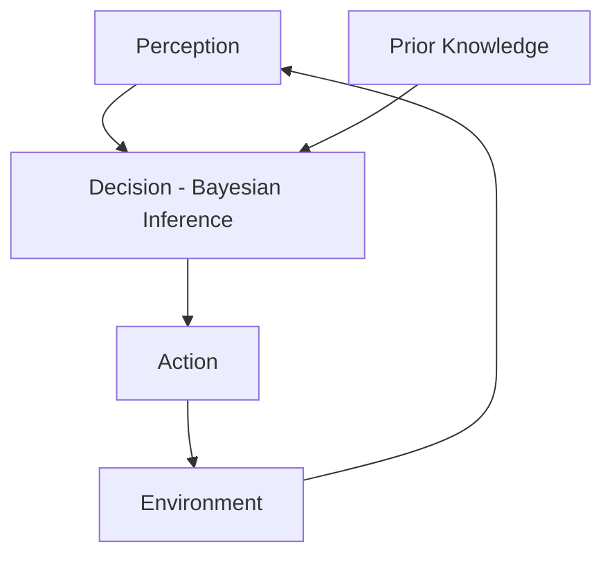

# 基于贝叶斯方法的AI Agent不确定性处理

> 关键词：贝叶斯方法、AI Agent、不确定性处理、概率推理、机器学习

> 摘要：本文围绕基于贝叶斯方法的AI Agent不确定性处理展开深入探讨。首先介绍了相关背景，包括目的范围、预期读者等。接着阐述了核心概念，分析了贝叶斯方法与AI Agent的联系，并给出了相应的架构示意图和流程图。详细讲解了核心算法原理，通过Python代码进行具体实现。从数学角度给出了模型和公式，并举例说明。通过项目实战展示了具体代码案例及详细解释。探讨了该技术的实际应用场景，推荐了学习所需的工具和资源。最后总结了未来发展趋势与挑战，还提供了常见问题解答和扩展阅读参考资料，旨在为读者全面呈现基于贝叶斯方法的AI Agent不确定性处理的技术全貌。

## 1. 背景介绍 
### 1.1 目的和范围
在人工智能领域，AI Agent 面临着各种不确定性，如环境信息的不完整、传感器噪声等。贝叶斯方法提供了一种强大的工具来处理这些不确定性。本文的目的是深入探讨如何利用贝叶斯方法来处理 AI Agent 中的不确定性问题。范围涵盖了贝叶斯方法的基本原理、与 AI Agent 的结合、核心算法实现、数学模型分析、实际项目应用以及未来发展趋势等方面。

### 1.2 预期读者
本文预期读者包括人工智能领域的研究人员、开发者、学生以及对贝叶斯方法和 AI Agent 感兴趣的技术爱好者。对于有一定概率论和机器学习基础的读者，阅读本文将有助于他们深入理解和应用基于贝叶斯方法的不确定性处理技术；对于初学者，通过本文可以初步了解相关概念和方法。

### 1.3 文档结构概述
本文将按照以下结构进行阐述：首先介绍核心概念与联系，包括贝叶斯方法和 AI Agent 的基本概念以及它们之间的关系，并给出相应的架构图和流程图；接着讲解核心算法原理，通过 Python 代码详细展示算法实现；然后介绍数学模型和公式，并举例说明；通过项目实战展示代码案例及详细解释；探讨实际应用场景；推荐学习所需的工具和资源；总结未来发展趋势与挑战；提供常见问题解答和扩展阅读参考资料。

### 1.4 术语表
#### 1.4.1 核心术语定义
- **贝叶斯方法**：基于贝叶斯定理的统计推断方法，用于根据新的证据更新对某个事件的先验概率，得到后验概率。
- **AI Agent**：能够感知环境、进行决策并采取行动的人工智能实体。
- **不确定性处理**：对系统中存在的不确定性信息进行分析、建模和管理的过程。
- **概率推理**：基于概率模型进行推理和决策的过程。

#### 1.4.2 相关概念解释
- **先验概率**：在获得新证据之前，对某个事件发生的概率的估计。
- **后验概率**：在考虑了新证据之后，对某个事件发生的概率的更新估计。
- **似然函数**：表示在给定模型参数的情况下，观测数据出现的概率。

#### 1.4.3 缩略词列表
- **AI**：Artificial Intelligence，人工智能
- **PDF**：Probability Density Function，概率密度函数

## 2. 核心概念与联系 
### 核心概念原理
#### 贝叶斯方法
贝叶斯方法的核心是贝叶斯定理，它描述了如何根据新的证据更新对某个事件的先验概率，得到后验概率。贝叶斯定理的数学表达式为：

$$P(A|B)=\frac{P(B|A)P(A)}{P(B)}$$

其中，$P(A|B)$ 是在事件 $B$ 发生的条件下事件 $A$ 发生的后验概率；$P(B|A)$ 是在事件 $A$ 发生的条件下事件 $B$ 发生的似然概率；$P(A)$ 是事件 $A$ 的先验概率；$P(B)$ 是事件 $B$ 的边缘概率。

#### AI Agent
AI Agent 是一个能够感知环境、进行决策并采取行动的实体。它通常由感知模块、决策模块和行动模块组成。感知模块负责收集环境信息，决策模块根据感知到的信息和内部状态进行决策，行动模块则根据决策结果采取相应的行动。

### 贝叶斯方法与AI Agent的联系
在 AI Agent 中，由于环境信息的不确定性，决策过程往往面临着各种风险。贝叶斯方法可以帮助 AI Agent 处理这些不确定性。通过将先验知识和新的观测数据相结合，AI Agent 可以利用贝叶斯定理更新对环境状态的估计，从而做出更合理的决策。例如，在机器人导航中，机器人可以根据先验地图和当前传感器的观测数据，使用贝叶斯方法更新对自身位置的估计，进而规划出更准确的路径。

### 架构的文本示意图
```plaintext
+-------------------+
|     AI Agent      |
| +---------------+ |
| |  Perception   | |
| +---------------+ |
| |  Decision     | |
| | (Bayesian)    | |
| +---------------+ |
| |  Action       | |
| +---------------+ |
+-------------------+
|     Environment   |
+-------------------+
```
在这个架构中，AI Agent 的感知模块从环境中获取信息，决策模块使用贝叶斯方法对这些信息进行处理，根据先验知识和新的观测数据更新对环境状态的估计，从而做出决策。行动模块根据决策结果在环境中采取相应的行动。

### Mermaid 流程图

这个流程图展示了 AI Agent 的工作流程。感知模块从环境中获取信息，决策模块结合先验知识进行贝叶斯推理，做出决策。行动模块根据决策结果在环境中采取行动，环境的反馈又会被感知模块获取，形成一个闭环。

## 3. 核心算法原理 & 具体操作步骤 
### 核心算法原理
基于贝叶斯方法的 AI Agent 不确定性处理的核心算法是贝叶斯推理。贝叶斯推理的基本步骤如下：
1. **定义先验概率**：根据先验知识，确定事件的先验概率分布。
2. **收集观测数据**：通过感知模块收集环境中的观测数据。
3. **计算似然函数**：根据观测数据和模型，计算似然函数。
4. **更新后验概率**：使用贝叶斯定理，结合先验概率和似然函数，更新后验概率。
5. **根据后验概率进行决策**：根据更新后的后验概率，做出决策。

### 具体操作步骤及Python源代码实现
下面以一个简单的二分类问题为例，详细说明基于贝叶斯方法的不确定性处理的具体操作步骤，并给出 Python 代码实现。

假设我们有一个二分类问题，类别标签为 $C_1$ 和 $C_2$，我们要根据观测特征 $X$ 来判断样本属于哪个类别。

```python
import numpy as np

# 步骤 1: 定义先验概率
prior_prob_C1 = 0.6
prior_prob_C2 = 0.4

# 步骤 2: 假设我们已经收集到了观测数据
# 这里简单假设观测特征 X 是一个数值
observation_X = 2.5

# 步骤 3: 定义似然函数
# 假设类别 C1 和 C2 的特征服从不同的高斯分布
# 类别 C1 的高斯分布参数
mu_C1 = 1.0
sigma_C1 = 0.5

# 类别 C2 的高斯分布参数
mu_C2 = 3.0
sigma_C2 = 0.8

def likelihood(X, mu, sigma):
    """
    计算高斯分布的似然函数
    """
    return (1 / (np.sqrt(2 * np.pi) * sigma)) * np.exp(-((X - mu) ** 2) / (2 * sigma ** 2))

# 计算似然函数值
likelihood_C1 = likelihood(observation_X, mu_C1, sigma_C1)
likelihood_C2 = likelihood(observation_X, mu_C2, sigma_C2)

# 步骤 4: 计算边缘概率 P(X)
# 根据全概率公式 P(X) = P(X|C1)P(C1) + P(X|C2)P(C2)
marginal_prob_X = likelihood_C1 * prior_prob_C1 + likelihood_C2 * prior_prob_C2

# 步骤 5: 更新后验概率
posterior_prob_C1 = (likelihood_C1 * prior_prob_C1) / marginal_prob_X
posterior_prob_C2 = (likelihood_C2 * prior_prob_C2) / marginal_prob_X

# 步骤 6: 根据后验概率进行决策
if posterior_prob_C1 > posterior_prob_C2:
    decision = 'C1'
else:
    decision = 'C2'

print(f"后验概率 P(C1|X): {posterior_prob_C1}")
print(f"后验概率 P(C2|X): {posterior_prob_C2}")
print(f"决策结果: {decision}")
```
在上述代码中，我们首先定义了先验概率，然后根据观测数据计算了似然函数。接着，使用全概率公式计算了边缘概率，最后使用贝叶斯定理更新了后验概率，并根据后验概率做出了决策。

## 4. 数学模型和公式 & 详细讲解 & 举例说明 
### 数学模型和公式
#### 贝叶斯定理
如前文所述，贝叶斯定理的数学表达式为：

$$P(A|B)=\frac{P(B|A)P(A)}{P(B)}$$

在 AI Agent 的不确定性处理中，$A$ 通常表示环境的状态，$B$ 表示观测数据。$P(A)$ 是环境状态的先验概率，$P(B|A)$ 是在给定环境状态下观测数据出现的似然概率，$P(B)$ 是观测数据的边缘概率，$P(A|B)$ 是在观测到数据 $B$ 后环境状态的后验概率。

#### 全概率公式
全概率公式用于计算边缘概率 $P(B)$，其表达式为：

$$P(B)=\sum_{i}P(B|A_i)P(A_i)$$

其中，$A_i$ 是所有可能的环境状态。

### 详细讲解
贝叶斯定理的核心思想是根据新的证据（观测数据）更新对某个事件（环境状态）的先验概率，得到后验概率。先验概率反映了我们在没有观测数据之前对环境状态的估计，似然概率表示在给定环境状态下观测数据出现的可能性，边缘概率是所有可能环境状态下观测数据出现的总概率。通过贝叶斯定理，我们可以将先验知识和新的观测数据相结合，得到更准确的后验概率估计。

### 举例说明
假设我们有一个智能机器人在一个房间中导航，房间中有两个区域：安全区域 $S$ 和危险区域 $D$。机器人的任务是根据传感器的观测数据判断自己当前所在的区域。

- **先验概率**：根据地图信息，我们知道安全区域的面积较大，因此可以估计先验概率 $P(S)=0.8$，$P(D)=0.2$。
- **似然函数**：假设机器人的传感器可以检测到某种信号 $X$，在安全区域检测到信号 $X$ 的概率为 $P(X|S)=0.3$，在危险区域检测到信号 $X$ 的概率为 $P(X|D)=0.7$。
- **边缘概率**：根据全概率公式，计算观测到信号 $X$ 的边缘概率：

$$P(X)=P(X|S)P(S)+P(X|D)P(D)=0.3\times0.8 + 0.7\times0.2 = 0.38$$

- **后验概率**：使用贝叶斯定理计算在观测到信号 $X$ 后，机器人处于安全区域和危险区域的后验概率：

$$P(S|X)=\frac{P(X|S)P(S)}{P(X)}=\frac{0.3\times0.8}{0.38}\approx0.63$$

$$P(D|X)=\frac{P(X|D)P(D)}{P(X)}=\frac{0.7\times0.2}{0.38}\approx0.37$$

根据后验概率，机器人可以判断自己更有可能处于安全区域。

## 5. 项目实战：代码实际案例和详细解释说明 
### 5.1  开发环境搭建
在进行基于贝叶斯方法的 AI Agent 不确定性处理项目实战时，我们可以使用 Python 作为开发语言。以下是搭建开发环境的步骤：
1. **安装 Python**：从 Python 官方网站（https://www.python.org/downloads/）下载并安装 Python 3.x 版本。
2. **安装必要的库**：我们需要安装一些常用的 Python 库，如 `numpy`、`scikit-learn` 等。可以使用 `pip` 命令进行安装：

```sh
pip install numpy scikit-learn
```

### 5.2  源代码详细实现和代码解读
下面我们以一个简单的文本分类问题为例，展示如何使用贝叶斯方法进行不确定性处理。

```python
from sklearn.datasets import fetch_20newsgroups
from sklearn.feature_extraction.text import TfidfVectorizer
from sklearn.naive_bayes import MultinomialNB
from sklearn.model_selection import train_test_split
from sklearn.metrics import accuracy_score

# 步骤 1: 加载数据集
categories = ['alt.atheism', 'soc.religion.christian']
newsgroups = fetch_20newsgroups(subset='all', categories=categories)

# 步骤 2: 数据预处理
vectorizer = TfidfVectorizer()
X = vectorizer.fit_transform(newsgroups.data)
y = newsgroups.target

# 步骤 3: 划分训练集和测试集
X_train, X_test, y_train, y_test = train_test_split(X, y, test_size=0.2, random_state=42)

# 步骤 4: 训练贝叶斯分类器
clf = MultinomialNB()
clf.fit(X_train, y_train)

# 步骤 5: 预测并评估模型
y_pred = clf.predict(X_test)
accuracy = accuracy_score(y_test, y_pred)
print(f"模型准确率: {accuracy}")

# 步骤 6: 处理不确定性
# 获取预测概率
proba = clf.predict_proba(X_test)
for i in range(len(y_test)):
    print(f"样本 {i} 的真实标签: {newsgroups.target_names[y_test[i]]}")
    print(f"预测为 {newsgroups.target_names[0]} 的概率: {proba[i][0]}")
    print(f"预测为 {newsgroups.target_names[1]} 的概率: {proba[i][1]}")
    if abs(proba[i][0] - proba[i][1]) < 0.1:
        print("该样本的分类存在较大不确定性")
    print()
```

### 代码解读与分析
1. **数据加载**：使用 `fetch_20newsgroups` 函数从 20 Newsgroups 数据集中加载两个类别的文本数据。
2. **数据预处理**：使用 `TfidfVectorizer` 将文本数据转换为 TF-IDF 特征向量。
3. **数据集划分**：使用 `train_test_split` 函数将数据集划分为训练集和测试集。
4. **模型训练**：使用 `MultinomialNB` 训练一个多项式朴素贝叶斯分类器。
5. **模型评估**：使用 `accuracy_score` 函数计算模型的准确率。
6. **不确定性处理**：使用 `predict_proba` 方法获取每个样本的预测概率，通过比较两个类别的预测概率差值，判断样本的分类是否存在较大不确定性。

## 6. 实际应用场景 
### 机器人导航
在机器人导航中，环境信息往往是不确定的，如传感器测量误差、地图不精确等。贝叶斯方法可以帮助机器人处理这些不确定性。机器人可以根据先验地图和当前传感器的观测数据，使用贝叶斯定理更新对自身位置的估计，从而规划出更准确的路径。例如，在室内导航中，机器人可以根据激光雷达的观测数据和先验地图，使用贝叶斯滤波算法（如卡尔曼滤波、粒子滤波）来估计自身位置。

### 医疗诊断
在医疗诊断中，医生需要根据患者的症状、检查结果等信息做出诊断决策。然而，这些信息往往是不确定的，如症状可能不典型、检查结果存在误差等。贝叶斯方法可以帮助医生处理这些不确定性。医生可以根据先验知识（如疾病的发病率）和患者的观测数据（如症状、检查结果），使用贝叶斯定理计算各种疾病的后验概率，从而做出更合理的诊断决策。

### 金融风险评估
在金融领域，投资者需要评估各种投资项目的风险。然而，市场信息是不确定的，如股票价格波动、宏观经济环境变化等。贝叶斯方法可以帮助投资者处理这些不确定性。投资者可以根据先验知识（如历史数据、市场趋势）和当前的市场信息，使用贝叶斯定理更新对投资项目风险的估计，从而做出更明智的投资决策。

## 7. 工具和资源推荐
### 7.1 学习资源推荐
#### 7.1.1 书籍推荐
- 《概率论与数理统计》：这本书是概率论和数理统计的经典教材，涵盖了贝叶斯方法的基本原理和应用。
- 《机器学习》（周志华）：这本书系统地介绍了机器学习的基本概念、算法和应用，其中包括贝叶斯分类器等内容。
- 《人工智能：一种现代的方法》：这本书是人工智能领域的经典教材，对 AI Agent 和不确定性处理等内容进行了深入的讲解。

#### 7.1.2 在线课程
- Coursera 上的 “Probabilistic Graphical Models” 课程：该课程由斯坦福大学的教授授课，深入介绍了概率图模型，包括贝叶斯网络等内容。
- edX 上的 “Artificial Intelligence” 课程：该课程由伯克利大学的教授授课，涵盖了 AI Agent、不确定性处理等人工智能的核心内容。

#### 7.1.3 技术博客和网站
- Towards Data Science：这是一个专注于数据科学和机器学习的技术博客，上面有很多关于贝叶斯方法和 AI Agent 的文章。
- arXiv：这是一个预印本平台，上面有很多关于人工智能和贝叶斯方法的最新研究成果。

### 7.2 开发工具框架推荐
#### 7.2.1 IDE和编辑器
- PyCharm：这是一个专业的 Python 集成开发环境，提供了丰富的代码编辑、调试和项目管理功能。
- Jupyter Notebook：这是一个交互式的开发环境，适合进行数据分析和机器学习实验。

#### 7.2.2 调试和性能分析工具
- pdb：Python 自带的调试工具，可以帮助开发者调试 Python 代码。
- cProfile：Python 自带的性能分析工具，可以分析代码的运行时间和函数调用情况。

#### 7.2.3 相关框架和库
- scikit-learn：这是一个常用的机器学习库，提供了多种贝叶斯分类器的实现，如朴素贝叶斯分类器。
- PyMC3：这是一个用于概率编程的 Python 库，支持贝叶斯建模和推理。

### 7.3 相关论文著作推荐
#### 7.3.1 经典论文
- “Naive Bayes Classifiers”：这篇论文介绍了朴素贝叶斯分类器的基本原理和应用。
- “Probabilistic Robotics”：这篇论文探讨了如何使用概率方法处理机器人导航中的不确定性问题。

#### 7.3.2 最新研究成果
- 可以通过 arXiv、IEEE Xplore 等平台搜索关于基于贝叶斯方法的 AI Agent 不确定性处理的最新研究成果。

#### 7.3.3 应用案例分析
- 一些学术会议（如 AAAI、ICML、NeurIPS 等）的论文集中会有很多关于贝叶斯方法在 AI Agent 中的应用案例分析，可以从中学习到实际应用中的经验和技巧。

## 8. 总结：未来发展趋势与挑战
### 未来发展趋势
- **与深度学习的融合**：贝叶斯方法可以为深度学习提供不确定性估计，从而提高深度学习模型的可靠性和可解释性。未来，贝叶斯方法与深度学习的融合将成为一个重要的研究方向。
- **多模态数据处理**：随着传感器技术的发展，AI Agent 可以获取多种模态的数据，如视觉、听觉、触觉等。贝叶斯方法可以帮助 AI Agent 处理多模态数据中的不确定性，提高决策的准确性。
- **强化学习中的应用**：在强化学习中，智能体需要在不确定的环境中进行决策。贝叶斯方法可以帮助智能体处理环境的不确定性，提高学习效率和性能。

### 挑战
- **计算复杂度**：贝叶斯推理的计算复杂度通常较高，尤其是在处理大规模数据和复杂模型时。如何降低计算复杂度是一个亟待解决的问题。
- **先验知识的获取**：贝叶斯方法需要先验知识，而先验知识的获取往往是困难的。如何有效地获取和利用先验知识是一个挑战。
- **模型的可扩展性**：随着 AI Agent 应用场景的不断扩大，模型的可扩展性变得越来越重要。如何设计具有良好可扩展性的贝叶斯模型是一个需要研究的问题。

## 9. 附录：常见问题与解答
### 问题 1：贝叶斯方法和传统的统计方法有什么区别？
贝叶斯方法和传统的统计方法的主要区别在于对概率的理解和处理方式。传统的统计方法通常基于频率主义的观点，将概率看作是事件发生的频率的极限。而贝叶斯方法基于贝叶斯主义的观点，将概率看作是对某个事件的信任程度。贝叶斯方法允许在推理过程中引入先验知识，并根据新的证据更新先验概率，得到后验概率。

### 问题 2：如何选择合适的先验概率？
选择合适的先验概率是贝叶斯方法中的一个关键问题。一般来说，可以根据以下几种方法选择先验概率：
- **基于历史数据**：如果有历史数据，可以根据历史数据的统计结果来估计先验概率。
- **专家经验**：可以咨询领域专家，根据专家的经验来确定先验概率。
- **无信息先验**：在缺乏先验知识的情况下，可以使用无信息先验，如均匀分布。

### 问题 3：贝叶斯方法在处理高维数据时会遇到什么问题？
贝叶斯方法在处理高维数据时会遇到计算复杂度高和数据稀疏性的问题。在高维空间中，数据点变得非常稀疏，导致似然函数的计算变得困难。此外，高维数据的先验概率分布也很难确定。为了解决这些问题，可以采用降维技术、稀疏模型等方法。

## 10. 扩展阅读 & 参考资料
### 扩展阅读
- 《贝叶斯数据分析》：这本书深入介绍了贝叶斯数据分析的方法和应用。
- 《统计学习方法》：这本书对机器学习中的统计学习方法进行了系统的介绍，包括贝叶斯方法。

### 参考资料
- Murphy, K. P. (2012). Machine Learning: A Probabilistic Perspective. MIT press.
- Bishop, C. M. (2006). Pattern Recognition and Machine Learning. Springer.

作者：AI天才研究院/AI Genius Institute & 禅与计算机程序设计艺术 /Zen And The Art of Computer Programming