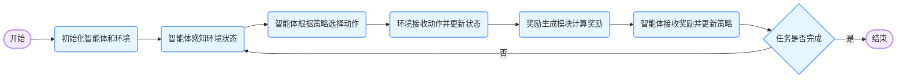

# 基于过程的奖励模型(PRM):原理与应用

> 关键词：基于过程的奖励模型、PRM、强化学习、奖励机制、应用场景

> 摘要：本文围绕基于过程的奖励模型（PRM）展开深入探讨。首先介绍了PRM提出的背景、适用读者群体以及文档的整体结构和相关术语。接着详细阐述了PRM的核心概念、算法原理、数学模型，并结合Python代码进行了具体的操作步骤讲解。通过项目实战案例，展示了PRM在实际开发中的应用过程。然后分析了PRM在不同领域的实际应用场景，推荐了学习、开发所需的工具和资源，包括书籍、在线课程、技术博客、开发工具框架以及相关论文著作等。最后对PRM的未来发展趋势与挑战进行了总结，并提供了常见问题的解答和扩展阅读的参考资料，旨在为读者全面深入地理解和应用PRM提供有价值的指导。

## 1. 背景介绍 
### 1.1 目的和范围
在强化学习领域，传统的奖励模型往往更侧重于结果导向，即根据最终的任务完成情况给予奖励。然而，在许多复杂的实际问题中，仅仅关注结果可能无法有效地引导智能体学习到最优策略。基于过程的奖励模型（PRM）应运而生，其目的在于考虑智能体在执行任务过程中的中间状态和动作，为智能体提供更细致、更及时的反馈，从而加速学习过程，提高学习效率。

本文的范围涵盖了PRM的核心概念、算法原理、数学模型、实际应用场景，以及相关的工具和资源推荐等方面。通过对这些内容的详细介绍，帮助读者全面了解PRM，并能够在实际项目中应用该模型。

### 1.2 预期读者
本文预期读者包括人工智能、机器学习、强化学习领域的研究人员和开发者，希望深入了解基于过程的奖励模型的原理和应用；高校相关专业的学生，作为学习强化学习和奖励机制的参考资料；对智能系统设计和优化感兴趣的工程师，用于改进现有系统的学习效率和性能。

### 1.3 文档结构概述
本文将按照以下结构进行组织：首先介绍PRM的背景信息，包括目的、预期读者、文档结构和术语表；接着阐述PRM的核心概念和联系，通过文本示意图和Mermaid流程图进行直观展示；然后详细讲解PRM的核心算法原理和具体操作步骤，并结合Python代码进行说明；之后介绍PRM的数学模型和公式，并举例说明；通过项目实战案例，展示PRM在实际开发中的应用；分析PRM在不同领域的实际应用场景；推荐学习和开发所需的工具和资源；最后总结PRM的未来发展趋势与挑战，提供常见问题的解答和扩展阅读的参考资料。

### 1.4 术语表
#### 1.4.1 核心术语定义
- **基于过程的奖励模型（PRM）**：一种在强化学习中，不仅关注任务最终结果，还考虑智能体在执行任务过程中的中间状态和动作，并给予相应奖励的模型。
- **强化学习**：一种机器学习范式，智能体通过与环境进行交互，根据环境反馈的奖励信号来学习最优策略，以最大化长期累积奖励。
- **智能体**：在强化学习中，能够感知环境状态并采取行动的实体。
- **环境**：智能体所处的外部世界，它接收智能体的动作并返回新的状态和奖励信号。
- **策略**：智能体根据当前环境状态选择动作的规则。

#### 1.4.2 相关概念解释
- **奖励信号**：环境反馈给智能体的数值，用于表示智能体当前动作的好坏。在PRM中，奖励信号不仅取决于最终结果，还与中间过程相关。
- **状态**：环境的一种描述，包含了智能体执行任务所需的信息。状态可以是连续的或离散的。
- **动作**：智能体在某个状态下可以采取的行为。动作集合可以是有限的或无限的。

#### 1.4.3 缩略词列表
- **PRM**：基于过程的奖励模型（Process-based Reward Model）
- **RL**：强化学习（Reinforcement Learning）

## 2. 核心概念与联系 
### 核心概念原理
基于过程的奖励模型（PRM）的核心思想是在强化学习中引入对智能体执行任务过程的关注。传统的奖励模型通常只在任务结束时给予一个最终奖励，这可能导致智能体在学习过程中需要进行大量的试错，因为它无法及时了解自己的行为是否朝着正确的方向发展。

PRM则通过定义一系列与中间状态和动作相关的奖励函数，为智能体提供更细致的反馈。例如，在机器人导航任务中，除了到达目标位置给予一个最终奖励外，还可以根据机器人的移动方向、与障碍物的距离等中间状态给予即时奖励。这样，智能体可以更快地学习到哪些动作是有益的，从而加速学习过程。

### 架构的文本示意图
```plaintext
智能体 <---- 动作 ----> 环境
         <---- 状态 ---->
         <---- 奖励 ---->

奖励生成模块
|-- 最终结果奖励函数
|-- 中间过程奖励函数
    |-- 状态相关奖励
    |-- 动作相关奖励
```
上述示意图展示了基于过程的奖励模型的基本架构。智能体与环境进行交互，执行动作并接收环境反馈的状态和奖励。奖励生成模块负责根据最终结果和中间过程生成奖励信号，其中中间过程奖励函数又分为状态相关奖励和动作相关奖励。

### Mermaid流程图

该流程图展示了基于过程的奖励模型在强化学习中的工作流程。从初始化智能体和环境开始，智能体不断感知环境状态、选择动作，环境更新状态并由奖励生成模块计算奖励，智能体根据奖励更新策略，直到任务完成。

## 3. 核心算法原理 & 具体操作步骤 
### 核心算法原理
基于过程的奖励模型（PRM）的核心算法主要基于强化学习的基本框架，结合了对中间过程的奖励设计。在强化学习中，智能体的目标是学习一个最优策略 $\pi$，使得长期累积奖励最大化。累积奖励通常定义为：

$$ G_t = \sum_{k=0}^{\infty} \gamma^k r_{t+k+1} $$

其中，$G_t$ 是从时间步 $t$ 开始的累积奖励，$r_{t+k+1}$ 是时间步 $t + k + 1$ 时的奖励，$\gamma$ 是折扣因子，用于权衡未来奖励的重要性。

在PRM中，奖励 $r_{t}$ 由最终结果奖励 $r_{final}$ 和中间过程奖励 $r_{intermediate}$ 组成：

$$ r_{t} = r_{final} + r_{intermediate} $$

中间过程奖励 $r_{intermediate}$ 可以进一步细分为状态相关奖励 $r_{state}$ 和动作相关奖励 $r_{action}$：

$$ r_{intermediate} = r_{state} + r_{action} $$

### 具体操作步骤
以下是基于PRM的强化学习算法的具体操作步骤：

1. **初始化**：初始化智能体的策略 $\pi$、环境的初始状态 $s_0$、折扣因子 $\gamma$ 和学习率 $\alpha$。
2. **循环执行**：
    - 智能体感知当前环境状态 $s_t$。
    - 智能体根据策略 $\pi$ 选择动作 $a_t$。
    - 环境接收动作 $a_t$ 并更新状态为 $s_{t+1}$。
    - 奖励生成模块计算奖励 $r_t$，包括最终结果奖励 $r_{final}$ 和中间过程奖励 $r_{intermediate}$。
    - 智能体根据奖励 $r_t$ 和新状态 $s_{t+1}$ 更新策略 $\pi$。
3. **终止条件**：当满足终止条件（如达到最大时间步数或完成任务）时，算法结束。

### Python源代码实现
```python
import numpy as np

# 定义环境类
class Environment:
    def __init__(self):
        # 初始化环境状态
        self.state = 0
        # 定义动作空间
        self.action_space = [0, 1]
        # 定义任务是否完成的标志
        self.done = False

    def step(self, action):
        # 根据动作更新环境状态
        if action == 0:
            self.state -= 1
        else:
            self.state += 1

        # 判断是否达到终止状态
        if self.state >= 5:
            self.done = True
            reward = 10  # 最终结果奖励
        else:
            # 中间过程奖励：根据状态给予奖励
            r_state = self.state * 0.1
            # 动作相关奖励：选择动作1给予额外奖励
            r_action = 0.2 if action == 1 else 0
            reward = r_state + r_action

        return self.state, reward, self.done

    def reset(self):
        # 重置环境状态
        self.state = 0
        self.done = False
        return self.state

# 定义智能体类
class Agent:
    def __init__(self, action_space):
        # 初始化动作空间
        self.action_space = action_space
        # 初始化策略：随机策略
        self.policy = {0: 0.5, 1: 0.5}

    def choose_action(self):
        # 根据策略选择动作
        actions = list(self.policy.keys())
        probabilities = list(self.policy.values())
        action = np.random.choice(actions, p=probabilities)
        return action

    def update_policy(self, state, action, reward):
        # 简单的策略更新：根据奖励调整策略
        if reward > 0:
            # 增加选择该动作的概率
            self.policy[action] += 0.1
            # 调整其他动作的概率
            other_action = 1 - action
            self.policy[other_action] = 1 - self.policy[action]
        else:
            # 减少选择该动作的概率
            self.policy[action] -= 0.1
            # 调整其他动作的概率
            other_action = 1 - action
            self.policy[other_action] = 1 - self.policy[action]

# 主函数
def main():
    # 创建环境和智能体
    env = Environment()
    agent = Agent(env.action_space)

    # 训练回合数
    num_episodes = 100

    for episode in range(num_episodes):
        # 重置环境
        state = env.reset()
        done = False

        while not done:
            # 智能体选择动作
            action = agent.choose_action()
            # 环境执行动作并返回新状态和奖励
            next_state, reward, done = env.step(action)
            # 智能体更新策略
            agent.update_policy(state, action, reward)
            state = next_state

        print(f"Episode {episode + 1} completed.")

if __name__ == "__main__":
    main()
```
上述代码实现了一个简单的基于PRM的强化学习示例。环境类 `Environment` 负责管理环境状态和计算奖励，智能体类 `Agent` 负责选择动作和更新策略。主函数 `main` 控制训练过程，通过多个回合的训练，智能体逐渐学习到最优策略。

## 4. 数学模型和公式 & 详细讲解 & 举例说明 
### 数学模型和公式
#### 累积奖励
在强化学习中，智能体的目标是最大化长期累积奖励 $G_t$，其数学公式为：

$$ G_t = \sum_{k=0}^{\infty} \gamma^k r_{t+k+1} $$

其中，$\gamma$ 是折扣因子，取值范围为 $[0, 1]$。$\gamma$ 越接近 1，表示智能体更看重未来的奖励；$\gamma$ 越接近 0，表示智能体更关注即时奖励。

#### 奖励分解
在基于过程的奖励模型（PRM）中，奖励 $r_t$ 由最终结果奖励 $r_{final}$ 和中间过程奖励 $r_{intermediate}$ 组成：

$$ r_t = r_{final} + r_{intermediate} $$

中间过程奖励 $r_{intermediate}$ 可以进一步细分为状态相关奖励 $r_{state}$ 和动作相关奖励 $r_{action}$：

$$ r_{intermediate} = r_{state} + r_{action} $$

#### 策略梯度
在强化学习中，常用策略梯度算法来更新智能体的策略。策略梯度的基本思想是通过计算策略关于累积奖励的梯度，来调整策略参数，使得累积奖励最大化。策略梯度的公式为：

$$ \nabla_{\theta} J(\theta) = \mathbb{E}_{\tau \sim \pi_{\theta}} \left[ \sum_{t=0}^{T} \nabla_{\theta} \log \pi_{\theta}(a_t | s_t) G_t \right] $$

其中，$\theta$ 是策略的参数，$J(\theta)$ 是策略的性能指标，$\pi_{\theta}(a_t | s_t)$ 是在状态 $s_t$ 下选择动作 $a_t$ 的概率，$\tau$ 是一个轨迹，包含了从初始状态到终止状态的所有状态和动作。

### 详细讲解
#### 累积奖励
累积奖励 $G_t$ 反映了智能体从时间步 $t$ 开始的长期收益。折扣因子 $\gamma$ 的作用是平衡即时奖励和未来奖励的重要性。例如，当 $\gamma = 0.9$ 时，未来第 $k$ 步的奖励对当前累积奖励的贡献会衰减为原来的 $0.9^k$ 倍。这是因为在实际应用中，未来的奖励往往具有不确定性，所以需要对其进行折扣。

#### 奖励分解
将奖励分解为最终结果奖励和中间过程奖励，可以为智能体提供更细致的反馈。最终结果奖励通常是一个较大的奖励，用于激励智能体完成任务。中间过程奖励则可以根据智能体的中间状态和动作给予即时奖励，帮助智能体更快地学习到正确的策略。例如，在机器人导航任务中，最终结果奖励可以是机器人到达目标位置时给予的奖励，中间过程奖励可以是机器人朝着目标方向移动时给予的奖励。

#### 策略梯度
策略梯度算法通过计算策略关于累积奖励的梯度，来更新策略参数。梯度的方向表示了策略参数应该调整的方向，使得累积奖励增加。通过不断地更新策略参数，智能体可以逐渐学习到最优策略。

### 举例说明
假设我们有一个简单的网格世界环境，智能体需要从起点移动到终点。环境的状态是智能体在网格中的位置，动作是上下左右四个方向的移动。

- **最终结果奖励**：当智能体到达终点时，给予一个最终结果奖励 $r_{final} = 10$。
- **中间过程奖励**：
    - **状态相关奖励**：智能体每靠近终点一步，给予一个状态相关奖励 $r_{state} = 1$。
    - **动作相关奖励**：如果智能体选择的动作是朝着终点的方向，给予一个动作相关奖励 $r_{action} = 0.5$。

在某一时刻，智能体处于状态 $s_t$，选择动作 $a_t$ 后移动到状态 $s_{t+1}$。如果 $s_{t+1}$ 比 $s_t$ 更靠近终点，且动作 $a_t$ 是朝着终点的方向，则奖励 $r_t$ 为：

$$ r_t = r_{final} + r_{state} + r_{action} = 0 + 1 + 0.5 = 1.5 $$

如果智能体到达终点，则奖励 $r_t$ 为：

$$ r_t = r_{final} + r_{state} + r_{action} = 10 + 0 + 0 = 10 $$

通过这种方式，智能体可以在移动过程中不断获得反馈，从而更快地学习到到达终点的最优策略。

## 5. 项目实战：代码实际案例和详细解释说明 
### 5.1  开发环境搭建
#### 操作系统
本项目可以在多种操作系统上进行开发，如Windows、Linux（如Ubuntu）和macOS。建议使用较新的操作系统版本，以确保兼容性和稳定性。

#### Python环境
本项目使用Python进行开发，建议使用Python 3.7及以上版本。可以从Python官方网站（https://www.python.org/downloads/）下载并安装Python。

#### 依赖库安装
项目中使用了一些常见的Python库，如 `numpy`。可以使用 `pip` 工具进行安装：
```sh
pip install numpy
```

### 5.2  源代码详细实现和代码解读
以下是一个完整的基于过程的奖励模型（PRM）的项目实战代码，以一个简单的迷宫导航任务为例：

```python
import numpy as np

# 定义迷宫环境类
class MazeEnvironment:
    def __init__(self):
        # 迷宫布局，0表示通路，1表示墙壁
        self.maze = np.array([
            [0, 1, 0, 0],
            [0, 1, 0, 1],
            [0, 0, 0, 0],
            [0, 1, 1, 0]
        ])
        # 起点和终点坐标
        self.start = (0, 0)
        self.goal = (3, 3)
        # 当前位置
        self.current_position = self.start
        # 动作空间：上、下、左、右
        self.action_space = [0, 1, 2, 3]
        # 任务是否完成的标志
        self.done = False

    def step(self, action):
        # 保存当前位置
        current_x, current_y = self.current_position

        # 根据动作更新位置
        if action == 0:  # 上
            new_x, new_y = current_x - 1, current_y
        elif action == 1:  # 下
            new_x, new_y = current_x + 1, current_y
        elif action == 2:  # 左
            new_x, new_y = current_x, current_y - 1
        else:  # 右
            new_x, new_y = current_x, current_y + 1

        # 检查新位置是否合法
        if 0 <= new_x < self.maze.shape[0] and 0 <= new_y < self.maze.shape[1] and self.maze[new_x, new_y] == 0:
            self.current_position = (new_x, new_y)
        else:
            # 撞到墙壁，位置不变
            pass

        # 计算奖励
        if self.current_position == self.goal:
            self.done = True
            reward = 10  # 最终结果奖励
        else:
            # 中间过程奖励：根据与终点的距离给予奖励
            distance = np.linalg.norm(np.array(self.current_position) - np.array(self.goal))
            r_state = 1 / (distance + 1)
            # 动作相关奖励：如果动作朝着终点方向，给予额外奖励
            dx_goal = self.goal[0] - current_x
            dy_goal = self.goal[1] - current_y
            if ((action == 0 and dx_goal < 0) or (action == 1 and dx_goal > 0) or
                    (action == 2 and dy_goal < 0) or (action == 3 and dy_goal > 0)):
                r_action = 0.5
            else:
                r_action = 0
            reward = r_state + r_action

        return self.current_position, reward, self.done

    def reset(self):
        # 重置环境状态
        self.current_position = self.start
        self.done = False
        return self.current_position

# 定义智能体类
class MazeAgent:
    def __init__(self, action_space):
        # 初始化动作空间
        self.action_space = action_space
        # 初始化策略：随机策略
        self.policy = {0: 0.25, 1: 0.25, 2: 0.25, 3: 0.25}

    def choose_action(self):
        # 根据策略选择动作
        actions = list(self.policy.keys())
        probabilities = list(self.policy.values())
        action = np.random.choice(actions, p=probabilities)
        return action

    def update_policy(self, state, action, reward):
        # 简单的策略更新：根据奖励调整策略
        if reward > 0:
            # 增加选择该动作的概率
            self.policy[action] += 0.1
            # 调整其他动作的概率
            other_actions = [a for a in self.action_space if a!= action]
            for a in other_actions:
                self.policy[a] = (1 - self.policy[action]) / 3
        else:
            # 减少选择该动作的概率
            self.policy[action] -= 0.1
            # 调整其他动作的概率
            other_actions = [a for a in self.action_space if a!= action]
            for a in other_actions:
                self.policy[a] = (1 - self.policy[action]) / 3

# 主函数
def main():
    # 创建环境和智能体
    env = MazeEnvironment()
    agent = MazeAgent(env.action_space)

    # 训练回合数
    num_episodes = 100

    for episode in range(num_episodes):
        # 重置环境
        state = env.reset()
        done = False

        while not done:
            # 智能体选择动作
            action = agent.choose_action()
            # 环境执行动作并返回新状态和奖励
            next_state, reward, done = env.step(action)
            # 智能体更新策略
            agent.update_policy(state, action, reward)
            state = next_state

        print(f"Episode {episode + 1} completed.")

if __name__ == "__main__":
    main()
```

### 代码解读与分析
#### 迷宫环境类 `MazeEnvironment`
- **初始化**：在 `__init__` 方法中，定义了迷宫的布局、起点、终点、当前位置、动作空间和任务完成标志。
- **`step` 方法**：根据智能体选择的动作更新当前位置，并检查新位置是否合法。如果新位置合法，则更新当前位置；否则，位置不变。计算奖励时，分为最终结果奖励和中间过程奖励。最终结果奖励在智能体到达终点时给予，中间过程奖励包括状态相关奖励和动作相关奖励。状态相关奖励根据智能体与终点的距离计算，动作相关奖励根据动作是否朝着终点方向计算。
- **`reset` 方法**：重置环境状态，将当前位置设置为起点，任务完成标志设置为 `False`。

#### 智能体类 `MazeAgent`
- **初始化**：在 `__init__` 方法中，初始化动作空间和策略，采用随机策略。
- **`choose_action` 方法**：根据当前策略选择动作，使用 `np.random.choice` 函数根据动作的概率分布进行采样。
- **`update_policy` 方法**：根据奖励更新策略。如果奖励大于 0，则增加选择该动作的概率，同时调整其他动作的概率；如果奖励小于等于 0，则减少选择该动作的概率，同时调整其他动作的概率。

#### 主函数 `main`
- 创建迷宫环境和智能体。
- 进行多个回合的训练，每个回合开始时重置环境，智能体不断选择动作，环境执行动作并返回新状态和奖励，智能体根据奖励更新策略，直到任务完成。

通过这个项目实战，我们可以看到基于过程的奖励模型（PRM）如何在实际问题中应用，通过中间过程奖励为智能体提供更细致的反馈，帮助智能体更快地学习到最优策略。

## 6. 实际应用场景 
### 机器人导航
在机器人导航领域，基于过程的奖励模型（PRM）可以发挥重要作用。传统的奖励模型通常只在机器人到达目标位置时给予奖励，这可能导致机器人在学习过程中需要进行大量的随机探索，效率较低。

使用PRM可以为机器人提供更细致的反馈。例如，根据机器人的移动方向、与障碍物的距离、接近目标的程度等中间状态给予即时奖励。如果机器人朝着目标方向移动，且与障碍物保持安全距离，则给予正奖励；如果机器人撞到障碍物或远离目标方向，则给予负奖励。这样，机器人可以更快地学习到如何避开障碍物，朝着目标前进，提高导航效率。

### 游戏开发
在游戏开发中，PRM可以用于训练智能游戏角色。例如，在策略游戏中，智能角色需要根据不同的游戏状态做出决策，如选择建造建筑、训练部队等。传统的奖励模型可能只在游戏胜利时给予奖励，这使得智能角色难以在游戏过程中学习到有效的策略。

使用PRM可以在游戏过程中为智能角色提供即时奖励。例如，根据资源的收集情况、部队的训练进度、对敌方的攻击效果等中间状态给予奖励。这样，智能角色可以在游戏过程中不断学习和调整策略，提高游戏表现。

### 自动驾驶
在自动驾驶领域，PRM可以帮助自动驾驶车辆更快地学习到安全、高效的驾驶策略。传统的奖励模型通常只在车辆成功到达目的地时给予奖励，这可能导致车辆在学习过程中出现危险驾驶行为。

使用PRM可以根据车辆的行驶状态、与其他车辆和障碍物的距离、遵守交通规则的情况等中间状态给予即时奖励。例如，如果车辆保持安全的车速、与前车保持适当的距离、遵守交通信号灯等，则给予正奖励；如果车辆超速、闯红灯或发生碰撞，则给予负奖励。这样，自动驾驶车辆可以在行驶过程中不断学习和优化驾驶策略，提高行驶安全性和效率。

### 工业自动化
在工业自动化中，PRM可以用于优化生产过程。例如，在机器人操作任务中，机器人需要完成一系列的动作，如抓取、搬运、放置等。传统的奖励模型可能只在任务完成时给予奖励，这可能导致机器人在学习过程中出现错误操作，影响生产效率。

使用PRM可以根据机器人的动作执行情况、操作精度、生产效率等中间状态给予即时奖励。例如，如果机器人准确地抓取和放置物品，且操作时间较短，则给予正奖励；如果机器人出现错误操作或操作时间过长，则给予负奖励。这样，机器人可以在操作过程中不断学习和改进，提高生产效率和质量。

## 7. 工具和资源推荐
### 7.1 学习资源推荐
#### 7.1.1 书籍推荐
- 《强化学习：原理与Python实现》：本书系统地介绍了强化学习的基本原理和算法，并结合Python代码进行了详细的实现和讲解。对于学习基于过程的奖励模型（PRM），可以从书中了解强化学习的基础理论和常用算法，为深入理解PRM提供支持。
- 《动手学强化学习》：通过大量的实例和代码，帮助读者快速上手强化学习。书中包含了多个实际项目的案例，读者可以通过实践来加深对PRM的理解和应用。

#### 7.1.2 在线课程
- Coursera上的“强化学习专项课程”：由知名教授授课，涵盖了强化学习的各个方面，包括基于过程的奖励模型等高级内容。课程配有丰富的视频讲解、作业和项目实践，适合系统学习强化学习的读者。
- 网易云课堂上的“强化学习实战教程”：该课程注重实践，通过实际案例讲解强化学习的应用。课程中可能会涉及到基于过程的奖励模型在不同场景下的应用，帮助读者掌握PRM的实际应用技巧。

#### 7.1.3 技术博客和网站
- OpenAI官方博客：OpenAI是人工智能领域的领先研究机构，其官方博客会发布最新的研究成果和技术文章，包括强化学习和基于过程的奖励模型等方面的内容。读者可以通过关注该博客，了解行业最新动态。
- Medium上的强化学习相关专栏：Medium上有许多关于强化学习的优秀专栏，作者们会分享自己的研究经验和实践案例。读者可以从中获取不同视角的见解和实用的技巧。

### 7.2 开发工具框架推荐
#### 7.2.1 IDE和编辑器
- PyCharm：是一款专业的Python集成开发环境（IDE），具有强大的代码编辑、调试和自动补全功能。对于开发基于Python的强化学习项目，PyCharm可以提高开发效率。
- Jupyter Notebook：是一个交互式的开发环境，适合进行数据探索、模型实验和代码演示。在学习和研究基于过程的奖励模型时，Jupyter Notebook可以方便地进行代码编写和结果展示。

#### 7.2.2 调试和性能分析工具
- TensorBoard：是TensorFlow的可视化工具，可以用于监控模型的训练过程，如损失函数的变化、奖励的累积等。通过TensorBoard，开发者可以直观地了解模型的训练情况，及时发现问题并进行调整。
- cProfile：是Python的内置性能分析工具，可以用于分析代码的执行时间和函数调用情况。在优化基于过程的奖励模型的代码时，cProfile可以帮助开发者找出性能瓶颈，提高代码的运行效率。

#### 7.2.3 相关框架和库
- OpenAI Gym：是一个用于开发和比较强化学习算法的工具包，提供了各种不同类型的环境，如游戏、机器人控制等。使用OpenAI Gym可以方便地进行基于过程的奖励模型的实验和验证。
- Stable Baselines：是一个基于OpenAI Gym的强化学习库，提供了多种预训练的强化学习算法，如A2C、PPO等。开发者可以使用Stable Baselines快速实现基于过程的奖励模型，并进行训练和测试。

### 7.3 相关论文著作推荐
#### 7.3.1 经典论文
- “Reinforcement Learning: An Introduction”：由Richard S. Sutton和Andrew G. Barto所著，是强化学习领域的经典教材。书中对强化学习的基本概念、算法和理论进行了系统的介绍，对于理解基于过程的奖励模型的理论基础具有重要意义。
- “Proximal Policy Optimization Algorithms”：提出了近端策略优化（PPO）算法，是一种高效的强化学习算法。PPO算法在实际应用中取得了很好的效果，可以用于实现基于过程的奖励模型。

#### 7.3.2 最新研究成果
- 关注arXiv.org上关于强化学习和基于过程的奖励模型的最新论文。arXiv是一个预印本平台，许多研究人员会在上面发布他们的最新研究成果。通过阅读这些论文，读者可以了解该领域的最新研究动态和技术趋势。

#### 7.3.3 应用案例分析
- 查阅ACM、IEEE等学术会议和期刊上关于基于过程的奖励模型的应用案例分析论文。这些论文通常会详细介绍PRM在不同领域的应用场景、实现方法和实验结果，对于实际项目的开发具有参考价值。

## 8. 总结：未来发展趋势与挑战
### 未来发展趋势
#### 与深度学习的深度融合
随着深度学习技术的不断发展，基于过程的奖励模型（PRM）与深度学习的融合将成为未来的一个重要趋势。深度学习可以用于处理复杂的环境状态和动作空间，而PRM可以为深度学习模型提供更细致的奖励信号，从而提高模型的学习效率和性能。例如，将卷积神经网络（CNN）用于图像识别任务，结合PRM为智能体提供基于图像特征的奖励，使智能体能够更好地理解环境并做出决策。

#### 多智能体系统中的应用拓展
在多智能体系统中，智能体之间的交互和协作是一个重要的研究课题。PRM可以为多智能体系统中的智能体提供个性化的奖励信号，促进智能体之间的协作和竞争。例如，在自动驾驶场景中，多个自动驾驶车辆可以通过PRM学习到如何相互协作，避免碰撞，提高交通效率。

#### 应用领域的不断扩大
随着人工智能技术的广泛应用，PRM的应用领域也将不断扩大。除了现有的机器人导航、游戏开发、自动驾驶和工业自动化等领域，PRM还可以应用于医疗保健、金融投资、教育等领域。例如，在医疗保健领域，PRM可以用于训练智能医疗助手，根据患者的病情和治疗过程给予奖励，提高医疗服务的质量和效率。

### 挑战
#### 奖励设计的难度
奖励设计是基于过程的奖励模型的关键环节，但也是一个具有挑战性的任务。设计合理的奖励函数需要对任务的目标和环境有深入的理解，同时要考虑到奖励的平衡性和可解释性。如果奖励函数设计不当，可能会导致智能体学习到错误的策略，甚至陷入局部最优解。

#### 计算资源的需求
在实际应用中，基于过程的奖励模型通常需要大量的计算资源来进行训练和优化。特别是在处理复杂的环境和大规模的数据集时，计算资源的需求会更加显著。因此，如何有效地利用计算资源，提高训练效率，是一个需要解决的问题。

#### 模型的可解释性
随着基于过程的奖励模型的复杂性不断增加，模型的可解释性也成为一个重要的挑战。在许多实际应用中，人们不仅需要模型具有良好的性能，还需要能够理解模型的决策过程。然而，由于深度学习模型的黑盒特性，使得模型的可解释性成为一个难题。如何提高基于过程的奖励模型的可解释性，是未来研究的一个重要方向。

## 9. 附录：常见问题与解答
### 问题1：基于过程的奖励模型（PRM）与传统奖励模型有什么区别？
传统奖励模型通常只关注任务的最终结果，在任务完成时给予一个最终奖励。而PRM不仅考虑最终结果，还关注智能体在执行任务过程中的中间状态和动作，并根据这些中间信息给予即时奖励。PRM可以为智能体提供更细致的反馈，帮助智能体更快地学习到最优策略。

### 问题2：如何设计基于过程的奖励模型的奖励函数？
设计奖励函数需要考虑任务的目标和环境特点。一般来说，可以将奖励函数分为最终结果奖励和中间过程奖励。最终结果奖励可以根据任务的完成情况给予，如到达目标位置、完成特定任务等。中间过程奖励可以根据智能体的中间状态和动作来设计，如与目标的距离、动作的合理性等。在设计奖励函数时，需要注意奖励的平衡性和可解释性，避免奖励函数设计不当导致智能体学习到错误的策略。

### 问题3：基于过程的奖励模型需要大量的训练数据吗？
基于过程的奖励模型通常需要一定量的训练数据来学习到有效的策略。然而，与传统的奖励模型相比，PRM可以通过中间过程奖励为智能体提供更及时的反馈，从而减少训练所需的数据量。在实际应用中，可以根据任务的复杂程度和环境的特点来确定训练数据的规模。

### 问题4：基于过程的奖励模型在实际应用中可能会遇到哪些问题？
在实际应用中，基于过程的奖励模型可能会遇到以下问题：
- 奖励设计不合理：导致智能体学习到错误的策略。
- 计算资源不足：训练过程需要大量的计算资源，可能会导致训练时间过长或无法完成训练。
- 模型的可解释性差：由于模型的复杂性，难以理解模型的决策过程。
- 环境的不确定性：实际环境中可能存在各种不确定性因素，如噪声、干扰等，会影响模型的性能。

### 问题5：如何评估基于过程的奖励模型的性能？
评估基于过程的奖励模型的性能可以从多个方面进行，如累积奖励、任务完成时间、策略的稳定性等。可以通过在测试集上进行实验，记录智能体的累积奖励和任务完成时间，来评估模型的学习效率和性能。同时，还可以观察智能体的策略在不同环境下的稳定性，判断模型是否具有泛化能力。

## 10. 扩展阅读 & 参考资料
### 扩展阅读
- 《深度强化学习实战》：本书深入介绍了深度强化学习的算法和应用，对于理解基于过程的奖励模型在深度学习中的应用具有参考价值。
- 《人工智能：一种现代的方法》：涵盖了人工智能的各个领域，包括强化学习。通过阅读本书，可以了解强化学习在人工智能领域的地位和作用，以及与其他技术的结合应用。

### 参考资料
- Sutton, R. S., & Barto, A. G. (2018). Reinforcement Learning: An Introduction. MIT Press.
- Schulman, J., Wolski, F., Dhariwal, P., Radford, A., & Klimov, O. (2017). Proximal Policy Optimization Algorithms. arXiv preprint arXiv:1707.06347.
- OpenAI Gym官方文档：https://gym.openai.com/docs/
- Stable Baselines官方文档：https://stable-baselines.readthedocs.io/en/master/

作者：AI天才研究院/AI Genius Institute & 禅与计算机程序设计艺术 /Zen And The Art of Computer Programming