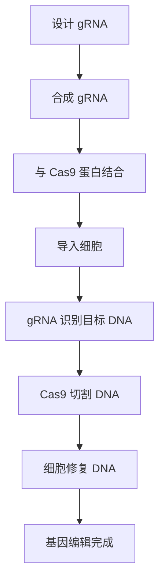

# 基因编辑技术的伦理争议与投资风险

> 关键词：基因编辑技术、伦理争议、投资风险、基因伦理、生物投资

> 摘要：本文深入探讨了基因编辑技术所引发的伦理争议以及相关的投资风险。首先介绍了基因编辑技术的背景，包括其目的、适用读者、文档结构和相关术语。接着阐述了基因编辑技术的核心概念、算法原理、数学模型等基础知识。通过项目实战案例展示了基因编辑技术的实际应用和代码实现。分析了基因编辑技术在不同场景下的实际应用，推荐了学习该技术的工具和资源。最后总结了基因编辑技术未来的发展趋势与挑战，解答了常见问题，并提供了扩展阅读和参考资料，旨在为读者全面呈现基因编辑技术在伦理和投资方面的复杂情况。

## 1. 背景介绍 
### 1.1 目的和范围
基因编辑技术近年来取得了巨大的突破，为治疗遗传性疾病、改善农作物性状等领域带来了新的希望。然而，这项技术也引发了广泛的伦理争议和投资风险。本文的目的在于全面分析基因编辑技术所面临的伦理问题以及投资者在涉足该领域时可能遇到的风险。范围涵盖了基因编辑技术的基本原理、伦理考量的各个方面、投资环境中的不确定因素，以及如何在伦理和投资之间找到平衡。

### 1.2 预期读者
本文预期读者包括对基因编辑技术感兴趣的科研人员、关注生物科技领域投资的投资者、从事生物伦理研究的学者、相关政策制定者以及对新兴技术伦理问题和投资机会有探索欲望的普通读者。通过阅读本文，读者可以了解基因编辑技术的复杂性，从而在各自的领域做出更明智的决策。

### 1.3 文档结构概述
本文将按照以下结构展开：首先介绍基因编辑技术的核心概念与联系，让读者对该技术有基本的认识；接着详细讲解核心算法原理和具体操作步骤，结合 Python 代码进行说明；阐述基因编辑技术的数学模型和公式，并举例说明其应用；通过项目实战案例，展示基因编辑技术在实际中的应用和代码实现；分析基因编辑技术的实际应用场景；推荐学习和开发基因编辑技术相关的工具和资源；总结基因编辑技术未来的发展趋势与挑战；提供常见问题的解答和扩展阅读参考资料。

### 1.4 术语表
#### 1.4.1 核心术语定义
- **基因编辑技术**：指对生物体基因组特定目标基因进行修饰的一种新兴技术，能够精确地改变 DNA 序列，包括 CRISPR - Cas9、TALENs、ZFNs 等技术。
- **伦理争议**：在基因编辑技术应用过程中，由于涉及到人类生命、尊严、社会公平等方面，引发的一系列道德和伦理层面的争论。
- **投资风险**：投资者在投资基因编辑技术相关企业或项目时，面临的由于技术不确定性、市场变化、政策法规等因素导致的损失可能性。

#### 1.4.2 相关概念解释
- **CRISPR - Cas9**：一种由 RNA 引导的核酸酶系统，可对特定 DNA 序列进行编辑。它来源于细菌的免疫系统，能够识别并切割外来的 DNA。
- **脱靶效应**：基因编辑过程中，核酸酶在非目标位点进行切割或编辑的现象，可能导致不可预测的基因突变和生物效应。
- **生殖系编辑**：对生殖细胞（精子、卵子或受精卵）进行基因编辑，这种编辑可以遗传给后代，引发了最为广泛的伦理争议。

#### 1.4.3 缩略词列表
- **CRISPR**：Clustered Regularly Interspaced Short Palindromic Repeats，成簇的规律间隔的短回文重复序列
- **Cas9**：CRISPR - associated protein 9，CRISPR 相关蛋白 9
- **TALENs**：Transcription Activator - Like Effector Nucleases，转录激活因子样效应物核酸酶
- **ZFNs**：Zinc - Finger Nucleases，锌指核酸酶

## 2. 核心概念与联系 

基因编辑技术主要包括 CRISPR - Cas9、TALENs 和 ZFNs 等，其中 CRISPR - Cas9 是目前应用最广泛的技术。下面是其核心概念原理和架构的文本示意图：

### 文本示意图
CRISPR - Cas9 系统由向导 RNA（gRNA）和 Cas9 核酸酶组成。gRNA 是一段 RNA 序列，它可以与目标 DNA 序列互补配对。当 gRNA 与目标 DNA 结合后，Cas9 核酸酶会被招募到该位置，并对 DNA 进行切割。切割后的 DNA 可以通过细胞自身的修复机制进行修复，从而实现基因编辑的目的。

### Mermaid 流程图


## 3. 核心算法原理 & 具体操作步骤 

### 算法原理讲解
在基因编辑中，我们可以使用 Python 模拟 CRISPR - Cas9 系统的部分功能。以下是一个简单的 Python 代码示例，用于模拟 gRNA 与目标 DNA 的匹配过程：

```python
def match_gRNA(gRNA, target_DNA):
    """
    模拟 gRNA 与目标 DNA 的匹配过程
    :param gRNA: 向导 RNA 序列
    :param target_DNA: 目标 DNA 序列
    :return: 是否匹配成功
    """
    # 定义 RNA 和 DNA 的碱基互补规则
    base_pairing = {'A': 'T', 'T': 'A', 'C': 'G', 'G': 'C', 'U': 'A'}
    # 将 gRNA 中的 U 替换为 T，以便与 DNA 进行比较
    gRNA = gRNA.replace('U', 'T')
    # 检查 gRNA 与目标 DNA 是否互补
    if len(gRNA) == len(target_DNA):
        for i in range(len(gRNA)):
            if base_pairing[gRNA[i]]!= target_DNA[i]:
                return False
        return True
    return False

# 示例
gRNA = "AGCU"
target_DNA = "TCGA"
result = match_gRNA(gRNA, target_DNA)
print(f"gRNA 与目标 DNA 是否匹配: {result}")
```

### 具体操作步骤
1. **设计 gRNA**：根据目标基因的序列，设计与之互补的 gRNA 序列。这需要考虑 gRNA 的特异性和有效性，避免脱靶效应。
2. **合成 gRNA**：通过化学合成的方法制备设计好的 gRNA。
3. **制备 Cas9 蛋白**：可以通过基因工程的方法，在细胞中表达和纯化 Cas9 蛋白。
4. **导入细胞**：将 gRNA 和 Cas9 蛋白导入目标细胞中，可以使用病毒载体、电穿孔等方法。
5. **检测编辑效果**：使用测序等技术检测目标基因是否被成功编辑。

## 4. 数学模型和公式 & 详细讲解 & 举例说明 

### 脱靶效应的数学模型
脱靶效应是基因编辑技术中一个重要的问题，我们可以使用一个简单的数学模型来描述脱靶概率。假设目标 DNA 序列长度为 $n$，gRNA 与目标 DNA 的匹配位点有 $m$ 个，非目标 DNA 序列的总数为 $N$，非目标 DNA 与 gRNA 的错配位点平均为 $k$ 个。

脱靶概率 $P$ 可以用以下公式表示：

$$P=\frac{\sum_{i = 1}^{N}P_{i}}{N}$$

其中，$P_{i}$ 表示第 $i$ 个非目标 DNA 与 gRNA 发生错配并导致脱靶编辑的概率。$P_{i}$ 可以根据错配位点的数量 $k_{i}$ 来计算，一般来说，错配位点越多，脱靶概率越低。假设错配位点的影响是独立的，且每个错配位点导致脱靶编辑的概率为 $p$，则：

$$P_{i}=(1 - p)^{k_{i}}$$

### 举例说明
假设目标 DNA 序列长度为 20 个碱基，gRNA 与目标 DNA 完全匹配。非目标 DNA 序列的总数为 1000 个，平均错配位点为 3 个，每个错配位点导致脱靶编辑的概率为 0.1。

首先计算每个非目标 DNA 的脱靶概率：

$$P_{i}=(1 - 0.1)^{3}=0.729$$

然后计算总的脱靶概率：

$$P=\frac{\sum_{i = 1}^{1000}0.729}{1000}=0.729$$

这意味着在这种情况下，平均每个非目标 DNA 有 72.9% 的概率发生脱靶编辑。

## 5. 项目实战：代码实际案例和详细解释说明 

### 5.1  开发环境搭建
要进行基因编辑技术的相关开发，我们可以使用 Python 作为主要编程语言，并安装一些必要的库。以下是搭建开发环境的步骤：

1. **安装 Python**：从 Python 官方网站（https://www.python.org/downloads/）下载并安装 Python 3.x 版本。
2. **安装必要的库**：使用 pip 安装以下库：
    - `biopython`：用于处理生物序列数据。
    - `numpy`：用于数值计算。

```bash
pip install biopython numpy
```

### 5.2  源代码详细实现和代码解读
以下是一个使用 Biopython 库进行 DNA 序列比对的代码示例：

```python
from Bio import pairwise2
from Bio.Seq import Seq

# 定义两条 DNA 序列
seq1 = Seq("ATGCATGC")
seq2 = Seq("ATGCTGGC")

# 进行序列比对
alignments = pairwise2.align.globalxx(seq1, seq2)

# 输出比对结果
for alignment in alignments:
    print(pairwise2.format_alignment(*alignment))
```

### 代码解读与分析
1. **导入必要的库**：`Bio` 是 Biopython 库的主要模块，`pairwise2` 用于进行序列比对，`Seq` 用于创建生物序列对象。
2. **定义 DNA 序列**：使用 `Seq` 类创建两条 DNA 序列。
3. **进行序列比对**：`pairwise2.align.globalxx` 函数用于进行全局序列比对，其中 `xx` 表示使用简单的匹配得分（匹配得 1 分，不匹配得 0 分）。
4. **输出比对结果**：使用 `pairwise2.format_alignment` 函数将比对结果格式化输出。

## 6. 实际应用场景 
### 医疗领域
- **治疗遗传性疾病**：基因编辑技术可以用于修复导致遗传性疾病的基因突变，如镰状细胞贫血、囊性纤维化等。通过编辑患者的造血干细胞或其他相关细胞，有望从根本上治愈这些疾病。
- **癌症治疗**：可以通过编辑免疫细胞，如 T 细胞，增强其对癌细胞的识别和杀伤能力，为癌症治疗提供新的策略。

### 农业领域
- **作物改良**：通过基因编辑技术可以改良农作物的性状，如提高产量、增强抗病虫害能力、改善品质等。例如，编辑水稻的基因可以使其更耐旱、抗倒伏。
- **畜禽养殖**：可以对畜禽的基因进行编辑，提高其生长速度、肉质品质和抗病能力。

### 生物制药领域
- **生产药物**：基因编辑技术可以用于改造微生物或细胞系，使其生产出更高效、更安全的药物。例如，编辑酵母细胞的基因可以提高其生产胰岛素的效率。

## 7. 工具和资源推荐
### 7.1 学习资源推荐
#### 7.1.1 书籍推荐
- 《基因编辑：从基础研究到临床应用》：全面介绍了基因编辑技术的原理、方法和应用，适合初学者和专业人士阅读。
- 《CRISPR - Cas9 基因编辑技术》：详细阐述了 CRISPR - Cas9 技术的各个方面，包括其发现、机制和应用案例。

#### 7.1.2 在线课程
- Coursera 上的“Genome Editing with CRISPR - Cas9”：由知名学者授课，系统讲解了 CRISPR - Cas9 技术的理论和实践。
- edX 上的“Introduction to Genomic Technologies”：介绍了基因组学的基本技术，包括基因编辑技术。

#### 7.1.3 技术博客和网站
- 中国生物信息网（https://www.bioinformatics.org.cn/）：提供了丰富的生物信息学和基因编辑技术的资讯和教程。
- Nature Biotechnology（https://www.nature.com/nbt/）：发表了许多关于基因编辑技术的前沿研究成果和评论文章。

### 7.2 开发工具框架推荐
#### 7.2.1 IDE和编辑器
- PyCharm：一款功能强大的 Python 集成开发环境，适合进行基因编辑技术的相关开发。
- Jupyter Notebook：可以方便地进行代码编写、数据分析和可视化，是生物信息学研究中常用的工具。

#### 7.2.2 调试和性能分析工具
- Python 的 `pdb` 模块：用于调试 Python 代码，可以帮助开发者定位和解决问题。
- `cProfile` 模块：用于分析 Python 代码的性能，找出性能瓶颈。

#### 7.2.3 相关框架和库
- Biopython：提供了丰富的生物信息学工具和数据结构，方便处理生物序列数据。
- scikit - learn：用于机器学习和数据分析，可以在基因编辑技术的数据分析中发挥重要作用。

### 7.3 相关论文著作推荐
#### 7.3.1 经典论文
- “A programmable dual - RNA - guided DNA endonuclease in adaptive bacterial immunity”：介绍了 CRISPR - Cas9 系统的发现和基本原理，是该领域的经典论文。
- “Genome engineering using the CRISPR - Cas9 system”：详细阐述了 CRISPR - Cas9 技术在基因组编辑中的应用方法。

#### 7.3.2 最新研究成果
- 定期关注 Science、Nature、Cell 等顶级学术期刊，这些期刊经常发表基因编辑技术的最新研究成果。

#### 7.3.3 应用案例分析
- 一些生物科技公司的官方网站和学术报告中会有基因编辑技术的应用案例分析，可以从中了解该技术在实际中的应用效果和挑战。

## 8. 总结：未来发展趋势与挑战
### 未来发展趋势
- **技术不断创新**：基因编辑技术将不断发展和完善，新的编辑工具和方法可能会不断涌现，提高编辑的效率和准确性。
- **应用领域拓展**：除了医疗、农业和生物制药领域，基因编辑技术可能会在更多领域得到应用，如环境保护、生物能源等。
- **个性化医疗**：基因编辑技术将为个性化医疗提供有力支持，根据患者的基因信息进行精准治疗。

### 挑战
- **伦理争议**：基因编辑技术的伦理争议仍然是一个巨大的挑战，如何在技术发展和伦理道德之间找到平衡是亟待解决的问题。
- **安全性问题**：脱靶效应等安全性问题仍然需要进一步研究和解决，确保基因编辑技术的应用不会带来不可预测的风险。
- **政策法规**：目前基因编辑技术的政策法规还不完善，需要建立健全相关的法律法规，规范技术的应用和发展。

## 9. 附录：常见问题与解答
### 基因编辑技术是否会导致人类基因库的混乱？
基因编辑技术如果不加以规范和监管，可能会导致人类基因库的混乱。特别是生殖系编辑，其编辑结果会遗传给后代，可能会对人类基因库产生长期的影响。因此，需要制定严格的伦理和法律准则来限制生殖系编辑的应用。

### 基因编辑技术的投资风险主要来自哪些方面？
基因编辑技术的投资风险主要来自技术不确定性、市场竞争、政策法规变化等方面。技术上，可能存在脱靶效应等问题导致研发失败；市场上，可能面临竞争对手的压力；政策法规方面，可能会出台限制基因编辑技术应用的政策，影响投资回报。

### 如何评估基因编辑技术相关企业的投资价值？
评估基因编辑技术相关企业的投资价值需要考虑多个因素，包括企业的技术实力、研发团队、产品线、市场前景、财务状况等。同时，还需要关注企业在伦理和合规方面的表现，避免因伦理问题导致的潜在风险。

## 10. 扩展阅读 & 参考资料
### 扩展阅读
- 《基因传：众生之源》：从历史和科学的角度深入探讨了基因的奥秘和影响。
- 《未来简史：从智人到神人》：思考了基因编辑技术等新兴技术对人类未来的影响。

### 参考资料
- 相关学术论文和研究报告
- 生物科技公司的官方网站和年报
- 政府部门发布的关于基因编辑技术的政策法规文件

作者：AI天才研究院/AI Genius Institute & 禅与计算机程序设计艺术 /Zen And The Art of Computer Programming