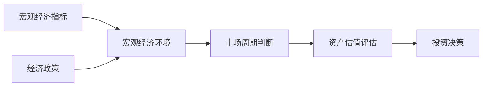

# 塞思·卡拉曼的宏观经济分析

> 关键词：塞思·卡拉曼、宏观经济分析、价值投资、市场周期、风险评估

> 摘要：本文围绕塞思·卡拉曼的宏观经济分析展开，深入探讨其在宏观经济层面的核心观点、分析方法以及实际应用。塞思·卡拉曼作为价值投资领域的杰出代表，其宏观经济分析不仅对投资决策具有重要指导意义，还反映了他对市场运行规律的深刻理解。文章详细阐述了相关核心概念、算法原理、数学模型，通过实际案例展示其分析方法的应用，介绍了在不同场景下的应用情况，并推荐了相关的学习资源、开发工具和论文著作。最后对未来发展趋势与挑战进行总结，解答常见问题，提供扩展阅读和参考资料，帮助读者全面了解塞思·卡拉曼的宏观经济分析体系。

## 1. 背景介绍 
### 1.1 目的和范围
本文章的主要目的是全面剖析塞思·卡拉曼的宏观经济分析方法和理念。通过深入研究他的投资思想和对宏观经济的洞察，为投资者、经济学者以及对金融市场感兴趣的人士提供有价值的参考。范围涵盖塞思·卡拉曼在宏观经济分析中所涉及的各个方面，包括市场周期的判断、风险评估、宏观经济指标的运用等，并探讨这些分析方法在实际投资中的应用。

### 1.2 预期读者
预期读者包括专业投资者，他们可以从塞思·卡拉曼的宏观经济分析中获取新的投资思路和策略；经济学者可以借此深入研究价值投资与宏观经济的关系；金融专业的学生可以将其作为学习宏观经济分析和投资理论的案例；以及对金融市场有一定了解并希望提升投资能力的普通投资者。

### 1.3 文档结构概述
本文将首先介绍塞思·卡拉曼宏观经济分析的核心概念和相关联系，通过文本示意图和 Mermaid 流程图进行直观展示。接着详细阐述其核心算法原理和具体操作步骤，并结合 Python 源代码进行说明。然后介绍相关的数学模型和公式，通过举例加深理解。再通过项目实战展示代码实际案例和详细解释。之后探讨其在实际应用场景中的表现。推荐相关的学习资源、开发工具和论文著作。最后总结未来发展趋势与挑战，解答常见问题，并提供扩展阅读和参考资料。

### 1.4 术语表
#### 1.4.1 核心术语定义
- **价值投资**：一种投资策略，强调寻找被低估的资产，通过分析资产的内在价值来进行投资决策，而不仅仅关注市场价格的短期波动。
- **宏观经济分析**：对国民经济总体的运行状况进行研究和评估，包括经济增长、通货膨胀、利率、就业等宏观经济指标的分析，以预测经济趋势和市场走向。
- **市场周期**：市场价格和经济活动在一定时间内呈现出的周期性波动，包括繁荣、衰退、萧条和复苏四个阶段。
- **风险评估**：对投资过程中可能面临的各种风险进行识别、分析和评估，以确定风险的大小和可能性，并采取相应的措施进行管理。

#### 1.4.2 相关概念解释
- **内在价值**：资产在未来所能产生的现金流的现值，是价值投资中判断资产是否被低估或高估的重要依据。
- **安全边际**：指股票的市场价格低于其内在价值的幅度，为投资者提供了一定的缓冲空间，降低投资风险。
- **经济指标**：用于衡量宏观经济运行状况的统计数据，如国内生产总值（GDP）、消费者物价指数（CPI）、失业率等。

#### 1.4.3 缩略词列表
- **GDP**：国内生产总值（Gross Domestic Product）
- **CPI**：消费者物价指数（Consumer Price Index）
- **P/E**：市盈率（Price-to-Earnings Ratio）

## 2. 核心概念与联系 
### 核心概念原理
塞思·卡拉曼的宏观经济分析建立在价值投资的基础之上，他认为宏观经济环境对企业的经营和市场价格有着重要影响。通过对宏观经济指标的分析，如 GDP 增长率、通货膨胀率、利率等，可以判断经济所处的周期阶段，进而评估市场的整体估值水平。

在价值投资中，核心是寻找被低估的资产，而宏观经济分析可以帮助投资者确定何时市场整体存在低估或高估的情况。例如，在经济衰退期，市场往往会出现过度恐慌，导致许多优质资产的价格被低估，此时投资者可以根据宏观经济分析的结果，寻找具有安全边际的投资机会。

### 架构的文本示意图
塞思·卡拉曼的宏观经济分析架构可以表示为：宏观经济环境 -> 市场周期判断 -> 资产估值评估 -> 投资决策。宏观经济环境是基础，通过对各种宏观经济指标的监测和分析，判断市场处于繁荣、衰退、萧条还是复苏阶段。市场周期的判断会影响资产的估值水平，在不同的周期阶段，资产的合理估值范围也会有所不同。最后，根据资产的估值情况，结合安全边际原则，做出投资决策。

### Mermaid 流程图


## 3. 核心算法原理 & 具体操作步骤 
### 核心算法原理
塞思·卡拉曼的宏观经济分析并没有严格意义上的固定算法，但可以归纳为以下几个核心步骤和原理：

#### 数据收集与分析
收集各种宏观经济指标数据，如 GDP、CPI、利率等，并对这些数据进行分析。可以使用统计方法，如趋势分析、相关性分析等，来了解宏观经济的运行趋势和各指标之间的关系。

#### 市场周期判断
根据宏观经济数据和历史经验，判断市场所处的周期阶段。一般来说，可以通过观察 GDP 增长率、通货膨胀率、失业率等指标的变化来判断。例如，当 GDP 增长率持续下降、通货膨胀率较低、失业率上升时，市场可能处于衰退期。

#### 资产估值评估
在确定市场周期后，对不同类型的资产进行估值评估。可以使用现金流折现模型（DCF）、市盈率（P/E）等方法来计算资产的内在价值，并与市场价格进行比较，判断资产是否被低估或高估。

#### 投资决策
根据资产的估值情况和市场风险，做出投资决策。如果资产被低估且具有足够的安全边际，同时市场风险在可承受范围内，则可以考虑买入；反之，如果资产被高估或市场风险过高，则应谨慎投资或选择卖出。

### 具体操作步骤
#### 步骤 1：数据收集
使用 Python 的 `pandas` 库从公开数据源（如政府统计部门网站、财经数据库等）收集宏观经济指标数据。以下是一个简单的示例代码：
```python
import pandas as pd

# 假设从 CSV 文件中读取 GDP 数据
gdp_data = pd.read_csv('gdp_data.csv')
print(gdp_data.head())
```

#### 步骤 2：数据预处理
对收集到的数据进行清洗和预处理，包括处理缺失值、异常值等。可以使用 `pandas` 和 `numpy` 库来完成这些任务。示例代码如下：
```python
import numpy as np

# 处理缺失值
gdp_data = gdp_data.fillna(method='ffill')

# 处理异常值
gdp_data = gdp_data[(np.abs(gdp_data['GDP']) - gdp_data['GDP'].mean()) <= (3 * gdp_data['GDP'].std())]
```

#### 步骤 3：市场周期判断
根据宏观经济数据的变化趋势，使用简单的规则来判断市场周期。例如，当 GDP 增长率连续两个季度下降时，判断市场进入衰退期。示例代码如下：
```python
# 计算 GDP 增长率
gdp_data['GDP_growth_rate'] = gdp_data['GDP'].pct_change()

# 判断市场周期
gdp_data['market_cycle'] = 'normal'
gdp_data.loc[(gdp_data['GDP_growth_rate'] < 0) & (gdp_data['GDP_growth_rate'].shift(1) < 0), 'market_cycle'] = 'recession'
print(gdp_data[['GDP_growth_rate', 'market_cycle']].tail())
```

#### 步骤 4：资产估值评估
使用现金流折现模型（DCF）对股票进行估值。假设股票的未来现金流为 $CF_1, CF_2, \cdots, CF_n$，折现率为 $r$，则股票的内在价值 $V$ 可以通过以下公式计算：
$$V = \sum_{i=1}^{n} \frac{CF_i}{(1 + r)^i}$$

以下是一个简单的 DCF 估值示例代码：
```python
# 假设未来 5 年的现金流和折现率
cash_flows = [100, 120, 130, 140, 150]
discount_rate = 0.1

# 计算内在价值
intrinsic_value = sum([cf / (1 + discount_rate) ** (i + 1) for i, cf in enumerate(cash_flows)])
print(f"股票的内在价值为: {intrinsic_value}")
```

#### 步骤 5：投资决策
根据资产的内在价值和市场价格，结合安全边际原则，做出投资决策。如果市场价格低于内在价值且安全边际足够大，则考虑买入；反之，则谨慎投资或卖出。示例代码如下：
```python
market_price = 120
safety_margin = 0.2

if market_price < intrinsic_value * (1 - safety_margin):
    print("可以考虑买入")
else:
    print("谨慎投资或卖出")
```

## 4. 数学模型和公式 & 详细讲解 & 举例说明 
### 现金流折现模型（DCF）
#### 公式
现金流折现模型的基本公式为：
$$V = \sum_{i=1}^{n} \frac{CF_i}{(1 + r)^i}$$
其中，$V$ 表示资产的内在价值，$CF_i$ 表示第 $i$ 期的现金流，$r$ 表示折现率，$n$ 表示现金流的期数。

#### 详细讲解
现金流折现模型的核心思想是将资产未来产生的现金流按照一定的折现率折现到当前时刻，以得到资产的内在价值。折现率反映了投资者对资金时间价值和投资风险的要求，一般可以使用无风险利率加上风险溢价来确定。

#### 举例说明
假设一家公司预计未来 3 年的现金流分别为 $100$ 万元、$120$ 万元和 $150$ 万元，折现率为 $10\%$。则该公司的内在价值为：
$$V = \frac{100}{(1 + 0.1)^1} + \frac{120}{(1 + 0.1)^2} + \frac{150}{(1 + 0.1)^3}$$
```python
cash_flows = [100, 120, 150]
discount_rate = 0.1
intrinsic_value = sum([cf / (1 + discount_rate) ** (i + 1) for i, cf in enumerate(cash_flows)])
print(f"公司的内在价值为: {intrinsic_value} 万元")
```

### 市盈率（P/E）模型
#### 公式
市盈率（P/E）是指股票价格与每股收益（EPS）的比率，公式为：
$$P/E = \frac{P}{EPS}$$
其中，$P$ 表示股票价格，$EPS$ 表示每股收益。

#### 详细讲解
市盈率是衡量股票估值的常用指标之一，它反映了投资者为获得每一元的收益愿意支付的价格。一般来说，市盈率越高，说明市场对该股票的预期越高，但也可能意味着股票被高估；反之，市盈率越低，说明股票可能被低估。

#### 举例说明
假设某股票的价格为 $50$ 元，每股收益为 $5$ 元，则该股票的市盈率为：
$$P/E = \frac{50}{5} = 10$$
这意味着投资者为获得该股票每一元的收益愿意支付 $10$ 元的价格。

### 安全边际公式
#### 公式
安全边际可以用以下公式表示：
$$安全边际 = \frac{内在价值 - 市场价格}{内在价值}$$

#### 详细讲解
安全边际是价值投资中的重要概念，它为投资者提供了一定的缓冲空间，降低了投资风险。安全边际越大，说明投资者在投资时所承担的风险越小。

#### 举例说明
假设某股票的内在价值为 $100$ 元，市场价格为 $80$ 元，则该股票的安全边际为：
$$安全边际 = \frac{100 - 80}{100} = 0.2 = 20\%$$
这意味着投资者在购买该股票时，即使股票价格下跌 $20\%$，仍然可以保证不亏损。

## 5. 项目实战：代码实际案例和详细解释说明 
### 5.1  开发环境搭建
#### 操作系统
可以选择 Windows、Linux 或 macOS 操作系统，本文以 Windows 系统为例进行说明。

#### 编程语言和库
使用 Python 作为编程语言，需要安装以下常用的库：
- `pandas`：用于数据处理和分析。
- `numpy`：用于数值计算。
- `matplotlib`：用于数据可视化。

可以使用 `pip` 命令来安装这些库：
```sh
pip install pandas numpy matplotlib
```

### 5.2  源代码详细实现和代码解读
#### 数据收集和预处理
```python
import pandas as pd
import numpy as np

# 从 CSV 文件中读取 GDP 数据
gdp_data = pd.read_csv('gdp_data.csv')

# 处理缺失值
gdp_data = gdp_data.fillna(method='ffill')

# 处理异常值
gdp_data = gdp_data[(np.abs(gdp_data['GDP']) - gdp_data['GDP'].mean()) <= (3 * gdp_data['GDP'].std())]

print(gdp_data.head())
```
代码解读：首先使用 `pandas` 的 `read_csv` 函数从 CSV 文件中读取 GDP 数据。然后使用 `fillna` 方法处理缺失值，这里使用前向填充的方式。最后，使用标准差方法处理异常值，保留与均值偏差在 3 倍标准差以内的数据。

#### 市场周期判断
```python
# 计算 GDP 增长率
gdp_data['GDP_growth_rate'] = gdp_data['GDP'].pct_change()

# 判断市场周期
gdp_data['market_cycle'] = 'normal'
gdp_data.loc[(gdp_data['GDP_growth_rate'] < 0) & (gdp_data['GDP_growth_rate'].shift(1) < 0), 'market_cycle'] = 'recession'

import matplotlib.pyplot as plt

# 可视化 GDP 增长率和市场周期
plt.figure(figsize=(12, 6))
plt.plot(gdp_data['Date'], gdp_data['GDP_growth_rate'], label='GDP Growth Rate')
plt.scatter(gdp_data[gdp_data['market_cycle'] == 'recession']['Date'], gdp_data[gdp_data['market_cycle'] == 'recession']['GDP_growth_rate'], color='red', label='Recession')
plt.xlabel('Date')
plt.ylabel('GDP Growth Rate')
plt.title('GDP Growth Rate and Market Cycle')
plt.legend()
plt.show()
```
代码解读：首先计算 GDP 增长率，使用 `pct_change` 方法。然后根据 GDP 增长率连续两个季度下降的条件判断市场进入衰退期，并在数据中标记出来。最后，使用 `matplotlib` 库将 GDP 增长率和市场周期可视化，方便观察和分析。

#### 资产估值评估
```python
# 假设未来 5 年的现金流和折现率
cash_flows = [100, 120, 130, 140, 150]
discount_rate = 0.1

# 计算内在价值
intrinsic_value = sum([cf / (1 + discount_rate) ** (i + 1) for i, cf in enumerate(cash_flows)])

# 假设市场价格
market_price = 120

# 计算安全边际
safety_margin = (intrinsic_value - market_price) / intrinsic_value

print(f"股票的内在价值为: {intrinsic_value}")
print(f"股票的市场价格为: {market_price}")
print(f"安全边际为: {safety_margin * 100:.2f}%")
```
代码解读：首先定义未来 5 年的现金流和折现率，使用现金流折现模型计算股票的内在价值。然后假设市场价格，计算安全边际。最后输出内在价值、市场价格和安全边际的结果。

### 5.3  代码解读与分析
通过以上代码，我们完成了从数据收集、预处理到市场周期判断和资产估值评估的整个过程。数据收集和预处理是基础，确保数据的准确性和可靠性。市场周期判断可以帮助我们了解宏观经济环境，为资产估值评估提供背景信息。资产估值评估是核心，通过计算内在价值和安全边际，为投资决策提供依据。

在实际应用中，我们可以根据不同的宏观经济指标和投资目标，调整代码中的参数和判断条件，以适应不同的情况。同时，还可以进一步扩展代码，加入更多的分析方法和模型，提高投资决策的准确性和可靠性。

## 6. 实际应用场景 
### 股票投资
在股票投资中，塞思·卡拉曼的宏观经济分析方法可以帮助投资者判断市场的整体估值水平和风险状况。在经济衰退期，市场往往会出现过度恐慌，导致许多优质股票的价格被低估。此时，投资者可以根据宏观经济分析的结果，寻找具有安全边际的股票进行投资。例如，通过分析 GDP 增长率、通货膨胀率等宏观经济指标，判断市场处于衰退期后，投资者可以筛选出那些业绩稳定、现金流充沛但股价被低估的股票，使用现金流折现模型或市盈率模型对其进行估值评估，选择安全边际较大的股票进行买入。

### 债券投资
宏观经济环境对债券市场也有着重要影响。在经济衰退期，利率通常会下降，债券价格会上涨。投资者可以通过宏观经济分析，判断利率的走势，选择合适的债券进行投资。例如，当预测到经济将进入衰退期，利率可能下降时，投资者可以增加长期债券的投资比例，以获取债券价格上涨带来的收益。同时，还可以通过分析债券的信用风险、收益率等指标，选择优质的债券进行投资。

### 资产配置
塞思·卡拉曼的宏观经济分析方法还可以应用于资产配置。通过对宏观经济环境的分析，判断不同资产类别的风险和收益特征，合理分配资产。例如，在经济繁荣期，股票市场通常表现较好，投资者可以适当增加股票的投资比例；而在经济衰退期，债券和现金等防御性资产的价值相对较高，投资者可以增加这些资产的配置比例。通过合理的资产配置，可以降低投资组合的风险，提高投资收益。

### 风险管理
宏观经济分析在风险管理中也起着重要作用。投资者可以通过对宏观经济指标的监测和分析，及时发现市场风险的变化，采取相应的措施进行风险管理。例如，当宏观经济数据显示经济增长放缓、通货膨胀率上升时，市场可能面临较大的风险，投资者可以适当降低投资组合的风险暴露，减少股票等风险资产的投资比例，增加现金或债券等安全资产的持有量。同时，还可以使用对冲工具，如期货、期权等，来对冲市场风险。

## 7. 工具和资源推荐
### 7.1 学习资源推荐
#### 7.1.1 书籍推荐
- 《安全边际》（*Margin of Safety*）：塞思·卡拉曼的代表作，详细阐述了他的价值投资理念和宏观经济分析方法，是价值投资者的必读之书。
- 《聪明的投资者》（*The Intelligent Investor*）：本杰明·格雷厄姆的经典著作，被誉为投资界的“圣经”，对价值投资和宏观经济分析有着深刻的见解。
- 《宏观经济学》（*Macroeconomics*）：保罗·萨缪尔森和威廉·诺德豪斯的经典教材，系统介绍了宏观经济学的基本理论和分析方法，是学习宏观经济分析的重要参考书籍。

#### 7.1.2 在线课程
- Coursera 上的“宏观经济学原理”课程：由知名大学的教授授课，系统讲解宏观经济学的基本原理和分析方法。
- edX 上的“价值投资基础”课程：介绍价值投资的基本理念和方法，包括宏观经济分析在价值投资中的应用。
- 网易云课堂上的“金融市场与宏观经济分析”课程：结合实际案例，讲解金融市场和宏观经济分析的相关知识和技能。

#### 7.1.3 技术博客和网站
- Seeking Alpha：提供专业的金融分析和投资建议，包括宏观经济分析和股票、债券等资产的研究报告。
- Bloomberg：全球知名的财经媒体，提供实时的宏观经济数据、新闻和分析，是了解宏观经济动态的重要渠道。
- Econbrowser：由知名经济学家开设的博客，分享宏观经济研究的最新成果和观点。

### 7.2 开发工具框架推荐
#### 7.2.1 IDE和编辑器
- PyCharm：一款功能强大的 Python 集成开发环境，提供代码编辑、调试、版本控制等功能，适合专业开发者使用。
- Jupyter Notebook：一种交互式的开发环境，支持 Python 代码的编写、运行和可视化，适合数据分析师和科研人员使用。
- Visual Studio Code：一款轻量级的代码编辑器，支持多种编程语言，具有丰富的插件扩展功能，适合初学者和快速开发。

#### 7.2.2 调试和性能分析工具
- `pdb`：Python 自带的调试工具，可以帮助开发者定位和解决代码中的问题。
- `cProfile`：Python 标准库中的性能分析工具，可以分析代码的运行时间和函数调用情况，帮助开发者优化代码性能。
- `py-spy`：一个轻量级的 Python 性能分析工具，可以实时监控 Python 程序的性能，找出性能瓶颈。

#### 7.2.3 相关框架和库
- `pandas`：用于数据处理和分析的 Python 库，提供了高效的数据结构和数据操作方法，是数据分析师的必备工具。
- `numpy`：用于数值计算的 Python 库，提供了高效的数组操作和数学函数，是科学计算的基础库。
- `matplotlib`：用于数据可视化的 Python 库，提供了丰富的绘图功能，可以将数据以直观的图表形式展示出来。

### 7.3 相关论文著作推荐
#### 7.3.1 经典论文
- Eugene F. Fama 的“Efficient Capital Markets: A Review of Theory and Empirical Work”：提出了有效市场假说，对金融市场的效率和定价机制进行了深入研究。
- Benjamin Graham 和 David Dodd 的“Security Analysis”：奠定了价值投资的理论基础，对股票和债券的估值方法进行了系统阐述。
- John Maynard Keynes 的“The General Theory of Employment, Interest and Money”：开创了宏观经济学的研究领域，提出了有效需求理论和宏观经济政策的主张。

#### 7.3.2 最新研究成果
- 关注顶尖学术期刊，如《Journal of Finance》、《American Economic Review》等，这些期刊发表了宏观经济分析和投资领域的最新研究成果。
- 参加国际学术会议，如美国金融协会年会（AFA）、世界计量经济学会年会（Econometric Society World Congress）等，了解宏观经济分析和投资领域的前沿动态。

#### 7.3.3 应用案例分析
- 阅读专业的金融分析报告和投资案例，如高盛、摩根大通等投资银行的研究报告，了解宏观经济分析在实际投资中的应用方法和策略。
- 分析知名投资者的投资案例，如巴菲特、塞思·卡拉曼等，学习他们的宏观经济分析方法和投资决策过程。

## 8. 总结：未来发展趋势与挑战
### 未来发展趋势
#### 数据驱动的宏观经济分析
随着信息技术的不断发展，宏观经济数据的获取和处理变得更加便捷和高效。未来，宏观经济分析将更加依赖于大数据和人工智能技术，通过对海量数据的挖掘和分析，提高宏观经济预测的准确性和及时性。

#### 跨学科融合
宏观经济分析涉及经济学、金融学、统计学等多个学科领域。未来，跨学科融合将成为宏观经济分析的发展趋势，结合不同学科的理论和方法，为宏观经济分析提供更全面、深入的视角。

#### 全球宏观经济分析
在经济全球化的背景下，各国经济之间的联系日益紧密。未来，宏观经济分析将更加注重全球视野，考虑国际经济形势和政策变化对本国经济的影响，为投资者提供更具前瞻性的投资建议。

### 挑战
#### 数据质量和可靠性
虽然大数据为宏观经济分析提供了丰富的数据源，但数据质量和可靠性也成为了一个挑战。数据的准确性、完整性和一致性直接影响宏观经济分析的结果，需要采取有效的数据清洗和预处理方法来提高数据质量。

#### 模型的复杂性和不确定性
宏观经济系统是一个复杂的动态系统，受到多种因素的影响。建立准确的宏观经济模型面临着很大的挑战，模型的复杂性和不确定性可能导致预测结果的偏差。需要不断改进和完善宏观经济模型，提高模型的准确性和可靠性。

#### 政策变化和突发事件的影响
宏观经济政策的变化和突发事件（如自然灾害、战争、疫情等）对宏观经济形势有着重要影响。这些因素具有不确定性和不可预测性，给宏观经济分析带来了很大的挑战。需要及时关注政策变化和突发事件的动态，调整宏观经济分析的方法和策略。

## 9. 附录：常见问题与解答
### 问题 1：塞思·卡拉曼的宏观经济分析方法适用于所有市场吗？
解答：塞思·卡拉曼的宏观经济分析方法基于价值投资理念，强调寻找被低估的资产和控制风险。虽然这种方法具有一定的普遍性，但并不适用于所有市场。不同市场的特点和环境可能存在差异，例如新兴市场的波动性较大、信息透明度较低，可能需要对方法进行适当的调整和改进。此外，宏观经济分析方法也需要结合具体的投资目标和风险承受能力来使用。

### 问题 2：如何获取准确的宏观经济数据？
解答：可以从以下几个途径获取准确的宏观经济数据：
- 政府统计部门网站：如国家统计局、央行等发布的官方统计数据，具有权威性和准确性。
- 财经数据库：如 Wind、Bloomberg 等专业财经数据库，提供全面、及时的宏观经济数据和分析报告。
- 国际组织：如世界银行、国际货币基金组织（IMF）等发布的全球宏观经济数据和研究报告。

### 问题 3：现金流折现模型中的折现率如何确定？
解答：折现率的确定是现金流折现模型中的关键问题。一般来说，可以使用无风险利率加上风险溢价来确定折现率。无风险利率可以选择国债收益率等作为参考，风险溢价则需要考虑投资的风险程度、市场环境等因素。具体确定方法可以采用资本资产定价模型（CAPM）等方法进行估算，也可以根据经验和市场情况进行调整。

### 问题 4：安全边际的大小应该如何把握？
解答：安全边际的大小需要根据市场环境、投资目标和风险承受能力等因素来把握。一般来说，在市场不确定性较大、风险较高时，需要更大的安全边际；而在市场相对稳定、风险较低时，可以适当降低安全边际。同时，不同类型的资产和投资策略对安全边际的要求也可能不同。投资者可以根据自己的情况，结合历史数据和经验，确定合适的安全边际水平。

## 10. 扩展阅读 & 参考资料
### 扩展阅读
- 《投资最重要的事》（*The Most Important Thing Illuminated*）：霍华德·马克斯的著作，分享了他在投资领域的经验和智慧，对宏观经济分析和投资决策有一定的启发。
- 《金融炼金术》（*The Alchemy of Finance*）：乔治·索罗斯的著作，介绍了他的反身性理论和宏观经济分析方法，对理解金融市场的运行机制有很大帮助。
- 《非理性繁荣》（*Irrational Exuberance*）：罗伯特·席勒的著作，探讨了金融市场中的非理性行为和泡沫现象，对宏观经济分析和投资风险管理有重要的参考价值。

### 参考资料
- Seth A. Klarman, *Margin of Safety: Risk-Averse Value Investing Strategies for the Thoughtful Investor*, HarperBusiness, 1991.
- Benjamin Graham and David Dodd, *Security Analysis*, McGraw-Hill, 1934.
- John Maynard Keynes, *The General Theory of Employment, Interest and Money*, Macmillan, 1936.

作者：AI天才研究院/AI Genius Institute & 禅与计算机程序设计艺术 /Zen And The Art of Computer Programming