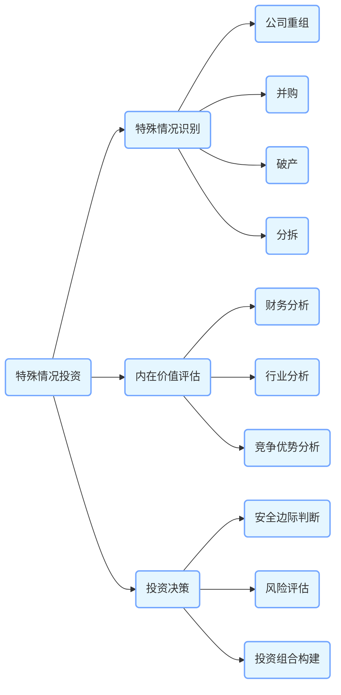

# 塞斯·卡拉曼的特殊情况投资技巧

> 关键词：塞斯·卡拉曼、特殊情况投资、价值投资、投资技巧、风险控制

> 摘要：本文深入探讨塞斯·卡拉曼的特殊情况投资技巧。通过介绍背景知识，阐述特殊情况投资的核心概念与联系，详细讲解其核心算法原理及操作步骤，运用数学模型进行分析，结合项目实战案例，探讨实际应用场景，推荐相关工具和资源，最后总结未来发展趋势与挑战，并解答常见问题。旨在让读者全面了解塞斯·卡拉曼的特殊情况投资技巧，为投资实践提供参考。

## 1. 背景介绍 
### 1.1 目的和范围
本文章的目的是全面解析塞斯·卡拉曼的特殊情况投资技巧，涵盖从基本概念到实际应用的各个方面。范围包括对特殊情况投资的定义、核心原理、操作步骤、数学模型分析、实战案例等内容，同时探讨其在不同市场环境下的应用，以及相关的学习资源和未来发展趋势。

### 1.2 预期读者
预期读者包括对投资领域感兴趣的个人投资者、金融从业者、投资研究人员等。无论是初涉投资领域的新手，还是有一定投资经验的专业人士，都能从本文中获取关于塞斯·卡拉曼特殊情况投资技巧的有价值信息。

### 1.3 文档结构概述
本文首先介绍塞斯·卡拉曼及其特殊情况投资技巧的背景知识，包括目的、预期读者和文档结构。接着阐述特殊情况投资的核心概念与联系，通过文本示意图和Mermaid流程图进行直观展示。然后详细讲解核心算法原理和具体操作步骤，结合Python源代码进行说明。运用数学模型和公式对投资技巧进行深入分析，并举例说明。通过项目实战案例，展示特殊情况投资技巧的实际应用，包括开发环境搭建、源代码实现和代码解读。探讨特殊情况投资技巧在不同场景下的实际应用。推荐相关的学习资源、开发工具框架和论文著作。最后总结未来发展趋势与挑战，解答常见问题，并提供扩展阅读和参考资料。

### 1.4 术语表
#### 1.4.1 核心术语定义
- **特殊情况投资**：指在特定的事件或情况发生时，利用市场的低效性和错误定价，寻找具有潜在价值的投资机会。这些特殊情况包括公司重组、并购、破产、分拆等。
- **价值投资**：基于对公司内在价值的分析，寻找被低估的股票进行投资，以获取长期的投资回报。
- **安全边际**：投资价格与公司内在价值之间的差额，用于保护投资者免受市场波动和估值错误的影响。

#### 1.4.2 相关概念解释
- **市场低效性**：市场并非总是有效的，由于信息不对称、投资者情绪等因素，股票价格可能会偏离其内在价值。特殊情况投资就是利用这种市场低效性来寻找投资机会。
- **事件驱动投资**：根据特定事件的发生来进行投资决策，特殊情况投资属于事件驱动投资的一种。

#### 1.4.3 缩略词列表
- **DCF**：Discounted Cash Flow，现金流折现法，一种用于评估公司内在价值的方法。
- **EV**：Enterprise Value，企业价值，衡量公司整体价值的指标。

## 2. 核心概念与联系 

### 核心概念原理
塞斯·卡拉曼的特殊情况投资技巧基于价值投资的理念，强调在特殊情况下寻找被市场低估的投资机会。特殊情况可能包括公司的重组、并购、破产、分拆等事件，这些事件会导致市场对公司的价值产生错误定价。投资者通过深入分析这些特殊情况，评估公司的内在价值，并在价格低于内在价值时进行投资，以获取长期的投资回报。

特殊情况投资的核心在于识别市场的低效性和错误定价。市场在面对特殊情况时，往往会受到投资者情绪、信息不对称等因素的影响，导致股票价格偏离其内在价值。投资者需要具备敏锐的洞察力和深入的分析能力，才能发现这些被低估的投资机会。

### 架构的文本示意图
```plaintext
特殊情况投资
|-- 特殊情况识别
|   |-- 公司重组
|   |-- 并购
|   |-- 破产
|   |-- 分拆
|-- 内在价值评估
|   |-- 财务分析
|   |-- 行业分析
|   |-- 竞争优势分析
|-- 投资决策
|   |-- 安全边际判断
|   |-- 风险评估
|   |-- 投资组合构建
```

### Mermaid 流程图


## 3. 核心算法原理 & 具体操作步骤 

### 核心算法原理
特殊情况投资的核心算法原理在于评估公司的内在价值，并与市场价格进行比较。常用的内在价值评估方法包括现金流折现法（DCF）、相对估值法等。

#### 现金流折现法（DCF）
现金流折现法是一种基于未来现金流预测的估值方法。其基本原理是将公司未来的现金流折现到当前时点，以确定公司的内在价值。计算公式如下：

$$V = \sum_{t=1}^{n} \frac{CF_t}{(1 + r)^t} + \frac{TV}{(1 + r)^n}$$

其中，$V$ 表示公司的内在价值，$CF_t$ 表示第 $t$ 期的现金流，$r$ 表示折现率，$n$ 表示预测期数，$TV$ 表示终值。

#### 相对估值法
相对估值法是通过比较公司与同行业其他公司的估值指标，来评估公司的价值。常用的估值指标包括市盈率（P/E）、市净率（P/B）等。计算公式如下：

$$P/E = \frac{股价}{每股收益}$$

$$P/B = \frac{股价}{每股净资产}$$

### 具体操作步骤

#### 步骤 1：特殊情况识别
- 关注公司公告、新闻报道等信息，寻找可能出现特殊情况的公司。
- 分析公司的财务报表、行业动态等，判断特殊情况的潜在影响。

#### 步骤 2：内在价值评估
- 收集公司的财务数据、行业数据等，进行财务分析和行业分析。
- 运用现金流折现法、相对估值法等方法，评估公司的内在价值。

#### 步骤 3：投资决策
- 判断投资价格与内在价值之间的安全边际，确保有足够的安全垫。
- 评估投资风险，包括市场风险、公司特定风险等。
- 根据风险承受能力和投资目标，构建投资组合。

### Python 源代码实现

```python
import numpy as np

def dcf_valuation(cash_flows, discount_rate, terminal_value):
    """
    现金流折现法估值
    :param cash_flows: 未来现金流列表
    :param discount_rate: 折现率
    :param terminal_value: 终值
    :return: 公司内在价值
    """
    n = len(cash_flows)
    present_values = []
    for t in range(n):
        present_value = cash_flows[t] / ((1 + discount_rate) ** (t + 1))
        present_values.append(present_value)
    terminal_present_value = terminal_value / ((1 + discount_rate) ** n)
    total_value = sum(present_values) + terminal_present_value
    return total_value

# 示例数据
cash_flows = [100, 120, 150, 180, 200]
discount_rate = 0.1
terminal_value = 2500

# 计算内在价值
intrinsic_value = dcf_valuation(cash_flows, discount_rate, terminal_value)
print(f"公司内在价值: {intrinsic_value}")
```

## 4. 数学模型和公式 & 详细讲解 & 举例说明 

### 现金流折现法（DCF）
#### 详细讲解
现金流折现法的核心思想是将公司未来的现金流折现到当前时点，以反映货币的时间价值。未来现金流的预测是该方法的关键，需要考虑公司的业务发展、市场竞争、宏观经济环境等因素。折现率的选择也非常重要，它反映了投资者对投资风险的要求。终值的计算通常采用永续增长模型或退出倍数法。

#### 举例说明
假设一家公司未来 5 年的现金流分别为 100 万元、120 万元、150 万元、180 万元和 200 万元，折现率为 10%，终值为 2500 万元。根据现金流折现法的公式，计算该公司的内在价值：

$$V = \frac{100}{(1 + 0.1)^1} + \frac{120}{(1 + 0.1)^2} + \frac{150}{(1 + 0.1)^3} + \frac{180}{(1 + 0.1)^4} + \frac{200}{(1 + 0.1)^5} + \frac{2500}{(1 + 0.1)^5}$$

$$V = 90.91 + 99.17 + 112.70 + 122.94 + 124.18 + 1552.30$$

$$V = 2092.20$$（万元）

### 相对估值法
#### 详细讲解
相对估值法通过比较公司与同行业其他公司的估值指标，来评估公司的价值。该方法的优点是简单易懂，易于操作。但需要注意的是，同行业公司的估值指标可能存在差异，需要进行合理的调整。

#### 举例说明
假设同行业公司的平均市盈率为 15 倍，某公司的每股收益为 2 元。根据相对估值法，该公司的合理股价为：

$$股价 = 每股收益 \times 市盈率 = 2 \times 15 = 30$$（元）

## 5. 项目实战：代码实际案例和详细解释说明 

### 5.1  开发环境搭建
- **操作系统**：Windows、Linux 或 macOS
- **编程语言**：Python 3.x
- **开发工具**：Jupyter Notebook、PyCharm 等
- **所需库**：NumPy、Pandas、Matplotlib 等

### 5.2  源代码详细实现和代码解读

```python
import pandas as pd
import numpy as np
import matplotlib.pyplot as plt

# 读取公司财务数据
data = pd.read_csv('company_financials.csv')

# 提取现金流数据
cash_flows = data['Cash Flow'].values

# 假设折现率和终值
discount_rate = 0.1
terminal_value = 1000

# 计算内在价值
intrinsic_value = dcf_valuation(cash_flows, discount_rate, terminal_value)

# 读取市场价格数据
market_prices = data['Market Price'].values

# 计算安全边际
safety_margin = (intrinsic_value - market_prices) / intrinsic_value

# 绘制安全边际曲线
plt.plot(safety_margin)
plt.xlabel('Time')
plt.ylabel('Safety Margin')
plt.title('Safety Margin over Time')
plt.show()

# 投资决策
if safety_margin[-1] > 0.2:
    print("可以考虑投资")
else:
    print("暂不考虑投资")
```

### 代码解读与分析
- **数据读取**：使用 Pandas 库读取公司的财务数据和市场价格数据。
- **内在价值计算**：调用之前定义的 `dcf_valuation` 函数，计算公司的内在价值。
- **安全边际计算**：计算内在价值与市场价格之间的差额，并将其除以内在价值，得到安全边际。
- **可视化**：使用 Matplotlib 库绘制安全边际曲线，直观展示安全边际随时间的变化。
- **投资决策**：根据最新的安全边际值，判断是否可以考虑投资。如果安全边际大于 20%，则可以考虑投资；否则，暂不考虑投资。

## 6. 实际应用场景 
### 公司重组
当公司进行重组时，市场往往对其未来的发展前景存在不确定性，导致股票价格波动。投资者可以通过深入分析重组方案，评估公司的内在价值，寻找被低估的投资机会。例如，一家公司通过剥离不良资产、引入战略投资者等方式进行重组，可能会提升其盈利能力和市场竞争力，从而使其内在价值增加。

### 并购
并购是特殊情况投资的常见场景之一。在并购过程中，收购方通常会支付一定的溢价，导致目标公司的股票价格上涨。但市场可能会对并购的协同效应和整合风险存在过度乐观或悲观的情绪，从而导致股票价格偏离其内在价值。投资者可以通过分析并购双方的业务互补性、协同效应、整合难度等因素，评估目标公司的内在价值，寻找投资机会。

### 破产
当公司面临破产时，其股票价格往往会大幅下跌。但在某些情况下，公司可能会通过破产重组等方式实现重生，其股票价格也可能会大幅反弹。投资者可以通过分析公司的资产负债状况、业务前景、重组方案等因素，评估公司的内在价值，寻找被低估的投资机会。

### 分拆
公司分拆是指将一个公司的业务或资产分离出来，成立独立的新公司。分拆后，新公司的股票价格可能会被市场低估，因为市场可能对新公司的发展前景存在不确定性。投资者可以通过分析分拆后新公司的业务模式、市场竞争力、财务状况等因素，评估其内在价值，寻找投资机会。

## 7. 工具和资源推荐
### 7.1 学习资源推荐
#### 7.1.1 书籍推荐
- 《安全边际》（塞斯·卡拉曼著）：塞斯·卡拉曼的经典著作，详细阐述了价值投资和特殊情况投资的理念和方法。
- 《聪明的投资者》（本杰明·格雷厄姆著）：价值投资的奠基之作，对投资者的思维方式和投资策略有深远的影响。
- 《证券分析》（本杰明·格雷厄姆和戴维·多德著）：被誉为投资领域的“圣经”，系统介绍了证券分析的基本方法和理论。

#### 7.1.2 在线课程
- Coursera 上的“投资学原理”：由知名大学教授授课，涵盖了投资领域的基本概念和方法。
- edX 上的“价值投资与财务报表分析”：深入讲解价值投资的理念和财务报表分析的技巧。

#### 7.1.3 技术博客和网站
- Seeking Alpha：提供专业的投资分析和研究报告，涵盖了各种投资领域和投资策略。
- ValueWalk：专注于价值投资领域，分享价值投资者的观点和经验。

### 7.2 开发工具框架推荐
#### 7.2.1 IDE和编辑器
- Jupyter Notebook：适合数据探索和分析，支持多种编程语言，方便进行代码编写和可视化展示。
- PyCharm：专业的 Python 开发工具，提供丰富的代码编辑、调试和管理功能。

#### 7.2.2 调试和性能分析工具
- IPython：提供交互式的 Python 环境，方便进行代码调试和测试。
- cProfile：Python 内置的性能分析工具，用于分析代码的运行时间和性能瓶颈。

#### 7.2.3 相关框架和库
- NumPy：用于科学计算和数组处理，提供高效的数值计算功能。
- Pandas：用于数据处理和分析，提供强大的数据结构和数据操作功能。
- Matplotlib：用于数据可视化，提供丰富的绘图功能。

### 7.3 相关论文著作推荐
#### 7.3.1 经典论文
- “The Intelligent Investor”（Benjamin Graham）：价值投资领域的经典论文，阐述了价值投资的基本理念和方法。
- “Security Analysis”（Benjamin Graham and David Dodd）：证券分析领域的奠基之作，对证券分析的理论和方法进行了系统的阐述。

#### 7.3.2 最新研究成果
- 关注顶级金融学术期刊，如《Journal of Finance》、《Review of Financial Studies》等，了解特殊情况投资领域的最新研究成果。

#### 7.3.3 应用案例分析
- 阅读投资机构和专业投资者的研究报告和案例分析，学习他们在特殊情况投资中的实践经验和策略。

## 8. 总结：未来发展趋势与挑战
### 未来发展趋势
- **数据驱动的投资决策**：随着大数据和人工智能技术的发展，投资者将越来越多地利用数据和算法进行投资决策。通过对海量数据的分析和挖掘，可以更准确地评估公司的内在价值和投资风险。
- **跨市场和跨资产类别的投资**：特殊情况投资将不再局限于单一市场和资产类别，投资者将更加关注全球范围内的投资机会，包括股票、债券、期货、期权等多种资产类别。
- **社会责任投资的融合**：投资者将越来越关注公司的社会责任和可持续发展，特殊情况投资也将与社会责任投资相结合，寻找既具有投资价值又符合社会价值观的投资机会。

### 挑战
- **信息获取和分析的难度**：特殊情况投资需要投资者具备丰富的信息来源和强大的分析能力。随着市场的复杂性和信息的海量性增加，投资者获取和分析信息的难度也在加大。
- **市场竞争的加剧**：随着特殊情况投资理念的普及，越来越多的投资者开始关注这一领域，市场竞争也将日益激烈。投资者需要不断提升自己的投资能力和竞争力，才能在市场中获得超额收益。
- **宏观经济环境的不确定性**：特殊情况投资受到宏观经济环境的影响较大，如经济衰退、利率波动、汇率变化等。投资者需要密切关注宏观经济环境的变化，及时调整投资策略，以应对不确定性带来的风险。

## 9. 附录：常见问题与解答
### 问题 1：特殊情况投资适合所有投资者吗？
解答：特殊情况投资并不适合所有投资者。该投资策略需要投资者具备较强的分析能力、风险承受能力和耐心。对于缺乏投资经验和专业知识的投资者来说，可能会面临较大的风险。

### 问题 2：如何判断特殊情况的真实性和可靠性？
解答：判断特殊情况的真实性和可靠性需要投资者进行深入的调查和分析。可以通过查阅公司公告、新闻报道、财务报表等资料，了解特殊情况的背景和原因。同时，还可以咨询专业的投资顾问或研究机构，获取更多的信息和建议。

### 问题 3：特殊情况投资的风险如何控制？
解答：特殊情况投资的风险可以通过以下方式进行控制：
- 设定合理的投资组合：将资金分散投资于不同的特殊情况投资机会，降低单一投资的风险。
- 严格控制安全边际：在投资决策时，确保投资价格与内在价值之间有足够的安全边际，以保护投资者免受市场波动和估值错误的影响。
- 密切关注市场动态：及时了解特殊情况的进展和市场变化，根据情况调整投资策略。

## 10. 扩展阅读 & 参考资料
- 《投资最重要的事》（霍华德·马克斯著）
- 《金融炼金术》（乔治·索罗斯著）
- 《穷查理宝典》（查理·芒格著）
- 塞斯·卡拉曼的投资报告和演讲资料
- 金融学术期刊上关于特殊情况投资的研究论文

作者：AI天才研究院/AI Genius Institute & 禅与计算机程序设计艺术 /Zen And The Art of Computer Programming