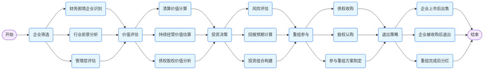

# 塞斯·卡拉曼的破产重组投资策略

> 关键词：塞斯·卡拉曼、破产重组投资、投资策略、价值分析、风险控制

> 摘要：本文深入探讨了塞斯·卡拉曼的破产重组投资策略。首先介绍了该策略产生的背景、目的和适用读者，对相关术语进行了清晰定义。接着阐述了破产重组投资的核心概念及其内在联系，通过Mermaid流程图直观展示。详细讲解了核心算法原理并给出Python代码示例，同时介绍了相关数学模型和公式。结合实际案例，从开发环境搭建到源代码实现与解读，全面剖析了该策略在项目实战中的应用。还列举了该策略的实际应用场景，推荐了学习、开发相关的工具和资源以及重要的论文著作。最后总结了未来发展趋势与挑战，解答常见问题并提供扩展阅读和参考资料，旨在为投资者深入理解和运用该策略提供全面而深入的指导。

## 1. 背景介绍 
### 1.1 目的和范围
塞斯·卡拉曼（Seth Klarman）是投资界的传奇人物，他所倡导的破产重组投资策略是一种独特且具有挑战性的投资方式。本文的目的在于深入剖析这一策略，让读者全面了解其原理、操作步骤以及实际应用。范围涵盖从基本概念的解释到具体案例的分析，以及相关工具和资源的推荐，旨在为投资者提供一个完整的知识体系，帮助他们在破产重组投资领域做出更明智的决策。

### 1.2 预期读者
本文预期读者主要包括专业投资者、金融分析师、投资领域的研究人员以及对价值投资和破产重组投资策略感兴趣的个人。这些读者希望通过了解塞斯·卡拉曼的策略，拓宽投资视野，提升投资技能，在复杂的金融市场中寻找潜在的投资机会。

### 1.3 文档结构概述
本文将按照以下结构进行阐述：首先介绍破产重组投资的核心概念和联系，包括其原理和架构，并通过流程图直观展示；接着详细讲解核心算法原理和具体操作步骤，并用Python代码进行示例；然后介绍相关的数学模型和公式，并举例说明；通过实际项目案例，展示该策略在实际中的应用，包括开发环境搭建、源代码实现和代码解读；探讨该策略的实际应用场景；推荐学习和开发所需的工具和资源，以及相关的论文著作；最后总结未来发展趋势与挑战，解答常见问题，并提供扩展阅读和参考资料。

### 1.4 术语表
#### 1.4.1 核心术语定义
- **破产重组**：指企业在面临财务困境、资不抵债时，通过法律程序对企业的资产、负债、业务等进行重新整合和调整，以实现企业的持续经营和债务的清偿。
- **破产重组投资**：投资者在企业破产重组过程中，通过购买企业的债权、股权或其他相关资产，以期在企业重组成功后获得丰厚回报的投资行为。
- **债权**：债权人对债务人享有的要求其偿还债务的权利。在破产重组中，债权是投资者关注的重要对象之一。
- **股权**：股东对公司享有的权益，包括资产收益、参与决策等权利。破产重组可能会对股权结构产生重大影响。

#### 1.4.2 相关概念解释
- **清算价值**：企业在破产清算时，将其资产变现后所能获得的价值。清算价值是评估破产企业价值的重要参考。
- **持续经营价值**：企业在正常经营状态下，未来预期现金流量的现值。在破产重组中，持续经营价值的评估对于判断企业是否有重组价值至关重要。
- **优先债权**：在企业破产清算时，具有优先受偿权的债权。优先债权的清偿顺序通常排在普通债权之前。

#### 1.4.3 缩略词列表
- **DCF**：Discounted Cash Flow，折现现金流，是一种用于评估企业价值的方法，通过将未来预期现金流量折现到当前来计算企业的价值。
- **EV**：Enterprise Value，企业价值，是衡量企业整体价值的指标，等于股权价值加上净债务。

## 2. 核心概念与联系 
### 核心概念原理
塞斯·卡拉曼的破产重组投资策略基于价值投资的理念。其核心原理是在企业陷入破产困境时，市场往往会过度反应，导致企业的资产和证券价格被低估。投资者通过深入研究和分析，找到那些具有潜在重组价值的企业，以低于其内在价值的价格购买相关资产，等待企业重组成功后实现价值回归，从而获得投资回报。

在破产重组过程中，投资者需要关注企业的资产状况、债务结构、业务前景等多个方面。企业的资产是其价值的基础，包括固定资产、流动资产、无形资产等。债务结构则决定了投资者在重组过程中的权益和风险，不同类型的债权具有不同的清偿顺序和优先级。业务前景是判断企业是否能够持续经营并实现价值增长的关键因素。

### 架构的文本示意图
```plaintext
破产重组投资策略架构
|-- 企业筛选
|   |-- 财务困境企业识别
|   |-- 行业前景分析
|   |-- 管理层评估
|-- 价值评估
|   |-- 清算价值计算
|   |-- 持续经营价值估算
|   |-- 债权股权价值分析
|-- 投资决策
|   |-- 风险评估
|   |-- 回报预期计算
|   |-- 投资组合构建
|-- 重组参与
|   |-- 债权收购
|   |-- 股权认购
|   |-- 参与重组方案制定
|-- 退出策略
|   |-- 企业上市后出售
|   |-- 企业被收购后退出
|   |-- 重组完成后分红
```

### Mermaid流程图


## 3. 核心算法原理 & 具体操作步骤 
### 核心算法原理
在塞斯·卡拉曼的破产重组投资策略中，核心算法主要涉及企业价值评估和投资回报计算。企业价值评估通常采用折现现金流（DCF）法和清算价值法相结合的方式。

折现现金流法的基本思想是将企业未来预期的现金流量折现到当前，以计算企业的持续经营价值。其计算公式为：

$$V = \sum_{t=1}^{n} \frac{CF_t}{(1 + r)^t}$$

其中，$V$ 表示企业的持续经营价值，$CF_t$ 表示第 $t$ 期的预期现金流量，$r$ 表示折现率，$n$ 表示预测期数。

清算价值法则是通过估算企业在破产清算时，将其资产变现后所能获得的价值。清算价值的计算需要考虑资产的种类、市场价格、变现成本等因素。

投资回报计算则是根据投资成本和预期回报来评估投资的可行性。投资回报率（ROI）的计算公式为：

$$ROI = \frac{V_{final} - V_{initial}}{V_{initial}} \times 100\%$$

其中，$V_{final}$ 表示投资结束时的价值，$V_{initial}$ 表示投资初始成本。

### 具体操作步骤
1. **企业筛选**
    - **财务困境企业识别**：通过分析企业的财务报表，如资产负债表、利润表和现金流量表，识别那些资产负债率过高、盈利能力下降、现金流紧张的企业。可以使用财务比率分析，如流动比率、速动比率、资产负债率等指标来评估企业的财务状况。
    - **行业前景分析**：研究企业所处的行业环境，包括行业的增长趋势、竞争格局、政策法规等因素。选择那些具有良好发展前景的行业中的困境企业，因为这些企业在重组后更有可能实现价值增长。
    - **管理层评估**：考察企业管理层的能力和信誉。优秀的管理层能够制定合理的重组方案，并有效地执行，提高企业重组成功的概率。可以通过了解管理层的过往业绩、管理风格和决策能力来进行评估。
2. **价值评估**
    - **清算价值计算**：对企业的资产进行分类和估值，包括固定资产、流动资产、无形资产等。考虑资产的市场价格、折旧情况、变现成本等因素，估算企业在清算时的资产价值。
    - **持续经营价值估算**：预测企业未来的现金流量，包括营业收入、成本费用、净利润等。选择合适的折现率，将未来现金流量折现到当前，计算企业的持续经营价值。
    - **债权股权价值分析**：分析企业的债权和股权结构，确定不同类型债权和股权的价值。考虑债权的优先级、清偿顺序和利息率，以及股权的稀释情况和潜在增值空间。
3. **投资决策**
    - **风险评估**：评估投资的风险因素，包括市场风险、行业风险、企业经营风险等。可以使用风险评估模型，如资本资产定价模型（CAPM）来计算投资的风险水平。
    - **回报预期计算**：根据企业的价值评估结果和投资成本，计算投资的预期回报。考虑不同的退出方式和时间，如企业上市、被收购或分红等，预测投资的最终收益。
    - **投资组合构建**：根据投资者的风险偏好和资金状况，构建合理的投资组合。分散投资于不同行业、不同企业的破产重组项目，降低投资风险。
4. **重组参与**
    - **债权收购**：在企业破产重组过程中，通过购买企业的债权，获得在重组中的话语权和优先受偿权。关注债权的价格、清偿条件和风险状况，选择合适的债权进行收购。
    - **股权认购**：如果企业的股权具有潜在的增值空间，可以通过认购股权的方式参与重组。考虑股权的价格、稀释情况和企业的未来发展前景，做出合理的投资决策。
    - **参与重组方案制定**：积极参与企业的重组方案制定，提出有利于投资者的建议和方案。与企业管理层、债权人、股东等各方进行沟通和协商，争取实现利益最大化。
5. **退出策略**
    - **企业上市后出售**：如果企业在重组后成功上市，可以在合适的时机出售持有的股权，实现投资回报。关注企业的上市时间、股价走势和市场情况，选择最佳的退出时机。
    - **企业被收购后退出**：当企业被其他公司收购时，可以通过出售股权或债权的方式退出投资。了解收购方的实力和收购价格，确保投资获得合理的回报。
    - **重组完成后分红**：如果企业在重组后实现盈利，可以通过分红的方式获得投资回报。关注企业的盈利状况和分红政策，合理规划投资收益。

### Python源代码示例
```python
import numpy as np

# 折现现金流法计算企业持续经营价值
def dcf_value(cash_flows, discount_rate):
    """
    计算企业的持续经营价值
    :param cash_flows: 未来各期的现金流量列表
    :param discount_rate: 折现率
    :return: 企业的持续经营价值
    """
    n = len(cash_flows)
    present_values = []
    for t in range(n):
        present_value = cash_flows[t] / ((1 + discount_rate) ** (t + 1))
        present_values.append(present_value)
    return sum(present_values)

# 投资回报率计算
def roi(initial_value, final_value):
    """
    计算投资回报率
    :param initial_value: 投资初始成本
    :param final_value: 投资结束时的价值
    :return: 投资回报率
    """
    return ((final_value - initial_value) / initial_value) * 100

# 示例数据
cash_flows = [100, 120, 150, 180, 200]  # 未来五年的现金流量
discount_rate = 0.1  # 折现率
initial_investment = 500  # 投资初始成本

# 计算企业持续经营价值
enterprise_value = dcf_value(cash_flows, discount_rate)
print(f"企业持续经营价值: {enterprise_value:.2f}")

# 计算投资回报率
investment_return = roi(initial_investment, enterprise_value)
print(f"投资回报率: {investment_return:.2f}%")
```

## 4. 数学模型和公式 & 详细讲解 & 举例说明 
### 折现现金流（DCF）模型
#### 公式
$$V = \sum_{t=1}^{n} \frac{CF_t}{(1 + r)^t}$$

#### 详细讲解
- $V$：表示企业的持续经营价值，即企业未来预期现金流量的现值总和。
- $CF_t$：表示第 $t$ 期的预期现金流量。现金流量是指企业在一定时期内实际收到或支付的现金金额，包括经营活动现金流量、投资活动现金流量和筹资活动现金流量。在预测现金流量时，需要考虑企业的业务模式、市场需求、竞争状况等因素。
- $r$：表示折现率，也称为资本成本。折现率反映了投资者对投资风险的预期和要求的最低回报率。折现率的选择需要考虑市场利率、行业风险、企业的信用状况等因素。一般来说，风险越高，折现率越高。
- $n$：表示预测期数，即预测企业未来现金流量的时间范围。预测期数的选择需要根据企业的行业特点、发展阶段和市场环境等因素来确定。通常，预测期数为 5 - 10 年。

#### 举例说明
假设某企业未来五年的预期现金流量分别为 $100$ 万元、$120$ 万元、$150$ 万元、$180$ 万元和 $200$ 万元，折现率为 $10\%$。则该企业的持续经营价值为：

$$
\begin{align*}
V &= \frac{100}{(1 + 0.1)^1} + \frac{120}{(1 + 0.1)^2} + \frac{150}{(1 + 0.1)^3} + \frac{180}{(1 + 0.1)^4} + \frac{200}{(1 + 0.1)^5}\\
&= \frac{100}{1.1} + \frac{120}{1.21} + \frac{150}{1.331} + \frac{180}{1.4641} + \frac{200}{1.61051}\\
&\approx 90.91 + 99.17 + 112.69 + 122.94 + 124.18\\
&= 549.89 \text{（万元）}
\end{align*}
$$

### 投资回报率（ROI）模型
#### 公式
$$ROI = \frac{V_{final} - V_{initial}}{V_{initial}} \times 100\%$$

#### 详细讲解
- $ROI$：表示投资回报率，反映了投资的盈利能力。投资回报率越高，说明投资的收益越好。
- $V_{final}$：表示投资结束时的价值，包括投资本金和投资收益。对于破产重组投资，投资结束时的价值可能是企业上市后的股权市值、企业被收购后的转让价格或重组完成后的分红总和。
- $V_{initial}$：表示投资初始成本，即投资者在投资开始时投入的资金。

#### 举例说明
假设投资者以 $500$ 万元的成本投资某破产重组项目，经过一段时间后，该项目的价值增长到 $600$ 万元。则该投资的回报率为：

$$ROI = \frac{600 - 500}{500} \times 100\% = 20\%$$

### 清算价值模型
#### 公式
$$V_{liquidation} = \sum_{i=1}^{m} A_i - C$$

#### 详细讲解
- $V_{liquidation}$：表示企业的清算价值，即企业在破产清算时所能获得的价值。
- $A_i$：表示第 $i$ 项资产的变现价值。企业的资产包括固定资产、流动资产、无形资产等，不同类型的资产具有不同的变现价值。在估算资产变现价值时，需要考虑资产的市场价格、折旧情况、变现成本等因素。
- $m$：表示企业的资产种类数。
- $C$：表示清算成本，包括清算费用、法律费用、税费等。清算成本是在企业清算过程中必须支付的费用，会减少企业的清算价值。

#### 举例说明
假设某企业有固定资产、流动资产和无形资产三项资产，其变现价值分别为 $300$ 万元、$200$ 万元和 $100$ 万元，清算成本为 $50$ 万元。则该企业的清算价值为：

$$V_{liquidation} = 300 + 200 + 100 - 50 = 550 \text{（万元）}$$

## 5. 项目实战：代码实际案例和详细解释说明 
### 5.1  开发环境搭建
#### 操作系统
可以选择常见的操作系统，如Windows、Linux或macOS。本案例以Windows 10为例进行说明。

#### Python环境安装
1. 访问Python官方网站（https://www.python.org/downloads/），下载适合Windows系统的Python安装包（建议选择Python 3.7及以上版本）。
2. 运行安装包，按照安装向导的提示进行安装。在安装过程中，勾选“Add Python to PATH”选项，以便在命令行中可以直接使用Python命令。

#### 第三方库安装
本案例需要使用`numpy`库进行数值计算。打开命令提示符（CMD），输入以下命令安装`numpy`库：

```sh
pip install numpy
```

### 5.2  源代码详细实现和代码解读
```python
import numpy as np

# 折现现金流法计算企业持续经营价值
def dcf_value(cash_flows, discount_rate):
    """
    计算企业的持续经营价值
    :param cash_flows: 未来各期的现金流量列表
    :param discount_rate: 折现率
    :return: 企业的持续经营价值
    """
    n = len(cash_flows)
    present_values = []
    for t in range(n):
        present_value = cash_flows[t] / ((1 + discount_rate) ** (t + 1))
        present_values.append(present_value)
    return sum(present_values)

# 投资回报率计算
def roi(initial_value, final_value):
    """
    计算投资回报率
    :param initial_value: 投资初始成本
    :param final_value: 投资结束时的价值
    :return: 投资回报率
    """
    return ((final_value - initial_value) / initial_value) * 100

# 示例数据
cash_flows = [100, 120, 150, 180, 200]  # 未来五年的现金流量
discount_rate = 0.1  # 折现率
initial_investment = 500  # 投资初始成本

# 计算企业持续经营价值
enterprise_value = dcf_value(cash_flows, discount_rate)
print(f"企业持续经营价值: {enterprise_value:.2f}")

# 计算投资回报率
investment_return = roi(initial_investment, enterprise_value)
print(f"投资回报率: {investment_return:.2f}%")
```

#### 代码解读
1. **导入库**：`import numpy as np` 导入`numpy`库，用于数值计算。
2. **定义`dcf_value`函数**：该函数接受未来各期的现金流量列表和折现率作为参数，通过循环计算每期现金流量的现值，并将其累加得到企业的持续经营价值。
3. **定义`roi`函数**：该函数接受投资初始成本和投资结束时的价值作为参数，计算投资回报率。
4. **示例数据**：定义了未来五年的现金流量列表、折现率和投资初始成本。
5. **计算企业持续经营价值**：调用`dcf_value`函数计算企业的持续经营价值，并将结果存储在`enterprise_value`变量中。
6. **计算投资回报率**：调用`roi`函数计算投资回报率，并将结果存储在`investment_return`变量中。
7. **输出结果**：使用`print`函数输出企业持续经营价值和投资回报率。

### 5.3  代码解读与分析
#### 代码优点
- **模块化设计**：将企业价值评估和投资回报率计算分别封装在不同的函数中，提高了代码的可读性和可维护性。
- **易于扩展**：可以方便地修改未来现金流量、折现率和投资初始成本等参数，以适应不同的投资项目。
- **数值计算准确**：使用`numpy`库进行数值计算，确保了计算结果的准确性。

#### 代码局限性
- **假设条件较多**：代码中假设未来现金流量是已知的，且折现率是固定的。在实际应用中，未来现金流量和折现率都具有不确定性，需要进行更复杂的预测和分析。
- **缺乏风险评估**：代码仅计算了投资回报率，没有考虑投资的风险因素。在实际投资决策中，需要综合考虑风险和回报。

## 6. 实际应用场景 
### 困境企业重组投资
塞斯·卡拉曼的破产重组投资策略适用于那些陷入财务困境但具有潜在重组价值的企业。投资者可以通过购买企业的债权或股权，参与企业的重组过程，帮助企业改善经营状况，实现价值回归。例如，某制造业企业由于市场竞争激烈和经营不善，出现了严重的财务危机。投资者通过深入研究发现，该企业拥有先进的生产设备和技术团队，只是由于资金短缺和管理不善导致业绩下滑。投资者可以购买该企业的债权，与企业管理层合作制定重组方案，引入新的资金和管理经验，帮助企业恢复生产和经营，最终实现投资回报。

### 不良资产处置
在金融市场中，存在大量的不良资产，如银行的不良贷款、企业的逾期债券等。投资者可以运用破产重组投资策略，对这些不良资产进行收购和处置。通过对不良资产所涉及的企业进行价值评估和重组，投资者可以将不良资产转化为有价值的资产。例如，某银行有一笔不良贷款，涉及一家房地产企业。投资者通过分析发现，该房地产企业拥有优质的土地储备和开发项目，只是由于资金链断裂导致项目停工。投资者可以购买该不良贷款，与企业和银行协商，制定重组方案，注入资金继续开发项目，待项目完成后出售房产，实现投资收益。

### 行业整合与并购
在行业发展过程中，会出现一些企业由于规模较小、竞争力不足等原因陷入困境。投资者可以利用破产重组投资策略，推动行业内的整合与并购。通过收购困境企业的股权或资产，将其与优势企业进行整合，实现资源共享和协同效应，提高整个行业的竞争力。例如，在汽车零部件行业，一些小型企业由于技术落后和成本较高，面临破产风险。投资者可以收购这些企业的资产，将其与大型汽车零部件企业进行整合，优化生产流程，降低成本，提高产品质量，实现行业的升级和发展。

## 7. 工具和资源推荐
### 7.1 学习资源推荐
#### 7.1.1 书籍推荐
- 《安全边际：有思想投资者的价值投资避险策略》（Margin of Safety: Risk-Averse Value Investing Strategies for the Thoughtful Investor）：塞斯·卡拉曼的经典著作，深入阐述了价值投资的理念和方法，特别是在破产重组投资领域的应用。
- 《聪明的投资者》（The Intelligent Investor）：本杰明·格雷厄姆的代表作，被誉为价值投资的圣经。书中介绍了价值投资的基本原则和方法，对理解破产重组投资策略有很大的帮助。
- 《证券分析》（Security Analysis）：同样是本杰明·格雷厄姆的经典之作，详细讲解了证券分析的方法和技巧，包括对企业财务报表的分析、估值方法等，是投资者必备的参考书。

#### 7.1.2 在线课程
- Coursera上的“价值投资基础”（Foundations of Value Investing）课程：由知名教授授课，系统介绍了价值投资的理论和实践，包括破产重组投资的相关内容。
- edX上的“金融市场与投资策略”（Financial Markets and Investment Strategies）课程：涵盖了金融市场的基本原理和投资策略，对破产重组投资策略有深入的分析和讲解。

#### 7.1.3 技术博客和网站
- Seeking Alpha（https://seekingalpha.com/）：一个知名的金融投资博客平台，提供大量的投资分析文章和研究报告，包括对破产重组企业的分析和评论。
- ValueWalk（https://www.valuewalk.com/）：专注于价值投资领域的博客网站，分享价值投资者的观点和经验，对破产重组投资策略有很多有价值的讨论。

### 7.2 开发工具框架推荐
#### 7.2.1 IDE和编辑器
- PyCharm：一款专业的Python集成开发环境（IDE），具有代码编辑、调试、版本控制等功能，适合开发复杂的投资分析程序。
- Jupyter Notebook：一个交互式的开发环境，支持Python、R等多种编程语言。可以方便地进行数据探索、模型构建和结果展示，非常适合进行投资分析和研究。

#### 7.2.2 调试和性能分析工具
- PDB：Python自带的调试工具，可以帮助开发者在代码中设置断点、查看变量值，方便调试程序。
- cProfile：Python的性能分析工具，可以分析程序的运行时间和函数调用情况，帮助开发者优化代码性能。

#### 7.2.3 相关框架和库
- Pandas：一个强大的数据处理和分析库，提供了高效的数据结构和数据操作方法，适合处理和分析企业财务数据。
- Scikit-learn：一个机器学习库，提供了丰富的机器学习算法和工具，可用于构建投资模型和进行风险评估。

### 7.3 相关论文著作推荐
#### 7.3.1 经典论文
- “The Capital Structure Puzzle” by Stewart C. Myers：该论文探讨了企业资本结构的问题，对理解破产重组过程中企业的债务结构和融资决策有重要意义。
- “The Theory of Investment Value” by John Burr Williams：提出了折现现金流（DCF）估值方法，是企业价值评估的经典理论之一。

#### 7.3.2 最新研究成果
- 关注顶级金融学术期刊，如《Journal of Finance》《Review of Financial Studies》等，这些期刊会发表关于破产重组投资的最新研究成果。
- 参加金融学术会议，如美国金融协会（AFA）年会、西部金融协会（WFA）年会等，了解该领域的前沿研究动态。

#### 7.3.3 应用案例分析
- 阅读知名投资机构的研究报告和案例分析，如伯克希尔·哈撒韦公司的年报、橡树资本的投资案例等，学习他们在破产重组投资方面的实践经验和策略。

## 8. 总结：未来发展趋势与挑战
### 未来发展趋势
- **数字化和智能化应用**：随着科技的不断发展，数字化和智能化技术将在破产重组投资领域得到更广泛的应用。例如，利用大数据分析和人工智能算法，可以更准确地筛选和评估破产企业，提高投资决策的效率和准确性。同时，区块链技术可以提高信息的透明度和可信度，降低投资风险。
- **跨行业整合与协同**：未来破产重组投资将更加注重跨行业的整合与协同。投资者将不仅仅关注单一行业的困境企业，而是寻找不同行业之间的互补性和协同效应，通过重组实现资源的优化配置和价值的提升。例如，将传统制造业企业与科技企业进行整合，推动制造业的智能化升级。
- **社会责任投资的兴起**：随着社会对企业社会责任的关注度不断提高，社会责任投资将在破产重组投资中扮演越来越重要的角色。投资者在选择投资项目时，将更加注重企业的环境、社会和治理（ESG）表现，推动企业在重组过程中实现可持续发展。

### 挑战
- **信息不对称**：在破产重组投资中，投资者往往面临信息不对称的问题。企业可能隐瞒或虚报重要信息，导致投资者难以准确评估企业的价值和风险。此外，破产重组过程涉及众多利益相关方，信息的传递和沟通也存在困难。
- **法律和政策风险**：破产重组投资受到法律法规和政策的严格约束。不同国家和地区的法律制度和政策环境存在差异，投资者需要了解并遵守相关法律法规，否则可能面临法律风险。此外，政策的变化也可能对破产重组投资产生不利影响。
- **市场竞争加剧**：随着破产重组投资市场的不断发展，越来越多的投资者和机构进入该领域，市场竞争日益激烈。投资者需要具备更强的专业能力和资源优势，才能在竞争中脱颖而出。同时，市场竞争也可能导致投资成本上升，投资回报率下降。

## 9. 附录：常见问题与解答
### 问题1：破产重组投资的风险有哪些？
答：破产重组投资的风险主要包括市场风险、行业风险、企业经营风险、法律风险和政策风险等。市场风险是指由于市场波动导致投资价值下降的风险；行业风险是指行业发展趋势不利对投资产生的影响；企业经营风险是指企业在重组过程中可能面临的经营不善、管理失误等问题；法律风险是指违反法律法规导致的风险；政策风险是指政策变化对投资产生的不利影响。

### 问题2：如何评估破产企业的价值？
答：评估破产企业的价值可以采用多种方法，如折现现金流（DCF）法、清算价值法、市场比较法等。折现现金流法通过预测企业未来的现金流量，并将其折现到当前来计算企业的持续经营价值；清算价值法是估算企业在破产清算时所能获得的价值；市场比较法是通过比较类似企业的市场价格来评估目标企业的价值。在实际应用中，通常需要综合使用多种方法，以提高评估结果的准确性。

### 问题3：在破产重组投资中，如何选择合适的投资时机？
答：选择合适的投资时机需要综合考虑多个因素。首先，要关注企业的破产进程和重组方案的进展情况。在企业破产初期，可能存在较多的不确定性，但也可能有较低的投资成本；在重组方案确定后，投资的风险相对降低，但投资成本可能会上升。其次，要分析市场环境和行业趋势。选择在市场行情较好、行业发展前景乐观的时候进行投资，可以提高投资成功的概率。此外，还需要关注企业的财务状况和经营情况，选择在企业财务状况有所改善、经营业绩开始回升的时候进行投资。

### 问题4：破产重组投资的回报周期一般有多长？
答：破产重组投资的回报周期因项目而异，通常较长。一般来说，从投资到企业完成重组并实现价值增长可能需要几年甚至更长时间。回报周期的长短取决于企业的重组难度、行业发展情况、市场环境等因素。在一些情况下，如果企业的重组进展顺利，可能在较短时间内实现投资回报；但在一些复杂的重组项目中，可能需要较长时间才能看到投资收益。

## 10. 扩展阅读 & 参考资料
### 扩展阅读
- 《投资最重要的事》（The Most Important Thing Illuminated: Uncommon Sense for the Thoughtful Investor）：霍华德·马克斯的著作，深入探讨了投资中的关键因素和风险控制，对破产重组投资有重要的启示。
- 《金融炼金术》（The Alchemy of Finance）：乔治·索罗斯的经典之作，介绍了他的投资哲学和方法，包括对市场趋势和企业价值的分析，对理解破产重组投资的市场环境有帮助。

### 参考资料
- Klarman, Seth A. Margin of Safety: Risk-Averse Value Investing Strategies for the Thoughtful Investor. HarperBusiness, 1991.
- Graham, Benjamin. The Intelligent Investor. HarperBusiness, 2003.
- Graham, Benjamin, and David L. Dodd. Security Analysis. McGraw-Hill, 1934.

作者：AI天才研究院/AI Genius Institute & 禅与计算机程序设计艺术 /Zen And The Art of Computer Programming