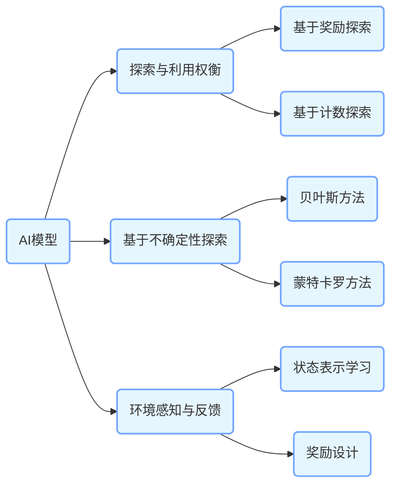

# 增强AI模型探索能力的策略设计

> 关键词：AI模型、探索能力、策略设计、强化学习、不确定性采样

> 摘要：本文聚焦于增强AI模型探索能力的策略设计，详细阐述了相关核心概念、算法原理、数学模型等内容。首先介绍了研究背景，明确目的和范围、预期读者等。接着深入探讨核心概念及其联系，给出了清晰的文本示意图和Mermaid流程图。通过Python源代码详细讲解核心算法原理和具体操作步骤，并对数学模型和公式进行详细说明与举例。结合项目实战，展示代码实际案例并深入解读。分析了实际应用场景，推荐了学习资源、开发工具框架和相关论文著作。最后总结未来发展趋势与挑战，提供常见问题解答和扩展阅读参考资料，旨在为提升AI模型探索能力提供全面且深入的指导。

## 1. 背景介绍 
### 1.1 目的和范围
在当今人工智能领域，AI模型的应用越来越广泛，但很多模型在面对复杂环境和未知情况时，探索能力不足。本研究的目的在于设计一系列有效的策略来增强AI模型的探索能力，使模型能够更全面地了解环境，发现更多潜在的规律和信息。范围涵盖了常见的AI模型类型，如深度学习模型、强化学习模型等，涉及图像识别、自然语言处理、机器人控制等多个应用领域。

### 1.2 预期读者
本文预期读者包括人工智能领域的研究人员、开发者、数据科学家以及对AI技术感兴趣的学生等。对于正在从事AI模型开发和优化工作的专业人士，可从中获取增强模型探索能力的实用策略和方法；对于初学者，能帮助他们了解相关领域的核心概念和技术原理。

### 1.3 文档结构概述
本文首先介绍背景信息，让读者了解研究的目的和意义。接着阐述核心概念与联系，帮助读者建立起相关知识体系。然后详细讲解核心算法原理和具体操作步骤，通过Python代码进行说明。之后介绍数学模型和公式，并举例说明其应用。通过项目实战展示代码实际案例并进行详细解释。分析实际应用场景，让读者了解这些策略的实际用途。推荐学习资源、开发工具框架和相关论文著作，方便读者进一步深入学习。最后总结未来发展趋势与挑战，提供常见问题解答和扩展阅读参考资料。

### 1.4 术语表
#### 1.4.1 核心术语定义
- **AI模型**：人工智能模型是基于一定的算法和数据构建的，用于完成特定任务（如图像分类、语音识别等）的计算模型。
- **探索能力**：指AI模型在未知环境中主动寻找新信息、尝试不同行为以发现潜在规律和最优解的能力。
- **策略设计**：为实现特定目标（如增强AI模型探索能力）而制定的一系列方法和规则。

#### 1.4.2 相关概念解释
- **强化学习**：一种机器学习方法，智能体通过与环境进行交互，根据环境反馈的奖励信号来学习最优行为策略。在强化学习中，探索与利用是一个重要的权衡问题，探索有助于发现更好的策略，而利用则是利用已有的经验。
- **不确定性采样**：在主动学习中，根据样本的不确定性来选择样本进行标注，以提高模型的学习效率和性能。不确定性高的样本往往包含更多的新信息，有助于模型的探索。

#### 1.4.3 缩略词列表
- **RL**：Reinforcement Learning，强化学习
- **DNN**：Deep Neural Network，深度神经网络
- **Q - learning**：一种无模型的强化学习算法

## 2. 核心概念与联系 

### 核心概念原理
#### AI模型的探索与利用权衡
在AI模型的学习过程中，存在探索与利用的权衡问题。利用是指模型利用已有的知识和经验来做出决策，以获得即时的奖励；而探索则是模型尝试新的行为和策略，以发现更多潜在的信息和更好的解决方案。例如，在强化学习中，智能体需要在已知的最优动作和尝试新动作之间进行选择。如果只注重利用，模型可能会陷入局部最优解；如果只注重探索，模型可能会浪费大量的时间和资源而无法获得有效的学习成果。

#### 基于不确定性的探索策略
不确定性是衡量模型对某个状态或动作的了解程度的指标。当模型对某个状态或动作的不确定性较高时，说明该状态或动作可能包含更多的新信息，值得进行探索。基于不确定性的探索策略就是根据模型的不确定性来选择探索的方向和动作。例如，在贝叶斯神经网络中，可以通过计算模型输出的不确定性来选择探索的样本。

### 架构的文本示意图
```plaintext
AI模型探索能力增强策略
|-- 探索与利用权衡机制
|   |-- 基于奖励的探索策略
|   |-- 基于计数的探索策略
|-- 基于不确定性的探索策略
|   |-- 贝叶斯方法
|   |-- 蒙特卡罗方法
|-- 环境感知与反馈机制
|   |-- 状态表示学习
|   |-- 奖励设计
```

### Mermaid流程图


## 3. 核心算法原理 & 具体操作步骤 

### 基于不确定性采样的探索算法原理
不确定性采样是一种常用的基于不确定性的探索策略，其核心思想是选择模型预测不确定性最大的样本进行探索。在分类问题中，常用的不确定性度量方法有熵、最小置信度等。

### Python源代码实现
```python
import numpy as np
from sklearn.datasets import make_classification
from sklearn.model_selection import train_test_split
from sklearn.linear_model import LogisticRegression

# 生成数据集
X, y = make_classification(n_samples=1000, n_features=20, n_informative=10, n_classes=2, random_state=42)
X_train, X_test, y_train, y_test = train_test_split(X, y, test_size=0.2, random_state=42)

# 初始化模型
model = LogisticRegression()

# 选择初始训练样本
n_initial = 100
X_initial = X_train[:n_initial]
y_initial = y_train[:n_initial]

# 训练初始模型
model.fit(X_initial, y_initial)

# 定义不确定性采样函数
def uncertainty_sampling(model, X_pool):
    probabilities = model.predict_proba(X_pool)
    entropy = -np.sum(probabilities * np.log2(probabilities + 1e-10), axis=1)
    idx = np.argmax(entropy)
    return idx

# 主动学习过程
n_queries = 10
X_pool = X_train[n_initial:]
y_pool = y_train[n_initial:]

for _ in range(n_queries):
    # 选择样本
    idx = uncertainty_sampling(model, X_pool)
    X_new = X_pool[idx:idx+1]
    y_new = y_pool[idx:idx+1]
    
    # 更新训练集
    X_initial = np.vstack((X_initial, X_new))
    y_initial = np.hstack((y_initial, y_new))
    
    # 移除已选择的样本
    X_pool = np.delete(X_pool, idx, axis=0)
    y_pool = np.delete(y_pool, idx)
    
    # 重新训练模型
    model.fit(X_initial, y_initial)

# 评估模型性能
accuracy = model.score(X_test, y_test)
print(f"Final accuracy: {accuracy}")
```

### 具体操作步骤
1. **数据准备**：生成或加载数据集，并将其划分为训练集和测试集。选择一部分样本作为初始训练集。
2. **模型初始化**：选择合适的模型（如逻辑回归、神经网络等），并使用初始训练集进行训练。
3. **不确定性采样**：计算未标注样本的不确定性，选择不确定性最大的样本。
4. **样本更新**：将选择的样本添加到训练集中，并从未标注样本池中移除该样本。
5. **模型更新**：使用更新后的训练集重新训练模型。
6. **重复步骤3 - 5**：直到达到预设的查询次数或满足其他停止条件。
7. **模型评估**：使用测试集评估最终模型的性能。

## 4. 数学模型和公式 & 详细讲解 & 举例说明 

### 熵的计算公式
在信息论中，熵是衡量随机变量不确定性的指标。对于一个离散随机变量 $X$，其概率分布为 $P(X = x_i) = p_i$，$i = 1,2,\cdots,n$，则熵的计算公式为：
$$H(X) = -\sum_{i = 1}^{n} p_i \log_2 p_i$$

### 详细讲解
熵的值越大，说明随机变量的不确定性越高。在不确定性采样中，我们可以将模型对样本的预测概率分布看作一个随机变量，通过计算其熵来衡量样本的不确定性。当模型对某个样本的预测概率分布比较均匀时，熵的值较大，说明模型对该样本的预测不确定性较高，该样本值得进行探索。

### 举例说明
假设一个二分类问题，模型对某个样本的预测概率为 $P(y = 0) = 0.5$，$P(y = 1) = 0.5$，则该样本的熵为：
$$H = - (0.5 \log_2 0.5 + 0.5 \log_2 0.5) = 1$$
如果模型对另一个样本的预测概率为 $P(y = 0) = 0.9$，$P(y = 1) = 0.1$，则该样本的熵为：
$$H = - (0.9 \log_2 0.9 + 0.1 \log_2 0.1) \approx 0.469$$
可以看出，第一个样本的熵较大，说明模型对该样本的预测不确定性较高，更适合进行探索。

## 5. 项目实战：代码实际案例和详细解释说明 

### 5.1  开发环境搭建
#### 操作系统
可以选择Windows、Linux（如Ubuntu）或macOS等主流操作系统。

#### 编程语言和库
- **Python**：建议使用Python 3.6及以上版本。
- **机器学习库**：安装`scikit - learn`、`numpy`、`pandas`等库，可以使用`pip`或`conda`进行安装。例如：
```sh
pip install scikit-learn numpy pandas
```

#### 开发工具
可以使用Jupyter Notebook、PyCharm等开发工具。Jupyter Notebook适合进行交互式开发和实验，PyCharm则更适合进行大型项目的开发和调试。

### 5.2  源代码详细实现和代码解读
```python
import numpy as np
from sklearn.datasets import make_classification
from sklearn.model_selection import train_test_split
from sklearn.linear_model import LogisticRegression

# 生成数据集
X, y = make_classification(n_samples=1000, n_features=20, n_informative=10, n_classes=2, random_state=42)
X_train, X_test, y_train, y_test = train_test_split(X, y, test_size=0.2, random_state=42)
```
- **代码解读**：使用`make_classification`函数生成一个二分类数据集，包含1000个样本，每个样本有20个特征，其中10个特征是有信息的。使用`train_test_split`函数将数据集划分为训练集和测试集，测试集占比为20%。

```python
# 初始化模型
model = LogisticRegression()

# 选择初始训练样本
n_initial = 100
X_initial = X_train[:n_initial]
y_initial = y_train[:n_initial]

# 训练初始模型
model.fit(X_initial, y_initial)
```
- **代码解读**：初始化一个逻辑回归模型，并选择前100个样本作为初始训练集。使用初始训练集对模型进行训练。

```python
# 定义不确定性采样函数
def uncertainty_sampling(model, X_pool):
    probabilities = model.predict_proba(X_pool)
    entropy = -np.sum(probabilities * np.log2(probabilities + 1e-10), axis=1)
    idx = np.argmax(entropy)
    return idx
```
- **代码解读**：定义一个不确定性采样函数，该函数接受模型和未标注样本池作为输入。首先使用模型对未标注样本进行预测，得到每个样本的预测概率分布。然后计算每个样本的熵，选择熵最大的样本的索引并返回。

```python
# 主动学习过程
n_queries = 10
X_pool = X_train[n_initial:]
y_pool = y_train[n_initial:]

for _ in range(n_queries):
    # 选择样本
    idx = uncertainty_sampling(model, X_pool)
    X_new = X_pool[idx:idx+1]
    y_new = y_pool[idx:idx+1]
    
    # 更新训练集
    X_initial = np.vstack((X_initial, X_new))
    y_initial = np.hstack((y_initial, y_new))
    
    # 移除已选择的样本
    X_pool = np.delete(X_pool, idx, axis=0)
    y_pool = np.delete(y_pool, idx)
    
    # 重新训练模型
    model.fit(X_initial, y_initial)
```
- **代码解读**：定义主动学习的查询次数为10次。将剩余的训练样本作为未标注样本池。在每次迭代中，使用不确定性采样函数选择一个样本，将其添加到训练集中，并从未标注样本池中移除该样本。然后使用更新后的训练集重新训练模型。

```python
# 评估模型性能
accuracy = model.score(X_test, y_test)
print(f"Final accuracy: {accuracy}")
```
- **代码解读**：使用测试集评估最终模型的准确率，并打印结果。

### 5.3  代码解读与分析
通过上述代码，我们实现了一个基于不确定性采样的主动学习过程。在主动学习中，模型通过不断选择不确定性最大的样本进行标注和学习，能够更有效地利用有限的标注数据，提高模型的性能。从代码中可以看出，不确定性采样的核心在于计算样本的熵，通过熵来衡量样本的不确定性。同时，主动学习的过程是一个迭代的过程，每次迭代都更新训练集和模型，逐步提高模型的性能。

## 6. 实际应用场景 
### 图像识别领域
在图像识别任务中，标注大量的图像数据是非常昂贵和耗时的。通过使用基于不确定性采样的探索策略，可以选择模型最不确定的图像进行标注，从而提高标注数据的利用效率。例如，在医学图像识别中，可以选择模型对病变区域判断不确定的图像进行专家标注，帮助模型更好地学习病变特征。

### 自然语言处理领域
在自然语言处理任务中，如文本分类、情感分析等，同样存在标注数据不足的问题。使用探索策略可以选择模型难以分类的文本进行标注，提高模型的分类性能。例如，在社交媒体情感分析中，可以选择模型对情感倾向判断不确定的文本进行人工标注，使模型能够更好地理解复杂的语言表达。

### 机器人控制领域
在机器人控制中，机器人需要在未知环境中进行探索和学习。通过增强机器人的探索能力，可以使其更快地了解环境，发现最优的行动策略。例如，在机器人导航任务中，机器人可以根据环境的不确定性选择探索的方向，避免陷入局部最优路径。

## 7. 工具和资源推荐
### 7.1 学习资源推荐
#### 7.1.1 书籍推荐
- 《人工智能：一种现代的方法》：全面介绍了人工智能的各个领域，包括搜索算法、机器学习、自然语言处理等，是人工智能领域的经典教材。
- 《深度学习》：由Ian Goodfellow、Yoshua Bengio和Aaron Courville撰写，详细介绍了深度学习的基本原理、算法和应用。
- 《强化学习：原理与Python实现》：介绍了强化学习的基本概念、算法和实现方法，通过Python代码示例帮助读者更好地理解和应用强化学习。

#### 7.1.2 在线课程
- Coursera上的“深度学习专项课程”：由吴恩达教授授课，涵盖了深度学习的基础知识、卷积神经网络、循环神经网络等内容。
- edX上的“强化学习基础”：介绍了强化学习的基本概念、算法和应用，通过实际案例帮助学生掌握强化学习的编程实现。
- 哔哩哔哩上的一些人工智能相关课程：有很多优质的免费课程，适合初学者入门学习。

#### 7.1.3 技术博客和网站
- Medium：有很多人工智能领域的专业博主分享最新的研究成果和技术应用。
- arXiv：是一个预印本平台，提供了大量的人工智能相关的研究论文。
- 机器之心：专注于人工智能领域的资讯和技术解读，提供了很多有价值的文章和案例分析。

### 7.2 开发工具框架推荐
#### 7.2.1 IDE和编辑器
- PyCharm：是一款专业的Python集成开发环境，提供了丰富的代码编辑、调试、版本控制等功能，适合大型项目的开发。
- Jupyter Notebook：是一个交互式的开发环境，支持多种编程语言，适合进行数据探索、模型实验和可视化等工作。
- Visual Studio Code：是一款轻量级的代码编辑器，支持多种编程语言和插件扩展，具有良好的代码编辑和调试功能。

#### 7.2.2 调试和性能分析工具
- TensorBoard：是TensorFlow提供的可视化工具，可以用于可视化模型的训练过程、损失函数变化、参数分布等信息。
- PyTorch Profiler：是PyTorch提供的性能分析工具，可以帮助开发者分析模型的性能瓶颈，优化代码性能。
- cProfile：是Python内置的性能分析工具，可以分析Python代码的执行时间和函数调用次数。

#### 7.2.3 相关框架和库
- TensorFlow：是一个开源的机器学习框架，提供了丰富的工具和库，支持深度学习模型的构建、训练和部署。
- PyTorch：是另一个流行的深度学习框架，具有动态图的特点，易于使用和调试。
- Scikit - learn：是一个简单易用的机器学习库，提供了各种机器学习算法和工具，适合初学者入门和快速开发。

### 7.3 相关论文著作推荐
#### 7.3.1 经典论文
- “Q - learning”：由Watkins和Dayan提出，是强化学习领域的经典论文，介绍了Q - learning算法的基本原理和实现方法。
- “Dropout: A Simple Way to Prevent Neural Networks from Overfitting”：介绍了Dropout技术，用于防止神经网络过拟合，提高模型的泛化能力。
- “Active Learning Literature Survey”：对主动学习领域的研究进行了全面的综述，介绍了各种主动学习算法和应用场景。

#### 7.3.2 最新研究成果
- 关注NeurIPS、ICML、CVPR等顶级人工智能会议的论文，这些会议每年都会发布很多最新的研究成果。
- 关注arXiv上的最新预印本论文，了解人工智能领域的前沿研究动态。

#### 7.3.3 应用案例分析
- 一些知名科技公司（如Google、Microsoft、Facebook等）的技术博客会分享他们在人工智能领域的应用案例和实践经验，可以从中学习到很多实际应用中的技巧和方法。
- Kaggle上的竞赛和数据集也提供了很多实际应用案例，通过参与竞赛和分析数据集，可以提高自己的实践能力。

## 8. 总结：未来发展趋势与挑战
### 未来发展趋势
- **多模态探索**：未来的AI模型将不仅仅局限于单一模态的数据（如图像、文本等），而是会综合利用多种模态的数据进行探索，以获得更全面的信息。例如，在智能机器人领域，机器人可以同时利用视觉、听觉、触觉等多种传感器信息进行环境探索。
- **自主探索与进化**：AI模型将逐渐具备更强的自主探索能力，能够在没有人类干预的情况下自主发现问题、探索解决方案，并不断进化和优化自身的性能。
- **与人类的协同探索**：AI模型将与人类进行更加紧密的协同探索，人类可以为模型提供领域知识和指导，模型则可以为人类提供数据分析和决策支持，共同完成复杂的任务。

### 挑战
- **计算资源限制**：增强AI模型的探索能力往往需要大量的计算资源，如高性能的GPU、大规模的数据集等。如何在有限的计算资源下实现高效的探索是一个亟待解决的问题。
- **不确定性的准确度量**：准确度量模型的不确定性是基于不确定性的探索策略的关键。然而，目前的不确定性度量方法还存在一定的局限性，如何更准确地度量不确定性是一个挑战。
- **伦理和安全问题**：随着AI模型探索能力的增强，可能会带来一些伦理和安全问题。例如，模型在探索过程中可能会做出一些不道德或不安全的决策，如何确保模型的行为符合伦理和安全标准是一个重要的挑战。

## 9. 附录：常见问题与解答
### 问题1：为什么要增强AI模型的探索能力？
答：增强AI模型的探索能力可以使模型更全面地了解环境，发现更多潜在的规律和信息，避免陷入局部最优解，提高模型的性能和泛化能力。特别是在面对复杂环境和未知情况时，探索能力显得尤为重要。

### 问题2：基于不确定性采样的探索策略有什么优缺点？
答：优点是可以选择模型最不确定的样本进行探索，提高标注数据的利用效率，加速模型的学习过程。缺点是不确定性度量方法可能存在误差，导致选择的样本不一定是最有价值的。此外，该策略对于模型的要求较高，需要模型能够输出可靠的预测概率。

### 问题3：如何平衡探索与利用？
答：可以使用一些方法来平衡探索与利用，如ε - greedy策略、玻尔兹曼探索策略等。ε - greedy策略以一定的概率（ε）选择随机动作进行探索，以1 - ε的概率选择当前最优动作进行利用。玻尔兹曼探索策略根据动作的价值估计计算动作的选择概率，价值估计越高的动作被选择的概率越大，但仍然有一定的概率选择其他动作进行探索。

## 10. 扩展阅读 & 参考资料
### 扩展阅读
- 《人工智能哲学》：从哲学的角度探讨人工智能的本质、伦理和社会影响等问题。
- 《智能时代》：介绍了人工智能在各个领域的应用和发展趋势，以及对人类社会的影响。

### 参考资料
- Goodfellow, I., Bengio, Y., & Courville, A. (2016). Deep Learning. MIT Press.
- Sutton, R. S., & Barto, A. G. (2018). Reinforcement Learning: An Introduction. MIT Press.
- Settles, B. (2010). Active Learning Literature Survey. University of Wisconsin–Madison.

作者：AI天才研究院/AI Genius Institute & 禅与计算机程序设计艺术 /Zen And The Art of Computer Programming