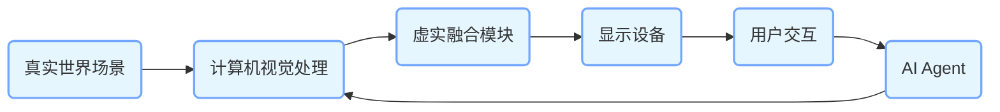

# 增强现实技术与AI Agent的结合

> 关键词：增强现实技术、AI Agent、虚实融合、智能交互、计算机视觉、机器学习

> 摘要：本文深入探讨了增强现实技术（AR）与AI Agent的结合。首先介绍了该研究的背景、目的、预期读者以及文档结构，对相关术语进行了清晰定义。接着阐述了增强现实技术和AI Agent的核心概念及其联系，并给出了相应的原理和架构示意图与流程图。详细讲解了实现二者结合的核心算法原理及具体操作步骤，同时给出了Python源代码示例。通过数学模型和公式进一步剖析其内在逻辑，并举例说明。在项目实战部分，从开发环境搭建到源代码实现与解读进行了全面介绍。探讨了该结合在多个领域的实际应用场景，推荐了相关的学习资源、开发工具框架以及论文著作。最后总结了未来发展趋势与挑战，并提供了常见问题解答和扩展阅读参考资料。旨在为读者全面呈现增强现实技术与AI Agent结合的技术全貌和发展前景。

## 1. 背景介绍 
### 1.1 目的和范围
增强现实（Augmented Reality，AR）技术通过将虚拟信息与真实世界场景融合，为用户带来了全新的交互体验。而AI Agent作为具有自主决策和执行能力的智能实体，能够理解环境、处理信息并做出响应。将增强现实技术与AI Agent相结合，旨在创造更加智能、自然和高效的人机交互环境。本文章的范围涵盖了从核心概念的阐述、算法原理的分析、实际案例的展示到应用场景的探讨，旨在为读者全面介绍这一前沿技术的各个方面。

### 1.2 预期读者
本文预期读者包括对增强现实技术和AI Agent感兴趣的技术爱好者、计算机科学相关专业的学生、从事相关领域研究和开发的科研人员以及希望了解这一技术应用前景的企业管理人员等。

### 1.3 文档结构概述
本文首先对相关术语进行解释，为后续内容打下基础。接着详细介绍增强现实技术和AI Agent的核心概念及其联系，通过示意图和流程图直观展示。然后阐述实现二者结合的核心算法原理和具体操作步骤，并给出Python代码示例。利用数学模型和公式深入剖析其内在机制，并举例说明。在项目实战部分，从开发环境搭建到代码实现与解读进行全面介绍。探讨该结合在不同领域的实际应用场景，推荐相关的学习资源、开发工具框架和论文著作。最后总结未来发展趋势与挑战，提供常见问题解答和扩展阅读参考资料。

### 1.4 术语表
#### 1.4.1 核心术语定义
- **增强现实技术（Augmented Reality，AR）**：是一种将虚拟信息与真实世界场景实时融合的技术，通过计算机生成的图形、图像、声音等虚拟元素，增强用户对真实环境的感知和交互体验。
- **AI Agent**：是一种能够感知环境、自主决策并执行相应动作的智能实体。它可以基于预设的规则或通过机器学习算法学习，以实现特定的任务目标。
- **虚实融合**：指将虚拟的数字内容与真实的物理环境进行无缝结合，使用户在真实场景中能够同时看到和交互虚拟元素。
- **智能交互**：利用AI技术实现的自然、高效、个性化的人机交互方式，能够理解用户的意图并做出相应的响应。

#### 1.4.2 相关概念解释
- **计算机视觉**：是AI的一个重要分支，主要研究如何让计算机理解和解释图像和视频中的内容。在增强现实技术与AI Agent结合中，计算机视觉用于识别真实场景中的物体、特征和环境信息，为虚拟元素的准确叠加和交互提供基础。
- **机器学习**：是AI的核心技术之一，通过让计算机从数据中学习模式和规律，从而实现对未知数据的预测和决策。在AI Agent中，机器学习算法用于训练Agent的智能行为，使其能够根据不同的环境和任务进行自适应调整。

#### 1.4.3 缩略词列表
- **AR**：Augmented Reality（增强现实）
- **AI**：Artificial Intelligence（人工智能）

## 2. 核心概念与联系 

### 增强现实技术原理
增强现实技术的核心原理是通过摄像头等设备获取真实场景的图像或视频，然后利用计算机视觉算法对这些数据进行处理，识别出场景中的特征和物体。接着，根据这些识别结果，将虚拟元素准确地叠加到真实场景中，并通过显示设备（如AR眼镜、手机屏幕等）呈现给用户。

### AI Agent原理
AI Agent通常由感知模块、决策模块和执行模块组成。感知模块用于收集环境信息，如通过传感器获取数据；决策模块根据感知到的信息和预设的规则或学习到的模型进行决策；执行模块则根据决策结果执行相应的动作。

### 二者联系
增强现实技术为AI Agent提供了更加直观和自然的交互环境，AI Agent可以通过AR技术更好地感知和理解真实世界。同时，AI Agent的智能决策和执行能力可以为增强现实应用带来更加个性化和智能化的交互体验。例如，在AR游戏中，AI Agent可以根据玩家的动作和场景变化实时调整虚拟角色的行为；在工业维修领域，AI Agent可以通过AR技术为维修人员提供实时的指导和建议。

### 核心概念原理和架构的文本示意图
```plaintext
+----------------------+
|  真实世界场景        |
|  （摄像头获取图像）  |
+----------------------+
           |
           v
+----------------------+
|  计算机视觉处理      |
|  （特征提取、物体识别）|
+----------------------+
           |
           v
+----------------------+
|  虚实融合模块        |
|  （虚拟元素叠加）    |
+----------------------+
           |
           v
+----------------------+
|  显示设备            |
|  （AR眼镜、手机屏幕）|
+----------------------+
           |
           v
+----------------------+
|  用户交互            |
+----------------------+
           |
           v
+----------------------+
|  AI Agent            |
|  （感知、决策、执行）|
+----------------------+
```

### Mermaid流程图


## 3. 核心算法原理 & 具体操作步骤 

### 计算机视觉算法
在增强现实技术中，计算机视觉算法用于识别真实场景中的物体和特征，常用的算法包括特征提取算法（如SIFT、SURF）和目标检测算法（如YOLO、Faster R-CNN）。以下是一个使用OpenCV库进行特征提取和匹配的Python示例代码：

```python
import cv2
import numpy as np

# 读取图像
img1 = cv2.imread('image1.jpg', cv2.IMREAD_GRAYSCALE)
img2 = cv2.imread('image2.jpg', cv2.IMREAD_GRAYSCALE)

# 创建SIFT对象
sift = cv2.SIFT_create()

# 检测关键点和计算描述符
kp1, des1 = sift.detectAndCompute(img1, None)
kp2, des2 = sift.detectAndCompute(img2, None)

# 创建BFMatcher对象
bf = cv2.BFMatcher()

# 匹配描述符
matches = bf.knnMatch(des1, des2, k=2)

# 应用比率测试
good_matches = []
for m, n in matches:
    if m.distance < 0.75 * n.distance:
        good_matches.append(m)

# 绘制匹配结果
img3 = cv2.drawMatches(img1, kp1, img2, kp2, good_matches, None, flags=cv2.DrawMatchesFlags_NOT_DRAW_SINGLE_POINTS)

# 显示结果
cv2.imshow('Matches', img3)
cv2.waitKey(0)
cv2.destroyAllWindows()
```

### AI Agent决策算法
AI Agent的决策算法可以基于规则、机器学习或深度学习。以下是一个简单的基于规则的AI Agent决策示例：

```python
class AIAgent:
    def __init__(self):
        self.rules = {
            "condition1": "action1",
            "condition2": "action2"
        }

    def make_decision(self, condition):
        if condition in self.rules:
            return self.rules[condition]
        else:
            return "default_action"

# 创建AI Agent实例
agent = AIAgent()

# 模拟条件
condition = "condition1"

# 做出决策
action = agent.make_decision(condition)
print(f"决策结果: {action}")
```

### 具体操作步骤
1. **数据采集**：使用摄像头等设备获取真实场景的图像或视频数据。
2. **计算机视觉处理**：对采集到的数据进行特征提取、物体识别等处理，获取场景信息。
3. **虚实融合**：根据计算机视觉处理结果，将虚拟元素准确地叠加到真实场景中。
4. **用户交互**：用户通过手势、语音等方式与增强现实场景进行交互。
5. **AI Agent感知与决策**：AI Agent感知用户的交互和场景变化，根据预设的规则或学习到的模型做出决策。
6. **执行动作**：根据AI Agent的决策结果，更新虚拟元素的状态或执行相应的动作。

## 4. 数学模型和公式 & 详细讲解 & 举例说明 

### 相机投影模型
在增强现实技术中，相机投影模型用于将三维世界中的点投影到二维图像平面上。常用的相机投影模型是针孔相机模型，其数学公式如下：

$$
\begin{bmatrix}
u \\
v \\
1
\end{bmatrix}
=
\frac{1}{Z}
\begin{bmatrix}
f_x & 0 & c_x \\
0 & f_y & c_y \\
0 & 0 & 1
\end{bmatrix}
\begin{bmatrix}
R & t \\
0^T & 1
\end{bmatrix}
\begin{bmatrix}
X \\
Y \\
Z \\
1
\end{bmatrix}
$$

其中，$(X, Y, Z)$ 是三维世界中的点坐标，$(u, v)$ 是该点在二维图像平面上的投影坐标，$f_x$ 和 $f_y$ 是相机的焦距，$(c_x, c_y)$ 是图像平面的中心点坐标，$R$ 是旋转矩阵，$t$ 是平移向量。

### 详细讲解
相机投影模型描述了三维世界中的点如何映射到二维图像平面上。通过该模型，我们可以根据相机的内参（焦距、中心点坐标）和外参（旋转和平移），将三维虚拟物体准确地投影到真实场景的图像中。

### 举例说明
假设我们有一个三维虚拟物体，其坐标为 $(X, Y, Z) = (1, 2, 3)$，相机的内参为 $f_x = 500$，$f_y = 500$，$c_x = 320$，$c_y = 240$，外参为 $R = I$（单位矩阵），$t = [0, 0, 0]^T$。将这些值代入相机投影模型公式中，可以计算出该物体在二维图像平面上的投影坐标 $(u, v)$：

$$
\begin{bmatrix}
u \\
v \\
1
\end{bmatrix}
=
\frac{1}{3}
\begin{bmatrix}
500 & 0 & 320 \\
0 & 500 & 240 \\
0 & 0 & 1
\end{bmatrix}
\begin{bmatrix}
1 & 0 & 0 & 0 \\
0 & 1 & 0 & 0 \\
0 & 0 & 1 & 0 \\
0 & 0 & 0 & 1
\end{bmatrix}
\begin{bmatrix}
1 \\
2 \\
3 \\
1
\end{bmatrix}
=
\frac{1}{3}
\begin{bmatrix}
500 & 0 & 320 \\
0 & 500 & 240 \\
0 & 0 & 1
\end{bmatrix}
\begin{bmatrix}
1 \\
2 \\
3 \\
1
\end{bmatrix}
=
\frac{1}{3}
\begin{bmatrix}
500\times1 + 320\times1 \\
500\times2 + 240\times1 \\
1\times1
\end{bmatrix}
=
\begin{bmatrix}
273.33 \\
413.33 \\
1
\end{bmatrix}
$$

因此，该物体在二维图像平面上的投影坐标为 $(u, v) = (273.33, 413.33)$。

## 5. 项目实战：代码实际案例和详细解释说明 

### 5.1  开发环境搭建
#### 硬件环境
- **计算机**：具备一定的计算能力，推荐使用多核处理器和独立显卡。
- **摄像头**：用于采集真实场景的图像或视频数据。
- **显示设备**：如AR眼镜或手机屏幕。

#### 软件环境
- **操作系统**：Windows、Linux或macOS。
- **编程语言**：Python。
- **开发框架和库**：OpenCV、NumPy、TensorFlow等。

### 5.2  源代码详细实现和代码解读
以下是一个简单的增强现实应用示例，结合了计算机视觉和AI Agent的功能：

```python
import cv2
import numpy as np

# 定义AI Agent类
class AIAgent:
    def __init__(self):
        self.rules = {
            "face_detected": "show_greeting",
            "no_face_detected": "show_default"
        }

    def make_decision(self, condition):
        if condition in self.rules:
            return self.rules[condition]
        else:
            return "default_action"

# 初始化AI Agent
agent = AIAgent()

# 加载人脸检测器
face_cascade = cv2.CascadeClassifier(cv2.data.haarcascades + 'haarcascade_frontalface_default.xml')

# 打开摄像头
cap = cv2.VideoCapture(0)

while True:
    # 读取帧
    ret, frame = cap.read()

    if not ret:
        break

    # 转换为灰度图像
    gray = cv2.cvtColor(frame, cv2.COLOR_BGR2GRAY)

    # 检测人脸
    faces = face_cascade.detectMultiScale(gray, 1.3, 5)

    if len(faces) > 0:
        condition = "face_detected"
    else:
        condition = "no_face_detected"

    # AI Agent做出决策
    action = agent.make_decision(condition)

    if action == "show_greeting":
        for (x, y, w, h) in faces:
            cv2.rectangle(frame, (x, y), (x+w, y+h), (255, 0, 0), 2)
            cv2.putText(frame, 'Hello!', (x, y - 10), cv2.FONT_HERSHEY_SIMPLEX, 0.9, (255, 0, 0), 2)
    elif action == "show_default":
        cv2.putText(frame, 'No face detected', (10, 30), cv2.FONT_HERSHEY_SIMPLEX, 0.9, (0, 0, 255), 2)

    # 显示帧
    cv2.imshow('AR Application', frame)

    # 按 'q' 键退出
    if cv2.waitKey(1) & 0xFF == ord('q'):
        break

# 释放摄像头并关闭窗口
cap.release()
cv2.destroyAllWindows()
```

### 代码解读与分析
1. **AI Agent类**：定义了一个简单的AI Agent，根据不同的条件（是否检测到人脸）做出相应的决策。
2. **人脸检测器**：使用OpenCV的Haar级联分类器进行人脸检测。
3. **主循环**：不断读取摄像头的帧，检测人脸并根据检测结果调用AI Agent做出决策。
4. **决策执行**：根据AI Agent的决策结果，在图像上绘制矩形框和文本信息。

## 6. 实际应用场景 
### 教育领域
在教育领域，增强现实技术与AI Agent的结合可以为学生提供更加生动、直观的学习体验。例如，在历史课程中，通过AR技术可以将历史场景和人物以虚拟形象呈现给学生，AI Agent可以根据学生的学习进度和问题提供个性化的辅导和解答。

### 工业维修
在工业维修领域，维修人员可以通过AR眼镜查看设备的虚拟维修手册和指导信息，AI Agent可以根据设备的故障情况提供实时的维修建议和解决方案，提高维修效率和准确性。

### 游戏娱乐
在游戏娱乐领域，AR游戏结合AI Agent可以创造更加真实和富有挑战性的游戏体验。例如，在AR寻宝游戏中，AI Agent可以控制虚拟宝藏的位置和行为，根据玩家的动作和策略进行动态调整。

### 医疗保健
在医疗保健领域，医生可以使用AR技术进行手术模拟和培训，AI Agent可以根据患者的病情和医疗数据提供辅助诊断和治疗建议，提高医疗质量和安全性。

## 7. 工具和资源推荐
### 7.1 学习资源推荐
#### 7.1.1 书籍推荐
- 《增强现实：原理、技术与应用》：全面介绍了增强现实技术的原理、算法和应用案例。
- 《人工智能：一种现代方法》：经典的人工智能教材，涵盖了AI Agent的基本概念和算法。
- 《Python计算机视觉编程》：详细讲解了使用Python进行计算机视觉开发的方法和技巧。

#### 7.1.2 在线课程
- Coursera上的“增强现实技术入门”：由知名高校教授授课，系统介绍增强现实技术的基础知识和应用。
- edX上的“人工智能基础”：提供了AI Agent的理论和实践课程。
- Udemy上的“Python计算机视觉实战”：通过实际项目帮助学习者掌握计算机视觉编程。

#### 7.1.3 技术博客和网站
- ARPost：专注于增强现实技术的新闻和技术文章。
- Towards Data Science：提供人工智能和机器学习的最新研究成果和实践经验。
- OpenCV官方文档：详细介绍了OpenCV库的使用方法和示例代码。

### 7.2 开发工具框架推荐
#### 7.2.1 IDE和编辑器
- PyCharm：功能强大的Python集成开发环境，支持代码调试、版本控制等功能。
- Visual Studio Code：轻量级的代码编辑器，具有丰富的插件和扩展功能。

#### 7.2.2 调试和性能分析工具
- OpenCV自带的调试工具：可以帮助开发者调试计算机视觉算法。
- TensorBoard：用于可视化深度学习模型的训练过程和性能指标。

#### 7.2.3 相关框架和库
- OpenCV：开源的计算机视觉库，提供了丰富的图像处理和计算机视觉算法。
- TensorFlow：开源的深度学习框架，可用于训练AI Agent的智能模型。
- ARCore和ARKit：分别是Google和Apple提供的增强现实开发框架，简化了AR应用的开发过程。

### 7.3 相关论文著作推荐
#### 7.3.1 经典论文
- Azuma, Ronald T. "A survey of augmented reality." Presence: Teleoperators and virtual environments 6.4 (1997): 355-385. 该论文对增强现实技术进行了全面的综述，介绍了其发展历程、技术原理和应用领域。
- Russell, Stuart J., and Peter Norvig. "Artificial intelligence: a modern approach." (2003). 经典的人工智能教材，其中对AI Agent的理论和算法进行了深入的探讨。

#### 7.3.2 最新研究成果
- 关注顶级学术会议（如CVPR、ICCV、NeurIPS等）上关于增强现实技术和AI Agent的研究论文，了解最新的技术进展和研究方向。

#### 7.3.3 应用案例分析
- 一些行业报告和学术期刊会发布增强现实技术与AI Agent结合的应用案例分析，通过阅读这些案例可以了解该技术在实际应用中的效果和挑战。

## 8. 总结：未来发展趋势与挑战
### 未来发展趋势
- **更加智能化**：随着AI技术的不断发展，AI Agent将具备更强的智能决策和学习能力，能够更好地理解用户的意图和环境变化，为增强现实应用带来更加个性化和智能化的交互体验。
- **多模态融合**：增强现实技术将与语音识别、手势识别、眼动追踪等多模态交互技术相结合，实现更加自然和便捷的人机交互方式。
- **跨行业应用拓展**：增强现实技术与AI Agent的结合将在更多行业得到应用，如零售、旅游、交通等，为这些行业带来新的发展机遇和变革。

### 挑战
- **技术难题**：目前增强现实技术在虚实融合的精度、稳定性和实时性方面仍存在一定的挑战，需要进一步提高计算机视觉和图形渲染技术的性能。同时，AI Agent的智能决策和学习能力也需要不断优化，以适应复杂多变的环境。
- **用户体验**：如何设计出更加自然、舒适和高效的人机交互界面，提高用户对增强现实应用的接受度和使用体验，是需要解决的重要问题。
- **隐私和安全**：增强现实技术与AI Agent的结合涉及大量的用户数据和隐私信息，如何保障数据的安全和隐私，防止数据泄露和滥用，是必须面对的挑战。

## 9. 附录：常见问题与解答
### 问题1：增强现实技术与虚拟现实技术有什么区别？
增强现实技术是将虚拟信息与真实世界场景融合，用户可以同时看到真实环境和虚拟元素；而虚拟现实技术则是完全创建一个虚拟的环境，用户沉浸在虚拟世界中，与真实环境隔绝。

### 问题2：AI Agent的决策算法有哪些类型？
AI Agent的决策算法主要包括基于规则的算法、基于机器学习的算法和基于深度学习的算法。基于规则的算法根据预设的规则进行决策；基于机器学习的算法通过学习数据中的模式和规律进行决策；基于深度学习的算法则使用神经网络模型进行决策。

### 问题3：开发增强现实应用需要具备哪些技术知识？
开发增强现实应用需要具备计算机视觉、图形学、机器学习、编程语言（如Python、Java等）等方面的技术知识，同时还需要了解相关的开发框架和工具。

### 问题4：增强现实技术与AI Agent结合的应用前景如何？
增强现实技术与AI Agent结合的应用前景非常广阔，在教育、工业、游戏、医疗等多个领域都有巨大的应用潜力。随着技术的不断发展和完善，该技术将为人们的生活和工作带来更多的便利和创新。

## 10. 扩展阅读 & 参考资料
- Azuma, Ronald T. "A survey of augmented reality." Presence: Teleoperators and virtual environments 6.4 (1997): 355-385.
- Russell, Stuart J., and Peter Norvig. "Artificial intelligence: a modern approach." (2003).
- OpenCV官方文档：https://docs.opencv.org/
- TensorFlow官方文档：https://www.tensorflow.org/
- ARCore官方文档：https://developers.google.com/ar
- ARKit官方文档：https://developer.apple.com/arkit/

作者：AI天才研究院/AI Genius Institute & 禅与计算机程序设计艺术 /Zen And The Art of Computer Programming