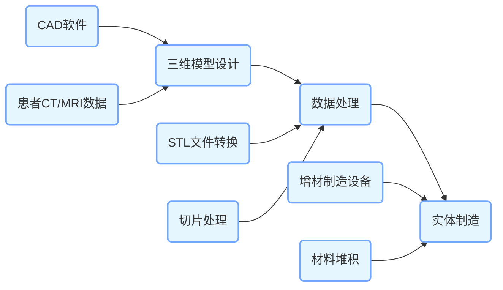

# 增材制造技术在医疗领域的应用与投资机会

> 关键词：增材制造技术、医疗领域、应用、投资机会、3D打印

> 摘要：本文深入探讨了增材制造技术在医疗领域的应用与投资机会。首先介绍了增材制造技术的背景，包括目的范围、预期读者、文档结构和术语表。接着阐述了核心概念与联系，分析了核心算法原理及具体操作步骤，并给出了相关数学模型和公式。通过项目实战案例，详细解释了代码实现和解读。探讨了增材制造技术在医疗领域的实际应用场景，推荐了相关学习资源、开发工具框架和论文著作。最后总结了未来发展趋势与挑战，提供了常见问题解答和扩展阅读参考资料，旨在为读者全面呈现增材制造技术在医疗领域的全貌及潜在投资价值。

## 1. 背景介绍 
### 1.1 目的和范围
增材制造技术，通常也被称为3D打印技术，近年来在多个领域展现出巨大的潜力，尤其是在医疗领域。本文章的目的在于深入研究增材制造技术在医疗领域的具体应用情况，分析其应用的原理、优势和局限性。同时，探讨在这个领域中存在的投资机会，为投资者、医疗从业者以及对该技术感兴趣的人士提供全面且深入的信息。文章的范围涵盖增材制造技术在医疗领域的各个应用场景，包括但不限于生物组织打印、定制化医疗器械制造、手术模型制作等，还将对相关的技术原理、数学模型、实际案例进行详细分析。

### 1.2 预期读者
本文预期读者包括医疗行业的从业者，如医生、医疗器械研发人员等，他们可以从文章中了解增材制造技术在医疗领域的最新应用和发展趋势，为其临床实践和研发工作提供参考。同时，也适合投资领域的人士，包括风险投资家、私募股权投资者等，帮助他们评估增材制造技术在医疗领域的投资价值和潜在风险。此外，对增材制造技术和医疗科技感兴趣的科研人员、学生以及普通爱好者也能从文章中获取有价值的信息。

### 1.3 文档结构概述
本文将按照以下结构进行阐述：首先介绍增材制造技术的核心概念与联系，包括其原理和架构，并用文本示意图和Mermaid流程图进行直观展示。接着详细讲解核心算法原理和具体操作步骤，通过Python源代码进行详细阐述。然后给出相关的数学模型和公式，并进行详细讲解和举例说明。通过项目实战案例，介绍开发环境搭建、源代码详细实现和代码解读。探讨增材制造技术在医疗领域的实际应用场景，推荐相关的学习资源、开发工具框架和论文著作。最后总结未来发展趋势与挑战，提供常见问题解答和扩展阅读参考资料。

### 1.4 术语表
#### 1.4.1 核心术语定义
- **增材制造技术（Additive Manufacturing）**：又称3D打印技术，是一种通过逐层堆积材料来制造三维物体的技术，与传统的减材制造（如切削加工）方法相对。
- **生物组织打印（Bioprinting）**：利用增材制造技术，将生物材料、细胞和生物活性分子等精确地沉积到特定位置，以构建具有生物功能的组织和器官。
- **定制化医疗器械（Customized Medical Devices）**：根据患者的个体生理特征和需求，利用增材制造技术制造的个性化医疗器械，如定制化的假肢、牙科植入物等。
- **手术模型（Surgical Models）**：使用增材制造技术制作的与患者实际解剖结构相似的模型，用于手术规划、模拟和培训。

#### 1.4.2 相关概念解释
- **STL文件（Stereolithography File）**：一种常见的三维模型文件格式，用于存储三维物体的表面几何信息，是增材制造技术中常用的输入文件格式。
- **生物墨水（Bioink）**：在生物组织打印中使用的含有细胞和生物材料的液体或凝胶状物质，作为构建生物组织的基础材料。
- **逐层堆积（Layer-by-Layer Deposition）**：增材制造技术的基本原理，通过将材料逐层堆积起来，最终形成三维物体。

#### 1.4.3 缩略词列表
- **AM**：增材制造（Additive Manufacturing）
- **CAD**：计算机辅助设计（Computer-Aided Design）
- **CT**：计算机断层扫描（Computed Tomography）
- **MRI**：磁共振成像（Magnetic Resonance Imaging）

## 2. 核心概念与联系 

增材制造技术的核心原理是基于三维模型数据，通过逐层堆积材料来创建三维物体。其基本架构主要包括三个部分：三维模型设计、数据处理和实体制造。

### 文本示意图
```plaintext
三维模型设计 -> 数据处理 -> 实体制造
  |               |             |
CAD软件         STL文件转换  增材制造设备
  |               |             |
患者CT/MRI数据  切片处理      材料堆积
```

### Mermaid流程图


在三维模型设计阶段，通常使用计算机辅助设计（CAD）软件根据患者的CT或MRI数据创建三维模型。这些数据可以提供患者身体部位的详细几何信息，为后续的制造提供精确的基础。

数据处理阶段主要是将设计好的三维模型转换为增材制造设备能够识别的格式，通常是STL文件。然后对STL文件进行切片处理，将三维模型分割成一系列的二维切片，每个切片对应增材制造过程中的一层。

实体制造阶段，增材制造设备根据切片数据，逐层堆积材料，最终形成三维物体。不同的增材制造技术使用的材料和堆积方式有所不同，常见的技术包括熔融沉积成型（FDM）、光固化成型（SLA）、选择性激光烧结（SLS）等。

## 3. 核心算法原理 & 具体操作步骤 

### 核心算法原理
在增材制造技术中，切片算法是核心算法之一。切片算法的主要目的是将三维模型分割成一系列的二维切片，为增材制造设备提供每层的加工路径信息。下面是一个简单的Python代码示例，用于实现一个基本的切片算法：

```python
import numpy as np

def slice_model(model, layer_height):
    """
    对三维模型进行切片处理
    :param model: 三维模型的顶点数据，格式为numpy数组，形状为(n, 3)
    :param layer_height: 切片的层厚
    :return: 切片结果，格式为列表，每个元素为一个二维切片的顶点数据
    """
    # 计算模型的最小和最大z坐标
    min_z = np.min(model[:, 2])
    max_z = np.max(model[:, 2])
    
    # 计算切片的层数
    num_layers = int((max_z - min_z) / layer_height)
    
    slices = []
    for i in range(num_layers):
        # 计算当前层的z坐标
        current_z = min_z + i * layer_height
        
        # 筛选出当前层的顶点
        layer_vertices = model[(model[:, 2] >= current_z) & (model[:, 2] < current_z + layer_height)]
        
        # 提取当前层的二维顶点数据
        layer_2d_vertices = layer_vertices[:, :2]
        
        slices.append(layer_2d_vertices)
    
    return slices

# 示例使用
# 假设model是一个包含100个顶点的三维模型
model = np.random.rand(100, 3)
layer_height = 0.1
slices = slice_model(model, layer_height)
print(f"切片数量: {len(slices)}")
```

### 具体操作步骤
1. **三维模型设计**：使用CAD软件根据患者的CT或MRI数据创建三维模型。在设计过程中，需要考虑模型的精度、材料特性和制造工艺等因素。
2. **数据转换**：将设计好的三维模型保存为STL文件格式。STL文件是一种简单的三角网格表示法，它将三维模型的表面划分为一系列的三角形，每个三角形由三个顶点和一个法向量表示。
3. **切片处理**：使用切片软件对STL文件进行切片处理。切片软件会根据设定的层厚将三维模型分割成一系列的二维切片，并生成每层的加工路径信息。
4. **实体制造**：将切片数据传输到增材制造设备中，设备根据切片数据逐层堆积材料，最终制造出三维物体。在制造过程中，需要控制设备的参数，如温度、速度、材料流量等，以确保制造质量。

## 4. 数学模型和公式 & 详细讲解 & 举例说明 

### 数学模型
在增材制造技术中，涉及到多个数学模型，其中最基本的是三维空间中的点、线、面的表示和计算。下面是一些常见的数学模型和公式：

#### 点的表示
在三维空间中，一个点可以用一个三维向量 $\mathbf{p} = (x, y, z)$ 表示，其中 $x$、$y$ 和 $z$ 分别是点在 $x$、$y$ 和 $z$ 轴上的坐标。

#### 直线的表示
一条直线可以用参数方程表示：
$$
\mathbf{r}(t) = \mathbf{p}_0 + t\mathbf{v}
$$
其中 $\mathbf{p}_0$ 是直线上的一个已知点，$\mathbf{v}$ 是直线的方向向量，$t$ 是参数。

#### 平面的表示
一个平面可以用点法式方程表示：
$$
A(x - x_0) + B(y - y_0) + C(z - z_0) = 0
$$
其中 $(x_0, y_0, z_0)$ 是平面上的一个已知点，$(A, B, C)$ 是平面的法向量。

### 详细讲解
在切片算法中，需要计算三维模型与切片平面的交线，这就涉及到直线与平面的相交计算。给定一条直线 $\mathbf{r}(t) = \mathbf{p}_0 + t\mathbf{v}$ 和一个平面 $A(x - x_0) + B(y - y_0) + C(z - z_0) = 0$，求它们的交点可以通过以下步骤实现：

1. 将直线方程代入平面方程中，得到：
$$
A(p_{0x} + tv_x - x_0) + B(p_{0y} + tv_y - y_0) + C(p_{0z} + tv_z - z_0) = 0
$$

2. 解出参数 $t$：
$$
t = \frac{A(x_0 - p_{0x}) + B(y_0 - p_{0y}) + C(z_0 - p_{0z})}{Av_x + Bv_y + Cv_z}
$$

3. 将 $t$ 代入直线方程中，得到交点的坐标：
$$
\mathbf{p} = \mathbf{p}_0 + t\mathbf{v}
$$

### 举例说明
假设直线的参数方程为 $\mathbf{r}(t) = (1, 2, 3) + t(1, 1, 1)$，平面的点法式方程为 $2(x - 0) + 3(y - 0) + 4(z - 0) = 0$。

1. 计算参数 $t$：
$$
t = \frac{2(0 - 1) + 3(0 - 2) + 4(0 - 3)}{2\times1 + 3\times1 + 4\times1} = \frac{-2 - 6 - 12}{9} = -\frac{20}{9}
$$

2. 计算交点的坐标：
$$
\mathbf{p} = (1, 2, 3) - \frac{20}{9}(1, 1, 1) = (1 - \frac{20}{9}, 2 - \frac{20}{9}, 3 - \frac{20}{9}) = (-\frac{11}{9}, -\frac{2}{9}, \frac{7}{9})
$$

## 5. 项目实战：代码实际案例和详细解释说明 

### 5.1  开发环境搭建
为了实现一个简单的增材制造项目，我们需要搭建以下开发环境：

1. **操作系统**：推荐使用Windows 10或Ubuntu 20.04。
2. **Python环境**：安装Python 3.8或更高版本，并使用pip安装必要的库，如numpy、matplotlib等。
3. **CAD软件**：可以使用开源的FreeCAD或商业软件SolidWorks进行三维模型设计。
4. **切片软件**：可以使用开源的Slic3r或Cura进行切片处理。
5. **增材制造设备**：根据实际需求选择合适的增材制造设备，如桌面级的FDM 3D打印机。

### 5.2  源代码详细实现和代码解读
下面是一个完整的Python代码示例，用于实现一个简单的增材制造项目，包括三维模型生成、切片处理和路径规划：

```python
import numpy as np
import matplotlib.pyplot as plt

# 生成一个简单的三维模型：立方体
def generate_cube(side_length, num_vertices_per_side):
    """
    生成一个立方体的三维模型
    :param side_length: 立方体的边长
    :param num_vertices_per_side: 每条边上的顶点数量
    :return: 立方体的顶点数据，格式为numpy数组，形状为(n, 3)
    """
    vertices = []
    for x in np.linspace(0, side_length, num_vertices_per_side):
        for y in np.linspace(0, side_length, num_vertices_per_side):
            for z in np.linspace(0, side_length, num_vertices_per_side):
                vertices.append([x, y, z])
    return np.array(vertices)

# 切片处理
def slice_model(model, layer_height):
    """
    对三维模型进行切片处理
    :param model: 三维模型的顶点数据，格式为numpy数组，形状为(n, 3)
    :param layer_height: 切片的层厚
    :return: 切片结果，格式为列表，每个元素为一个二维切片的顶点数据
    """
    min_z = np.min(model[:, 2])
    max_z = np.max(model[:, 2])
    num_layers = int((max_z - min_z) / layer_height)
    
    slices = []
    for i in range(num_layers):
        current_z = min_z + i * layer_height
        layer_vertices = model[(model[:, 2] >= current_z) & (model[:, 2] < current_z + layer_height)]
        layer_2d_vertices = layer_vertices[:, :2]
        slices.append(layer_2d_vertices)
    
    return slices

# 路径规划：简单的逐行扫描路径
def path_planning(slice_vertices, line_spacing):
    """
    对二维切片进行路径规划
    :param slice_vertices: 二维切片的顶点数据，格式为numpy数组，形状为(n, 2)
    :param line_spacing: 扫描线的间距
    :return: 路径规划结果，格式为列表，每个元素为一个路径点的坐标
    """
    min_x = np.min(slice_vertices[:, 0])
    max_x = np.max(slice_vertices[:, 0])
    min_y = np.min(slice_vertices[:, 1])
    max_y = np.max(slice_vertices[:, 1])
    
    path = []
    current_y = min_y
    while current_y <= max_y:
        for x in np.linspace(min_x, max_x, int((max_x - min_x) / line_spacing)):
            path.append([x, current_y])
        current_y += line_spacing
    
    return path

# 主函数
def main():
    # 生成立方体模型
    side_length = 10
    num_vertices_per_side = 10
    model = generate_cube(side_length, num_vertices_per_side)
    
    # 切片处理
    layer_height = 0.5
    slices = slice_model(model, layer_height)
    
    # 路径规划
    line_spacing = 0.2
    for i, slice_vertices in enumerate(slices):
        path = path_planning(slice_vertices, line_spacing)
        
        # 绘制路径
        path = np.array(path)
        plt.plot(path[:, 0], path[:, 1], label=f"Layer {i}")
    
    plt.legend()
    plt.show()

if __name__ == "__main__":
    main()
```

### 代码解读与分析
1. **generate_cube函数**：该函数用于生成一个简单的立方体三维模型。通过指定立方体的边长和每条边上的顶点数量，使用嵌套的循环生成立方体的所有顶点坐标。
2. **slice_model函数**：该函数实现了切片算法，将三维模型分割成一系列的二维切片。通过计算模型的最小和最大z坐标，确定切片的层数，并筛选出每层的顶点数据。
3. **path_planning函数**：该函数对二维切片进行路径规划，采用简单的逐行扫描路径。通过计算切片的最小和最大x、y坐标，确定扫描线的范围，并按照指定的间距生成路径点。
4. **main函数**：主函数调用上述函数，完成三维模型生成、切片处理和路径规划，并使用matplotlib库绘制路径图。

## 6. 实际应用场景 
增材制造技术在医疗领域有着广泛的应用场景，下面介绍几个主要的应用场景：

### 生物组织打印
生物组织打印是增材制造技术在医疗领域的一个重要应用方向。通过将生物材料、细胞和生物活性分子等精确地沉积到特定位置，可以构建具有生物功能的组织和器官。目前，生物组织打印技术已经可以制造出皮肤、血管、骨骼等组织，为组织工程和再生医学提供了新的手段。

### 定制化医疗器械制造
增材制造技术可以根据患者的个体生理特征和需求，制造定制化的医疗器械。例如，定制化的假肢可以更好地适配患者的残肢，提高患者的使用舒适度和功能性；定制化的牙科植入物可以根据患者的牙齿形状和口腔结构进行设计，提高植入物的稳定性和成功率。

### 手术模型制作
使用增材制造技术制作的手术模型可以与患者的实际解剖结构相似，为手术规划、模拟和培训提供了有力的工具。医生可以在手术模型上进行手术演练，提前了解手术的难度和风险，制定更加合理的手术方案，提高手术的成功率和安全性。

### 药物研发
增材制造技术可以用于制造药物载体和药物释放系统。通过精确控制药物载体的形状、尺寸和结构，可以实现药物的精准释放和靶向治疗，提高药物的疗效和安全性。

## 7. 工具和资源推荐
### 7.1 学习资源推荐
#### 7.1.1 书籍推荐
- 《3D打印：从想象到现实》：这本书详细介绍了3D打印技术的原理、应用和发展趋势，适合初学者入门。
- 《生物制造工程》：该书涵盖了生物制造技术的各个方面，包括生物组织打印、生物材料等，对于深入了解增材制造技术在生物医学领域的应用有很大帮助。
- 《医疗器械设计与开发》：介绍了医疗器械的设计原理、开发流程和法规要求，对于从事定制化医疗器械制造的人员有重要的参考价值。

#### 7.1.2 在线课程
- Coursera上的“Additive Manufacturing Specialization”：该课程由知名高校教授授课，系统地介绍了增材制造技术的基础知识和应用。
- edX上的“Bioprinting: From Cells to Organs”：课程聚焦于生物组织打印技术，讲解了生物墨水、细胞打印等关键技术。
- Udemy上的“3D Printing for Beginners”：适合初学者学习3D打印技术的基本操作和应用。

#### 7.1.3 技术博客和网站
- 3D Printing Industry：提供增材制造技术的最新新闻、技术文章和市场分析。
- Bioprinting.org：专注于生物组织打印领域的研究进展和应用案例。
- Medical Design & Outsourcing：涵盖医疗器械设计、开发和制造的相关内容。

### 7.2 开发工具框架推荐
#### 7.2.1 IDE和编辑器
- PyCharm：一款功能强大的Python集成开发环境，适合开发增材制造相关的Python代码。
- Visual Studio Code：轻量级的代码编辑器，支持多种编程语言，具有丰富的插件扩展功能。
- FreeCAD：开源的CAD软件，可用于三维模型设计，支持多种文件格式的导入和导出。

#### 7.2.2 调试和性能分析工具
- NumPy和SciPy：Python的科学计算库，提供了丰富的数值计算和数据分析工具，可用于调试和优化增材制造算法。
- Matplotlib：Python的绘图库，可用于可视化增材制造过程中的数据和结果，帮助调试和分析。
- Profiler：Python的性能分析工具，可用于分析代码的运行时间和内存使用情况，找出性能瓶颈。

#### 7.2.3 相关框架和库
- OpenSCAD：开源的三维建模脚本语言，可用于生成复杂的三维模型，支持增材制造文件格式的导出。
- VTK（Visualization Toolkit）：用于三维数据可视化的开源库，可用于处理和显示增材制造相关的三维模型数据。
- Blender：开源的三维建模和动画软件，具有强大的建模和渲染功能，可用于增材制造模型的设计和可视化。

### 7.3 相关论文著作推荐
#### 7.3.1 经典论文
- “Three-dimensional bioprinting of tissues and organs”：发表于《Nature Biotechnology》，该论文系统地介绍了生物组织打印技术的原理、方法和应用前景。
- “Additive manufacturing technologies: Rapid prototyping to direct digital manufacturing”：发表于《Progress in Materials Science》，对增材制造技术的发展历程、分类和应用进行了全面的综述。
- “Customized medical devices: A review of design, manufacturing, and applications”：发表于《Medical Engineering & Physics》，探讨了定制化医疗器械的设计、制造和应用问题。

#### 7.3.2 最新研究成果
- 定期关注《Science》、《Nature》、《Advanced Materials》等顶级学术期刊，这些期刊经常发表增材制造技术在医疗领域的最新研究成果。
- 参加国际学术会议，如RAPID + TCT、World Biomaterials Congress等，了解该领域的前沿动态和最新研究进展。

#### 7.3.3 应用案例分析
- 《3D Printing in Medicine: Applications, Challenges, and Future Directions》：该书收集了增材制造技术在医疗领域的多个应用案例，对每个案例进行了详细的分析和讨论。
- 相关的行业报告和研究机构发布的案例分析，如市场研究公司的报告、咨询机构的研究成果等，可帮助了解增材制造技术在医疗领域的实际应用情况和商业价值。

## 8. 总结：未来发展趋势与挑战
### 未来发展趋势
- **多材料和多功能打印**：未来的增材制造技术将能够同时使用多种材料进行打印，制造出具有多种功能的医疗器械和生物组织。例如，同时打印生物材料和电子材料，制造出具有生物传感功能的组织工程产品。
- **智能化和自动化**：增材制造设备将越来越智能化和自动化，具备自动检测、自动调整参数和自动修复等功能，提高制造效率和质量。
- **与其他技术的融合**：增材制造技术将与人工智能、大数据、物联网等技术深度融合，实现更加精准的设计、制造和应用。例如，利用人工智能算法优化切片路径和路径规划，提高制造效率和质量。

### 挑战
- **生物相容性和安全性**：在生物组织打印和定制化医疗器械制造中，材料的生物相容性和安全性是关键问题。需要进一步研究和开发新型生物材料，确保其在人体内的安全性和有效性。
- **制造精度和质量控制**：增材制造技术的制造精度和质量控制仍然是一个挑战。需要不断改进制造工艺和设备，提高制造精度和质量稳定性。
- **法规和伦理问题**：增材制造技术在医疗领域的应用涉及到法规和伦理问题。例如，生物组织打印制造的器官和组织的使用和管理需要制定相应的法规和伦理准则。

## 9. 附录：常见问题与解答
### 增材制造技术制造的医疗器械是否符合医疗法规要求？
增材制造技术制造的医疗器械需要符合相关的医疗法规要求。在生产和使用前，需要进行严格的测试和验证，确保其安全性和有效性。同时，制造商需要获得相应的医疗器械生产许可证和注册证。

### 生物组织打印技术目前能否制造出完整的器官？
目前生物组织打印技术还无法制造出完整的、具有全部功能的器官。虽然已经可以制造出一些简单的组织，如皮肤、血管等，但要制造出像心脏、肝脏等复杂的器官，还面临着许多技术挑战，如血管网络的构建、细胞的功能分化等。

### 增材制造技术的成本是否很高？
增材制造技术的成本与制造的物体复杂度、材料选择和设备类型等因素有关。对于一些简单的物体和常见的材料，增材制造的成本可能并不高。但对于一些复杂的物体和特殊的材料，成本可能会相对较高。随着技术的发展和普及，增材制造技术的成本有望逐渐降低。

## 10. 扩展阅读 & 参考资料
- 《3D Printing in Healthcare: Principles, Technologies, and Applications》
- 《Bioprinting: Methods and Protocols》
- 《Additive Manufacturing Handbook: Technologies, Design, Materials, and Applications》
- https://www.3dprintingmedia.network/
- https://www.bioprintingworld.com/

作者：AI天才研究院/AI Genius Institute & 禅与计算机程序设计艺术 /Zen And The Art of Computer Programming