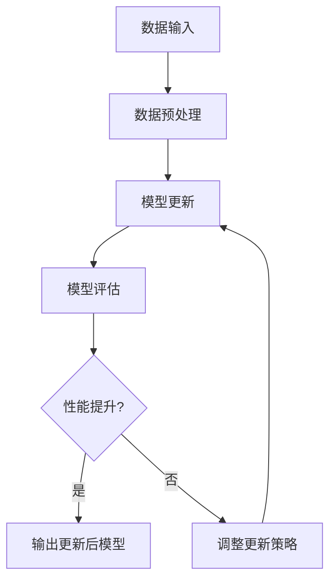

# 增量学习:AI系统的持续进化能力

> 关键词：增量学习、AI系统、持续进化、机器学习、数据更新、模型优化

> 摘要：本文围绕增量学习这一关键技术展开，深入探讨其作为AI系统持续进化能力的核心原理、算法实现、数学模型以及实际应用场景。详细阐述了增量学习在面对不断变化的数据时，如何让AI系统高效地更新和优化模型，以适应新的任务和环境。通过具体的代码案例和分析，展示了增量学习在实际项目中的应用方法。同时，介绍了相关的学习资源、开发工具和论文著作，为读者提供全面的知识体系。最后，对增量学习的未来发展趋势与挑战进行了总结和展望，旨在帮助读者深入理解增量学习的重要性和实际应用价值。

## 1. 背景介绍 
### 1.1 目的和范围
在当今数字化时代，数据呈现出爆炸式增长的态势，并且数据的分布和特征也在不断变化。传统的机器学习模型通常是在固定的数据集上进行训练，一旦训练完成，模型就难以适应新的数据和变化的环境。而增量学习的出现，为解决这一问题提供了有效的途径。本文的目的在于全面深入地介绍增量学习的相关知识，包括其核心概念、算法原理、数学模型、实际应用等方面，使读者能够系统地了解增量学习，并掌握其在实际项目中的应用方法。本文的范围涵盖了增量学习的基础理论、技术实现以及实际应用场景，同时还提供了相关的学习资源和工具推荐，为读者进一步深入学习和研究增量学习提供参考。

### 1.2 预期读者
本文预期读者包括对人工智能、机器学习领域感兴趣的初学者，希望深入了解增量学习技术的专业开发者，以及从事相关研究的科研人员。对于初学者来说，本文将提供一个全面的入门指南，帮助他们理解增量学习的基本概念和原理；对于专业开发者，本文将详细介绍增量学习的算法实现和实际应用案例，为他们在项目中应用增量学习技术提供参考；对于科研人员，本文将介绍增量学习的最新研究成果和发展趋势，为他们的研究工作提供思路和启发。

### 1.3 文档结构概述
本文共分为十个部分，具体结构如下：
1. 背景介绍：介绍增量学习的目的、范围、预期读者以及文档结构概述和术语表。
2. 核心概念与联系：阐述增量学习的核心概念、原理和架构，并通过文本示意图和Mermaid流程图进行直观展示。
3. 核心算法原理 & 具体操作步骤：详细讲解增量学习的核心算法原理，并使用Python源代码进行具体实现和步骤说明。
4. 数学模型和公式 & 详细讲解 & 举例说明：介绍增量学习的数学模型和相关公式，并通过具体例子进行详细讲解。
5. 项目实战：代码实际案例和详细解释说明：通过实际项目案例，展示增量学习的开发环境搭建、源代码实现和代码解读。
6. 实际应用场景：介绍增量学习在不同领域的实际应用场景。
7. 工具和资源推荐：推荐与增量学习相关的学习资源、开发工具框架和论文著作。
8. 总结：未来发展趋势与挑战：对增量学习的未来发展趋势和面临的挑战进行总结和展望。
9. 附录：常见问题与解答：解答读者在学习和应用增量学习过程中常见的问题。
10. 扩展阅读 & 参考资料：提供相关的扩展阅读资料和参考文献。

### 1.4 术语表
#### 1.4.1 核心术语定义
- **增量学习（Incremental Learning）**：也称为在线学习或持续学习，是指在模型训练过程中，随着新数据的不断到来，模型能够逐步更新和优化，而不需要重新训练整个模型。
- **训练集（Training Set）**：用于训练模型的数据集合。
- **测试集（Test Set）**：用于评估模型性能的数据集合。
- **模型（Model）**：通过训练集学习到的函数或规则，用于对新数据进行预测或分类。
- **损失函数（Loss Function）**：用于衡量模型预测结果与真实标签之间的差异，是模型优化的目标函数。
- **优化算法（Optimization Algorithm）**：用于最小化损失函数，更新模型参数的算法。

#### 1.4.2 相关概念解释
- **过拟合（Overfitting）**：模型在训练集上表现良好，但在测试集上表现较差的现象，通常是由于模型过于复杂，学习到了训练集中的噪声和细节。
- **欠拟合（Underfitting）**：模型在训练集和测试集上的表现都较差的现象，通常是由于模型过于简单，无法学习到数据的复杂特征。
- **数据分布漂移（Data Distribution Drift）**：随着时间的推移，数据的分布和特征发生变化的现象，这可能导致模型性能下降。

#### 1.4.3 缩略词列表
- **ML（Machine Learning）**：机器学习
- **AI（Artificial Intelligence）**：人工智能
- **SGD（Stochastic Gradient Descent）**：随机梯度下降
- **SVM（Support Vector Machine）**：支持向量机
- **CNN（Convolutional Neural Network）**：卷积神经网络
- **RNN（Recurrent Neural Network）**：循环神经网络

## 2. 核心概念与联系 
### 核心概念原理
增量学习的核心思想是在模型训练过程中，随着新数据的不断到来，模型能够逐步更新和优化，而不需要重新训练整个模型。这使得模型能够适应数据的变化，提高模型的泛化能力和性能。增量学习的实现方式通常有两种：一种是基于参数更新的方法，即通过对模型的参数进行微调来适应新数据；另一种是基于模型融合的方法，即通过将新数据训练得到的模型与原模型进行融合来更新模型。

### 架构的文本示意图
增量学习的基本架构可以描述为以下几个部分：
1. **数据输入模块**：负责接收新的数据，并将其进行预处理，如数据清洗、特征提取等。
2. **模型更新模块**：根据新的数据，对模型进行更新和优化。可以采用基于参数更新或模型融合的方法。
3. **模型评估模块**：对更新后的模型进行评估，判断模型的性能是否得到提升。如果性能下降，则需要调整模型更新的策略。
4. **反馈模块**：将模型评估的结果反馈给模型更新模块，以便调整模型更新的参数和策略。

### Mermaid流程图


## 3. 核心算法原理 & 具体操作步骤 
### 基于随机梯度下降的增量学习算法原理
随机梯度下降（SGD）是一种常用的优化算法，在增量学习中也有广泛的应用。其基本思想是每次从训练数据中随机选取一个样本，计算该样本的梯度，并根据梯度更新模型的参数。具体步骤如下：
1. 初始化模型的参数 $\theta$。
2. 对于每个新的数据样本 $(x, y)$：
    - 计算该样本的损失函数 $L(\theta; x, y)$。
    - 计算损失函数关于参数 $\theta$ 的梯度 $\nabla L(\theta; x, y)$。
    - 根据梯度更新模型的参数：$\theta \leftarrow \theta - \eta \nabla L(\theta; x, y)$，其中 $\eta$ 是学习率。

### Python源代码实现
```python
import numpy as np

# 定义损失函数（以均方误差为例）
def loss_function(y_pred, y_true):
    return np.mean((y_pred - y_true) ** 2)

# 定义梯度计算函数
def gradient(X, y, theta):
    m = len(y)
    y_pred = np.dot(X, theta)
    return (1/m) * np.dot(X.T, (y_pred - y))

# 增量学习函数
def incremental_learning(X, y, theta, learning_rate, num_iterations):
    for i in range(num_iterations):
        for j in range(len(y)):
            x_sample = X[j].reshape(1, -1)
            y_sample = y[j]
            grad = gradient(x_sample, y_sample, theta)
            theta = theta - learning_rate * grad
    return theta

# 示例数据
X = np.array([[1, 2], [3, 4], [5, 6], [7, 8]])
y = np.array([3, 7, 11, 15])

# 初始化参数
theta = np.zeros(X.shape[1])

# 学习率和迭代次数
learning_rate = 0.01
num_iterations = 100

# 进行增量学习
theta = incremental_learning(X, y, theta, learning_rate, num_iterations)

print("更新后的参数:", theta)
```
### 具体操作步骤解释
1. 首先定义了损失函数 `loss_function`，用于计算预测值与真实值之间的均方误差。
2. 然后定义了梯度计算函数 `gradient`，用于计算损失函数关于参数的梯度。
3. 接着定义了增量学习函数 `incremental_learning`，在该函数中，对于每个新的数据样本，计算其梯度并更新模型的参数。
4. 最后，使用示例数据进行增量学习，并输出更新后的参数。

## 4. 数学模型和公式 & 详细讲解 & 举例说明 
### 数学模型
增量学习的数学模型可以基于机器学习的基本模型进行扩展。以线性回归模型为例，其基本形式为：
$$y = \theta_0 + \theta_1 x_1 + \theta_2 x_2 + \cdots + \theta_n x_n$$
其中 $y$ 是预测值，$x_1, x_2, \cdots, x_n$ 是输入特征，$\theta_0, \theta_1, \cdots, \theta_n$ 是模型的参数。

### 损失函数
常用的损失函数有均方误差（MSE）、交叉熵损失等。以均方误差为例，其公式为：
$$L(\theta) = \frac{1}{m} \sum_{i=1}^{m} (y^{(i)} - \hat{y}^{(i)})^2$$
其中 $m$ 是样本数量，$y^{(i)}$ 是真实值，$\hat{y}^{(i)}$ 是预测值。

### 梯度计算
为了更新模型的参数，需要计算损失函数关于参数的梯度。对于线性回归模型，损失函数关于参数 $\theta_j$ 的梯度为：
$$\frac{\partial L(\theta)}{\partial \theta_j} = \frac{2}{m} \sum_{i=1}^{m} (y^{(i)} - \hat{y}^{(i)}) x_j^{(i)}$$

### 举例说明
假设有一个简单的线性回归问题，输入特征 $x$ 只有一个，真实值 $y$ 与 $x$ 之间的关系为 $y = 2x + 1$。我们有以下训练数据：
| $x$ | $y$ |
| --- | --- |
| 1 | 3 |
| 2 | 5 |
| 3 | 7 |

初始参数 $\theta_0 = 0$，$\theta_1 = 0$，学习率 $\eta = 0.01$。

1. 对于第一个样本 $(x = 1, y = 3)$：
    - 预测值 $\hat{y} = \theta_0 + \theta_1 x = 0 + 0 \times 1 = 0$。
    - 损失函数 $L(\theta) = (3 - 0)^2 = 9$。
    - 梯度：
        - $\frac{\partial L(\theta)}{\partial \theta_0} = 2(3 - 0) \times 1 = 6$。
        - $\frac{\partial L(\theta)}{\partial \theta_1} = 2(3 - 0) \times 1 = 6$。
    - 更新参数：
        - $\theta_0 = \theta_0 - \eta \frac{\partial L(\theta)}{\partial \theta_0} = 0 - 0.01 \times 6 = -0.06$。
        - $\theta_1 = \theta_1 - \eta \frac{\partial L(\theta)}{\partial \theta_1} = 0 - 0.01 \times 6 = -0.06$。

2. 对于第二个样本 $(x = 2, y = 5)$：
    - 预测值 $\hat{y} = -0.06 + (-0.06) \times 2 = -0.18$。
    - 损失函数 $L(\theta) = (5 - (-0.18))^2 = 26.8324$。
    - 梯度：
        - $\frac{\partial L(\theta)}{\partial \theta_0} = 2(5 - (-0.18)) \times 1 = 10.36$。
        - $\frac{\partial L(\theta)}{\partial \theta_1} = 2(5 - (-0.18)) \times 2 = 20.72$。
    - 更新参数：
        - $\theta_0 = -0.06 - 0.01 \times 10.36 = -0.1636$。
        - $\theta_1 = -0.06 - 0.01 \times 20.72 = -0.2672$。

以此类推，不断更新参数，直到模型收敛。

## 5. 项目实战：代码实际案例和详细解释说明 
### 5.1  开发环境搭建
本项目使用Python进行开发，需要安装以下库：
- `numpy`：用于数值计算。
- `pandas`：用于数据处理。
- `scikit-learn`：用于机器学习模型的实现和评估。

可以使用以下命令进行安装：
```sh
pip install numpy pandas scikit-learn
```

### 5.2  源代码详细实现和代码解读
以下是一个基于增量学习的线性回归模型的实际案例：
```python
import numpy as np
import pandas as pd
from sklearn.linear_model import SGDRegressor
from sklearn.metrics import mean_squared_error

# 加载数据
data = pd.read_csv('data.csv')
X = data.iloc[:, :-1].values
y = data.iloc[:, -1].values

# 划分训练集和测试集
train_size = int(0.8 * len(X))
X_train, X_test = X[:train_size], X[train_size:]
y_train, y_test = y[:train_size], y[train_size:]

# 初始化模型
model = SGDRegressor()

# 增量学习过程
batch_size = 10
for i in range(0, len(X_train), batch_size):
    X_batch = X_train[i:i+batch_size]
    y_batch = y_train[i:i+batch_size]
    model.partial_fit(X_batch, y_batch)

# 模型评估
y_pred = model.predict(X_test)
mse = mean_squared_error(y_test, y_pred)
print("均方误差:", mse)
```
### 5.3  代码解读与分析
1. **数据加载与预处理**：使用 `pandas` 库加载数据，并将其划分为输入特征 `X` 和目标变量 `y`。然后将数据划分为训练集和测试集。
2. **模型初始化**：使用 `SGDRegressor` 初始化一个线性回归模型，该模型基于随机梯度下降算法进行训练。
3. **增量学习过程**：将训练集按批次进行划分，每次取一个批次的数据进行训练，调用 `partial_fit` 方法更新模型的参数。
4. **模型评估**：使用测试集对更新后的模型进行评估，计算均方误差作为评估指标。

## 6. 实际应用场景 
### 金融领域
在金融领域，市场数据和客户行为数据不断变化。增量学习可以用于实时风险评估、股票价格预测等任务。例如，通过不断更新模型，根据新的市场数据和客户交易记录，及时调整风险评估模型，提高风险预测的准确性。

### 医疗领域
医疗数据如患者的病历、检查结果等会随着时间不断积累。增量学习可以用于疾病诊断、药物疗效预测等任务。例如，通过不断学习新的患者数据，更新疾病诊断模型，提高诊断的准确性和效率。

### 自然语言处理领域
在自然语言处理中，文本数据的语言习惯和语义会随着时间发生变化。增量学习可以用于文本分类、情感分析等任务。例如，通过不断学习新的文本数据，更新文本分类模型，提高分类的准确性。

### 物联网领域
物联网设备会产生大量的实时数据，如传感器数据、设备状态数据等。增量学习可以用于设备故障预测、能源管理等任务。例如，通过不断学习新的传感器数据，更新设备故障预测模型，及时发现设备故障，提高设备的可靠性和安全性。

## 7. 工具和资源推荐
### 7.1 学习资源推荐
#### 7.1.1 书籍推荐
- 《机器学习》（周志华）：全面介绍了机器学习的基本概念、算法和应用，是机器学习领域的经典教材。
- 《深度学习》（Ian Goodfellow、Yoshua Bengio、Aaron Courville）：深入介绍了深度学习的理论和实践，是深度学习领域的权威著作。
- 《Python机器学习》（Sebastian Raschka、Vahid Mirjalili）：结合Python语言，介绍了机器学习的算法和实现，适合初学者学习。

#### 7.1.2 在线课程
- Coursera上的“机器学习”课程（Andrew Ng）：由机器学习领域的知名专家Andrew Ng授课，内容全面，讲解清晰，是学习机器学习的经典课程。
- edX上的“深度学习基础”课程：由微软公司推出，介绍了深度学习的基本概念、算法和应用，适合初学者学习。
- 哔哩哔哩上的“机器学习实战”系列视频：由国内知名博主讲解，结合实际案例，介绍了机器学习的算法和实现，适合初学者学习。

#### 7.1.3 技术博客和网站
- 博客园：国内知名的技术博客平台，有很多机器学习和增量学习的相关文章。
- 开源中国：国内知名的开源技术社区，有很多机器学习和增量学习的相关资源和讨论。
- arXiv：一个预印本数据库，收录了很多机器学习和增量学习的最新研究成果。

### 7.2 开发工具框架推荐
#### 7.2.1 IDE和编辑器
- PyCharm：一款专业的Python集成开发环境，提供了丰富的代码编辑、调试和分析功能。
- Jupyter Notebook：一个交互式的笔记本环境，适合进行数据分析和模型训练。
- Visual Studio Code：一款轻量级的代码编辑器，支持多种编程语言，有丰富的插件扩展。

#### 7.2.2 调试和性能分析工具
- PDB：Python自带的调试工具，用于调试Python代码。
- TensorBoard：TensorFlow提供的可视化工具，用于可视化模型的训练过程和性能指标。
- Scikit-learn的GridSearchCV：用于模型参数调优，通过网格搜索的方式找到最优的模型参数。

#### 7.2.3 相关框架和库
- TensorFlow：一个开源的深度学习框架，提供了丰富的深度学习模型和工具。
- PyTorch：一个开源的深度学习框架，具有动态图的特点，适合进行深度学习研究和开发。
- Scikit-learn：一个开源的机器学习库，提供了丰富的机器学习算法和工具。

### 7.3 相关论文著作推荐
#### 7.3.1 经典论文
- “Online Learning and Stochastic Approximations”（Léon Bottou）：介绍了在线学习和随机逼近的基本理论和算法。
- “Incremental Learning of Neural Networks for Adaptive Signal Processing”（Yaser S. Abu-Mostafa）：介绍了基于神经网络的增量学习方法。
- “A Survey on Incremental Learning”（G. Widmer、M. Kubat）：对增量学习的相关研究进行了全面的综述。

#### 7.3.2 最新研究成果
- 关注顶级学术会议如NeurIPS、ICML、CVPR等，这些会议上会发表很多增量学习的最新研究成果。
- 关注知名学术期刊如Journal of Machine Learning Research、Artificial Intelligence等，这些期刊上也会发表很多增量学习的高质量论文。

#### 7.3.3 应用案例分析
- 可以参考一些实际应用案例的论文，如“Incremental Learning for Real-Time Risk Assessment in Financial Markets”、“Incremental Learning for Disease Diagnosis in Healthcare”等，了解增量学习在不同领域的应用方法和效果。

## 8. 总结：未来发展趋势与挑战
### 未来发展趋势
- **与深度学习的融合**：随着深度学习的不断发展，增量学习与深度学习的融合将成为未来的一个重要发展趋势。例如，通过增量学习不断更新深度学习模型的参数，提高模型的性能和泛化能力。
- **多模态增量学习**：在实际应用中，数据往往具有多种模态，如图像、文本、音频等。未来的增量学习将朝着多模态的方向发展，能够处理多种模态的数据。
- **强化学习与增量学习的结合**：强化学习在智能决策等领域有广泛的应用，将强化学习与增量学习结合起来，可以使智能体在不断变化的环境中更好地学习和决策。

### 挑战
- **数据隐私和安全问题**：在增量学习过程中，新的数据不断输入，如何保证数据的隐私和安全是一个重要的挑战。需要研究新的加密算法和隐私保护技术。
- **模型的稳定性和可解释性**：随着模型的不断更新，如何保证模型的稳定性和可解释性是一个挑战。需要研究新的模型更新策略和解释方法。
- **计算资源的需求**：增量学习需要不断地更新模型，对计算资源的需求较大。如何优化算法，降低计算资源的需求是一个重要的挑战。

## 9. 附录：常见问题与解答
### 问题1：增量学习与传统机器学习有什么区别？
答：传统机器学习通常是在固定的数据集上进行训练，训练完成后模型就固定不变了。而增量学习是在模型训练过程中，随着新数据的不断到来，模型能够逐步更新和优化，以适应数据的变化。

### 问题2：增量学习会导致过拟合吗？
答：增量学习也可能会导致过拟合。如果新数据中存在噪声或异常值，模型可能会过度拟合这些数据，导致模型在测试集上的性能下降。为了避免过拟合，可以采用正则化、数据增强等方法。

### 问题3：如何选择合适的增量学习算法？
答：选择合适的增量学习算法需要考虑多个因素，如数据的特点、模型的复杂度、计算资源的限制等。一般来说，如果数据量较小，可以选择简单的增量学习算法；如果数据量较大，可以选择基于深度学习的增量学习算法。

### 问题4：增量学习在实际应用中需要注意什么？
答：在实际应用中，需要注意以下几点：
1. 数据的质量和代表性：新数据的质量和代表性会影响模型的性能，需要对新数据进行预处理和清洗。
2. 模型的评估和监控：需要定期对模型进行评估和监控，及时发现模型性能下降的问题，并调整模型更新的策略。
3. 计算资源的管理：增量学习需要不断地更新模型，对计算资源的需求较大，需要合理管理计算资源。

## 10. 扩展阅读 & 参考资料
### 扩展阅读
- 《人工智能：一种现代的方法》（Stuart Russell、Peter Norvig）：全面介绍了人工智能的基本概念、算法和应用，是人工智能领域的经典教材。
- 《大数据时代》（维克托·迈尔 - 舍恩伯格、肯尼斯·库克耶）：介绍了大数据的概念、特点和应用，对理解增量学习在大数据环境下的应用有帮助。

### 参考资料
- 相关学术论文和研究报告。
- 开源代码库和项目文档。
- 技术博客和论坛上的相关文章和讨论。

作者：AI天才研究院/AI Genius Institute & 禅与计算机程序设计艺术 /Zen And The Art of Computer Programming